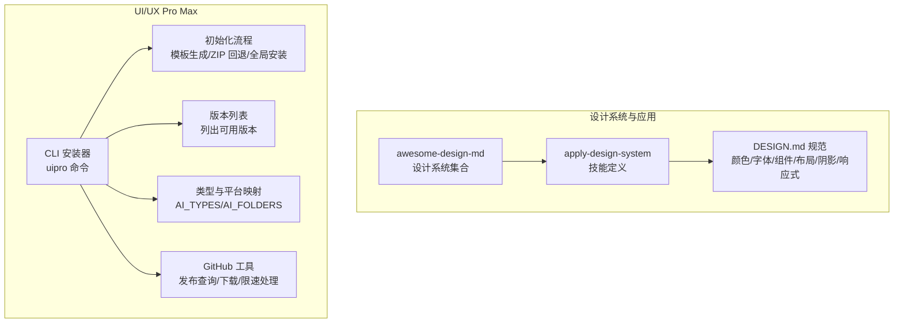
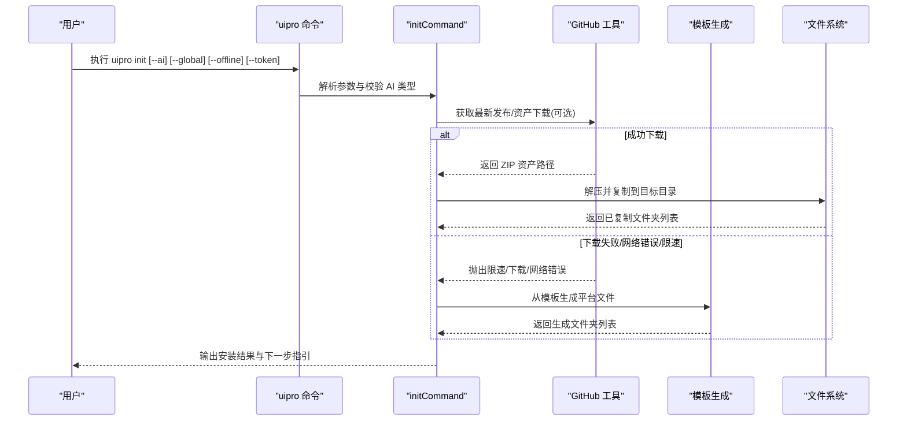

# API 参考文档

<cite>
**本文档引用的文件**
- [awesome-design-md/README.md](file://awesome-design-md/README.md)
- [awesome-design-md/CONTRIBUTING.md](file://awesome-design-md/CONTRIBUTING.md)
- [awesome-design-md/design-md/airbnb/DESIGN.md](file://awesome-design-md/design-md/airbnb/DESIGN.md)
- [awesome-design-md/skills/apply-design-system/SKILL.md](file://awesome-design-md/skills/apply-design-system/SKILL.md)
- [ui-ux-pro-max-skill/README.md](file://ui-ux-pro-max-skill/README.md)
- [ui-ux-pro-max-skill/cli/src/index.ts](file://ui-ux-pro-max-skill/cli/src/index.ts)
- [ui-ux-pro-max-skill/cli/src/commands/init.ts](file://ui-ux-pro-max-skill/cli/src/commands/init.ts)
- [ui-ux-pro-max-skill/cli/src/commands/versions.ts](file://ui-ux-pro-max-skill/cli/src/commands/versions.ts)
- [ui-ux-pro-max-skill/cli/src/utils/github.ts](file://ui-ux-pro-max-skill/cli/src/utils/github.ts)
- [ui-ux-pro-max-skill/cli/src/types/index.ts](file://ui-ux-pro-max-skill/cli/src/types/index.ts)
- [ui-ux-pro-max-skill/cli/package.json](file://ui-ux-pro-max-skill/cli/package.json)
</cite>

## 目录
1. [简介](#简介)
2. [项目结构](#项目结构)
3. [核心组件](#核心组件)
4. [架构总览](#架构总览)
5. [详细组件分析](#详细组件分析)
6. [依赖分析](#依赖分析)
7. [性能考虑](#性能考虑)
8. [故障排除指南](#故障排除指南)
9. [结论](#结论)
10. [附录](#附录)

## 简介
本参考文档面向开发者与技术用户，系统化梳理以下能力与接口：
- DESIGN.md 设计系统文档格式规范：字段定义、层级结构、语义角色与约束。
- SKILL.md 技能定义格式：技能元数据、参数提示、可用平台与工作流。
- CLI 命令行接口：安装器命令、选项与行为、错误处理与回退策略。
- 配置与版本管理：CLI 版本枚举、平台映射、环境变量与令牌使用。

文档提供参数说明、返回值定义、调用示例、错误处理与最佳实践，并解释各组件之间的关系与集成方式，同时给出版本兼容性与迁移建议。

## 项目结构
该仓库包含两大能力域：
- 设计系统集合与应用：提供大量真实网站提取的 DESIGN.md 文件，以及“应用设计系统”技能，用于在 AI 编码助手内直接套用品牌风格。
- UI/UX Pro Max 技能与 CLI 安装器：通过 CLI 将技能文件动态生成到不同 AI 平台的本地技能目录中，支持多平台、多版本与离线安装。

图表来源
- [awesome-design-md/README.md:1-250](file://awesome-design-md/README.md#L1-L250)
- [awesome-design-md/skills/apply-design-system/SKILL.md:1-139](file://awesome-design-md/skills/apply-design-system/SKILL.md#L1-L139)
- [ui-ux-pro-max-skill/README.md:1-649](file://ui-ux-pro-max-skill/README.md#L1-L649)
- [ui-ux-pro-max-skill/cli/src/index.ts:1-89](file://ui-ux-pro-max-skill/cli/src/index.ts#L1-L89)
- [ui-ux-pro-max-skill/cli/src/types/index.ts:1-70](file://ui-ux-pro-max-skill/cli/src/types/index.ts#L1-L70)
- [ui-ux-pro-max-skill/cli/src/utils/github.ts:1-128](file://ui-ux-pro-max-skill/cli/src/utils/github.ts#L1-L128)

章节来源
- [awesome-design-md/README.md:1-250](file://awesome-design-md/README.md#L1-L250)
- [ui-ux-pro-max-skill/README.md:1-649](file://ui-ux-pro-max-skill/README.md#L1-L649)

## 核心组件
- DESIGN.md 文档规范：描述视觉主题、配色角色、排版规则、组件样式、布局原则、深度与阴影、响应式行为、代理提示指南等九个部分，确保 AI 能准确生成一致 UI。
- SKILL.md 技能规范：定义技能名称、版本、描述、是否可由用户触发、参数提示、可用设计系统清单、工作流步骤、输出要求与注意事项。
- CLI 安装器：提供 init、versions、update、uninstall 四个命令；支持多 AI 平台类型、全局安装、离线模式、GitHub 令牌提升速率限制。
- GitHub 工具：封装发布查询、最新发布获取、资产下载、限速检测与错误分类。
- 类型与平台映射：统一 AI 平台枚举、安装类型、发布结构、平台文件夹映射，保障跨平台一致性。

章节来源
- [awesome-design-md/design-md/airbnb/DESIGN.md:1-546](file://awesome-design-md/design-md/airbnb/DESIGN.md#L1-L546)
- [awesome-design-md/skills/apply-design-system/SKILL.md:1-139](file://awesome-design-md/skills/apply-design-system/SKILL.md#L1-L139)
- [ui-ux-pro-max-skill/cli/src/index.ts:1-89](file://ui-ux-pro-max-skill/cli/src/index.ts#L1-L89)
- [ui-ux-pro-max-skill/cli/src/utils/github.ts:1-128](file://ui-ux-pro-max-skill/cli/src/utils/github.ts#L1-L128)
- [ui-ux-pro-max-skill/cli/src/types/index.ts:1-70](file://ui-ux-pro-max-skill/cli/src/types/index.ts#L1-L70)

## 架构总览
下图展示 CLI 初始化流程与 GitHub 工具交互、回退策略与平台生成的关系：

图表来源
- [ui-ux-pro-max-skill/cli/src/index.ts:25-86](file://ui-ux-pro-max-skill/cli/src/index.ts#L25-L86)
- [ui-ux-pro-max-skill/cli/src/commands/init.ts:121-221](file://ui-ux-pro-max-skill/cli/src/commands/init.ts#L121-L221)
- [ui-ux-pro-max-skill/cli/src/utils/github.ts:54-127](file://ui-ux-pro-max-skill/cli/src/utils/github.ts#L54-L127)

## 详细组件分析

### DESIGN.md 文档格式规范
- 结构与分区
  - 视觉主题与氛围：品牌情绪、密度、设计哲学。
  - 颜色与角色：语义名 + 十六进制 + 功能角色（主色、禁用、错误、表面、边框、文本等）。
  - 排版规则：字体族、字号层次表、字重、行高、字距。
  - 组件样式：按钮、卡片、输入、导航及其状态。
  - 布局原则：间距体系、网格、留白理念。
  - 深度与阴影：阴影系统、表面层级。
  - 行为与响应式：断点、触控目标、折叠策略。
  - 代理提示指南：快速色彩参考与即用提示。
- 数据模型要点
  - colors：键为语义名，值为十六进制色值或占位符引用。
  - typography：键为排版令牌，值为包含字体族、字号、字重、行高、字距等属性的对象。
  - rounded/spacing：键为令牌名，值为像素数值。
  - components：键为组件令牌，值为样式属性对象（背景色、文字色、圆角、内边距、高度、排版等）。
- 使用示例
  - 在 AI 生成 UI 时，严格使用 DESIGN.md 中的颜色十六进制与排版令牌，匹配组件圆角、阴影与布局。
  - 读取完整 DESIGN.md 再生成代码，避免表面级拼接导致不一致。
- 错误处理与最佳实践
  - 对于专有字体，使用 DESIGN.md 提供的 Web 可用回退栈。
  - 颜色可能因渲染上下文略有差异，需微调。
  - 不要将 DESIGN.md 视作精确复刻，而是“受启发的解读”。

章节来源
- [awesome-design-md/design-md/airbnb/DESIGN.md:1-546](file://awesome-design-md/design-md/airbnb/DESIGN.md#L1-L546)
- [awesome-design-md/README.md:204-227](file://awesome-design-md/README.md#L204-L227)

### SKILL.md 技能定义格式
- 元数据
  - name/version/description/user-invocable/argument-hint 等。
- 使用场景
  - 当用户请求“像某品牌一样”的 UI、指定设计语言、需要一致设计令牌时触发。
- 可用设计系统
  - 列表覆盖 AI/LLM 平台、开发者工具、后端数据库与 DevOps、生产力与 SaaS、设计与创意工具、金融科技与加密货币、电商与零售、媒体与消费科技、汽车、复古 Web 等类别。
- 工作流
  - 步骤一：识别目标品牌并定位 DESIGN.md。
  - 步骤二：读取 DESIGN.md 的九个部分。
  - 步骤三：生成 UI 时严格遵循颜色、排版、组件、布局、阴影与响应式。
  - 步骤四：依据“做/不做”守则进行校验与修正。
- 输出
  - 生成生产就绪的 UI 代码（React/Vue/HTML+CSS），附带所用设计令牌摘要与适配说明。

章节来源
- [awesome-design-md/skills/apply-design-system/SKILL.md:1-139](file://awesome-design-md/skills/apply-design-system/SKILL.md#L1-L139)

### CLI 命令行接口
- 命令与选项
  - init：安装 UI/UX Pro Max 技能至当前项目或全局目录；支持 --ai、--force、--offline、--global、--token。
  - versions：列出可用版本；支持 --token。
  - update：更新到最新版本；支持 --ai、--token。
  - uninstall：从当前项目或全局卸载；支持 --ai、--global。
- 参数说明
  - --ai：AI 平台类型，必须为 AI_TYPES 枚举之一；若未提供则自动检测并交互选择。
  - --force：覆盖现有文件。
  - --offline：兼容标志；模板安装使用捆绑资源。
  - --global：安装到用户主目录（~）而非当前项目。
  - --token：GitHub Personal Access Token，提升 API 速率限制。
- 行为与回退
  - 默认使用模板生成；若启用 --legacy 或网络异常/限速，则尝试从 GitHub 最新发布下载 ZIP 并解压；失败则回退到捆绑资源复制。
  - 支持全局安装，便于跨项目复用。
- 返回值与输出
  - 成功：打印安装的文件夹列表与成功消息；输出下一步指引。
  - 失败：spinner 失败提示，输出错误信息并退出非零码。

章节来源
- [ui-ux-pro-max-skill/cli/src/index.ts:25-86](file://ui-ux-pro-max-skill/cli/src/index.ts#L25-L86)
- [ui-ux-pro-max-skill/cli/src/commands/init.ts:121-221](file://ui-ux-pro-max-skill/cli/src/commands/init.ts#L121-L221)
- [ui-ux-pro-max-skill/cli/src/commands/versions.ts:10-47](file://ui-ux-pro-max-skill/cli/src/commands/versions.ts#L10-L47)
- [ui-ux-pro-max-skill/cli/src/types/index.ts:1-70](file://ui-ux-pro-max-skill/cli/src/types/index.ts#L1-L70)

### GitHub 工具与错误处理
- 功能
  - fetchReleases/getLatestRelease：查询发布列表与最新发布。
  - downloadRelease：下载资产到本地。
  - getAssetUrl：解析 ZIP 资产或归档链接。
  - 限速检测：403/429 自动抛出 GitHubRateLimitError；支持 UI_PRO_MAX_GITHUB_TOKEN/GITHUB_TOKEN 环境变量。
- 错误分类
  - GitHubRateLimitError：速率限制，提供令牌设置指导。
  - GitHubDownloadError：下载失败或网络异常。
- 最佳实践
  - 在 CI/本地脚本中设置令牌以避免限速。
  - 发生限速时优先回退到模板生成或捆绑资源。

章节来源
- [ui-ux-pro-max-skill/cli/src/utils/github.ts:1-128](file://ui-ux-pro-max-skill/cli/src/utils/github.ts#L1-L128)

### 类型与平台映射
- AI 类型枚举：包含 claude、cursor、windsurf、antigravity、copilot、kiro、roocode、codex、qoder、gemini、trae、opencode、continue、codebuddy、droid、kilocode、warp、augment、all。
- 安装类型：full/reference。
- 发布结构：tag_name/name/published_at/html_url/assets。
- 平台配置：包含平台标识、显示名、安装类型、文件夹结构、脚本路径、前置元数据、分节开关、标题、描述、技能或工作流类型。
- 平台文件夹映射：历史 ZIP 安装保留的目录映射，新平台（如 kilocode、warp、augment）包含 .shared 以保持卸载一致性。

章节来源
- [ui-ux-pro-max-skill/cli/src/types/index.ts:1-70](file://ui-ux-pro-max-skill/cli/src/types/index.ts#L1-L70)

## 依赖分析
- CLI 依赖
  - commander：命令与选项解析。
  - chalk/ora/prompts：终端输出、加载动画、交互式问答。
  - TypeScript 类型：确保类型安全。
- CLI 包元数据
  - 可执行入口：bin.uipro 指向 dist/index.js。
  - 构建脚本：build/dev/typecheck/prepublishOnly。
  - 关键关键词：ui、ux、design、claude、cursor、windsurf、copilot、kiro、trae、roocode、codex、qoder、ai、skill。

章节来源
- [ui-ux-pro-max-skill/cli/package.json:1-52](file://ui-ux-pro-max-skill/cli/package.json#L1-L52)

## 性能考虑
- 速率限制优化
  - 使用 GitHub 令牌提升 API 速率，减少等待时间。
  - 在网络不稳定或限速时，优先模板生成，避免长时间等待。
- 安装策略
  - 模板生成避免大体积 ZIP 下载，适合首次安装与离线场景。
  - 全局安装减少重复下载，提升跨项目切换效率。
- 生成质量
  - 通过 DESIGN.md 的完整读取与严格遵循，降低返工成本。

## 故障排除指南
- 未知命令
  - 现象：出现 unknown command 'uninstall'/'update'。
  - 原因：已安装的 CLI 版本过旧。
  - 处理：先升级全局包再重试。
- 未检测到已安装目录
  - 现象：uninstall 提示未检测到 AI 技能目录。
  - 原因：在错误目录运行或使用了不同的安装位置。
  - 处理：在原项目根目录运行，或使用 --global 卸载全局安装。
- Marketplace 安装失败（符号链接）
  - 现象：Zip 文件包含符号链接导致安装失败。
  - 处理：改用 CLI 安装器，或等待后续版本修复。
- 权限错误（macOS/Linux）
  - 现象：npm 全局安装权限不足。
  - 处理：使用节点版本管理器或 sudo；也可使用 npx 临时运行。
- Python 未找到
  - 现象：运行设计系统搜索脚本报错。
  - 处理：根据操作系统安装 Python 3.x。
- 输出截断/字段被裁剪
  - 现象：ASCII/Markdown 输出被截断。
  - 处理：使用 --max-length 0 取消截断限制。

章节来源
- [ui-ux-pro-max-skill/README.md:564-633](file://ui-ux-pro-max-skill/README.md#L564-L633)

## 结论
本参考文档系统化梳理了 DESIGN.md 与 SKILL.md 的格式规范、CLI 的命令与实现细节、GitHub 工具的错误处理与回退策略，以及类型与平台映射。通过遵循这些规范与最佳实践，开发者可在多 AI 平台上稳定地应用品牌设计系统，实现一致且高质量的 UI 生成与交付。

## 附录

### API 调用示例与最佳实践
- 应用设计系统（技能）
  - 触发条件：用户请求“像某品牌一样”的 UI 或明确指定设计语言。
  - 工作流：读取对应 DESIGN.md 的九个部分，严格遵循颜色、排版、组件、布局、阴影与响应式；最后对照“做/不做”守则校验。
  - 示例路径：[apply-design-system 工作流:68-121](file://awesome-design-md/skills/apply-design-system/SKILL.md#L68-L121)
- CLI 安装器
  - 安装：uipro init --ai <platform>；支持 --global、--offline、--token。
  - 查看版本：uipro versions；支持 --token。
  - 更新：uipro update；支持 --ai、--token。
  - 卸载：uipro uninstall；支持 --ai、--global。
  - 示例路径：[命令注册与选项:25-86](file://ui-ux-pro-max-skill/cli/src/index.ts#L25-L86)，[初始化流程:121-221](file://ui-ux-pro-max-skill/cli/src/commands/init.ts#L121-L221)，[版本列表:10-47](file://ui-ux-pro-max-skill/cli/src/commands/versions.ts#L10-L47)

### 版本兼容性与迁移指南
- CLI 版本
  - 当前 CLI 包版本：参见 [package.json:2-4](file://ui-ux-pro-max-skill/cli/package.json#L2-L4)。
  - 版本列表：通过 uipro versions 查看；更新 CLI 包后再执行 init。
- 平台映射
  - 新增平台（如 kilocode、warp、augment）包含 .shared 以保持卸载一致性；历史 ZIP 安装保留 AI_FOLDERS 映射。
  - 示例路径：[平台映射:47-70](file://ui-ux-pro-max-skill/cli/src/types/index.ts#L47-L70)
- 迁移建议
  - 从 Marketplace/ZIP 安装迁移到 CLI：先升级 CLI 包，再使用 uipro init --ai <platform> 安装。
  - 若遇到限速问题，设置 UI_PRO_MAX_GITHUB_TOKEN 或 GITHUB_TOKEN 环境变量。

章节来源
- [ui-ux-pro-max-skill/cli/package.json:1-52](file://ui-ux-pro-max-skill/cli/package.json#L1-L52)
- [ui-ux-pro-max-skill/cli/src/types/index.ts:47-70](file://ui-ux-pro-max-skill/cli/src/types/index.ts#L47-L70)
- [ui-ux-pro-max-skill/README.md:547-563](file://ui-ux-pro-max-skill/README.md#L547-L563)