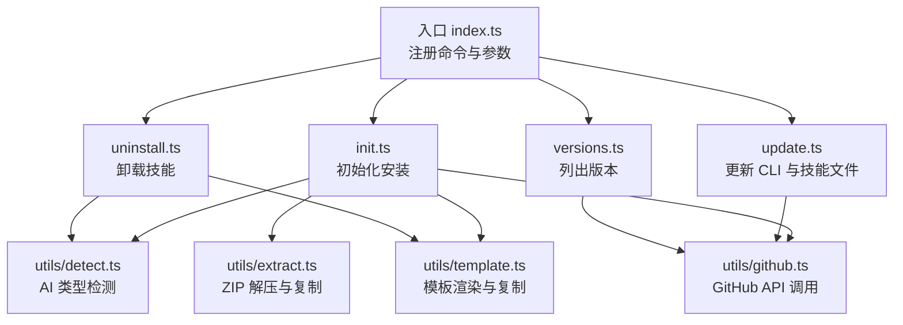
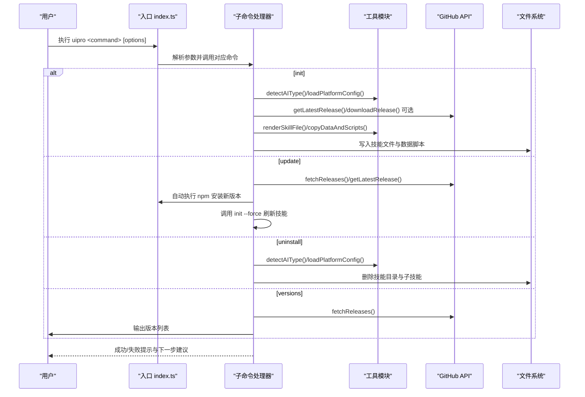
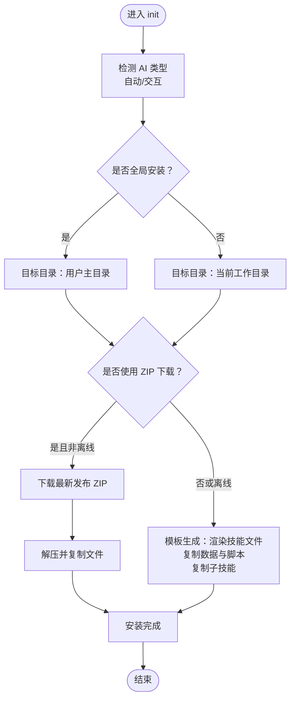
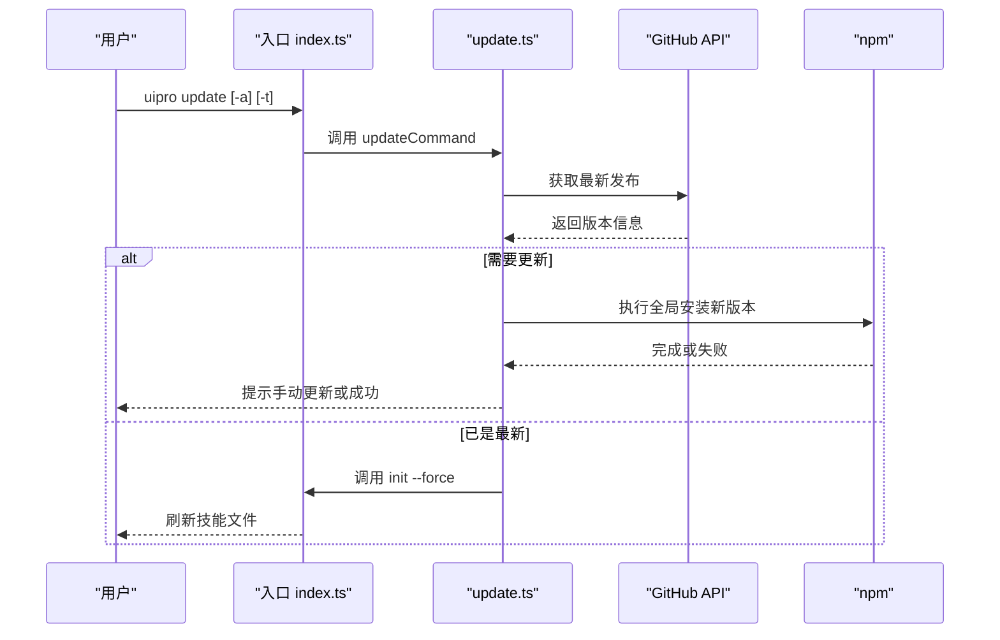
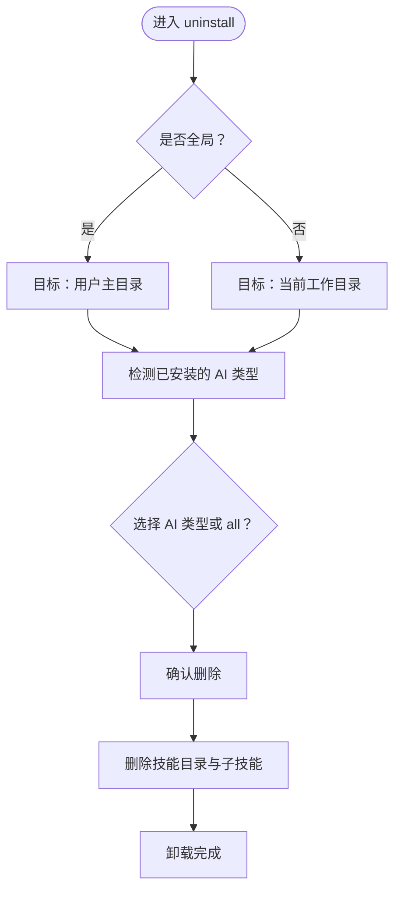
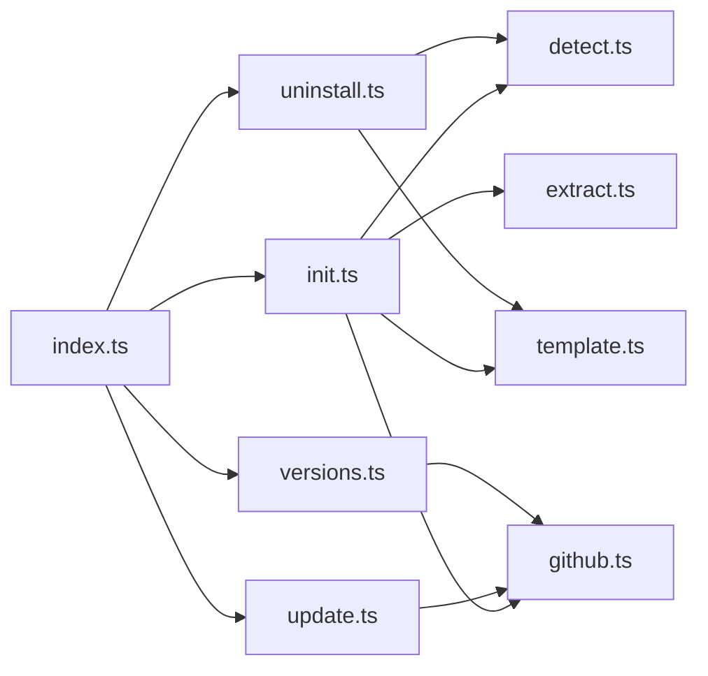

# CLI 命令参考

<cite>
**本文引用的文件**
- [cli/src/index.ts](file://ui-ux-pro-max-skill/cli/src/index.ts)
- [cli/package.json](file://ui-ux-pro-max-skill/cli/package.json)
- [cli/README.md](file://ui-ux-pro-max-skill/cli/README.md)
- [cli/src/commands/init.ts](file://ui-ux-pro-max-skill/cli/src/commands/init.ts)
- [cli/src/commands/update.ts](file://ui-ux-pro-max-skill/cli/src/commands/update.ts)
- [cli/src/commands/uninstall.ts](file://ui-ux-pro-max-skill/cli/src/commands/uninstall.ts)
- [cli/src/commands/versions.ts](file://ui-ux-pro-max-skill/cli/src/commands/versions.ts)
- [cli/src/types/index.ts](file://ui-ux-pro-max-skill/cli/src/types/index.ts)
- [cli/src/utils/detect.ts](file://ui-ux-pro-max-skill/cli/src/utils/detect.ts)
- [cli/src/utils/github.ts](file://ui-ux-pro-max-skill/cli/src/utils/github.ts)
- [cli/src/utils/template.ts](file://ui-ux-pro-max-skill/cli/src/utils/template.ts)
- [cli/src/utils/extract.ts](file://ui-ux-pro-max-skill/cli/src/utils/extract.ts)
- [cli/src/utils/logger.ts](file://ui-ux-pro-max-skill/cli/src/utils/logger.ts)
</cite>

## 目录
1. [简介](#简介)
2. [项目结构](#项目结构)
3. [核心组件](#核心组件)
4. [架构总览](#架构总览)
5. [详细组件分析](#详细组件分析)
6. [依赖关系分析](#依赖关系分析)
7. [性能与可用性](#性能与可用性)
8. [故障排查指南](#故障排查指南)
9. [结论](#结论)
10. [附录：命令速查表](#附录命令速查表)

## 简介
本文件为 UI/UX Pro Max 设计系统生成器的 CLI 命令参考，覆盖 init、update、uninstall、versions 四个核心命令的完整语法、参数、选项、行为流程、输出格式与错误处理策略。同时提供 GitHub 认证、离线安装、全局安装、批量安装等高级用法与自动化集成建议。

## 项目结构
CLI 位于 ui-ux-pro-max-skill/cli 目录，采用模块化组织：
- 入口文件负责解析命令与参数，分发到各子命令
- 子命令实现具体逻辑（初始化、更新、卸载、版本查询）
- 类型定义集中于 types/index.ts
- 工具模块涵盖检测、模板渲染、GitHub API、压缩包提取等

图表来源
- [cli/src/index.ts:18-88](file://ui-ux-pro-max-skill/cli/src/index.ts#L18-L88)
- [cli/src/commands/init.ts:121-221](file://ui-ux-pro-max-skill/cli/src/commands/init.ts#L121-L221)
- [cli/src/commands/update.ts:30-95](file://ui-ux-pro-max-skill/cli/src/commands/update.ts#L30-L95)
- [cli/src/commands/uninstall.ts:60-157](file://ui-ux-pro-max-skill/cli/src/commands/uninstall.ts#L60-L157)
- [cli/src/commands/versions.ts:10-47](file://ui-ux-pro-max-skill/cli/src/commands/versions.ts#L10-L47)
- [cli/src/utils/detect.ts:10-77](file://ui-ux-pro-max-skill/cli/src/utils/detect.ts#L10-L77)
- [cli/src/utils/template.ts:233-301](file://ui-ux-pro-max-skill/cli/src/utils/template.ts#L233-L301)
- [cli/src/utils/github.ts:54-127](file://ui-ux-pro-max-skill/cli/src/utils/github.ts#L54-L127)
- [cli/src/utils/extract.ts:35-88](file://ui-ux-pro-max-skill/cli/src/utils/extract.ts#L35-L88)

章节来源
- [cli/src/index.ts:1-89](file://ui-ux-pro-max-skill/cli/src/index.ts#L1-L89)
- [cli/package.json:1-52](file://ui-ux-pro-max-skill/cli/package.json#L1-L52)

## 核心组件
- 命令入口与参数解析：通过 commander 注册命令、描述、版本与选项，将参数传递给对应命令处理器
- 子命令实现：init、update、uninstall、versions 各自封装业务逻辑
- 类型系统：统一管理 AI 类型、平台配置、发布信息等
- 工具库：检测 AI 类型、模板渲染、GitHub API、ZIP 提取、日志输出

章节来源
- [cli/src/index.ts:18-88](file://ui-ux-pro-max-skill/cli/src/index.ts#L18-L88)
- [cli/src/types/index.ts:1-70](file://ui-ux-pro-max-skill/cli/src/types/index.ts#L1-L70)

## 架构总览
CLI 的控制流从入口开始，根据用户输入选择命令，命令内部调用工具模块完成下载、模板渲染或文件删除等操作，并以 ora 进度条与 chalk 输出反馈。

图表来源
- [cli/src/index.ts:25-88](file://ui-ux-pro-max-skill/cli/src/index.ts#L25-L88)
- [cli/src/commands/init.ts:121-221](file://ui-ux-pro-max-skill/cli/src/commands/init.ts#L121-L221)
- [cli/src/commands/update.ts:30-95](file://ui-ux-pro-max-skill/cli/src/commands/update.ts#L30-L95)
- [cli/src/commands/uninstall.ts:60-157](file://ui-ux-pro-max-skill/cli/src/commands/uninstall.ts#L60-L157)
- [cli/src/commands/versions.ts:10-47](file://ui-ux-pro-max-skill/cli/src/commands/versions.ts#L10-L47)
- [cli/src/utils/github.ts:54-127](file://ui-ux-pro-max-skill/cli/src/utils/github.ts#L54-L127)
- [cli/src/utils/template.ts:233-301](file://ui-ux-pro-max-skill/cli/src/utils/template.ts#L233-L301)

## 详细组件分析

### 命令：init 初始化安装
用途：在当前项目或全局位置安装 UI/UX Pro Max 技能，支持指定 AI 助手类型、强制覆盖、离线模式、GitHub 认证等。

- 基本语法
  - uipro init [-a|--ai <type>] [-f|--force] [-o|--offline] [-g|--global] [-t|--token <token>]
- 参数与选项
  - -a, --ai <type>：AI 助手类型，可选值见“AI 类型”小节
  - -f, --force：强制覆盖已存在文件
  - -o, --offline：兼容标志；模板安装使用内置资源
  - -g, --global：安装到用户主目录（~）而非当前项目
  - -t, --token <token>：用于提高 GitHub API 速率限制的个人访问令牌
- 行为流程
  - 若未指定 --ai，则尝试自动检测当前项目中已存在的技能目录，必要时交互式选择
  - 默认使用模板生成方式：加载平台配置、渲染技能内容、写入文件、复制数据与脚本、复制子技能
  - 支持回退到 ZIP 下载安装（旧方法），当网络受限或离线时优先使用内置资源
  - 全局安装会调整脚本路径为绝对路径（~/{root}/）
- 输出与反馈
  - 使用 ora 显示进度，成功后列出安装的根目录
  - 给出下一步建议（重启 AI 编程助手、尝试构建任务）
- 错误处理
  - 非法 AI 类型：打印错误并退出
  - GitHub 速率限制：提示设置令牌或使用内置资源
  - 网络错误：回退到模板生成
  - 其他异常：失败提示与错误消息，退出码 1

图表来源
- [cli/src/commands/init.ts:121-221](file://ui-ux-pro-max-skill/cli/src/commands/init.ts#L121-L221)
- [cli/src/utils/template.ts:233-301](file://ui-ux-pro-max-skill/cli/src/utils/template.ts#L233-L301)
- [cli/src/utils/extract.ts:125-150](file://ui-ux-pro-max-skill/cli/src/utils/extract.ts#L125-L150)

章节来源
- [cli/src/commands/init.ts:25-46](file://ui-ux-pro-max-skill/cli/src/commands/init.ts#L25-L46)
- [cli/src/commands/init.ts:121-221](file://ui-ux-pro-max-skill/cli/src/commands/init.ts#L121-L221)
- [cli/src/utils/detect.ts:10-77](file://ui-ux-pro-max-skill/cli/src/utils/detect.ts#L10-L77)
- [cli/src/utils/template.ts:233-301](file://ui-ux-pro-max-skill/cli/src/utils/template.ts#L233-L301)
- [cli/src/utils/extract.ts:35-88](file://ui-ux-pro-max-skill/cli/src/utils/extract.ts#L35-L88)
- [cli/src/utils/github.ts:54-127](file://ui-ux-pro-max-skill/cli/src/utils/github.ts#L54-L127)

### 命令：update 更新 CLI 与技能
用途：检查并更新全局安装的 CLI 至最新版本，若已是最新则刷新当前项目的技能文件。

- 基本语法
  - uipro update [-a|--ai <type>] [-t|--token <token>]
- 参数与选项
  - -a, --ai <type>：可选，指定刷新技能时使用的 AI 类型
  - -t, --token <token>：GitHub 令牌
- 行为流程
  - 检查最新发布版本号，与本地版本比较
  - 若需要更新：在 Windows 上通过 npm.cmd，在其他平台通过 npm 执行全局安装
  - 更新失败：提示手动更新并退出
  - 若已是最新：调用 init --force 刷新技能文件
- 输出与反馈
  - 显示最新版本、当前版本、更新结果
  - 给出后续运行 init --force 的建议
- 错误处理
  - 版本检查失败：失败提示与错误消息，退出码 1

图表来源
- [cli/src/commands/update.ts:30-95](file://ui-ux-pro-max-skill/cli/src/commands/update.ts#L30-L95)
- [cli/src/utils/github.ts:74-92](file://ui-ux-pro-max-skill/cli/src/utils/github.ts#L74-L92)

章节来源
- [cli/src/commands/update.ts:15-95](file://ui-ux-pro-max-skill/cli/src/commands/update.ts#L15-L95)

### 命令：uninstall 卸载
用途：从当前项目或全局位置移除 UI/UX Pro Max 技能及其子技能。

- 基本语法
  - uipro uninstall [-a|--ai <type>] [-g|--global]
- 参数与选项
  - -a, --ai <type>：可选，指定卸载的 AI 类型；支持 all
  - -g, --global：从用户主目录卸载
- 行为流程
  - 自动检测已安装的技能目录，必要时交互式选择
  - 确认后删除技能目录及所有捆绑的子技能
  - 处理不同平台的目录结构差异（如 copilot 在 .github/prompts/）
- 输出与反馈
  - 列出被删除的路径
  - 成功提示与下一步建议
- 错误处理
  - 无匹配目录：提示未检测到安装
  - 权限错误：抛出异常并退出

图表来源
- [cli/src/commands/uninstall.ts:60-157](file://ui-ux-pro-max-skill/cli/src/commands/uninstall.ts#L60-L157)
- [cli/src/utils/template.ts:205-226](file://ui-ux-pro-max-skill/cli/src/utils/template.ts#L205-L226)

章节来源
- [cli/src/commands/uninstall.ts:13-157](file://ui-ux-pro-max-skill/cli/src/commands/uninstall.ts#L13-L157)

### 命令：versions 版本列表
用途：列出可用的发布版本，便于了解当前 CLI 的版本状态。

- 基本语法
  - uipro versions [-t|--token <token>]
- 参数与选项
  - -t, --token <token>：GitHub 令牌
- 行为流程
  - 调用 GitHub Releases 接口获取版本列表
  - 输出最新版本标记与日期，其余版本按时间倒序
- 输出与反馈
  - 显示版本数量与列表
  - 提示先更新 CLI 包再重新初始化
- 错误处理
  - 无法获取版本：失败提示与错误消息，退出码 1

章节来源
- [cli/src/commands/versions.ts:10-47](file://ui-ux-pro-max-skill/cli/src/commands/versions.ts#L10-L47)
- [cli/src/utils/github.ts:54-72](file://ui-ux-pro-max-skill/cli/src/utils/github.ts#L54-L72)

### AI 类型与平台配置
- 支持的 AI 类型（部分示例）
  - claude、cursor、windsurf、antigravity、copilot、kiro、codex、roocode、qoder、gemini、trae、opencode、continue、codebuddy、droid、kilocode、warp、augment、all
- 平台配置
  - 每个 AI 类型对应一个平台配置，包含显示名、安装类型、目录结构、脚本路径、前端元数据、快速参考开关等
  - 模板渲染时替换占位符并按需调整脚本路径（全局安装）

章节来源
- [cli/src/types/index.ts:1-70](file://ui-ux-pro-max-skill/cli/src/types/index.ts#L1-L70)
- [cli/src/utils/template.ts:63-90](file://ui-ux-pro-max-skill/cli/src/utils/template.ts#L63-L90)

### GitHub 认证与速率限制
- 支持三种认证方式（优先级从高到低）
  - 命令行参数 --token
  - 项目环境变量 UI_PRO_MAX_GITHUB_TOKEN
  - 回退环境变量 GITHUB_TOKEN
- 速率限制
  - 当达到 GitHub API 速率限制时，抛出特定错误并给出令牌创建与使用的指导
- 下载与发布
  - 支持直接下载 ZIP 或回退到 GitHub 自动生成的归档链接

章节来源
- [cli/src/utils/github.ts:23-52](file://ui-ux-pro-max-skill/cli/src/utils/github.ts#L23-L52)
- [cli/src/utils/github.ts:33-47](file://ui-ux-pro-max-skill/cli/src/utils/github.ts#L33-L47)
- [cli/src/utils/github.ts:94-127](file://ui-ux-pro-max-skill/cli/src/utils/github.ts#L94-L127)

## 依赖关系分析
- 入口依赖 commander 实现命令行解析
- 子命令依赖工具模块完成检测、模板渲染、GitHub API、ZIP 提取、日志输出
- 类型系统集中定义 AI 类型、平台配置与发布信息

图表来源
- [cli/src/index.ts:3-12](file://ui-ux-pro-max-skill/cli/src/index.ts#L3-L12)
- [cli/src/commands/init.ts:1-12](file://ui-ux-pro-max-skill/cli/src/commands/init.ts#L1-L12)
- [cli/src/commands/update.ts:1-11](file://ui-ux-pro-max-skill/cli/src/commands/update.ts#L1-L11)
- [cli/src/commands/uninstall.ts:1-11](file://ui-ux-pro-max-skill/cli/src/commands/uninstall.ts#L1-L11)
- [cli/src/commands/versions.ts:1-8](file://ui-ux-pro-max-skill/cli/src/commands/versions.ts#L1-L8)

章节来源
- [cli/src/index.ts:1-16](file://ui-ux-pro-max-skill/cli/src/index.ts#L1-L16)

## 性能与可用性
- 模板生成方式默认启用，避免网络下载，适合离线或网络受限场景
- ZIP 下载安装作为回退机制，仅在网络可用且非离线时优先使用
- 全局安装时对脚本路径进行绝对化处理，提升跨项目复用能力
- 交互式选择与自动检测减少用户输入成本

## 故障排查指南
- 无效 AI 类型
  - 现象：命令立即失败并提示合法类型
  - 处理：使用 --ai 指定受支持的类型之一
- GitHub 速率限制
  - 现象：出现速率限制错误提示
  - 处理：设置 UI_PRO_MAX_GITHUB_TOKEN 或使用 --token；或切换到模板安装
- 网络错误
  - 现象：下载失败或网络超时
  - 处理：回退到模板生成；确保代理或防火墙允许访问 GitHub
- 权限不足（Windows）
  - 现象：更新失败，提示需要管理员权限
  - 处理：以管理员身份运行终端或手动执行更新命令
- 未检测到安装
  - 现象：卸载时提示未检测到任何已安装目录
  - 处理：确认是否在正确的项目目录或使用 --global

章节来源
- [cli/src/commands/init.ts:78-96](file://ui-ux-pro-max-skill/cli/src/commands/init.ts#L78-L96)
- [cli/src/commands/update.ts:65-70](file://ui-ux-pro-max-skill/cli/src/commands/update.ts#L65-L70)
- [cli/src/commands/uninstall.ts:74-77](file://ui-ux-pro-max-skill/cli/src/commands/uninstall.ts#L74-L77)

## 结论
该 CLI 提供了从安装、更新到卸载的完整生命周期管理，结合模板渲染与 GitHub API，既保证了离线可用性，又提供了最新的技能资源。通过明确的参数与选项、完善的错误处理与交互提示，能够满足个人开发者与团队在多 AI 平台上的快速落地需求。

## 附录：命令速查表
- uipro init
  - 作用：安装 UI/UX Pro Max 技能
  - 关键选项：--ai, --force, --offline, --global, --token
  - 输出：安装的根目录列表、下一步建议
- uipro update
  - 作用：更新 CLI 并刷新技能文件
  - 关键选项：--ai, --token
  - 输出：更新结果与后续 init 建议
- uipro uninstall
  - 作用：卸载技能
  - 关键选项：--ai, --global
  - 输出：被删除的路径列表
- uipro versions
  - 作用：列出可用版本
  - 关键选项：--token
  - 输出：版本列表与日期

章节来源
- [cli/README.md:11-37](file://ui-ux-pro-max-skill/cli/README.md#L11-L37)
- [cli/src/index.ts:25-88](file://ui-ux-pro-max-skill/cli/src/index.ts#L25-L88)