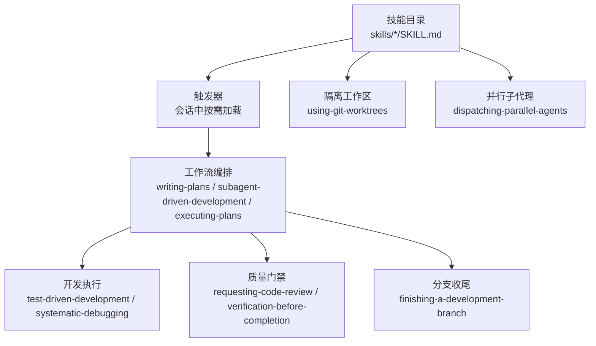
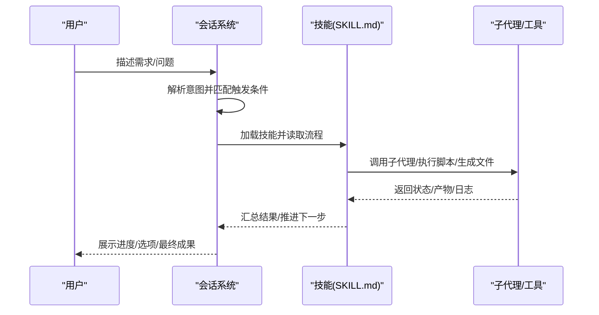
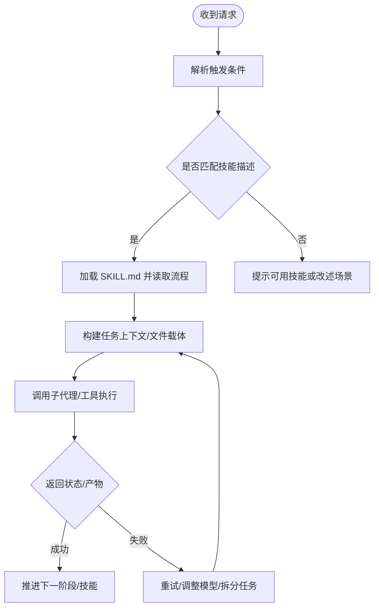
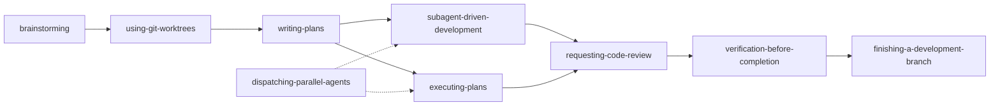
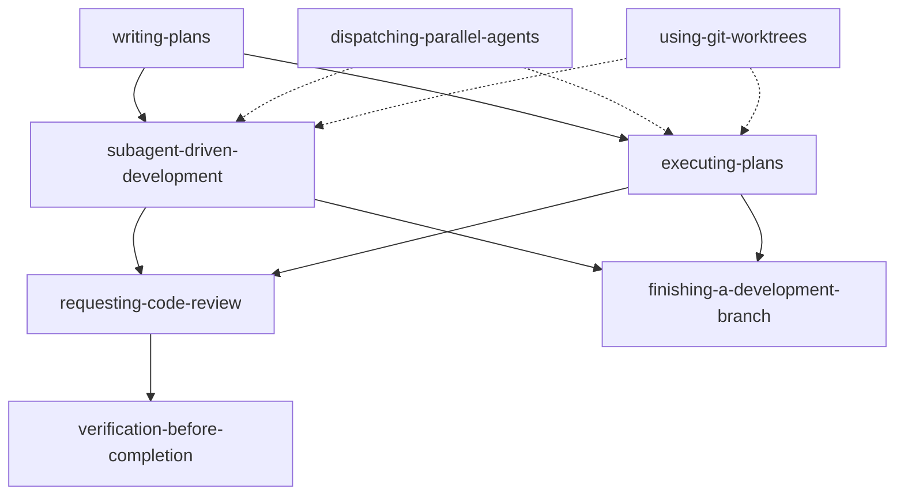

# 技能系统接口

<cite>
**本文档引用的文件**
- [superpowers/README.md](file://superpowers/README.md)
- [superpowers/skills/brainstorming/SKILL.md](file://superpowers/skills/brainstorming/SKILL.md)
- [superpowers/skills/dispatching-parallel-agents/SKILL.md](file://superpowers/skills/dispatching-parallel-agents/SKILL.md)
- [superpowers/skills/executing-plans/SKILL.md](file://superpowers/skills/executing-plans/SKILL.md)
- [superpowers/skills/subagent-driven-development/SKILL.md](file://superpowers/skills/subagent-driven-development/SKILL.md)
- [superpowers/skills/systematic-debugging/SKILL.md](file://superpowers/skills/systematic-debugging/SKILL.md)
- [superpowers/skills/writing-skills/SKILL.md](file://superpowers/skills/writing-skills/SKILL.md)
- [superpowers/skills/test-driven-development/SKILL.md](file://superpowers/skills/test-driven-development/SKILL.md)
- [superpowers/skills/requesting-code-review/SKILL.md](file://superpowers/skills/requesting-code-review/SKILL.md)
- [superpowers/skills/verification-before-completion/SKILL.md](file://superpowers/skills/verification-before-completion/SKILL.md)
- [superpowers/skills/finishing-a-development-branch/SKILL.md](file://superpowers/skills/finishing-a-development-branch/SKILL.md)
- [superpowers/skills/using-git-worktrees/SKILL.md](file://superpowers/skills/using-git-worktrees/SKILL.md)
- [superpowers/skills/writing-plans/SKILL.md](file://superpowers/skills/writing-plans/SKILL.md)
- [superpowers/tests/explicit-skill-requests/run-multiturn-test.sh](file://superpowers/tests/explicit-skill-requests/run-multiturn-test.sh)
- [superpowers/tests/explicit-skill-requests/run-extended-multiturn-test.sh](file://superpowers/tests/explicit-skill-requests/run-extended-multiturn-test.sh)
</cite>

## 目录
1. [简介](#简介)
2. [项目结构](#项目结构)
3. [核心组件](#核心组件)
4. [架构总览](#架构总览)
5. [详细组件分析](#详细组件分析)
6. [依赖分析](#依赖分析)
7. [性能考虑](#性能考虑)
8. [故障排除指南](#故障排除指南)
9. [结论](#结论)
10. [附录](#附录)

## 简介
本文件系统化梳理了 Superpowers 技能系统的接口与工作流，重点围绕 SKILL.md 技能定义格式、触发机制、参数传递规则、返回值格式与执行流程展开。文档同时覆盖技能之间的依赖关系与组合使用方式，提供工作流自动化、多平台兼容性与最佳实践建议。

## 项目结构
Superpowers 将“技能”作为可组合的最小单元，通过统一的 SKILL.md 文件规范描述触发条件、流程与约束。各技能在不同阶段自动或显式触发，形成从“设计-计划-实现-评审-收尾”的闭环。

图示来源
- [superpowers/README.md:200-217](file://superpowers/README.md#L200-L217)
- [superpowers/skills/writing-plans/SKILL.md:1-175](file://superpowers/skills/writing-plans/SKILL.md#L1-L175)
- [superpowers/skills/subagent-driven-development/SKILL.md:1-419](file://superpowers/skills/subagent-driven-development/SKILL.md#L1-L419)
- [superpowers/skills/executing-plans/SKILL.md:1-71](file://superpowers/skills/executing-plans/SKILL.md#L1-L71)

章节来源
- [superpowers/README.md:200-217](file://superpowers/README.md#L200-L217)

## 核心组件
- 触发条件（Description）：严格限定为“何时使用”，不总结流程；用于会话前的技能筛选与加载。
- 前言元数据（YAML Frontmatter）：包含 name、description 等字段，遵循 agentskills.io 规范。
- 流程与约束：以步骤、决策点、检查清单与图示呈现，确保可复制与可验证。
- 子技能与工具：通过“必需子技能”“脚本/模板”等约定，串联复杂工作流。

章节来源
- [superpowers/skills/writing-skills/SKILL.md:94-137](file://superpowers/skills/writing-skills/SKILL.md#L94-L137)
- [superpowers/skills/writing-skills/SKILL.md:144-180](file://superpowers/skills/writing-skills/SKILL.md#L144-L180)

## 架构总览
技能系统采用“前置触发 + 分层工作流”的架构：会话启动后由系统根据上下文与历史选择合适技能；技能内部再组织子任务、评审与收尾动作，形成端到端的工程化流水线。

图示来源
- [superpowers/skills/subagent-driven-development/SKILL.md:47-83](file://superpowers/skills/subagent-driven-development/SKILL.md#L47-L83)
- [superpowers/skills/writing-plans/SKILL.md:156-175](file://superpowers/skills/writing-plans/SKILL.md#L156-L175)

## 详细组件分析

### SKILL.md 技能定义格式
- YAML 前言元数据
  - 必填字段：name、description
  - name 仅允许字母、数字与连字符
  - description 使用第三人称，聚焦“触发条件”，避免总结流程
  - 总长度限制与关键词优化，提升发现率
- 正文结构
  - 概述：核心原则与一句话总结
  - 何时使用：简要流程图或清单
  - 快速参考：表格/要点便于扫描
  - 实施细节：内联代码或指向工具文件
  - 常见误区与红灯：明确禁止项与风险信号
- 发现优化（SDO）
  - 丰富的触发词（症状、错误、工具名）
  - 关键字覆盖（超时/挂起/僵尸/清理等）
  - 名称采用动词优先、主动语态
  - 内容压缩与交叉引用，控制 token 成本

章节来源
- [superpowers/skills/writing-skills/SKILL.md:94-137](file://superpowers/skills/writing-skills/SKILL.md#L94-L137)
- [superpowers/skills/writing-skills/SKILL.md:140-180](file://superpowers/skills/writing-skills/SKILL.md#L140-L180)
- [superpowers/skills/writing-skills/SKILL.md:278-317](file://superpowers/skills/writing-skills/SKILL.md#L278-L317)

### 触发机制与参数传递
- 自动触发
  - 系统在关键节点（如开始实现、完成设计、准备分支）自动加载相关技能
  - 通过 description 的触发条件进行匹配，避免流程总结导致的误触发
- 显式请求
  - 支持在对话中直接请求某技能名称，系统解析并加载对应 SKILL.md
  - 测试脚本验证了多轮对话中对技能名称的识别与加载
- 参数与上下文
  - 技能通过“任务简报/报告文件”“评审包”“Git 提交范围”等文件化载体传递参数
  - 子代理仅接收其任务所需上下文，避免上下文污染

图示来源
- [superpowers/tests/explicit-skill-requests/run-multiturn-test.sh:70-102](file://superpowers/tests/explicit-skill-requests/run-multiturn-test.sh#L70-L102)
- [superpowers/tests/explicit-skill-requests/run-extended-multiturn-test.sh:45-89](file://superpowers/tests/explicit-skill-requests/run-extended-multiturn-test.sh#L45-L89)

章节来源
- [superpowers/tests/explicit-skill-requests/run-multiturn-test.sh:70-102](file://superpowers/tests/explicit-skill-requests/run-multiturn-test.sh#L70-L102)
- [superpowers/tests/explicit-skill-requests/run-extended-multiturn-test.sh:45-89](file://superpowers/tests/explicit-skill-requests/run-extended-multiturn-test.sh#L45-L89)

### 返回值格式与执行流程
- 子代理输出
  - 状态码：DONE、DONE_WITH_CONCERNS、NEEDS_CONTEXT、BLOCKED
  - 产物：任务报告文件、差异包、测试结果摘要
- 评审流程
  - 两阶段评审：规范符合性（Spec）→ 代码质量（Quality）
  - 对于无法从差异验证的问题，需人工复核并记录
- 工作树与分支
  - 使用 using-git-worktrees 确保隔离工作区
  - 结束阶段通过 finishing-a-development-branch 提供合并/PR/保留/丢弃四选一菜单

章节来源
- [superpowers/skills/subagent-driven-development/SKILL.md:132-149](file://superpowers/skills/subagent-driven-development/SKILL.md#L132-L149)
- [superpowers/skills/requesting-code-review/SKILL.md:24-47](file://superpowers/skills/requesting-code-review/SKILL.md#L24-L47)
- [superpowers/skills/finishing-a-development-branch/SKILL.md:66-92](file://superpowers/skills/finishing-a-development-branch/SKILL.md#L66-L92)

### 技能组合与依赖关系
- 设计-计划-执行闭环
  - 设计：brainstorming → using-git-worktrees → writing-plans
  - 执行：subagent-driven-development 或 executing-plans
  - 质量：requesting-code-review、verification-before-completion
  - 收尾：finishing-a-development-branch
- 并行与隔离
  - dispatching-parallel-agents 与 using-git-worktrees 可并行使用，避免共享状态冲突
- 典型组合
  - 新功能：brainstorming → writing-plans → subagent-driven-development → code-review → finish
  - 修复缺陷：systematic-debugging → test-driven-development → verification-before-completion → code-review → finish

图示来源
- [superpowers/README.md:200-217](file://superpowers/README.md#L200-L217)
- [superpowers/skills/writing-plans/SKILL.md:156-175](file://superpowers/skills/writing-plans/SKILL.md#L156-L175)

章节来源
- [superpowers/README.md:200-217](file://superpowers/README.md#L200-L217)

### 集成示例
- 在 Claude Code 中安装并启用 Superpowers 插件，系统会在合适时机自动加载技能
- 在 Cursor、Pi、OpenCode 等平台上通过插件管理器安装，支持相同技能集
- 本地开发可通过 Pi 包加载技能并在会话中触发

章节来源
- [superpowers/README.md:48-198](file://superpowers/README.md#L48-L198)

## 依赖分析
- 技能间耦合
  - 强依赖：writing-plans 的“必需子技能”明确要求 subagent-driven-development 或 executing-plans
  - 松耦合：dispatching-parallel-agents 可独立使用，但与 using-git-worktrees 协同更安全
- 外部依赖
  - Git 工具链（worktree、log、diff、merge、branch）
  - 各语言测试框架与构建工具（npm、cargo、pytest、go test）
  - 平台特定的“原生工作区工具”优先于 git 回退方案

图示来源
- [superpowers/skills/writing-plans/SKILL.md:156-175](file://superpowers/skills/writing-plans/SKILL.md#L156-L175)
- [superpowers/skills/subagent-driven-development/SKILL.md:406-419](file://superpowers/skills/subagent-driven-development/SKILL.md#L406-L419)
- [superpowers/skills/executing-plans/SKILL.md:65-71](file://superpowers/skills/executing-plans/SKILL.md#L65-L71)

章节来源
- [superpowers/skills/writing-plans/SKILL.md:156-175](file://superpowers/skills/writing-plans/SKILL.md#L156-L175)

## 性能考虑
- 子代理成本
  - 每个任务一次实现 + 一次评审，可能多次迭代；合理选择模型层级以平衡速度与质量
- 上下文管理
  - 任务级上下文最小化，减少 token 消耗；使用文件传递而非粘贴长文本
- 并行策略
  - 仅在无共享状态时并行；否则采用串行或隔离工作区
- 工作树与分支
  - 使用原生工具优先；回退到 git 时注意目录忽略与权限问题

## 故障排除指南
- 子代理状态处理
  - NEEDS_CONTEXT：补充缺失上下文后重试
  - BLOCKED：根据问题类型调整模型、拆分任务或修正计划
  - DONE_WITH_CONCERNS：先解决正确性问题，再进入评审
- 评审与验证
  - 无法从差异验证的问题需人工复核；Critical/Important 问题必须解决
  - verification-before-completion 严禁跳过验证步骤
- 分支与工作树
  - 确认已检测现有隔离；避免在子模块中误判工作树
  - 清理工作树前先合并/确认，避免删除受保护分支

章节来源
- [superpowers/skills/subagent-driven-development/SKILL.md:132-149](file://superpowers/skills/subagent-driven-development/SKILL.md#L132-L149)
- [superpowers/skills/requesting-code-review/SKILL.md:90-104](file://superpowers/skills/requesting-code-review/SKILL.md#L90-L104)
- [superpowers/skills/verification-before-completion/SKILL.md:16-62](file://superpowers/skills/verification-before-completion/SKILL.md#L16-L62)
- [superpowers/skills/finishing-a-development-branch/SKILL.md:193-242](file://superpowers/skills/finishing-a-development-branch/SKILL.md#L193-L242)

## 结论
Superpowers 技能系统以 SKILL.md 为统一契约，通过严格的触发条件、清晰的流程与文件化参数传递，实现了跨平台、可组合且可验证的工程化工作流。遵循 TDD 与系统化调试原则，结合两阶段评审与验证门禁，能够稳定地交付高质量成果。

## 附录

### 技能定义字段清单
- 必填字段
  - name：技能名称（字母、数字、连字符）
  - description：触发条件（第三人称，聚焦“何时使用”）
- 其他建议字段
  - 依据 agentskills.io 规范扩展（如作者、版本、标签）

章节来源
- [superpowers/skills/writing-skills/SKILL.md:94-104](file://superpowers/skills/writing-skills/SKILL.md#L94-L104)

### 触发条件最佳实践
- 使用具体症状/情境而非技术细节
- 避免总结流程；仅描述“触发条件”
- 保持第三人称与简洁表达

章节来源
- [superpowers/skills/writing-skills/SKILL.md:144-180](file://superpowers/skills/writing-skills/SKILL.md#L144-L180)

### 多平台兼容性
- 官方支持平台：Claude Code、Antigravity、Codex App/CLI、Cursor、Factory Droid、GitHub Copilot CLI、Kimi Code、OpenCode、Pi
- 平台差异：优先使用平台提供的“原生工作区工具”；若无则回退到 git worktree

章节来源
- [superpowers/README.md:48-198](file://superpowers/README.md#L48-L198)