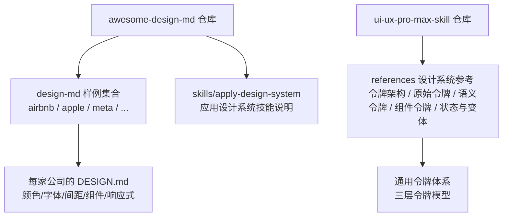
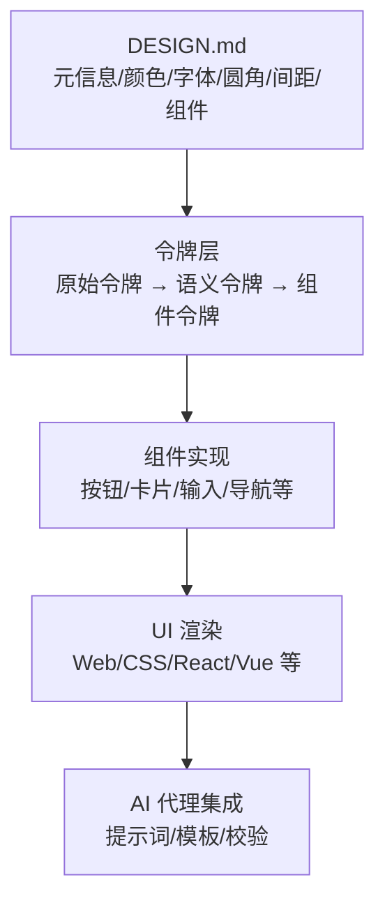
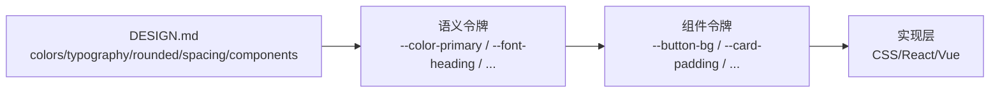

# 设计系统 API

<cite>
**本文引用的文件**
- [awesome-design-md 设计系统样例](file://awesome-design-md/design-md/airbnb/DESIGN.md)
- [awesome-design-md 设计系统样例](file://awesome-design-md/design-md/apple/DESIGN.md)
- [awesome-design-md 设计系统样例](file://awesome-design-md/design-md/meta/DESIGN.md)
- [应用设计系统技能说明](file://awesome-design-md/skills/apply-design-system/SKILL.md)
- [UI-UX Pro Max 设计系统参考：令牌架构](file://ui-ux-pro-max-skill/.claude/skills/design-system/references/token-architecture.md)
- [UI-UX Pro Max 设计系统参考：原始令牌](file://ui-ux-pro-max-skill/.claude/skills/design-system/references/primitive-tokens.md)
- [UI-UX Pro Max 设计系统参考：语义令牌](file://ui-ux-pro-max-skill/.claude/skills/design-system/references/semantic-tokens.md)
- [UI-UX Pro Max 设计系统参考：组件令牌](file://ui-ux-pro-max-skill/.claude/skills/design-system/references/component-tokens.md)
- [UI-UX Pro Max 设计系统参考：状态与变体](file://ui-ux-pro-max-skill/.claude/skills/design-system/references/states-and-variants.md)
</cite>

## 目录
1. [简介](#简介)
2. [项目结构](#项目结构)
3. [核心组件](#核心组件)
4. [架构总览](#架构总览)
5. [详细组件分析](#详细组件分析)
6. [依赖关系分析](#依赖关系分析)
7. [性能考量](#性能考量)
8. [故障排除指南](#故障排除指南)
9. [结论](#结论)
10. [附录](#附录)

## 简介
本文件面向“设计系统 API”的使用者与维护者，系统性阐述 DESIGN.md 文件格式规范与设计系统标准，覆盖以下主题：
- DESIGN.md 的 YAML 结构与字段定义
- 颜色系统规范（品牌色、表面色、文本色、语义色）
- 字体排版规则（字族、字号层级、字重、行高、字距）
- 间距系统与布局原则
- 组件设计标准（按钮、卡片、输入、导航等）
- 设计系统验证规则与最佳实践
- 常见错误与修复建议
- 在 AI 代理中的应用方式与集成模式

## 项目结构
awesome-design-md 仓库提供了多家公司的真实网站设计系统样例，每个样例以独立目录下的 DESIGN.md 文件呈现完整设计语言；同时，UI-UX Pro Max 技能包提供了通用的令牌体系与状态规范，可作为跨品牌设计系统实现的参考。

图表来源
- [awesome-design-md 设计系统样例:1-546](file://awesome-design-md/design-md/airbnb/DESIGN.md#L1-L546)
- [awesome-design-md 设计系统样例:1-563](file://awesome-design-md/design-md/apple/DESIGN.md#L1-L563)
- [awesome-design-md 设计系统样例:1-684](file://awesome-design-md/design-md/meta/DESIGN.md#L1-L684)
- [UI-UX Pro Max 设计系统参考：令牌架构:1-225](file://ui-ux-pro-max-skill/.claude/skills/design-system/references/token-architecture.md#L1-L225)

章节来源
- [awesome-design-md 设计系统样例:1-546](file://awesome-design-md/design-md/airbnb/DESIGN.md#L1-L546)
- [awesome-design-md 设计系统样例:1-563](file://awesome-design-md/design-md/apple/DESIGN.md#L1-L563)
- [awesome-design-md 设计系统样例:1-684](file://awesome-design-md/design-md/meta/DESIGN.md#L1-L684)
- [UI-UX Pro Max 设计系统参考：令牌架构:1-225](file://ui-ux-pro-max-skill/.claude/skills/design-system/references/token-architecture.md#L1-L225)

## 核心组件
- 元信息段（前言 YAML）
  - 字段：version、name、description
  - 用途：标识版本、名称与总体描述
- 颜色系统（colors）
  - 字段：品牌色、表面色、文本色、语义色、遮罩色等
  - 用途：为组件与页面提供统一配色
- 字体系统（typography）
  - 字段：字体族、字号、字重、行高、字距、文本变换（可选）
  - 用途：建立清晰的排版层级
- 圆角系统（rounded）
  - 字段：半径值集合
  - 用途：控制组件圆角风格一致性
- 间距系统（spacing）
  - 字段：间距值集合
  - 用途：统一页面与组件内部间距
- 组件系统（components）
  - 字段：组件名、背景色、文字色、字体、圆角、内边距、高度、边框、阴影等
  - 用途：定义组件默认样式与状态

章节来源
- [awesome-design-md 设计系统样例:1-327](file://awesome-design-md/design-md/airbnb/DESIGN.md#L1-L327)
- [awesome-design-md 设计系统样例:1-274](file://awesome-design-md/design-md/apple/DESIGN.md#L1-L274)
- [awesome-design-md 设计系统样例:1-349](file://awesome-design-md/design-md/meta/DESIGN.md#L1-L349)

## 架构总览
设计系统 API 的核心是“以 DESIGN.md 为单一事实源”，通过“令牌化”与“组件化”实现跨平台复用。下图展示了从 DESIGN.md 到组件实现的关键映射路径：

图表来源
- [awesome-design-md 设计系统样例:1-327](file://awesome-design-md/design-md/airbnb/DESIGN.md#L1-L327)
- [UI-UX Pro Max 设计系统参考：令牌架构:1-225](file://ui-ux-pro-max-skill/.claude/skills/design-system/references/token-architecture.md#L1-L225)
- [UI-UX Pro Max 设计系统参考：组件令牌:1-215](file://ui-ux-pro-max-skill/.claude/skills/design-system/references/component-tokens.md#L1-L215)

## 详细组件分析

### 颜色系统规范
- 品牌与强调色
  - 示例：Airbnb 的 Rausch (#ff385c)、Apple 的 Action Blue (#0066cc)、Meta 的 Cobalt (#0064E0)
  - 用途：主操作按钮、搜索按钮、品牌链接等
- 表面色
  - 示例：Canvas 白、Surface Soft 灰、Surface Strong 灰
  - 用途：页面背景、卡片表面、输入边框
- 文本色
  - 示例：Ink 深灰、Body 中灰、Muted 浅灰、Star Rating 黑
  - 用途：标题、正文、次级文本、评分数字
- 语义色
  - 示例：Success 绿、Warning 黄、Critical 红
  - 用途：成功提示、警告提醒、错误状态
- 遮罩色
  - 示例：Scrim 黑色 50% 不透明度
  - 用途：模态背景、日期选择器背景

章节来源
- [awesome-design-md 设计系统样例:6-30](file://awesome-design-md/design-md/airbnb/DESIGN.md#L6-L30)
- [awesome-design-md 设计系统样例:6-28](file://awesome-design-md/design-md/apple/DESIGN.md#L6-L28)
- [awesome-design-md 设计系统样例:6-34](file://awesome-design-md/design-md/meta/DESIGN.md#L6-L34)

### 字体排版规则
- 字体家族
  - 示例：Airbnb Cereal VF、SF Pro Display/Text、Optimistic VF
  - 用途：显示与正文统一字族，提供回退栈
- 层级与权重
  - 示例：Display 28–36px / 500–700；Body 16–17px / 400；Button 14–16px / 500–700
  - 用途：建立清晰的视觉层级
- 行高与字距
  - 示例：Display 使用更紧致行高；Body 使用负字距微调
  - 用途：提升可读性与品牌节奏感
- 文本变换
  - 示例：Airbnb 的 Uppercase Tag 使用 text-transform: uppercase
  - 用途：强调标签或徽记

章节来源
- [awesome-design-md 设计系统样例:31-141](file://awesome-design-md/design-md/airbnb/DESIGN.md#L31-L141)
- [awesome-design-md 设计系统样例:29-126](file://awesome-design-md/design-md/apple/DESIGN.md#L29-L126)
- [awesome-design-md 设计系统样例:35-122](file://awesome-design-md/design-md/meta/DESIGN.md#L35-L122)

### 间距系统与布局原则
- 基础单位与步进
  - 示例：Airbnb 4px 步进；Apple 8px 步进；Meta 4px 步进
  - 用途：保证网格对齐与视觉平衡
- 分区节奏
  - 示例：Section 64px（Airbnb）、80px（Apple）、64–120px（Meta）
  - 用途：页面区块分隔与密度控制
- 容器与栅格
  - 示例：最大宽度 1280px（Airbnb 主页）、1440px（Meta 营销页）
  - 用途：内容宽度约束与留白哲学

章节来源
- [awesome-design-md 设计系统样例:151-161](file://awesome-design-md/design-md/airbnb/DESIGN.md#L151-L161)
- [awesome-design-md 设计系统样例:136-144](file://awesome-design-md/design-md/apple/DESIGN.md#L136-L144)
- [awesome-design-md 设计系统样例:135-149](file://awesome-design-md/design-md/meta/DESIGN.md#L135-L149)

### 组件设计标准
- 按钮
  - 示例：Airbnb 的 pill 形状、Apple 的 Action Blue、Meta 的黑/蓝双按钮
  - 规范：圆角、内边距、高度、状态（默认/按下/禁用）
- 卡片
  - 示例：Airbnb 的 Property Card、Apple 的 Product Tile、Meta 的 Feature Card
  - 规范：圆角、边框、阴影、内边距、图像裁切
- 输入与表单
  - 示例：Airbnb 的 Search Bar、Apple 的 Search Input、Meta 的 Radio Option
  - 规范：边框、焦点环、错误状态、尺寸
- 导航与标签
  - 示例：Airbnb 的 Top Nav + New Tag、Apple 的 Global/Sub Nav、Meta 的 Pill Tabs
  - 规范：颜色、圆角、内边距、折叠策略

章节来源
- [awesome-design-md 设计系统样例:162-327](file://awesome-design-md/design-md/airbnb/DESIGN.md#L162-L327)
- [awesome-design-md 设计系统样例:146-274](file://awesome-design-md/design-md/apple/DESIGN.md#L146-L274)
- [awesome-design-md 设计系统样例:150-349](file://awesome-design-md/design-md/meta/DESIGN.md#L150-L349)

### 令牌架构与实现参考
- 三层令牌模型
  - 原始令牌（Primitive）：颜色、间距、字号、半径、阴影等基础值
  - 语义令牌（Semantic）：purpose-based 别名，支持主题切换
  - 组件令牌（Component）：组件级覆盖，引用语义令牌
- 命名约定与文件组织
  - 建议按 categories-{item}-{variant}-{state} 命名
  - 推荐文件结构：primitives.css / semantic.css / components.css / index.css
- 迁移与对齐
  - 从扁平令牌迁移到三层令牌，提升可维护性与主题能力
  - 可参考 W3C DTCG JSON 格式进行外部导出与共享

章节来源
- [UI-UX Pro Max 设计系统参考：令牌架构:1-225](file://ui-ux-pro-max-skill/.claude/skills/design-system/references/token-architecture.md#L1-L225)
- [UI-UX Pro Max 设计系统参考：原始令牌:1-204](file://ui-ux-pro-max-skill/.claude/skills/design-system/references/primitive-tokens.md#L1-L204)
- [UI-UX Pro Max 设计系统参考：语义令牌:1-216](file://ui-ux-pro-max-skill/.claude/skills/design-system/references/semantic-tokens.md#L1-L216)
- [UI-UX Pro Max 设计系统参考：组件令牌:1-215](file://ui-ux-pro-max-skill/.claude/skills/design-system/references/component-tokens.md#L1-L215)

### 状态与变体规范
- 交互状态优先级：disabled > loading > active > focus > hover > default
- 焦点环与可见性：Ring 宽度、偏移、颜色与背景对比
- 禁用与加载：不触发事件、降低不透明度、占位指示
- 错误状态：边框/图标/文本采用语义色，辅助文本明确
- 变体模式：颜色变体（primary/secondary/destructive）与尺寸变体（sm/base/lg）

章节来源
- [UI-UX Pro Max 设计系统参考：状态与变体:1-242](file://ui-ux-pro-max-skill/.claude/skills/design-system/references/states-and-variants.md#L1-L242)

## 依赖关系分析
- DESIGN.md 与令牌层的映射
  - colors → 语义令牌（如 --color-primary）
  - typography → 语义令牌（如 --font-heading）
  - rounded → 语义令牌（如 --radius-lg）
  - spacing → 语义令牌（如 --spacing-section）
  - components → 组件令牌（如 --button-bg）
- 组件令牌到实现层
  - 组件令牌通过 CSS 变量绑定到具体样式属性
  - 支持主题切换（.dark）与状态叠加

图表来源
- [awesome-design-md 设计系统样例:6-327](file://awesome-design-md/design-md/airbnb/DESIGN.md#L6-L327)
- [UI-UX Pro Max 设计系统参考：语义令牌:1-216](file://ui-ux-pro-max-skill/.claude/skills/design-system/references/semantic-tokens.md#L1-L216)
- [UI-UX Pro Max 设计系统参考：组件令牌:1-215](file://ui-ux-pro-max-skill/.claude/skills/design-system/references/component-tokens.md#L1-L215)

## 性能考量
- 令牌复用减少重复定义，降低 CSS 体积与渲染成本
- 合理的圆角与阴影层级避免过度合成
- 图像懒加载与响应式 srcset 提升首屏性能
- 组件状态切换使用轻量过渡（150–200ms），避免卡顿

## 故障排除指南
- 常见问题
  - 颜色冲突：未使用 DESIGN.md 中的语义别名，直接写死十六进制
  - 字体不一致：未遵循品牌字族与回退栈
  - 圆角/间距不统一：混用像素值而非令牌
  - 状态缺失：仅实现默认与 hover，忽略 active/disabled/loading
- 修复建议
  - 引入语义令牌，确保主题切换与品牌一致性
  - 使用组件令牌封装状态，避免分散逻辑
  - 严格遵循 DESIGN.md 的“Do’s and Don’ts”
  - 在 AI 代理中加入 lint 校验步骤（如 npx @google/design.md lint DESIGN.md）

章节来源
- [awesome-design-md 设计系统样例:539-546](file://awesome-design-md/design-md/airbnb/DESIGN.md#L539-L546)
- [awesome-design-md 设计系统样例:555-563](file://awesome-design-md/design-md/apple/DESIGN.md#L555-L563)
- [awesome-design-md 设计系统样例:678-684](file://awesome-design-md/design-md/meta/DESIGN.md#L678-L684)
- [应用设计系统技能说明:117-121](file://awesome-design-md/skills/apply-design-system/SKILL.md#L117-L121)

## 结论
DESIGN.md 是设计系统 API 的权威来源，结合三层令牌模型与组件令牌，可实现跨平台、可维护、可扩展的设计语言落地。在 AI 代理中，应将 DESIGN.md 解析为令牌与组件规范，并在生成 UI 时严格校验与回溯，确保一致性与可审计性。

## 附录

### 设计系统验证规则与最佳实践
- 字段完整性
  - 必须包含 version/name/description
  - colors/typography/rounded/spacing/components 均需提供
- 引用一致性
  - 所有组件样式必须引用 DESIGN.md 中的 token 名称（如 {colors.primary}）
- 状态覆盖
  - 默认与按下/激活状态必须明确；hover 仅作补充
- 可访问性
  - 焦点环可见、对比度达标、禁用/加载状态明确
- 代理集成
  - 读取完整 DESIGN.md 再生成代码
  - 输出包含所用 token 与适配说明

章节来源
- [应用设计系统技能说明:96-139](file://awesome-design-md/skills/apply-design-system/SKILL.md#L96-L139)