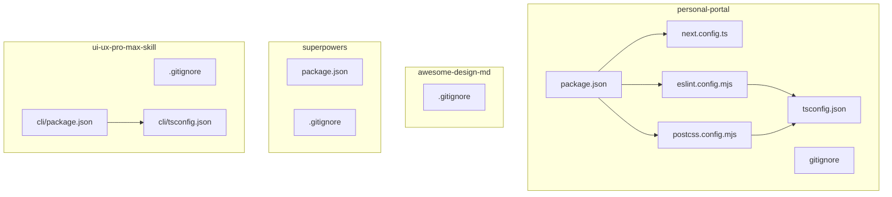
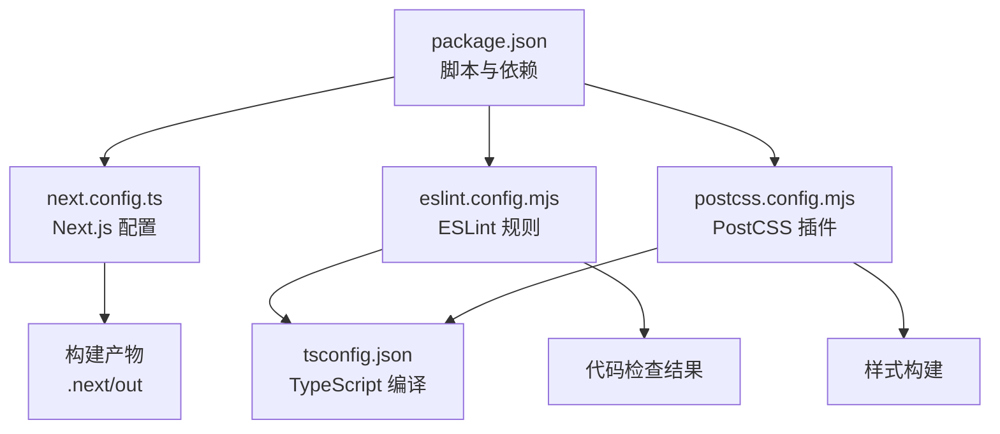
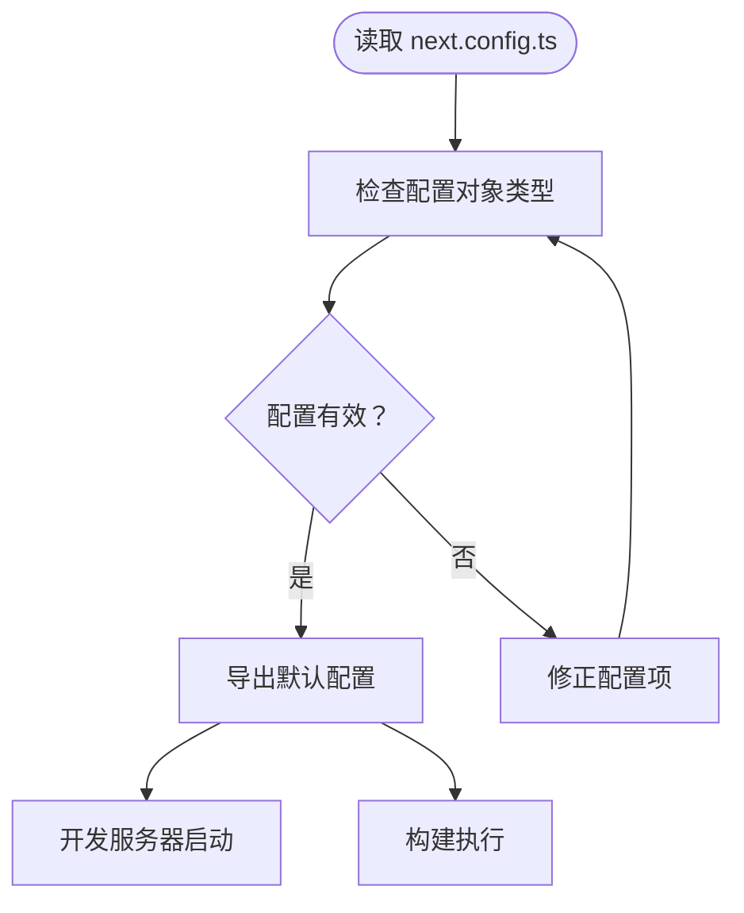
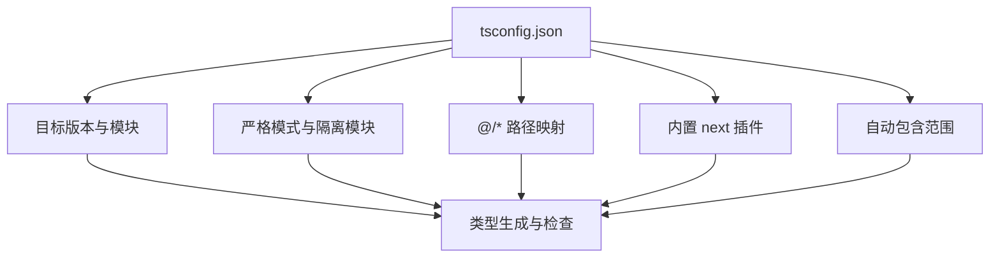
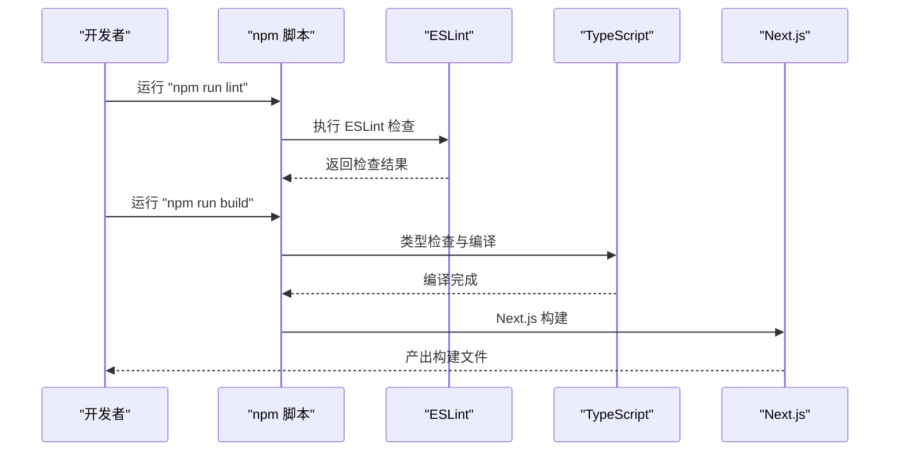
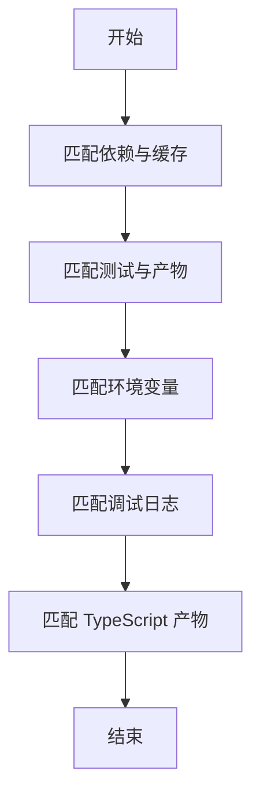
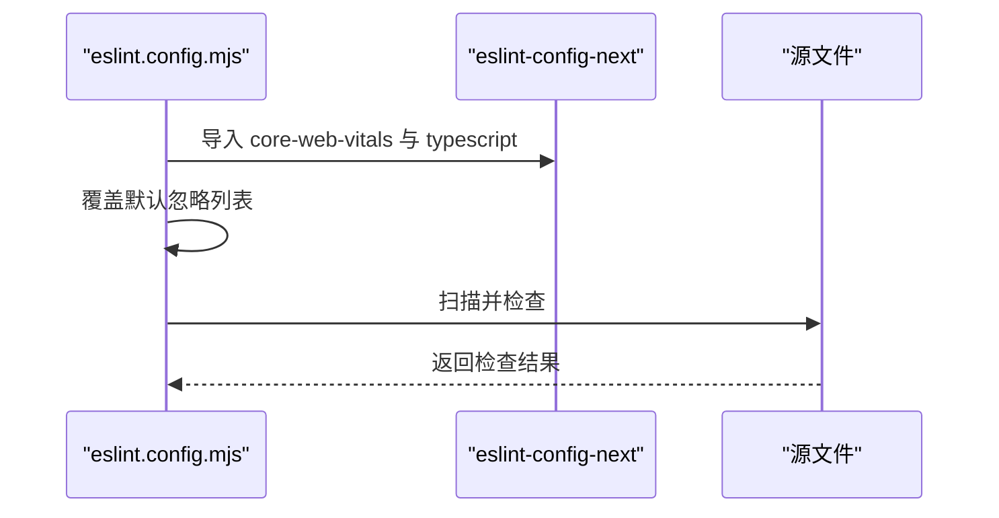
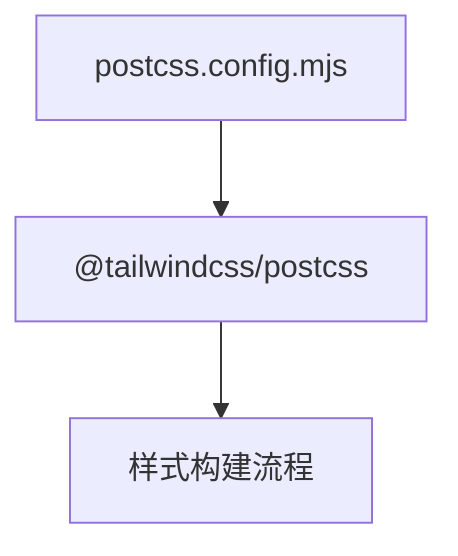
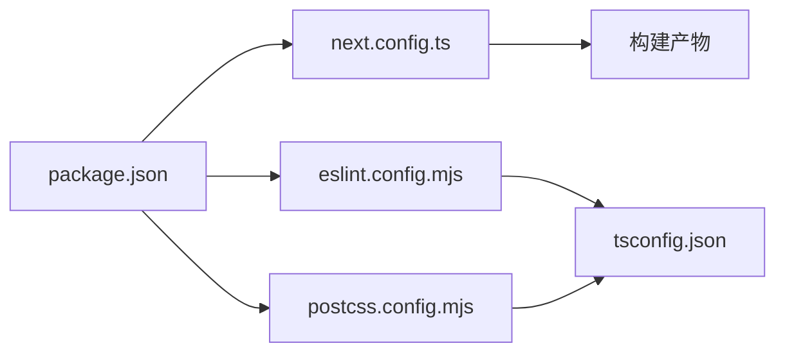

# 配置文件格式

<cite>
**本文引用的文件**
- [personal-portal/next.config.ts](file://personal-portal/next.config.ts)
- [personal-portal/tsconfig.json](file://personal-portal/tsconfig.json)
- [personal-portal/package.json](file://personal-portal/package.json)
- [personal-portal/.gitignore](file://personal-portal/.gitignore)
- [personal-portal/eslint.config.mjs](file://personal-portal/eslint.config.mjs)
- [personal-portal/postcss.config.mjs](file://personal-portal/postcss.config.mjs)
- [awesome-design-md/.gitignore](file://awesome-design-md/.gitignore)
- [superpowers/package.json](file://superpowers/package.json)
- [superpowers/.gitignore](file://superpowers/.gitignore)
- [ui-ux-pro-max-skill/.gitignore](file://ui-ux-pro-max-skill/.gitignore)
- [ui-ux-pro-max-skill/cli/package.json](file://ui-ux-pro-max-skill/cli/package.json)
- [ui-ux-pro-max-skill/cli/tsconfig.json](file://ui-ux-pro-max-skill/cli/tsconfig.json)
</cite>

## 目录
1. [简介](#简介)
2. [项目结构](#项目结构)
3. [核心组件](#核心组件)
4. [架构总览](#架构总览)
5. [详细组件分析](#详细组件分析)
6. [依赖分析](#依赖分析)
7. [性能考虑](#性能考虑)
8. [故障排除指南](#故障排除指南)
9. [结论](#结论)
10. [附录](#附录)

## 简介
本文件系统性梳理仓库中各类配置文件的结构与参数定义，重点覆盖以下方面：
- Next.js 配置：开发服务器、构建行为、实验特性等可配置项的说明与最佳实践
- TypeScript 配置：编译目标、模块解析、路径映射、严格模式与增量编译等
- 包管理配置：脚本命令、依赖声明、类型检查与发布流程
- Git 忽略规则：目录与文件的忽略策略、调试日志与环境变量处理
- 配置间的依赖关系与集成方式：ESLint、PostCSS、TypeScript 与 Next.js 的协同

通过“章节来源”与“图表来源”标注具体文件位置，帮助读者快速定位实现细节。

## 项目结构
仓库包含三个主要项目，每个项目均维护独立的配置文件：
- personal-portal：基于 Next.js 的前端应用，包含 next.config.ts、tsconfig.json、package.json、.gitignore、eslint.config.mjs、postcss.config.mjs
- awesome-design-md：设计规范与模板资源，包含 .gitignore
- superpowers：多平台技能与运行时插件，包含 package.json、.gitignore
- ui-ux-pro-max-skill：UI/UX 技能与 CLI 工具，包含 .gitignore、cli/package.json、cli/tsconfig.json

**图表来源**
- [personal-portal/next.config.ts:1-8](file://personal-portal/next.config.ts#L1-L8)
- [personal-portal/tsconfig.json:1-35](file://personal-portal/tsconfig.json#L1-L35)
- [personal-portal/package.json:1-32](file://personal-portal/package.json#L1-L32)
- [personal-portal/.gitignore:1-42](file://personal-portal/.gitignore#L1-L42)
- [personal-portal/eslint.config.mjs:1-19](file://personal-portal/eslint.config.mjs#L1-L19)
- [personal-portal/postcss.config.mjs:1-8](file://personal-portal/postcss.config.mjs#L1-L8)
- [awesome-design-md/.gitignore:1-2](file://awesome-design-md/.gitignore#L1-L2)
- [superpowers/package.json:1-24](file://superpowers/package.json#L1-L24)
- [superpowers/.gitignore:1-14](file://superpowers/.gitignore#L1-L14)
- [ui-ux-pro-max-skill/.gitignore:1-54](file://ui-ux-pro-max-skill/.gitignore#L1-L54)
- [ui-ux-pro-max-skill/cli/package.json:1-52](file://ui-ux-pro-max-skill/cli/package.json#L1-L52)
- [ui-ux-pro-max-skill/cli/tsconfig.json:1-18](file://ui-ux-pro-max-skill/cli/tsconfig.json#L1-L18)

**章节来源**
- [personal-portal/next.config.ts:1-8](file://personal-portal/next.config.ts#L1-L8)
- [personal-portal/tsconfig.json:1-35](file://personal-portal/tsconfig.json#L1-L35)
- [personal-portal/package.json:1-32](file://personal-portal/package.json#L1-L32)
- [personal-portal/.gitignore:1-42](file://personal-portal/.gitignore#L1-L42)
- [personal-portal/eslint.config.mjs:1-19](file://personal-portal/eslint.config.mjs#L1-L19)
- [personal-portal/postcss.config.mjs:1-8](file://personal-portal/postcss.config.mjs#L1-L8)
- [awesome-design-md/.gitignore:1-2](file://awesome-design-md/.gitignore#L1-L2)
- [superpowers/package.json:1-24](file://superpowers/package.json#L1-L24)
- [superpowers/.gitignore:1-14](file://superpowers/.gitignore#L1-L14)
- [ui-ux-pro-max-skill/.gitignore:1-54](file://ui-ux-pro-max-skill/.gitignore#L1-L54)
- [ui-ux-pro-max-skill/cli/package.json:1-52](file://ui-ux-pro-max-skill/cli/package.json#L1-L52)
- [ui-ux-pro-max-skill/cli/tsconfig.json:1-18](file://ui-ux-pro-max-skill/cli/tsconfig.json#L1-L18)

## 核心组件
本节对各配置文件进行逐项说明，包括用途、关键字段、默认行为与可选扩展。

- Next.js 配置（next.config.ts）
  - 作用：定义 Next.js 应用的构建与运行时行为，如实验特性、输出目录、重写规则、图像优化等
  - 当前状态：示例配置占位，未启用具体选项
  - 建议：在开发阶段按需开启实验特性；生产阶段关注输出目录与静态导出策略
  - 参考路径：[next.config.ts:1-8](file://personal-portal/next.config.ts#L1-L8)

- TypeScript 配置（tsconfig.json）
  - 编译目标与模块：ES2017 目标、esnext 模块与 bundler 解析器
  - 严格性与增量编译：严格模式、隔离模块、增量编译提升开发体验
  - 路径映射：@/* 映射到 ./src/*，便于相对路径导入
  - 插件：内置 next 插件以增强类型支持
  - 包含范围：自动包含 next-env.d.ts、所有 ts/tsx、.next/types 下的类型
  - 参考路径：[tsconfig.json:1-35](file://personal-portal/tsconfig.json#L1-L35)

- 包管理配置（package.json）
  - 脚本命令：dev/build/start/lint，分别对应开发、构建、启动与代码检查
  - 依赖：Next.js、React 生态、MDX 处理、RSS 订阅、图表库等
  - 开发依赖：ESLint、ESLint Next 规则、TailwindCSS v4、TypeScript
  - 参考路径：[package.json:1-32](file://personal-portal/package.json#L1-L32)

- Git 忽略规则（.gitignore）
  - 依赖与缓存：node_modules、Yarn/PNPM 特定文件
  - 测试与产物：coverage、.next、out、build
  - 环境变量：.env*（可按需提交特定文件）
  - 调试日志：npm/yarn/pnpm 调试日志
  - TypeScript：tsbuildinfo、next-env.d.ts
  - 参考路径：[personal-portal/.gitignore:1-42](file://personal-portal/.gitignore#L1-L42)

- ESLint 配置（eslint.config.mjs）
  - 继承：eslint-config-next 的 core-web-vitals 与 typescript 规则集
  - 覆盖：显式覆盖默认忽略列表，确保 .next、out、build、next-env.d.ts 等被纳入检查
  - 参考路径：[eslint.config.mjs:1-19](file://personal-portal/eslint.config.mjs#L1-L19)

- PostCSS 配置（postcss.config.mjs）
  - 插件：@tailwindcss/postcss，用于 Tailwind v4 的 PostCSS 集成
  - 参考路径：[postcss.config.mjs:1-8](file://personal-portal/postcss.config.mjs#L1-L8)

- 其他项目配置
  - awesome-design-md：最小化 .gitignore，仅忽略 OS 文件
    - 参考路径：[awesome-design-md/.gitignore:1-2](file://awesome-design-md/.gitignore#L1-L2)
  - superpowers：插件与技能清单，声明扩展与技能目录
    - 参考路径：[superpowers/package.json:1-24](file://superpowers/package.json#L1-L24)
  - ui-ux-pro-max-skill：综合 .gitignore，覆盖 OS、IDE、日志、依赖、构建产物、缓存与本地设置
    - 参考路径：[ui-ux-pro-max-skill/.gitignore:1-54](file://ui-ux-pro-max-skill/.gitignore#L1-L54)
  - ui-ux-pro-max-skill/cli：CLI 工具的 package.json 与 tsconfig.json
    - 参考路径：[cli/package.json:1-52](file://ui-ux-pro-max-skill/cli/package.json#L1-L52)、[cli/tsconfig.json:1-18](file://ui-ux-pro-max-skill/cli/tsconfig.json#L1-L18)

**章节来源**
- [personal-portal/next.config.ts:1-8](file://personal-portal/next.config.ts#L1-L8)
- [personal-portal/tsconfig.json:1-35](file://personal-portal/tsconfig.json#L1-L35)
- [personal-portal/package.json:1-32](file://personal-portal/package.json#L1-L32)
- [personal-portal/.gitignore:1-42](file://personal-portal/.gitignore#L1-L42)
- [personal-portal/eslint.config.mjs:1-19](file://personal-portal/eslint.config.mjs#L1-L19)
- [personal-portal/postcss.config.mjs:1-8](file://personal-portal/postcss.config.mjs#L1-L8)
- [awesome-design-md/.gitignore:1-2](file://awesome-design-md/.gitignore#L1-L2)
- [superpowers/package.json:1-24](file://superpowers/package.json#L1-L24)
- [ui-ux-pro-max-skill/.gitignore:1-54](file://ui-ux-pro-max-skill/.gitignore#L1-L54)
- [ui-ux-pro-max-skill/cli/package.json:1-52](file://ui-ux-pro-max-skill/cli/package.json#L1-L52)
- [ui-ux-pro-max-skill/cli/tsconfig.json:1-18](file://ui-ux-pro-max-skill/cli/tsconfig.json#L1-L18)

## 架构总览
下图展示配置文件之间的协作关系：package.json 定义脚本与依赖，tsconfig.json 提供编译与类型支持，eslint.config.mjs 与 postcss.config.mjs 分别负责代码质量与样式管线，next.config.ts 作为 Next.js 的入口配置。

**图表来源**
- [personal-portal/package.json:1-32](file://personal-portal/package.json#L1-L32)
- [personal-portal/next.config.ts:1-8](file://personal-portal/next.config.ts#L1-L8)
- [personal-portal/eslint.config.mjs:1-19](file://personal-portal/eslint.config.mjs#L1-L19)
- [personal-portal/postcss.config.mjs:1-8](file://personal-portal/postcss.config.mjs#L1-L8)
- [personal-portal/tsconfig.json:1-35](file://personal-portal/tsconfig.json#L1-L35)

## 详细组件分析

### Next.js 配置（next.config.ts）
- 结构要点
  - 类型安全：通过 NextConfig 接口约束配置对象
  - 扩展空间：预留配置项占位，便于后续启用实验特性或自定义行为
- 最佳实践
  - 在开发阶段谨慎启用实验特性，避免破坏稳定性
  - 生产构建前确认输出目录与静态导出策略一致
- 常见问题
  - 配置未生效：确认是否正确导出默认配置对象
  - 与第三方插件冲突：优先使用官方推荐的集成方式

**图表来源**
- [personal-portal/next.config.ts:1-8](file://personal-portal/next.config.ts#L1-L8)

**章节来源**
- [personal-portal/next.config.ts:1-8](file://personal-portal/next.config.ts#L1-L8)

### TypeScript 配置（tsconfig.json）
- 关键点
  - 目标与模块：ES2017 目标与 esnext 模块，配合 bundler 解析器
  - 严格性：严格模式、隔离模块、增量编译，提升类型安全与开发效率
  - 路径映射：@/* → ./src/*，简化导入路径
  - 插件：内置 next 插件增强类型支持
  - 包含范围：自动包含 next-env.d.ts、ts/tsx、.next/types 下的类型
- 性能与复杂度
  - 增量编译显著降低二次构建时间
  - 路径映射减少层级深度，改善可维护性
- 最佳实践
  - 保持 target 与运行时环境一致
  - 合理使用 paths，避免过度嵌套
  - 在 monorepo 中统一编译选项

**图表来源**
- [personal-portal/tsconfig.json:1-35](file://personal-portal/tsconfig.json#L1-L35)

**章节来源**
- [personal-portal/tsconfig.json:1-35](file://personal-portal/tsconfig.json#L1-L35)

### 包管理配置（package.json）
- 脚本命令
  - dev：启动开发服务器
  - build：执行构建
  - start：生产启动
  - lint：运行 ESLint
- 依赖与开发依赖
  - React 19、Next.js 16、MDX 处理、RSS 生成、图表库等
  - ESLint、ESLint Next 规则、TailwindCSS v4、TypeScript
- 发布与构建
  - 通过脚本统一构建与类型检查流程

**图表来源**
- [personal-portal/package.json:1-32](file://personal-portal/package.json#L1-L32)
- [personal-portal/eslint.config.mjs:1-19](file://personal-portal/eslint.config.mjs#L1-L19)
- [personal-portal/tsconfig.json:1-35](file://personal-portal/tsconfig.json#L1-L35)
- [personal-portal/next.config.ts:1-8](file://personal-portal/next.config.ts#L1-L8)

**章节来源**
- [personal-portal/package.json:1-32](file://personal-portal/package.json#L1-L32)

### Git 忽略规则（.gitignore）
- 忽略策略
  - 依赖与缓存：node_modules、Yarn/PNPM 特定文件
  - 测试与产物：coverage、.next、out、build
  - 环境变量：.env*（可按需提交特定文件）
  - 调试日志：npm/yarn/pnpm 调试日志
  - TypeScript：tsbuildinfo、next-env.d.ts
- 最佳实践
  - 将敏感信息与临时文件排除在版本控制之外
  - 对于需要团队共享的配置文件，明确区分可提交与不可提交项

**图表来源**
- [personal-portal/.gitignore:1-42](file://personal-portal/.gitignore#L1-L42)

**章节来源**
- [personal-portal/.gitignore:1-42](file://personal-portal/.gitignore#L1-L42)
- [awesome-design-md/.gitignore:1-2](file://awesome-design-md/.gitignore#L1-L2)
- [superpowers/.gitignore:1-14](file://superpowers/.gitignore#L1-L14)
- [ui-ux-pro-max-skill/.gitignore:1-54](file://ui-ux-pro-max-skill/.gitignore#L1-L54)

### ESLint 配置（eslint.config.mjs）
- 规则继承
  - 使用 eslint-config-next 的 core-web-vitals 与 typescript 规则集
- 覆盖默认忽略
  - 显式覆盖默认忽略列表，确保 .next、out、build、next-env.d.ts 等被纳入检查
- 最佳实践
  - 在 monorepo 中统一 ESLint 规则，避免各子项目风格不一致
  - 与 TypeScript 配置联动，保证类型相关规则生效

**图表来源**
- [personal-portal/eslint.config.mjs:1-19](file://personal-portal/eslint.config.mjs#L1-L19)

**章节来源**
- [personal-portal/eslint.config.mjs:1-19](file://personal-portal/eslint.config.mjs#L1-L19)

### PostCSS 配置（postcss.config.mjs）
- 插件集成
  - @tailwindcss/postcss：为 Tailwind v4 提供 PostCSS 支持
- 最佳实践
  - 与 Tailwind 配置文件协同，确保工具链一致
  - 在多项目中统一 PostCSS 插件版本

**图表来源**
- [personal-portal/postcss.config.mjs:1-8](file://personal-portal/postcss.config.mjs#L1-L8)

**章节来源**
- [personal-portal/postcss.config.mjs:1-8](file://personal-portal/postcss.config.mjs#L1-L8)

### 其他项目配置
- superpowers/package.json
  - 声明插件与技能目录，定义扩展入口
  - 参考路径：[superpowers/package.json:1-24](file://superpowers/package.json#L1-L24)
- ui-ux-pro-max-skill/cli
  - CLI 工具的构建与类型检查脚本
  - TypeScript 配置：ES2022 目标、ESNext 模块、bundler 解析器
  - 参考路径：[cli/package.json:1-52](file://ui-ux-pro-max-skill/cli/package.json#L1-L52)、[cli/tsconfig.json:1-18](file://ui-ux-pro-max-skill/cli/tsconfig.json#L1-L18)

**章节来源**
- [superpowers/package.json:1-24](file://superpowers/package.json#L1-L24)
- [ui-ux-pro-max-skill/cli/package.json:1-52](file://ui-ux-pro-max-skill/cli/package.json#L1-L52)
- [ui-ux-pro-max-skill/cli/tsconfig.json:1-18](file://ui-ux-pro-max-skill/cli/tsconfig.json#L1-L18)

## 依赖分析
- 耦合关系
  - package.json 作为根配置，驱动 next.config.ts、tsconfig.json、eslint.config.mjs、postcss.config.mjs 的执行
  - tsconfig.json 与 eslint.config.mjs 存在强关联：ESLint 需要 TypeScript 类型信息以启用类型相关规则
  - postcss.config.mjs 与 tsconfig.json 的 moduleResolution 影响样式与类型解析的一致性
- 外部依赖
  - Next.js、React、ESLint、TailwindCSS v4、TypeScript
- 集成点
  - 构建流水线：npm 脚本 → ESLint → TypeScript → Next.js
  - 样式流水线：PostCSS 插件 → Tailwind v4 → 构建产物

**图表来源**
- [personal-portal/package.json:1-32](file://personal-portal/package.json#L1-L32)
- [personal-portal/next.config.ts:1-8](file://personal-portal/next.config.ts#L1-L8)
- [personal-portal/eslint.config.mjs:1-19](file://personal-portal/eslint.config.mjs#L1-L19)
- [personal-portal/postcss.config.mjs:1-8](file://personal-portal/postcss.config.mjs#L1-L8)
- [personal-portal/tsconfig.json:1-35](file://personal-portal/tsconfig.json#L1-L35)

**章节来源**
- [personal-portal/package.json:1-32](file://personal-portal/package.json#L1-L32)
- [personal-portal/tsconfig.json:1-35](file://personal-portal/tsconfig.json#L1-L35)
- [personal-portal/eslint.config.mjs:1-19](file://personal-portal/eslint.config.mjs#L1-L19)
- [personal-portal/postcss.config.mjs:1-8](file://personal-portal/postcss.config.mjs#L1-L8)
- [personal-portal/next.config.ts:1-8](file://personal-portal/next.config.ts#L1-L8)

## 性能考虑
- TypeScript 增量编译：开启 incremental 可显著缩短二次构建时间
- 模块解析：bundler 解析器与 ESNext 模块有助于 Tree Shaking 与按需加载
- ESLint 并行：在大型项目中合理组织规则与忽略列表，避免不必要的扫描
- 构建产物：.next/out/build 目录应加入 .gitignore，避免提交不必要的二进制文件
- 缓存与调试日志：清理调试日志与缓存目录，减少磁盘占用与 CI 时间

## 故障排除指南
- Next.js 配置未生效
  - 确认导出默认配置对象且路径正确
  - 参考：[next.config.ts:1-8](file://personal-portal/next.config.ts#L1-L8)
- ESLint 检查异常
  - 检查 eslint.config.mjs 是否覆盖了必要的忽略列表
  - 确保 TypeScript 类型信息可用
  - 参考：[eslint.config.mjs:1-19](file://personal-portal/eslint.config.mjs#L1-L19)
- TypeScript 报错
  - 核对 tsconfig.json 的 target、module、moduleResolution 与运行时环境一致性
  - 参考：[tsconfig.json:1-35](file://personal-portal/tsconfig.json#L1-L35)
- 构建失败
  - 清理 .next/out/build 并重新构建
  - 确认 package.json 中的脚本命令与依赖版本兼容
  - 参考：[package.json:1-32](file://personal-portal/package.json#L1-L32)
- Git 提交包含不应提交的文件
  - 检查 .gitignore 规则，必要时调整忽略列表
  - 参考：[personal-portal/.gitignore:1-42](file://personal-portal/.gitignore#L1-L42)

**章节来源**
- [personal-portal/next.config.ts:1-8](file://personal-portal/next.config.ts#L1-L8)
- [personal-portal/eslint.config.mjs:1-19](file://personal-portal/eslint.config.mjs#L1-L19)
- [personal-portal/tsconfig.json:1-35](file://personal-portal/tsconfig.json#L1-L35)
- [personal-portal/package.json:1-32](file://personal-portal/package.json#L1-L32)
- [personal-portal/.gitignore:1-42](file://personal-portal/.gitignore#L1-L42)

## 结论
本仓库的配置体系围绕 Next.js、TypeScript、ESLint 与 PostCSS 展开，通过 package.json 统一脚本与依赖，tsconfig.json 提供严格的类型保障，eslint.config.mjs 与 postcss.config.mjs 分别强化代码质量与样式管线。遵循本文档的配置项说明、最佳实践与故障排除建议，可在不同项目间保持一致的工程化标准与高效的开发体验。

## 附录
- 配置项速查
  - Next.js：实验特性、输出目录、重写规则、图像优化等
  - TypeScript：target、module、moduleResolution、paths、plugins、include/exclude
  - 包管理：脚本命令、依赖与开发依赖、发布流程
  - Git 忽略：依赖、测试、产物、环境变量、调试日志、TypeScript 产物
  - ESLint：规则继承、忽略覆盖、与 TypeScript 协同
  - PostCSS：Tailwind v4 插件集成