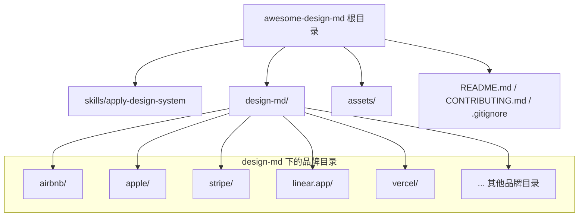
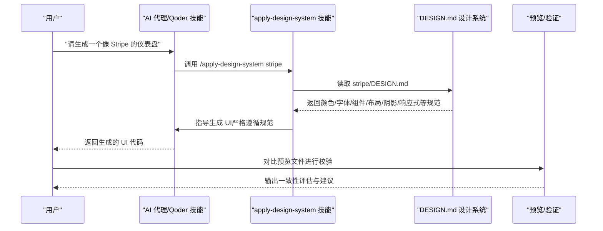
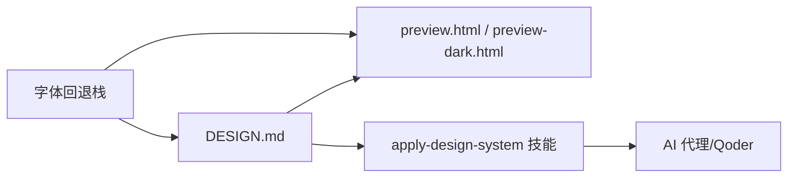

# Awesome DESIGN.md 设计系统

<cite>
**本文档引用的文件**
- [README.md](file://awesome-design-md/README.md)
- [CONTRIBUTING.md](file://awesome-design-md/CONTRIBUTING.md)
- [SKILL.md](file://awesome-design-md/skills/apply-design-system/SKILL.md)
- [airbnb/DESIGN.md](file://awesome-design-md/design-md/airbnb/DESIGN.md)
- [apple/DESIGN.md](file://awesome-design-md/design-md/apple/DESIGN.md)
- [stripe/DESIGN.md](file://awesome-design-md/design-md/stripe/DESIGN.md)
- [linear.app/DESIGN.md](file://awesome-design-md/design-md/linear.app/DESIGN.md)
- [vercel/DESIGN.md](file://awesome-design-md/design-md/vercel/DESIGN.md)
</cite>

## 目录
1. [简介](#简介)
2. [项目结构](#项目结构)
3. [核心组件](#核心组件)
4. [架构总览](#架构总览)
5. [详细组件分析](#详细组件分析)
6. [依赖关系分析](#依赖关系分析)
7. [性能考量](#性能考量)
8. [故障排查指南](#故障排查指南)
9. [结论](#结论)
10. [附录](#附录)

## 简介
Awesome DESIGN.md 是一个面向开发者与 AI 代理的“设计系统收集工具”。它通过从真实网站中提取并整理 DESIGN.md 文件，形成可直接被 AI 阅读与执行的设计语言规范，帮助在构建页面时保持视觉一致性与品牌风格。仓库已收录超过 73 个真实网站的设计系统，覆盖 AI 平台、开发者工具、数据库/DevOps、SaaS、设计与创意工具、金融科技与加密货币、电商零售、媒体与消费科技、汽车等多个领域，并提供预览与下载能力。

本仓库的核心价值在于：
- 将复杂的设计系统抽象为简洁的文本规范，降低解析成本
- 提供 READY-TO-USE 的 DESIGN.md，直接放入项目根目录即可驱动 AI 生成一致 UI
- 通过统一的“颜色、字体、组件、布局、阴影、响应式”等维度，确保跨平台一致性
- 支持在 Qoder 等环境中以技能形式一键应用任意品牌设计系统

## 项目结构
仓库采用按品牌分目录的组织方式，每个品牌下包含 DESIGN.md 与 README.md；同时提供一个 apply-design-system 技能用于在 AI 工作流中直接调用。

图表来源
- [README.md](file://awesome-design-md/README.md)
- [airbnb/DESIGN.md](file://awesome-design-md/design-md/airbnb/DESIGN.md)
- [apple/DESIGN.md](file://awesome-design-md/design-md/apple/DESIGN.md)
- [stripe/DESIGN.md](file://awesome-design-md/design-md/stripe/DESIGN.md)
- [linear.app/DESIGN.md](file://awesome-design-md/design-md/linear.app/DESIGN.md)
- [vercel/DESIGN.md](file://awesome-design-md/design-md/vercel/DESIGN.md)

章节来源
- [README.md](file://awesome-design-md/README.md)
- [CONTRIBUTING.md](file://awesome-design-md/CONTRIBUTING.md)

## 核心组件
- DESIGN.md 规范文件：每个品牌的设计系统规范，包含视觉主题、色彩体系、字体规则、组件样式、布局原则、深度与高程、响应式行为、设计守则与提示等。
- 预览文件：每个品牌通常提供 preview.html 与 preview-dark.html，直观展示色板、字号层级、按钮与卡片等组件。
- apply-design-system 技能：在 AI 工作流中触发，读取指定品牌的 DESIGN.md 并指导生成符合该设计语言的 UI。

章节来源
- [README.md](file://awesome-design-md/README.md)
- [SKILL.md](file://awesome-design-md/skills/apply-design-system/SKILL.md)

## 架构总览
从用户需求到最终 UI 生成的端到端流程如下：

图表来源
- [SKILL.md](file://awesome-design-md/skills/apply-design-system/SKILL.md)
- [stripe/DESIGN.md](file://awesome-design-md/design-md/stripe/DESIGN.md)

## 详细组件分析

### DESIGN.md 格式规范与字段定义
DESIGN.md 基于 Google Stitch 的 DESIGN.md 规范扩展，包含以下核心章节与字段：

- 基础元信息
  - version: 版本标识（如 alpha）
  - name: 设计系统名称
  - description: 设计语言概述与风格要点
- 颜色体系（colors）
  - 主色与语义色：primary、secondary、error、success 等
  - 表面色：canvas、surface-1/2/3、hairline、divider 等
  - 文字色：ink/body/muted 等
- 字体规则（typography）
  - display、headline、body、caption、micro 等层级
  - fontFamily、fontSize、fontWeight、lineHeight、letterSpacing
- 圆角与间距（rounded、spacing）
  - 统一的半径与间距刻度，便于跨组件复用
- 组件样式（components）
  - 按组件类型与状态拆分（如 button-primary、button-secondary、text-input、card 等）
  - 每个组件包含背景色、文字色、排版、圆角、内边距、高度等属性
- 布局与网格（layout）
  - 间距系统、最大宽度、栅格与列数、内边距策略
- 深度与高程（elevation）
  - 阴影层级与表面层次，避免过度阴影
- 响应式行为（responsive）
  - 断点、触摸目标尺寸、折叠策略
- 设计守则（do’s and don’ts）
  - 明确可用与禁用的用法，防止误用
- 提示与参考（agent prompt guide）
  - 快速颜色参考与可直接使用的提示词

章节来源
- [README.md](file://awesome-design-md/README.md)
- [airbnb/DESIGN.md](file://awesome-design-md/design-md/airbnb/DESIGN.md)
- [apple/DESIGN.md](file://awesome-design-md/design-md/apple/DESIGN.md)
- [stripe/DESIGN.md](file://awesome-design-md/design-md/stripe/DESIGN.md)
- [linear.app/DESIGN.md](file://awesome-design-md/design-md/linear.app/DESIGN.md)
- [vercel/DESIGN.md](file://awesome-design-md/design-md/vercel/DESIGN.md)

### 设计系统标准化的重要性与实际价值
- 一致性：通过统一的颜色、字体、组件与布局，确保不同页面与功能模块在视觉上保持一致
- 可维护性：以 DESIGN.md 为唯一事实来源，减少设计与开发之间的沟通成本
- 可扩展性：新增品牌只需补充对应 DESIGN.md，即可无缝接入现有工作流
- 可验证性：提供预览文件，便于人工或自动化校验生成结果是否符合设计语言
- 可迁移性：DESIGN.md 作为纯文本规范，不依赖特定工具链，易于在多平台间迁移

章节来源
- [README.md](file://awesome-design-md/README.md)

### 设计系统收集与分析方法
- 数据源选择：优先选取官网主站与典型页面（首页、产品页、定价页、文档页等），确保代表性
- 截图与测量：使用浏览器开发者工具测量颜色、字号、行高、间距、圆角、阴影等关键指标
- 归纳与提炼：将测量值映射到 DESIGN.md 的 colors、typography、rounded、spacing、components 等键位
- 结构化输出：按照统一章节顺序与字段命名，生成可读性强且可被 AI 解析的 DESIGN.md
- 质量控制：对比 live site 与 DESIGN.md，修正错误的 HEX 值、缺失的 token 或描述弱项
- 预览更新：根据 DESIGN.md 更新 preview.html 与 preview-dark.html，确保可视化校验

章节来源
- [CONTRIBUTING.md](file://awesome-design-md/CONTRIBUTING.md)

### 实际设计系统案例分析

#### Airbnb 设计系统
- 视觉主题：以纯白画布与 Rausch（#ff385c）为主色，强调摄影与留白
- 色彩：主色、表面、发丝线、文本、语义色、遮罩等清晰分层
- 字体：Airbnb Cereal VF + Circular，显示层级采用中等权重，正文采用轻量权重
- 组件：圆润卡片、圆形搜索球、胶囊标签、评分展示等
- 布局：8px 基础间距，section 间距 64px，网格密度适中
- 深度：单层阴影用于卡片悬浮与下拉菜单
- 响应式：移动端折叠导航、搜索条合并、卡片单列堆叠

章节来源
- [airbnb/DESIGN.md](file://awesome-design-md/design-md/airbnb/DESIGN.md)

#### Apple 设计系统
- 视觉主题：近黑画布、无装饰渐变、产品图像的单层阴影
- 色彩：Action Blue（#0066cc）作为唯一交互色，深浅灰文本，近黑瓦片
- 字体：SF Pro Display（负间距）+ SF Pro Text，显示层级负间距，正文 17px
- 组件：全胶囊按钮、暗色实用按钮、商店英雄按钮、图标圆形按钮、环境引述卡
- 布局：8px 基础单位，section 80px，交替全幅瓦片
- 深度：仅产品图像阴影，UI 层面通过表面色与模糊实现浮层效果
- 响应式：导航汉堡、瓦片单列、英雄标题分级缩放

章节来源
- [apple/DESIGN.md](file://awesome-design-md/design-md/apple/DESIGN.md)

#### Stripe 设计系统
- 视觉主题：深海军蓝底、电感靛青主色、渐变网格背景、表格与代码面板
- 色彩：靛青主色及其深浅变体、品牌深蓝、奶油色表面、发丝线与阴影蓝
- 字体：Sohne 变体（薄重 300），显示负间距，数值使用等宽数字
- 组件：紧致胶囊按钮、卡片、Cream 带卡片、仪表盘合成图、导航栏
- 布局：64–96px section 间距，营销 64px，仪表盘 32–48px
- 深度：渐变网格作为装饰性深度，UI 阴影轻柔
- 响应式：桌面 4 列，平板 2 列，移动 1 列；渐变网格重铺

章节来源
- [stripe/DESIGN.md](file://awesome-design-md/design-md/stripe/DESIGN.md)

#### Linear 设计系统
- 视觉主题：最深近黑画布（#010102）、浅灰文本、薰衣草蓝主色
- 色彩：四步表面阶梯、发丝线、反色表面与语义成功色
- 字体：Linear Display（负间距）+ Linear Text，mono 仅用于代码
- 组件：按钮（md 圆角）、卡片（xl 圆角）、截图卡、状态徽章、顶部导航
- 布局：4px 基础单位，section 96px，产品截图为主
- 深度：表面阶梯 + 发丝线，几乎无阴影
- 响应式：导航汉堡、卡片 3→2→1 列、显示分级缩放

章节来源
- [linear.app/DESIGN.md](file://awesome-design-md/design-md/linear.app/DESIGN.md)

#### Vercel 设计系统
- 视觉主题：纯白/近白画布、深近黑主色、多对渐变网格作为装饰
- 色彩：ink、hairline、link、success、error、warning、violet、cyan 等
- 字体：Geist 几何无衬线 + Geist Mono 等宽，显示负间距，句式大小写
- 组件：100px 大胶囊按钮、6px 小胶囊按钮、卡片、模板卡、代码编辑器模拟
- 布局：4px 基础单位，section 192px，网格 3/5 列
- 深度：多层叠加阴影 + 内嵌发丝线，极简浮层
- 响应式：导航汉堡、网格列数递减、渐变网格全幅

章节来源
- [vercel/DESIGN.md](file://awesome-design-md/design-md/vercel/DESIGN.md)

### AI 代理集成示例
- 在 Qoder 中使用 apply-design-system 技能，输入“/apply-design-system stripe”，即可读取 stripe/DESIGN.md 并指导生成 UI
- 技能会明确要求：严格使用 DESIGN.md 中的颜色 HEX、字体族与层级、组件圆角与状态、布局与间距、阴影与深度、响应式断点
- 生成后对照 DESIGN.md 的“Do’s and Don’ts”进行校验，修正偏差

章节来源
- [SKILL.md](file://awesome-design-md/skills/apply-design-system/SKILL.md)

## 依赖关系分析
- DESIGN.md 与预览文件的耦合：DESIGN.md 的颜色、字体、组件变化需同步更新 preview.html 与 preview-dark.html
- 技能与 DESIGN.md 的耦合：apply-design-system 技能依赖 DESIGN.md 的结构化字段，字段缺失或命名变更会导致生成偏差
- 字体与回退策略：当使用专有字体时，需在 DESIGN.md 中提供开放回退方案，确保跨平台一致性

图表来源
- [SKILL.md](file://awesome-design-md/skills/apply-design-system/SKILL.md)
- [airbnb/DESIGN.md](file://awesome-design-md/design-md/airbnb/DESIGN.md)
- [apple/DESIGN.md](file://awesome-design-md/design-md/apple/DESIGN.md)
- [stripe/DESIGN.md](file://awesome-design-md/design-md/stripe/DESIGN.md)
- [linear.app/DESIGN.md](file://awesome-design-md/design-md/linear.app/DESIGN.md)
- [vercel/DESIGN.md](file://awesome-design-md/design-md/vercel/DESIGN.md)

## 性能考量
- 设计系统体积：DESIGN.md 为纯文本，解析开销极低，适合在前端与 AI 代理中快速加载
- 预览渲染：preview.html 仅用于可视化核对，不参与生成逻辑，避免引入额外计算
- 字体加载：优先使用系统字体或开放回退，减少网络请求与阻塞
- 响应式策略：合理设置断点与折叠策略，避免在移动端产生过多重排

## 故障排查指南
- 颜色不一致：检查 DESIGN.md 中 HEX 是否与 live site 一致，必要时更新 preview.html
- 字体不匹配：确认 DESIGN.md 中提供的回退字体栈是否正确，避免专有字体导致的回退失败
- 组件状态缺失：某些状态（如 hover、focus）可能未在站点中可见，需在 DESIGN.md 中明确默认与按下状态
- 响应式异常：核对断点与折叠策略，确保移动端最小触摸目标尺寸达标
- 生成偏差：依据 DESIGN.md 的“Do’s and Don’ts”逐项检查，修正违规用法

章节来源
- [CONTRIBUTING.md](file://awesome-design-md/CONTRIBUTING.md)

## 结论
Awesome DESIGN.md 通过将真实网站的设计系统结构化为可读、可执行的 DESIGN.md，实现了设计与 AI 代理的高效协同。其标准化的字段定义、详尽的组件规范与严格的响应式策略，使得在多品牌、多场景下生成一致且高质量的 UI 成为可能。建议在团队内部推广 DESIGN.md 的编写与审阅流程，持续完善与扩展品牌库，提升整体设计与工程效率。

## 附录

### 设计系统字段最佳实践
- 使用语义化命名（如 colors.primary、typography.body-md、rounded.md）
- 统一使用 token 引用（如 "{colors.primary}"），避免内联硬编码
- 明确层级与权重：display 使用较重权重，body 使用较轻权重
- 组件状态分离：默认、按下、禁用等状态独立成条目
- 响应式断点与触摸目标：提供明确的断点表与最小触控尺寸
- 渐变与阴影：装饰性渐变与 UI 阴影分离，避免混淆

章节来源
- [airbnb/DESIGN.md](file://awesome-design-md/design-md/airbnb/DESIGN.md)
- [apple/DESIGN.md](file://awesome-design-md/design-md/apple/DESIGN.md)
- [stripe/DESIGN.md](file://awesome-design-md/design-md/stripe/DESIGN.md)
- [linear.app/DESIGN.md](file://awesome-design-md/design-md/linear.app/DESIGN.md)
- [vercel/DESIGN.md](file://awesome-design-md/design-md/vercel/DESIGN.md)