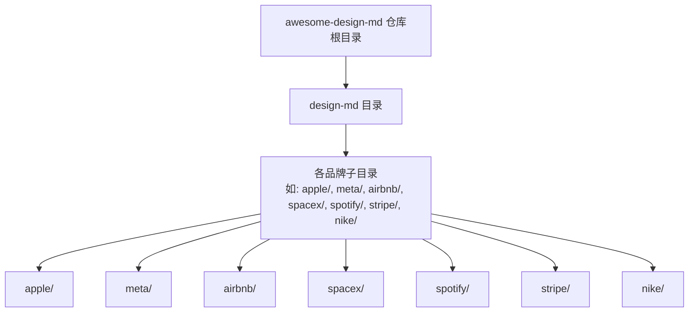
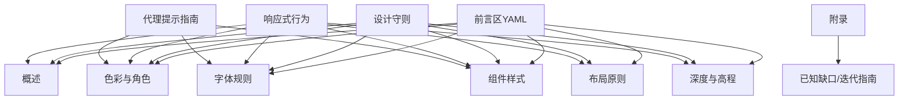
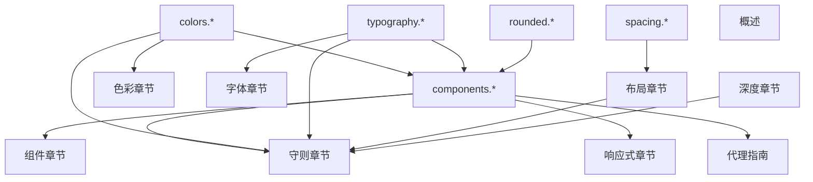

# DESIGN.md 格式规范

<cite>
**本文档引用的文件**
- [awesome-design-md 项目结构](file://awesome-design-md/README.md)
- [Apple 设计系统 DESIGN.md](file://awesome-design-md/design-md/apple/DESIGN.md)
- [Meta 设计系统 DESIGN.md](file://awesome-design-md/design-md/meta/DESIGN.md)
- [Airbnb 设计系统 DESIGN.md](file://awesome-design-md/design-md/airbnb/DESIGN.md)
- [SpaceX 设计系统 DESIGN.md](file://awesome-design-md/design-md/spaceX/DESIGN.md)
- [Spotify 设计系统 DESIGN.md](file://awesome-design-md/design-md/spotify/DESIGN.md)
- [Stripe 设计系统 DESIGN.md](file://awesome-design-md/design-md/stripe/DESIGN.md)
- [Nike 设计系统 DESIGN.md](file://awesome-design-md/design-md/nike/DESIGN.md)
</cite>

## 目录
1. [简介](#简介)
2. [项目结构](#项目结构)
3. [核心组件总览](#核心组件总览)
4. [架构概览](#架构概览)
5. [详细组件分析](#详细组件分析)
6. [依赖关系分析](#依赖关系分析)
7. [性能考虑](#性能考虑)
8. [故障排除指南](#故障排除指南)
9. [结论](#结论)
10. [附录](#附录)

## 简介
本文件为 DESIGN.md 格式规范的权威技术文档，基于 awesome-design-md 仓库中多家公司的真实设计系统案例（Apple、Meta、Airbnb、SpaceX、Spotify、Stripe、Nike 等），总结并提炼出统一的设计系统文档标准。该规范覆盖视觉主题氛围、色彩调色板、字体规则、组件样式、布局原则、深度与高程、设计守则、响应式行为、代理提示指南等九个核心部分，并提供完整的模板与示例路径、与其他项目文件的关系说明、格式验证方法与常见错误处理策略。

## 项目结构
awesome-design-md 仓库采用按品牌分目录的组织方式，每个品牌下包含 DESIGN.md 与 README.md，形成“品牌-设计系统”的清晰映射。该结构便于：
- 统一格式与字段约定
- 跨品牌对比与复用
- 自动化校验与生成工具链集成

图表来源
- [awesome-design-md 项目结构](file://awesome-design-md/README.md)

章节来源
- [awesome-design-md 项目结构](file://awesome-design-md/README.md)

## 核心组件总览
DESIGN.md 的核心内容由以下九个部分构成，每个部分都有明确的字段定义、格式规范与最佳实践：

1) 视觉主题与氛围
- 定义品牌整体气质、目标用户、使用场景与情感基调
- 描述主色、辅色、语义色的使用边界与出现频率
- 明确排版、形状、阴影等设计语言的取舍与一致性

2) 色彩调色板与角色
- 提供可复用的颜色令牌（如 primary、canvas、ink、hairline 等）
- 明确文本、表面、边框、语义状态的命名与用途
- 建议对比度与无障碍约束（如 WCAG）

3) 字体规则
- 列出字体家族、字号、字重、行高、字距、大小写等属性
- 指定变量字体、OpenType 特性（如 tnum、ss01）与回退方案
- 给出层级与使用场景的表格化定义

4) 组件样式
- 以 YAML 前言区集中声明组件令牌（backgroundColor、textColor、typography、rounded、padding 等）
- 通过组件名与变体（如 -active、-focus、-disabled）进行扩展
- 避免在正文中重复描述，保持“令牌即文档”

5) 布局原则
- 定义间距系统（基础单位、令牌集合、节拍节奏）
- 描述网格、容器、断点与列数的策略
- 解释留白哲学：密度、呼吸空间与内容优先

6) 深度与高程
- 明确阴影层级与使用边界（Flat、Subtle、Elevated、Dialog 等）
- 区分装饰性深度（摄影、渐变）与功能性深度（卡片、菜单）
- 给出阴影值与半径的参考

7) 设计守则
- 列出“必须”与“禁止”的清单，作为设计决策的快速检查表
- 强调一致性、可访问性与品牌识别

8) 响应式行为
- 提供断点列表与关键变化
- 明确触摸目标尺寸、折叠策略与图片行为
- 给出移动端优先的建议

9) 代理提示指南
- 提供颜色、组件、排版的快速参考
- 给出可直接用于 AI 代理的组件构建提示
- 提供迭代指南与常见错误规避

章节来源
- [Apple 设计系统 DESIGN.md:1-563](file://awesome-design-md/design-md/apple/DESIGN.md#L1-L563)
- [Meta 设计系统 DESIGN.md:1-684](file://awesome-design-md/design-md/meta/DESIGN.md#L1-L684)
- [Airbnb 设计系统 DESIGN.md:1-546](file://awesome-design-md/design-md/airbnb/DESIGN.md#L1-L546)
- [SpaceX 设计系统 DESIGN.md:1-364](file://awesome-design-md/design-md/spacex/DESIGN.md#L1-L364)
- [Spotify 设计系统 DESIGN.md:1-247](file://awesome-design-md/design-md/spotify/DESIGN.md#L1-L247)
- [Stripe 设计系统 DESIGN.md:1-488](file://awesome-design-md/design-md/stripe/DESIGN.md#L1-L488)
- [Nike 设计系统 DESIGN.md:1-576](file://awesome-design-md/design-md/nike/DESIGN.md#L1-L576)

## 架构概览
DESIGN.md 的文档架构遵循“前言区 + 多章节正文”的结构，前言区负责全局令牌与元数据，正文按主题分章，每章包含定义、原则、示例与注意事项。

图表来源
- [Apple 设计系统 DESIGN.md:1-563](file://awesome-design-md/design-md/apple/DESIGN.md#L1-L563)
- [Meta 设计系统 DESIGN.md:1-684](file://awesome-design-md/design-md/meta/DESIGN.md#L1-L684)
- [Airbnb 设计系统 DESIGN.md:1-546](file://awesome-design-md/design-md/airbnb/DESIGN.md#L1-L546)
- [SpaceX 设计系统 DESIGN.md:1-364](file://awesome-design-md/design-md/spacex/DESIGN.md#L1-L364)
- [Spotify 设计系统 DESIGN.md:1-247](file://awesome-design-md/design-md/spotify/DESIGN.md#L1-L247)
- [Stripe 设计系统 DESIGN.md:1-488](file://awesome-design-md/design-md/stripe/DESIGN.md#L1-L488)
- [Nike 设计系统 DESIGN.md:1-576](file://awesome-design-md/design-md/nike/DESIGN.md#L1-L576)

## 详细组件分析

### 视觉主题与氛围
- 内容要求
  - 明确品牌气质与目标用户（如消费市场、企业服务、航空航天、音乐平台）
  - 描述主色、辅色与语义色的使用边界与出现频率
  - 解释排版、形状、阴影等设计语言的取舍与一致性
- 格式规范
  - 使用简洁段落与要点列表，避免冗长描述
  - 在正文中引用前言区令牌（如 {colors.primary}）以建立前后一致
- 最佳实践
  - 将“品牌识别”与“可用性”结合，避免过度装饰
  - 以“摄影优先”“内容优先”等理念贯穿全文

章节来源
- [Apple 设计系统 DESIGN.md:276-293](file://awesome-design-md/design-md/apple/DESIGN.md#L276-L293)
- [Meta 设计系统 DESIGN.md:351-364](file://awesome-design-md/design-md/meta/DESIGN.md#L351-L364)
- [Airbnb 设计系统 DESIGN.md:329-346](file://awesome-design-md/design-md/airbnb/DESIGN.md#L329-L346)
- [SpaceX 设计系统 DESIGN.md:151-167](file://awesome-design-md/design-md/spacex/DESIGN.md#L151-L167)
- [Spotify 设计系统 DESIGN.md:3-20](file://awesome-design-md/design-md/spotify/DESIGN.md#L3-L20)
- [Stripe 设计系统 DESIGN.md:246-262](file://awesome-design-md/design-md/stripe/DESIGN.md#L246-L262)
- [Nike 设计系统 DESIGN.md:261-277](file://awesome-design-md/design-md/nike/DESIGN.md#L261-L277)

### 色彩调色板与角色
- 内容要求
  - 前言区提供 colors 分支下的令牌（如 primary、canvas、ink、hairline 等）
  - 正文分“品牌与强调色”“表面与边框”“文本”“语义”等小节说明
  - 建议对比度与无障碍约束（如 WCAG AAA/AA）
- 格式规范
  - 使用表格列出令牌、十六进制值、用途与上下文
  - 令牌引用统一使用 {colors.token} 形式
- 最佳实践
  - 控制色板规模，避免多品牌色混用
  - 语义色仅用于状态反馈，不参与界面主色

章节来源
- [Apple 设计系统 DESIGN.md:6-32](file://awesome-design-md/design-md/apple/DESIGN.md#L6-L32)
- [Meta 设计系统 DESIGN.md:6-34](file://awesome-design-md/design-md/meta/DESIGN.md#L6-L34)
- [Airbnb 设计系统 DESIGN.md:6-30](file://awesome-design-md/design-md/airbnb/DESIGN.md#L6-L30)
- [SpaceX 设计系统 DESIGN.md:6-20](file://awesome-design-md/design-md/spacex/DESIGN.md#L6-L20)
- [Spotify 设计系统 DESIGN.md:21-48](file://awesome-design-md/design-md/spotify/DESIGN.md#L21-L48)
- [Stripe 设计系统 DESIGN.md:6-27](file://awesome-design-md/design-md/stripe/DESIGN.md#L6-L27)
- [Nike 设计系统 DESIGN.md:7-31](file://awesome-design-md/design-md/nike/DESIGN.md#L7-L31)

### 字体规则
- 内容要求
  - 前言区提供 typography 分支下的令牌（如 display-lg、body、caption 等）
  - 正文给出字体家族、字号、字重、行高、字距、大小写、OpenType 特性
  - 表格化列出层级与使用场景
- 格式规范
  - 使用表格统一呈现 token、size、weight、lineHeight、letterSpacing、use
  - 回退字体链与替代方案需明确
- 最佳实践
  - 保持层级二元性（如粗细二阶），避免过多层级
  - 数字类内容使用等宽数字（tnum）与负字距微调

章节来源
- [Apple 设计系统 DESIGN.md:29-120](file://awesome-design-md/design-md/apple/DESIGN.md#L29-L120)
- [Meta 设计系统 DESIGN.md:35-122](file://awesome-design-md/design-md/meta/DESIGN.md#L35-L122)
- [Airbnb 设计系统 DESIGN.md:31-116](file://awesome-design-md/design-md/airbnb/DESIGN.md#L31-L116)
- [SpaceX 设计系统 DESIGN.md:21-70](file://awesome-design-md/design-md/spacex/DESIGN.md#L21-L70)
- [Spotify 设计系统 DESIGN.md:54-78](file://awesome-design-md/design-md/spotify/DESIGN.md#L54-L78)
- [Stripe 设计系统 DESIGN.md:28-134](file://awesome-design-md/design-md/stripe/DESIGN.md#L28-L134)
- [Nike 设计系统 DESIGN.md:32-113](file://awesome-design-md/design-md/nike/DESIGN.md#L32-L113)

### 组件样式
- 内容要求
  - 前言区 components 分支集中声明组件令牌（backgroundColor、textColor、typography、rounded、padding 等）
  - 变体以独立条目呈现（如 -active、-focus、-disabled）
  - 正文对每个组件给出结构、状态与使用场景
- 格式规范
  - 组件名与令牌引用统一（{component.name}、{colors.token}、{typography.token}、{rounded.token}）
  - 不在正文中重复令牌定义
- 最佳实践
  - 优先使用现有令牌组合，避免新增令牌
  - 按“默认/按下/禁用/聚焦”等状态分层表达

章节来源
- [Apple 设计系统 DESIGN.md:146-274](file://awesome-design-md/design-md/apple/DESIGN.md#L146-L274)
- [Meta 设计系统 DESIGN.md:150-349](file://awesome-design-md/design-md/meta/DESIGN.md#L150-L349)
- [Airbnb 设计系统 DESIGN.md:162-327](file://awesome-design-md/design-md/airbnb/DESIGN.md#L162-L327)
- [SpaceX 设计系统 DESIGN.md:88-149](file://awesome-design-md/design-md/spacex/DESIGN.md#L88-L149)
- [Spotify 设计系统 DESIGN.md:85-142](file://awesome-design-md/design-md/spotify/DESIGN.md#L85-L142)
- [Stripe 设计系统 DESIGN.md:153-244](file://awesome-design-md/design-md/stripe/DESIGN.md#L153-L244)
- [Nike 设计系统 DESIGN.md:131-259](file://awesome-design-md/design-md/nike/DESIGN.md#L131-L259)

### 布局原则
- 内容要求
  - 前言区 spacing 分支提供基础单位与令牌集合
  - 正文解释网格、容器、断点与列数策略
  - 阐述留白哲学：密度、呼吸空间与内容优先
- 格式规范
  - 使用表格列出令牌与数值
  - 断点与折叠策略以表格形式呈现
- 最佳实践
  - 以“内容密度”为导向，而非“视觉留白”
  - 移动端优先，桌面端增强

章节来源
- [Apple 设计系统 DESIGN.md:136-145](file://awesome-design-md/design-md/apple/DESIGN.md#L136-L145)
- [Meta 设计系统 DESIGN.md:135-149](file://awesome-design-md/design-md/meta/DESIGN.md#L135-L149)
- [Airbnb 设计系统 DESIGN.md:151-161](file://awesome-design-md/design-md/airbnb/DESIGN.md#L151-L161)
- [SpaceX 设计系统 DESIGN.md:78-87](file://awesome-design-md/design-md/spacex/DESIGN.md#L78-L87)
- [Spotify 设计系统 DESIGN.md:145-169](file://awesome-design-md/design-md/spotify/DESIGN.md#L145-L169)
- [Stripe 设计系统 DESIGN.md:143-152](file://awesome-design-md/design-md/stripe/DESIGN.md#L143-L152)
- [Nike 设计系统 DESIGN.md:121-129](file://awesome-design-md/design-md/nike/DESIGN.md#L121-L129)

### 深度与高程
- 内容要求
  - 明确阴影层级与使用边界（Flat、Subtle、Elevated、Dialog 等）
  - 区分装饰性深度（摄影、渐变）与功能性深度（卡片、菜单）
  - 给出阴影值与半径的参考
- 格式规范
  - 使用表格列出层级、处理方式与使用场景
- 最佳实践
  - 限制阴影层级，避免“堆叠阴影”
  - 以摄影与表面分离提供深度感

章节来源
- [Apple 设计系统 DESIGN.md:391-400](file://awesome-design-md/design-md/apple/DESIGN.md#L391-L400)
- [Meta 设计系统 DESIGN.md:447-461](file://awesome-design-md/design-md/meta/DESIGN.md#L447-L461)
- [Airbnb 设计系统 DESIGN.md:438-447](file://awesome-design-md/design-md/airbnb/DESIGN.md#L438-L447)
- [SpaceX 设计系统 DESIGN.md:240-251](file://awesome-design-md/design-md/spacex/DESIGN.md#L240-L251)
- [Spotify 设计系统 DESIGN.md:170-181](file://awesome-design-md/design-md/spotify/DESIGN.md#L170-L181)
- [Stripe 设计系统 DESIGN.md:348-359](file://awesome-design-md/design-md/stripe/DESIGN.md#L348-L359)
- [Nike 设计系统 DESIGN.md:367-376](file://awesome-design-md/design-md/nike/DESIGN.md#L367-L376)

### 设计守则
- 内容要求
  - “必须”与“禁止”清单，作为设计决策的快速检查表
  - 强调一致性、可访问性与品牌识别
- 格式规范
  - 使用要点列表，逐条列出
- 最佳实践
  - 将守则与组件令牌引用结合，避免模糊表述

章节来源
- [Apple 设计系统 DESIGN.md:488-509](file://awesome-design-md/design-md/apple/DESIGN.md#L488-L509)
- [Meta 设计系统 DESIGN.md:620-637](file://awesome-design-md/design-md/meta/DESIGN.md#L620-L637)
- [Airbnb 设计系统 DESIGN.md:518-539](file://awesome-design-md/design-md/airbnb/DESIGN.md#L518-L539)
- [SpaceX 设计系统 DESIGN.md:313-328](file://awesome-design-md/design-md/spacex/DESIGN.md#L313-L328)
- [Spotify 设计系统 DESIGN.md:182-201](file://awesome-design-md/design-md/spotify/DESIGN.md#L182-L201)
- [Stripe 设计系统 DESIGN.md:437-454](file://awesome-design-md/design-md/stripe/DESIGN.md#L437-L454)
- [Nike 设计系统 DESIGN.md:508-527](file://awesome-design-md/design-md/nike/DESIGN.md#L508-L527)

### 响应式行为
- 内容要求
  - 提供断点列表与关键变化
  - 明确触摸目标尺寸、折叠策略与图片行为
- 格式规范
  - 断点与折叠策略以表格呈现
  - 图片行为说明包含 art-direction、lazy-load 等
- 最佳实践
  - 以断点驱动的“折叠策略”为主，避免“条件渲染”
  - 移动端优先，桌面端增强

章节来源
- [Apple 设计系统 DESIGN.md:510-544](file://awesome-design-md/design-md/apple/DESIGN.md#L510-L544)
- [Meta 设计系统 DESIGN.md:638-667](file://awesome-design-md/design-md/meta/DESIGN.md#L638-L667)
- [Airbnb 设计系统 DESIGN.md:518-545](file://awesome-design-md/design-md/airbnb/DESIGN.md#L518-L545)
- [SpaceX 设计系统 DESIGN.md:329-354](file://awesome-design-md/design-md/spacex/DESIGN.md#L329-L354)
- [Spotify 设计系统 DESIGN.md:202-221](file://awesome-design-md/design-md/spotify/DESIGN.md#L202-L221)
- [Stripe 设计系统 DESIGN.md:455-478](file://awesome-design-md/design-md/stripe/DESIGN.md#L455-L478)
- [Nike 设计系统 DESIGN.md:528-558](file://awesome-design-md/design-md/nike/DESIGN.md#L528-L558)

### 代理提示指南
- 内容要求
  - 提供颜色、组件、排版的快速参考
  - 给出可直接用于 AI 代理的组件构建提示
  - 提供迭代指南与常见错误规避
- 格式规范
  - 使用“快速颜色参考”“示例组件提示”“迭代指南”等小节
- 最佳实践
  - 将令牌引用与具体值结合，便于代理理解
  - 明确“非协商项”，如“单主色、无阴影、无渐变”等

章节来源
- [Meta 设计系统 DESIGN.md:668-677](file://awesome-design-md/design-md/meta/DESIGN.md#L668-L677)
- [Spotify 设计系统 DESIGN.md:222-247](file://awesome-design-md/design-md/spotify/DESIGN.md#L222-L247)
- [Stripe 设计系统 DESIGN.md:479-488](file://awesome-design-md/design-md/stripe/DESIGN.md#L479-L488)
- [Nike 设计系统 DESIGN.md:559-568](file://awesome-design-md/design-md/nike/DESIGN.md#L559-L568)

## 依赖关系分析
DESIGN.md 的内部依赖主要体现在令牌引用与跨章节一致性上：
- colors、typography、rounded、spacing、components 均来自前言区
- 正文各章节通过 {tokens} 进行引用，确保一致性
- 组件变体（-active/-focus/-disabled）在 components 中独立声明，避免分散

图表来源
- [Apple 设计系统 DESIGN.md:1-563](file://awesome-design-md/design-md/apple/DESIGN.md#L1-L563)
- [Meta 设计系统 DESIGN.md:1-684](file://awesome-design-md/design-md/meta/DESIGN.md#L1-L684)
- [Airbnb 设计系统 DESIGN.md:1-546](file://awesome-design-md/design-md/airbnb/DESIGN.md#L1-L546)
- [SpaceX 设计系统 DESIGN.md:1-364](file://awesome-design-md/design-md/spacex/DESIGN.md#L1-L364)
- [Spotify 设计系统 DESIGN.md:1-247](file://awesome-design-md/design-md/spotify/DESIGN.md#L1-L247)
- [Stripe 设计系统 DESIGN.md:1-488](file://awesome-design-md/design-md/stripe/DESIGN.md#L1-L488)
- [Nike 设计系统 DESIGN.md:1-576](file://awesome-design-md/design-md/nike/DESIGN.md#L1-L576)

## 性能考虑
- 令牌复用与减少冗余：通过 {tokens} 引用避免重复定义
- 渐进式增强：在桌面端增加细节，在移动端保持核心功能
- 图像优化：srcset、art-direction、懒加载与CDN优化
- 组件最小化：优先使用现有组件与令牌组合，避免新增令牌

## 故障排除指南
- 常见问题
  - 令牌未解析：检查 {colors.primary} 是否存在于前言区
  - 对比度不足：使用 WCAG 工具校验文本与背景对比
  - 触摸目标过小：确保按钮与输入高度≥44px
  - 阴影滥用：限制阴影层级，避免“堆叠阴影”
- 校验方法
  - 使用 `npx @google/design.md lint DESIGN.md` 进行断链引用、对比度与孤立令牌检查
  - 手工核对断点与折叠策略是否一致
  - 交叉验证组件令牌与正文中描述的一致性

章节来源
- [Meta 设计系统 DESIGN.md:672-672](file://awesome-design-md/design-md/meta/DESIGN.md#L672-L672)
- [Nike 设计系统 DESIGN.md:563-563](file://awesome-design-md/design-md/nike/DESIGN.md#L563-L563)

## 结论
DESIGN.md 格式规范以“令牌即文档”为核心，通过统一的前言区与章节化正文，实现跨品牌设计系统的可维护性与一致性。结合真实案例的归纳与提炼，本规范为团队协作、AI 代理集成与自动化校验提供了坚实基础。

## 附录
- 完整模板与示例路径
  - Apple 设计系统模板：[Apple 设计系统 DESIGN.md](file://awesome-design-md/design-md/apple/DESIGN.md)
  - Meta 设计系统模板：[Meta 设计系统 DESIGN.md](file://awesome-design-md/design-md/meta/DESIGN.md)
  - Airbnb 设计系统模板：[Airbnb 设计系统 DESIGN.md](file://awesome-design-md/design-md/airbnb/DESIGN.md)
  - SpaceX 设计系统模板：[SpaceX 设计系统 DESIGN.md](file://awesome-design-md/design-md/spacex/DESIGN.md)
  - Spotify 设计系统模板：[Spotify 设计系统 DESIGN.md](file://awesome-design-md/design-md/spotify/DESIGN.md)
  - Stripe 设计系统模板：[Stripe 设计系统 DESIGN.md](file://awesome-design-md/design-md/stripe/DESIGN.md)
  - Nike 设计系统模板：[Nike 设计系统 DESIGN.md](file://awesome-design-md/design-md/nike/DESIGN.md)
- 与其他项目文件的关系
  - 与 README.md：用于品牌介绍与导航
  - 与 AI 代理集成：通过“代理提示指南”与令牌引用降低歧义
  - 与自动化工具：通过 linter 与断点表格支持 CI/CD 流水线