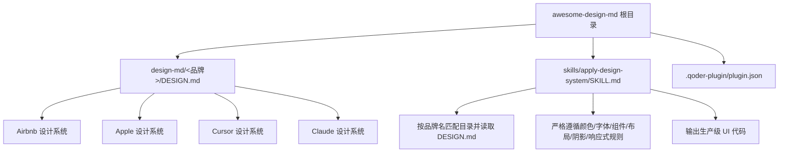
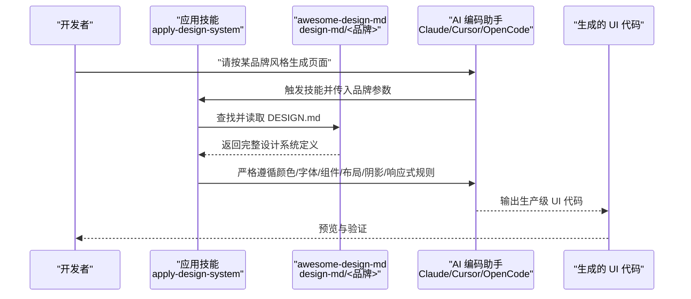
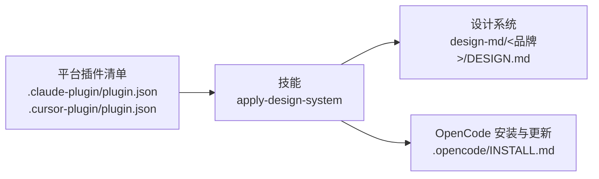

# 实际应用与集成

<cite>
**本文引用的文件**
- [awesome-design-md/README.md](file://awesome-design-md/README.md)
- [awesome-design-md/CONTRIBUTING.md](file://awesome-design-md/CONTRIBUTING.md)
- [awesome-design-md/skills/apply-design-system/SKILL.md](file://awesome-design-md/skills/apply-design-system/SKILL.md)
- [awesome-design-md/.qoder-plugin/plugin.json](file://awesome-design-md/.qoder-plugin/plugin.json)
- [awesome-design-md/design-md/airbnb/DESIGN.md](file://awesome-design-md/design-md/airbnb/DESIGN.md)
- [awesome-design-md/design-md/apple/DESIGN.md](file://awesome-design-md/design-md/apple/DESIGN.md)
- [awesome-design-md/design-md/cursor/DESIGN.md](file://awesome-design-md/design-md/cursor/DESIGN.md)
- [awesome-design-md/design-md/claude/DESIGN.md](file://awesome-design-md/design-md/claude/DESIGN.md)
- [superpowers/README.md](file://superpowers/README.md)
- [superpowers/.claude-plugin/plugin.json](file://superpowers/.claude-plugin/plugin.json)
- [superpowers/.cursor-plugin/plugin.json](file://superpowers/.cursor-plugin/plugin.json)
- [superpowers/.opencode/INSTALL.md](file://superpowers/.opencode/INSTALL.md)
</cite>

## 目录
1. [简介](#简介)
2. [项目结构](#项目结构)
3. [核心组件](#核心组件)
4. [架构总览](#架构总览)
5. [详细组件分析](#详细组件分析)
6. [依赖关系分析](#依赖关系分析)
7. [性能考虑](#性能考虑)
8. [故障排除指南](#故障排除指南)
9. [结论](#结论)
10. [附录](#附录)

## 简介
本指南面向在真实项目中落地和集成 DESIGN.md 的工程实践，围绕以下目标展开：  
- 明确 DESIGN.md 在项目中的放置位置、命名规范与版本管理策略  
- 提供与多种 AI 编程助手（Claude、Cursor、OpenCode 等）的集成步骤与提示  
- 指导如何基于业务场景选择合适的设计系统，并进行定制与扩展  
- 总结典型应用场景（快速原型、品牌一致性、团队协作效率）  
- 给出排障清单与性能优化建议  

## 项目结构
awesome-design-md 提供了大量“从真实网站提取”的 DESIGN.md 设计系统集合，每个品牌/产品一个目录，内含完整的 DESIGN.md 与说明文件；同时提供可复用的技能（SKILL）用于在不同 AI 平台自动应用这些设计系统。

图示来源
- [awesome-design-md/README.md:228-238](file://awesome-design-md/README.md#L228-L238)
- [awesome-design-md/skills/apply-design-system/SKILL.md:68-139](file://awesome-design-md/skills/apply-design-system/SKILL.md#L68-L139)

章节来源
- [awesome-design-md/README.md:228-238](file://awesome-design-md/README.md#L228-L238)
- [awesome-design-md/skills/apply-design-system/SKILL.md:68-139](file://awesome-design-md/skills/apply-design-system/SKILL.md#L68-L139)

## 核心组件
- 设计系统文件（DESIGN.md）：描述品牌视觉主题、配色角色、字体规则、组件样式、布局原则、深度体系、响应行为与代理提示指南。  
- 应用技能（apply-design-system）：在多平台（Claude、Cursor、OpenCode 等）上自动识别目标品牌，读取对应 DESIGN.md 并生成符合该设计语言的 UI。  
- 插件清单（plugin.json）：声明插件名称、描述、关键词、技能路径等元信息，便于在各平台注册与发现。  
- 贡献与校验流程：通过 Issue 反馈问题、对比线上站点修正错误值与缺失令牌、更新预览页后提交 PR。

章节来源
- [awesome-design-md/README.md:44-90](file://awesome-design-md/README.md#L44-L90)
- [awesome-design-md/skills/apply-design-system/SKILL.md:10-139](file://awesome-design-md/skills/apply-design-system/SKILL.md#L10-L139)
- [awesome-design-md/.qoder-plugin/plugin.json:1-18](file://awesome-design-md/.qoder-plugin/plugin.json#L1-L18)
- [awesome-design-md/CONTRIBUTING.md:7-22](file://awesome-design-md/CONTRIBUTING.md#L7-L22)

## 架构总览
下图展示了从“选择设计系统”到“生成 UI”的端到端流程，覆盖多平台与工具链：

图示来源
- [awesome-design-md/skills/apply-design-system/SKILL.md:68-139](file://awesome-design-md/skills/apply-design-system/SKILL.md#L68-L139)
- [awesome-design-md/design-md/airbnb/DESIGN.md:1-546](file://awesome-design-md/design-md/airbnb/DESIGN.md#L1-L546)
- [awesome-design-md/design-md/apple/DESIGN.md:1-563](file://awesome-design-md/design-md/apple/DESIGN.md#L1-L563)
- [awesome-design-md/design-md/cursor/DESIGN.md:1-538](file://awesome-design-md/design-md/cursor/DESIGN.md#L1-L538)
- [awesome-design-md/design-md/claude/DESIGN.md:1-590](file://awesome-design-md/design-md/claude/DESIGN.md#L1-L590)

## 详细组件分析

### 文件放置与命名规范
- 放置位置：将目标品牌的 DESIGN.md 复制到项目根目录或约定的“设计系统”目录（例如 design-system）。  
- 命名规范：统一使用 DESIGN.md；若项目已有同名文件，建议重命名为 <品牌>-DESIGN.md 或放入子目录以避免冲突。  
- 版本管理：  
  - 使用 Git 记录每次变更，配合 PR 流程与 Review。  
  - 对于需要预览的变更，同步更新 preview.html 与 preview-dark.html（如适用）。  
  - 重要：DESIGN.md 是纯文本，无需额外解析器，直接由 AI 代理读取即可。

章节来源
- [awesome-design-md/README.md:228-238](file://awesome-design-md/README.md#L228-L238)
- [awesome-design-md/CONTRIBUTING.md:11-18](file://awesome-design-md/CONTRIBUTING.md#L11-L18)

### 与 AI 编程助手的集成

#### Claude
- 安装插件：从官方市场安装 superpowers 插件，或通过 Marketplace 注册后安装。  
- 使用方式：在聊天中触发 apply-design-system 技能，输入品牌名或列出可用品牌，再让 Claude 读取对应 DESIGN.md 并生成 UI。  
- 插件元信息：包含名称、描述、关键词、仓库地址等，便于平台识别与加载。

章节来源
- [superpowers/README.md:48-75](file://superpowers/README.md#L48-L75)
- [superpowers/.claude-plugin/plugin.json:1-21](file://superpowers/.claude-plugin/plugin.json#L1-L21)
- [awesome-design-md/skills/apply-design-system/SKILL.md:17-27](file://awesome-design-md/skills/apply-design-system/SKILL.md#L17-L27)

#### Cursor
- 安装插件：在 Cursor Agent 中搜索 marketplace 并安装 superpowers。  
- 使用方式：与 Claude 类似，通过技能选择品牌并生成 UI。  
- 插件钩子：支持 hooks 配置，便于在会话开始时注入上下文。

章节来源
- [superpowers/README.md:113-122](file://superpowers/README.md#L113-L122)
- [superpowers/.cursor-plugin/plugin.json:1-24](file://superpowers/.cursor-plugin/plugin.json#L1-L24)
- [awesome-design-md/skills/apply-design-system/SKILL.md:17-27](file://awesome-design-md/skills/apply-design-system/SKILL.md#L17-L27)

#### OpenCode
- 安装方式：在 opencode.json 的 plugin 数组中添加插件规范，重启后自动注册所有技能。  
- 使用方式：通过 skill 工具列出与调用技能，结合 apply-design-system 生成 UI。  
- 更新与缓存：注意某些版本会缓存 git 依赖，必要时清理缓存或显式指定版本。

章节来源
- [superpowers/.opencode/INSTALL.md:7-24](file://superpowers/.opencode/INSTALL.md#L7-L24)
- [superpowers/.opencode/INSTALL.md:51-64](file://superpowers/.opencode/INSTALL.md#L51-L64)
- [awesome-design-md/skills/apply-design-system/SKILL.md:17-27](file://awesome-design-md/skills/apply-design-system/SKILL.md#L17-L27)

#### 其他平台（Qoder、Codex、Pi 等）
- Qoder：仓库自带 .qoder-plugin/plugin.json，表明可作为 Qoder 原生插件使用。  
- Codex：可通过官方市场安装；CLI 亦提供插件搜索与安装命令。  
- Pi：支持本地开发加载临时包，便于调试与迭代。

章节来源
- [awesome-design-md/.qoder-plugin/plugin.json:1-18](file://awesome-design-md/.qoder-plugin/plugin.json#L1-L18)
- [superpowers/README.md:87-112](file://superpowers/README.md#L87-L112)
- [superpowers/README.md:184-198](file://superpowers/README.md#L184-L198)

### 如何选择合适的设计系统
- 快速原型：优先选择界面简洁、组件明确的品牌（如 Apple、Cursor），便于快速对齐交互与视觉节奏。  
- 品牌一致性：面向特定行业或受众时，选择与其风格相近的品牌（如金融类可参考 Stripe、银行类可参考 Revolut）。  
- 团队协作效率：采用统一 DESIGN.md 作为“设计契约”，减少反复沟通成本，提升产出质量与一致性。

章节来源
- [awesome-design-md/README.md:96-202](file://awesome-design-md/README.md#L96-L202)
- [awesome-design-md/skills/apply-design-system/SKILL.md:28-67](file://awesome-design-md/skills/apply-design-system/SKILL.md#L28-L67)

### 自定义与扩展 DESIGN.md
- 基于现有 DESIGN.md 进行微调：修正不准确的色值、补充缺失的语义令牌、完善组件状态说明。  
- 扩展组件与状态：在 components 分区新增条目，并在 Do’s 和 Don’ts 中补充约束。  
- 字体与回退：若使用专有字体，务必在 DESIGN.md 中提供 Web 可用回退方案。  
- 预览与验证：更新 preview.html 与 preview-dark.html，确保设计令牌在可视化预览中正确呈现。

章节来源
- [awesome-design-md/CONTRIBUTING.md:9-18](file://awesome-design-md/CONTRIBUTING.md#L9-L18)
- [awesome-design-md/design-md/airbnb/DESIGN.md:329-346](file://awesome-design-md/design-md/airbnb/DESIGN.md#L329-L346)
- [awesome-design-md/design-md/apple/DESIGN.md:328-372](file://awesome-design-md/design-md/apple/DESIGN.md#L328-L372)
- [awesome-design-md/design-md/cursor/DESIGN.md:366-368](file://awesome-design-md/design-md/cursor/DESIGN.md#L366-L368)
- [awesome-design-md/design-md/claude/DESIGN.md:393-394](file://awesome-design-md/design-md/claude/DESIGN.md#L393-L394)

### 应用场景
- 快速原型设计：复制目标品牌 DESIGN.md 到项目，让 AI 代理在短时间内生成高保真页面骨架。  
- 品牌一致性保持：将 DESIGN.md 作为“设计契约”，在多人协作中统一颜色、字体、组件与布局。  
- 团队协作效率提升：通过 apply-design-system 技能，减少“我想要的风格”到“最终 UI”的中间歧义。

章节来源
- [awesome-design-md/README.md:39-42](file://awesome-design-md/README.md#L39-L42)
- [awesome-design-md/skills/apply-design-system/SKILL.md:122-139](file://awesome-design-md/skills/apply-design-system/SKILL.md#L122-L139)

## 依赖关系分析
- 技能依赖：apply-design-system 依赖于 design-md/<品牌>/DESIGN.md 的完整性与准确性。  
- 平台依赖：各平台的插件清单（plugin.json）决定技能的可见性与加载方式。  
- 版本依赖：OpenCode 场景下，git 后端的插件规范可能被缓存，需关注更新策略。

图示来源
- [superpowers/.claude-plugin/plugin.json:1-21](file://superpowers/.claude-plugin/plugin.json#L1-L21)
- [superpowers/.cursor-plugin/plugin.json:1-24](file://superpowers/.cursor-plugin/plugin.json#L1-L24)
- [awesome-design-md/skills/apply-design-system/SKILL.md:68-139](file://awesome-design-md/skills/apply-design-system/SKILL.md#L68-L139)
- [superpowers/.opencode/INSTALL.md:51-64](file://superpowers/.opencode/INSTALL.md#L51-L64)

章节来源
- [superpowers/.claude-plugin/plugin.json:1-21](file://superpowers/.claude-plugin/plugin.json#L1-L21)
- [superpowers/.cursor-plugin/plugin.json:1-24](file://superpowers/.cursor-plugin/plugin.json#L1-L24)
- [awesome-design-md/skills/apply-design-system/SKILL.md:68-139](file://awesome-design-md/skills/apply-design-system/SKILL.md#L68-L139)
- [superpowers/.opencode/INSTALL.md:51-64](file://superpowers/.opencode/INSTALL.md#L51-L64)

## 性能考虑
- 设计系统体积：DESIGN.md 为纯文本，解析开销极低；但内容越丰富，LLM 生成时的上下文越大，可能影响响应时间。  
- 组件数量与复杂度：组件越多、状态越复杂，生成与校验耗时越高。建议按页面拆分、分批生成。  
- 字体与回退：尽量使用通用回退字体，减少网络请求与渲染抖动。  
- 预览与缓存：在本地维护 preview.html，减少重复下载资源带来的等待。

## 故障排除指南
- 设计系统未生效  
  - 确认 DESIGN.md 已放置在项目根目录或约定路径，且文件名为 DESIGN.md 或与技能约定一致。  
  - 检查 DESIGN.md 内容是否完整（颜色、字体、组件、布局、阴影、响应式、Do’s and Don’ts）。  
- 生成结果不符合预期  
  - 重新阅读 DESIGN.md 的“Do’s and Don’ts”，对照修正生成内容。  
  - 在技能工作流中强调“严格遵循颜色/字体/组件/布局/阴影/响应式规则”。  
- 平台插件加载失败  
  - Claude/Cursor：确认已安装插件并在会话中启用。  
  - OpenCode：检查 opencode.json 中的插件配置，必要时清理缓存或显式指定版本。  
- 字体显示异常  
  - 若使用专有字体，确保提供 Web 可用回退方案，并在生成代码中正确引用。  
- 预览不一致  
  - 更新 preview.html 与 preview-dark.html，确保与 DESIGN.md 的令牌一致。

章节来源
- [awesome-design-md/skills/apply-design-system/SKILL.md:117-139](file://awesome-design-md/skills/apply-design-system/SKILL.md#L117-L139)
- [superpowers/.opencode/INSTALL.md:66-93](file://superpowers/.opencode/INSTALL.md#L66-L93)
- [awesome-design-md/design-md/airbnb/DESIGN.md:539-546](file://awesome-design-md/design-md/airbnb/DESIGN.md#L539-L546)
- [awesome-design-md/design-md/apple/DESIGN.md:555-563](file://awesome-design-md/design-md/apple/DESIGN.md#L555-L563)
- [awesome-design-md/design-md/cursor/DESIGN.md:532-538](file://awesome-design-md/design-md/cursor/DESIGN.md#L532-L538)
- [awesome-design-md/design-md/claude/DESIGN.md:582-590](file://awesome-design-md/design-md/claude/DESIGN.md#L582-L590)

## 结论
通过将 DESIGN.md 作为“设计契约”嵌入项目，并借助跨平台技能与插件生态，可以在多阶段（原型、评审、实现、验收）中稳定地复用品牌设计语言，显著降低沟通成本、提升产出一致性与效率。建议在团队内建立“设计系统维护与校验流程”，并持续优化生成与预览体验。

## 附录

### 设计系统示例要点（Airbnb、Apple、Cursor、Claude）
- Airbnb：单主色（Rausch）、软圆角、白画布、密集卡片网格、轻量阴影。  
- Apple：无装饰渐变、摄影优先、Action Blue 强交互、近黑瓷砖表面、单产品阴影。  
- Cursor：暖奶油画布、Cursor Orange 主色、JetBrains Mono 代码面、发丝级深度。  
- Claude：奶油画布 + 深色产品面、Copernicus 衬线 + StyreneB 人文无几何、珊瑚主色。

章节来源
- [awesome-design-md/design-md/airbnb/DESIGN.md:329-346](file://awesome-design-md/design-md/airbnb/DESIGN.md#L329-L346)
- [awesome-design-md/design-md/apple/DESIGN.md:276-293](file://awesome-design-md/design-md/apple/DESIGN.md#L276-L293)
- [awesome-design-md/design-md/cursor/DESIGN.md:284-300](file://awesome-design-md/design-md/cursor/DESIGN.md#L284-L300)
- [awesome-design-md/design-md/claude/DESIGN.md:301-323](file://awesome-design-md/design-md/claude/DESIGN.md#L301-L323)