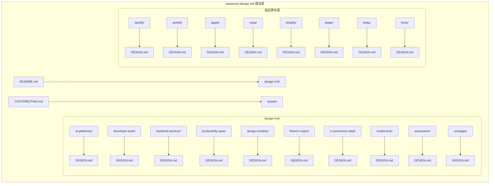
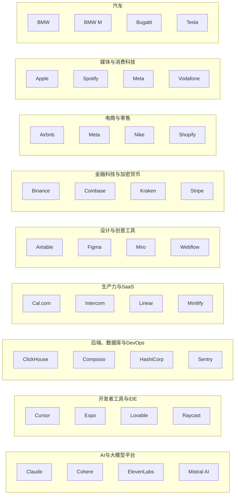
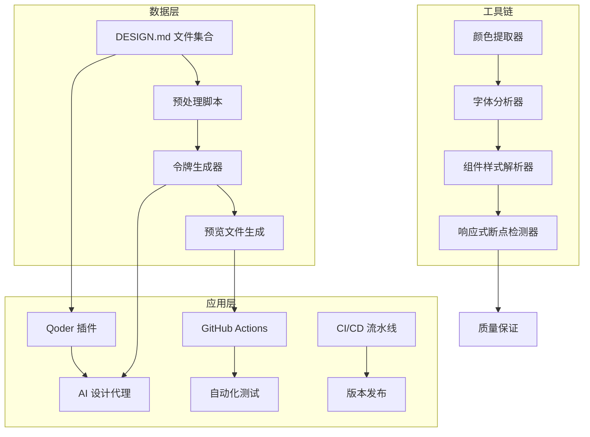
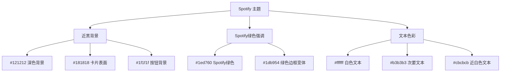
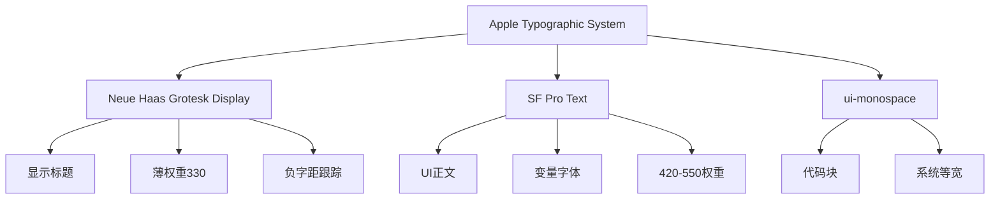
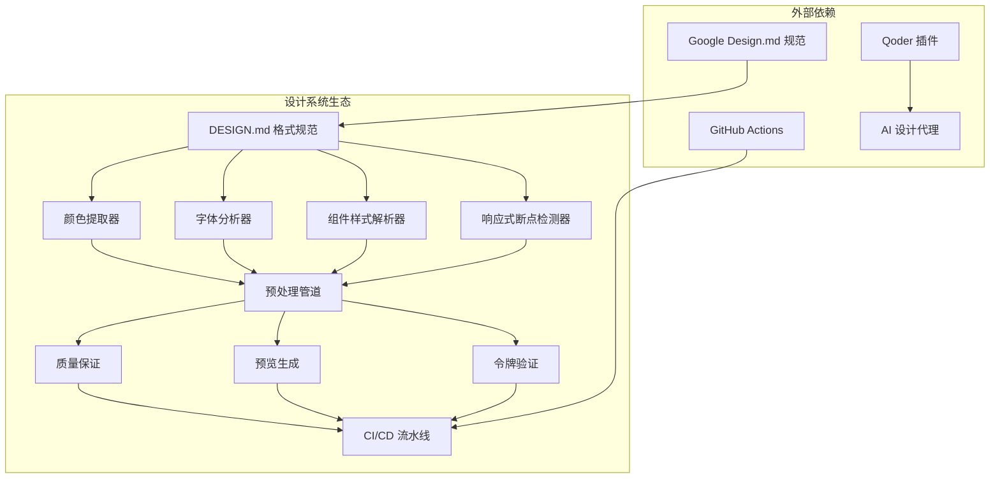
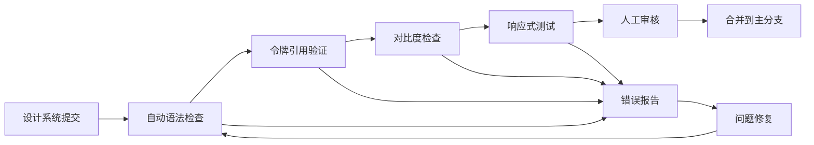

# 设计系统收集与分析

<cite>
**本文档引用的文件**
- [README.md](file://awesome-design-md/README.md)
- [CONTRIBUTING.md](file://awesome-design-md/CONTRIBUTING.md)
- [spotify/DESIGN.md](file://awesome-design-md/design-md/spotify/DESIGN.md)
- [airbnb/DESIGN.md](file://awesome-design-md/design-md/airbnb/DESIGN.md)
- [apple/DESIGN.md](file://awesome-design-md/design-md/apple/DESIGN.md)
- [meta/DESIGN.md](file://awesome-design-md/design-md/meta/DESIGN.md)
- [shopify/DESIGN.md](file://awesome-design-md/design-md/shopify/DESIGN.md)
- [stripe/DESIGN.md](file://awesome-design-md/design-md/stripe/DESIGN.md)
- [tesla/DESIGN.md](file://awesome-design-md/design-md/tesla/DESIGN.md)
- [bmw/DESIGN.md](file://awesome-design-md/design-md/bmw/DESIGN.md)
</cite>

## 目录
1. [简介](#简介)
2. [项目结构](#项目结构)
3. [核心组件](#核心组件)
4. [架构概览](#架构概览)
5. [详细组件分析](#详细组件分析)
6. [依赖关系分析](#依赖关系分析)
7. [性能考虑](#性能考虑)
8. [故障排除指南](#故障排除指南)
9. [结论](#结论)
10. [附录](#附录)

## 简介

Awesome DESIGN.md 是一个精心策划的设计系统集合与分析项目，收录了来自73+个真实网站的设计系统文档。该项目的核心价值在于提供可被AI代理直接读取和应用的设计系统，通过标准化的DESIGN.md格式，让开发者能够快速复制和应用各种优秀网站的设计语言。

该项目采用Google Stitch引入的DESIGN.md概念，这是一种纯文本设计系统文档格式，AI代理可以轻松解析和理解UI设计规范。每个DESIGN.md文件都包含了完整的视觉主题、色彩调色板、字体规则、组件样式、布局原则、深度层次等设计要素。

## 项目结构

项目采用按品牌分组的目录结构，每个品牌都有独立的文件夹，包含DESIGN.md设计文档和预览文件：



**图表来源**
- [README.md:96-202](file://awesome-design-md/README.md#L96-L202)
- [spotify/DESIGN.md:1-20](file://awesome-design-md/design-md/spotify/DESIGN.md#L1-L20)

**章节来源**
- [README.md:1-250](file://awesome-design-md/README.md#L1-L250)
- [CONTRIBUTING.md:1-26](file://awesome-design-md/CONTRIBUTING.md#L1-L26)

## 核心组件

### 设计系统文档结构

每个DESIGN.md文件都遵循统一的结构规范，包含九个核心部分：

| 序号 | 部分名称 | 内容要点 |
|------|----------|----------|
| 1 | 视觉主题与氛围 | 情绪基调、密度、设计哲学 |
| 2 | 色彩调色板与角色 | 语义化名称+十六进制值+功能角色 |
| 3 | 字体规则 | 字体系列、完整层级表 |
| 4 | 组件样式 | 按钮、卡片、输入框、导航的状态定义 |
| 5 | 布局原则 | 间距体系、网格、空白哲学 |
| 6 | 深度与高程 | 阴影系统、表面层次 |
| 7 | 行为准则 | 设计守则与反模式 |
| 8 | 响应式行为 | 断点、触点目标、折叠策略 |
| 9 | 代理提示指南 | 快速色彩参考、现成提示 |

### 分类体系

项目按照九个主要类别组织设计系统：



**图表来源**
- [README.md:98-194](file://awesome-design-md/README.md#L98-L194)

**章节来源**
- [README.md:204-227](file://awesome-design-md/README.md#L204-L227)

## 架构概览

项目采用模块化的架构设计，支持多种使用场景：



**图表来源**
- [README.md:27-41](file://awesome-design-md/README.md#L27-L41)

## 详细组件分析

### Spotify 设计系统分析

Spotify的设计系统体现了"内容优先的黑暗"理念，通过近黑色的沉浸式界面让音乐成为焦点。

#### 核心特征
- **近黑色沉浸式主题**：#121212–#1f1f1f的灰阶营造剧院般的环境
- **Spotify绿色作为单一品牌强调色**：仅用于播放按钮、活动状态和主要CTA
- **圆形几何形状**：药丸形按钮（半径500px–9999px）和圆形控制（50%半径）
- **重阴影系统**：对话框、菜单、浮出面板使用rgba(0,0,0,0.5) 0px 8px 24px

#### 色彩体系


**图表来源**
- [spotify/DESIGN.md:21-53](file://awesome-design-md/design-md/spotify/DESIGN.md#L21-L53)

**章节来源**
- [spotify/DESIGN.md:1-247](file://awesome-design-md/design-md/spotify/DESIGN.md#L1-L247)

### Airbnb 设计系统分析

Airbnb的设计系统以"慷慨的摄影驱动消费者市场"为核心，采用纯白色画布和单色Rausch（#ff385c）强调色。

#### 关键特性
- **单强调色系统**：Rausch（#ff385c）承载每个主要CTA、搜索按钮圆球和收藏心形
- **软角几何语言**：按钮8px半径（{rounded.sm}），属性卡片约14px半径（{rounded.md}）
- **定制变量字体**：Airbnb Cereal VF，显示权重在500–700之间
- **单阴影层级**：卡片悬停浮起的rgba(0,0,0,0.02) 0 0 0 1px, rgba(0,0,0,0.04) 0 2px 6px 0, rgba(0,0,0,0.1) 0 4px 8px 0

#### 组件系统
```mermaid
classDiagram
class AirbnbButton {
+backgroundColor : "{colors.primary}"
+textColor : "{colors.on-primary}"
+typography : "{typography.button-md}"
+rounded : "{rounded.sm}"
+padding : 14px 24px
+height : 48px
}
class SearchOrb {
+backgroundColor : "{colors.primary}"
+textColor : "{colors.on-primary}"
+rounded : "{rounded.full}"
+height : 48px
}
class PropertyCard {
+backgroundColor : "{colors.canvas}"
+textColor : "{colors.ink}"
+typography : "{typography.body-sm}"
+rounded : "{rounded.md}"
}
AirbnbButton --> SearchOrb : "相似设计语言"
PropertyCard --> AirbnbButton : "基于相同令牌"
```

**图表来源**
- [airbnb/DESIGN.md:162-327](file://awesome-design-md/design-md/airbnb/DESIGN.md#L162-L327)

**章节来源**
- [airbnb/DESIGN.md:1-546](file://awesome-design-md/design-md/airbnb/DESIGN.md#L1-L546)

### Apple 设计系统分析

Apple的设计系统是"产品摄影优先"的展示馆，UI退居二线让产品成为焦点。

#### 设计哲学
- **摄影优先展示**：边缘到边缘的产品瓷砖，交替浅色和深色画布
- **单蓝色强调色**：Action Blue（#0066cc）承载每个交互元素
- **无装饰渐变**：大气深度来源于产品摄影而非CSS渐变覆盖
- **轻柔阴影**：产品图像悬浮时使用单个rgba(0, 0, 0, 0.22) 3px 5px 30px

#### 字体系统


**图表来源**
- [apple/DESIGN.md:29-135](file://awesome-design-md/design-md/apple/DESIGN.md#L29-L135)

**章节来源**
- [apple/DESIGN.md:1-563](file://awesome-design-md/design-md/apple/DESIGN.md#L1-L563)

### Meta 设计系统分析

Meta的设计系统跨越硬件商业（Quest VR、Ray-Ban Meta智能眼镜）和品牌表面，具有自信的商品展示声音。

#### 核心特征
- ** stark白色画布**：全屏产品摄影，{rounded.xxxl}（32px）圆角软化展示瓷砖
- **双CTA模式**：营销表面使用{colors.ink-button}药丸；商务流使用饱和钴蓝{colors.primary}药丸
- **Optimistic VF**：Meta的可变显示字体，范围从300（轻标题）到700（副标题、正文强调）
- **药丸形状按钮**（{rounded.full}）和{rounded.xxxl}/{rounded.feature}卡片作为主导几何签名

**章节来源**
- [meta/DESIGN.md:1-684](file://awesome-design-md/design-md/meta/DESIGN.md#L1-L684)

### Shopify 设计系统分析

Shopify的设计系统运行两条并行的设计轨道，共享排版DNA但在画布极性上截然不同。

#### 双画布系统
- **电影化营销轨道**：{colors.canvas-night}（#000000）——全屏电影摄影的商人、巨大的Neue Haas Grotesk Display标题、单个黑色药丸CTA
- **交易轨道**：{colors.canvas-light}和{colors.canvas-cream}（比纯白稍暖的米色）——定价层级、比较表和注册流程
- **薄权重显示排版**：330–500权重的Neue Haas Grotesk Display处理每个显示、标题和编辑内容

**章节来源**
- [shopify/DESIGN.md:1-517](file://awesome-design-md/design-md/shopify/DESIGN.md#L1-L517)

### Stripe 设计系统分析

Stripe的设计系统建立在深海军墨水、电紫色主色和占据营销页面上三分之一的循环大气渐变网格之上。

#### 核心特征
- **深海军墨水**（#0d253d）：默认正文文本颜色和仪表盘模拟填充、特色定价层级
- **电紫色**（#533afd）：品牌的标志性CTA颜色，稀疏使用：每个带有一个填充药丸的带子
- **Sohne**（300权重）：编辑密度显示标题，负字距跟踪从-1.4px到-0.2px
- **表格数字**（tnum）：任何渲染货币、交易金额或数值计数的单元格使用

**章节来源**
- [stripe/DESIGN.md:1-488](file://awesome-design-md/design-md/stripe/DESIGN.md#L1-L488)

### Tesla 设计系统分析

Tesla的网站是一个激进减法的练习——一个数字展厅，产品就是一切，界面几乎不存在。

#### 设计理念
- **全视口英雄部分**（100vh）：充满电影感的汽车摄影，三辆车排列在抛光混凝土上对城市景观天空，单个型号名称漂浮在半透明白色类型中
- **近零UI装饰**：没有阴影、没有渐变、没有边框、没有图案
- **单强调色**：Electric Blue（#3E6AE1）——唯一在整套界面中使用的彩色
- **摄影优先展示**：产品图像承载所有情感重量

**章节来源**
- [tesla/DESIGN.md:1-287](file://awesome-design-md/design-md/tesla/DESIGN.md#L1-L287)

### BMW 设计系统分析

BMW的企业网站与赛车运动的爆炸性变体形成鲜明对比，这是一种经过深思熟虑且沉稳的企业汽车界面。

#### 设计特征
- **浅色画布**：{colors.canvas}（#ffffff）是基础表面，{colors.surface-card}（#fafafa）承载柔软灰色卡片板
- **BMW企业蓝色**（{colors.primary} — #1c69d4）：单一品牌行动颜色
- **BMW Type Next Latin**：两权重：重700（显示+按钮+导航）和Light 300（正文+次要副本）
- **按钮为矩形**：0px角——企业方言，不同于M的运动半径

**章节来源**
- [bmw/DESIGN.md:1-545](file://awesome-design-md/design-md/bmw/DESIGN.md#L1-L545)

## 依赖关系分析

项目中的设计系统相互关联，形成了一个完整的生态系统：



**图表来源**
- [README.md:27-41](file://awesome-design-md/README.md#L27-L41)

**章节来源**
- [README.md:235-247](file://awesome-design-md/README.md#L235-L247)

## 性能考虑

### 设计系统优化策略

1. **令牌化设计**：通过统一的令牌系统减少重复定义，提高维护效率
2. **响应式优先**：针对移动设备优化断点和触摸目标尺寸
3. **性能友好的预览**：生成轻量级预览文件，避免复杂的JavaScript依赖
4. **缓存策略**：利用浏览器缓存和CDN加速DESIGN.md文件的加载

### 质量保证流程



**图表来源**
- [CONTRIBUTING.md:9-21](file://awesome-design-md/CONTRIBUTING.md#L9-L21)

**章节来源**
- [CONTRIBUTING.md:1-26](file://awesome-design-md/CONTRIBUTING.md#L1-L26)

## 故障排除指南

### 常见问题及解决方案

#### 设计系统应用问题
- **问题**：AI代理无法正确解析DESIGN.md文件
- **解决方案**：确保DESIGN.md遵循Google Design.md规范，使用正确的YAML格式和令牌引用

#### 颜色不匹配问题
- **问题**：应用的颜色与原网站不一致
- **解决方案**：检查DESIGN.md中的十六进制颜色值，确认没有遗漏或错误的令牌引用

#### 响应式设计问题
- **问题**：在移动设备上显示异常
- **解决方案**：验证断点设置和触摸目标尺寸，确保符合WCAG标准

#### 组件样式问题
- **问题**：组件外观不符合预期
- **解决方案**：检查组件定义中的令牌引用，确认边框半径、间距和阴影设置正确

**章节来源**
- [CONTRIBUTING.md:9-21](file://awesome-design-md/CONTRIBUTING.md#L9-L21)

## 结论

Awesome DESIGN.md项目成功地创建了一个全面的设计系统收集与分析框架。通过标准化的DESIGN.md格式，该项目不仅保存了73+个优秀网站的设计智慧，还为AI代理提供了可直接应用的设计系统。

项目的核心价值体现在：

1. **标准化格式**：统一的DESIGN.md格式确保了设计系统的可移植性和可维护性
2. **全面覆盖**：涵盖了从AI平台到汽车的九个主要类别，为不同领域的设计需求提供了参考
3. **质量保证**：严格的贡献流程和质量控制确保了设计系统的准确性
4. **实用性强**：每个设计系统都包含了实际可用的组件定义和预览文件

未来的发展方向包括扩展更多的设计系统、优化自动化工具链、增强AI代理的集成能力，以及建立更完善的设计系统维护机制。

## 附录

### 设计系统质量评估标准

| 评估维度 | 评估标准 | 评分等级 |
|----------|----------|----------|
| 设计一致性 | 是否保持品牌设计语言的一致性 | 优秀/良好/一般/需要改进 |
| 技术完整性 | 是否包含完整的组件定义和令牌引用 | 优秀/良好/一般/需要改进 |
| 可用性 | 是否易于理解和应用 | 优秀/良好/一般/需要改进 |
| 性能表现 | 是否考虑了响应式和性能优化 | 优秀/良好/一般/需要改进 |
| 维护性 | 是否有清晰的维护和更新机制 | 优秀/良好/一般/需要改进 |

### 维护更新机制

1. **定期审查**：每季度对现有设计系统进行审查，确保与最新设计趋势保持一致
2. **社区反馈**：通过GitHub Issues收集用户反馈，持续改进设计系统的质量和实用性
3. **自动化测试**：建立自动化测试流程，确保DESIGN.md文件的语法正确性和令牌引用的有效性
4. **版本管理**：采用语义化版本控制，明确标记重大变更和破坏性更新
5. **文档更新**：随着设计系统的演进，及时更新相关文档和使用指南