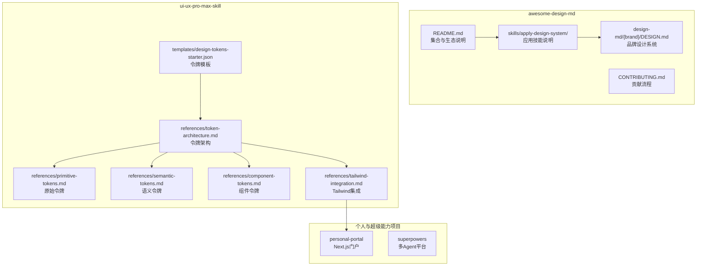
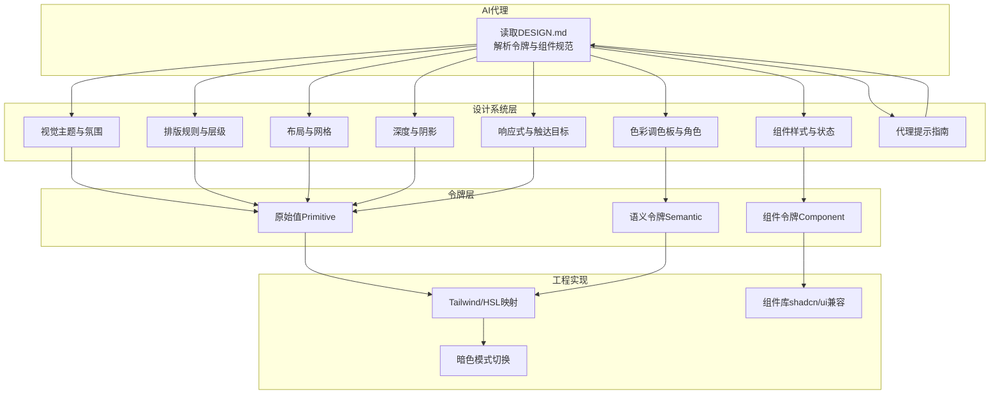
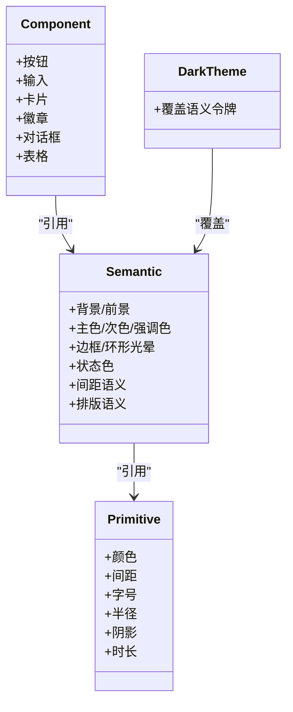
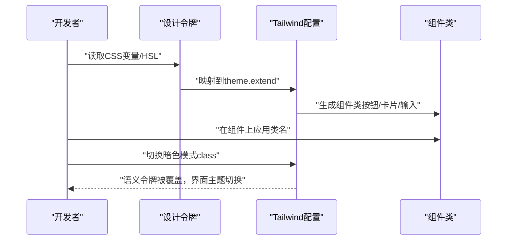
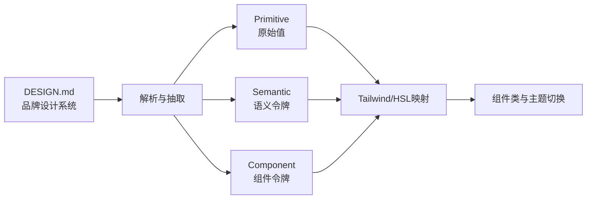

# 设计系统概念与原理

<cite>
**本文引用的文件**
- [awesome-design-md/README.md](file://awesome-design-md/README.md)
- [awesome-design-md/CONTRIBUTING.md](file://awesome-design-md/CONTRIBUTING.md)
- [awesome-design-md/skills/apply-design-system/README.md](file://awesome-design-md/skills/apply-design-system/README.md)
- [awesome-design-md/skills/apply-design-system/SKILL.md](file://awesome-design-md/skills/apply-design-system/SKILL.md)
- [awesome-design-md/design-md/stripe/DESIGN.md](file://awesome-design-md/design-md/stripe/DESIGN.md)
- [awesome-design-md/design-md/linear.app/DESIGN.md](file://awesome-design-md/design-md/linear.app/DESIGN.md)
- [awesome-design-md/design-md/vercel/DESIGN.md](file://awesome-design-md/design-md/vercel/DESIGN.md)
- [ui-ux-pro-max-skill/.claude/skills/design-system/references/token-architecture.md](file://ui-ux-pro-max-skill/.claude/skills/design-system/references/token-architecture.md)
- [ui-ux-pro-max-skill/.claude/skills/design-system/references/primitive-tokens.md](file://ui-ux-pro-max-skill/.claude/skills/design-system/references/primitive-tokens.md)
- [ui-ux-pro-max-skill/.claude/skills/design-system/references/semantic-tokens.md](file://ui-ux-pro-max-skill/.claude/skills/design-system/references/semantic-tokens.md)
- [ui-ux-pro-max-skill/.claude/skills/design-system/references/component-tokens.md](file://ui-ux-pro-max-skill/.claude/skills/design-system/references/component-tokens.md)
- [ui-ux-pro-max-skill/.claude/skills/design-system/references/tailwind-integration.md](file://ui-ux-pro-max-skill/.claude/skills/design-system/references/tailwind-integration.md)
- [ui-ux-pro-max-skill/.claude/skills/design-system/templates/design-tokens-starter.json](file://ui-ux-pro-max-skill/.claude/skills/design-system/templates/design-tokens-starter.json)
</cite>

## 目录
1. [引言](#引言)
2. [项目结构](#项目结构)
3. [核心组件](#核心组件)
4. [架构总览](#架构总览)
5. [详细组件分析](#详细组件分析)
6. [依赖关系分析](#依赖关系分析)
7. [性能考量](#性能考量)
8. [故障排查指南](#故障排查指南)
9. [结论](#结论)
10. [附录](#附录)

## 引言
本文件系统化阐述“设计系统”在AI辅助开发中的核心概念、设计理念与标准化价值，并结合仓库中真实网站提取的DESIGN.md范式与三层次设计令牌体系，说明如何通过统一的设计规范确保AI生成界面的一致性与专业性。我们将从以下维度展开：
- 设计系统在AI生成中的作用：以可读、可解析、可迁移的文本形式定义品牌风格与设计语言，避免表面化UI输出。
- 设计系统构成要素：视觉主题氛围、色彩调色板、字体规则、组件样式、布局原则、深度与层级、响应式行为、代理提示指南等。
- 三层次令牌架构：原始值（Primitive）、语义别名（Semantic）、组件令牌（Component），支撑主题切换与规模化复用。
- 与传统设计工具的对比：DESIGN.md以Markdown为载体，无需复杂导出或专用工具，直接被LLM阅读与执行；同时可映射到Tailwind、shadcn/ui等工程化体系。

## 项目结构
该仓库由三大板块组成：
- awesome-design-md：收集与发布来自真实网站的DESIGN.md设计系统文档，配套技能与使用说明。
- ui-ux-pro-max-skill：提供设计系统参考与令牌模板，包含令牌架构、原语、语义与组件令牌，以及Tailwind集成方案。
- 个人与超级能力项目：展示设计系统在实际前端工程中的落地实践（如Next.js门户、技能脚本等）。

图示来源
- [awesome-design-md/README.md:1-250](file://awesome-design-md/README.md#L1-L250)
- [awesome-design-md/skills/apply-design-system/SKILL.md:1-139](file://awesome-design-md/skills/apply-design-system/SKILL.md#L1-L139)
- [ui-ux-pro-max-skill/.claude/skills/design-system/references/token-architecture.md:1-225](file://ui-ux-pro-max-skill/.claude/skills/design-system/references/token-architecture.md#L1-L225)
- [ui-ux-pro-max-skill/.claude/skills/design-system/references/tailwind-integration.md:1-252](file://ui-ux-pro-max-skill/.claude/skills/design-system/references/tailwind-integration.md#L1-L252)

章节来源
- [awesome-design-md/README.md:1-250](file://awesome-design-md/README.md#L1-L250)
- [awesome-design-md/CONTRIBUTING.md:1-26](file://awesome-design-md/CONTRIBUTING.md#L1-L26)
- [awesome-design-md/skills/apply-design-system/SKILL.md:1-139](file://awesome-design-md/skills/apply-design-system/SKILL.md#L1-L139)

## 核心组件
- 设计系统文档（DESIGN.md）
  - 定义品牌视觉主题、色彩角色、排版规则、组件样式、布局原则、深度层级、响应式策略与代理提示指南。
  - 示例：Stripe、Linear、Vercel等品牌文档展示了完整的令牌与组件规范。
- 令牌体系（Token Architecture）
  - 原始值（Primitive）：颜色、间距、字号、半径、阴影、时长等基础数值。
  - 语义令牌（Semantic）：面向用途的颜色别名（如背景、前景、主色、次色、强调色、边框、环形光晕等）。
  - 组件令牌（Component）：具体组件（按钮、输入、卡片、徽章、对话框、表格等）的样式与状态。
- 工程化集成
  - Tailwind CSS映射：将CSS变量映射到Tailwind配置，支持HSL格式与透明度修饰符，便于与shadcn/ui生态兼容。
  - 模板与脚本：提供设计令牌JSON模板与校验脚本，保障一致性与可维护性。

章节来源
- [awesome-design-md/design-md/stripe/DESIGN.md:1-488](file://awesome-design-md/design-md/stripe/DESIGN.md#L1-L488)
- [awesome-design-md/design-md/linear.app/DESIGN.md:1-549](file://awesome-design-md/design-md/linear.app/DESIGN.md#L1-L549)
- [awesome-design-md/design-md/vercel/DESIGN.md:1-737](file://awesome-design-md/design-md/vercel/DESIGN.md#L1-L737)
- [ui-ux-pro-max-skill/.claude/skills/design-system/references/token-architecture.md:1-225](file://ui-ux-pro-max-skill/.claude/skills/design-system/references/token-architecture.md#L1-L225)
- [ui-ux-pro-max-skill/.claude/skills/design-system/references/primitive-tokens.md:1-204](file://ui-ux-pro-max-skill/.claude/skills/design-system/references/primitive-tokens.md#L1-L204)
- [ui-ux-pro-max-skill/.claude/skills/design-system/references/semantic-tokens.md:1-216](file://ui-ux-pro-max-skill/.claude/skills/design-system/references/semantic-tokens.md#L1-L216)
- [ui-ux-pro-max-skill/.claude/skills/design-system/references/component-tokens.md:1-215](file://ui-ux-pro-max-skill/.claude/skills/design-system/references/component-tokens.md#L1-L215)
- [ui-ux-pro-max-skill/.claude/skills/design-system/references/tailwind-integration.md:1-252](file://ui-ux-pro-max-skill/.claude/skills/design-system/references/tailwind-integration.md#L1-L252)
- [ui-ux-pro-max-skill/.claude/skills/design-system/templates/design-tokens-starter.json:1-144](file://ui-ux-pro-max-skill/.claude/skills/design-system/templates/design-tokens-starter.json#L1-L144)

## 架构总览
下图展示了从品牌DESIGN.md到工程落地的端到端路径：AI代理读取DESIGN.md，依据令牌与组件规范生成UI；工程侧通过Tailwind/HSL映射与组件令牌实现一致性与主题切换。

图示来源
- [awesome-design-md/design-md/stripe/DESIGN.md:246-488](file://awesome-design-md/design-md/stripe/DESIGN.md#L246-L488)
- [awesome-design-md/design-md/linear.app/DESIGN.md:258-549](file://awesome-design-md/design-md/linear.app/DESIGN.md#L258-L549)
- [awesome-design-md/design-md/vercel/DESIGN.md:392-737](file://awesome-design-md/design-md/vercel/DESIGN.md#L392-L737)
- [ui-ux-pro-max-skill/.claude/skills/design-system/references/token-architecture.md:1-225](file://ui-ux-pro-max-skill/.claude/skills/design-system/references/token-architecture.md#L1-L225)
- [ui-ux-pro-max-skill/.claude/skills/design-system/references/tailwind-integration.md:1-252](file://ui-ux-pro-max-skill/.claude/skills/design-system/references/tailwind-integration.md#L1-L252)

## 详细组件分析

### 设计系统文档（DESIGN.md）结构与要点
- 视觉主题与氛围：定义品牌情绪、密度与设计哲学，作为生成UI的基调。
- 色彩调色板与角色：给出语义化命名与十六进制值，明确主色、强调色、表面色、文本色与边框/环形光晕等角色。
- 排版规则：包含字体族、字号层级表、行高、字重与字距等，部分品牌启用OpenType特性（如tnum、ss01）。
- 组件样式：覆盖按钮、输入、卡片、导航、标签、徽章、对话框、表格等，含默认、悬停、按下、禁用等状态。
- 布局与网格：间距体系、容器宽度、栅格与留白理念。
- 深度与阴影：分层级的阴影系统与装饰性深度（如渐变背景）。
- 响应式行为：断点、触达目标尺寸、折叠策略与图片行为。
- 代理提示指南：快速色彩参考与即用提示词，提升AI生成效率与一致性。

章节来源
- [awesome-design-md/README.md:204-227](file://awesome-design-md/README.md#L204-L227)
- [awesome-design-md/design-md/stripe/DESIGN.md:246-488](file://awesome-design-md/design-md/stripe/DESIGN.md#L246-L488)
- [awesome-design-md/design-md/linear.app/DESIGN.md:258-549](file://awesome-design-md/design-md/linear.app/DESIGN.md#L258-L549)
- [awesome-design-md/design-md/vercel/DESIGN.md:392-737](file://awesome-design-md/design-md/vercel/DESIGN.md#L392-L737)

### 令牌架构（三层次）
- 原始值（Primitive）：颜色、间距、字号、半径、阴影、时长等基础数值，作为不可再拆的原子单位。
- 语义令牌（Semantic）：面向用途的颜色别名（背景、前景、主色、次色、强调色、边框、环形光晕等），用于主题切换与跨组件复用。
- 组件令牌（Component）：具体组件的样式与状态，引用语义令牌，确保组件外观与品牌一致。
- 暗色模式：通过覆盖语义令牌实现即时主题切换。
- 命名约定：采用分类-项目-变体-状态的命名方式，便于检索与维护。
- 文件组织：建议按层拆分或单文件注释分层，便于导入与管理。
- 迁移与对齐：可迁移到W3C DTCG JSON格式，便于跨工具链共享。

图示来源
- [ui-ux-pro-max-skill/.claude/skills/design-system/references/token-architecture.md:1-225](file://ui-ux-pro-max-skill/.claude/skills/design-system/references/token-architecture.md#L1-L225)
- [ui-ux-pro-max-skill/.claude/skills/design-system/references/semantic-tokens.md:1-216](file://ui-ux-pro-max-skill/.claude/skills/design-system/references/semantic-tokens.md#L1-L216)
- [ui-ux-pro-max-skill/.claude/skills/design-system/references/component-tokens.md:1-215](file://ui-ux-pro-max-skill/.claude/skills/design-system/references/component-tokens.md#L1-L215)

章节来源
- [ui-ux-pro-max-skill/.claude/skills/design-system/references/token-architecture.md:1-225](file://ui-ux-pro-max-skill/.claude/skills/design-system/references/token-architecture.md#L1-L225)
- [ui-ux-pro-max-skill/.claude/skills/design-system/references/primitive-tokens.md:1-204](file://ui-ux-pro-max-skill/.claude/skills/design-system/references/primitive-tokens.md#L1-L204)
- [ui-ux-pro-max-skill/.claude/skills/design-system/references/semantic-tokens.md:1-216](file://ui-ux-pro-max-skill/.claude/skills/design-system/references/semantic-tokens.md#L1-L216)
- [ui-ux-pro-max-skill/.claude/skills/design-system/references/component-tokens.md:1-215](file://ui-ux-pro-max-skill/.claude/skills/design-system/references/component-tokens.md#L1-L215)

### Tailwind 集成与 shadcn/ui 兼容
- CSS变量与HSL：将令牌映射为HSL变量，支持透明度修饰符（如bg-primary/50），便于在Tailwind类中直接使用。
- Tailwind配置：扩展colors、borderRadius、spacing、transitionDuration、keyframes与animation，使组件类与令牌保持一致。
- 暗色模式：通过class开关切换，自动覆盖语义令牌，实现无缝主题切换。
- 与shadcn/ui对齐：命名与结构与shadcn/ui一致，可直接使用其add命令生成组件并继承设计系统。

图示来源
- [ui-ux-pro-max-skill/.claude/skills/design-system/references/tailwind-integration.md:1-252](file://ui-ux-pro-max-skill/.claude/skills/design-system/references/tailwind-integration.md#L1-L252)

章节来源
- [ui-ux-pro-max-skill/.claude/skills/design-system/references/tailwind-integration.md:1-252](file://ui-ux-pro-max-skill/.claude/skills/design-system/references/tailwind-integration.md#L1-L252)

### 品牌设计系统实例：Stripe、Linear、Vercel
- Stripe
  - 特征：深海军蓝主色、奶油/杏色暖带、Sohne细体负间距显示、数值使用等宽数字、Pill按钮、深色仪表盘。
  - 关键令牌：色彩（主色、文案色、画布、发丝边框）、排版（display-xl至micro）、圆角（pill）、间距（xxs到huge）。
  - 组件：主按钮、次按钮、输入、卡片、导航、标签、页脚等。
- Linear
  - 特征：近黑画布、浅灰文本、Lavender蓝强调、四阶表面阶梯、产品截图为主、无渐变。
  - 关键令牌：深黑画布、表面阶梯、强调色、负间距显示、mono仅用于代码。
  - 组件：主/次/逆色按钮、定价卡、功能卡、截图卡、输入、导航、页脚。
- Vercel
  - 特征：黑/墨双色主CTA、近白画布、多色渐变装饰、几何无衬线+等宽、极简阴影堆叠。
  - 关键令牌：主色/链接/成功/错误/警告、画布软/硬、hairline强、渐变段、排版负间距。
  - 组件：主/次按钮、导航CTA、标签、卡片、输入、导航栏、页脚、代码编辑器模拟。

章节来源
- [awesome-design-md/design-md/stripe/DESIGN.md:1-488](file://awesome-design-md/design-md/stripe/DESIGN.md#L1-L488)
- [awesome-design-md/design-md/linear.app/DESIGN.md:1-549](file://awesome-design-md/design-md/linear.app/DESIGN.md#L1-L549)
- [awesome-design-md/design-md/vercel/DESIGN.md:1-737](file://awesome-design-md/design-md/vercel/DESIGN.md#L1-L737)

### 设计系统与传统设计工具的对比
- 优势
  - 可读性：Markdown纯文本，LLM天然友好，无需解析器或导出工具。
  - 可移植性：不绑定特定平台或软件，可在任何AI编码代理中使用。
  - 可维护性：集中式令牌与组件规范，易于更新与校验。
- 局限
  - 传统工具链（Figma、Sketch等）在视觉协作与原型迭代方面仍有优势。
  - 对于复杂交互与动效，需要额外补充说明或脚本。
- 适用场景
  - 快速生成一致UI、跨团队协作、AI驱动的界面生成与重构。
  - 与Tailwind/shadcn/ui等前端体系结合，实现工程化落地。

章节来源
- [awesome-design-md/README.md:44-61](file://awesome-design-md/README.md#L44-L61)
- [awesome-design-md/skills/apply-design-system/SKILL.md:122-133](file://awesome-design-md/skills/apply-design-system/SKILL.md#L122-L133)

## 依赖关系分析
- 文档到令牌：DESIGN.md定义的视觉与排版规则映射到Primitive/Semantic/Component三层令牌。
- 令牌到工程：Tailwind/HSL映射将令牌注入组件类，实现主题切换与一致性。
- 质量保证：提供校验脚本与模板，确保令牌命名、取值与暗色模式覆盖符合规范。

图示来源
- [awesome-design-md/design-md/stripe/DESIGN.md:246-488](file://awesome-design-md/design-md/stripe/DESIGN.md#L246-L488)
- [ui-ux-pro-max-skill/.claude/skills/design-system/references/token-architecture.md:1-225](file://ui-ux-pro-max-skill/.claude/skills/design-system/references/token-architecture.md#L1-L225)
- [ui-ux-pro-max-skill/.claude/skills/design-system/references/tailwind-integration.md:1-252](file://ui-ux-pro-max-skill/.claude/skills/design-system/references/tailwind-integration.md#L1-L252)

章节来源
- [awesome-design-md/design-md/stripe/DESIGN.md:246-488](file://awesome-design-md/design-md/stripe/DESIGN.md#L246-L488)
- [ui-ux-pro-max-skill/.claude/skills/design-system/references/token-architecture.md:1-225](file://ui-ux-pro-max-skill/.claude/skills/design-system/references/token-architecture.md#L1-L225)
- [ui-ux-pro-max-skill/.claude/skills/design-system/references/tailwind-integration.md:1-252](file://ui-ux-pro-max-skill/.claude/skills/design-system/references/tailwind-integration.md#L1-L252)

## 性能考量
- 令牌规模与查询成本
  - 三层令牌降低查询与替换成本：语义令牌抽象了品牌意图，组件令牌聚焦UI细节。
- 渲染与主题切换
  - 使用CSS变量与HSL减少重绘与回流；暗色模式切换通过class切换，避免全局重算。
- 工具链开销
  - Markdown解析与令牌映射开销低；Tailwind按需生成类，避免冗余样式。
- 建议
  - 合理拆分令牌文件，按层组织；在CI中加入令牌校验与预览生成，确保一致性。

## 故障排查指南
- 常见问题
  - AI生成UI与品牌风格不符：检查是否完整读取DESIGN.md，是否严格遵循“Do’s and Don’ts”。
  - 颜色不一致：确认使用语义令牌而非硬编码值；核对暗色模式覆盖。
  - 字体与排版异常：检查OpenType特性与fallback字体设置。
  - 组件状态不正确：对照组件令牌与状态定义，确保hover/active/disabled一致。
- 处理步骤
  - 逐项比对DESIGN.md的“Do’s and Don’ts”与生成结果。
  - 在Tailwind配置中核对HSL变量与类名映射。
  - 使用提供的校验脚本与模板进行一致性检查。

章节来源
- [awesome-design-md/skills/apply-design-system/SKILL.md:117-121](file://awesome-design-md/skills/apply-design-system/SKILL.md#L117-L121)
- [awesome-design-md/design-md/stripe/DESIGN.md:437-454](file://awesome-design-md/design-md/stripe/DESIGN.md#L437-L454)
- [awesome-design-md/design-md/linear.app/DESIGN.md:480-501](file://awesome-design-md/design-md/linear.app/DESIGN.md#L480-L501)
- [awesome-design-md/design-md/vercel/DESIGN.md:718-737](file://awesome-design-md/design-md/vercel/DESIGN.md#L718-L737)

## 结论
DESIGN.md以简洁、可读、可迁移的方式定义品牌设计语言，配合三层次令牌体系与Tailwind集成，能够有效避免AI生成的表面化输出，确保界面在一致性、专业性与可维护性之间取得平衡。通过将品牌规范沉淀为文本，设计系统不仅服务于AI代理，也服务于工程师与设计师的协作与交付。

## 附录
- 设计系统应用流程（Apply Design System）
  - 识别目标品牌 → 读取DESIGN.md → 应用令牌与组件规范 → 校验“Do’s and Don’ts” → 生成生产级UI代码。
- 令牌模板与校验
  - 提供W3C DTCG格式的令牌JSON模板，便于导入与跨工具链共享；配套校验脚本保障质量。

章节来源
- [awesome-design-md/skills/apply-design-system/SKILL.md:68-139](file://awesome-design-md/skills/apply-design-system/SKILL.md#L68-L139)
- [ui-ux-pro-max-skill/.claude/skills/design-system/templates/design-tokens-starter.json:1-144](file://ui-ux-pro-max-skill/.claude/skills/design-system/templates/design-tokens-starter.json#L1-L144)