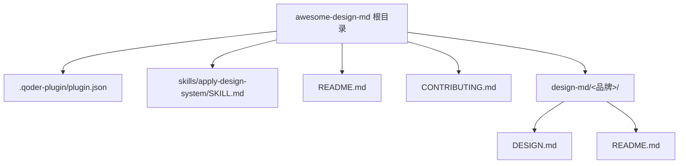
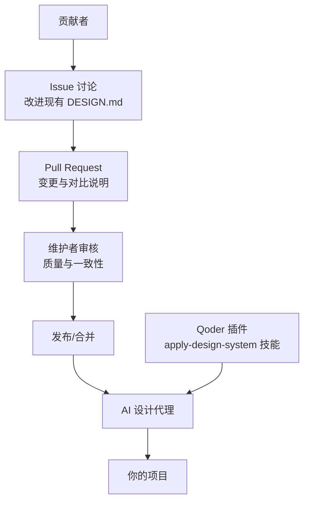
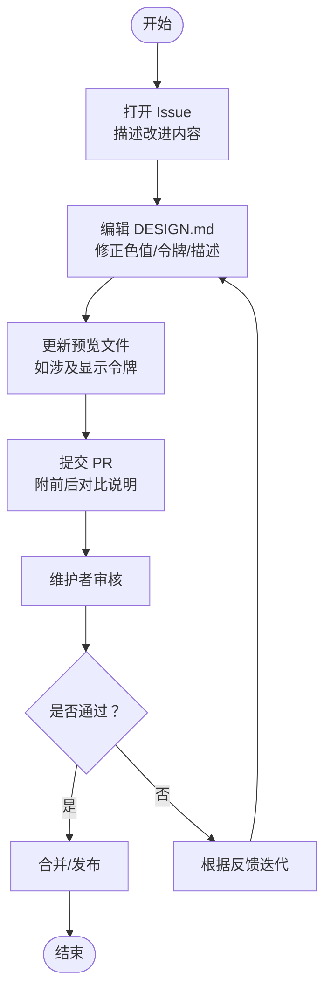
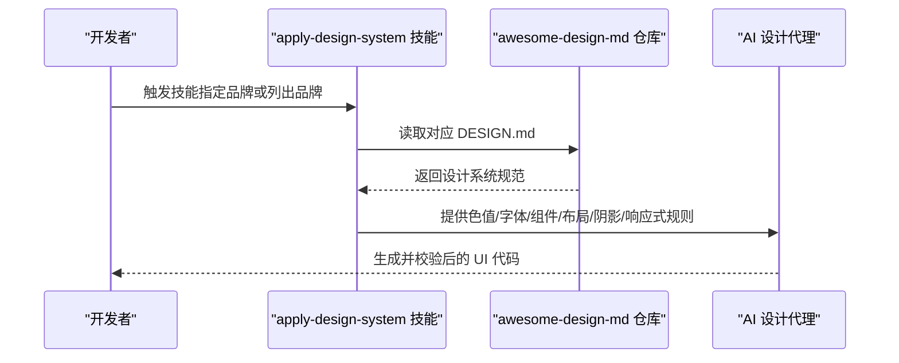
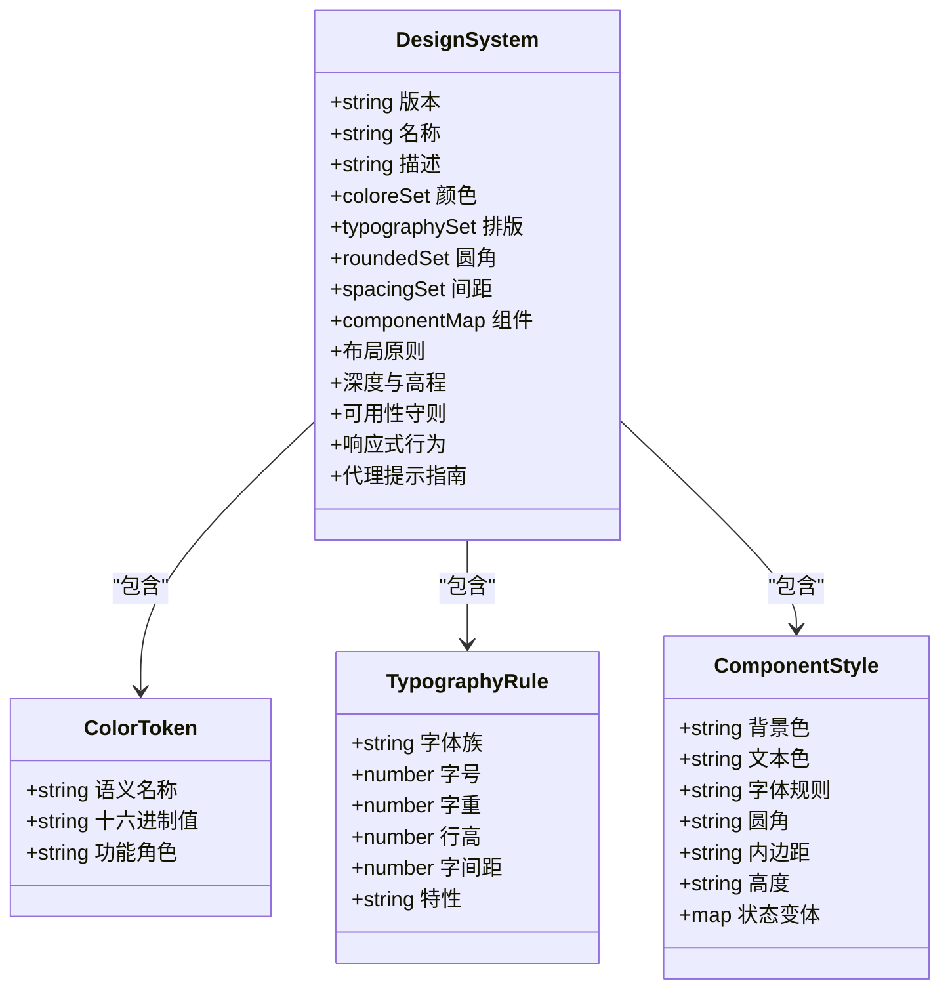
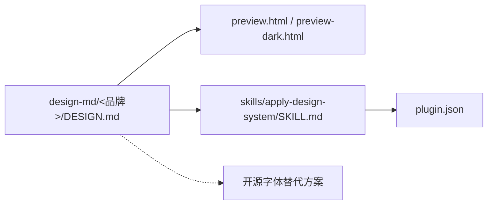

# 贡献指南与扩展

<cite>
**本文引用的文件**
- [CONTRIBUTING.md](file://awesome-design-md/CONTRIBUTING.md)
- [README.md](file://awesome-design-md/README.md)
- [plugin.json](file://awesome-design-md/.qoder-plugin/plugin.json)
- [SKILL.md](file://awesome-design-md/skills/apply-design-system/SKILL.md)
- [airbnb/DESIGN.md](file://awesome-design-md/design-md/airbnb/DESIGN.md)
- [stripe/DESIGN.md](file://awesome-design-md/design-md/stripe/DESIGN.md)
- [vercel/DESIGN.md](file://awesome-design-md/design-md/vercel/DESIGN.md)
- [meta/DESIGN.md](file://awesome-design-md/design-md/meta/DESIGN.md)
- [FUNDING.yml](file://awesome-design-md/.github/FUNDING.yml)
</cite>

## 目录
1. [简介](#简介)
2. [项目结构](#项目结构)
3. [核心组件](#核心组件)
4. [架构总览](#架构总览)
5. [详细组件分析](#详细组件分析)
6. [依赖关系分析](#依赖关系分析)
7. [性能考虑](#性能考虑)
8. [故障排查指南](#故障排查指南)
9. [结论](#结论)
10. [附录](#附录)

## 简介
本文件面向希望为 awesome-design-md 项目贡献与扩展的开发者与设计工程师，提供从“如何贡献新的设计系统”到“如何在实际工程中应用”的完整指南。项目以纯文本的 DESIGN.md 文件为核心，收录来自真实网站的设计系统分析，帮助 AI 设计代理与前端工程团队生成风格一致、可读性强的界面。

- 仓库定位：精选 75+ 品牌/平台的设计系统集合，覆盖 AI 平台、开发者工具、后端与数据库、生产力与 SaaS、设计与创意工具、金融科技与加密货币、电商与零售、媒体与消费科技、汽车与复古 Web 等类别。
- 使用方式：将任一 DESIGN.md 复制到项目根目录，即可指导 AI 代理生成符合该品牌视觉语言的 UI；同时支持通过 Qoder 插件技能直接应用设计系统。

章节来源
- [README.md:1-250](file://awesome-design-md/README.md#L1-L250)

## 项目结构
仓库采用按品牌分组的扁平化组织方式，每个品牌一个目录，内含 DESIGN.md 与 README.md（用于跳转至在线展示页）。此外，项目还包含一个可直接安装为 Qoder 插件的元数据文件与一个“应用设计系统”的技能说明文件，便于在 AI 工作流中调用。

图表来源
- [plugin.json:1-18](file://awesome-design-md/.qoder-plugin/plugin.json#L1-L18)
- [SKILL.md:1-139](file://awesome-design-md/skills/apply-design-system/SKILL.md#L1-L139)
- [README.md:1-250](file://awesome-design-md/README.md#L1-L250)
- [CONTRIBUTING.md:1-26](file://awesome-design-md/CONTRIBUTING.md#L1-L26)

章节来源
- [README.md:96-250](file://awesome-design-md/README.md#L96-L250)
- [plugin.json:1-18](file://awesome-design-md/.qoder-plugin/plugin.json#L1-L18)
- [SKILL.md:1-139](file://awesome-design-md/skills/apply-design-system/SKILL.md#L1-L139)

## 核心组件
- 设计系统文档（DESIGN.md）
  - 结构化定义：视觉主题与氛围、色板与角色、排版规则、组件样式、布局原则、深度与高程、可用性守则、响应式行为、代理提示指南等。
  - 示例参考：Airbnb、Stripe、Vercel、Meta 等品牌的完整 DESIGN.md 展示了从色值、字号、字重、行高、字间距到组件圆角、内边距、状态变体与断点策略的全链路规范。
- 应用技能（apply-design-system）
  - 提供品牌清单与工作流步骤，强调严格遵循 DESIGN.md 的色值、字体、组件、布局、阴影与响应式策略，并在生成后对照“可用性守则”进行校验。
- 插件元数据（Qoder）
  - 将项目打包为 Qoder 原生插件，支持在 Qoder 中直接调用 apply-design-system 技能，实现“即插即用”的设计系统应用。

章节来源
- [airbnb/DESIGN.md:1-546](file://awesome-design-md/design-md/airbnb/DESIGN.md#L1-L546)
- [stripe/DESIGN.md:1-200](file://awesome-design-md/design-md/stripe/DESIGN.md#L1-L200)
- [vercel/DESIGN.md:1-200](file://awesome-design-md/design-md/vercel/DESIGN.md#L1-L200)
- [meta/DESIGN.md:1-200](file://awesome-design-md/design-md/meta/DESIGN.md#L1-L200)
- [SKILL.md:1-139](file://awesome-design-md/skills/apply-design-system/SKILL.md#L1-L139)
- [plugin.json:1-18](file://awesome-design-md/.qoder-plugin/plugin.json#L1-L18)

## 架构总览
下图展示了从“贡献者提交 DESIGN.md”到“AI 工具读取 DESIGN.md 生成 UI”的端到端流程，以及“Qoder 插件技能”在其中的集成位置。

图表来源
- [CONTRIBUTING.md:7-21](file://awesome-design-md/CONTRIBUTING.md#L7-L21)
- [SKILL.md:68-139](file://awesome-design-md/skills/apply-design-system/SKILL.md#L68-L139)

## 详细组件分析

### 设计系统贡献流程（收集-分析-编写-提交）
- 改进现有 DESIGN.md
  - 步骤要点：先开 Issue 讨论 → 打开目标站点的 DESIGN.md → 对照线上页面 → 修正错误色值/缺失令牌/弱描述 → 更新预览文件（如涉及显示令牌）→ 提交 PR 并附带前后对比说明。
  - 注意事项：仓库不接受未经讨论的全新 DESIGN.md PR，以确保整体质量与一致性。
- 新增品牌设计系统
  - 当前仓库策略：优先通过 Issue 讨论与维护者沟通，再决定是否纳入。请遵循统一的 DESIGN.md 结构与命名约定，确保可读性与可维护性。

图表来源
- [CONTRIBUTING.md:9-18](file://awesome-design-md/CONTRIBUTING.md#L9-L18)

章节来源
- [CONTRIBUTING.md:7-21](file://awesome-design-md/CONTRIBUTING.md#L7-L21)

### 设计系统质量标准与审核要求
- 颜色准确性
  - 使用精确的十六进制值与语义名称，避免主观近似；若存在品牌定制字体，需提供可替代的开源字体栈。
- 字体规范性
  - 明确字体家族、字号层级、字重、行高、字间距与特性（如连字、等宽数字），并在无法使用专有字体时提供最佳替代方案。
- 组件完整性
  - 按照组件类型（按钮、卡片、输入、导航等）给出背景色、文字色、圆角、内边距、高度、状态变体（默认/悬停/按下/禁用/焦点）与交互细节。
- 布局与响应式
  - 定义基础单位、间距令牌、网格与容器最大宽度、断点与折叠策略、触达目标尺寸（建议不低于 48×48）。
- 可用性守则
  - 列出“应做/不应做”，作为生成 UI 后的自检清单，确保风格一致且符合品牌气质。
- 文档一致性
  - 保持 DESIGN.md 结构统一，标题层级清晰，术语一致，便于 AI 与人工阅读。

章节来源
- [airbnb/DESIGN.md:347-546](file://awesome-design-md/design-md/airbnb/DESIGN.md#L347-L546)
- [stripe/DESIGN.md:1-200](file://awesome-design-md/design-md/stripe/DESIGN.md#L1-L200)
- [vercel/DESIGN.md:1-200](file://awesome-design-md/design-md/vercel/DESIGN.md#L1-L200)
- [meta/DESIGN.md:1-200](file://awesome-design-md/design-md/meta/DESIGN.md#L1-L200)

### 在工程中的应用流程（AI 代理与 Qoder 集成）
- 通用流程
  - 选择目标品牌 → 读取其 DESIGN.md → 严格映射色值、字体、组件、布局、阴影与响应式策略 → 生成 UI 代码 → 对照“可用性守则”校验 → 输出生产级产物。
- Qoder 插件技能
  - 通过 apply-design-system 技能直接在 Qoder 中应用任意品牌设计系统，支持列出可用品牌与按品牌名匹配目录结构。

图表来源
- [SKILL.md:68-139](file://awesome-design-md/skills/apply-design-system/SKILL.md#L68-L139)
- [plugin.json:1-18](file://awesome-design-md/.qoder-plugin/plugin.json#L1-L18)

章节来源
- [SKILL.md:1-139](file://awesome-design-md/skills/apply-design-system/SKILL.md#L1-L139)
- [plugin.json:1-18](file://awesome-design-md/.qoder-plugin/plugin.json#L1-L18)

### 设计系统类模型（代码级视角）
以下类图抽象了 DESIGN.md 的核心结构与其相互关系，便于理解与扩展。

图表来源
- [airbnb/DESIGN.md:6-327](file://awesome-design-md/design-md/airbnb/DESIGN.md#L6-L327)
- [stripe/DESIGN.md:6-200](file://awesome-design-md/design-md/stripe/DESIGN.md#L6-L200)
- [vercel/DESIGN.md:6-200](file://awesome-design-md/design-md/vercel/DESIGN.md#L6-L200)
- [meta/DESIGN.md:6-200](file://awesome-design-md/design-md/meta/DESIGN.md#L6-L200)

章节来源
- [airbnb/DESIGN.md:1-546](file://awesome-design-md/design-md/airbnb/DESIGN.md#L1-L546)
- [stripe/DESIGN.md:1-200](file://awesome-design-md/design-md/stripe/DESIGN.md#L1-L200)
- [vercel/DESIGN.md:1-200](file://awesome-design-md/design-md/vercel/DESIGN.md#L1-L200)
- [meta/DESIGN.md:1-200](file://awesome-design-md/design-md/meta/DESIGN.md#L1-L200)

## 依赖关系分析
- 仓库依赖
  - DESIGN.md 是唯一核心资产，所有品牌目录均以其为准。
  - Qoder 插件元数据与 apply-design-system 技能共同构成外部集成入口。
- 外部依赖
  - 部分品牌使用专有字体（如 Airbnb Cereal VF、Stripe Sohne、Meta Optimistic VF 等），在无法使用时需提供开源替代方案。
  - 预览文件（preview.html 与 preview-dark.html）用于直观验证设计系统在明暗模式下的表现。

图表来源
- [airbnb/DESIGN.md:332-418](file://awesome-design-md/design-md/airbnb/DESIGN.md#L332-L418)
- [stripe/DESIGN.md:1-200](file://awesome-design-md/design-md/stripe/DESIGN.md#L1-L200)
- [vercel/DESIGN.md:1-200](file://awesome-design-md/design-md/vercel/DESIGN.md#L1-L200)
- [meta/DESIGN.md:1-200](file://awesome-design-md/design-md/meta/DESIGN.md#L1-L200)
- [SKILL.md:122-132](file://awesome-design-md/skills/apply-design-system/SKILL.md#L122-L132)
- [plugin.json:1-18](file://awesome-design-md/.qoder-plugin/plugin.json#L1-L18)

章节来源
- [airbnb/DESIGN.md:332-418](file://awesome-design-md/design-md/airbnb/DESIGN.md#L332-L418)
- [SKILL.md:122-132](file://awesome-design-md/skills/apply-design-system/SKILL.md#L122-L132)

## 性能考虑
- 设计系统体积与加载
  - DESIGN.md 为纯文本，无需额外解析器，读取成本极低；建议在 CI 中对 DESIGN.md 进行最小化校验（键名、数值格式、必填段落）。
- 生成效率
  - 严格遵循 DESIGN.md 的令牌映射可减少运行时计算与回流；在前端工程中建议将常用令牌抽取为 CSS 自定义属性，提升复用效率。
- 预览与回归
  - 通过 preview.html 与 preview-dark.html 快速回归，避免在大型项目中反复构建。

## 故障排查指南
- 常见问题
  - 色值不准确：核对 DESIGN.md 中的十六进制值与语义名称，必要时在不同设备/浏览器上比对。
  - 字体不可用：检查 DESIGN.md 是否提供了开源替代方案；若无，请补充替代字体与参数调整建议。
  - 组件状态缺失：确认 DESIGN.md 是否包含默认/悬停/按下/禁用等状态；若缺失，建议补充并标注“启发式提取”。
  - 响应式断点不一致：核对断点与折叠策略，确保移动端触达目标尺寸达标。
- 提交前自查清单
  - 色板与角色、排版层级、组件样式、布局与间距、阴影与高程、响应式策略、可用性守则、代理提示指南是否齐全。
  - 预览文件是否与最新令牌保持一致。

章节来源
- [CONTRIBUTING.md:9-18](file://awesome-design-md/CONTRIBUTING.md#L9-L18)
- [airbnb/DESIGN.md:518-546](file://awesome-design-md/design-md/airbnb/DESIGN.md#L518-L546)

## 结论
awesome-design-md 通过标准化的 DESIGN.md 文档，将真实网站的品牌视觉语言转化为可被 AI 与人类共同使用的规范资产。贡献者应遵循统一结构与质量标准，维护者负责审核与把关，最终形成可复用、可扩展、可集成的设计系统生态。通过 Qoder 插件与 apply-design-system 技能，这些设计系统可无缝融入各类开发与设计工作流。

## 附录

### 开发环境搭建与提交规范
- 环境准备
  - 本地克隆仓库，无需特殊依赖；如需预览，可直接打开 preview.html 与 preview-dark.html。
- 提交流程
  - 先开 Issue 讨论 → 编辑 DESIGN.md → 更新预览文件（如涉及显示令牌）→ 提交 PR → 维护者审核 → 合并发布。
- 代码规范
  - 保持 DESIGN.md 结构一致、术语统一、键名与缩进规范；在 PR 描述中提供“修改动机 + 前后对比 + 影响范围”。

章节来源
- [CONTRIBUTING.md:7-21](file://awesome-design-md/CONTRIBUTING.md#L7-L21)

### 社区参与与治理
- 治理结构
  - 项目由维护者负责审核与合并；贡献者通过 Issue 与 PR 参与讨论与协作。
- 参与方式
  - 报告问题：在 Issue 中描述现象与期望。
  - 提出建议：在 Issue 中阐述背景、现状与改进建议。
  - 讨论与协作：优先在 Issue 中达成共识后再提交 PR。
- 赞助与支持
  - 项目主页提供赞助渠道与社区链接，欢迎通过多种方式支持项目发展。

章节来源
- [README.md:22-24](file://awesome-design-md/README.md#L22-L24)
- [README.md:57-59](file://awesome-design-md/README.md#L57-L59)
- [README.md:235-242](file://awesome-design-md/README.md#L235-L242)
- [FUNDING.yml:1-5](file://awesome-design-md/.github/FUNDING.yml#L1-L5)

### 许可证与法律声明
- 许可证
  - 项目采用 MIT 许可证，贡献即表示同意在该许可条款下提供内容。
- 法律声明
  - 仓库为公开网站的设计系统分析集合，所有 DESIGN.md 文件按“现状”提供，不主张任何网站的视觉标识权；提取的设计令牌代表公开可见的 CSS 值。

章节来源
- [CONTRIBUTING.md:23-26](file://awesome-design-md/CONTRIBUTING.md#L23-L26)
- [README.md:245-250](file://awesome-design-md/README.md#L245-L250)