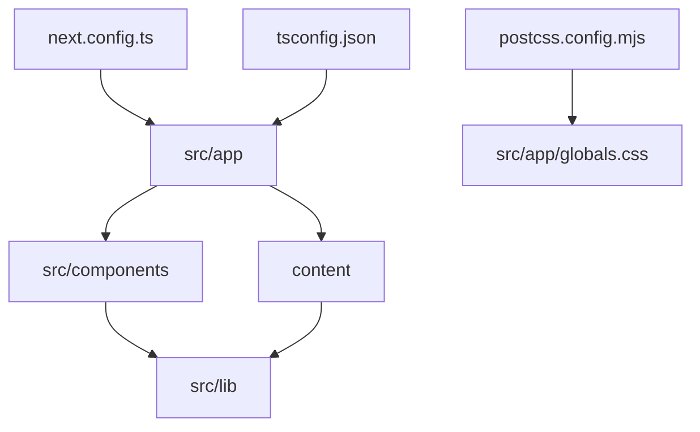
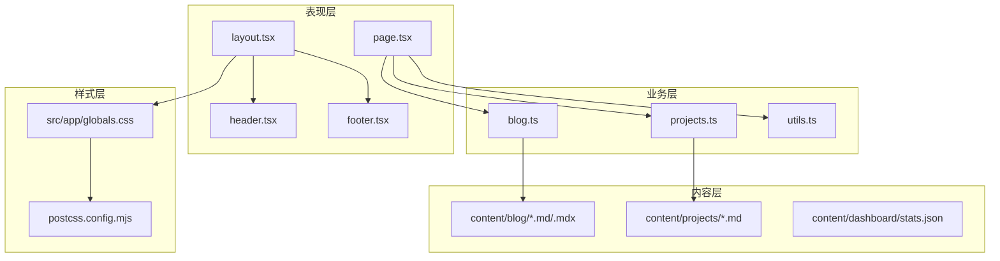
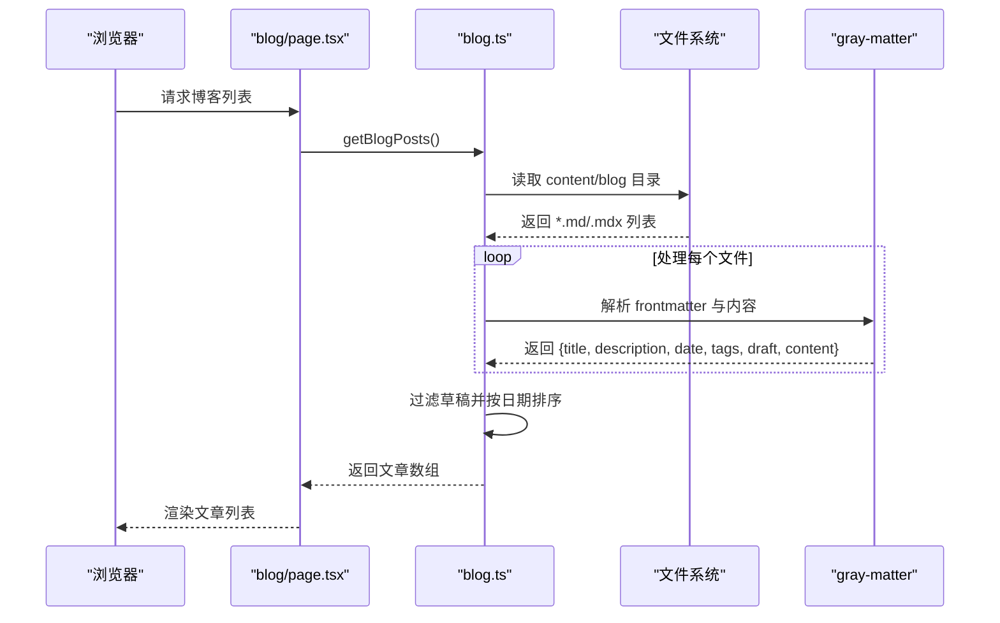
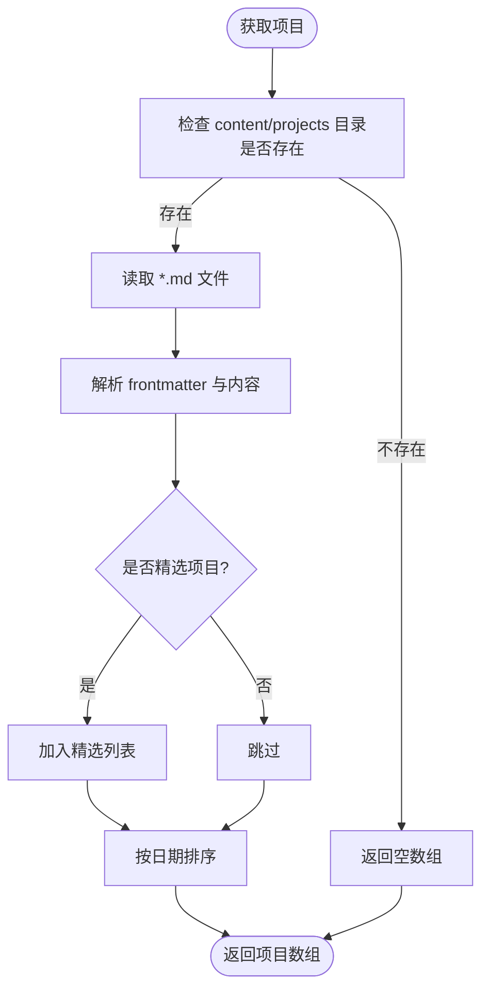
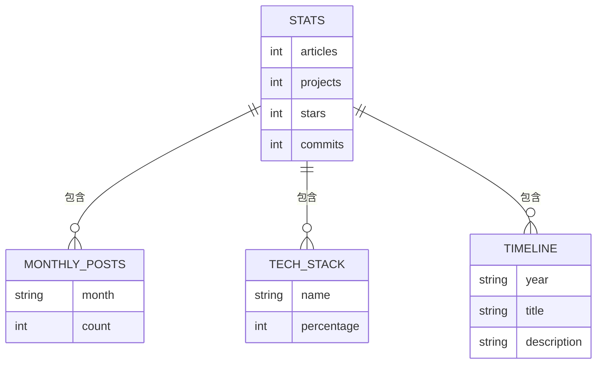
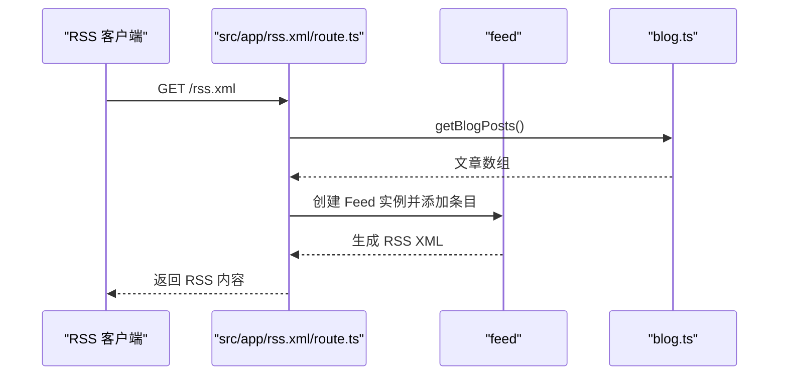
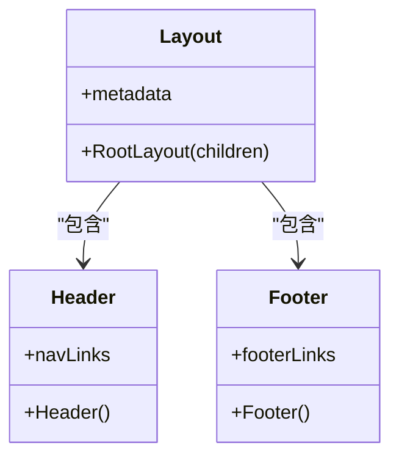
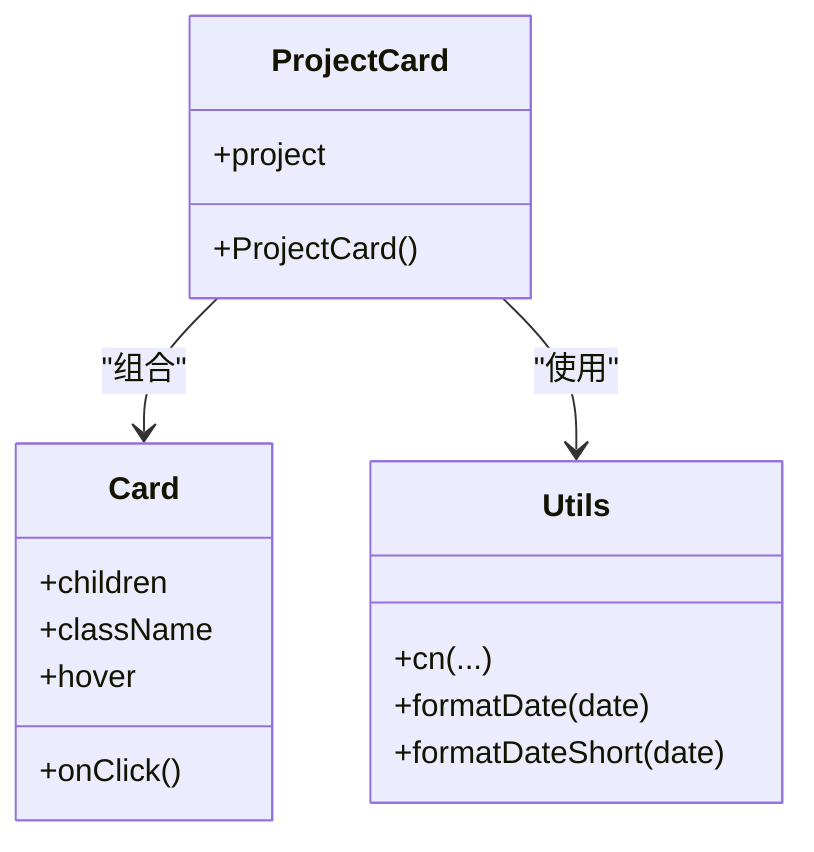
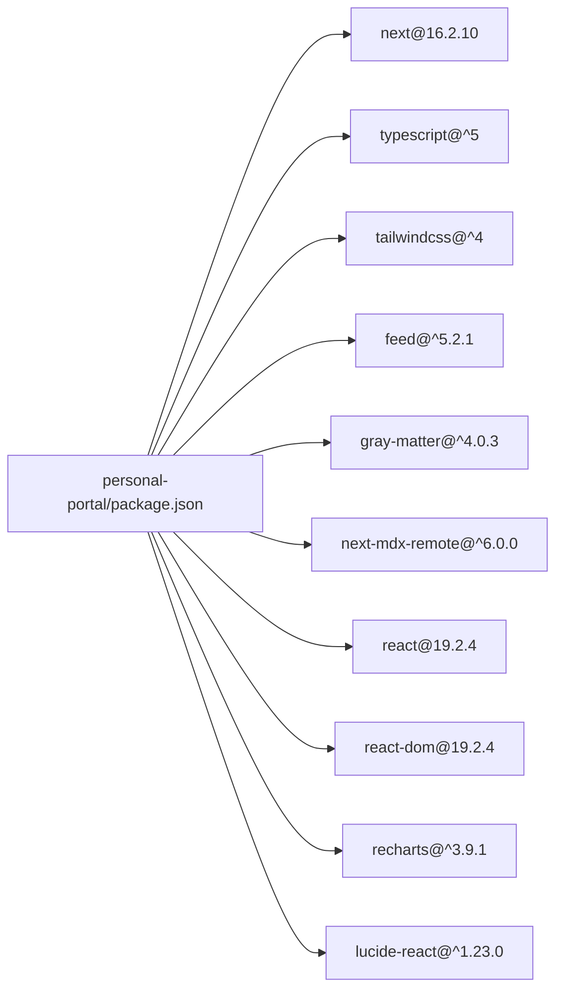

# Personal Portal 个人技术门户

<cite>
**本文档引用的文件**
- [package.json](file://personal-portal/package.json)
- [next.config.ts](file://personal-portal/next.config.ts)
- [tsconfig.json](file://personal-portal/tsconfig.json)
- [postcss.config.mjs](file://personal-portal/postcss.config.mjs)
- [layout.tsx](file://personal-portal/src/app/layout.tsx)
- [page.tsx](file://personal-portal/src/app/page.tsx)
- [blog.ts](file://personal-portal/src/lib/blog.ts)
- [projects.ts](file://personal-portal/src/lib/projects.ts)
- [header.tsx](file://personal-portal/src/components/layout/header.tsx)
- [footer.tsx](file://personal-portal/src/components/layout/footer.tsx)
- [route.ts](file://personal-portal/src/app/rss.xml/route.ts)
- [utils.ts](file://personal-portal/src/lib/utils.ts)
- [card.tsx](file://personal-portal/src/components/ui/card.tsx)
- [project-card.tsx](file://personal-portal/src/components/project-card.tsx)
- [stats.json](file://personal-portal/content/dashboard/stats.json)
</cite>

## 目录
1. [简介](#简介)
2. [项目结构](#项目结构)
3. [核心组件](#核心组件)
4. [架构总览](#架构总览)
5. [详细组件分析](#详细组件分析)
6. [依赖关系分析](#依赖关系分析)
7. [性能考虑](#性能考虑)
8. [故障排除指南](#故障排除指南)
9. [结论](#结论)
10. [附录](#附录)

## 简介
Personal Portal 是一个基于 Next.js 16.2.10 的个人技术门户，采用 TypeScript 和 Tailwind CSS 构建。该应用提供博客系统、项目展示、数据看板和 RSS 订阅等核心功能，支持内容管理、SEO 优化与性能配置，并提供清晰的部署指南与扩展方法。

## 项目结构
项目采用 Next.js App Router 结构，核心目录组织如下：
- 配置层：next.config.ts、tsconfig.json、postcss.config.mjs
- 应用层：src/app（页面路由、元数据、robots/sitemap）
- 组件层：src/components（布局、UI 组件、卡片）
- 内容层：content（博客、项目、看板数据）
- 工具层：src/lib（数据读取、工具函数）

图表来源
- [next.config.ts:1-8](file://personal-portal/next.config.ts#L1-L8)
- [tsconfig.json:1-35](file://personal-portal/tsconfig.json#L1-L35)
- [postcss.config.mjs:1-8](file://personal-portal/postcss.config.mjs#L1-L8)
- [layout.tsx:1-57](file://personal-portal/src/app/layout.tsx#L1-L57)

章节来源
- [package.json:1-32](file://personal-portal/package.json#L1-L32)
- [next.config.ts:1-8](file://personal-portal/next.config.ts#L1-L8)
- [tsconfig.json:1-35](file://personal-portal/tsconfig.json#L1-L35)
- [postcss.config.mjs:1-8](file://personal-portal/postcss.config.mjs#L1-L8)

## 核心组件
- 页面与布局：根布局、首页、博客列表页、项目列表页、仪表盘页、关于页
- 数据访问：博客与项目的数据读取、标签与相邻文章查询
- UI 组件：通用卡片、项目卡片、徽章、按钮、容器、页眉与页脚
- RSS 订阅：动态生成 RSS 2.0 输出
- 工具函数：类名合并、日期格式化

章节来源
- [layout.tsx:1-57](file://personal-portal/src/app/layout.tsx#L1-L57)
- [page.tsx:1-148](file://personal-portal/src/app/page.tsx#L1-L148)
- [blog.ts:1-73](file://personal-portal/src/lib/blog.ts#L1-L73)
- [projects.ts:1-62](file://personal-portal/src/lib/projects.ts#L1-L62)
- [header.tsx:1-106](file://personal-portal/src/components/layout/header.tsx#L1-L106)
- [footer.tsx:1-76](file://personal-portal/src/components/layout/footer.tsx#L1-L76)
- [route.ts:1-40](file://personal-portal/src/app/rss.xml/route.ts#L1-L40)
- [utils.ts:1-21](file://personal-portal/src/lib/utils.ts#L1-L21)

## 架构总览
应用采用分层架构：
- 表现层：Next.js App Router 页面与客户端组件
- 业务层：lib 层的数据读取与处理
- 内容层：Markdown/MDX 文件与 JSON 数据
- 样式层：Tailwind CSS 与自定义字体变量

图表来源
- [layout.tsx:1-57](file://personal-portal/src/app/layout.tsx#L1-L57)
- [header.tsx:1-106](file://personal-portal/src/components/layout/header.tsx#L1-L106)
- [footer.tsx:1-76](file://personal-portal/src/components/layout/footer.tsx#L1-L76)
- [page.tsx:1-148](file://personal-portal/src/app/page.tsx#L1-L148)
- [blog.ts:1-73](file://personal-portal/src/lib/blog.ts#L1-L73)
- [projects.ts:1-62](file://personal-portal/src/lib/projects.ts#L1-L62)
- [utils.ts:1-21](file://personal-portal/src/lib/utils.ts#L1-L21)
- [postcss.config.mjs:1-8](file://personal-portal/postcss.config.mjs#L1-L8)

## 详细组件分析

### 博客系统
博客系统通过 gray-matter 解析 Markdown/MDX 文件，提供文章列表、详情、标签与相邻文章导航能力。

图表来源
- [blog.ts:17-44](file://personal-portal/src/lib/blog.ts#L17-L44)
- [page.tsx:8-10](file://personal-portal/src/app/page.tsx#L8-L10)

章节来源
- [blog.ts:1-73](file://personal-portal/src/lib/blog.ts#L1-L73)
- [page.tsx:1-148](file://personal-portal/src/app/page.tsx#L1-L148)

### 项目展示
项目展示从 content/projects 中读取 Markdown 文件，支持精选项目筛选与技术标签展示。

图表来源
- [projects.ts:20-48](file://personal-portal/src/lib/projects.ts#L20-L48)

章节来源
- [projects.ts:1-62](file://personal-portal/src/lib/projects.ts#L1-L62)
- [project-card.tsx:1-41](file://personal-portal/src/components/project-card.tsx#L1-L41)

### 数据看板
看板数据来源于 content/dashboard/stats.json，包含统计指标、月度文章数、技术栈与时间线。

图表来源
- [stats.json:1-52](file://personal-portal/content/dashboard/stats.json#L1-L52)

章节来源
- [stats.json:1-52](file://personal-portal/content/dashboard/stats.json#L1-L52)

### RSS 订阅
RSS 订阅通过 feed 库动态生成 RSS 2.0 输出，包含站点信息与文章条目。

图表来源
- [route.ts:1-40](file://personal-portal/src/app/rss.xml/route.ts#L1-L40)
- [blog.ts:17-44](file://personal-portal/src/lib/blog.ts#L17-L44)

章节来源
- [route.ts:1-40](file://personal-portal/src/app/rss.xml/route.ts#L1-L40)

### 布局与导航
根布局设置站点元数据、字体与全局样式；页眉包含导航链接与移动端菜单；页脚提供内容分类与社交链接。

图表来源
- [layout.tsx:19-37](file://personal-portal/src/app/layout.tsx#L19-L37)
- [header.tsx:7-13](file://personal-portal/src/components/layout/header.tsx#L7-L13)
- [footer.tsx:3-27](file://personal-portal/src/components/layout/footer.tsx#L3-L27)

章节来源
- [layout.tsx:1-57](file://personal-portal/src/app/layout.tsx#L1-L57)
- [header.tsx:1-106](file://personal-portal/src/components/layout/header.tsx#L1-L106)
- [footer.tsx:1-76](file://personal-portal/src/components/layout/footer.tsx#L1-L76)

### UI 组件
- 通用卡片：支持悬停效果与点击回调
- 项目卡片：展示标题、描述、日期、标签与精选徽章
- 工具函数：类名合并与日期格式化

图表来源
- [card.tsx:10-28](file://personal-portal/src/components/ui/card.tsx#L10-L28)
- [project-card.tsx:6-40](file://personal-portal/src/components/project-card.tsx#L6-L40)
- [utils.ts:1-21](file://personal-portal/src/lib/utils.ts#L1-L21)

章节来源
- [card.tsx:1-29](file://personal-portal/src/components/ui/card.tsx#L1-L29)
- [project-card.tsx:1-41](file://personal-portal/src/components/project-card.tsx#L1-L41)
- [utils.ts:1-21](file://personal-portal/src/lib/utils.ts#L1-L21)

## 依赖关系分析
应用依赖 Next.js 16.2.10、TypeScript、Tailwind CSS 4、feed、gray-matter、next-mdx-remote、lucide-react、recharts 等库。

图表来源
- [package.json:11-30](file://personal-portal/package.json#L11-L30)

章节来源
- [package.json:1-32](file://personal-portal/package.json#L1-L32)

## 性能考虑
- 构建与运行：使用 Next.js 的生产构建与启动脚本，确保静态优化与服务端渲染优势
- 样式：Tailwind CSS 4 与 PostCSS 集成，支持按需生成样式
- 内容：Markdown/MDX 文件解析在构建时进行，减少运行时开销
- 图标：Lucide React 提供轻量 SVG 图标
- 可视化：Recharts 用于高效渲染数据图表

## 故障排除指南
- RSS 订阅为空：确认 content/blog 下存在 .md/.mdx 文件且非草稿状态
- 博客/项目列表显示异常：检查 content 目录权限与文件命名规范
- 字体加载问题：确认 Google Fonts 变量已在根布局中引入
- SEO 元数据缺失：检查 layout.tsx 中 metadata 配置与环境变量 NEXT_PUBLIC_SITE_URL

章节来源
- [route.ts:4-7](file://personal-portal/src/app/rss.xml/route.ts#L4-L7)
- [blog.ts:17-44](file://personal-portal/src/lib/blog.ts#L17-L44)
- [layout.tsx:19-37](file://personal-portal/src/app/layout.tsx#L19-L37)

## 结论
Personal Portal 提供了一个结构清晰、易于扩展的个人技术门户解决方案。通过 Next.js App Router、TypeScript 类型安全与 Tailwind CSS 样式系统，结合内容驱动的数据模型与 RSS 订阅，满足现代开发者对个人品牌展示与知识分享的需求。

## 附录

### 内容管理最佳实践
- 博客与项目均采用 Markdown/MDX 格式，frontmatter 支持标题、描述、日期、标签、草稿等字段
- 看板数据使用 JSON，便于直接消费与可视化
- 建议统一使用 YYYY-MM-DD 日期格式，确保排序一致性

章节来源
- [blog.ts:24-38](file://personal-portal/src/lib/blog.ts#L24-L38)
- [projects.ts:27-44](file://personal-portal/src/lib/projects.ts#L27-L44)
- [stats.json:1-52](file://personal-portal/content/dashboard/stats.json#L1-L52)

### SEO 优化要点
- 根布局提供完整的 metadataBase、openGraph 与 robots 配置
- 动态设置站点 URL，确保 RSS 与链接正确
- 页面级标题与描述可按需在各页面覆盖

章节来源
- [layout.tsx:19-37](file://personal-portal/src/app/layout.tsx#L19-L37)
- [route.ts:5-6](file://personal-portal/src/app/rss.xml/route.ts#L5-L6)

### 性能配置建议
- 启用 Next.js 缓存与静态导出（如适用）
- 对图片与图标使用响应式尺寸与懒加载
- 在生产环境设置合适的缓存头与压缩策略

### 部署指南
- 本地开发：执行开发服务器命令
- 生产构建：生成静态产物并启动服务
- 代码质量：使用 ESLint 规范与类型检查

章节来源
- [package.json:5-9](file://personal-portal/package.json#L5-L9)

### 扩展方法
- 添加新的内容类型：在 content 下新增目录，编写对应的读取函数并在页面中调用
- 修改样式：通过 Tailwind 类名与全局 CSS 调整主题变量与组件外观
- 集成第三方服务：在 lib 层增加数据源封装，保持页面与组件解耦

章节来源
- [blog.ts:1-73](file://personal-portal/src/lib/blog.ts#L1-L73)
- [projects.ts:1-62](file://personal-portal/src/lib/projects.ts#L1-L62)
- [layout.tsx:17](file://personal-portal/src/app/layout.tsx#L17)