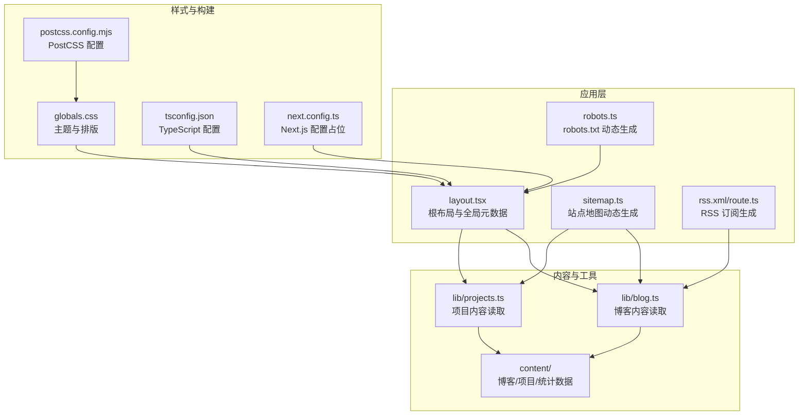
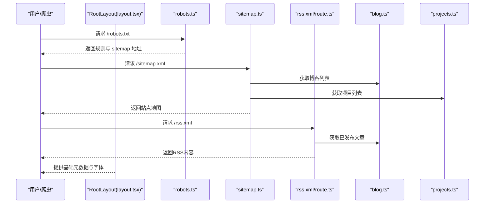
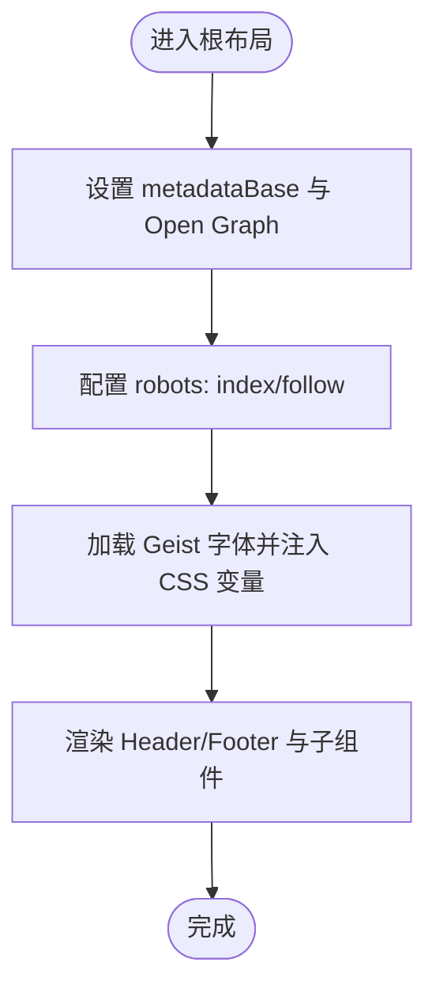
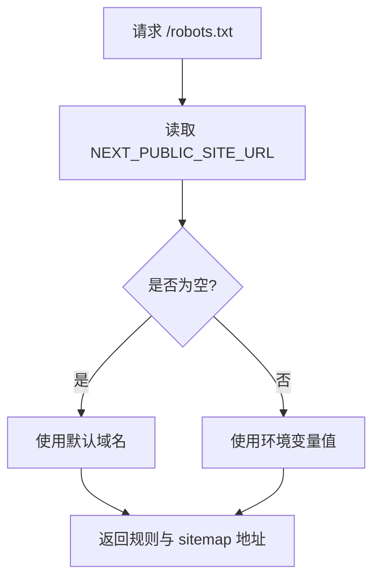
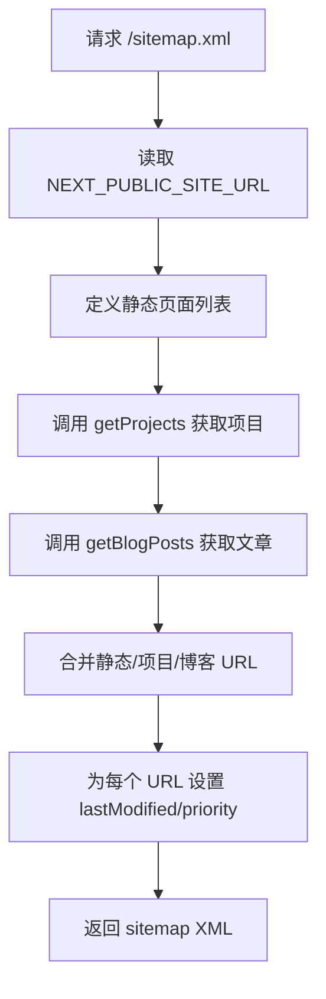
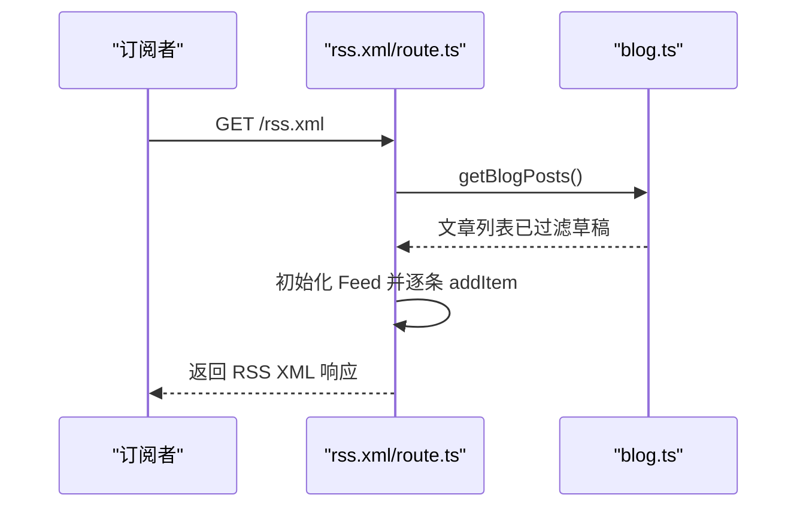
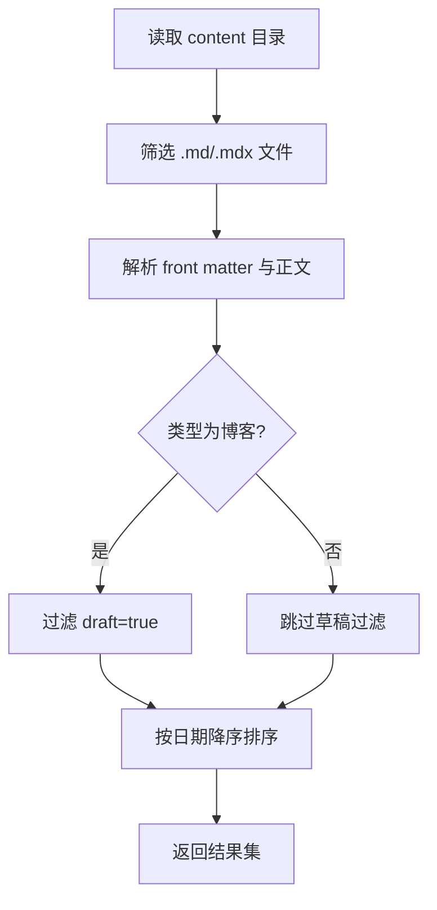
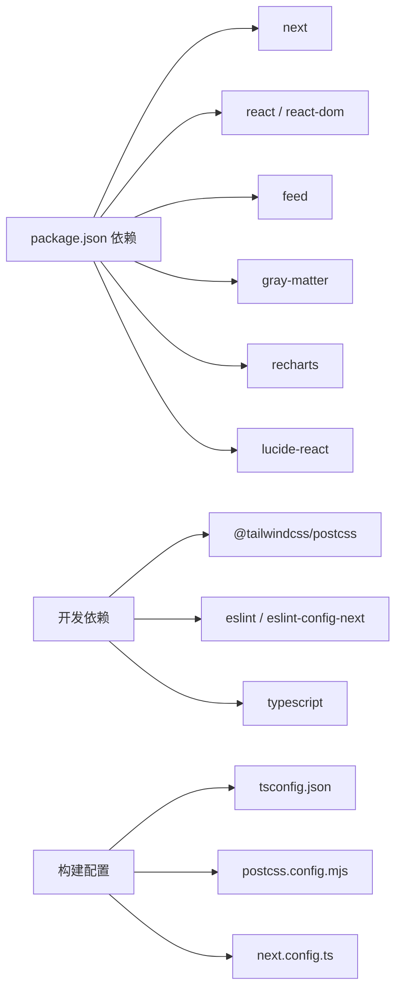

# SEO优化与性能

<cite>
**本文引用的文件**
- [layout.tsx](file://personal-portal/src/app/layout.tsx)
- [robots.ts](file://personal-portal/src/app/robots.ts)
- [sitemap.ts](file://personal-portal/src/app/sitemap.ts)
- [route.ts](file://personal-portal/src/app/rss.xml/route.ts)
- [blog.ts](file://personal-portal/src/lib/blog.ts)
- [projects.ts](file://personal-portal/src/lib/projects.ts)
- [header.tsx](file://personal-portal/src/components/layout/header.tsx)
- [page.tsx](file://personal-portal/src/app/page.tsx)
- [globals.css](file://personal-portal/src/app/globals.css)
- [next.config.ts](file://personal-portal/next.config.ts)
- [postcss.config.mjs](file://personal-portal/postcss.config.mjs)
- [tsconfig.json](file://personal-portal/tsconfig.json)
- [package.json](file://personal-portal/package.json)
- [stats.json](file://personal-portal/content/dashboard/stats.json)
</cite>

## 目录
1. [引言](#引言)
2. [项目结构](#项目结构)
3. [核心组件](#核心组件)
4. [架构总览](#架构总览)
5. [详细组件分析](#详细组件分析)
6. [依赖关系分析](#依赖关系分析)
7. [性能考量](#性能考量)
8. [故障排查指南](#故障排查指南)
9. [结论](#结论)
10. [附录](#附录)

## 引言
本文件面向SEO优化与性能配置，系统梳理该Next.js应用在搜索引擎可见性（robots.txt、sitemap.xml、RSS订阅）与前端性能（代码分割、图片优化、字体加载、缓存策略）方面的实现与最佳实践。同时给出PWA配置、HTTPS设置、CDN集成思路，以及Lighthouse测试、Google Analytics集成与社交分享优化建议，并总结性能监控、用户行为分析与搜索引擎排名提升的方法。

## 项目结构
该仓库包含多个子项目，其中 personal-portal 是基于Next.js的应用，负责个人门户页面、博客与项目展示。与SEO和性能密切相关的目录与文件如下：
- 应用层：src/app 下的布局、元数据与动态路由（robots、sitemap、RSS）
- 内容层：content 下的博客、项目与仪表盘统计数据
- 工具层：src/lib 下的博客与项目读取工具
- 样式与构建：src/app/globals.css、postcss.config.mjs、tsconfig.json、next.config.ts
- 依赖与脚本：package.json

图表来源
- [layout.tsx:1-57](file://personal-portal/src/app/layout.tsx#L1-L57)
- [robots.ts:1-14](file://personal-portal/src/app/robots.ts#L1-L14)
- [sitemap.ts:1-23](file://personal-portal/src/app/sitemap.ts#L1-L23)
- [route.ts:1-40](file://personal-portal/src/app/rss.xml/route.ts#L1-L40)
- [blog.ts:1-73](file://personal-portal/src/lib/blog.ts#L1-L73)
- [projects.ts:1-62](file://personal-portal/src/lib/projects.ts#L1-L62)
- [globals.css:1-235](file://personal-portal/src/app/globals.css#L1-L235)
- [postcss.config.mjs:1-8](file://personal-portal/postcss.config.mjs#L1-L8)
- [tsconfig.json:1-35](file://personal-portal/tsconfig.json#L1-L35)
- [next.config.ts:1-8](file://personal-portal/next.config.ts#L1-L8)

章节来源
- [layout.tsx:1-57](file://personal-portal/src/app/layout.tsx#L1-L57)
- [robots.ts:1-14](file://personal-portal/src/app/robots.ts#L1-L14)
- [sitemap.ts:1-23](file://personal-portal/src/app/sitemap.ts#L1-L23)
- [route.ts:1-40](file://personal-portal/src/app/rss.xml/route.ts#L1-L40)
- [blog.ts:1-73](file://personal-portal/src/lib/blog.ts#L1-L73)
- [projects.ts:1-62](file://personal-portal/src/lib/projects.ts#L1-L62)
- [globals.css:1-235](file://personal-portal/src/app/globals.css#L1-L235)
- [postcss.config.mjs:1-8](file://personal-portal/postcss.config.mjs#L1-L8)
- [tsconfig.json:1-35](file://personal-portal/tsconfig.json#L1-L35)
- [next.config.ts:1-8](file://personal-portal/next.config.ts#L1-L8)

## 核心组件
- 根布局与全局元数据：定义站点基础元信息、语言、字体与Open Graph等，确保统一的SEO基线。
- robots.txt 动态生成：根据环境变量返回允许爬取与sitemap地址，便于搜索引擎抓取。
- 站点地图动态生成：聚合静态页、项目页与博客页，按优先级与更新频率生成sitemap。
- RSS 订阅生成：使用feed库生成RSS，包含标题、描述、分类与链接，便于读者订阅。
- 内容读取工具：从content目录读取博客与项目元数据，过滤草稿并排序，支撑sitemap与RSS生成。
- 主题与排版：通过CSS变量与Tailwind配置，统一字体、颜色与排版体系，提升可读性与一致性。

章节来源
- [layout.tsx:19-37](file://personal-portal/src/app/layout.tsx#L19-L37)
- [robots.ts:3-12](file://personal-portal/src/app/robots.ts#L3-L12)
- [sitemap.ts:5-21](file://personal-portal/src/app/sitemap.ts#L5-L21)
- [route.ts:4-38](file://personal-portal/src/app/rss.xml/route.ts#L4-L38)
- [blog.ts:17-44](file://personal-portal/src/lib/blog.ts#L17-L44)
- [projects.ts:20-47](file://personal-portal/src/lib/projects.ts#L20-L47)
- [globals.css:28-96](file://personal-portal/src/app/globals.css#L28-L96)

## 架构总览
下图展示了SEO与性能相关的关键流程：根布局提供元数据与字体；robots/sitemap/RSS由动态路由生成；内容读取工具从本地内容目录解析；样式与构建配置保证一致的主题与构建行为。

图表来源
- [layout.tsx:19-37](file://personal-portal/src/app/layout.tsx#L19-L37)
- [robots.ts:3-12](file://personal-portal/src/app/robots.ts#L3-L12)
- [sitemap.ts:5-21](file://personal-portal/src/app/sitemap.ts#L5-L21)
- [route.ts:4-38](file://personal-portal/src/app/rss.xml/route.ts#L4-L38)
- [blog.ts:17-44](file://personal-portal/src/lib/blog.ts#L17-L44)
- [projects.ts:20-47](file://personal-portal/src/lib/projects.ts#L20-L47)

## 详细组件分析

### 组件A：根布局与全局元数据
- 职责：设置站点基础元信息（标题模板、描述、Open Graph）、robots策略、语言与字体加载。
- 关键点：
  - 使用Next Font加载Geist Sans/Mono，通过CSS变量注入，减少FOIT/FOFT风险。
  - metadataBase结合NEXT_PUBLIC_SITE_URL，确保绝对链接与OG正确渲染。
  - robots: { index: true, follow: true } 放宽爬取策略，配合sitemap引导抓取。

图表来源
- [layout.tsx:19-37](file://personal-portal/src/app/layout.tsx#L19-L37)
- [layout.tsx:7-15](file://personal-portal/src/app/layout.tsx#L7-L15)

章节来源
- [layout.tsx:19-37](file://personal-portal/src/app/layout.tsx#L19-L37)
- [layout.tsx:7-15](file://personal-portal/src/app/layout.tsx#L7-L15)

### 组件B：robots.txt 动态生成
- 职责：动态生成robots.txt，声明允许抓取与sitemap地址。
- 关键点：
  - 读取NEXT_PUBLIC_SITE_URL作为基准URL。
  - 指定sitemap地址，便于搜索引擎发现站点地图。

图表来源
- [robots.ts:4-12](file://personal-portal/src/app/robots.ts#L4-L12)

章节来源
- [robots.ts:3-12](file://personal-portal/src/app/robots.ts#L3-L12)

### 组件C：sitemap.xml 动态生成
- 职责：生成站点地图，包含静态页、项目页与博客页。
- 关键点：
  - 读取静态路径数组与动态内容（项目/博客）生成URL集合。
  - 为首页设置最高priority，其余页面设置固定priority。
  - lastModified设为当前时间，changeFrequency设为weekly。

图表来源
- [sitemap.ts:5-21](file://personal-portal/src/app/sitemap.ts#L5-L21)
- [blog.ts:17-44](file://personal-portal/src/lib/blog.ts#L17-L44)
- [projects.ts:20-47](file://personal-portal/src/lib/projects.ts#L20-L47)

章节来源
- [sitemap.ts:5-21](file://personal-portal/src/app/sitemap.ts#L5-L21)
- [blog.ts:17-44](file://personal-portal/src/lib/blog.ts#L17-L44)
- [projects.ts:20-47](file://personal-portal/src/lib/projects.ts#L20-L47)

### 组件D：RSS 订阅支持
- 职责：生成RSS订阅，包含文章标题、链接、描述、分类与更新时间。
- 关键点：
  - 使用feed库初始化Feed对象，设置语言、版权、更新时间与RSS链接。
  - 遍历博客文章，逐条添加到Feed中，最后以XML响应返回。

图表来源
- [route.ts:4-38](file://personal-portal/src/app/rss.xml/route.ts#L4-L38)
- [blog.ts:17-44](file://personal-portal/src/lib/blog.ts#L17-L44)

章节来源
- [route.ts:4-38](file://personal-portal/src/app/rss.xml/route.ts#L4-L38)
- [blog.ts:17-44](file://personal-portal/src/lib/blog.ts#L17-L44)

### 组件E：内容读取工具（博客与项目）
- 职责：从content目录读取Markdown/MDX文件，解析front matter，过滤草稿并排序。
- 关键点：
  - 博客：过滤draft字段为true的文章，按日期降序排列。
  - 项目：按日期降序排列，用于首页展示与sitemap生成。

图表来源
- [blog.ts:17-44](file://personal-portal/src/lib/blog.ts#L17-L44)
- [projects.ts:20-47](file://personal-portal/src/lib/projects.ts#L20-L47)

章节来源
- [blog.ts:17-44](file://personal-portal/src/lib/blog.ts#L17-L44)
- [projects.ts:20-47](file://personal-portal/src/lib/projects.ts#L20-L47)

### 组件F：主页与导航（SEO与可访问性）
- 职责：首页聚合精选项目与最新文章，导航支持移动端与无障碍。
- 关键点：
  - 导航使用Next/link，支持客户端导航与预加载。
  - 移动端菜单状态管理，提升移动端体验。
  - 首页展示精选项目与近期文章，利于搜索引擎理解内容结构。

章节来源
- [page.tsx:8-147](file://personal-portal/src/app/page.tsx#L8-L147)
- [header.tsx:15-105](file://personal-portal/src/components/layout/header.tsx#L15-L105)

### 组件G：主题与排版（可读性与性能）
- 职责：通过CSS变量与Tailwind配置，统一字体、颜色与排版，提升可读性与一致性。
- 关键点：
  - 字体变量注入，避免运行时字体闪烁。
  - Tailwind按需生成，减少初始CSS体积。
  - 主题色板与间距系统，便于扩展与维护。

章节来源
- [globals.css:28-96](file://personal-portal/src/app/globals.css#L28-L96)
- [postcss.config.mjs:1-8](file://personal-portal/postcss.config.mjs#L1-L8)

## 依赖关系分析
- 运行时依赖：Next.js、react、react-dom、feed、gray-matter、lucide-react、recharts、next-mdx-remote。
- 开发依赖：Tailwind PostCSS插件、ESLint、TypeScript。
- 构建与类型：tsconfig.json启用严格模式与bundler解析；postcss.config.mjs集成Tailwind；next.config.ts留作扩展。

图表来源
- [package.json:11-29](file://personal-portal/package.json#L11-L29)
- [tsconfig.json:1-35](file://personal-portal/tsconfig.json#L1-L35)
- [postcss.config.mjs:1-8](file://personal-portal/postcss.config.mjs#L1-L8)
- [next.config.ts:1-8](file://personal-portal/next.config.ts#L1-L8)

章节来源
- [package.json:11-29](file://personal-portal/package.json#L11-L29)
- [tsconfig.json:1-35](file://personal-portal/tsconfig.json#L1-L35)
- [postcss.config.mjs:1-8](file://personal-portal/postcss.config.mjs#L1-L8)
- [next.config.ts:1-8](file://personal-portal/next.config.ts#L1-L8)

## 性能考量
- 代码分割与懒加载
  - 利用Next.js自动代码分割，按路由拆分chunk；对非关键页面采用动态导入，降低首屏负载。
  - 将大组件（如图表）按需加载，减少初始包体积。
- 图片优化
  - 使用next/image组件，自动选择最优格式（WebP/JPEG），并按设备像素比生成多尺寸资源。
  - 对于背景图或非关键图片，使用占位符与懒加载属性，避免阻塞主渲染。
- 字体加载
  - 已通过Next Font加载Geist系列字体，建议开启字体子集化与字体显示策略（如font-display），减少CLS风险。
- 缓存策略
  - 静态资源与构建产物由CDN缓存；动态路由（robots/sitemap/RSS）可设置短期缓存以平衡新鲜度与性能。
- 样式与构建
  - Tailwind按需生成，避免全量样式；CSS变量集中管理，减少重复计算。
  - TypeScript严格模式与bundler解析，提升构建稳定性与类型安全。
- 首屏性能
  - 首页聚合精选内容，减少DOM复杂度；导航使用客户端路由，避免整页刷新。
- 数据与内容
  - 博客与项目内容读取在服务端进行，避免客户端解析成本；sitemap与RSS生成在请求时动态构建，保持内容实时性。

章节来源
- [layout.tsx:7-15](file://personal-portal/src/app/layout.tsx#L7-L15)
- [page.tsx:8-147](file://personal-portal/src/app/page.tsx#L8-L147)
- [globals.css:28-96](file://personal-portal/src/app/globals.css#L28-L96)
- [tsconfig.json:10-23](file://personal-portal/tsconfig.json#L10-L23)
- [postcss.config.mjs:1-8](file://personal-portal/postcss.config.mjs#L1-L8)

## 故障排查指南
- robots.txt无法被搜索引擎识别
  - 检查NEXT_PUBLIC_SITE_URL是否正确设置，确保sitemap地址指向有效URL。
  - 在robots.ts中确认返回规则与sitemap地址。
- sitemap.xml抓取失败或为空
  - 确认content目录存在且包含博客/项目文件；检查getBlogPosts与getProjects是否正常读取。
  - 核对sitemap.ts中URL拼接与lastModified/priority设置。
- RSS订阅内容不完整
  - 检查博客front matter中draft字段是否导致文章被过滤；确认getBlogPosts返回的日期与标签格式。
- 字体闪烁或加载缓慢
  - 确认Next Font已正确注入CSS变量；考虑调整字体显示策略与子集化配置。
- 构建或类型错误
  - 检查tsconfig.json的moduleResolution与bundler选项；确保路径别名@/*配置正确。

章节来源
- [robots.ts:3-12](file://personal-portal/src/app/robots.ts#L3-L12)
- [sitemap.ts:5-21](file://personal-portal/src/app/sitemap.ts#L5-L21)
- [route.ts:4-38](file://personal-portal/src/app/rss.xml/route.ts#L4-L38)
- [blog.ts:17-44](file://personal-portal/src/lib/blog.ts#L17-L44)
- [projects.ts:20-47](file://personal-portal/src/lib/projects.ts#L20-L47)
- [layout.tsx:7-15](file://personal-portal/src/app/layout.tsx#L7-L15)
- [tsconfig.json:10-23](file://personal-portal/tsconfig.json#L10-L23)

## 结论
该Next.js应用通过动态robots.txt、sitemap.xml与RSS订阅，完善了搜索引擎可见性；借助Next Font、Tailwind与严格构建配置，兼顾了可读性与性能。建议在此基础上进一步引入CDN缓存、HTTPS强制、PWA配置与Lighthouse自动化测试，持续优化用户体验与搜索排名。

## 附录

### SEO与性能配置清单
- 站点元数据
  - 在根布局中设置metadataBase、Open Graph与robots策略。
- robots.txt
  - 动态生成，返回允许抓取与sitemap地址。
- 站点地图
  - 聚合静态页、项目页与博客页，设置优先级与更新频率。
- RSS订阅
  - 使用feed库生成RSS，包含标题、描述、分类与链接。
- 性能优化
  - 代码分割、图片优化、字体加载、缓存策略与Tailwind按需生成。
- PWA与HTTPS
  - 在部署层启用HTTPS与Service Worker（如需）；CDN缓存静态资源。
- Lighthouse测试
  - 定期运行Lighthouse，关注性能、可访问性、SEO与最佳实践指标。
- Google Analytics与社交分享
  - 在根布局或公共组件中集成分析脚本；为每篇文章与项目页设置Open Graph与Twitter Card元数据。
- 用户行为与排名提升
  - 通过分析工具洞察用户路径与跳出率；优化内容结构与内部链接；定期更新高质量内容。

### Lighthouse性能测试指南
- 测试步骤
  - 使用Chrome DevTools或Lighthouse CLI运行测试。
  - 关注First Contentful Paint、Largest Contentful Paint、Cumulative Layout Shift、Interactive等指标。
- 优化建议
  - 减少主线程阻塞；优化图片与字体加载；提升交互响应速度；改善可访问性与SEO。

### Google Analytics集成
- 在根布局中插入分析脚本；确保在客户端组件中按需加载，避免影响首屏性能。
- 为关键页面（博客详情、项目详情）设置自定义事件与转化目标。

### 社交媒体分享优化
- 为每篇文章与项目页设置Open Graph与Twitter Card元数据，包含标题、描述、图片与URL。
- 在页面中提供分享按钮，使用标准分享协议或第三方SDK。