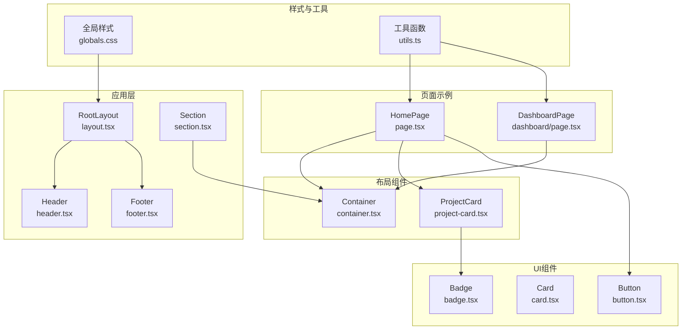
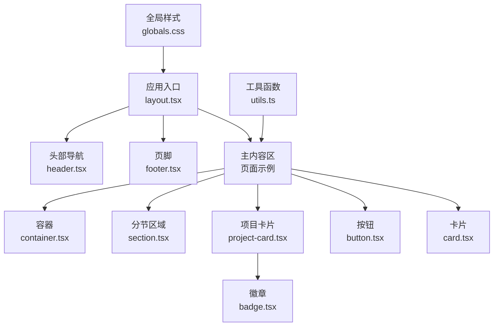
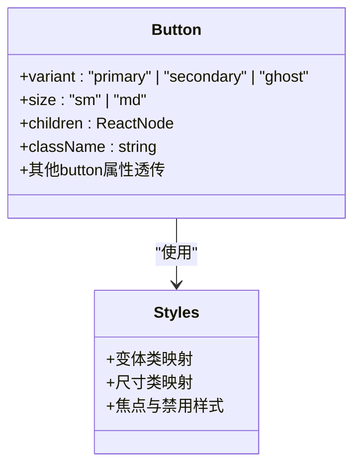
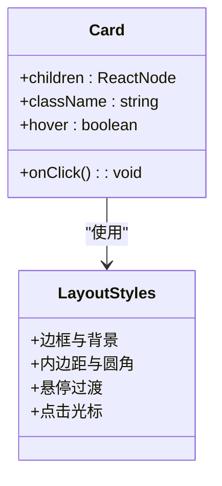
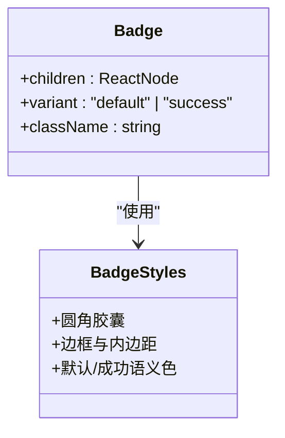
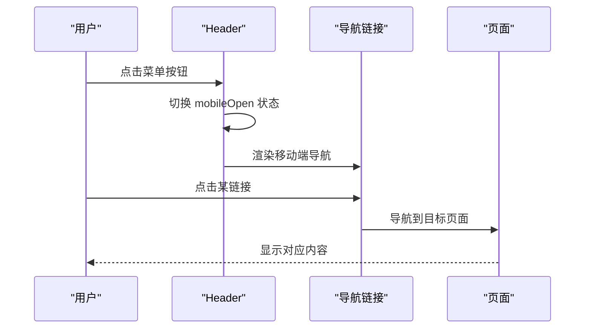
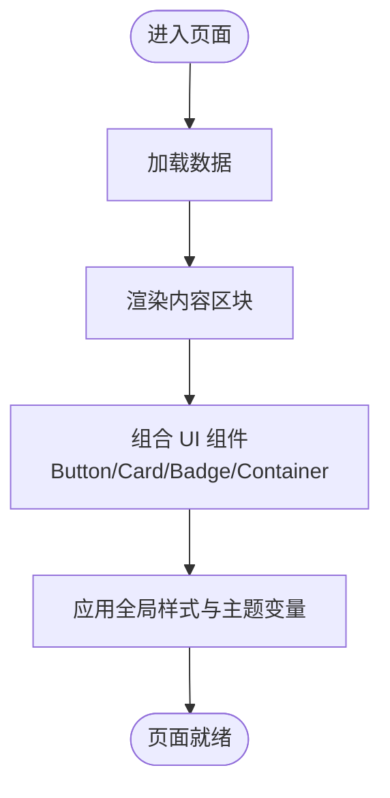
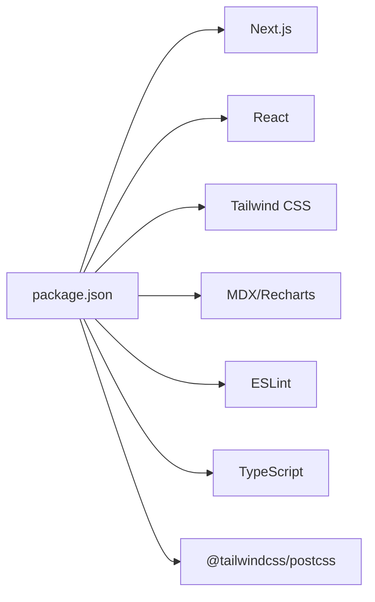

# UI组件系统

<cite>
**本文档引用的文件**
- [button.tsx](file://personal-portal/src/components/ui/button.tsx)
- [card.tsx](file://personal-portal/src/components/ui/card.tsx)
- [badge.tsx](file://personal-portal/src/components/ui/badge.tsx)
- [header.tsx](file://personal-portal/src/components/layout/header.tsx)
- [footer.tsx](file://personal-portal/src/components/layout/footer.tsx)
- [container.tsx](file://personal-portal/src/components/layout/container.tsx)
- [section.tsx](file://personal-portal/src/components/layout/section.tsx)
- [project-card.tsx](file://personal-portal/src/components/project-card.tsx)
- [layout.tsx](file://personal-portal/src/app/layout.tsx)
- [page.tsx](file://personal-portal/src/app/page.tsx)
- [dashboard/page.tsx](file://personal-portal/src/app/dashboard/page.tsx)
- [globals.css](file://personal-portal/src/app/globals.css)
- [utils.ts](file://personal-portal/src/lib/utils.ts)
- [package.json](file://personal-portal/package.json)
</cite>

## 目录
1. [简介](#简介)
2. [项目结构](#项目结构)
3. [核心组件](#核心组件)
4. [架构总览](#架构总览)
5. [详细组件分析](#详细组件分析)
6. [依赖关系分析](#依赖关系分析)
7. [性能考虑](#性能考虑)
8. [故障排查指南](#故障排查指南)
9. [结论](#结论)
10. [附录](#附录)

## 简介
本项目采用基于 Tailwind CSS 的原子化样式设计，构建了统一的 UI 组件体系，覆盖基础按钮、卡片、徽章等通用组件，以及头部导航、页脚、容器与分节等布局组件。通过设计令牌（Design Tokens）驱动的主题变量与语义化颜色体系，实现了可访问性、主题定制与响应式设计的一体化落地。本文档从架构、组件实现、数据流、可访问性、主题与响应式、扩展与最佳实践等维度，系统阐述该 UI 组件系统的实现与使用方法。

## 项目结构
UI 组件主要位于 personal-portal 工程中，按功能域组织如下：
- 应用根布局与全局样式：应用级布局、元数据与全局样式定义
- UI 组件：基础按钮、卡片、徽章等
- 布局组件：头部导航、页脚、容器、分节区域
- 页面示例：首页、看板页等展示组件组合与使用方式
- 工具函数：类名合并、日期格式化等通用工具

图表来源
- [layout.tsx:39-56](file://personal-portal/src/app/layout.tsx#L39-L56)
- [header.tsx:15-105](file://personal-portal/src/components/layout/header.tsx#L15-L105)
- [footer.tsx:29-75](file://personal-portal/src/components/layout/footer.tsx#L29-L75)
- [section.tsx:4-41](file://personal-portal/src/components/layout/section.tsx#L4-L41)
- [button.tsx:19-40](file://personal-portal/src/components/ui/button.tsx#L19-L40)
- [card.tsx:3-28](file://personal-portal/src/components/ui/card.tsx#L3-L28)
- [badge.tsx:3-26](file://personal-portal/src/components/ui/badge.tsx#L3-L26)
- [container.tsx:3-13](file://personal-portal/src/components/layout/container.tsx#L3-L13)
- [project-card.tsx:6-40](file://personal-portal/src/components/project-card.tsx#L6-L40)
- [page.tsx:8-147](file://personal-portal/src/app/page.tsx#L8-L147)
- [dashboard/page.tsx:21-109](file://personal-portal/src/app/dashboard/page.tsx#L21-L109)
- [globals.css:1-235](file://personal-portal/src/app/globals.css#L1-L235)
- [utils.ts:1-21](file://personal-portal/src/lib/utils.ts#L1-L21)

章节来源
- [layout.tsx:1-57](file://personal-portal/src/app/layout.tsx#L1-L57)
- [globals.css:1-235](file://personal-portal/src/app/globals.css#L1-L235)

## 核心组件
本节聚焦基础 UI 组件的属性接口、状态管理与事件处理机制，并结合样式与可访问性特性进行说明。

- 按钮 Button
  - 属性接口：变体（primary/secondary/ghost）、尺寸（sm/md）、原生 button 属性透传、子节点、类名扩展
  - 状态与事件：通过原生 button 属性支持禁用、焦点可见环；点击事件由透传 props 处理
  - 样式策略：原子化类名组合，基于设计令牌的颜色与过渡变量
  - 可访问性：焦点可见环、禁用态指针与不透明度控制
  - 复杂度：O(1) 渲染与类名拼接，无额外状态

- 卡片 Card
  - 属性接口：子节点、类名扩展、悬停开关、点击回调
  - 状态与事件：点击事件由外部传入；悬停效果通过条件类名切换
  - 样式策略：边框、背景、内边距与圆角；悬停过渡
  - 可访问性：点击时提供指针光标提示
  - 复杂度：O(1)，无内部状态

- 徽章 Badge
  - 属性接口：子节点、变体（default/success）、类名扩展
  - 状态与事件：无内部状态，仅渲染
  - 样式策略：圆角、边框、内边距与字号；成功变体强调色
  - 可访问性：纯展示元素，无需交互
  - 复杂度：O(1)

章节来源
- [button.tsx:19-40](file://personal-portal/src/components/ui/button.tsx#L19-L40)
- [card.tsx:3-28](file://personal-portal/src/components/ui/card.tsx#L3-L28)
- [badge.tsx:3-26](file://personal-portal/src/components/ui/badge.tsx#L3-L26)

## 架构总览
整体架构以“布局组件 + UI 组件 + 页面示例 + 全局样式”协同工作：
- 布局组件负责站点骨架与导航，提供容器与分节能力
- UI 组件提供可复用的视觉与交互基元
- 页面示例演示组件组合与数据绑定
- 全局样式通过设计令牌统一颜色、字体、间距与动效

图表来源
- [layout.tsx:39-56](file://personal-portal/src/app/layout.tsx#L39-L56)
- [header.tsx:15-105](file://personal-portal/src/components/layout/header.tsx#L15-L105)
- [footer.tsx:29-75](file://personal-portal/src/components/layout/footer.tsx#L29-L75)
- [container.tsx:3-13](file://personal-portal/src/components/layout/container.tsx#L3-L13)
- [section.tsx:4-41](file://personal-portal/src/components/layout/section.tsx#L4-L41)
- [project-card.tsx:6-40](file://personal-portal/src/components/project-card.tsx#L6-L40)
- [badge.tsx:3-26](file://personal-portal/src/components/ui/badge.tsx#L3-L26)
- [button.tsx:19-40](file://personal-portal/src/components/ui/button.tsx#L19-L40)
- [card.tsx:3-28](file://personal-portal/src/components/ui/card.tsx#L3-L28)
- [page.tsx:8-147](file://personal-portal/src/app/page.tsx#L8-L147)
- [dashboard/page.tsx:21-109](file://personal-portal/src/app/dashboard/page.tsx#L21-L109)
- [globals.css:1-235](file://personal-portal/src/app/globals.css#L1-L235)
- [utils.ts:1-21](file://personal-portal/src/lib/utils.ts#L1-L21)

## 详细组件分析

### 按钮组件 Button
- 设计要点
  - 变体映射：primary/secondary/ghost 对应不同前景/背景/边框与悬停/焦点态
  - 尺寸映射：sm/md 控制内边距与字号
  - 原子化类名：对齐 Tailwind 原子化风格，便于主题与响应式扩展
- 接口与行为
  - 支持原生 button 属性透传，保证可访问性与事件处理一致性
  - 类名合并：支持外部 className 扩展，避免覆盖默认样式
- 可访问性
  - 焦点可见环：通过可见焦点环增强键盘可达性
  - 禁用态：禁用指针与不透明度控制，避免误操作
- 性能
  - 渲染路径简单，类名计算在组件外完成，避免重复计算

图表来源
- [button.tsx:3-17](file://personal-portal/src/components/ui/button.tsx#L3-L17)
- [button.tsx:19-40](file://personal-portal/src/components/ui/button.tsx#L19-L40)

章节来源
- [button.tsx:1-41](file://personal-portal/src/components/ui/button.tsx#L1-L41)

### 卡片组件 Card
- 设计要点
  - 容器化外观：统一边框、背景与内边距
  - 可选悬停：通过条件类名实现过渡与强调
  - 点击反馈：当提供 onClick 时显示指针光标
- 接口与行为
  - 子节点灵活，适配标题、描述、列表等
  - className 扩展保持样式可控性
- 可访问性
  - 点击区域明确，光标变化提升交互提示
- 性能
  - 无内部状态，渲染开销低

图表来源
- [card.tsx:3-28](file://personal-portal/src/components/ui/card.tsx#L3-L28)

章节来源
- [card.tsx:1-29](file://personal-portal/src/components/ui/card.tsx#L1-L29)

### 徽章组件 Badge
- 设计要点
  - 圆角胶囊形状，紧凑内边距
  - 默认与成功两种语义化变体
- 接口与行为
  - 作为轻量展示元素，适合标签、状态指示
- 可访问性
  - 无交互，无需键盘焦点管理
- 性能
  - 纯展示，渲染成本极低

图表来源
- [badge.tsx:3-26](file://personal-portal/src/components/ui/badge.tsx#L3-L26)

章节来源
- [badge.tsx:1-27](file://personal-portal/src/components/ui/badge.tsx#L1-L27)

### 布局组件与导航
- 头部导航 Header
  - 功能：品牌链接、主导航、社交链接、移动端菜单
  - 状态：移动端菜单开关
  - 导航高亮：基于路由路径判断当前项
  - 可访问性：移动端菜单按钮含 aria-label；导航链接含 aria-label
- 页脚 Footer
  - 结构：分组链接与版权信息
  - 行为：根据是否外链设置 target 与 rel
- 容器 Container
  - 作用：约束最大宽度与水平留白
- 分节 Section
  - 作用：提供带容器的分节区域，支持眉题、标题与操作区

图表来源
- [header.tsx:15-105](file://personal-portal/src/components/layout/header.tsx#L15-L105)

章节来源
- [header.tsx:1-106](file://personal-portal/src/components/layout/header.tsx#L1-L106)
- [footer.tsx:1-76](file://personal-portal/src/components/layout/footer.tsx#L1-L76)
- [container.tsx:1-14](file://personal-portal/src/components/layout/container.tsx#L1-L14)
- [section.tsx:1-42](file://personal-portal/src/components/layout/section.tsx#L1-L42)

### 页面示例中的组件使用
- 首页 HomePage
  - 使用 Container 包裹内容
  - 使用 Link 组合 Button 样式实现行动按钮
  - 使用 ProjectCard 展示项目卡片，内部组合 Badge
- 看板页 DashboardPage
  - 使用 Container 与 Section 结构化内容
  - 使用 Card 展示统计卡片
  - 使用 Recharts 图表组件进行数据可视化

图表来源
- [page.tsx:8-147](file://personal-portal/src/app/page.tsx#L8-L147)
- [dashboard/page.tsx:21-109](file://personal-portal/src/app/dashboard/page.tsx#L21-L109)
- [project-card.tsx:6-40](file://personal-portal/src/components/project-card.tsx#L6-L40)

章节来源
- [page.tsx:1-148](file://personal-portal/src/app/page.tsx#L1-L148)
- [dashboard/page.tsx:1-110](file://personal-portal/src/app/dashboard/page.tsx#L1-L110)
- [project-card.tsx:1-41](file://personal-portal/src/components/project-card.tsx#L1-L41)

## 依赖关系分析
- 运行时依赖
  - Next.js 16、React 19、Tailwind CSS 4
  - MDX、Recharts 等用于内容与可视化
- 开发依赖
  - ESLint、TypeScript、Tailwind PostCSS 插件
- 主题与样式
  - 全局样式通过 @theme 定义设计令牌，统一颜色、字体、间距与动效
  - 原子化类名与 Tailwind 实用工具配合，确保样式一致性与可维护性

图表来源
- [package.json:11-31](file://personal-portal/package.json#L11-L31)

章节来源
- [package.json:1-32](file://personal-portal/package.json#L1-L32)
- [globals.css:1-235](file://personal-portal/src/app/globals.css#L1-L235)

## 性能考虑
- 原子化样式与类名拼接
  - 通过预定义映射减少运行时样式计算，提升渲染效率
- 组件最小状态
  - Header 的移动端菜单状态与 Card 的悬停开关均为轻量状态，避免复杂状态管理
- 工具函数
  - 类名合并函数 cn 在渲染前进行字符串拼接，避免在渲染过程中做昂贵运算
- 图表与内容
  - 看板页使用 Recharts，建议在数据稳定后渲染，避免频繁重绘

章节来源
- [utils.ts:1-21](file://personal-portal/src/lib/utils.ts#L1-L21)
- [dashboard/page.tsx:1-110](file://personal-portal/src/app/dashboard/page.tsx#L1-L110)

## 故障排查指南
- 焦点可见环未显示
  - 检查全局样式中 :focus-visible 规则是否被覆盖
  - 章节来源
    - [globals.css:150-155](file://personal-portal/src/app/globals.css#L150-L155)
- 禁用按钮仍可点击
  - 确认按钮是否正确透传 disabled 属性
  - 章节来源
    - [button.tsx:31-39](file://personal-portal/src/components/ui/button.tsx#L31-L39)
- 移动端菜单无法关闭
  - 检查 Header 中菜单按钮的点击事件与状态切换逻辑
  - 章节来源
    - [header.tsx:65-79](file://personal-portal/src/components/layout/header.tsx#L65-L79)
- 链接外链安全问题
  - 外链需设置 target="_blank" 与 rel="noopener noreferrer"
  - 章节来源
    - [footer.tsx:53-55](file://personal-portal/src/components/layout/footer.tsx#L53-L55)

## 结论
该 UI 组件系统以 Tailwind 原子化样式为核心，结合设计令牌与语义化颜色体系，提供了高一致性的基础组件与布局组件。通过清晰的属性接口、可访问性支持与响应式设计，满足从首页到看板页的多样化场景需求。建议在扩展新组件时遵循现有模式：原子化类名、语义化变体、可访问性优先与最小状态原则，以保持体系的一致性与可维护性。

## 附录
- 主题定制与响应式
  - 通过 @theme 定义设计令牌，统一颜色、字体、间距与动效
  - 在容器与分节组件中使用响应式断点，确保在不同设备上的良好体验
  - 章节来源
    - [globals.css:3-96](file://personal-portal/src/app/globals.css#L3-L96)
    - [container.tsx:3-13](file://personal-portal/src/components/layout/container.tsx#L3-L13)
    - [section.tsx:4-41](file://personal-portal/src/components/layout/section.tsx#L4-L41)
- 组件扩展指南
  - 新增变体时，优先在现有映射中补充，保持样式一致性
  - 为交互组件提供可访问性属性（如 aria-label）
  - 使用工具函数进行类名合并，避免样式覆盖冲突
  - 章节来源
    - [button.tsx:6-17](file://personal-portal/src/components/ui/button.tsx#L6-L17)
    - [card.tsx:19-23](file://personal-portal/src/components/ui/card.tsx#L19-L23)
    - [utils.ts:1-3](file://personal-portal/src/lib/utils.ts#L1-L3)
- 自定义样式最佳实践
  - 优先使用 Tailwind 原子类与设计令牌变量
  - 通过 className 扩展而非内联样式，保持样式集中管理
  - 为复杂交互引入最小状态，避免过度拆分
  - 章节来源
    - [globals.css:1-235](file://personal-portal/src/app/globals.css#L1-L235)
    - [layout.tsx:39-56](file://personal-portal/src/app/layout.tsx#L39-L56)