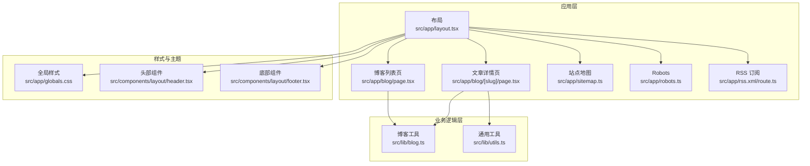
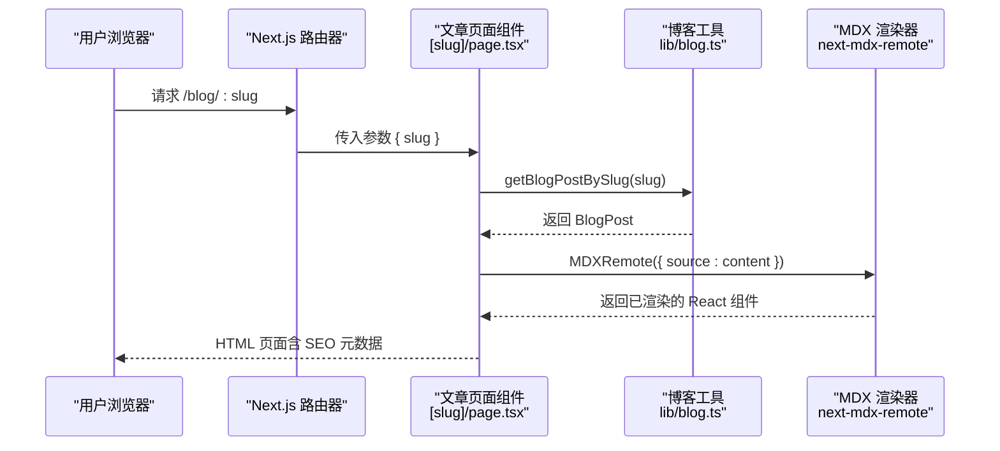
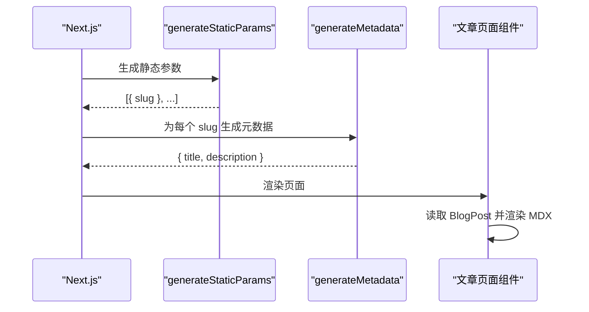
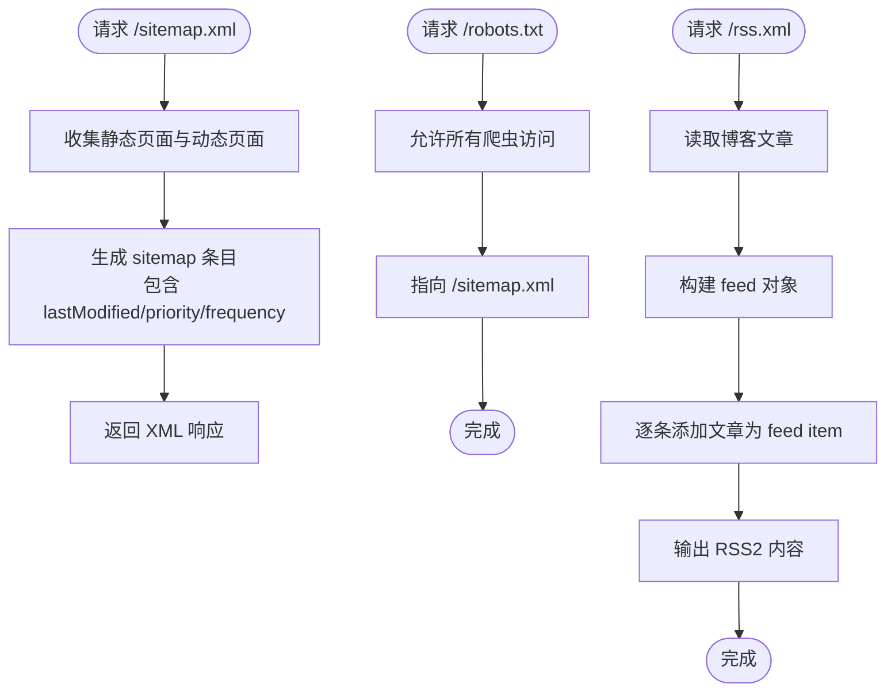
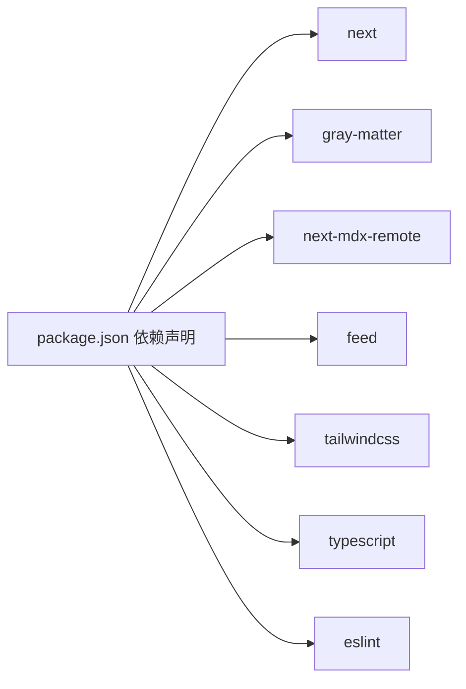

# 博客系统

<cite>
**本文引用的文件**
- [package.json](file://personal-portal/package.json)
- [next.config.ts](file://personal-portal/next.config.ts)
- [src/app/layout.tsx](file://personal-portal/src/app/layout.tsx)
- [src/app/globals.css](file://personal-portal/src/app/globals.css)
- [src/lib/blog.ts](file://personal-portal/src/lib/blog.ts)
- [src/lib/utils.ts](file://personal-portal/src/lib/utils.ts)
- [src/app/blog/page.tsx](file://personal-portal/src/app/blog/page.tsx)
- [src/app/blog/[slug]/page.tsx](file://personal-portal/src/app/blog/[slug]/page.tsx)
- [src/app/sitemap.ts](file://personal-portal/src/app/sitemap.ts)
- [src/app/robots.ts](file://personal-portal/src/app/robots.ts)
- [src/app/rss.xml/route.ts](file://personal-portal/src/app/rss.xml/route.ts)
- [src/components/layout/header.tsx](file://personal-portal/src/components/layout/header.tsx)
- [src/components/layout/footer.tsx](file://personal-portal/src/components/layout/footer.tsx)
</cite>

## 目录
1. [简介](#简介)
2. [项目结构](#项目结构)
3. [核心组件](#核心组件)
4. [架构总览](#架构总览)
5. [详细组件分析](#详细组件分析)
6. [依赖关系分析](#依赖关系分析)
7. [性能考量](#性能考量)
8. [故障排查指南](#故障排查指南)
9. [结论](#结论)
10. [附录](#附录)

## 简介
本项目是一个基于 Next.js 的静态博客系统，采用 Markdown（含 MDX）作为内容源格式，通过 Front Matter 元数据驱动内容管理，并利用 Next.js 的动态路由与 RSC 渲染能力实现高性能的博客页面。系统内置 RSS 订阅、站点地图与 robots 配置，提供 SEO 基础设施；同时具备分类标签、前后文导航与可定制的主题样式。

## 项目结构
博客系统主要由以下层次构成：
- 应用层：Next.js App Router 路由与页面组件，负责页面渲染与 SEO 元数据生成
- 业务逻辑层：内容读取与聚合工具，负责从 content 目录读取 Markdown/MDX 文件并解析 Front Matter
- 样式与主题层：Tailwind CSS 与自定义 CSS 变量，提供深色主题与排版规范
- 静态资源与配置：全局样式、字体、站点配置与构建配置



图表来源
- [src/app/layout.tsx:1-57](file://personal-portal/src/app/layout.tsx#L1-L57)
- [src/app/blog/page.tsx:1-59](file://personal-portal/src/app/blog/page.tsx#L1-L59)
- [src/app/blog/[slug]/page.tsx](file://personal-portal/src/app/blog/[slug]/page.tsx#L1-L110)
- [src/app/sitemap.ts:1-23](file://personal-portal/src/app/sitemap.ts#L1-L23)
- [src/app/robots.ts:1-14](file://personal-portal/src/app/robots.ts#L1-L14)
- [src/app/rss.xml/route.ts:1-40](file://personal-portal/src/app/rss.xml/route.ts#L1-L40)
- [src/lib/blog.ts:1-73](file://personal-portal/src/lib/blog.ts#L1-L73)
- [src/lib/utils.ts:1-21](file://personal-portal/src/lib/utils.ts#L1-L21)
- [src/app/globals.css:1-235](file://personal-portal/src/app/globals.css#L1-L235)
- [src/components/layout/header.tsx:1-106](file://personal-portal/src/components/layout/header.tsx#L1-L106)
- [src/components/layout/footer.tsx:1-76](file://personal-portal/src/components/layout/footer.tsx#L1-L76)

章节来源
- [src/app/layout.tsx:1-57](file://personal-portal/src/app/layout.tsx#L1-L57)
- [src/app/globals.css:1-235](file://personal-portal/src/app/globals.css#L1-L235)

## 核心组件
- 内容读取与聚合：从 content/blog 目录读取 .md/.mdx 文件，使用 gray-matter 解析 Front Matter，过滤草稿并按日期排序，导出统一的 BlogPost 结构
- 动态路由与渲染：根据 slug 生成静态参数，使用 next-mdx-remote 将 MDX 内容安全渲染为 React 组件
- SEO 基础设施：站点元信息、Open Graph、robots、sitemap、RSS
- 主题与样式：自定义 CSS 变量、深色配色方案、排版体系与 prose 样式

章节来源
- [src/lib/blog.ts:1-73](file://personal-portal/src/lib/blog.ts#L1-L73)
- [src/app/blog/[slug]/page.tsx](file://personal-portal/src/app/blog/[slug]/page.tsx#L1-L110)
- [src/app/layout.tsx:19-37](file://personal-portal/src/app/layout.tsx#L19-L37)
- [src/app/robots.ts:1-14](file://personal-portal/src/app/robots.ts#L1-L14)
- [src/app/sitemap.ts:1-23](file://personal-portal/src/app/sitemap.ts#L1-L23)
- [src/app/rss.xml/route.ts:1-40](file://personal-portal/src/app/rss.xml/route.ts#L1-L40)
- [src/app/globals.css:1-235](file://personal-portal/src/app/globals.css#L1-L235)

## 架构总览
系统采用“内容即数据”的设计：内容以 Markdown/MDX 文件形式存储，运行时通过 gray-matter 提取元数据，结合 next-mdx-remote 安全渲染。Next.js 的 App Router 提供路由与 SSR/SSG 能力，配合 feed 生成 RSS，sitemap 与 robots 提供搜索引擎可见性。



图表来源
- [src/app/blog/[slug]/page.tsx](file://personal-portal/src/app/blog/[slug]/page.tsx#L1-L110)
- [src/lib/blog.ts:46-49](file://personal-portal/src/lib/blog.ts#L46-L49)

## 详细组件分析

### 博客内容模型与读取
- 数据模型：BlogPost 包含 slug、title、description、date、tags、draft、content 等字段
- 读取流程：遍历 content/blog 目录，筛选 .md/.mdx 文件，使用 gray-matter 解析 Front Matter，构造 BlogPost 对象
- 过滤与排序：过滤 draft=true 的文章，按日期降序排列
- 辅助方法：获取所有 slug、获取全部标签、获取相邻文章

```mermaid
classDiagram
class BlogPost {
+string slug
+string title
+string description
+string date
+string[] tags
+boolean draft
+string content
}
class BlogLib {
+getBlogPosts() BlogPost[]
+getBlogPostBySlug(slug) BlogPost|null
+getAllBlogSlugs() string[]
+getAllTags() string[]
+getAdjacentPosts(slug) { prev; next }
}
BlogLib --> BlogPost : "返回"
```

图表来源
- [src/lib/blog.ts:7-73](file://personal-portal/src/lib/blog.ts#L7-L73)

章节来源
- [src/lib/blog.ts:17-73](file://personal-portal/src/lib/blog.ts#L17-L73)

### 文章列表页
- 功能：列出所有非草稿文章，显示标题、描述、日期与标签
- 样式：使用容器组件与 Tailwind 类控制间距与颜色
- 交互：点击跳转到对应文章详情页

章节来源
- [src/app/blog/page.tsx:1-59](file://personal-portal/src/app/blog/page.tsx#L1-L59)

### 文章详情页（动态路由）
- 动态参数：generateStaticParams 基于 getAllBlogSlugs 预渲染所有文章
- 元数据：generateMetadata 基于 Front Matter 动态生成 title 与 description
- 渲染：使用 MDXRemote 安全渲染 content 字段
- 导航：通过 getAdjacentPosts 获取上一篇/下一篇文章



图表来源
- [src/app/blog/[slug]/page.tsx](file://personal-portal/src/app/blog/[slug]/page.tsx#L13-L30)

章节来源
- [src/app/blog/[slug]/page.tsx](file://personal-portal/src/app/blog/[slug]/page.tsx#L1-L110)

### SEO 与搜索引擎优化
- 元信息：根布局设置 metadataBase、title 模板、Open Graph 与 robots
- 站点地图：sitemap.ts 动态生成静态页面、项目页与博客页的 sitemap 条目
- Robots：robots.ts 允许所有爬虫并指向 sitemap.xml
- RSS：rss.xml/route.ts 使用 feed 库生成 RSS2 输出，包含标题、链接、描述与分类



图表来源
- [src/app/sitemap.ts:5-22](file://personal-portal/src/app/sitemap.ts#L5-L22)
- [src/app/robots.ts:3-13](file://personal-portal/src/app/robots.ts#L3-L13)
- [src/app/rss.xml/route.ts:4-39](file://personal-portal/src/app/rss.xml/route.ts#L4-L39)

章节来源
- [src/app/layout.tsx:19-37](file://personal-portal/src/app/layout.tsx#L19-L37)
- [src/app/sitemap.ts:1-23](file://personal-portal/src/app/sitemap.ts#L1-L23)
- [src/app/robots.ts:1-14](file://personal-portal/src/app/robots.ts#L1-L14)
- [src/app/rss.xml/route.ts:1-40](file://personal-portal/src/app/rss.xml/route.ts#L1-L40)

### 主题与样式
- 设计系统：通过 CSS 变量定义画布、表面、文字、主色与半径、间距、字号等
- 排版：为 .prose 提供针对标题、段落、代码块、引用、图片与分隔线的样式
- 字体：Geist 与 Geist Mono 字体变量注入
- 深色模式：CSS 变量与媒体查询适配

章节来源
- [src/app/globals.css:3-96](file://personal-portal/src/app/globals.css#L3-L96)
- [src/app/globals.css:157-209](file://personal-portal/src/app/globals.css#L157-L209)
- [src/app/layout.tsx:7-15](file://personal-portal/src/app/layout.tsx#L7-L15)

### 导航与布局
- 头部导航：响应式导航栏，移动端抽屉菜单，高亮当前页
- 底部导航：分组链接（内容、关于、社交），支持外链
- 布局：RootLayout 统一注入字体与元信息，包裹 Header/Footer

章节来源
- [src/components/layout/header.tsx:1-106](file://personal-portal/src/components/layout/header.tsx#L1-L106)
- [src/components/layout/footer.tsx:1-76](file://personal-portal/src/components/layout/footer.tsx#L1-L76)
- [src/app/layout.tsx:1-57](file://personal-portal/src/app/layout.tsx#L1-L57)

## 依赖关系分析
- 运行时依赖：Next.js、gray-matter、next-mdx-remote、feed、lucide-react、recharts
- 开发依赖：Tailwind CSS v4、TypeScript、ESLint
- 构建配置：next.config.ts 空配置，使用默认 Next.js 行为



图表来源
- [package.json:11-29](file://personal-portal/package.json#L11-L29)

章节来源
- [package.json:1-32](file://personal-portal/package.json#L1-L32)
- [next.config.ts:1-8](file://personal-portal/next.config.ts#L1-L8)

## 性能考量
- 预渲染与静态生成：generateStaticParams 预渲染所有文章，降低首屏延迟
- 内容安全渲染：MDXRemote 在服务端渲染，避免客户端注入风险
- 资源体积：Tailwind CSS v4 与 CSS 变量减少重复样式，提升维护性
- SEO 优化：结构化元数据、站点地图与 RSS 提升搜索引擎可见性

## 故障排查指南
- 文章不显示或 404
  - 检查 content/blog 目录是否存在且包含 .md/.mdx 文件
  - 确认 Front Matter 中未设置 draft: true
  - 确认 slug 与文件名一致（不含扩展名）
- 元数据显示异常
  - 检查 generateMetadata 是否正确读取 Front Matter 字段
  - 确认根布局 metadataBase 与 NEXT_PUBLIC_SITE_URL 设置
- RSS 不可用
  - 检查 rss.xml/route.ts 中站点 URL 与文章链接拼接
  - 确认 feed 配置项（语言、更新时间、分类）正确
- 样式不生效
  - 检查 src/app/globals.css 是否被正确引入
  - 确认 CSS 变量与 Tailwind 配置未冲突

章节来源
- [src/lib/blog.ts:17-44](file://personal-portal/src/lib/blog.ts#L17-L44)
- [src/app/blog/[slug]/page.tsx](file://personal-portal/src/app/blog/[slug]/page.tsx#L17-L30)
- [src/app/layout.tsx:17-37](file://personal-portal/src/app/layout.tsx#L17-L37)
- [src/app/rss.xml/route.ts:4-39](file://personal-portal/src/app/rss.xml/route.ts#L4-L39)
- [src/app/globals.css:1-235](file://personal-portal/src/app/globals.css#L1-L235)

## 结论
该博客系统以简洁的文件组织与明确的数据模型为核心，结合 Next.js 的现代特性与生态工具，实现了从内容采集、元数据解析、动态渲染到 SEO 基础设施的完整闭环。通过 MDX 支持与自定义主题，既满足了写作灵活性，也保证了良好的阅读体验与可维护性。

## 附录

### 内容创作指南
- 文件命名：建议使用语义化的 slug，与 Front Matter 的 title 保持一致
- Front Matter 字段：至少包含 title、date、tags；草稿文章可设置 draft: true
- 图片处理：将图片放入 public 目录并在 Markdown 中以相对路径引用
- MDX 支持：可在 Markdown 中嵌入 React 组件（如图表）

章节来源
- [src/lib/blog.ts:24-38](file://personal-portal/src/lib/blog.ts#L24-L38)
- [src/app/blog/[slug]/page.tsx](file://personal-portal/src/app/blog/[slug]/page.tsx#L80-L82)

### Markdown 语法与图片处理
- 语法支持：标准 Markdown 与 MDX 扩展（组件、内联 JS）
- 图片样式：prose 图片自动带圆角与边框，适合博客排版
- 路径引用：推荐使用 public 目录下的绝对路径或相对路径

章节来源
- [src/app/globals.css:201-204](file://personal-portal/src/app/globals.css#L201-L204)
- [src/app/blog/[slug]/page.tsx](file://personal-portal/src/app/blog/[slug]/page.tsx#L80-L82)

### 分类标签系统
- 标签来源：Front Matter 的 tags 数组
- 列表页展示：在文章卡片中以徽标形式显示
- 生成方式：getAllTags 去重并排序，便于后续筛选功能

章节来源
- [src/lib/blog.ts:55-60](file://personal-portal/src/lib/blog.ts#L55-L60)
- [src/app/blog/page.tsx:39-48](file://personal-portal/src/app/blog/page.tsx#L39-L48)

### 自定义主题与样式
- CSS 变量：在 globals.css 中集中管理颜色、字号、间距与半径
- Tailwind v4：使用 @theme 与原生 Tailwind 类组合
- 深色适配：通过 CSS 变量与媒体查询实现

章节来源
- [src/app/globals.css:3-96](file://personal-portal/src/app/globals.css#L3-L96)
- [src/app/globals.css:216-235](file://personal-portal/src/app/globals.css#L216-L235)

### 增删改查操作示例（步骤说明）
- 新增文章
  - 在 content/blog 下新建 .md 或 .mdx 文件
  - 编写 Front Matter（title、date、tags 等）
  - 在文件中编写正文内容（支持 MDX）
  - 启动开发服务器，访问 /blog 查看
- 修改文章
  - 更新 Front Matter 字段或正文内容
  - 如需变更 slug，请同步更新文件名与引用链接
- 删除文章
  - 删除对应文件即可；如需保留历史，可将 draft 设为 true
- 查询与筛选
  - 使用 getBlogPosts 获取列表
  - 使用 getAllTags 获取标签集合
  - 使用 getBlogPostBySlug 按 slug 获取单篇文章

章节来源
- [src/lib/blog.ts:17-73](file://personal-portal/src/lib/blog.ts#L17-L73)
- [src/app/blog/page.tsx:11-12](file://personal-portal/src/app/blog/page.tsx#L11-L12)

### RSS 订阅与网站地图
- RSS
  - 访问 /rss.xml 获取最新文章的 RSS 流
  - feed 会将文章标题、链接、描述与分类写入
- 站点地图
  - 访问 /sitemap.xml 获取包含静态页、项目页与博客页的 sitemap
  - robots.txt 指向 sitemap.xml，便于搜索引擎抓取

章节来源
- [src/app/rss.xml/route.ts:1-40](file://personal-portal/src/app/rss.xml/route.ts#L1-L40)
- [src/app/sitemap.ts:1-23](file://personal-portal/src/app/sitemap.ts#L1-L23)
- [src/app/robots.ts:1-14](file://personal-portal/src/app/robots.ts#L1-L14)