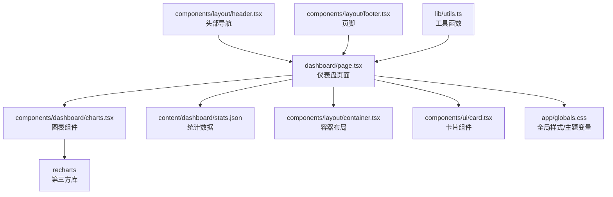
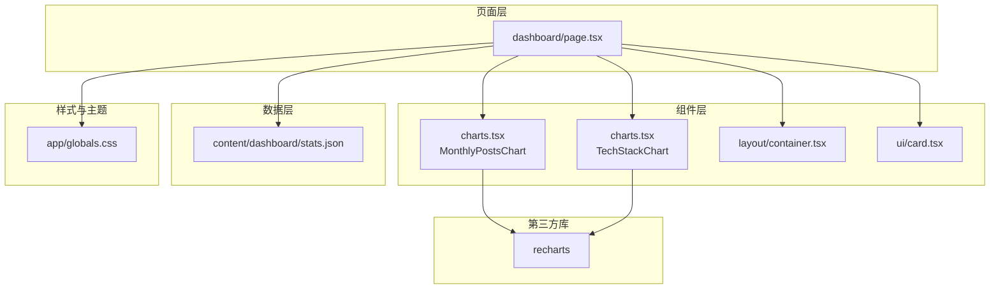
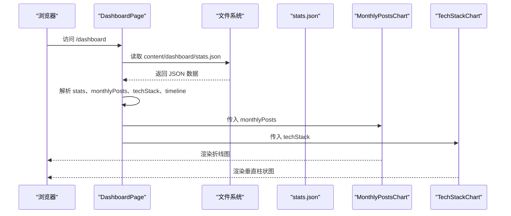
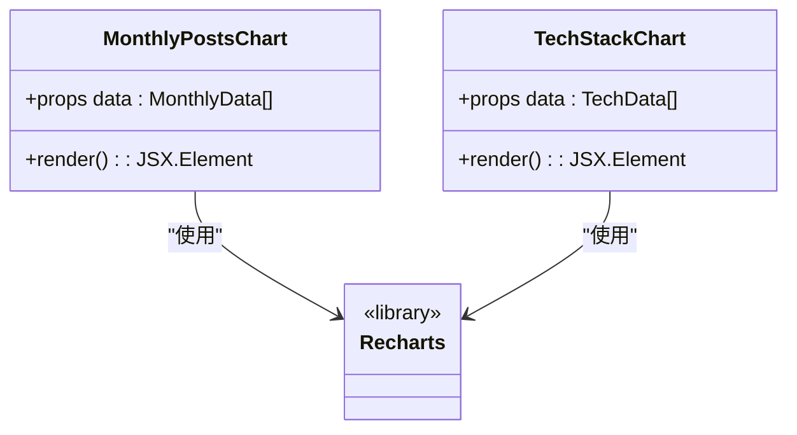
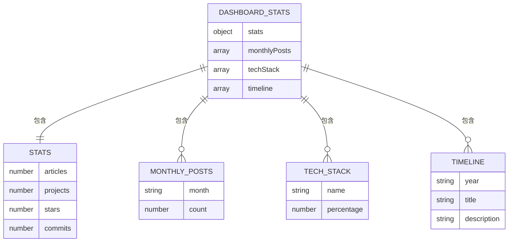
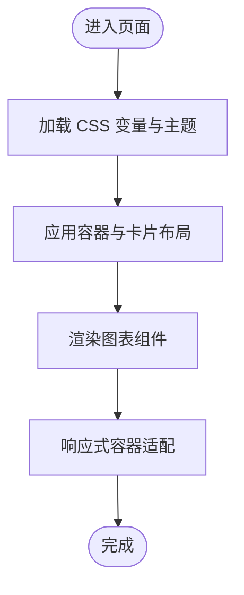
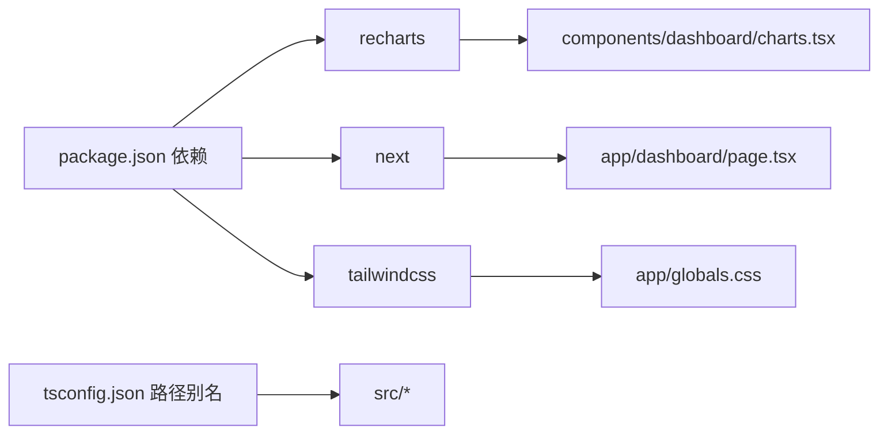

# 数据看板与分析

<cite>
**本文引用的文件**
- [dashboard/page.tsx](file://personal-portal/src/app/dashboard/page.tsx)
- [charts.tsx](file://personal-portal/src/components/dashboard/charts.tsx)
- [stats.json](file://personal-portal/content/dashboard/stats.json)
- [package.json](file://personal-portal/package.json)
- [globals.css](file://personal-portal/src/app/globals.css)
- [container.tsx](file://personal-portal/src/components/layout/container.tsx)
- [card.tsx](file://personal-portal/src/components/ui/card.tsx)
- [header.tsx](file://personal-portal/src/components/layout/header.tsx)
- [footer.tsx](file://personal-portal/src/components/layout/footer.tsx)
- [utils.ts](file://personal-portal/src/lib/utils.ts)
- [next.config.ts](file://personal-portal/next.config.ts)
- [tsconfig.json](file://personal-portal/tsconfig.json)
- [dataviz.md](file://personal-portal/content/projects/dataviz.md)
</cite>

## 目录
1. [引言](#引言)
2. [项目结构](#项目结构)
3. [核心组件](#核心组件)
4. [架构总览](#架构总览)
5. [详细组件分析](#详细组件分析)
6. [依赖关系分析](#依赖关系分析)
7. [性能考量](#性能考量)
8. [故障排查指南](#故障排查指南)
9. [结论](#结论)
10. [附录](#附录)

## 引言
本文件面向“数据看板与分析”功能，围绕基于 Recharts 的可视化实现进行系统化技术说明。内容涵盖：
- 图表组件设计、数据绑定与交互
- 统计数据采集、存储格式与实时更新策略
- 图表类型扩展、自定义样式与动画
- 看板配置项、主题定制与响应式设计
- 新数据源接入、自定义图表与第三方分析服务集成

## 项目结构
个人门户采用 Next.js 应用结构，数据看板位于仪表盘页面，图表组件封装于专用模块，统计数据通过本地 JSON 文件提供。

**图表来源**
- [dashboard/page.tsx:1-110](file://personal-portal/src/app/dashboard/page.tsx#L1-L110)
- [charts.tsx:1-113](file://personal-portal/src/components/dashboard/charts.tsx#L1-L113)
- [stats.json:1-52](file://personal-portal/content/dashboard/stats.json#L1-L52)
- [globals.css:1-235](file://personal-portal/src/app/globals.css#L1-L235)
- [container.tsx:1-14](file://personal-portal/src/components/layout/container.tsx#L1-L14)
- [card.tsx:1-29](file://personal-portal/src/components/ui/card.tsx#L1-L29)
- [header.tsx:1-106](file://personal-portal/src/components/layout/header.tsx#L1-L106)
- [footer.tsx:1-76](file://personal-portal/src/components/layout/footer.tsx#L1-L76)
- [utils.ts:1-21](file://personal-portal/src/lib/utils.ts#L1-L21)

**章节来源**
- [dashboard/page.tsx:1-110](file://personal-portal/src/app/dashboard/page.tsx#L1-L110)
- [charts.tsx:1-113](file://personal-portal/src/components/dashboard/charts.tsx#L1-L113)
- [stats.json:1-52](file://personal-portal/content/dashboard/stats.json#L1-L52)
- [globals.css:1-235](file://personal-portal/src/app/globals.css#L1-L235)

## 核心组件
- 仪表盘页面：负责加载本地统计数据并渲染概览卡片与图表区域。
- 图表组件：封装折线图（文章发布趋势）与垂直柱状图（技术栈分布），统一使用 Recharts，并通过 ResponsiveContainer 实现响应式。
- 布局与主题：通过 TailwindCSS 与 CSS 变量定义颜色、字体、间距与动画；容器与卡片组件提供一致的视觉与交互体验。
- 工具函数：提供类名拼接与日期格式化等通用能力。

关键职责与接口要点：
- 页面从 content/dashboard/stats.json 读取数据，解构为概览指标、月度文章数、技术栈占比与时间轴。
- 图表组件接收 data 属性，内部配置坐标轴、网格、提示框与线条/柱子样式。
- 主题通过 CSS 变量集中管理，支持明暗模式与高对比度场景。

**章节来源**
- [dashboard/page.tsx:14-109](file://personal-portal/src/app/dashboard/page.tsx#L14-L109)
- [charts.tsx:33-112](file://personal-portal/src/components/dashboard/charts.tsx#L33-L112)
- [globals.css:3-96](file://personal-portal/src/app/globals.css#L3-L96)
- [container.tsx:3-13](file://personal-portal/src/components/layout/container.tsx#L3-L13)
- [card.tsx:10-28](file://personal-portal/src/components/ui/card.tsx#L10-L28)
- [utils.ts:1-21](file://personal-portal/src/lib/utils.ts#L1-L21)

## 架构总览
下图展示从页面到图表再到数据源的整体流程，以及主题与布局的协作关系。

**图表来源**
- [dashboard/page.tsx:1-110](file://personal-portal/src/app/dashboard/page.tsx#L1-L110)
- [charts.tsx:1-113](file://personal-portal/src/components/dashboard/charts.tsx#L1-L113)
- [stats.json:1-52](file://personal-portal/content/dashboard/stats.json#L1-L52)
- [globals.css:1-235](file://personal-portal/src/app/globals.css#L1-L235)

## 详细组件分析

### 仪表盘页面（DashboardPage）
- 职责：读取本地 JSON 统计数据，渲染概览卡片与两个图表区块，展示里程碑时间线。
- 数据绑定：将 stats.json 中的 stats、monthlyPosts、techStack、timeline 分别映射到页面元素。
- 响应式布局：使用 CSS Grid 控制卡片与图表区域在不同屏幕尺寸下的排列。
- 交互：概览卡片具备悬停态与点击反馈（由卡片组件提供），图表通过 Recharts 提供交互式提示框。

**图表来源**
- [dashboard/page.tsx:21-109](file://personal-portal/src/app/dashboard/page.tsx#L21-L109)
- [stats.json:1-52](file://personal-portal/content/dashboard/stats.json#L1-L52)

**章节来源**
- [dashboard/page.tsx:14-109](file://personal-portal/src/app/dashboard/page.tsx#L14-L109)
- [stats.json:1-52](file://personal-portal/content/dashboard/stats.json#L1-L52)

### 图表组件（MonthlyPostsChart 与 TechStackChart）
- 设计原则：统一使用 ResponsiveContainer 适配容器宽度；坐标轴与网格采用深色主题配色；提示框采用统一样式对象。
- 数据绑定：Line 接收 monthlyPosts 的 month/count；Bar 接收 techStack 的 name/percentage。
- 交互功能：启用 Tooltip；Line 启用激活点；Bar 设置条形圆角与尺寸。
- 扩展性：可通过 props 注入更多 Recharts 组件（如 Area、Scatter、Heatmap 等）实现多类型图表。

**图表来源**
- [charts.tsx:33-112](file://personal-portal/src/components/dashboard/charts.tsx#L33-L112)

**章节来源**
- [charts.tsx:15-112](file://personal-portal/src/components/dashboard/charts.tsx#L15-L112)

### 数据模型与存储
- 数据模型：包含 stats（文章数、项目数、Star 数、提交数）、monthlyPosts（月份与数量）、techStack（名称与百分比）、timeline（年份、标题与描述）。
- 存储格式：JSON 文件，放置于 content/dashboard/stats.json。
- 更新策略：当前为静态文件读取；若需实时更新，可替换为 API 调用或订阅机制。

**图表来源**
- [stats.json:1-52](file://personal-portal/content/dashboard/stats.json#L1-L52)

**章节来源**
- [stats.json:1-52](file://personal-portal/content/dashboard/stats.json#L1-L52)

### 主题与样式（CSS 变量与 Tailwind 集成）
- 主题变量：定义画布、表面、发色、主色、半径、间距与字号等变量，集中控制视觉风格。
- 动画：提供淡入与滑入动画，用于页面过渡与加载状态。
- 响应式：通过 CSS Grid 与 Tailwind 断点实现卡片与图表的自适应布局。
- 无障碍：焦点样式与选择样式遵循对比度要求。

**图表来源**
- [globals.css:3-96](file://personal-portal/src/app/globals.css#L3-L96)
- [container.tsx:3-13](file://personal-portal/src/components/layout/container.tsx#L3-L13)
- [card.tsx:10-28](file://personal-portal/src/components/ui/card.tsx#L10-L28)

**章节来源**
- [globals.css:1-235](file://personal-portal/src/app/globals.css#L1-L235)
- [container.tsx:1-14](file://personal-portal/src/components/layout/container.tsx#L1-L14)
- [card.tsx:1-29](file://personal-portal/src/components/ui/card.tsx#L1-L29)

## 依赖关系分析
- 依赖声明：项目在 package.json 中引入 recharts 作为可视化库，Next.js 作为框架，TailwindCSS 作为样式工具。
- 类型与路径：tsconfig.json 定义了路径别名 @/* 指向 src/*，便于组件导入。
- 配置：next.config.ts 为空配置，表示默认行为满足当前需求。

**图表来源**
- [package.json:11-20](file://personal-portal/package.json#L11-L20)
- [tsconfig.json:21-23](file://personal-portal/tsconfig.json#L21-L23)
- [next.config.ts:1-8](file://personal-portal/next.config.ts#L1-L8)

**章节来源**
- [package.json:1-32](file://personal-portal/package.json#L1-L32)
- [tsconfig.json:1-35](file://personal-portal/tsconfig.json#L1-L35)
- [next.config.ts:1-8](file://personal-portal/next.config.ts#L1-L8)

## 性能考量
- 响应式渲染：图表使用 ResponsiveContainer，避免固定宽高导致的重排与闪烁。
- 数据规模：当前数据集较小，适合直接渲染；若未来数据量增大，建议分页或采样。
- 动画与可访问性：入口动画应尊重减少动态偏好；提示框交互需考虑键盘可达性。
- 样式体积：Tailwind 与 CSS 变量按需使用，避免无用类名与重复变量。

[本节为通用指导，无需特定文件引用]

## 故障排查指南
- 图表不显示或空白
  - 检查数据是否正确传入图表组件（确保 data 非空且字段匹配）。
  - 确认 ResponsiveContainer 是否有父级高度约束。
- 颜色与对比度问题
  - 核对 CSS 变量是否正确加载，必要时检查主题切换逻辑。
- 布局错位
  - 检查容器与卡片组件的类名拼接是否生效，确认断点设置是否符合预期。
- 交互异常
  - 若 Tooltip 不出现，检查 Tooltip 组件是否被正确包裹在 Recharts 容器内。

**章节来源**
- [charts.tsx:33-112](file://personal-portal/src/components/dashboard/charts.tsx#L33-L112)
- [globals.css:108-156](file://personal-portal/src/app/globals.css#L108-L156)
- [container.tsx:3-13](file://personal-portal/src/components/layout/container.tsx#L3-L13)
- [card.tsx:10-28](file://personal-portal/src/components/ui/card.tsx#L10-L28)

## 结论
该数据看板以 Recharts 为核心，结合本地 JSON 数据与 TailwindCSS 主题体系，实现了简洁而富有表现力的可视化界面。通过模块化的图表组件与统一的主题变量，系统具备良好的可扩展性与维护性。后续可在数据源、图表类型与交互细节上进一步增强，以满足更复杂的分析需求。

[本节为总结性内容，无需特定文件引用]

## 附录

### 图表类型扩展与自定义
- 新增图表类型：在 charts.tsx 中新增函数组件，使用 Recharts 的 Area、Scatter、Composed、RadialBar 等组件组合实现。
- 自定义样式：通过 props 接收颜色、尺寸、字体等参数，覆盖默认样式对象。
- 动画效果：利用 Recharts 的动画属性与 CSS 变量控制入场与过渡效果。

**章节来源**
- [charts.tsx:33-112](file://personal-portal/src/components/dashboard/charts.tsx#L33-L112)

### 数据源接入与实时更新
- 本地 JSON：当前通过文件系统读取 stats.json，适合静态数据与演示场景。
- API 集成：将页面改为异步加载，调用后端接口获取最新数据；结合 Suspense 或骨架屏提升体验。
- 实时订阅：在客户端建立 WebSocket 或长轮询，收到更新后触发状态刷新。

**章节来源**
- [dashboard/page.tsx:21-30](file://personal-portal/src/app/dashboard/page.tsx#L21-L30)

### 主题定制与响应式设计
- 主题变量：在 globals.css 中集中修改颜色、字号与半径，即可全局生效。
- 响应式断点：利用 Tailwind 断点与 CSS Grid 控制卡片与图表的布局密度。
- 无障碍：确保焦点可见、对比度达标、提示框键盘可达。

**章节来源**
- [globals.css:3-96](file://personal-portal/src/app/globals.css#L3-L96)
- [dashboard/page.tsx:48-81](file://personal-portal/src/app/dashboard/page.tsx#L48-L81)

### 第三方分析服务集成
- 服务选择：可接入 Google Analytics、Hotjar、PostHog 等服务，用于行为分析与漏斗追踪。
- 数据采集：在页面生命周期中注入 SDK，按事件埋点上报关键指标。
- 可视化联动：将分析服务返回的聚合数据映射到现有图表组件，形成闭环。

[本节为概念性内容，无需特定文件引用]

### 相关项目参考
- DataViz 项目文档展示了基于 D3.js 的自定义可视化方案，可作为扩展思路的参考。

**章节来源**
- [dataviz.md:1-25](file://personal-portal/content/projects/dataviz.md#L1-L25)