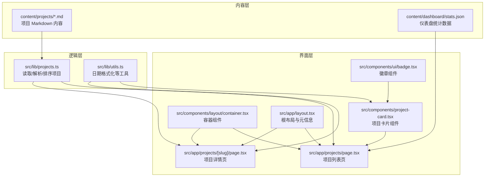
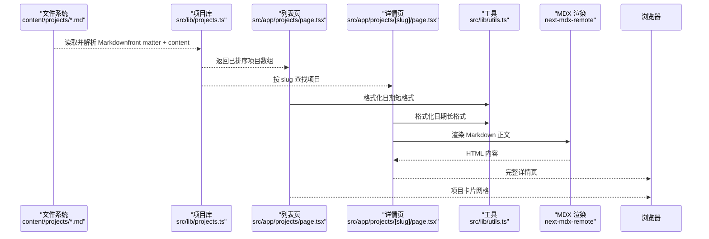
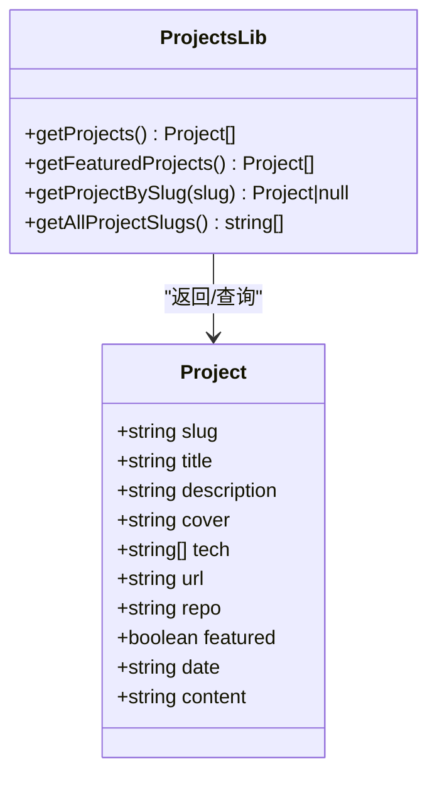
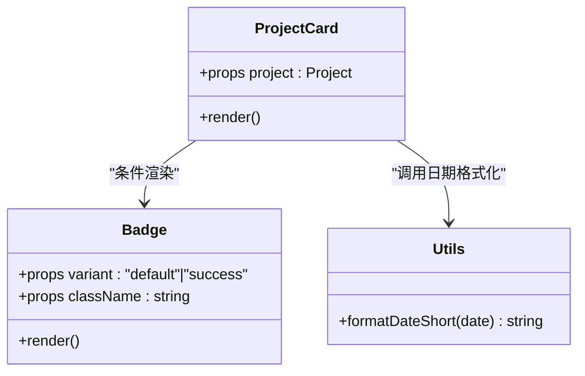
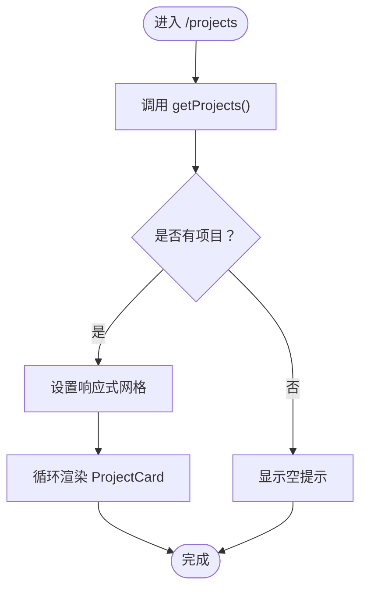
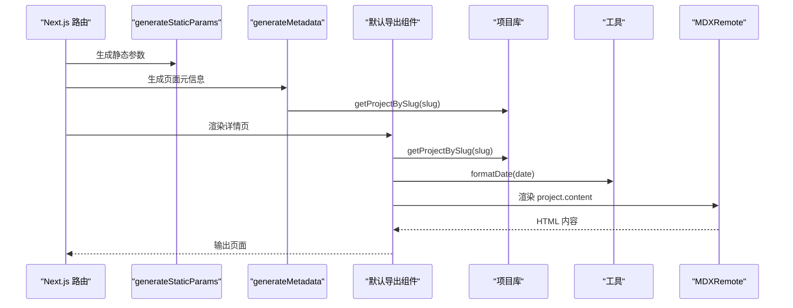
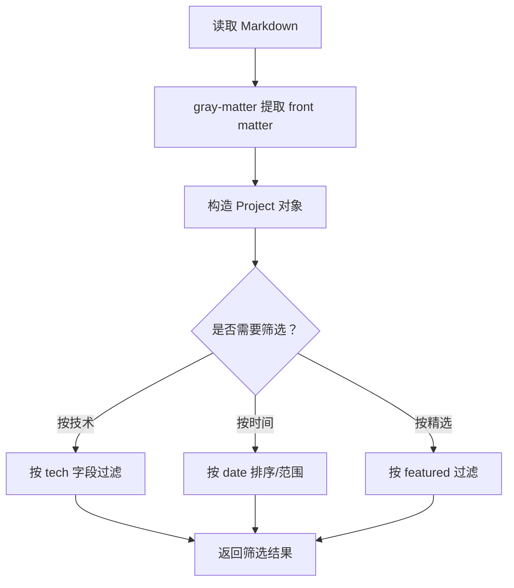
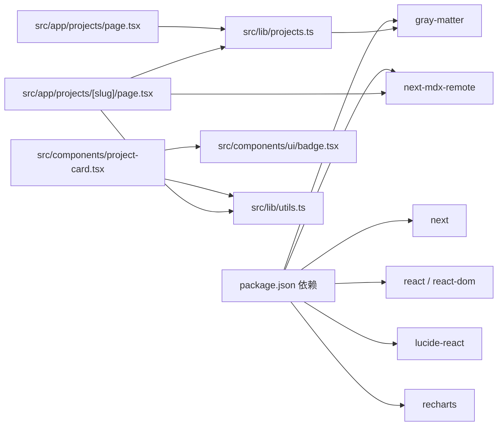

# 项目展示

<cite>
**本文引用的文件**
- [personal-portal/src/lib/projects.ts](file://personal-portal/src/lib/projects.ts)
- [personal-portal/src/components/project-card.tsx](file://personal-portal/src/components/project-card.tsx)
- [personal-portal/src/app/projects/page.tsx](file://personal-portal/src/app/projects/page.tsx)
- [personal-portal/src/app/projects/[slug]/page.tsx](file://personal-portal/src/app/projects/[slug]/page.tsx)
- [personal-portal/content/projects/dataviz.md](file://personal-portal/content/projects/dataviz.md)
- [personal-portal/content/projects/task-flow.md](file://personal-portal/content/projects/task-flow.md)
- [personal-portal/src/lib/utils.ts](file://personal-portal/src/lib/utils.ts)
- [personal-portal/src/components/ui/badge.tsx](file://personal-portal/src/components/ui/badge.tsx)
- [personal-portal/src/components/layout/container.tsx](file://personal-portal/src/components/layout/container.tsx)
- [personal-portal/src/app/layout.tsx](file://personal-portal/src/app/layout.tsx)
- [personal-portal/package.json](file://personal-portal/package.json)
- [personal-portal/content/dashboard/stats.json](file://personal-portal/content/dashboard/stats.json)
</cite>

## 目录
1. [引言](#引言)
2. [项目结构](#项目结构)
3. [核心组件](#核心组件)
4. [架构总览](#架构总览)
5. [组件详解](#组件详解)
6. [依赖关系分析](#依赖关系分析)
7. [性能考量](#性能考量)
8. [故障排查指南](#故障排查指南)
9. [结论](#结论)
10. [附录](#附录)

## 引言
本文件面向“项目展示”功能，系统性阐述内容管理系统的设计与实现，涵盖项目数据结构、分类展示与详情页生成、项目卡片组件的实现细节（含响应式布局与交互）、内容组织方式、标签系统与筛选能力、最佳实践、性能优化与用户体验设计原则，并提供新增项目、定制展示样式与集成外部项目的完整指南。

## 项目结构
项目采用 Next.js App Router 结构，内容以 Markdown 文件形式存放于 content 目录，运行时通过灰度解析（gray-matter）提取元信息与正文，再由页面组件渲染为列表页与详情页。UI 组件与通用工具位于 src 下，全局样式与站点元信息在根布局中统一配置。

**图表来源**
- [personal-portal/src/lib/projects.ts:1-62](file://personal-portal/src/lib/projects.ts#L1-L62)
- [personal-portal/src/lib/utils.ts:1-21](file://personal-portal/src/lib/utils.ts#L1-L21)
- [personal-portal/src/app/projects/page.tsx:1-34](file://personal-portal/src/app/projects/page.tsx#L1-L34)
- [personal-portal/src/app/projects/[slug]/page.tsx](file://personal-portal/src/app/projects/[slug]/page.tsx#L1-L106)
- [personal-portal/src/components/project-card.tsx:1-41](file://personal-portal/src/components/project-card.tsx#L1-L41)
- [personal-portal/src/components/ui/badge.tsx:1-27](file://personal-portal/src/components/ui/badge.tsx#L1-L27)
- [personal-portal/src/components/layout/container.tsx:1-14](file://personal-portal/src/components/layout/container.tsx#L1-L14)
- [personal-portal/src/app/layout.tsx:1-57](file://personal-portal/src/app/layout.tsx#L1-L57)

**章节来源**
- [personal-portal/src/app/layout.tsx:1-57](file://personal-portal/src/app/layout.tsx#L1-L57)
- [personal-portal/package.json:1-32](file://personal-portal/package.json#L1-L32)

## 核心组件
- 项目数据模型：定义了标题、描述、封面、技术栈、链接、是否精选、日期与正文等字段，用于统一展示与筛选。
- 列表页：读取所有项目，按日期降序排列，渲染为卡片网格。
- 详情页：根据 slug 动态生成静态参数，解析对应 Markdown 内容，使用 MDX Remote 渲染正文。
- 项目卡片：包含日期、精选徽章、标题、摘要、技术标签等，支持悬停过渡与链接跳转。
- 工具函数：提供日期格式化与类名合并等通用能力。
- 布局与容器：统一最大宽度与间距，确保跨设备一致性。

**章节来源**
- [personal-portal/src/lib/projects.ts:7-18](file://personal-portal/src/lib/projects.ts#L7-L18)
- [personal-portal/src/app/projects/page.tsx:10-33](file://personal-portal/src/app/projects/page.tsx#L10-L33)
- [personal-portal/src/app/projects/[slug]/page.tsx](file://personal-portal/src/app/projects/[slug]/page.tsx#L31-L105)
- [personal-portal/src/components/project-card.tsx:6-40](file://personal-portal/src/components/project-card.tsx#L6-L40)
- [personal-portal/src/lib/utils.ts:5-20](file://personal-portal/src/lib/utils.ts#L5-L20)
- [personal-portal/src/components/layout/container.tsx:3-13](file://personal-portal/src/components/layout/container.tsx#L3-L13)

## 架构总览
下图展示了从内容到页面渲染的端到端流程：Markdown 文件被解析为项目对象，列表页与详情页分别消费这些对象；详情页还通过 MDX Remote 将 Markdown 正文渲染为 HTML。

**图表来源**
- [personal-portal/src/lib/projects.ts:20-61](file://personal-portal/src/lib/projects.ts#L20-L61)
- [personal-portal/src/app/projects/page.tsx:10-33](file://personal-portal/src/app/projects/page.tsx#L10-L33)
- [personal-portal/src/app/projects/[slug]/page.tsx](file://personal-portal/src/app/projects/[slug]/page.tsx#L31-L105)
- [personal-portal/src/lib/utils.ts:5-20](file://personal-portal/src/lib/utils.ts#L5-L20)

## 组件详解

### 项目数据模型与读取
- 数据模型：包含 slug、标题、描述、封面、技术栈、线上地址、仓库地址、是否精选、日期、正文等字段。
- 读取策略：遍历 content/projects 目录，过滤 .md 文件，使用 gray-matter 解析 front matter 与正文，按日期倒序返回。
- 辅助方法：获取精选项目、按 slug 查询、获取全部 slug。

**图表来源**
- [personal-portal/src/lib/projects.ts:7-18](file://personal-portal/src/lib/projects.ts#L7-L18)
- [personal-portal/src/lib/projects.ts:20-61](file://personal-portal/src/lib/projects.ts#L20-L61)

**章节来源**
- [personal-portal/src/lib/projects.ts:1-62](file://personal-portal/src/lib/projects.ts#L1-L62)

### 项目卡片组件
- 结构组成：顶部日期与精选徽章、标题、摘要、技术标签行。
- 交互与样式：卡片容器具备悬停边框与背景过渡；标题在组内悬停时切换主色；技术标签使用圆角背景与紧凑内边距。
- 链接行为：点击卡片跳转至详情页。

**图表来源**
- [personal-portal/src/components/project-card.tsx:6-40](file://personal-portal/src/components/project-card.tsx#L6-L40)
- [personal-portal/src/components/ui/badge.tsx:10-26](file://personal-portal/src/components/ui/badge.tsx#L10-L26)
- [personal-portal/src/lib/utils.ts:14-20](file://personal-portal/src/lib/utils.ts#L14-L20)

**章节来源**
- [personal-portal/src/components/project-card.tsx:1-41](file://personal-portal/src/components/project-card.tsx#L1-L41)
- [personal-portal/src/components/ui/badge.tsx:1-27](file://personal-portal/src/components/ui/badge.tsx#L1-L27)
- [personal-portal/src/lib/utils.ts:1-21](file://personal-portal/src/lib/utils.ts#L1-L21)

### 列表页渲染流程
- 获取项目：调用 getProjects() 并按日期倒序排列。
- 响应式网格：使用 CSS Grid 在小屏单列、中屏双列、大屏三列之间自适应。
- 容器约束：通过 Container 组件限制最大宽度与横向留白。

**图表来源**
- [personal-portal/src/app/projects/page.tsx:10-33](file://personal-portal/src/app/projects/page.tsx#L10-L33)
- [personal-portal/src/components/layout/container.tsx:3-13](file://personal-portal/src/components/layout/container.tsx#L3-L13)

**章节来源**
- [personal-portal/src/app/projects/page.tsx:1-34](file://personal-portal/src/app/projects/page.tsx#L1-L34)
- [personal-portal/src/components/layout/container.tsx:1-14](file://personal-portal/src/components/layout/container.tsx#L1-L14)

### 详情页渲染流程
- 动态参数：generateStaticParams 基于 getAllProjectSlugs 生成静态路由参数，提升 SEO 与首屏性能。
- 元信息：generateMetadata 基于项目 front matter 动态设置标题与描述。
- 正文渲染：使用 next-mdx-remote 将 Markdown 正文安全地渲染为 HTML。
- 导航与交互：提供返回列表页的链接、在线地址与源码仓库外链、技术标签展示。

**图表来源**
- [personal-portal/src/app/projects/[slug]/page.tsx](file://personal-portal/src/app/projects/[slug]/page.tsx#L12-L29)
- [personal-portal/src/app/projects/[slug]/page.tsx](file://personal-portal/src/app/projects/[slug]/page.tsx#L31-L105)
- [personal-portal/src/lib/projects.ts:54-61](file://personal-portal/src/lib/projects.ts#L54-L61)
- [personal-portal/src/lib/utils.ts:5-12](file://personal-portal/src/lib/utils.ts#L5-L12)

**章节来源**
- [personal-portal/src/app/projects/[slug]/page.tsx](file://personal-portal/src/app/projects/[slug]/page.tsx#L1-L106)
- [personal-portal/src/lib/projects.ts:1-62](file://personal-portal/src/lib/projects.ts#L1-L62)
- [personal-portal/src/lib/utils.ts:1-21](file://personal-portal/src/lib/utils.ts#L1-L21)

### 内容组织与标签系统
- 内容组织：每个项目以独立 Markdown 文件存在，front matter 中声明元信息，正文为可扩展的 Markdown。
- 标签系统：tech 字段为字符串数组，用于展示技术栈标签；可通过该字段进行筛选或分组。
- 筛选能力：当前实现提供精选筛选（featured），可扩展为按技术栈、年份等维度筛选。

**图表来源**
- [personal-portal/src/lib/projects.ts:27-47](file://personal-portal/src/lib/projects.ts#L27-L47)
- [personal-portal/content/projects/dataviz.md:1-9](file://personal-portal/content/projects/dataviz.md#L1-L9)
- [personal-portal/content/projects/task-flow.md:1-9](file://personal-portal/content/projects/task-flow.md#L1-L9)

**章节来源**
- [personal-portal/content/projects/dataviz.md:1-25](file://personal-portal/content/projects/dataviz.md#L1-L25)
- [personal-portal/content/projects/task-flow.md:1-25](file://personal-portal/content/projects/task-flow.md#L1-L25)
- [personal-portal/src/lib/projects.ts:1-62](file://personal-portal/src/lib/projects.ts#L1-L62)

## 依赖关系分析
- 项目依赖：Next.js、gray-matter、next-mdx-remote、lucide-react、recharts 等。
- 组件耦合：列表页与详情页均依赖项目库；卡片组件依赖徽章与工具；详情页依赖 MDX 渲染。
- 外部集成：通过 generateStaticParams 与静态生成结合，提升 SEO 与性能；通过 MDX Remote 渲染 Markdown 正文。

**图表来源**
- [personal-portal/package.json:11-29](file://personal-portal/package.json#L11-L29)
- [personal-portal/src/lib/projects.ts:1-5](file://personal-portal/src/lib/projects.ts#L1-L5)
- [personal-portal/src/app/projects/page.tsx:1-2](file://personal-portal/src/app/projects/page.tsx#L1-L2)
- [personal-portal/src/app/projects/[slug]/page.tsx](file://personal-portal/src/app/projects/[slug]/page.tsx#L4-L8)
- [personal-portal/src/components/project-card.tsx:1-4](file://personal-portal/src/components/project-card.tsx#L1-L4)
- [personal-portal/src/components/ui/badge.tsx:1-8](file://personal-portal/src/components/ui/badge.tsx#L1-L8)
- [personal-portal/src/lib/utils.ts:1-3](file://personal-portal/src/lib/utils.ts#L1-L3)

**章节来源**
- [personal-portal/package.json:1-32](file://personal-portal/package.json#L1-L32)

## 性能考量
- 静态生成与预渲染：详情页通过 generateStaticParams 生成静态路由，减少运行时计算，提升首屏性能与 SEO。
- 内容缓存：项目读取与解析仅在构建期或服务启动时执行，避免重复 IO。
- 渲染优化：卡片使用轻量过渡与简洁布局，减少重排与重绘；MDX 渲染在服务端完成，降低客户端负担。
- 图片与资源：建议为封面图配置懒加载与合适的尺寸，避免阻塞主线程。
- 代码分割：保持组件拆分清晰，利用 Next.js 默认的路由级代码分割。

[本节为通用指导，无需列出具体文件来源]

## 故障排查指南
- 项目为空：检查 content/projects 目录是否存在且包含 .md 文件；确认 front matter 是否正确；验证 getProjects() 是否返回空数组。
- 详情页 404：确认 slug 是否存在于 getAllProjectSlugs；检查 generateStaticParams 是否生成了该 slug；确认文件命名与 slug 一致。
- MDX 渲染异常：检查 Markdown 正文语法；确认 next-mdx-remote 版本兼容；避免在内容中注入不受信任的 HTML。
- 样式错位：核对 Container 最大宽度与网格断点；确认 Tailwind 类名拼写；检查主题变量是否生效。
- 日期显示问题：确认 date 字段格式；使用 utils 中的格式化函数；注意时区差异。

**章节来源**
- [personal-portal/src/app/projects/[slug]/page.tsx](file://personal-portal/src/app/projects/[slug]/page.tsx#L39-L41)
- [personal-portal/src/lib/utils.ts:5-20](file://personal-portal/src/lib/utils.ts#L5-L20)
- [personal-portal/src/components/layout/container.tsx:3-13](file://personal-portal/src/components/layout/container.tsx#L3-L13)

## 结论
本项目通过“内容即数据”的方式，将 Markdown 作为内容源，配合 Next.js 的静态生成与 MDX 渲染，实现了高性能、可维护的项目展示系统。组件化设计与响应式布局确保了良好的跨设备体验；通过扩展筛选与标签系统，可进一步增强内容组织与检索能力。

[本节为总结性内容，无需列出具体文件来源]

## 附录

### 添加新项目
- 在 content/projects 目录新增 Markdown 文件，编写 front matter（标题、描述、技术栈、线上地址、仓库地址、是否精选、日期）与正文。
- 若需在列表页显示精选，设置 featured 为真。
- 保存后，列表页会自动收录；详情页通过 slug 自动路由访问。

**章节来源**
- [personal-portal/content/projects/dataviz.md:1-9](file://personal-portal/content/projects/dataviz.md#L1-L9)
- [personal-portal/content/projects/task-flow.md:1-9](file://personal-portal/content/projects/task-flow.md#L1-L9)

### 自定义展示样式
- 卡片样式：可在项目卡片组件中调整边框、背景、悬停过渡与字体大小。
- 标签样式：通过徽章组件 variant 或自定义类名控制标签外观。
- 布局：在列表页调整网格列数与间距；在详情页调整容器最大宽度与正文排版。
- 主题：通过 Tailwind 变量与颜色令牌统一风格，确保深浅色模式一致。

**章节来源**
- [personal-portal/src/components/project-card.tsx:8-38](file://personal-portal/src/components/project-card.tsx#L8-L38)
- [personal-portal/src/components/ui/badge.tsx:5-8](file://personal-portal/src/components/ui/badge.tsx#L5-L8)
- [personal-portal/src/app/projects/page.tsx:22-26](file://personal-portal/src/app/projects/page.tsx#L22-L26)
- [personal-portal/src/components/layout/container.tsx:11-11](file://personal-portal/src/components/layout/container.tsx#L11-L11)

### 集成外部项目
- 外链集成：在 front matter 中填写 url 与 repo 字段，详情页会自动渲染外链按钮。
- 数据联动：可参考 dashboard 统计数据结构，在页面中引入 JSON 数据进行展示（如技术栈占比、时间线等）。
- SEO 优化：通过 generateMetadata 动态设置标题与描述，提升搜索引擎可见性。

**章节来源**
- [personal-portal/src/app/projects/[slug]/page.tsx](file://personal-portal/src/app/projects/[slug]/page.tsx#L62-L86)
- [personal-portal/content/dashboard/stats.json:1-52](file://personal-portal/content/dashboard/stats.json#L1-L52)