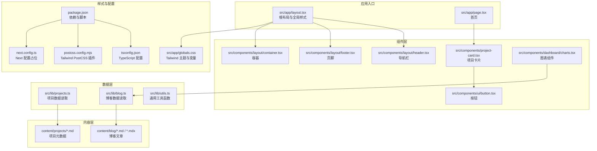
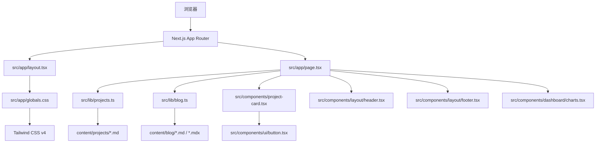
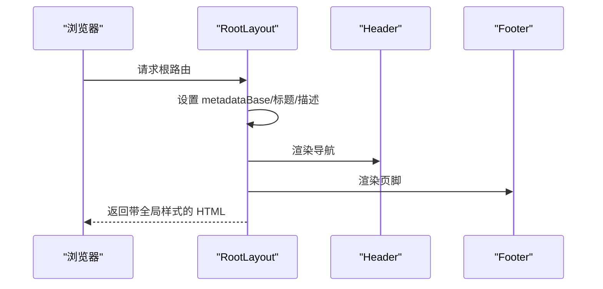
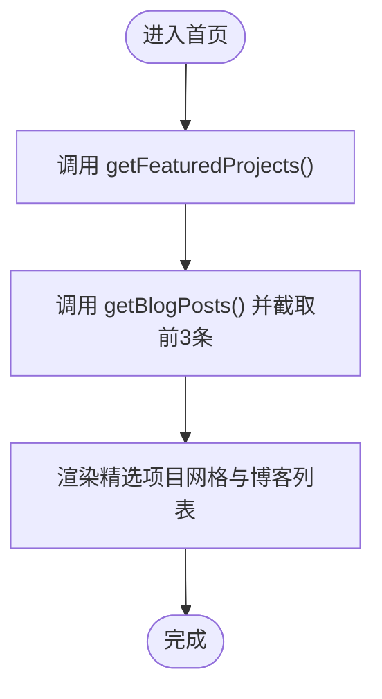
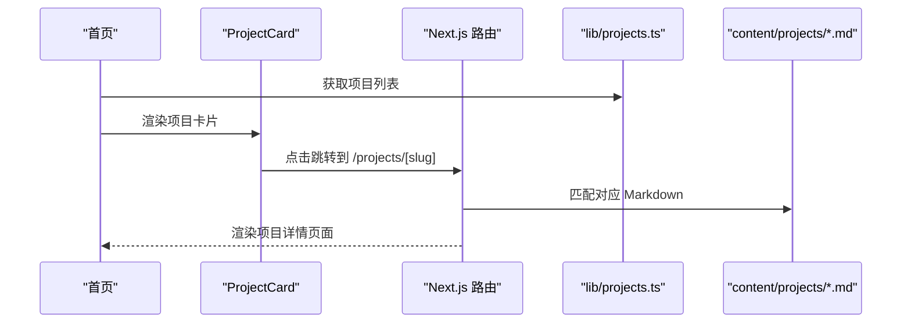
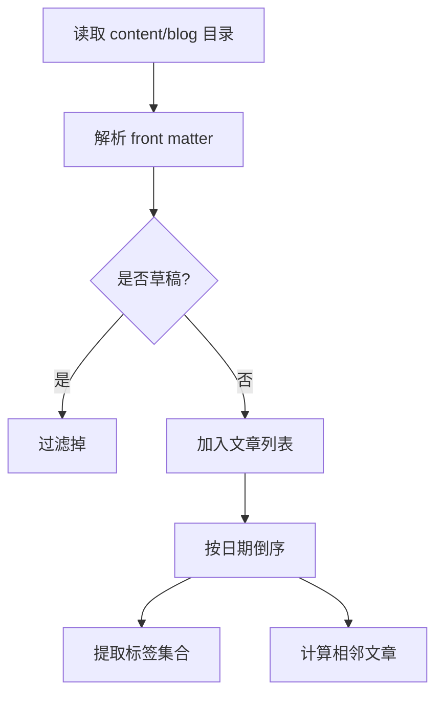
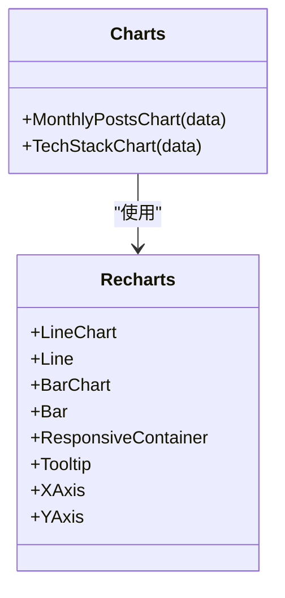
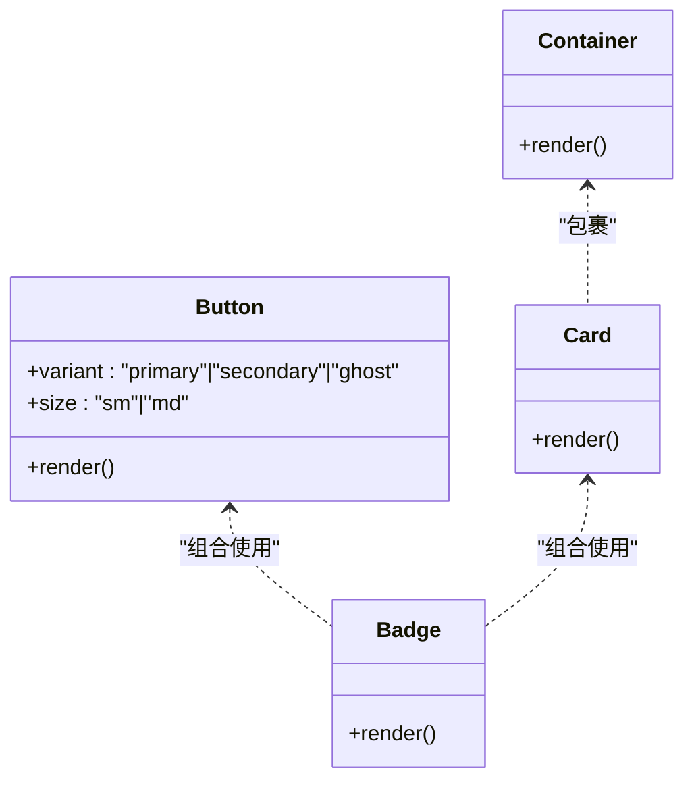
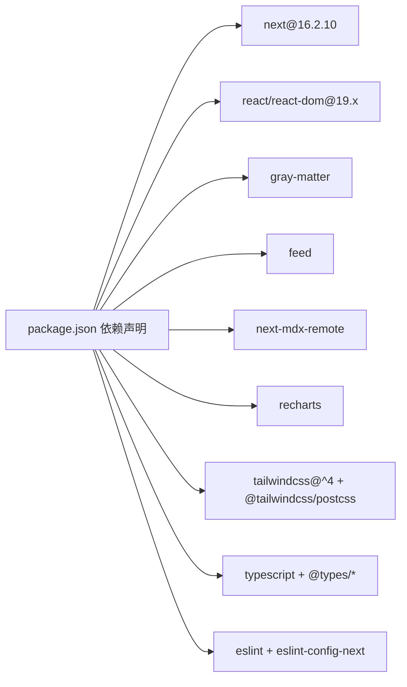

# 项目概览与架构

<cite>
**本文引用的文件**
- [package.json](file://personal-portal/package.json)
- [tsconfig.json](file://personal-portal/tsconfig.json)
- [next.config.ts](file://personal-portal/next.config.ts)
- [postcss.config.mjs](file://personal-portal/postcss.config.mjs)
- [src/app/layout.tsx](file://personal-portal/src/app/layout.tsx)
- [src/app/page.tsx](file://personal-portal/src/app/page.tsx)
- [src/app/globals.css](file://personal-portal/src/app/globals.css)
- [src/components/layout/header.tsx](file://personal-portal/src/components/layout/header.tsx)
- [src/components/layout/footer.tsx](file://personal-portal/src/components/layout/footer.tsx)
- [src/components/layout/container.tsx](file://personal-portal/src/components/layout/container.tsx)
- [src/components/ui/button.tsx](file://personal-portal/src/components/ui/button.tsx)
- [src/components/project-card.tsx](file://personal-portal/src/components/project-card.tsx)
- [src/components/dashboard/charts.tsx](file://personal-portal/src/components/dashboard/charts.tsx)
- [src/lib/projects.ts](file://personal-portal/src/lib/projects.ts)
- [src/lib/blog.ts](file://personal-portal/src/lib/blog.ts)
- [src/lib/utils.ts](file://personal-portal/src/lib/utils.ts)
- [content/projects/dataviz.md](file://personal-portal/content/projects/dataviz.md)
</cite>

## 目录
1. [引言](#引言)
2. [项目结构](#项目结构)
3. [核心组件](#核心组件)
4. [架构总览](#架构总览)
5. [详细组件分析](#详细组件分析)
6. [依赖分析](#依赖分析)
7. [性能考量](#性能考量)
8. [故障排查指南](#故障排查指南)
9. [结论](#结论)
10. [附录](#附录)

## 引言
Personal Portal 是一个基于 Next.js 16.2.10 的静态生成型个人门户网站，采用 TypeScript、Tailwind CSS v4 以及内容驱动的数据模型，实现项目展示、技术博客与数据看板的统一呈现。项目通过 App Router 组织页面与路由，利用内容目录（Markdown/MDX）管理博客与项目元数据，并以 Recharts 提供看板数据可视化。

## 项目结构
项目采用“特性优先”的目录组织方式，核心目录如下：
- src/app：App Router 页面与路由组织，包含布局、页面、元数据与路由处理
- src/components：可复用 UI 组件与布局组件
- src/lib：业务逻辑与数据访问层（读取 content 目录）
- content：静态内容目录（博客与项目），使用 front matter 管理元数据
- 配置文件：package.json、tsconfig.json、next.config.ts、postcss.config.mjs

**图表来源**
- [src/app/layout.tsx:1-57](file://personal-portal/src/app/layout.tsx#L1-L57)
- [src/app/page.tsx:1-148](file://personal-portal/src/app/page.tsx#L1-L148)
- [src/components/layout/header.tsx:1-106](file://personal-portal/src/components/layout/header.tsx#L1-L106)
- [src/components/layout/footer.tsx:1-76](file://personal-portal/src/components/layout/footer.tsx#L1-L76)
- [src/components/layout/container.tsx:1-14](file://personal-portal/src/components/layout/container.tsx#L1-L14)
- [src/components/ui/button.tsx:1-41](file://personal-portal/src/components/ui/button.tsx#L1-L41)
- [src/components/project-card.tsx:1-41](file://personal-portal/src/components/project-card.tsx#L1-L41)
- [src/components/dashboard/charts.tsx:1-113](file://personal-portal/src/components/dashboard/charts.tsx#L1-L113)
- [src/lib/projects.ts:1-62](file://personal-portal/src/lib/projects.ts#L1-L62)
- [src/lib/blog.ts:1-73](file://personal-portal/src/lib/blog.ts#L1-L73)
- [src/lib/utils.ts:1-21](file://personal-portal/src/lib/utils.ts#L1-L21)
- [content/projects/dataviz.md:1-25](file://personal-portal/content/projects/dataviz.md#L1-L25)
- [src/app/globals.css:1-235](file://personal-portal/src/app/globals.css#L1-L235)
- [tsconfig.json:1-35](file://personal-portal/tsconfig.json#L1-L35)
- [next.config.ts:1-8](file://personal-portal/next.config.ts#L1-L8)
- [postcss.config.mjs:1-8](file://personal-portal/postcss.config.mjs#L1-L8)
- [package.json:1-32](file://personal-portal/package.json#L1-L32)

**章节来源**
- [package.json:1-32](file://personal-portal/package.json#L1-L32)
- [tsconfig.json:1-35](file://personal-portal/tsconfig.json#L1-L35)
- [next.config.ts:1-8](file://personal-portal/next.config.ts#L1-L8)
- [postcss.config.mjs:1-8](file://personal-portal/postcss.config.mjs#L1-L8)
- [src/app/layout.tsx:1-57](file://personal-portal/src/app/layout.tsx#L1-L57)
- [src/app/page.tsx:1-148](file://personal-portal/src/app/page.tsx#L1-L148)
- [src/app/globals.css:1-235](file://personal-portal/src/app/globals.css#L1-L235)

## 核心组件
- 根布局与元数据：定义站点基础信息、字体加载、全局样式注入与根 HTML 结构
- 首页：聚合展示精选项目、最新博客与行动号召区域
- 布局组件：头部导航、页脚、容器封装
- UI 组件：按钮、卡片等基础 UI
- 数据访问层：从 content 目录读取 Markdown/MDX 内容，解析 front matter 并返回结构化数据
- 可视化组件：基于 Recharts 的折线图与条形图，用于看板统计

**章节来源**
- [src/app/layout.tsx:1-57](file://personal-portal/src/app/layout.tsx#L1-L57)
- [src/app/page.tsx:1-148](file://personal-portal/src/app/page.tsx#L1-L148)
- [src/components/layout/header.tsx:1-106](file://personal-portal/src/components/layout/header.tsx#L1-L106)
- [src/components/layout/footer.tsx:1-76](file://personal-portal/src/components/layout/footer.tsx#L1-L76)
- [src/components/layout/container.tsx:1-14](file://personal-portal/src/components/layout/container.tsx#L1-L14)
- [src/components/ui/button.tsx:1-41](file://personal-portal/src/components/ui/button.tsx#L1-L41)
- [src/components/project-card.tsx:1-41](file://personal-portal/src/components/project-card.tsx#L1-L41)
- [src/components/dashboard/charts.tsx:1-113](file://personal-portal/src/components/dashboard/charts.tsx#L1-L113)
- [src/lib/projects.ts:1-62](file://personal-portal/src/lib/projects.ts#L1-L62)
- [src/lib/blog.ts:1-73](file://personal-portal/src/lib/blog.ts#L1-L73)
- [src/lib/utils.ts:1-21](file://personal-portal/src/lib/utils.ts#L1-L21)

## 架构总览
应用采用“内容即数据”的架构模式：前端通过 Next.js 的 App Router 渲染页面，数据来源于本地 content 目录的 Markdown/MDX 文件；样式系统由 Tailwind CSS v4 与自定义主题变量构成；TypeScript 提供类型安全；Recharts 负责看板数据可视化。

**图表来源**
- [src/app/layout.tsx:1-57](file://personal-portal/src/app/layout.tsx#L1-L57)
- [src/app/page.tsx:1-148](file://personal-portal/src/app/page.tsx#L1-L148)
- [src/lib/projects.ts:1-62](file://personal-portal/src/lib/projects.ts#L1-L62)
- [src/lib/blog.ts:1-73](file://personal-portal/src/lib/blog.ts#L1-L73)
- [content/projects/dataviz.md:1-25](file://personal-portal/content/projects/dataviz.md#L1-L25)
- [src/app/globals.css:1-235](file://personal-portal/src/app/globals.css#L1-L235)
- [src/components/project-card.tsx:1-41](file://personal-portal/src/components/project-card.tsx#L1-L41)
- [src/components/ui/button.tsx:1-41](file://personal-portal/src/components/ui/button.tsx#L1-L41)
- [src/components/layout/header.tsx:1-106](file://personal-portal/src/components/layout/header.tsx#L1-L106)
- [src/components/layout/footer.tsx:1-76](file://personal-portal/src/components/layout/footer.tsx#L1-L76)
- [src/components/dashboard/charts.tsx:1-113](file://personal-portal/src/components/dashboard/charts.tsx#L1-L113)

## 详细组件分析

### 根布局与全局样式
- 功能：设置站点元数据、加载 Geist 字体、注入全局样式、包裹子组件
- 关键点：使用 next/font 加载字体变量，设置 metadataBase 与 Open Graph；根 HTML 上挂载字体变量类名；body 容纳 Header/Footer 与主内容区

**图表来源**
- [src/app/layout.tsx:1-57](file://personal-portal/src/app/layout.tsx#L1-L57)
- [src/components/layout/header.tsx:1-106](file://personal-portal/src/components/layout/header.tsx#L1-L106)
- [src/components/layout/footer.tsx:1-76](file://personal-portal/src/components/layout/footer.tsx#L1-L76)

**章节来源**
- [src/app/layout.tsx:1-57](file://personal-portal/src/app/layout.tsx#L1-L57)
- [src/app/globals.css:1-235](file://personal-portal/src/app/globals.css#L1-L235)

### 首页与内容聚合
- 功能：展示精选项目、最新博客与行动号召
- 数据来源：通过 lib 层读取 content 目录中的 Markdown/MDX 文件，解析 front matter 后排序与筛选
- 组件协作：首页调用 lib 方法获取数据，渲染项目卡片与博客列表

**图表来源**
- [src/app/page.tsx:1-148](file://personal-portal/src/app/page.tsx#L1-L148)
- [src/lib/projects.ts:1-62](file://personal-portal/src/lib/projects.ts#L1-L62)
- [src/lib/blog.ts:1-73](file://personal-portal/src/lib/blog.ts#L1-L73)

**章节来源**
- [src/app/page.tsx:1-148](file://personal-portal/src/app/page.tsx#L1-L148)
- [src/lib/projects.ts:1-62](file://personal-portal/src/lib/projects.ts#L1-L62)
- [src/lib/blog.ts:1-73](file://personal-portal/src/lib/blog.ts#L1-L73)

### 项目卡片与项目详情
- 项目卡片：展示项目标题、描述、日期、标签与“精选”徽标
- 项目详情：由 App Router 的动态路由 [slug] 自动匹配 content/projects 下的 Markdown 文件，结合 next-mdx-remote 支持 MDX 内容渲染

**图表来源**
- [src/components/project-card.tsx:1-41](file://personal-portal/src/components/project-card.tsx#L1-L41)
- [src/lib/projects.ts:1-62](file://personal-portal/src/lib/projects.ts#L1-L62)
- [content/projects/dataviz.md:1-25](file://personal-portal/content/projects/dataviz.md#L1-L25)

**章节来源**
- [src/components/project-card.tsx:1-41](file://personal-portal/src/components/project-card.tsx#L1-L41)
- [src/lib/projects.ts:1-62](file://personal-portal/src/lib/projects.ts#L1-L62)
- [content/projects/dataviz.md:1-25](file://personal-portal/content/projects/dataviz.md#L1-L25)

### 博客系统与标签
- 数据模型：BlogPost 包含标题、描述、日期、标签、草稿标记与正文
- 功能：列出所有非草稿文章、按日期倒序、提取所有标签、计算相邻文章
- 渲染：首页展示最近文章摘要，详情页支持 MDX 内容渲染

**图表来源**
- [src/lib/blog.ts:1-73](file://personal-portal/src/lib/blog.ts#L1-L73)

**章节来源**
- [src/lib/blog.ts:1-73](file://personal-portal/src/lib/blog.ts#L1-L73)

### 看板与数据可视化
- 组件：MonthlyPostsChart（月度文章趋势）、TechStackChart（技术栈占比）
- 库：Recharts，ResponsiveContainer 适配
- 数据：看板页面通过 lib 层聚合数据后传入组件

**图表来源**
- [src/components/dashboard/charts.tsx:1-113](file://personal-portal/src/components/dashboard/charts.tsx#L1-L113)

**章节来源**
- [src/components/dashboard/charts.tsx:1-113](file://personal-portal/src/components/dashboard/charts.tsx#L1-L113)

### UI 组件体系
- Button：支持主次与幽灵三种变体、两种尺寸，统一过渡与焦点样式
- Badge、Card：在项目卡片中配合使用
- Container：统一最大宽度与内边距

**图表来源**
- [src/components/ui/button.tsx:1-41](file://personal-portal/src/components/ui/button.tsx#L1-L41)
- [src/components/project-card.tsx:1-41](file://personal-portal/src/components/project-card.tsx#L1-L41)
- [src/components/layout/container.tsx:1-14](file://personal-portal/src/components/layout/container.tsx#L1-L14)

**章节来源**
- [src/components/ui/button.tsx:1-41](file://personal-portal/src/components/ui/button.tsx#L1-L41)
- [src/components/layout/container.tsx:1-14](file://personal-portal/src/components/layout/container.tsx#L1-L14)

## 依赖分析
- 运行时依赖
  - next：框架核心，版本 16.2.10
  - react/react-dom：19.2.4
  - lucide-react：图标库
  - gray-matter：解析 Markdown front matter
  - feed：RSS 输出
  - next-mdx-remote：MDX 内容渲染
  - recharts：数据可视化
- 开发依赖
  - tailwindcss v4、@tailwindcss/postcss、postcss
  - typescript、@types/react、@types/node 等
  - eslint 与 eslint-config-next

**图表来源**
- [package.json:1-32](file://personal-portal/package.json#L1-L32)

**章节来源**
- [package.json:1-32](file://personal-portal/package.json#L1-L32)

## 性能考量
- 静态内容驱动：项目与博客均来自本地 Markdown/MDX，减少运行时数据库查询开销
- 字体优化：使用 next/font 按需注入变量，避免 FOIT/FOFT
- 样式体积：Tailwind v4 与自定义变量减少重复样式，提升可维护性
- 图表渲染：Recharts 在客户端渲染，建议在看板页面按需加载或懒加载
- 构建与缓存：Next.js 编译与 ISR/SSG 机制（如启用）可进一步优化首屏与缓存策略

## 故障排查指南
- 构建失败
  - 检查 TypeScript 配置与路径别名
  - 确认 Tailwind 插件与 PostCSS 配置正确
- 内容未显示
  - 确认 content 目录下文件命名与 front matter 格式
  - 检查 lib 层读取逻辑与过滤条件（草稿、日期）
- 样式异常
  - 检查 globals.css 中主题变量与 Tailwind 指令顺序
  - 确认字体变量类名已挂载到 html 根节点
- 路由 404
  - 确认动态路由 [slug] 对应的 Markdown 文件存在
  - 检查 lib 层 slug 列表与实际文件名一致性

**章节来源**
- [tsconfig.json:1-35](file://personal-portal/tsconfig.json#L1-L35)
- [postcss.config.mjs:1-8](file://personal-portal/postcss.config.mjs#L1-L8)
- [src/app/globals.css:1-235](file://personal-portal/src/app/globals.css#L1-L235)
- [src/lib/projects.ts:1-62](file://personal-portal/src/lib/projects.ts#L1-L62)
- [src/lib/blog.ts:1-73](file://personal-portal/src/lib/blog.ts#L1-L73)

## 结论
Personal Portal 以内容为中心的设计，结合 Next.js 的 App Router、TypeScript 类型安全与 Tailwind CSS v4 主题系统，实现了简洁、可维护且具备良好扩展性的个人门户。通过 lib 层抽象数据访问、组件层封装 UI 与布局，项目在保持低耦合的同时，具备清晰的职责边界与良好的开发体验。

## 附录
- 初始化与启动
  - 开发：执行开发服务器命令
  - 构建：编译产物至 .next
  - 启动：生产环境启动服务
- 配置要点
  - TypeScript：严格模式、路径别名、增量编译
  - Tailwind：v4 主题变量、PostCSS 插件、全局样式
  - Next：当前配置为空对象，便于后续扩展

**章节来源**
- [package.json:5-10](file://personal-portal/package.json#L5-L10)
- [tsconfig.json:1-35](file://personal-portal/tsconfig.json#L1-L35)
- [postcss.config.mjs:1-8](file://personal-portal/postcss.config.mjs#L1-L8)
- [next.config.ts:1-8](file://personal-portal/next.config.ts#L1-L8)