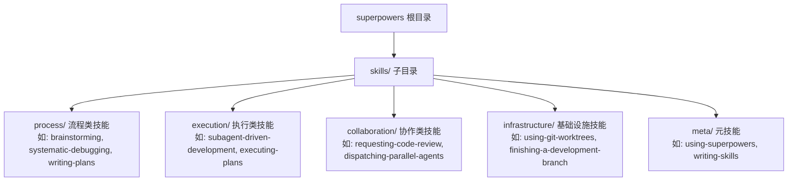
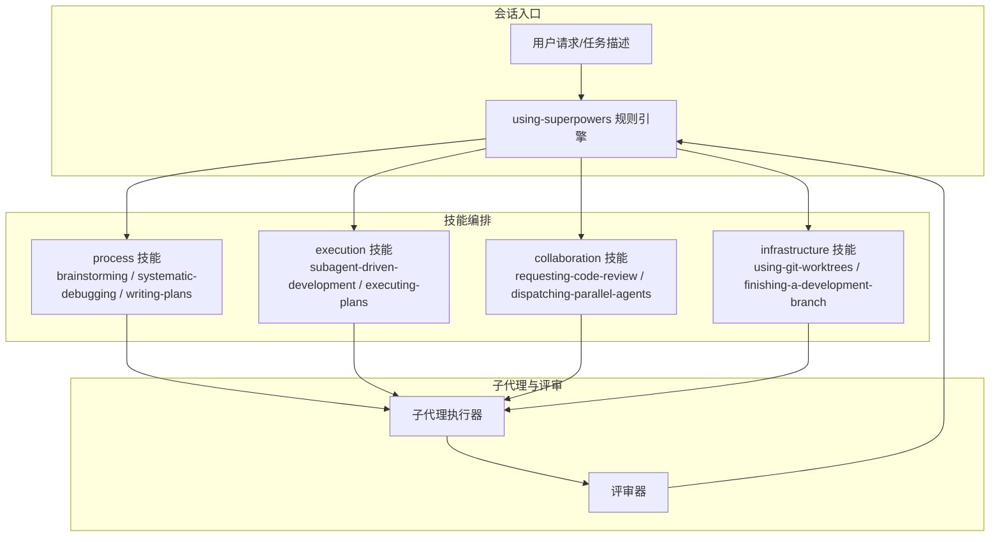
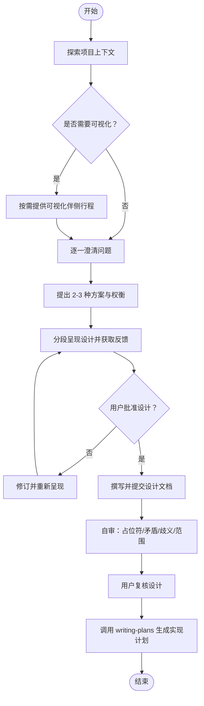
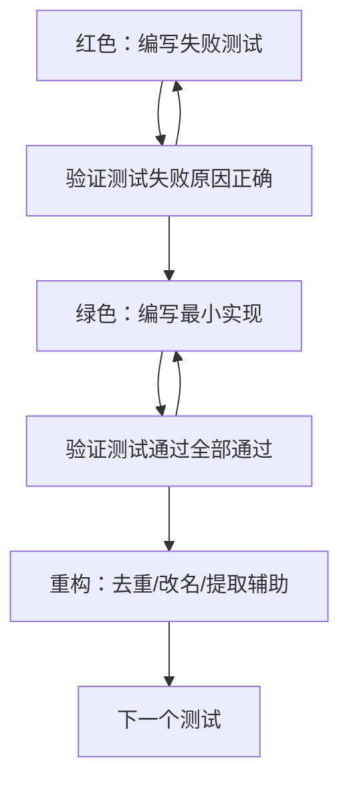
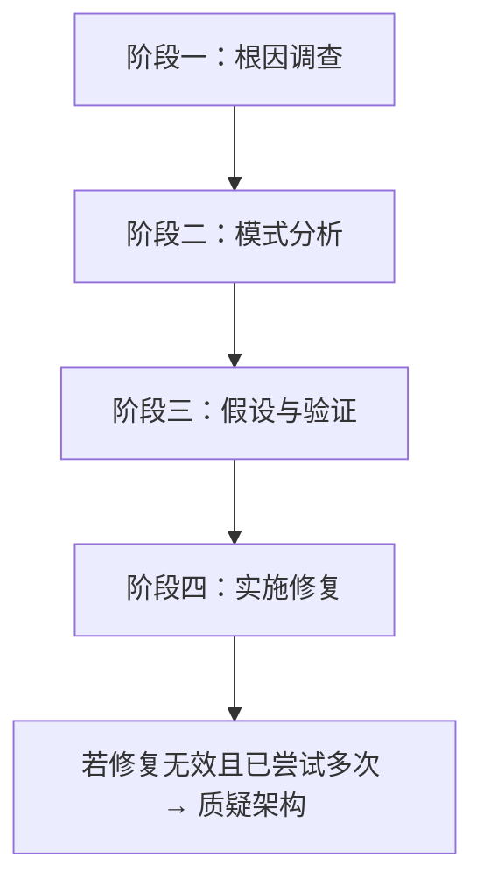
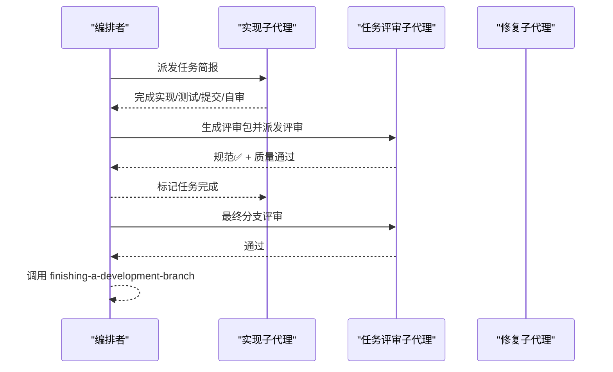
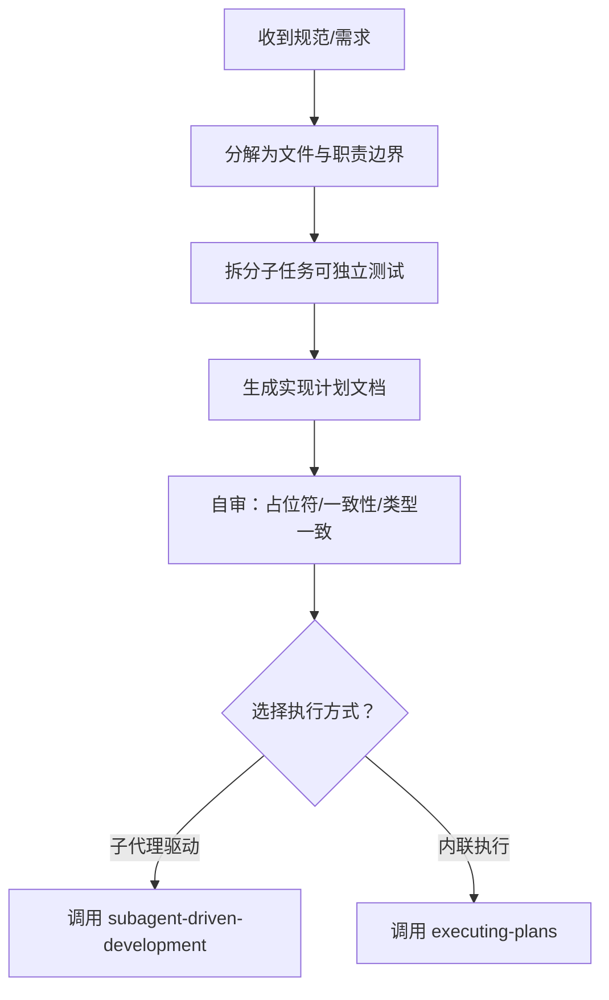
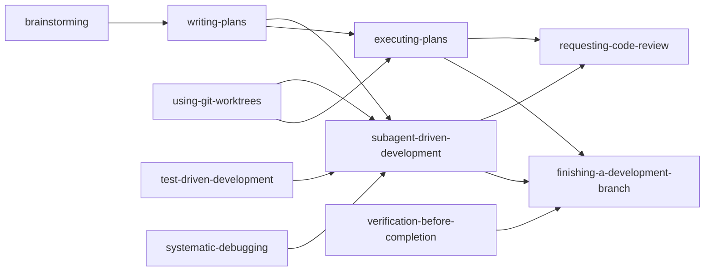

# Superpowers AI 开发技能系统

<cite>
**本文档引用的文件**
- [README.md](file://superpowers/README.md)
- [SKILL.md](file://superpowers/skills/brainstorming/SKILL.md)
- [SKILL.md](file://superpowers/skills/test-driven-development/SKILL.md)
- [SKILL.md](file://superpowers/skills/systematic-debugging/SKILL.md)
- [SKILL.md](file://superpowers/skills/subagent-driven-development/SKILL.md)
- [SKILL.md](file://superpowers/skills/writing-plans/SKILL.md)
- [SKILL.md](file://superpowers/skills/requesting-code-review/SKILL.md)
- [SKILL.md](file://superpowers/skills/using-git-worktrees/SKILL.md)
- [SKILL.md](file://superpowers/skills/dispatching-parallel-agents/SKILL.md)
- [SKILL.md](file://superpowers/skills/executing-plans/SKILL.md)
- [SKILL.md](file://superpowers/skills/verification-before-completion/SKILL.md)
- [SKILL.md](file://superpowers/skills/finishing-a-development-branch/SKILL.md)
- [SKILL.md](file://superpowers/skills/writing-skills/SKILL.md)
- [SKILL.md](file://superpowers/skills/using-superpowers/SKILL.md)
</cite>

## 目录
1. [简介](#简介)
2. [项目结构](#项目结构)
3. [核心组件](#核心组件)
4. [架构总览](#架构总览)
5. [详细组件分析](#详细组件分析)
6. [依赖关系分析](#依赖关系分析)
7. [性能考量](#性能考量)
8. [故障排查指南](#故障排查指南)
9. [结论](#结论)
10. [附录](#附录)

## 简介
Superpowers 是一套面向代码智能体的可组合开发技能系统，围绕 14 项自动触发的核心技能构建，覆盖从需求澄清到实现交付的完整开发闭环。系统强调“先规划后编码”“先测试后实现”“先诊断后修复”，通过子代理协作与两阶段评审确保高质量交付。该系统可在多平台（Claude Code、Cursor、Codex 等）以插件形式安装使用，会话启动即激活。

## 项目结构
Superpowers 的技能以“技能目录 + 技能文档”的方式组织，每个技能独立维护其触发条件、执行流程与配套工具。核心技能分布在 skills/ 目录下，README 提供安装与基本工作流概览。

图示来源
- [README.md:200-243](file://superpowers/README.md#L200-L243)

章节来源
- [README.md:1-286](file://superpowers/README.md#L1-L286)

## 核心组件
Superpowers 的 14 项核心技能按功能分为四类：测试、调试、协作与元能力。每项技能均定义明确的触发条件、前置检查与执行步骤，确保在正确时机被调用且不偏离流程。

- 测试类
  - test-driven-development：强制“红-绿-重构”循环，杜绝“事后补测”
- 调试类
  - systematic-debugging：四阶段根因调查，禁止症状式修复
  - verification-before-completion：完成前验证，证据优先
- 协作类
  - brainstorming：设计前的 Socratic 引导与可视化伴侧行程
  - writing-plans：将规范拆解为可执行任务清单
  - executing-plans：离线执行计划并设置审查节点
  - subagent-driven-development：按任务派发子代理，双评审门禁
  - dispatching-parallel-agents：独立问题域并行调查
  - requesting-code-review：任务级/分支级代码评审
  - using-git-worktrees：隔离工作区与基线验证
  - finishing-a-development-branch：合并/PR/保留/丢弃决策与清理
- 元能力
  - using-superpowers：会话启动时建立技能发现与调用规则
  - writing-skills：以 TDD 方式创作与验证新技能

章节来源
- [README.md:218-243](file://superpowers/README.md#L218-L243)
- [SKILL.md:1-63](file://superpowers/skills/using-superpowers/SKILL.md#L1-L63)

## 架构总览
Superpowers 的运行架构由“触发器 + 技能引擎 + 子代理 + 审查机制”构成。会话开始时，系统根据当前任务类型自动选择最合适的技能；技能内部再按阶段调用子代理执行具体动作，并通过评审门禁保证质量。

图示来源
- [SKILL.md:18-32](file://superpowers/skills/using-superpowers/SKILL.md#L18-L32)
- [SKILL.md:45-83](file://superpowers/skills/subagent-driven-development/SKILL.md#L45-L83)
- [SKILL.md:12-23](file://superpowers/skills/requesting-code-review/SKILL.md#L12-L23)

## 详细组件分析

### 思维风暴（Brainstorming）
- 触发时机：任何创意性工作（新增特性、组件、行为修改）前
- 关键流程：探索上下文 → 可视化伴侧行程（按需）→ 逐问澄清 → 提出 2-3 种方案 → 分段呈现设计 → 写入规范文档 → 自审与用户复核 → 转写为实现计划
- 验证点：必须获得用户对设计的批准；设计文档保存至指定路径并提交版本库
- 可视化伴侧行程：仅在“问题需要可视化展示”时才提供浏览器窗口，避免无谓开销

图示来源
- [SKILL.md:34-61](file://superpowers/skills/brainstorming/SKILL.md#L34-L61)

章节来源
- [SKILL.md:1-160](file://superpowers/skills/brainstorming/SKILL.md#L1-L160)

### 测试驱动开发（Test-Driven Development）
- 触发时机：实现任何功能或修复任何缺陷之前
- 核心原则：先写失败测试，再写最小实现，最后重构
- 铁律：未见测试失败即实现生产代码者，视为未遵循 TDD
- 常见误区：事后补测、已有手动测试、删除代码重来等

图示来源
- [SKILL.md:47-69](file://superpowers/skills/test-driven-development/SKILL.md#L47-L69)

章节来源
- [SKILL.md:1-372](file://superpowers/skills/test-driven-development/SKILL.md#L1-L372)

### 系统化调试（Systematic Debugging）
- 触发时机：出现任何缺陷、测试失败或异常行为
- 四阶段流程：根因调查 → 模式分析 → 假设与验证 → 实施修复
- 铁律：未完成第一阶段不得提出修复
- 支持技术：根因追溯、纵深防御、基于条件的等待

图示来源
- [SKILL.md:46-214](file://superpowers/skills/systematic-debugging/SKILL.md#L46-L214)

章节来源
- [SKILL.md:1-297](file://superpowers/skills/systematic-debugging/SKILL.md#L1-L297)

### 子代理驱动开发（Subagent-Driven Development）
- 触发时机：拥有实现计划且任务相对独立
- 执行策略：每任务派发全新子代理 → 任务评审（规范符合度 + 代码质量）→ 最终分支评审
- 质量门禁：每次评审必须同时满足“规范符合”和“代码质量”；修复后需复评
- 进度持久化：使用 ledger 文件记录已完成任务，避免压缩后丢失进度

图示来源
- [SKILL.md:47-83](file://superpowers/skills/subagent-driven-development/SKILL.md#L47-L83)

章节来源
- [SKILL.md:1-419](file://superpowers/skills/subagent-driven-development/SKILL.md#L1-L419)

### 编写计划（Writing Plans）
- 触发时机：已有规范或需求，准备进入实现阶段
- 输出：可执行的实现计划文档，包含文件清单、接口契约、分步任务与验证步骤
- 要求：任务粒度小（2-5 分钟）、无占位符、完整代码与命令、DRY/YAGNI/TDD、频繁提交

图示来源
- [SKILL.md:25-77](file://superpowers/skills/writing-plans/SKILL.md#L25-L77)

章节来源
- [SKILL.md:1-175](file://superpowers/skills/writing-plans/SKILL.md#L1-L175)

### 请求代码评审（Requesting Code Review）
- 触发时机：任务完成后、重大功能实现后、合并前
- 评审输入：变更摘要、需求/计划、基线与 HEAD 提交 SHA
- 处理原则：先修复严重问题再继续；对评审意见进行技术性争辩或修正

章节来源
- [SKILL.md:1-104](file://superpowers/skills/requesting-code-review/SKILL.md#L1-L104)

### 使用 Git 工作树（Using Git Worktrees）
- 触发时机：开始需要隔离的工作或执行实现计划前
- 步骤：检测现有隔离 → 优先原生工具 → 回退到 git worktree → 项目初始化 → 清洁基线验证
- 注意事项：避免在子模块中创建嵌套工作树；确保项目本地工作树目录被忽略

章节来源
- [SKILL.md:1-203](file://superpowers/skills/using-git-worktrees/SKILL.md#L1-L203)

### 并行派发子代理（Dispatching Parallel Agents）
- 触发时机：多个相互独立的问题域，且可并行处理
- 模式：识别独立域 → 构造聚焦任务 → 并行派发 → 汇总与集成 → 全量回归
- 风险控制：避免共享状态冲突；确保输出可合并且无冲突

章节来源
- [SKILL.md:1-186](file://superpowers/skills/dispatching-parallel-agents/SKILL.md#L1-L186)

### 执行计划（Executing Plans）
- 触发时机：已有实现计划，但无法使用子代理或希望离线执行
- 流程：加载并批判性审查计划 → 逐项执行并验证 → 完成后调用收尾技能
- 阻塞条件：遇到阻塞、计划缺陷、指令不清、验证反复失败时立即停止并求助

章节来源
- [SKILL.md:1-71](file://superpowers/skills/executing-plans/SKILL.md#L1-L71)

### 完成开发分支（Finishing a Development Branch）
- 触发时机：实现完成、所有测试通过
- 流程：验证测试 → 环境探测 → 基线分支确定 → 展示选项（合并/推送到 PR/保留/丢弃）→ 执行选择 → 清理工作树
- 安全措施：仅在合并成功后再清理工作树；严格确认丢弃操作

章节来源
- [SKILL.md:1-242](file://superpowers/skills/finishing-a-development-branch/SKILL.md#L1-L242)

### 使用 Superpowers（Using Superpowers）
- 触发时机：任何会话开始
- 规则：在任何响应或行动前（包括澄清问题、探索代码库）必须先调用适用技能；当多项技能适用时，流程类技能优先
- 平台适配：不同平台有专用参考文件

章节来源
- [SKILL.md:1-63](file://superpowers/skills/using-superpowers/SKILL.md#L1-L63)

### 创造技能（Writing Skills）
- 触发时机：创建/编辑/验证新技能
- 方法论：以 TDD 方式创作技能（压力场景 → 基线行为 → 编写技能 → 通过测试 → 重构收紧），确保在高压下仍能坚持纪律
- 发现优化：描述字段只写触发条件，关键词覆盖错误信息、症状与工具名称，命名采用动词优先

章节来源
- [SKILL.md:1-690](file://superpowers/skills/writing-skills/SKILL.md#L1-L690)

## 依赖关系分析
- 技能间依赖
  - writing-plans 依赖 brainstorming 的设计成果
  - subagent-driven-development 依赖 writing-plans 的任务清单与 using-git-worktrees 的隔离工作区
  - requesting-code-review 在任务级与分支级分别使用
  - finishing-a-development-branch 依赖 using-git-worktrees 的工作树管理
- 子代理与评审
  - 子代理负责实现与自审；评审器负责规范符合度与代码质量；修复子代理用于针对性修正
- 平台集成
  - 各平台通过插件/扩展接入，会话启动时加载 using-superpowers 作为引导

图示来源
- [SKILL.md:156-175](file://superpowers/skills/writing-plans/SKILL.md#L156-L175)
- [SKILL.md:406-419](file://superpowers/skills/subagent-driven-development/SKILL.md#L406-L419)
- [SKILL.md:161-183](file://superpowers/skills/finishing-a-development-branch/SKILL.md#L161-L183)

章节来源
- [README.md:200-217](file://superpowers/README.md#L200-L217)

## 性能考量
- 成本控制
  - 子代理模型选择：机械实现用廉价模型，集成判断用标准模型，架构设计用最强模型；避免默认继承最高成本模型
  - 任务复杂度信号：单文件/简单规范用廉价模型；多文件/高耦合用中档模型
- 效率提升
  - 子代理一次性携带完整任务简报，减少上下文传递与重复说明
  - 评审包集中呈现差异与统计，避免长篇历史粘贴
- 资源安全
  - 工作树清理仅针对 Superpowers 创建的目录，避免误删平台托管工作树
  - 丢弃操作需用户明确确认，防止误删

## 故障排查指南
- 常见违规
  - 在未完成根因调查前提出修复
  - 未见测试失败即实现生产代码
  - 任务完成后未验证测试直接合并
  - 忽略评审器的严重问题继续推进
- 快速定位
  - 使用 verification-before-completion 的“证据优先”流程，逐条核验命令输出与退出码
  - 对于并行调查，检查各子代理是否修改相同文件导致冲突
- 处理建议
  - 回到阶段一重新收集证据；删除不符合 TDD 的实现并重来
  - 对于多次修复无效的情况，暂停并重新审视架构设计

章节来源
- [SKILL.md:215-233](file://superpowers/skills/systematic-debugging/SKILL.md#L215-L233)
- [SKILL.md:272-289](file://superpowers/skills/test-driven-development/SKILL.md#L272-L289)
- [SKILL.md:52-62](file://superpowers/skills/verification-before-completion/SKILL.md#L52-L62)

## 结论
Superpowers 将工程纪律与自动化流程结合，通过 14 项可组合技能形成“先规划、先测试、先诊断”的开发范式。系统在多平台具备良好兼容性，配合子代理与评审机制，显著降低返工与缺陷率，提升交付质量与效率。建议在实际使用中严格遵循技能触发时机与质量门禁，持续优化技能组合以适应不同项目与团队需求。

## 附录
- 多平台安装与使用
  - Claude Code、Antigravity、Codex App/Cli、Cursor、Factory Droid、GitHub Copilot CLI、Kimi Code、OpenCode、Pi 等平台均可通过官方市场或命令安装 Superpowers 插件/扩展
  - 会话启动即激活 using-superpowers，随后按需自动触发其他技能
- 自然语言触发要点
  - 设计阶段：表达“请帮我把想法整理为设计”“我们先做设计再实现”
  - 测试阶段：表达“请先写测试再实现”“我需要 TDD 流程”
  - 调试阶段：表达“这里有问题，先根因调查”“请系统化地排查”
  - 协作阶段：表达“请并行处理这些独立问题”“请在任务间进行评审”
  - 收尾阶段：表达“请验证测试并通过后再合并”

章节来源
- [README.md:44-198](file://superpowers/README.md#L44-L198)