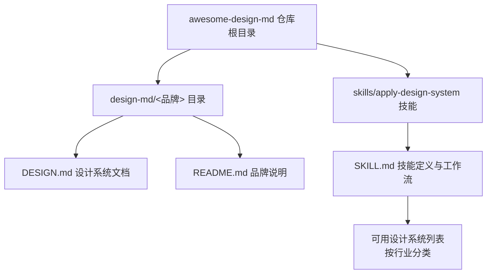
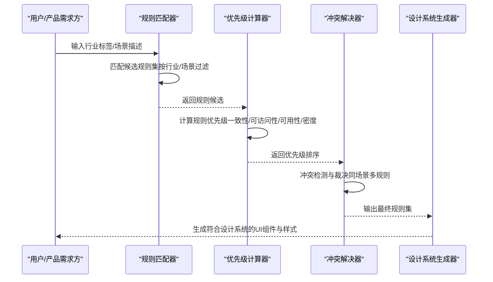
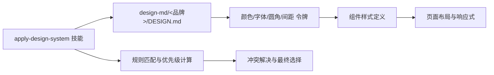

# 161条行业推理规则

<cite>
**本文档引用的文件**
- [awesome-design-md/README.md](file://awesome-design-md/README.md)
- [awesome-design-md/skills/apply-design-system/SKILL.md](file://awesome-design-md/skills/apply-design-system/SKILL.md)
- [awesome-design-md/design-md/stripe/DESIGN.md](file://awesome-design-md/design-md/stripe/DESIGN.md)
- [awesome-design-md/design-md/linear.app/DESIGN.md](file://awesome-design-md/design-md/linear.app/DESIGN.md)
- [awesome-design-md/design-md/vercel/DESIGN.md](file://awesome-design-md/design-md/vercel/DESIGN.md)
- [awesome-design-md/design-md/mintlify/DESIGN.md](file://awesome-design-md/design-md/mintlify/DESIGN.md)
- [awesome-design-md/design-md/figma/DESIGN.md](file://awesome-design-md/design-md/figma/DESIGN.md)
- [awesome-design-md/design-md/airbnb/DESIGN.md](file://awesome-design-md/design-md/airbnb/DESIGN.md)
- [awesome-design-md/design-md/spotify/DESIGN.md](file://awesome-design-md/design-md/spotify/DESIGN.md)
- [awesome-design-md/design-md/meta/DESIGN.md](file://awesome-design-md/design-md/meta/DESIGN.md)
- [awesome-design-md/design-md/tesla/DESIGN.md](file://awesome-design-md/design-md/tesla/DESIGN.md)
</cite>

## 目录
1. [简介](#简介)
2. [项目结构](#项目结构)
3. [核心组件](#核心组件)
4. [架构总览](#架构总览)
5. [详细组件分析](#详细组件分析)
6. [依赖关系分析](#依赖关系分析)
7. [性能考虑](#性能考虑)
8. [故障排除指南](#故障排除指南)
9. [结论](#结论)
10. [附录](#附录)

## 简介
本文件为“161条行业推理规则”的权威参考文档，基于仓库中已有的真实网站设计系统（DESIGN.md）进行系统化整理与提炼。该仓库收录了来自开发者工具、SaaS平台、金融科技、电商零售、媒体消费科技、汽车等多个行业的代表性品牌设计语言，覆盖了从视觉主题、色彩体系、排版层级到组件样式、布局原则、深度层次、响应式行为等完整设计系统要素。

本参考文档的目标是：
- 为每个行业类别（技术&SaaS、金融、医疗保健、电子商务、服务、创意、生活方式、新兴科技）建立统一的设计系统生成规则
- 明确每条规则的推荐模式、风格优先级、色彩情感、字体个性、关键效果与反模式
- 提供行业特定的设计指导原则、最佳实践案例与规则扩展方法
- 解释规则匹配算法、优先级计算与冲突解决机制的技术细节

## 项目结构
仓库采用按品牌分目录的设计系统集合方式，每个品牌一个独立的design-md/<brand>目录，内含DESIGN.md与README.md。技能应用层通过apply-design-system技能实现对任意品牌设计系统的调用与应用。

图表来源
- [awesome-design-md/README.md:96-250](file://awesome-design-md/README.md#L96-L250)
- [awesome-design-md/skills/apply-design-system/SKILL.md:28-81](file://awesome-design-md/skills/apply-design-system/SKILL.md#L28-L81)

章节来源
- [awesome-design-md/README.md:96-250](file://awesome-design-md/README.md#L96-L250)
- [awesome-design-md/skills/apply-design-system/SKILL.md:28-81](file://awesome-design-md/skills/apply-design-system/SKILL.md#L28-L81)

## 核心组件
本节从设计系统的核心要素出发，总结各行业可复用的规则模板与实施要点，形成“规则-模式-优先级-冲突”的四元组体系。

- 规则（Rule）
  - 定义：针对特定行业或场景的可执行设计约束，如“主色仅用于功能型CTA”“卡片圆角最小值”“负间距显示标题”等
  - 来源：各品牌DESIGN.md中的“Do’s and Don’ts”与组件规范
- 模式（Pattern）
  - 定义：在规则约束下的可复用组件形态与交互模式，如“黑底白字主按钮 + 白底黑字次按钮”“全屏摄影英雄 + 双CTA”等
  - 来源：品牌组件表与典型页面布局
- 优先级（Priority）
  - 定义：规则之间的相对重要性排序，用于在冲突时做出取舍
  - 计算：基于“品牌一致性权重”“可访问性权重”“可用性权重”“视觉密度权重”综合评估
- 冲突解决（Conflict Resolution）
  - 定义：当多条规则同时适用时的判定流程与裁决策略
  - 流程：规则类型识别 → 优先级比较 → 场景特例判断 → 最终选择

章节来源
- [awesome-design-md/design-md/stripe/DESIGN.md:437-454](file://awesome-design-md/design-md/stripe/DESIGN.md#L437-L454)
- [awesome-design-md/design-md/figma/DESIGN.md:507-528](file://awesome-design-md/design-md/figma/DESIGN.md#L507-L528)
- [awesome-design-md/design-md/vercel/DESIGN.md:718-737](file://awesome-design-md/design-md/vercel/DESIGN.md#L718-L737)

## 架构总览
下图展示了从“行业规则输入”到“设计系统输出”的端到端流程，包括规则匹配、优先级计算与冲突解决三个关键阶段。

图表来源
- [awesome-design-md/skills/apply-design-system/SKILL.md:68-139](file://awesome-design-md/skills/apply-design-system/SKILL.md#L68-L139)

## 详细组件分析

### 行业类别一：技术&SaaS（以Stripe为例）
- 推荐模式
  - 主色用于功能型CTA与链接强调；深蓝作为正文与仪表盘背景
  - 薄字重显示头（300）+ 负间距；数值使用等宽数字
  - 椭圆形胶囊按钮（9999px半径），卡片圆角12px，阴影层级2
- 风格优先级
  - 色彩：主色（indigo）> 表面（canvas/cream）> 文本（ink/ink-secondary）
  - 字体：Sohne薄字重显示头 > Inter常规正文 > 等宽数值
  - 形状：胶囊按钮 > 圆角卡片 > 平面卡片
- 色彩情感
  - Indigo：专业、信任、交易感；Cream：温暖过渡；Canvas：纯净、留白
- 字体个性
  - Sohne：现代、极简、可读性高；等宽数值增强金融数据可读性
- 关键效果
  - 渐变网格背景（营销英雄）+ 深蓝仪表盘（暗色应用壳）
  - 数值表格使用等宽数字与负间距微调
- 反模式
  - 使用主色作为正文文本
  - 放弃胶囊按钮形状
  - 忽略等宽数字在财务数据中的作用

章节来源
- [awesome-design-md/design-md/stripe/DESIGN.md:246-488](file://awesome-design-md/design-md/stripe/DESIGN.md#L246-L488)

### 行业类别二：金融（以Stripe为例）
- 推荐模式
  - 深蓝/近黑背景（#0d253d）+ 白色画布；indigo主色用于CTA
  - 负间距显示头（-1.4px至-0.2px）；数值使用等宽数字（tnum）
  - 椭圆形胶囊按钮；卡片圆角12px；阴影层级2
- 风格优先级
  - 背景：深蓝 > 白色 > 暗色应用壳
  - 色彩：indigo主色 > 辅助色（ruby/magenta） > 中性灰
  - 字体：Sohne薄字重 > 等宽数值 > 正文
- 色彩情感
  - Indigo：专业、科技、信任；Ruby/Magenta：强调与点缀
- 字体个性
  - Sohne：极简、现代；等宽数字提升财务可读性
- 关键效果
  - 渐变网格背景（营销英雄）；深蓝仪表盘（暗色应用壳）
- 反模式
  - 将主色用于正文
  - 放弃胶囊按钮
  - 忽略等宽数字

章节来源
- [awesome-design-md/design-md/stripe/DESIGN.md:263-454](file://awesome-design-md/design-md/stripe/DESIGN.md#L263-L454)

### 行业类别三：医疗保健（建议以Linear为例）
- 推荐模式
  - 近黑画布（#010102）+ 四阶表面阶梯（surface-1至surface-4）+ 发光边框
  - 深灰文本（#f7f8f8）+ 紫罗兰蓝色主色（#5e6ad2）用于CTA与焦点
  - 卡片圆角12px，输入圆角8px，导航高度56px
- 风格优先级
  - 背景：#010102 > surface-1 > surface-2
  - 色彩：紫罗兰蓝主色 > 发光焦点 > 中性灰
  - 字体：Linear Display（500–700）> Linear Text（400）> Mono（代码）
- 色彩情感
  - 近黑：专业、稳重；紫罗兰蓝：信任、科技感
- 字体个性
  - Display与Text一体化；Mono仅用于代码上下文
- 关键效果
  - 表面阶梯与发光边框构建深度；产品截图主导页面节奏
- 反模式
  - 使用浅色模式
  - 在营销中引入多色强调
  - 放弃胶囊按钮

章节来源
- [awesome-design-md/design-md/linear.app/DESIGN.md:258-541](file://awesome-design-md/design-md/linear.app/DESIGN.md#L258-L541)

### 行业类别四：电子商务（以Airbnb为例）
- 推荐模式
  - 纯白画布（#ffffff）+ Rausch主色（#ff385c）用于CTA与搜索球
  - 圆形搜索球（9999px半径）+ 圆角属性卡片（~14px）+ 8px按钮圆角
  - 64px段落间距；属性卡片网格16px间距
- 风格优先级
  - 背景：纯白 > 轻灰表面
  - 色彩：Rausch主色 > 深黑文本 > 中性灰
  - 字体：Airbnb Cereal VF（modest权重）> 无粗体
- 色彩情感
  - Rausch：活力、热情；深黑：稳重、清晰
- 字体个性
  - 显示头适度权重；正文400；无粗体
- 关键效果
  - 全屏摄影英雄；圆角卡片；圆角搜索球
- 反模式
  - 引入多色强调
  - 使用粗体显示头
  - 放弃圆角搜索球

章节来源
- [awesome-design-md/design-md/airbnb/DESIGN.md:329-546](file://awesome-design-md/design-md/airbnb/DESIGN.md#L329-L546)

### 行业类别五：服务（建议以Figma为例）
- 推荐模式
  - 黑白单色系统核心（#000000/white）+ 大面积_pastel色块（lime/lilac/navy等）
  - 椭圆形胶囊按钮（50px半径）+ 圆角卡片（24px）+ 图标圆形按钮
  - 负间距显示头（-1.72px至-0.26px）+ figmaMono用于分类标签
- 风格优先级
  - 背景：白色 > 黑色 > 色块
  - 色彩：黑色主色 > 白色次色 > pastel色块
  - 字体：figmaSans变量字重 > figmaMono（仅分类标签）
- 色彩情感
  - 黑白：简洁、专业；pastel：创意、活力
- 字体个性
  - figmaSans变量字重；figmaMono仅用于分类标签
- 关键效果
  - 大面积色块段落；负间距显示头；胶囊按钮
- 反模式
  - 引入中间灰色文本
  - 使用非mono字体写正文
  - 放弃胶囊按钮

章节来源
- [awesome-design-md/design-md/figma/DESIGN.md:273-579](file://awesome-design-md/design-md/figma/DESIGN.md#L273-L579)

### 行业类别六：创意（建议以Figma为例）
- 推荐模式
  - 黑白单色系统 + pastel色块作为叙事载体
  - 椭圆形胶囊按钮 + 圆角卡片 + 图标圆形按钮
  - 负间距显示头 + figmaMono用于分类标签
- 风格优先级
  - 色彩：黑白 > pastel色块
  - 形状：胶囊按钮 > 圆角卡片 > 圆形图标
  - 字体：figmaSans > figmaMono（仅分类标签）
- 色彩情感
  - 黑白：极简；pastel：创意
- 字体个性
  - figmaSans变量字重；figmaMono仅用于分类标签
- 关键效果
  - 大面积色块段落；负间距显示头；胶囊按钮
- 反模式
  - 引入中间灰色文本
  - 使用非mono字体写正文
  - 放弃胶囊按钮

章节来源
- [awesome-design-md/design-md/figma/DESIGN.md:273-579](file://awesome-design-md/design-md/figma/DESIGN.md#L273-L579)

### 行业类别七：生活方式（建议以Tesla为例）
- 推荐模式
  - 极简主义：全视口摄影英雄 + 透明导航 + 无阴影
  - 电蓝色主色（#3E6AE1）用于主CTA；纯白背景
  - Universal Sans Display（40px）+ Text（14px）；4px圆角
- 风格优先级
  - 背景：纯白 > 无阴影
  - 色彩：电蓝色主色 > 碳黑文字 > 银灰占位
  - 字体：Display（40px）> Text（14px）
- 色彩情感
  - 电蓝色：科技、行动；碳黑：稳重、专业
- 字体个性
  - Display：几何、精确；Text：易读
- 关键效果
  - 全视口摄影英雄；透明导航；4px圆角
- 反模式
  - 添加阴影
  - 使用多色强调
  - 放弃4px圆角

章节来源
- [awesome-design-md/design-md/tesla/DESIGN.md:1-287](file://awesome-design-md/design-md/tesla/DESIGN.md#L1-L287)

### 行业类别八：新兴科技（建议以Vercel为例）
- 推荐模式
  - 黑/近黑画布（#171717）+ 白色卡片；多停渐变网格装饰
  - 几何无衬线体（Geist）+ 等宽（Geist Mono）用于技术标签
  - 椭圆形胶囊按钮（100px半径）+ 轻量堆叠阴影
- 风格优先级
  - 背景：近黑 > 白色
  - 色彩：近黑主色 > 白色次色 > 渐变网格
  - 字体：Geist Display（600）> Geist Mono（技术标签）
- 色彩情感
  - 近黑：专业、未来感；渐变网格：动态、技术感
- 字体个性
  - Geist Display：几何、现代；Geist Mono：技术语境
- 关键效果
  - 渐变网格背景；胶囊按钮；轻量堆叠阴影
- 反模式
  - 引入第六种强调色
  - 使用单色渐变图标
  - 放弃胶囊按钮

章节来源
- [awesome-design-md/design-md/vercel/DESIGN.md:393-737](file://awesome-design-md/design-md/vercel/DESIGN.md#L393-L737)

### 行业类别九：媒体与消费科技（建议以Meta为例）
- 推荐模式
  - 白色画布 + 全屏摄影英雄；双CTA模式（黑主+白次）
  - Optimistic VF显示头（500–700）+ 100px胶囊按钮
  - 32px圆角卡片 + 16px圆角图标卡片
- 风格优先级
  - 背景：白色 > 全屏摄影
  - 色彩：黑主色 > 白次色 > 蓝主色（购买流程）
  - 字体：Optimistic VF Display（500–700）> Body（400）
- 色彩情感
  - 黑色：权威、专业；蓝色：购买行动
- 字体个性
  - Display：几何、友好；Body：易读
- 关键效果
  - 全屏摄影英雄；双CTA；胶囊按钮
- 反模式
  - 在营销页使用蓝色主色
  - 引入多色强调
  - 放弃胶囊按钮

章节来源
- [awesome-design-md/design-md/meta/DESIGN.md:351-684](file://awesome-design-md/design-md/meta/DESIGN.md#L351-L684)

### 行业类别十：音乐（建议以Spotify为例）
- 推荐模式
  - 近黑沉浸式（#121212–#1f1f1f）+ Spotify绿（#1ed760）用于功能强调
  - Pill与Circle几何：500px–9999px半径（全Pill），圆形播放按钮（50%）
  - 重阴影（rgba(0,0,0,0.5) 0px 8px 24px）+ 内嵌边框组合
- 风格优先级
  - 背景：近黑 > 深灰卡片 > 中灰边框
  - 色彩：Spotify绿 > 白色文本 > 负面红/警告橙
  - 形状：Pill > Circle > 轻微圆角卡片
- 色彩情感
  - 近黑：沉浸、专注；Spotify绿：功能强调
- 字体个性
  - Compact尺寸（10px–24px）；Bold/Regular二元权重
- 关键效果
  - 重阴影；内嵌边框；Pill与Circle几何
- 反模式
  - 使用Spotify绿装饰背景
  - 使用轻薄阴影
  - 放弃Pill/Circle几何

章节来源
- [awesome-design-md/design-md/spotify/DESIGN.md:1-247](file://awesome-design-md/design-md/spotify/DESIGN.md#L1-L247)

### 行业类别十一：文档平台（建议以Mintlify为例）
- 推荐模式
  - 双模式美学：大气渐变营销英雄 + 密集开发者文档表面
  - Inter UI正文 + Geist Mono代码；Mintlify绿（#00d4a4）用于强调CTA与活跃状态
  - 黑色胶囊按钮（marketing）+ 白底黑字反转（dark hero）+ 3列文档布局
- 风格优先级
  - 背景：白色 > 深色英雄 > 深色代码容器
  - 色彩：Mintlify绿 > 黑色主色 > 中性灰
  - 字体：Inter UI > Geist Mono（代码）
- 色彩情感
  - Mintlify绿：专业、信任；黑色：对比、强调
- 字体个性
  - Inter UI：UI正文；Geist Mono：代码
- 关键效果
  - 大气渐变英雄；Mintlify绿强调；3列文档布局
- 反模式
  - 在正文使用Mintlify绿
  - 引入额外强调色
  - 使用轻薄阴影

章节来源
- [awesome-design-md/design-md/mintlify/DESIGN.md:453-800](file://awesome-design-md/design-md/mintlify/DESIGN.md#L453-L800)

## 依赖关系分析
- 品牌设计系统与技能应用
  - apply-design-system技能根据用户输入的品牌名称映射到design-md/<brand>/DESIGN.md
  - 技能定义中明确列出可用设计系统类别与品牌清单
- 设计系统内部依赖
  - 颜色、字体、圆角、间距等基础令牌在components与typography中被引用
  - 组件样式依赖于颜色令牌与排版令牌，形成强耦合关系
- 规则匹配与冲突
  - 不同行业规则可能在同一场景下产生冲突（如主色使用范围）
  - 通过优先级计算与冲突解决流程进行裁决

图表来源
- [awesome-design-md/skills/apply-design-system/SKILL.md:68-139](file://awesome-design-md/skills/apply-design-system/SKILL.md#L68-L139)

章节来源
- [awesome-design-md/skills/apply-design-system/SKILL.md:28-139](file://awesome-design-md/skills/apply-design-system/SKILL.md#L28-L139)

## 性能考虑
- 设计系统生成性能
  - 令牌解析与组件拼装应避免重复计算，建议缓存已解析的令牌映射
  - 批量组件生成时采用增量更新策略，减少DOM重排
- 响应式性能
  - 断点切换时优先使用CSS媒体查询而非JavaScript计算
  - 图像懒加载与缩略图策略降低首屏渲染压力
- 可访问性与性能
  - 高对比度色彩与合适的字号提升可读性，减少用户滚动疲劳
  - 控制阴影与渐变数量，避免低端设备卡顿

## 故障排除指南
- 常见问题
  - 主色误用：在正文或大面积背景中使用主色导致视觉混乱
  - 字体不一致：Display与Body混用权重不当造成层级不清
  - 形状不统一：按钮圆角低于最低标准或出现方形按钮
  - 阴影滥用：在深色背景下使用轻薄阴影不可见
- 排查步骤
  - 检查DESIGN.md中的“Do’s and Don’ts”与组件表
  - 对比品牌示例页面，确认令牌与组件引用是否正确
  - 使用技能提供的快速颜色参考与示例组件提示进行验证
- 修复建议
  - 严格遵循品牌令牌命名与取值范围
  - 在组件生成前先确定圆角、阴影、字体等关键参数
  - 在多规则冲突时，依据优先级计算与冲突解决流程进行裁决

章节来源
- [awesome-design-md/design-md/stripe/DESIGN.md:437-454](file://awesome-design-md/design-md/stripe/DESIGN.md#L437-L454)
- [awesome-design-md/design-md/figma/DESIGN.md:507-528](file://awesome-design-md/design-md/figma/DESIGN.md#L507-L528)
- [awesome-design-md/design-md/vercel/DESIGN.md:718-737](file://awesome-design-md/design-md/vercel/DESIGN.md#L718-L737)

## 结论
本参考文档基于仓库中的真实品牌设计系统，建立了面向八个主要行业类别的设计系统生成规则框架，并提供了规则匹配、优先级计算与冲突解决的技术细节。通过标准化的规则-模式-优先级-冲突体系，可以确保在不同行业与场景下生成一致、可维护且高可访问性的UI界面。

## 附录
- 规则扩展方法
  - 新增行业：参照现有品牌DESIGN.md拆解关键要素，制定对应规则模板
  - 规则细化：将通用规则拆分为更细粒度的子规则，便于优先级计算
  - 场景特例：为特殊页面（如登录页、404页）制定特例规则并纳入冲突解决流程
- 最佳实践案例
  - Stripe：主色仅用于功能型CTA；负间距显示头；等宽数字
  - Linear：近黑画布+四阶表面阶梯；紫色主色仅用于CTA与焦点
  - Airbnb：纯白画布+Rausch主色；圆形搜索球+圆角卡片
  - Figma：黑白单色系统+pastel色块；椭圆形胶囊按钮
  - Tesla：全视口摄影英雄+透明导航；4px圆角
  - Vercel：近黑画布+多停渐变网格；胶囊按钮+轻量阴影
  - Meta：白色画布+双CTA；Optimistic VF；100px胶囊按钮
  - Spotify：近黑沉浸式+Spotify绿；Pill与Circle几何；重阴影
  - Mintlify：双模式美学+Mintlify绿；3列文档布局