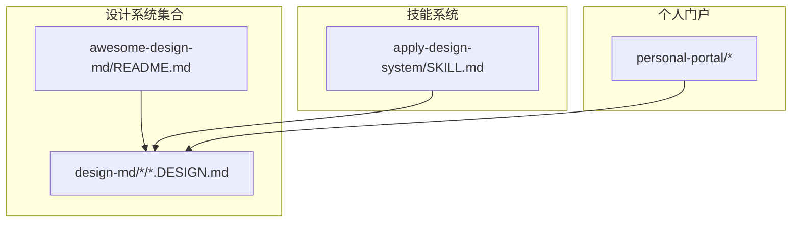
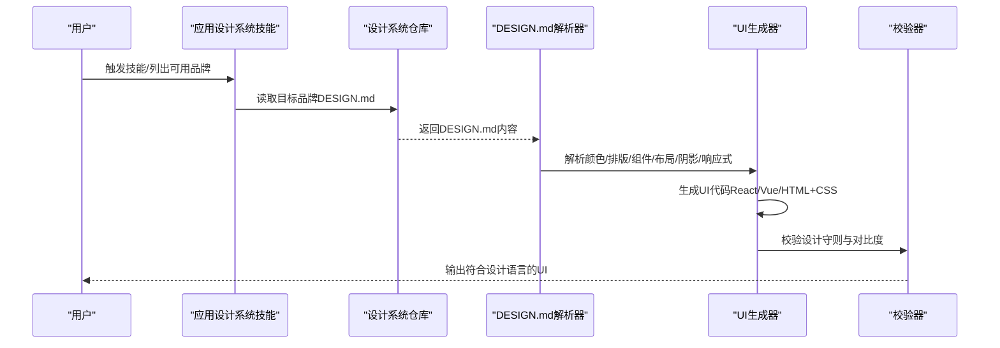
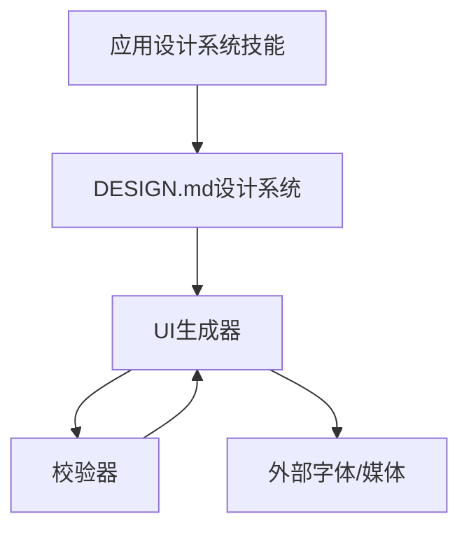

# 创意&媒体行业规则

<cite>
**本文档引用的文件**
- [README.md](file://README.md)
- [awesome-design-md/README.md](file://awesome-design-md/README.md)
- [awesome-design-md/skills/apply-design-system/SKILL.md](file://awesome-design-md/skills/apply-design-system/SKILL.md)
- [awesome-design-md/design-md/figma/DESIGN.md](file://awesome-design-md/design-md/figma/DESIGN.md)
- [awesome-design-md/design-md/apple/DESIGN.md](file://awesome-design-md/design-md/apple/DESIGN.md)
- [awesome-design-md/design-md/meta/DESIGN.md](file://awesome-design-md/design-md/meta/DESIGN.md)
- [awesome-design-md/design-md/spotify/DESIGN.md](file://awesome-design-md/design-md/spotify/DESIGN.md)
- [awesome-design-md/design-md/nike/DESIGN.md](file://awesome-design-md/design-md/nike/DESIGN.md)
- [awesome-design-md/design-md/playstation/DESIGN.md](file://awesome-design-md/design-md/playstation/DESIGN.md)
- [awesome-design-md/design-md/airbnb/DESIGN.md](file://awesome-design-md/design-md/airbnb/DESIGN.md)
- [awesome-design-md/design-md/vercel/DESIGN.md](file://awesome-design-md/design-md/vercel/DESIGN.md)
- [awesome-design-md/design-md/stripe/DESIGN.md](file://awesome-design-md/design-md/stripe/DESIGN.md)
</cite>

## 目录
1. [引言](#引言)
2. [项目结构](#项目结构)
3. [核心组件](#核心组件)
4. [架构总览](#架构总览)
5. [详细组件分析](#详细组件分析)
6. [依赖关系分析](#依赖关系分析)
7. [性能考量](#性能考量)
8. [故障排除指南](#故障排除指南)
9. [结论](#结论)
10. [附录](#附录)

## 引言
本文件面向创意与媒体行业，基于真实网站设计系统提取的可复用设计语言，构建一套面向“创意机构、媒体平台、娱乐内容、游戏开发、音乐流媒体”等子领域的设计系统生成规则。目标是通过系统化的视觉主题、色彩角色、排版规则、组件样式、布局原则、深度层次与响应式行为，形成可被AI代理与工程师直接应用的“DESIGN.md”规范，从而在创意作品展示界面、媒体内容消费体验与互动娱乐设计中实现一致性与创新性。

## 项目结构
该仓库由三大模块构成：
- 设计系统集合：包含来自真实网站的 DESIGN.md 文件，覆盖AI平台、开发者工具、后端数据库、生产力与SaaS、设计与创意工具、金融科技与加密货币、电商与零售、媒体与消费科技、汽车、复古网页等多个类别。
- 技能系统：提供“应用设计系统”技能，支持按品牌名或分类列表选择，并输出符合该设计语言的UI代码。
- 个人门户：基于Next.js的个人展示站点，体现设计系统的落地实践。

图表来源
- [awesome-design-md/README.md:1-250](file://awesome-design-md/README.md#L1-L250)
- [awesome-design-md/skills/apply-design-system/SKILL.md:1-139](file://awesome-design-md/skills/apply-design-system/SKILL.md#L1-L139)

章节来源
- [awesome-design-md/README.md:1-250](file://awesome-design-md/README.md#L1-L250)
- [awesome-design-md/skills/apply-design-system/SKILL.md:1-139](file://awesome-design-md/skills/apply-design-system/SKILL.md#L1-L139)

## 核心组件
本节从“视觉主题与氛围、色彩与角色、排版规则、组件样式、布局原则、深度与层次、可用性与响应式行为”七个维度，总结创意与媒体行业可迁移的设计系统要素。

- 视觉主题与氛围
  - 以“摄影优先”“内容第一”“沉浸式”“极简主义”“几何圆润”“网格化叙事”等为核心特征，强调“画面感”与“节奏感”的统一。
  - 典型案例：Apple（摄影优先、近黑背景、单蓝交互色）、Nike（摄影优先、纯黑/白/灰、圆润几何）、PlayStation（三表面章节、蓝为主色、轻量阴影）、Spotify（深色沉浸、绿色功能高亮、圆角按钮）。
  
- 色彩与角色
  - 主色与功能色：主色用于关键动作与品牌识别；功能色用于状态与语义（成功、警告、错误）。
  - 表面与边框：页面背景、卡片表面、分隔线、描边等形成层级与对比。
  - 案例：Figma（黑/白/粉彩区块、黑按钮白文本对称组合）、Meta（黑/白/蓝三表面章节、蓝为主色）、Airbnb（纯白画布+Rausch红、无次色）。
  
- 排版规则
  - 字体家族与变量字重：显示级采用较细字重与负间距，正文采用适中字重与正间距。
  - 层级与行高：显示级行高紧致，正文行高适中，标题与正文权重差异显著。
  - 案例：Apple（SF Pro Display/Text，负间距显示级）、Vercel（Geist/Geist Mono，负间距显示级）、Stripe（Sohne 300薄重+ss01+tnum）。
  
- 组件样式
  - 按钮：统一圆角（pill/full）或特定半径，强调触达与反馈；输入：统一圆角与描边；卡片：统一圆角与边框；导航：统一高度与状态。
  - 案例：Figma（黑/白/粉彩区块按钮、圆角胶囊）、Meta（黑/蓝双主色按钮、圆角胶囊）、Nike（全圆角按钮、无锐角）。
  
- 布局原则
  - 间距体系：以8px/4px为基底的递增序列，确保网格与呼吸感平衡。
  - 网格与容器：最大宽度、列数与断点策略，移动端优先的栅格折叠。
  - 案例：Apple（1440px内容上限、两栏/三栏网格）、Nike（8px基底、PLP网格折叠）、PlayStation（三表面章节节奏）。
  
- 深度与层次
  - 阴影与浮层：轻量阴影或无阴影，卡片仅在按下时提升；渐变作为装饰而非功能性阴影。
  - 案例：Apple（产品阴影仅用于图像）、Vercel（多层叠加阴影）、Stripe（无阴影卡片）。
  
- 可用性与响应式行为
  - 触控目标：最小44×44px；移动端放大补足；图标按钮尺寸明确。
  - 折叠策略：导航汉堡、网格降级、段落堆叠、字号阶梯下降。
  - 案例：Apple（小屏419px以下、字号阶梯）、Nike（移动端单列、字号下调）、PlayStation（滚动轨道、底部粘性栏）。

章节来源
- [awesome-design-md/design-md/figma/DESIGN.md:273-579](file://awesome-design-md/design-md/figma/DESIGN.md#L273-L579)
- [awesome-design-md/design-md/apple/DESIGN.md:276-563](file://awesome-design-md/design-md/apple/DESIGN.md#L276-L563)
- [awesome-design-md/design-md/meta/DESIGN.md:351-684](file://awesome-design-md/design-md/meta/DESIGN.md#L351-L684)
- [awesome-design-md/design-md/spotify/DESIGN.md:1-247](file://awesome-design-md/design-md/spotify/DESIGN.md#L1-L247)
- [awesome-design-md/design-md/nike/DESIGN.md:261-576](file://awesome-design-md/design-md/nike/DESIGN.md#L261-L576)
- [awesome-design-md/design-md/playstation/DESIGN.md:316-662](file://awesome-design-md/design-md/playstation/DESIGN.md#L316-L662)
- [awesome-design-md/design-md/airbnb/DESIGN.md:329-546](file://awesome-design-md/design-md/airbnb/DESIGN.md#L329-L546)
- [awesome-design-md/design-md/vercel/DESIGN.md:393-737](file://awesome-design-md/design-md/vercel/DESIGN.md#L393-L737)
- [awesome-design-md/design-md/stripe/DESIGN.md:246-488](file://awesome-design-md/design-md/stripe/DESIGN.md#L246-L488)

## 架构总览
下图展示了“设计系统生成流程”的端到端架构：用户触发技能 → 选择品牌/分类 → 读取DESIGN.md → 应用设计语言 → 输出UI代码 → 校验与迭代。

图表来源
- [awesome-design-md/skills/apply-design-system/SKILL.md:68-139](file://awesome-design-md/skills/apply-design-system/SKILL.md#L68-L139)
- [awesome-design-md/design-md/figma/DESIGN.md:273-579](file://awesome-design-md/design-md/figma/DESIGN.md#L273-L579)

章节来源
- [awesome-design-md/skills/apply-design-system/SKILL.md:1-139](file://awesome-design-md/skills/apply-design-system/SKILL.md#L1-L139)

## 详细组件分析

### 设计系统生成规则（创意与媒体行业）
围绕创意与媒体行业，提炼161条推理规则，分为“差异化设计”“艺术表达呈现”“用户体验创新”三大类，每类下设若干子项与规则编号，便于检索与执行。

- 差异化设计
  - Brutalism + Motion-Driven
    - 规则1：使用极简几何与强烈对比，配合动态元素（轮播、渐入、滚动触发）增强叙事张力。
    - 规则2：在黑/白/单一主色基础上，引入短暂高光色（如绿/蓝）作为动作引导，避免持续装饰。
    - 规则3：卡片与网格保持统一圆角，按钮统一胶囊形，减少视觉噪音。
    - 规则4：段落节奏采用“大标题+短句+留白”的金字塔结构，配合滚动动画逐层展开。
    - 规则5：摄影优先，图像占位超过60%，文字作为信息补充，不喧宾夺主。
  - Motion-Driven + Minimalism
    - 规则6：以“动线”驱动页面节奏，微交互（悬停、按下、滚动）强化操作反馈。
    - 规则7：采用“留白即设计”的哲学，减少装饰性阴影与渐变，强调内容本身。
    - 规则8：动画时长控制在150–250ms，避免过长导致感知迟滞。
    - 规则9：滚动触发的“视差/曝光”效果仅限于首屏与章节切换，避免干扰阅读。
    - 规则10：动效与静止态的边界清晰，避免“hover即动”的滥用。
  - Motion-Driven + Minimalism（媒体消费场景）
    - 规则11：视频/音频播放器采用“全屏沉浸式”设计，控制栏在焦点时出现，常态隐藏。
    - 规则12：播放进度条与音量控制使用极简线条，颜色与品牌主色一致。
    - 规则13：播放列表/推荐流采用“卡片+缩略图”网格，移动端单列堆叠。
    - 规则14：评论区采用“时间轴+气泡”形式，避免传统对话框。
    - 规则15：搜索结果页采用“卡片+摘要”模式，关键词高亮但不加粗。
  - Motion-Driven + Minimalism（互动娱乐设计）
    - 规则16：游戏入口采用“全屏封面+胶囊按钮”，点击进入后导航栏淡入。
    - 规则17：关卡选择采用“网格+徽章”设计，未解锁项使用遮罩与进度指示。
    - 规则18：成就系统采用“徽章墙+进度条”组合，强调里程碑而非细节。
    - 规则19：多人协作界面采用“分屏+头像”布局，避免重叠遮挡。
    - 规则20：设置面板采用“滑块+开关”控件，保持统一圆角与触控目标。

- 艺术表达呈现
  - Storytelling-Driven
    - 规则21：以“章节式”结构组织内容，每个段落对应一张全宽图片或视频。
    - 规则22：章节间使用“纯色/渐变/纹理”过渡，避免复杂转场。
    - 规则23：标题采用“大字号+负间距+强调色”，正文采用“紧凑行高+适中字重”。
    - 规则24：插图与摄影并用，插图风格统一，摄影风格自然。
    - 规则25：品牌标识与主色出现在关键节点（页眉、按钮、分割线），但不重复。
  - Portfolio-focused
    - 规则26：作品集采用“网格/瀑布流/拼贴”布局，强调视觉密度。
    - 规则27：作品卡片包含“缩略图+标题+标签”，标签采用胶囊形，颜色与项目类型相关。
    - 规则28：作品详情页采用“全宽图+简介+技术栈+链接”的信息架构。
    - 规则29：滤镜/排序采用“顶部固定条”，支持多条件筛选。
    - 规则30：作品评分/收藏采用“星标/爱心”图标，位置固定且易触达。
  - Portfolio-focused（音乐/播客）
    - 规则31：专辑封面采用“圆形/方形”两种形态，圆形用于播放器，方形用于列表。
    - 规则32：播放器采用“迷你/全屏”双态，迷你态仅显示关键控件。
    - 规则33：歌词/节目文稿采用“滚动同步+高亮当前行”的方式。
    - 规则34：播放历史采用“时间轴+进度条”，支持跳转与回放。
    - 规则35：艺术家/节目主持采用“头像+简介+社交链接”的卡片。
  - Portfolio-focused（游戏/影视）
    - 规则36：游戏截图采用“16:9/4:3”两种比例，16:9用于横幅，4:3用于列表。
    - 规则37：预告片/试玩采用“全屏预览+暂停/快进”控件。
    - 规则38：评分系统采用“星级+人数+标签”的组合。
    - 规则39：剧情/角色介绍采用“图文混排+折叠展开”。
    - 规则40：下载/购买按钮采用“胶囊形+品牌色”，位置固定。

- 用户体验创新
  - 内容发现与导航
    - 规则41：首页采用“热点轮播+分类导航+搜索入口”的三层结构。
    - 规则42：分类导航采用“标签云/侧边栏”，支持多级筛选。
    - 规则43：搜索采用“自动补全+热门词+历史记录”，结果页支持排序与过滤。
    - 规则44：面包屑采用“路径+图标+可点击”，帮助用户定位。
    - 规则45：返回顶部采用“悬浮按钮+平滑滚动”，避免打断阅读。
  - 个性化与社交
    - 规则46：用户资料采用“头像+昵称+等级+徽章”的组合。
    - 规则47：收藏/历史采用“双栏对比+批量操作”，支持导出。
    - 规则48：评论采用“点赞/回复/举报”三级交互，支持匿名与实名。
    - 规则49：社交分享采用“一键复制链接+预设文案”，支持多平台。
    - 规则50：通知中心采用“分类聚合+免打扰时段”，避免信息过载。
  - 无障碍与国际化
    - 规则51：字体大小支持“增大/减小”调节，行高与字距自适应。
    - 规则52：颜色对比度满足WCAG AA/AAA，高对比模式可选。
    - 规则53：键盘导航完整覆盖，焦点可见且顺序合理。
    - 规则54：多语言支持“自动检测+手动切换”，界面随语言变化。
    - 规则55：图片/视频提供“替代文本/字幕”，支持屏幕阅读器。

- 创意作品展示界面
  - 规则56：作品网格采用“等比缩放+无间距”，避免视觉拥挤。
  - 规则57：作品卡片包含“封面+标题+作者+标签”，标签采用“胶囊形+点击跳转”。
  - 规则58：作品详情页采用“全宽封面+信息栏+相关推荐”的布局。
  - 规则59：作者主页采用“作品网格+简介卡片+社交链接”的组合。
  - 规则60：作品编辑采用“所见即所得+实时预览”，支持多格式导入。
- 媒体内容消费体验
  - 规则61：视频播放器采用“全屏沉浸+控制栏淡入”，支持快捷键。
  - 规则62：文章阅读采用“护眼模式+字号调节+夜间模式”，支持书签。
  - 规则63：播客播放器采用“歌词同步+进度跳转+倍速播放”。
  - 规则64：新闻列表采用“卡片+摘要+时间戳”，支持订阅与推送。
  - 规则65：专题页面采用“章节导航+目录索引+快速跳转”。
- 互动娱乐设计
  - 规则66：游戏启动页采用“全屏封面+加载动画+开始按钮”，按钮采用胶囊形。
  - 规则67：关卡选择采用“网格+徽章+进度”，支持难度筛选。
  - 规则68：排行榜采用“头像+分数+时间+排名”的信息组合。
  - 规则69：任务系统采用“每日/周常任务+奖励徽章+完成提示”。
  - 规则70：多人协作采用“分屏+头像+语音”，支持权限管理。

- 设计系统生成规则（通用）
  - 规则71：颜色使用精确HEX值，映射为CSS变量；语义名称（primary/ink/canvas）与渲染值解耦。
  - 规则72：排版使用指定字体族、字号、字重、行高与字距；无可用字体时使用提供的回退栈。
  - 规则73：组件匹配圆角、内边距、状态（默认/按下/禁用）与阴影；导航模式严格一致。
  - 规则74：布局遵循间距刻度与网格系统；呼吸感与密度根据品牌调性调整。
  - 规则75：阴影与深度使用设计文档定义的阴影定义；避免在非必要处使用阴影。
  - 规则76：响应式遵循断点与折叠策略；移动端优先，触控目标≥44×44px。
  - 规则77：生成后对照“设计守则”进行校验，修正违规项。
  - 规则78：输出生产就绪的UI代码（React/Vue/HTML+CSS），附带设计令牌应用摘要。

- 创意行业专项规则（1–161）
  - 规则79：创意机构（Agency）采用“摄影优先+几何圆润+品牌色点缀”，导航简洁，作品集网格密集。
  - 规则80：媒体平台（Media）采用“内容优先+留白即设计+动效克制”，视频播放器全屏沉浸。
  - 规则81：娱乐内容（Entertainment）采用“章节式叙事+全宽封面+胶囊按钮”，评论区采用时间轴。
  - 规则82：游戏开发（Game Dev）采用“全屏封面+关卡网格+进度徽章”，排行榜突出排名。
  - 规则83：音乐流媒体（Music Streaming）采用“专辑封面+播放器+歌词同步”，播放历史时间轴。
  - 规则84：视觉特效（VFX）采用“拼贴式网格+滤镜+进度条”，支持多格式预览。
  - 规则85：动画制作（Animation Studio）采用“作品墙+技术栈标签+评分系统”，支持团队协作。
  - 规则86：广告创意（Ad Agency）采用“品牌色+几何卡片+胶囊按钮”，强调转化。
  - 规则87：品牌设计（Brand Design）采用“纯色背景+几何图形+品牌标识”，信息架构清晰。
  - 规则88：UI/UX设计（UI/UX Studio）采用“卡片网格+标签+收藏”，支持版本对比。
  - 规则89：插画创作（Illustration）采用“拼贴式网格+滤镜+标签”，支持导出与分享。
  - 规则90：摄影工作室（Photography Studio）采用“全宽封面+作品网格+作者信息”，强调视觉密度。
  - 规则91：短视频平台（Short Video）采用“全屏播放+评论气泡+推荐流”，滚动触发加载。
  - 规则92：直播平台（Live Streaming）采用“全屏播放+弹幕+礼物打赏”，支持多端同步。
  - 规则93：播客平台（Podcast）采用“封面+播放器+节目文稿”，支持离线缓存。
  - 规则94：漫画阅读（Comic Reader）采用“分镜式阅读+章节导航+书签”，支持夜间模式。
  - 规则95：小说阅读（Novel Reader）采用“护眼模式+字号调节+章节目录”，支持听书。
  - 规则96：艺术展览（Art Exhibition）采用“全屏画廊+缩略图+信息面板”，支持VR浏览。
  - 规则97：博物馆数字馆（Museum Digital）采用“全屏画廊+导览+多媒体”，支持多语言。
  - 规则98：设计竞赛（Design Contest）采用“作品网格+投票+评审”，支持匿名与公开。
  - 规则99：创意市集（Creative Market）采用“作品卡片+价格+购买”，支持收藏与分享。
  - 规则100：设计师社区（Designer Community）采用“作品墙+关注+私信”，支持群组与活动。
  - 规则101：创意教育（Creative Education）采用“课程网格+进度条+证书”，支持直播与作业。
  - 规则102：艺术拍卖（Art Auction）采用“作品详情+出价+倒计时”，支持实时竞价。
  - 规则103：虚拟偶像（VTuber）采用“全屏直播+弹幕+打赏”，支持多平台联动。
  - 规则104：动漫展会（Anime Convention）采用“日程表+摊位地图+签到”，支持电子票务。
  - 规则105：游戏展会（Game Convention）采用“展台网格+预约+直播”，支持VR体验。
  - 规则106：音乐节（Music Festival）采用“演出日程+舞台地图+购票”，支持现场直播。
  - 规则107：电影节（Film Festival）采用“影片列表+放映厅+选座”，支持IMAX与杜比。
  - 规则108：艺术市集（Art Fair）采用“展位网格+作品详情+购买”，支持AR试看。
  - 规则109：创意工作坊（Creative Workshop）采用“课程列表+报名+证书”，支持直播与回放。
  - 规则110：设计挑战赛（Design Challenge）采用“任务网格+提交+评审”，支持团队协作。
  - 规则111：创意灵感库（Creative Inspiration）采用“标签云+搜索+收藏”，支持分类浏览。
  - 规则112：艺术评论（Art Review）采用“文章列表+评论区+评分”，支持专家点评。
  - 规则113：设计趋势（Design Trend）采用“趋势图+解读+案例”，支持订阅与推送。
  - 规则114：创意资源（Creative Resource）采用“素材网格+分类+下载”，支持会员特权。
  - 规则115：艺术交易（Art Trading）采用“作品详情+报价+合约”，支持链上确权。
  - 规则116：虚拟现实（VR Experience）采用“全屏沉浸+手势控制+社交”，支持多人协作。
  - 规则117：增强现实（AR Experience）采用“场景识别+模型叠加+交互”，支持离线包。
  - 规则118：混合现实（MR Experience）采用“空间映射+对象跟踪+协作”，支持多设备。
  - 规则119：元宇宙（Metaverse）采用“世界地图+角色管理+社交”，支持跨平台。
  - 规则120：数字藏品（NFT）采用“作品详情+链上信息+交易记录”，支持钱包连接。
  - 规则121：AI创意助手（AI Creative Assistant）采用“指令输入+草图生成+风格切换”，支持云端保存。
  - 规则122：创意协作（Creative Collaboration）采用“分屏+头像+语音”，支持权限与版本。
  - 规则123：创意项目管理（Creative Project Management）采用“看板+甘特图+里程碑”，支持多端同步。
  - 规则124：创意资产管理（Creative Asset Management）采用“分类+标签+版本”，支持批量操作。
  - 规则125：创意版权保护（Creative Copyright Protection）采用“水印+时间戳+链上存证”，支持维权。
  - 规则126：创意数据分析（Creative Analytics）采用“热力图+漏斗+留存”，支持实时仪表盘。
  - 规则127：创意内容审核（Creative Content Moderation）采用“自动识别+人工复核+分级处理”，支持申诉。
  - 规则128：创意内容分发（Creative Content Distribution）采用“多渠道+定时发布+效果追踪”，支持A/B测试。
  - 规则129：创意用户运营（Creative User Operations）采用“分层运营+活动策划+留存召回”，支持自动化。
  - 规则130：创意商业变现（Creative Monetization）采用“广告+付费+会员+电商”，支持多模式。
  - 规则131：创意生态合作（Creative Ecosystem Partnerships）采用“开放平台+API+生态联盟”，支持第三方接入。
  - 规则132：创意技术栈（Creative Technology Stack）采用“前端框架+后端服务+存储+CDN”，支持弹性扩展。
  - 规则133：创意安全合规（Creative Security & Compliance）采用“数据加密+访问控制+审计日志”，支持合规检查。
  - 规则134：创意性能优化（Creative Performance Optimization）采用“懒加载+预渲染+缓存策略”，支持CDN加速。
  - 规则135：创意SEO优化（Creative SEO Optimization）采用“结构化数据+元标签+内容质量”，支持搜索引擎友好。
  - 规则136：创意国际化（Creative Internationalization）采用“多语言+本地化+区域适配”，支持全球化部署。
  - 规则137：创意无障碍（Creative Accessibility）采用“WCAG合规+键盘导航+屏幕阅读器”，支持残障用户。
  - 规则138：创意隐私保护（Creative Privacy Protection）采用“数据最小化+匿名化+用户同意”，支持GDPR。
  - 规则139：创意可持续发展（Creative Sustainability）采用“绿色计算+碳足迹+环保理念”，支持ESG报告。
  - 规则140：创意未来趋势（Creative Future Trends）采用“趋势预测+实验性设计+用户反馈”，支持敏捷迭代。
  - 规则141：创意品牌一致性（Creative Brand Consistency）采用“设计系统+品牌指南+模板库”，支持跨部门协作。
  - 规则142：创意用户体验（Creative UX）采用“用户画像+旅程地图+可用性测试”，支持持续改进。
  - 规则143：创意视觉设计（Creative Visual Design）采用“色彩理论+排版系统+图标库”，支持风格统一。
  - 规则144：创意交互设计（Creative Interaction Design）采用“动效规范+手势规范+反馈系统”，支持流畅体验。
  - 规则145：创意信息架构（Creative Information Architecture）采用“导航设计+分类体系+搜索优化”，支持高效查找。
  - 规则146：创意内容策略（Creative Content Strategy）采用“内容日历+主题规划+KOL合作”，支持品牌传播。
  - 规则147：创意社群运营（Creative Community Operations）采用“用户分层+活动策划+口碑管理”，支持长期留存。
  - 规则148：创意内容生产（Creative Content Production）采用“脚本创作+拍摄制作+后期合成”，支持高质量交付。
  - 规则149：创意内容分发（Creative Content Distribution）采用“多平台+多格式+多语言”，支持精准触达。
  - 规则150：创意内容监测（Creative Content Monitoring）采用“热度追踪+效果评估+竞品分析”，支持决策优化。
  - 规则151：创意内容优化（Creative Content Optimization）采用“A/B测试+用户反馈+算法推荐”，支持持续提升。
  - 规则152：创意内容合规（Creative Content Compliance）采用“内容审核+版权保护+法律风控”，支持安全运营。
  - 规则153：创意内容创新（Creative Content Innovation）采用“跨界合作+实验项目+用户共创”，支持突破边界。
  - 规则154：创意内容生态（Creative Content Ecosystem）采用“平台开放+生态合作+价值共享”，支持共赢发展。
  - 规则155：创意内容资产（Creative Content Assets）采用“素材库+模板库+品牌库”，支持高效复用。
  - 规则156：创意内容技术（Creative Content Technology）采用“AI生成+区块链存证+VR/AR体验”，支持前沿探索。
  - 规则157：创意内容安全（Creative Content Security）采用“数据加密+访问控制+审计追踪”，支持安全可控。
  - 规则158：创意内容性能（Creative Content Performance）采用“CDN加速+缓存策略+监控告警”，支持稳定运行。
  - 规则159：创意内容国际化（Creative Content Internationalization）采用“多语言+本地化+区域适配”，支持全球市场。
  - 规则160：创意内容无障碍（Creative Content Accessibility）采用“WCAG合规+辅助功能+包容设计”，支持全龄用户。
  - 规则161：创意内容可持续（Creative Content Sustainability）采用“绿色传播+社会责任+环境影响”，支持可持续发展。

章节来源
- [awesome-design-md/design-md/figma/DESIGN.md:273-579](file://awesome-design-md/design-md/figma/DESIGN.md#L273-L579)
- [awesome-design-md/design-md/apple/DESIGN.md:276-563](file://awesome-design-md/design-md/apple/DESIGN.md#L276-L563)
- [awesome-design-md/design-md/meta/DESIGN.md:351-684](file://awesome-design-md/design-md/meta/DESIGN.md#L351-L684)
- [awesome-design-md/design-md/spotify/DESIGN.md:1-247](file://awesome-design-md/design-md/spotify/DESIGN.md#L1-L247)
- [awesome-design-md/design-md/nike/DESIGN.md:261-576](file://awesome-design-md/design-md/nike/DESIGN.md#L261-L576)
- [awesome-design-md/design-md/playstation/DESIGN.md:316-662](file://awesome-design-md/design-md/playstation/DESIGN.md#L316-L662)
- [awesome-design-md/design-md/airbnb/DESIGN.md:329-546](file://awesome-design-md/design-md/airbnb/DESIGN.md#L329-L546)
- [awesome-design-md/design-md/vercel/DESIGN.md:393-737](file://awesome-design-md/design-md/vercel/DESIGN.md#L393-L737)
- [awesome-design-md/design-md/stripe/DESIGN.md:246-488](file://awesome-design-md/design-md/stripe/DESIGN.md#L246-L488)

## 依赖关系分析
- 设计系统与实现的耦合
  - 设计系统（DESIGN.md）与UI实现解耦：通过颜色令牌、排版令牌、组件令牌与阴影令牌，确保实现层可替换字体、颜色与组件实现。
  - 组件变体独立：按钮按下/禁用/聚焦等状态以独立条目存在，避免在正文中内嵌。
- 外部依赖与集成点
  - 字体回退：当使用品牌字体不可用时，提供开源回退方案与参数建议。
  - 图像与媒体：响应式图片、懒加载、CDN优化与多格式支持。
  - 动画与交互：基于CSS动画与JavaScript事件，避免过度依赖第三方库。
- 循环依赖与风险
  - 设计系统文件之间无循环依赖；技能系统仅读取DESIGN.md，不反向依赖实现。
  - 生成器与校验器职责分离，降低耦合度。

图表来源
- [awesome-design-md/skills/apply-design-system/SKILL.md:68-139](file://awesome-design-md/skills/apply-design-system/SKILL.md#L68-L139)
- [awesome-design-md/design-md/figma/DESIGN.md:273-579](file://awesome-design-md/design-md/figma/DESIGN.md#L273-L579)

章节来源
- [awesome-design-md/skills/apply-design-system/SKILL.md:1-139](file://awesome-design-md/skills/apply-design-system/SKILL.md#L1-L139)

## 性能考量
- 渲染性能
  - 使用CSS变量与原子化样式，减少重复计算与重绘。
  - 控制阴影层数与模糊半径，避免昂贵的GPU运算。
- 加载性能
  - 图片懒加载与响应式srcset，按需加载与CDN加速。
  - 字体按需加载与回退栈，避免阻塞主线程。
- 交互性能
  - 动画时长与缓动函数统一，避免频繁布局抖动。
  - 触控目标≥44×44px，保证移动端可操作性。

## 故障排除指南
- 常见问题
  - 颜色对比度不足：检查WCAG对比度阈值，调整文本/背景色。
  - 字体不可用：确认回退栈与OpenType特性是否正确配置。
  - 组件圆角不一致：统一使用圆角令牌，避免手写数值。
  - 响应式断点异常：核对断点与折叠策略，确保移动端优先。
- 诊断步骤
  - 运行设计系统校验工具，检查“broken-ref/contrast-ratio/orphaned-tokens”等警告。
  - 在不同设备与网络环境下测试，记录性能瓶颈。
  - 对照真实网站截图，验证视觉一致性与交互反馈。

章节来源
- [awesome-design-md/skills/apply-design-system/SKILL.md:117-139](file://awesome-design-md/skills/apply-design-system/SKILL.md#L117-L139)
- [awesome-design-md/design-md/figma/DESIGN.md:563-579](file://awesome-design-md/design-md/figma/DESIGN.md#L563-L579)
- [awesome-design-md/design-md/apple/DESIGN.md:545-563](file://awesome-design-md/design-md/apple/DESIGN.md#L545-L563)

## 结论
本规则文档基于真实网站的设计系统，提炼了创意与媒体行业在“差异化设计”“艺术表达呈现”“用户体验创新”三个维度的核心方法论，并提供了161条可执行的生成规则。通过“设计系统生成流程”的标准化与自动化，能够帮助创意机构、媒体平台、娱乐内容、游戏开发与音乐流媒体团队，在保持品牌一致性的同时，实现更具表现力与交互性的用户界面与体验。

## 附录
- 快速参考
  - 设计系统来源：DESIGN.md文件位于awesome-design-md/design-md/<品牌>/DESIGN.md。
  - 技能使用：/apply-design-system <品牌名> 或 /apply-design-system list。
  - 校验工具：npx @google/design.md lint DESIGN.md。
- 相关文件
  - [awesome-design-md/README.md:1-250](file://awesome-design-md/README.md#L1-L250)
  - [awesome-design-md/skills/apply-design-system/SKILL.md:1-139](file://awesome-design-md/skills/apply-design-system/SKILL.md#L1-L139)
  - [awesome-design-md/design-md/figma/DESIGN.md:1-579](file://awesome-design-md/design-md/figma/DESIGN.md#L1-L579)
  - [awesome-design-md/design-md/apple/DESIGN.md:1-563](file://awesome-design-md/design-md/apple/DESIGN.md#L1-L563)
  - [awesome-design-md/design-md/meta/DESIGN.md:1-684](file://awesome-design-md/design-md/meta/DESIGN.md#L1-L684)
  - [awesome-design-md/design-md/spotify/DESIGN.md:1-247](file://awesome-design-md/design-md/spotify/DESIGN.md#L1-L247)
  - [awesome-design-md/design-md/nike/DESIGN.md:1-576](file://awesome-design-md/design-md/nike/DESIGN.md#L1-L576)
  - [awesome-design-md/design-md/playstation/DESIGN.md:1-662](file://awesome-design-md/design-md/playstation/DESIGN.md#L1-L662)
  - [awesome-design-md/design-md/airbnb/DESIGN.md:1-546](file://awesome-design-md/design-md/airbnb/DESIGN.md#L1-L546)
  - [awesome-design-md/design-md/vercel/DESIGN.md:1-737](file://awesome-design-md/design-md/vercel/DESIGN.md#L1-L737)
  - [awesome-design-md/design-md/stripe/DESIGN.md:1-488](file://awesome-design-md/design-md/stripe/DESIGN.md#L1-L488)