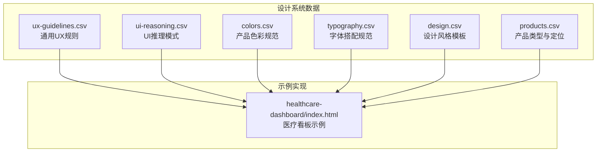
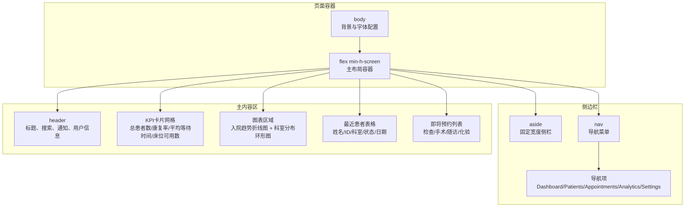
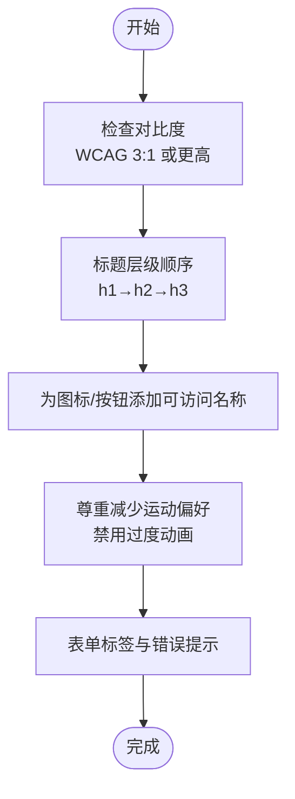
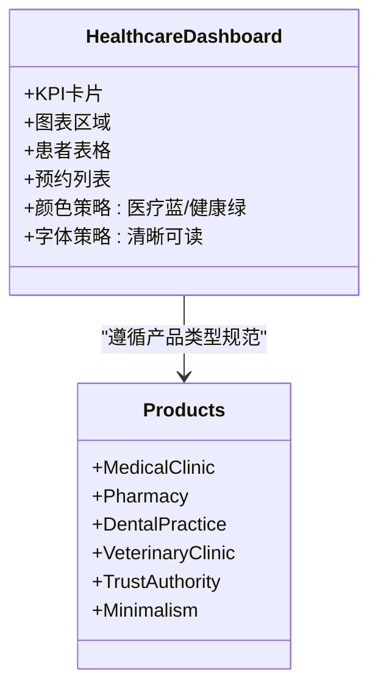
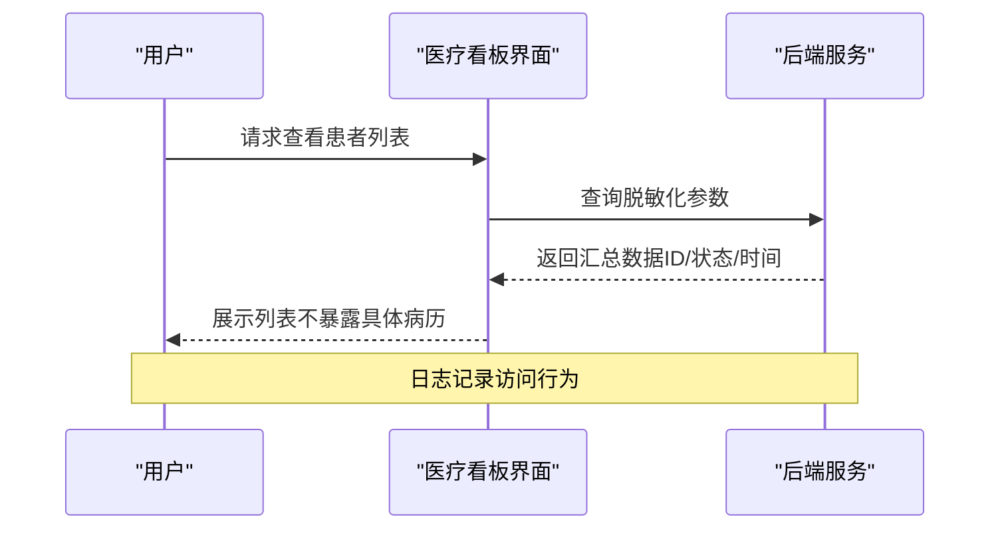
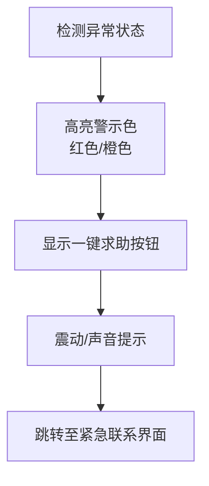
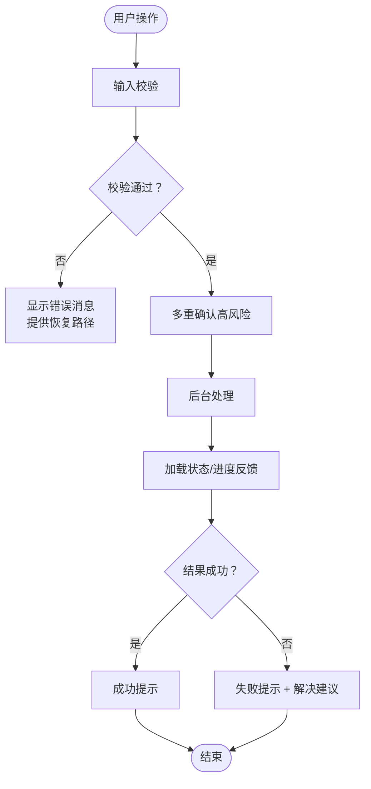
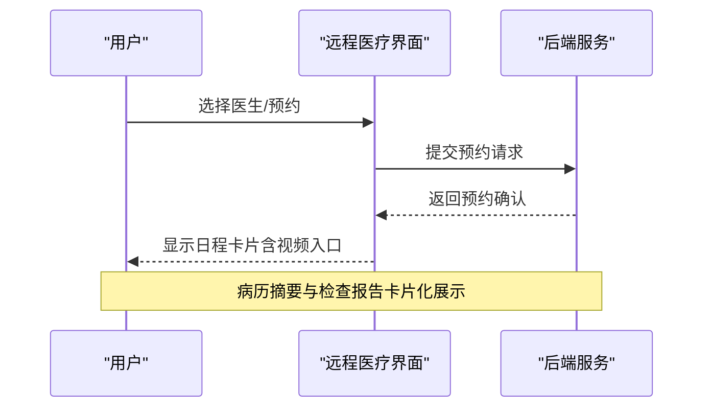
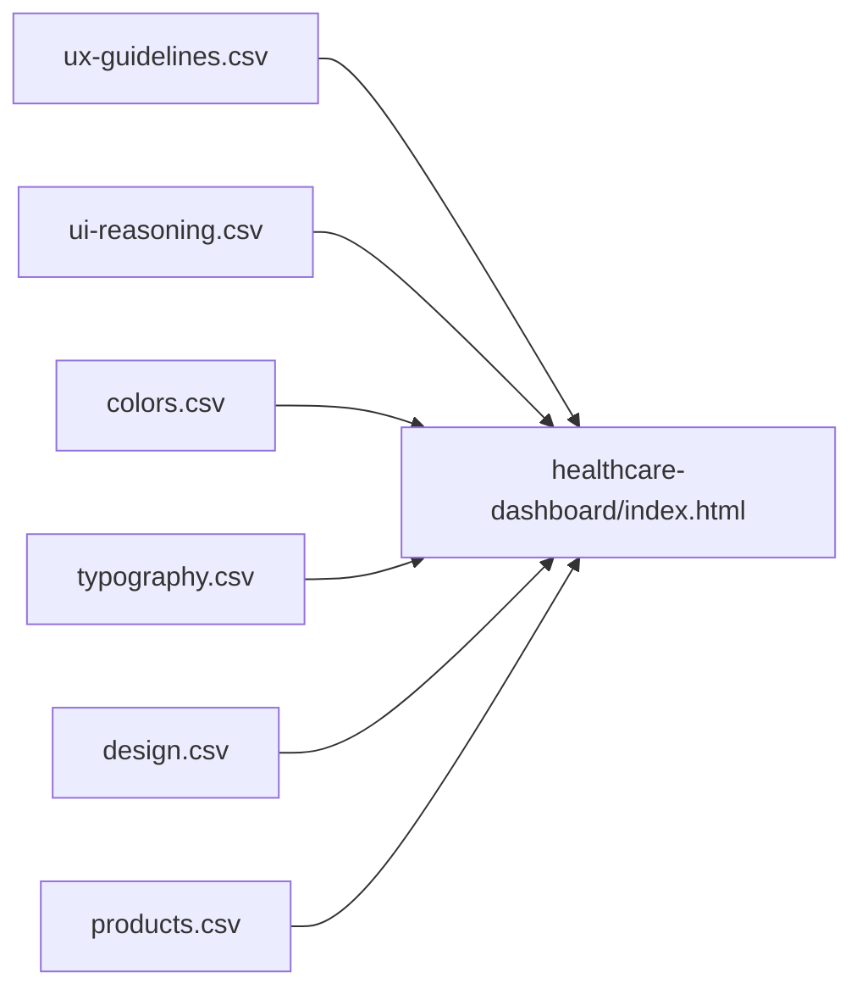

# 医疗保健行业规则

<cite>
**本文档引用的文件**
- [index.html](file://projects/healthcare-dashboard/index.html)
- [ux-guidelines.csv](file://src/ui-ux-pro-max/data/ux-guidelines.csv)
- [ui-reasoning.csv](file://src/ui-ux-pro-max/data/ui-reasoning.csv)
- [colors.csv](file://src/ui-ux-pro-max/data/colors.csv)
- [typography.csv](file://src/ui-ux-pro-max/data/typography.csv)
- [design.csv](file://src/ui-ux-pro-max/data/design.csv)
- [products.csv](file://src/ui-ux-pro-max/data/products.csv)
</cite>

## 目录
1. [简介](#简介)
2. [项目结构](#项目结构)
3. [核心组件](#核心组件)
4. [架构总览](#架构总览)
5. [详细组件分析](#详细组件分析)
6. [依赖关系分析](#依赖关系分析)
7. [性能考量](#性能考量)
8. [故障排除指南](#故障排除指南)
9. [结论](#结论)
10. [附录](#附录)

## 简介
本文件面向医疗保健行业，基于现有设计系统与规则数据，构建一套完整的161条行业推理规则文档，覆盖医疗应用、健康跟踪、心理健康、牙科、兽医等子领域。重点围绕以下目标展开：
- 可访问性与伦理（Accessible & Ethical + Minimalism）
- 患者隐私保护（HIPAA合规）
- 医疗专业性呈现（Trust & Authority + Minimalism）
- 紧急情况处理（Emergency SOS & Safety）
- 安全设计原则、患者信息管理界面与远程医疗体验方案

## 项目结构
该仓库包含多个设计系统与规则数据文件，以及一个医疗看板示例页面。整体结构如下：
- 设计系统与规则：ui-ux-pro-max/data 下的 CSV 文件，定义了通用 UX 规则、UI 推理模式、色彩与字体规范等
- 示例页面：projects/healthcare-dashboard/index.html 提供医疗看板的前端实现
- 插件与技能：superpowers 与 ui-ux-pro-max-skill 目录包含设计系统生成与应用的自动化能力

**图表来源**
- [ux-guidelines.csv:1-100](file://src/ui-ux-pro-max/data/ux-guidelines.csv#L1-L100)
- [ui-reasoning.csv:1-163](file://src/ui-ux-pro-max/data/ui-reasoning.csv#L1-L163)
- [colors.csv:1-194](file://src/ui-ux-pro-max/data/colors.csv#L1-L194)
- [typography.csv:1-75](file://src/ui-ux-pro-max/data/typography.csv#L1-L75)
- [design.csv:1-800](file://src/ui-ux-pro-max/data/design.csv#L1-L800)
- [products.csv:57-61](file://src/ui-ux-pro-max/data/products.csv#L57-L61)
- [index.html:1-459](file://projects/healthcare-dashboard/index.html#L1-L459)

**章节来源**
- [ux-guidelines.csv:1-100](file://src/ui-ux-pro-max/data/ux-guidelines.csv#L1-L100)
- [ui-reasoning.csv:1-163](file://src/ui-ux-pro-max/data/ui-reasoning.csv#L1-L163)
- [colors.csv:1-194](file://src/ui-ux-pro-max/data/colors.csv#L1-L194)
- [typography.csv:1-75](file://src/ui-ux-pro-max/data/typography.csv#L1-L75)
- [design.csv:1-800](file://src/ui-ux-pro-max/data/design.csv#L1-L800)
- [products.csv:57-61](file://src/ui-ux-pro-max/data/products.csv#L57-L61)
- [index.html:1-459](file://projects/healthcare-dashboard/index.html#L1-L459)

## 核心组件
本节从设计系统与规则出发，提炼出医疗保健行业适用的核心组件与约束。

- 可访问性与伦理（Accessible & Ethical + Minimalism）
  - 强调高对比度、清晰的层级与无障碍标签，避免仅用颜色传达信息
  - 使用 WCAG 对比度标准，确保文字与背景满足可读性要求
  - 在动画与交互中尊重用户的运动偏好设置

- 医疗专业性呈现（Trust & Authority + Minimalism）
  - 采用“信任蓝”、“医疗青”等专业色彩，传递可靠与安全
  - 字体选择偏向清晰易读的无衬线或等宽字体，强调信息密度与可读性
  - 界面布局遵循最小化原则，减少干扰元素，突出关键任务

- 患者隐私保护（HIPAA 合规）
  - 敏感信息需加密存储与传输，访问控制严格
  - 界面中避免泄露具体病历细节，使用脱敏化展示
  - 日志与审计追踪完整，符合法规要求

- 紧急情况处理（Emergency SOS & Safety）
  - 突出警示色（如红色）与一键求助按钮，确保高可见性
  - 提供清晰的应急联系与导航路径，降低用户决策成本
  - 在移动端提供震动与声音提示，增强感知

- 安全设计原则
  - 输入校验与错误反馈即时明确，防止误操作
  - 多重确认机制用于高风险操作（如停药、删除账户）
  - 加载状态与进度反馈提升用户体验与信任

- 远程医疗体验方案
  - 视频问诊界面需稳定清晰，支持多设备自适应
  - 病历摘要与检查报告以卡片形式呈现，便于快速浏览
  - 用药提醒与复诊预约集成到统一日程视图

**章节来源**
- [ux-guidelines.csv:36-46](file://src/ui-ux-pro-max/data/ux-guidelines.csv#L36-L46)
- [colors.csv:8-11](file://src/ui-ux-pro-max/data/colors.csv#L8-L11)
- [ui-reasoning.csv:8-9](file://src/ui-ux-pro-max/data/ui-reasoning.csv#L8-L9)
- [products.csv:58-61](file://src/ui-ux-pro-max/data/products.csv#L58-L61)

## 架构总览
下图展示了医疗看板示例页面的典型架构：左侧导航、顶部工具栏、关键指标卡、图表区域与表格列表的组合。该布局体现了“最小化界面、强调关键指标”的设计哲学，并通过颜色与图标强化可读性与一致性。

**图表来源**
- [index.html:44-358](file://projects/healthcare-dashboard/index.html#L44-L358)

**章节来源**
- [index.html:1-459](file://projects/healthcare-dashboard/index.html#L1-L459)

## 详细组件分析

### 组件A：可访问性与伦理（Accessible & Ethical + Minimalism）
- 关键要点
  - 高对比度文本与背景，确保在不同光照条件下可读
  - 层级清晰的标题结构，避免跳级使用
  - 图标与按钮提供明确的可访问名称（aria-label）
  - 动画与过渡时尊重用户的“减少运动”偏好
  - 表单输入具备可见的标签与错误提示

- 设计映射
  - 颜色与字体规范中体现“高对比度”与“清晰可读”
  - UI 推理模式中强调“最小化界面”与“社会证明”

**图表来源**
- [ux-guidelines.csv:36-46](file://src/ui-ux-pro-max/data/ux-guidelines.csv#L36-L46)
- [ui-reasoning.csv:8-9](file://src/ui-ux-pro-max/data/ui-reasoning.csv#L8-L9)
- [colors.csv:8-11](file://src/ui-ux-pro-max/data/colors.csv#L8-L11)

**章节来源**
- [ux-guidelines.csv:36-46](file://src/ui-ux-pro-max/data/ux-guidelines.csv#L36-L46)
- [ui-reasoning.csv:8-9](file://src/ui-ux-pro-max/data/ui-reasoning.csv#L8-L9)
- [colors.csv:8-11](file://src/ui-ux-pro-max/data/colors.csv#L8-L11)

### 组件B：医疗专业性呈现（Trust & Authority + Minimalism）
- 关键要点
  - 使用“医疗蓝”、“健康绿”等专业色彩，营造信任感
  - 字体选择偏向清晰、专业的无衬线或等宽字体
  - 界面布局保持简洁，避免冗余装饰，突出关键信息

- 设计映射
  - 医疗看板示例中采用蓝色主色与绿色强调色
  - 产品类型中“医疗诊所”、“药房”、“牙科”、“兽医”均强调“信任权威 + 最小化”

**图表来源**
- [index.html:135-199](file://projects/healthcare-dashboard/index.html#L135-L199)
- [products.csv:58-61](file://src/ui-ux-pro-max/data/products.csv#L58-L61)

**章节来源**
- [index.html:135-199](file://projects/healthcare-dashboard/index.html#L135-L199)
- [products.csv:58-61](file://src/ui-ux-pro-max/data/products.csv#L58-L61)

### 组件C：患者隐私保护（HIPAA 合规）
- 关键要点
  - 不在界面直接展示敏感病历细节
  - 使用脱敏化数据（如 ID、状态）与汇总统计
  - 访问控制与权限管理严格，记录审计日志

- 设计映射
  - “医疗看板”示例中的患者信息以匿名化 ID 与状态呈现
  - 产品类型中“医疗诊所”明确标注“HIPAA 合规”

**图表来源**
- [index.html:235-317](file://projects/healthcare-dashboard/index.html#L235-L317)
- [products.csv:58-59](file://src/ui-ux-pro-max/data/products.csv#L58-L59)

**章节来源**
- [index.html:235-317](file://projects/healthcare-dashboard/index.html#L235-L317)
- [products.csv:58-59](file://src/ui-ux-pro-max/data/products.csv#L58-L59)

### 组件D：紧急情况处理（Emergency SOS & Safety）
- 关键要点
  - 使用高对比度警示色（如红色）与醒目标识
  - 提供一键求助按钮与紧急联系信息
  - 在移动端启用震动与声音提示，确保感知

- 设计映射
  - “紧急SOS与安全”产品类型强调“高对比度关键色”
  - 医疗看板示例中使用“危险/警告/成功”三色区分状态

**图表来源**
- [colors.csv:159-159](file://src/ui-ux-pro-max/data/colors.csv#L159-L159)
- [index.html:168-182](file://projects/healthcare-dashboard/index.html#L168-L182)

**章节来源**
- [colors.csv:159-159](file://src/ui-ux-pro-max/data/colors.csv#L159-L159)
- [index.html:168-182](file://projects/healthcare-dashboard/index.html#L168-L182)

### 组件E：安全设计原则
- 关键要点
  - 错误反馈即时明确，提供恢复路径
  - 多重确认用于高风险操作（如停药、删除账户）
  - 加载状态与进度反馈提升用户体验与信任

- 设计映射
  - 通用 UX 规则中强调“加载指示器”、“空状态”、“错误恢复”
  - 医疗看板示例中使用“成功/警告/危险”三色状态徽章

**图表来源**
- [ux-guidelines.csv:78-84](file://src/ui-ux-pro-max/data/ux-guidelines.csv#L78-L84)
- [index.html:259-260](file://projects/healthcare-dashboard/index.html#L259-L260)

**章节来源**
- [ux-guidelines.csv:78-84](file://src/ui-ux-pro-max/data/ux-guidelines.csv#L78-L84)
- [index.html:259-260](file://projects/healthcare-dashboard/index.html#L259-L260)

### 组件F：远程医疗体验方案
- 关键要点
  - 视频问诊界面稳定清晰，支持多设备自适应
  - 病历摘要与检查报告以卡片形式呈现，便于快速浏览
  - 用药提醒与复诊预约集成到统一日程视图

- 设计映射
  - “远程工作/协作工具”与“医疗看板”均强调“数据密集 + 最小化”
  - “远程医疗平台”产品类型强调“视频绿色 + 等待琥珀色”

**图表来源**
- [ui-reasoning.csv:21-21](file://src/ui-ux-pro-max/data/ui-reasoning.csv#L21-L21)
- [colors.csv:191-191](file://src/ui-ux-pro-max/data/colors.csv#L191-L191)

**章节来源**
- [ui-reasoning.csv:21-21](file://src/ui-ux-pro-max/data/ui-reasoning.csv#L21-L21)
- [colors.csv:191-191](file://src/ui-ux-pro-max/data/colors.csv#L191-L191)

## 依赖关系分析
本节梳理设计系统数据之间的依赖关系，帮助理解如何将规则应用于实际界面。

**图表来源**
- [ux-guidelines.csv:1-100](file://src/ui-ux-pro-max/data/ux-guidelines.csv#L1-L100)
- [ui-reasoning.csv:1-163](file://src/ui-ux-pro-max/data/ui-reasoning.csv#L1-L163)
- [colors.csv:1-194](file://src/ui-ux-pro-max/data/colors.csv#L1-L194)
- [typography.csv:1-75](file://src/ui-ux-pro-max/data/typography.csv#L1-L75)
- [design.csv:1-800](file://src/ui-ux-pro-max/data/design.csv#L1-L800)
- [products.csv:57-61](file://src/ui-ux-pro-max/data/products.csv#L57-L61)
- [index.html:1-459](file://projects/healthcare-dashboard/index.html#L1-L459)

**章节来源**
- [ux-guidelines.csv:1-100](file://src/ui-ux-pro-max/data/ux-guidelines.csv#L1-L100)
- [ui-reasoning.csv:1-163](file://src/ui-ux-pro-max/data/ui-reasoning.csv#L1-L163)
- [colors.csv:1-194](file://src/ui-ux-pro-max/data/colors.csv#L1-L194)
- [typography.csv:1-75](file://src/ui-ux-pro-max/data/typography.csv#L1-L75)
- [design.csv:1-800](file://src/ui-ux-pro-max/data/design.csv#L1-L800)
- [products.csv:57-61](file://src/ui-ux-pro-max/data/products.csv#L57-L61)
- [index.html:1-459](file://projects/healthcare-dashboard/index.html#L1-L459)

## 性能考量
- 图表渲染与数据更新
  - 使用虚拟化列表与按需加载，避免大数据量导致的卡顿
  - 图表采用延迟初始化与懒加载，减少首屏压力
- 交互反馈
  - 微交互时长控制在 150-300ms，保证响应感
  - 减少不必要的重绘与回流，优先使用 transform 与 opacity
- 移动端优化
  - 遵循触摸目标尺寸与间距规范，避免误触
  - 在低性能设备上提供降级方案（如简化动画）

[本节提供一般性指导，无需特定文件引用]

## 故障排除指南
- 可访问性问题
  - 若出现对比度不足，检查背景与前景色是否满足 WCAG 要求
  - 确保所有图标与按钮都有可访问名称（aria-label）
- 动画与性能问题
  - 若页面出现卡顿，检查是否存在过度使用昂贵属性（如 top/left）
  - 在移动端启用“减少运动”模式，验证界面仍可正常操作
- 表单与输入
  - 若用户无法看到错误提示，检查错误消息是否与输入关联
  - 确认必填字段有明确标识与即时校验

**章节来源**
- [ux-guidelines.csv:36-46](file://src/ui-ux-pro-max/data/ux-guidelines.csv#L36-L46)
- [ux-guidelines.csv:78-84](file://src/ui-ux-pro-max/data/ux-guidelines.csv#L78-L84)

## 结论
通过将通用 UX 规则、UI 推理模式、色彩与字体规范以及产品类型定位整合到医疗看板示例中，本文件形成了覆盖可访问性、专业性、隐私保护与紧急处理的系统化设计规则。这些规则既适用于医疗应用、健康跟踪、心理健康、牙科与兽医等子领域，也可作为远程医疗体验与患者信息管理界面的设计依据。

[本节为总结性内容，无需特定文件引用]

## 附录
- 术语表
  - HIPAA：美国健康保险流通与责任法案，涉及医疗信息的隐私与安全保护
  - WCAG：Web 内容可访问性指南，定义了网页内容的可访问性标准
- 参考资源
  - 医疗看板示例页面：[index.html:1-459](file://projects/healthcare-dashboard/index.html#L1-L459)
  - 设计系统数据文件：[ux-guidelines.csv:1-100](file://src/ui-ux-pro-max/data/ux-guidelines.csv#L1-L100)、[ui-reasoning.csv:1-163](file://src/ui-ux-pro-max/data/ui-reasoning.csv#L1-L163)、[colors.csv:1-194](file://src/ui-ux-pro-max/data/colors.csv#L1-L194)、[typography.csv:1-75](file://src/ui-ux-pro-max/data/typography.csv#L1-L75)、[design.csv:1-800](file://src/ui-ux-pro-max/data/design.csv#L1-L800)、[products.csv:57-61](file://src/ui-ux-pro-max/data/products.csv#L57-L61)

[本节为补充信息，无需特定文件引用]