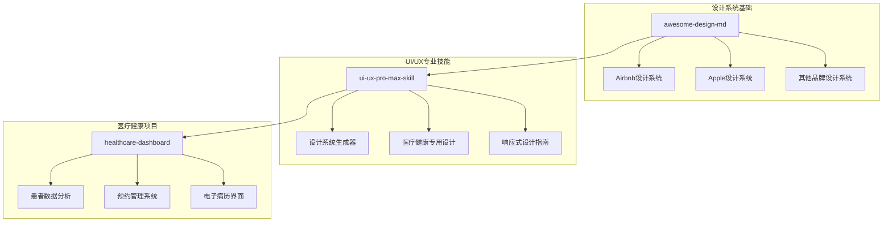
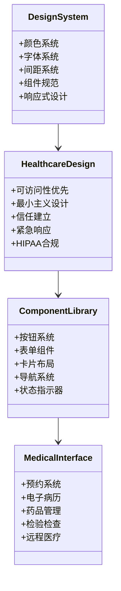
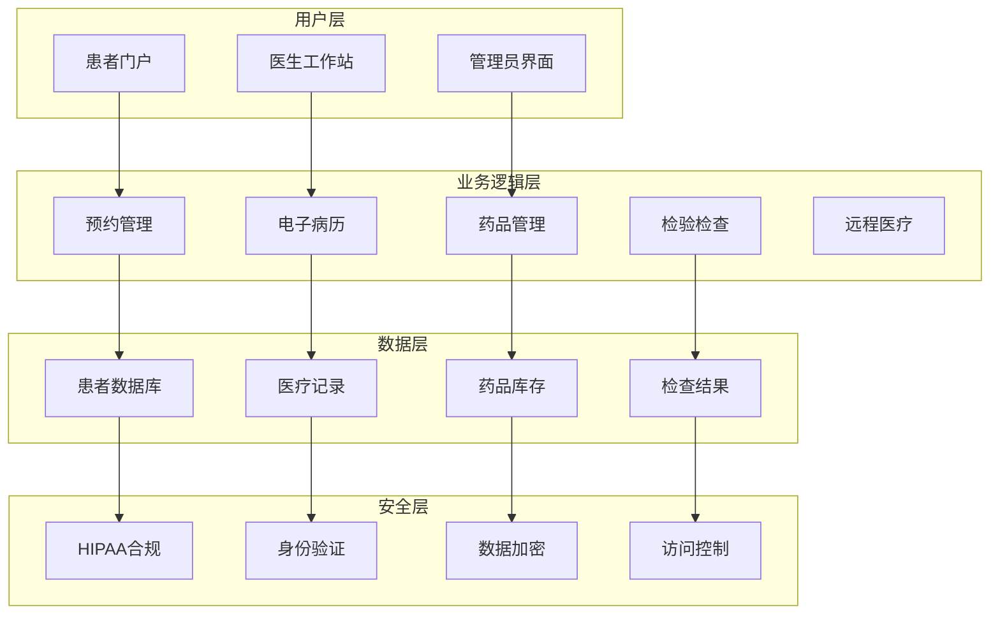
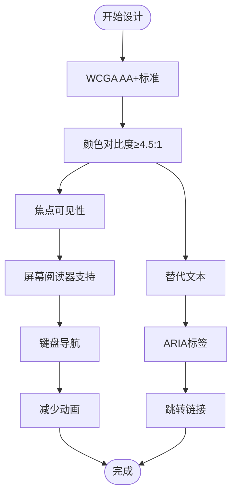
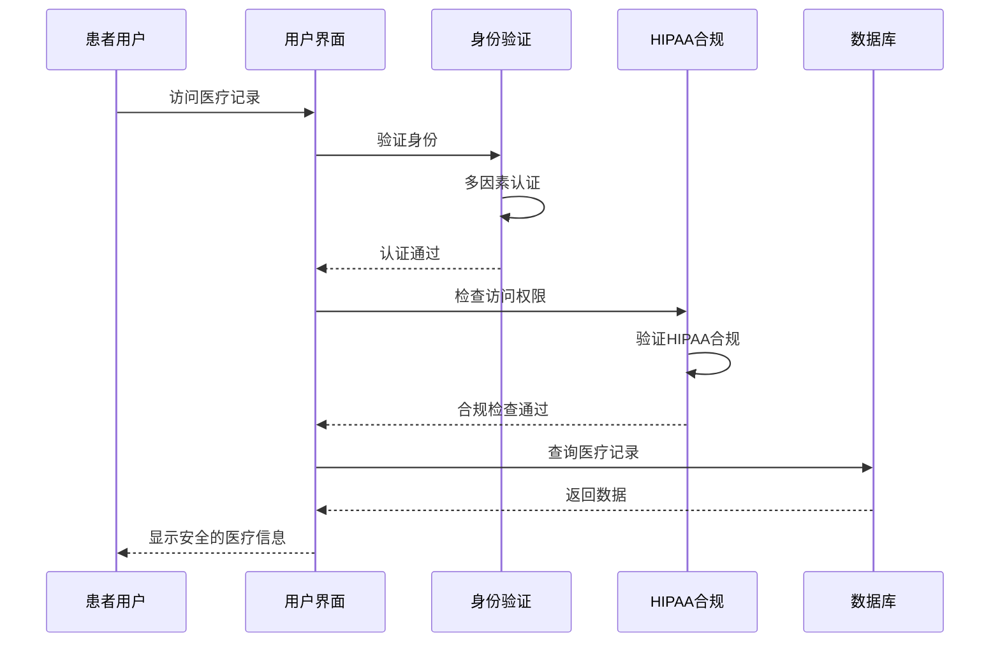
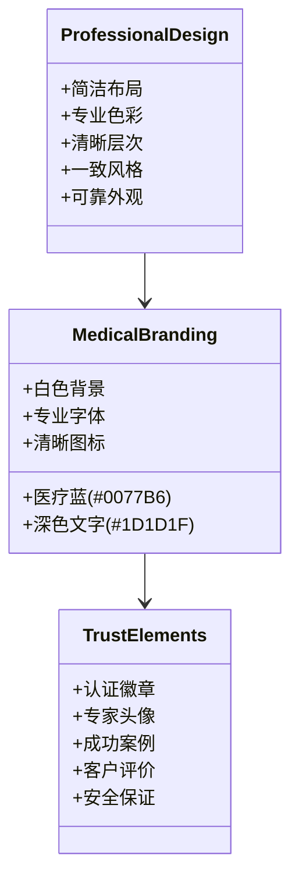
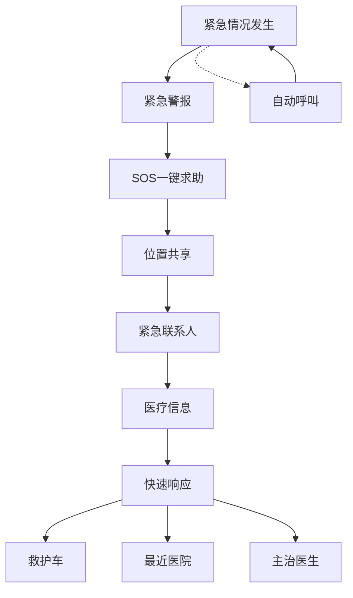
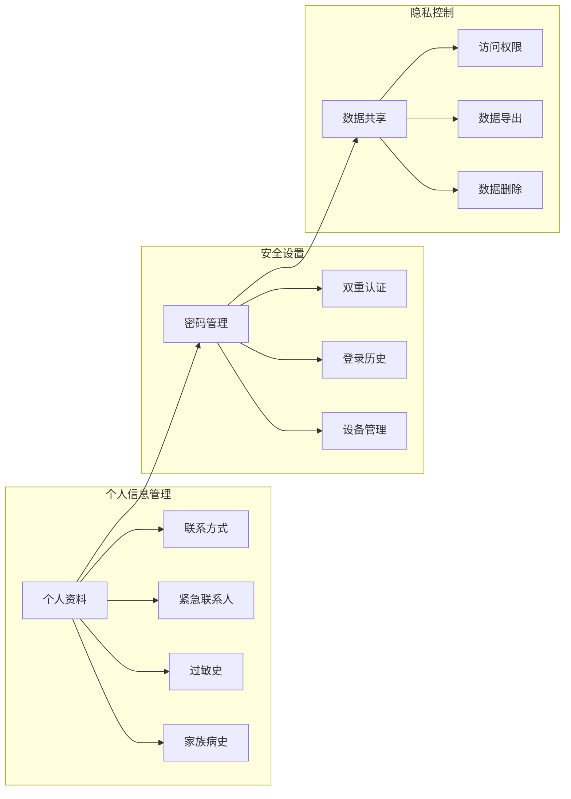
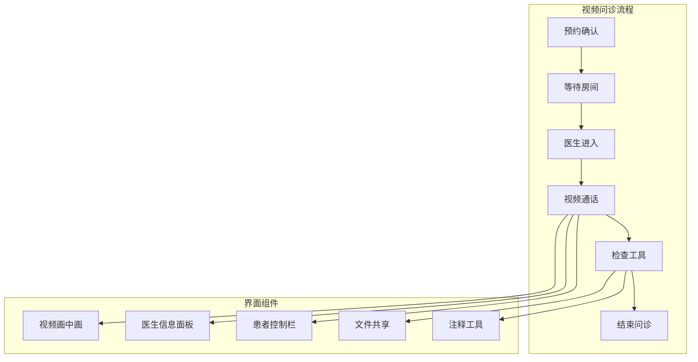
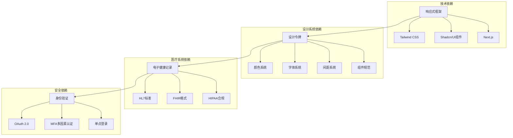

# 医院与诊所设计规则

<cite>
**本文档引用的文件**
- [README.md](file://README.md)
- [awesome-design-md/README.md](file://awesome-design-md/README.md)
- [awesome-design-md/design-md/airbnb/DESIGN.md](file://awesome-design-md/design-md/airbnb/DESIGN.md)
- [awesome-design-md/design-md/apple/DESIGN.md](file://awesome-design-md/design-md/apple/DESIGN.md)
- [ui-ux-pro-max-skill/README.md](file://ui-ux-pro-max-skill/README.md)
- [ui-ux-pro-max-skill/.claude/skills/ui-styling/references/tailwind-responsive.md](file://ui-ux-pro-max-skill/.claude/skills/ui-styling/references/tailwind-responsive.md)
- [ui-ux-pro-max-skill/.claude/skills/ui-styling/references/shadcn-accessibility.md](file://ui-ux-pro-max-skill/.claude/skills/ui-styling/references/shadcn-accessibility.md)
- [ui-ux-pro-max-skill/.claude/skills/ui-styling/references/shadcn-theming.md](file://ui-ux-pro-max-skill/.claude/skills/ui-styling/references/shadcn-theming.md)
- [ui-ux-pro-max-skill/projects/healthcare-dashboard/index.html](file://ui-ux-pro-max-skill/projects/healthcare-dashboard/index.html)
- [ui-ux-pro-max-skill/skills/ui-ux-pro-max/data/products.csv](file://ui-ux-pro-max-skill/skills/ui-ux-pro-max/data/products.csv)
- [ui-ux-pro-max-skill/src/ui-ux-pro-max/data/styles.csv](file://ui-ux-pro-max-skill/src/ui-ux-pro-max/data/styles.csv)
- [ui-ux-pro-max-skill/skills/ui-ux-pro-max/data/ui-reasoning.csv](file://ui-ux-pro-max-skill/skills/ui-ux-pro-max/data/ui-reasoning.csv)
- [ui-ux-pro-max-skill/skills/ui-ux-pro-max/data/ux-guidelines.csv](file://ui-ux-pro-max-skill/skills/ui-ux-pro-max/data/ux-guidelines.csv)
</cite>

## 目录
1. [引言](#引言)
2. [项目结构](#项目结构)
3. [核心组件](#核心组件)
4. [架构概览](#架构概览)
5. [详细组件分析](#详细组件分析)
6. [依赖关系分析](#依赖关系分析)
7. [性能考虑](#性能考虑)
8. [故障排除指南](#故障排除指南)
9. [结论](#结论)
10. [附录](#附录)

## 引言

本设计规则文档专为医院和诊所创建专业的医疗保健行业设计规范。基于仓库中的设计系统和医疗健康相关资源，本文档整合了以下关键设计理念：

- **可访问性与伦理设计**：确保所有用户，包括残障人士，都能平等地使用医疗服务
- **最小主义设计**：简化复杂的医疗信息，提高用户体验和效率
- **信任与权威感**：建立患者对医疗机构的信任和信心
- **紧急情况处理**：为医疗紧急情况提供快速响应机制
- **HIPAA合规**：严格保护患者隐私和医疗信息安全

## 项目结构

该仓库包含多个设计系统和医疗健康相关的资源，形成了完整的医疗界面设计体系：

**图表来源**
- [awesome-design-md/README.md:1-250](file://awesome-design-md/README.md#L1-L250)
- [ui-ux-pro-max-skill/README.md:1-649](file://ui-ux-pro-max-skill/README.md#L1-L649)

**章节来源**
- [awesome-design-md/README.md:1-250](file://awesome-design-md/README.md#L1-L250)
- [ui-ux-pro-max-skill/README.md:1-649](file://ui-ux-pro-max-skill/README.md#L1-L649)

## 核心组件

### 设计系统架构

基于仓库中的设计系统，医疗界面设计应遵循以下核心组件：

**图表来源**
- [ui-ux-pro-max-skill/src/ui-ux-pro-max/data/styles.csv:1-86](file://ui-ux-pro-max-skill/src/ui-ux-pro-max/data/styles.csv#L1-L86)
- [ui-ux-pro-max-skill/skills/ui-ux-pro-max/data/products.csv:59-62](file://ui-ux-pro-max-skill/skills/ui-ux-pro-max/data/products.csv#L59-L62)

### 颜色系统设计

医疗界面的颜色系统应体现专业性和可靠性：

| 颜色类别 | 颜色值 | 应用场景 | 可访问性考虑 |
|---------|--------|----------|-------------|
| 主色调 | #0077B6 (医疗蓝) | 标识、重要按钮、品牌元素 | 高对比度，WCAG AA+ |
| 成功色 | #22C55E (绿色) | 恢复、确认、积极状态 | 良好对比度，无障碍阅读 |
| 警告色 | #F59E0B (橙色) | 注意事项、提醒信息 | 高可见性，避免纯红色 |
| 危险色 | #EF4444 (红色) | 紧急情况、错误信息 | 高对比度，明确警告 |
| 中性色 | #F8FAFC (浅灰白) | 背景、容器、分隔线 | 低视觉疲劳，适合长时间使用 |

**章节来源**
- [ui-ux-pro-max-skill/skills/ui-ux-pro-max/data/products.csv:59-62](file://ui-ux-pro-max-skill/skills/ui-ux-pro-max/data/products.csv#L59-L62)
- [ui-ux-pro-max-skill/src/ui-ux-pro-max/data/styles.csv:1-86](file://ui-ux-pro-max-skill/src/ui-ux-pro-max/data/styles.csv#L1-L86)

## 架构概览

医疗界面设计采用模块化架构，确保各个功能模块既独立又协调：

**图表来源**
- [ui-ux-pro-max-skill/projects/healthcare-dashboard/index.html:92-251](file://ui-ux-pro-max-skill/projects/healthcare-dashboard/index.html#L92-L251)
- [ui-ux-pro-max-skill/skills/ui-ux-pro-max/data/products.csv:59-62](file://ui-ux-pro-max-skill/skills/ui-ux-pro-max/data/products.csv#L59-L62)

## 详细组件分析

### 可访问性设计规范

医疗界面必须满足严格的可访问性标准：

**图表来源**
- [ui-ux-pro-max-skill/.claude/skills/ui-styling/references/shadcn-accessibility.md:1-472](file://ui-ux-pro-max-skill/.claude/skills/ui-styling/references/shadcn-accessibility.md#L1-L472)

#### 触摸目标尺寸规范

医疗界面的触摸目标必须符合人体工程学要求：

| 组件类型 | 最小尺寸 | 间距要求 | 特殊考虑 |
|---------|----------|----------|----------|
| 主要按钮 | 48×48px | ≥8px间距 | 紧急按钮≥52×52px |
| 图标按钮 | 32×32px | ≥12px间距 | 需要额外的命中区域 |
| 文本输入 | 44×44px | ≥8px间距 | 考虑触屏输入准确性 |
| 导航项 | 40×40px | ≥16px间距 | 移动端优先考虑 |

**章节来源**
- [ui-ux-pro-max-skill/.claude/skills/ui-styling/references/shadcn-accessibility.md:1-472](file://ui-ux-pro-max-skill/.claude/skills/ui-styling/references/shadcn-accessibility.md#L1-L472)
- [ui-ux-pro-max-skill/skills/ui-ux-pro-max/data/ux-guidelines.csv:23-27](file://ui-ux-pro-max-skill/skills/ui-ux-pro-max/data/ux-guidelines.csv#L23-L27)

### 安全设计原则

医疗界面的安全设计是首要考虑因素：

**图表来源**
- [ui-ux-pro-max-skill/skills/ui-ux-pro-max/data/products.csv:59-62](file://ui-ux-pro-max-skill/skills/ui-ux-pro-max/data/products.csv#L59-L62)

#### HIPAA合规要点

医疗界面必须严格遵守HIPAA法规：

- **最小必要数据原则**：只显示必要的医疗信息
- **访问日志记录**：完整记录所有医疗数据访问
- **数据加密传输**：所有医疗数据传输必须加密
- **会话超时管理**：自动锁定长时间不活动的会话
- **审计跟踪**：维护完整的数据访问和修改记录

**章节来源**
- [ui-ux-pro-max-skill/skills/ui-ux-pro-max/data/products.csv:59-62](file://ui-ux-pro-max-skill/skills/ui-ux-pro-max/data/products.csv#L59-L62)

### 医疗专业性呈现

医疗界面应该体现专业性和权威感：

**图表来源**
- [ui-ux-pro-max-skill/src/ui-ux-pro-max/data/styles.csv:1-86](file://ui-ux-pro-max-skill/src/ui-ux-pro-max/data/styles.csv#L1-L86)

#### 品牌色彩应用

医疗品牌色彩应保持一致性：

| 色彩用途 | 颜色值 | 使用比例 | 心理效果 |
|---------|--------|----------|----------|
| 主品牌色 | #0077B6 | 60% | 专业、信任、稳定 |
| 辅助色 | #F8FAFC | 25% | 清新、洁净、专业 |
| 强调色 | #22C55E | 10% | 成功、恢复、积极 |
| 警告色 | #F59E0B | 3% | 注意、提醒、谨慎 |
| 危险色 | #EF4444 | 2% | 紧急、危险、重要 |

**章节来源**
- [ui-ux-pro-max-skill/src/ui-ux-pro-max/data/styles.csv:1-86](file://ui-ux-pro-max-skill/src/ui-ux-pro-max/data/styles.csv#L1-L86)

### 紧急情况处理设计

医疗界面需要为紧急情况提供快速响应机制：

#### 紧急按钮设计

紧急按钮必须具备以下特征：

- **醒目的视觉设计**：红色(#EF4444)，大尺寸(52×52px)
- **一键操作**：单击即可触发紧急响应
- **确认机制**：防止误触的二次确认
- **位置显眼**：固定在屏幕右下角
- **无障碍访问**：键盘快捷键支持

**章节来源**
- [ui-ux-pro-max-skill/skills/ui-ux-pro-max/data/products.csv:59-62](file://ui-ux-pro-max-skill/skills/ui-ux-pro-max/data/products.csv#L59-L62)

### 患者信息管理界面

#### 个人信息管理

患者个人信息管理界面应具备以下功能：

**图表来源**
- [ui-ux-pro-max-skill/projects/healthcare-dashboard/index.html:92-251](file://ui-ux-pro-max-skill/projects/healthcare-dashboard/index.html#L92-L251)

#### 电子病历界面设计

电子病历界面应提供清晰的信息组织：

| 功能模块 | 设计要点 | 用户价值 |
|---------|----------|----------|
| 病历摘要 | 突出显示重要信息，简洁明了 | 快速了解患者状况 |
| 诊断记录 | 时间轴展示，易于追踪 | 了解治疗历程 |
| 处方信息 | 清晰列出药物和用量 | 方便患者用药 |
| 检查报告 | 分类整理，可快速查找 | 提高诊断效率 |
| 医生笔记 | 专业术语解释，便于理解 | 增强医患沟通 |

**章节来源**
- [ui-ux-pro-max-skill/projects/healthcare-dashboard/index.html:92-251](file://ui-ux-pro-max-skill/projects/healthcare-dashboard/index.html#L92-L251)

### 远程医疗体验设计

#### 视频问诊界面

远程医疗界面需要确保良好的用户体验：

**图表来源**
- [ui-ux-pro-max-skill/.claude/skills/ui-styling/references/tailwind-responsive.md:1-383](file://ui-ux-pro-max-skill/.claude/skills/ui-styling/references/tailwind-responsive.md#L1-L383)

#### 远程监控界面

远程医疗监控界面应提供实时数据展示：

| 监控类型 | 展示方式 | 更新频率 | 报警机制 |
|---------|----------|----------|----------|
| 生命体征 | 实时图表 | 每秒更新 | 阈值报警 |
| 心电图 | 波形显示 | 实时流 | 异常检测 |
| 血氧饱和度 | 数字显示+图表 | 每秒更新 | 低值提醒 |
| 血压 | 双指标显示 | 每分钟更新 | 高低值预警 |
| 体温 | 曲线图展示 | 每小时更新 | 异常波动通知 |

**章节来源**
- [ui-ux-pro-max-skill/.claude/skills/ui-styling/references/tailwind-responsive.md:1-383](file://ui-ux-pro-max-skill/.claude/skills/ui-styling/references/tailwind-responsive.md#L1-L383)

## 依赖关系分析

医疗界面设计涉及多个层面的依赖关系：

**图表来源**
- [ui-ux-pro-max-skill/.claude/skills/ui-styling/references/shadcn-theming.md:1-374](file://ui-ux-pro-max-skill/.claude/skills/ui-styling/references/shadcn-theming.md#L1-L374)

**章节来源**
- [ui-ux-pro-max-skill/.claude/skills/ui-styling/references/shadcn-theming.md:1-374](file://ui-ux-pro-max-skill/.claude/skills/ui-styling/references/shadcn-theming.md#L1-L374)

## 性能考虑

医疗界面的性能优化至关重要，特别是在处理大量医疗数据时：

### 加载性能优化

| 优化策略 | 实现方法 | 性能提升 | 用户体验改善 |
|---------|----------|----------|-------------|
| 代码分割 | 按路由分割bundle | 减少首屏加载时间 | 页面更快可用 |
| 图片优化 | WebP格式，懒加载 | 减少带宽使用 | 提升页面加载速度 |
| 缓存策略 | HTTP缓存，Service Worker | 减少重复请求 | 改善重复访问体验 |
| 数据预加载 | 关键数据预加载 | 减少等待时间 | 提高交互流畅度 |
| 组件虚拟化 | 大列表虚拟滚动 | 减少DOM节点 | 提升滚动性能 |

### 响应式设计性能

医疗界面需要在各种设备上保持良好性能：

- **移动设备优化**：触摸目标≥44px，避免重排重绘
- **网络适应性**：离线模式，弱网优化
- **内存管理**：及时清理事件监听器和定时器
- **渲染优化**：使用CSS硬件加速，避免强制同步布局

## 故障排除指南

### 常见问题及解决方案

| 问题类型 | 症状表现 | 解决方案 | 预防措施 |
|---------|----------|----------|----------|
| 可访问性问题 | 屏幕阅读器无法正确读取内容 | 添加ARIA标签，检查焦点顺序 | 定期进行可访问性测试 |
| 性能问题 | 页面加载缓慢，交互卡顿 | 实施代码分割，优化图片资源 | 监控性能指标，定期优化 |
| 响应式问题 | 移动端显示异常 | 检查断点设置，测试不同分辨率 | 在多种设备上测试 |
| 安全问题 | 数据泄露风险 | 实施HTTPS，输入验证，权限控制 | 定期安全审计，更新依赖 |
| 兼容性问题 | 浏览器兼容性差 | 使用polyfill，渐进增强 | 测试主流浏览器版本 |

**章节来源**
- [ui-ux-pro-max-skill/skills/ui-ux-pro-max/data/ux-guidelines.csv:1-100](file://ui-ux-pro-max-skill/skills/ui-ux-pro-max/data/ux-guidelines.csv#L1-L100)

### 调试工具推荐

- **浏览器开发者工具**：检查元素、网络、性能
- **可访问性检查工具**：axe DevTools，Lighthouse
- **性能分析工具**：Chrome DevTools Performance面板
- **响应式测试工具**：BrowserStack，Responsinator
- **安全扫描工具**：OWASP ZAP，Nessus

## 结论

本设计规则文档为医院和诊所创建了全面的医疗保健行业设计规范。通过整合可访问性、安全性、专业性和紧急响应等核心要素，医疗界面能够为患者提供更好的就医体验。

关键设计原则包括：
- **以患者为中心**：确保所有设计决策都服务于患者的医疗需求
- **严格的安全保障**：HIPAA合规和数据安全是设计的基础要求
- **专业的视觉语言**：通过设计建立患者对医疗机构的信任
- **高效的交互流程**：简化复杂的医疗流程，提高工作效率
- **可靠的应急机制**：为紧急医疗情况提供快速响应能力

这些设计规范不仅适用于当前的医疗环境，也为未来的医疗技术创新提供了坚实的基础。

## 附录

### 设计系统实施清单

- [ ] 完成颜色系统定义和应用
- [ ] 建立字体和排版规范
- [ ] 创建组件库和样式指南
- [ ] 实施响应式设计策略
- [ ] 集成可访问性功能
- [ ] 建立安全和隐私保护机制
- [ ] 制定性能优化方案
- [ ] 建立测试和质量保证流程

### 参考资源

- **设计系统文档**：awesome-design-md中的各品牌设计系统
- **医疗健康指南**：ui-ux-pro-max-skill中的医疗健康产品设计
- **可访问性标准**：WCAG 2.1 AA+标准
- **HIPAA合规指南**：美国健康保险流通与责任法案
- **响应式设计最佳实践**：移动优先设计原则