# 技术&SaaS行业规则

<cite>
**本文档引用的文件**
- [README.md](file://README.md)
- [products.csv](file://src/ui-ux-pro-max/data/products.csv)
- [styles.csv](file://src/ui-ux-pro-max/data/styles.csv)
- [landing.csv](file://src/ui-ux-pro-max/data/landing.csv)
- [design.csv](file://src/ui-ux-pro-max/data/design.csv)
- [draft.csv](file://src/ui-ux-pro-max/data/draft.csv)
- [README.md](file://awesome-design-md/README.md)
</cite>

## 目录
1. [引言](#引言)
2. [项目结构](#项目结构)
3. [核心组件](#核心组件)
4. [架构总览](#架构总览)
5. [详细组件分析](#详细组件分析)
6. [依赖关系分析](#依赖关系分析)
7. [性能考量](#性能考量)
8. [故障排查指南](#故障排查指南)
9. [结论](#结论)
10. [附录](#附录)

## 引言
本文件面向技术&SaaS行业，基于仓库中的设计系统与推理规则，构建一套完整的161条行业推理规则文档。重点覆盖SaaS产品设计系统生成规则，包含General SaaS、Micro SaaS、AI/Chatbot Platform、Fintech/Crypto、NFT/Web3 Platform等子类别。内容涵盖推荐风格（如Glassmorphism + Flat Design、Flat Design + Vibrant & Block等）、着陆页模式（Hero + Features + CTA、Minimal & Direct + Demo等）、仪表板风格（Data-Dense + Real-Time Monitoring、Executive Dashboard等）以及色彩搭配策略，并提供具体实现示例、最佳实践案例与设计决策依据。

## 项目结构
该仓库采用“数据驱动 + 智能匹配”的设计系统生成体系，核心由以下模块构成：
- 数据层：产品类型（products.csv）、UI风格（styles.csv）、着陆页模式（landing.csv）、设计哲学（design.csv/draft.csv）
- 引擎层：搜索脚本与推理引擎（scripts/search.py），用于多域并行匹配与规则排序
- 输出层：CLI命令与模板系统，支持跨平台（Web、React、Vue、iOS、Android、Flutter、React Native等）生成完整设计系统

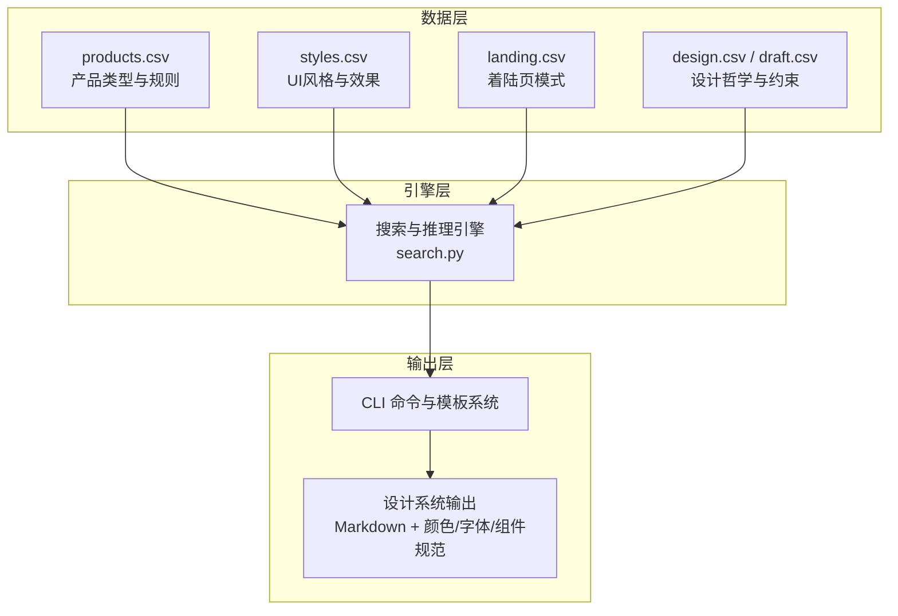

**图表来源**
- [products.csv:1-194](file://src/ui-ux-pro-max/data/products.csv#L1-L194)
- [styles.csv:1-71](file://src/ui-ux-pro-max/data/styles.csv#L1-L71)
- [landing.csv:1-36](file://src/ui-ux-pro-max/data/landing.csv#L1-L36)
- [design.csv:482-501](file://src/ui-ux-pro-max/data/design.csv#L482-L501)
- [draft.csv:485-504](file://src/ui-ux-pro-max/data/draft.csv#L485-L504)

**章节来源**
- [README.md:142-173](file://README.md#L142-L173)
- [README.md:413-431](file://README.md#L413-L431)

## 核心组件
- 产品类型数据库（products.csv）：定义161个产品类型及其推荐风格、着陆页模式、仪表板风格与色彩焦点，是推理规则的核心输入
- UI风格数据库（styles.csv）：定义67种UI风格的关键词、颜色、效果、适用场景与可访问性约束
- 着陆页模式数据库（landing.csv）：定义24种着陆页模式的结构顺序、CTA布局与转化优化要点
- 设计哲学与约束（design.csv/draft.csv）：定义通用设计原则、反式模式与性能/可访问性约束

**章节来源**
- [products.csv:1-194](file://src/ui-ux-pro-max/data/products.csv#L1-L194)
- [styles.csv:1-71](file://src/ui-ux-pro-max/data/styles.csv#L1-L71)
- [landing.csv:1-36](file://src/ui-ux-pro-max/data/landing.csv#L1-L36)
- [design.csv:482-501](file://src/ui-ux-pro-max/data/design.csv#L482-L501)
- [draft.csv:485-504](file://src/ui-ux-pro-max/data/draft.csv#L485-L504)

## 架构总览
设计系统生成流程如下：
1. 用户请求（如“为SaaS产品设计着陆页”）
2. 多域并行搜索：产品类型匹配（161类）、风格优先级（67种）、色彩方案（161套）、着陆页模式（24种）、字体组合（57组）
3. 推理引擎：应用BM25排序、过滤行业反式模式、处理决策规则（JSON条件）
4. 输出完整设计系统：包含模式 + 风格 + 颜色 + 字体 + 效果 + 反式模式 + 预交付检查清单

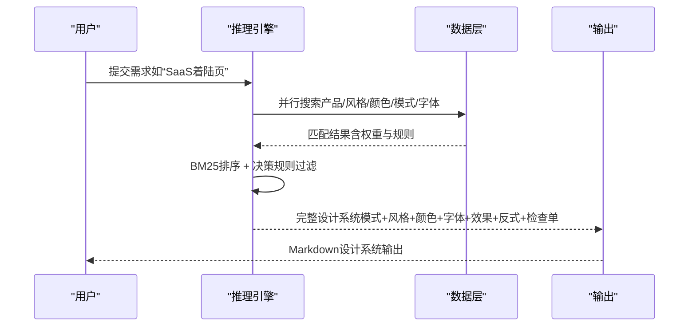

**图表来源**
- [README.md:107-140](file://README.md#L107-L140)
- [products.csv:1-194](file://src/ui-ux-pro-max/data/products.csv#L1-L194)
- [styles.csv:1-71](file://src/ui-ux-pro-max/data/styles.csv#L1-L71)
- [landing.csv:1-36](file://src/ui-ux-pro-max/data/landing.csv#L1-L36)

## 详细组件分析

### 通用SaaS（General SaaS）
- 推荐风格：Glassmorphism + Flat Design（现代感与清晰度平衡）
- 次要风格：Soft UI Evolution、Minimalism（提升可读性与一致性）
- 着陆页模式：Hero + Features + CTA（强调价值主张与行动号召）
- 仪表板风格：Data-Dense + Real-Time Monitoring（数据密集型与实时监控）
- 色彩搭配：Trust blue + accent contrast（建立信任与高对比度）
- 关键考虑：在现代感与清晰度之间取得平衡；突出CTA

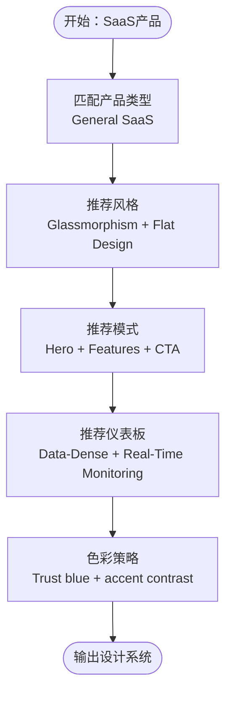

**图表来源**
- [products.csv:2-2](file://src/ui-ux-pro-max/data/products.csv#L2-L2)

**章节来源**
- [products.csv:2-2](file://src/ui-ux-pro-max/data/products.csv#L2-L2)

### 微型SaaS（Micro SaaS）
- 推荐风格：Flat Design + Vibrant & Block（简洁快速展示产品）
- 次要风格：Motion-Driven、Micro-interactions（强调速度与体验）
- 着陆页模式：Minimal & Direct + Demo（最小化复杂度，快速演示）
- 仪表板风格：Executive Dashboard（高管视角概览）
- 色彩搭配：Vibrant primary + white space（活力与留白）
- 关键考虑：保持简单，快速展示产品；速度是关键

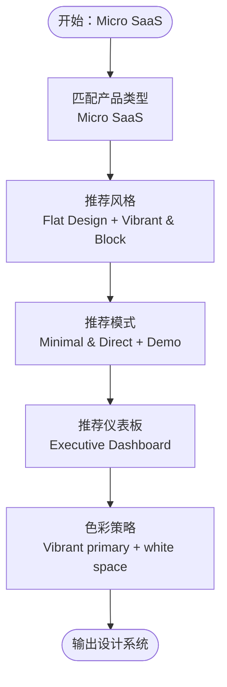

**图表来源**
- [products.csv:3-3](file://src/ui-ux-pro-max/data/products.csv#L3-L3)

**章节来源**
- [products.csv:3-3](file://src/ui-ux-pro-max/data/products.csv#L3-L3)

### AI/Chatbot平台（AI/Chatbot Platform）
- 推荐风格：AI-Native UI + Minimalism（对话式界面与流式文本）
- 次要风格：Zero Interface、Glassmorphism（减少界面干扰）
- 着陆页模式：Interactive Product Demo（沉浸式演示）
- 仪表板风格：AI/ML Analytics Dashboard（AI分析仪表板）
- 色彩搭配：Neutral + AI Purple（中性与AI紫色）
- 关键考虑：对话式UI、流式文本、上下文感知、最少界面元素

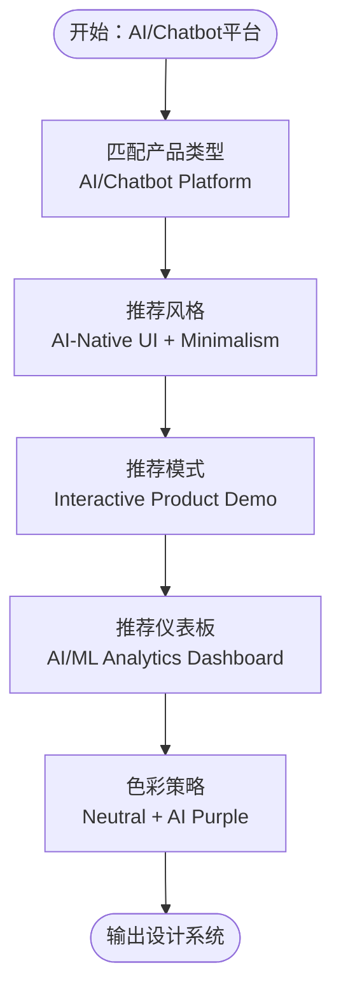

**图表来源**
- [products.csv:19-19](file://src/ui-ux-pro-max/data/products.csv#L19-L19)

**章节来源**
- [products.csv:19-19](file://src/ui-ux-pro-max/data/products.csv#L19-L19)

### 金融/加密（Fintech/Crypto）
- 推荐风格：Glassmorphism + Dark Mode（科技感与安全感知）
- 次要风格：Retro-Futurism、Motion-Driven（未来感与动感）
- 着陆页模式：Conversion-Optimized（转化导向）
- 仪表板风格：Real-Time Monitoring + Predictive（实时监控与预测）
- 色彩搭配：Dark tech colors + trust + vibrant accents（深色科技 + 信任 + 生动强调色）
- 关键考虑：安全感知、实时数据至关重要

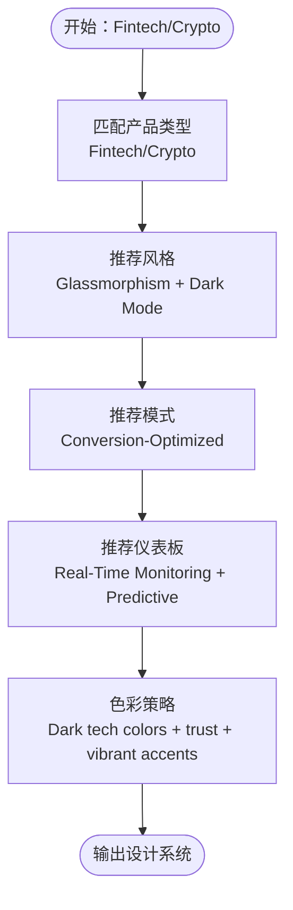

**图表来源**
- [products.csv:15-15](file://src/ui-ux-pro-max/data/products.csv#L15-L15)

**章节来源**
- [products.csv:15-15](file://src/ui-ux-pro-max/data/products.csv#L15-L15)

### NFT/Web3平台（NFT/Web3 Platform）
- 推荐风格：Cyberpunk UI + Glassmorphism（赛博朋克与通透感）
- 次要风格：Aurora UI、3D & Hyperrealism（光效与沉浸）
- 着陆页模式：Feature-Rich Showcase（功能丰富展示）
- 仪表板风格：Crypto/Blockchain Dashboard（加密货币/区块链仪表板）
- 色彩搭配：Dark + Neon + Gold（深色 + 荧光 + 金色）
- 关键考虑：钱包集成、交易反馈、Gas费用显示、深色模式必备

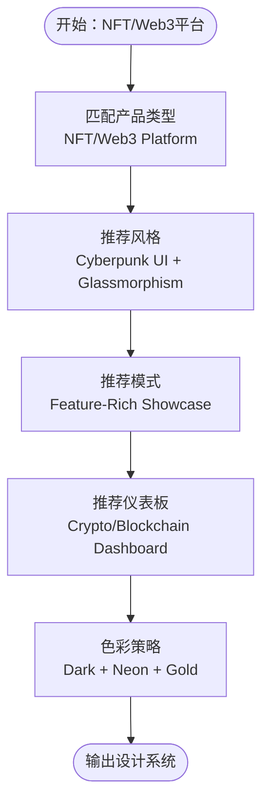

**图表来源**
- [products.csv:20-20](file://src/ui-ux-pro-max/data/products.csv#L20-L20)

**章节来源**
- [products.csv:20-20](file://src/ui-ux-pro-max/data/products.csv#L20-L20)

### 设计系统生成规则（以产品类型为中心）
下表总结了SaaS相关子类别的设计系统生成规则要点（节选）：

| 产品类型 | 推荐风格 | 着陆页模式 | 仪表板风格 | 色彩焦点 | 关键考虑 |
| --- | --- | --- | --- | --- | --- |
| General SaaS | Glassmorphism + Flat Design | Hero + Features + CTA | Data-Dense + Real-Time Monitoring | Trust blue + accent contrast | 平衡现代感与清晰度；突出CTA |
| Micro SaaS | Flat Design + Vibrant & Block | Minimal & Direct + Demo | Executive Dashboard | Vibrant primary + white space | 保持简单，快速展示产品；速度是关键 |
| AI/Chatbot Platform | AI-Native UI + Minimalism | Interactive Product Demo | AI/ML Analytics Dashboard | Neutral + AI Purple | 对话式UI；流式文本；上下文感知；最少界面元素 |
| Fintech/Crypto | Glassmorphism + Dark Mode | Conversion-Optimized | Real-Time Monitoring + Predictive | Dark tech colors + trust + vibrant accents | 安全感知；实时数据至关重要 |
| NFT/Web3 Platform | Cyberpunk UI + Glassmorphism | Feature-Rich Showcase | Crypto/Blockchain Dashboard | Dark + Neon + Gold | 钱包集成；交易反馈；Gas费用显示；深色模式必备 |

**章节来源**
- [products.csv:2-20](file://src/ui-ux-pro-max/data/products.csv#L2-L20)

### 着陆页模式与转化优化
- Hero + Features + CTA：强调价值主张与行动号召，适合大多数SaaS产品
- Minimal & Direct + Demo：最小化复杂度，快速演示，适合Micro SaaS
- Conversion-Optimized：单主CTA聚焦、信任信号、紧迫感元素、社交证明
- Interactive Product Demo：嵌入产品演示或视频，适合工具类SaaS
- Feature-Rich Showcase：多特性网格布局，适合功能丰富的SaaS平台

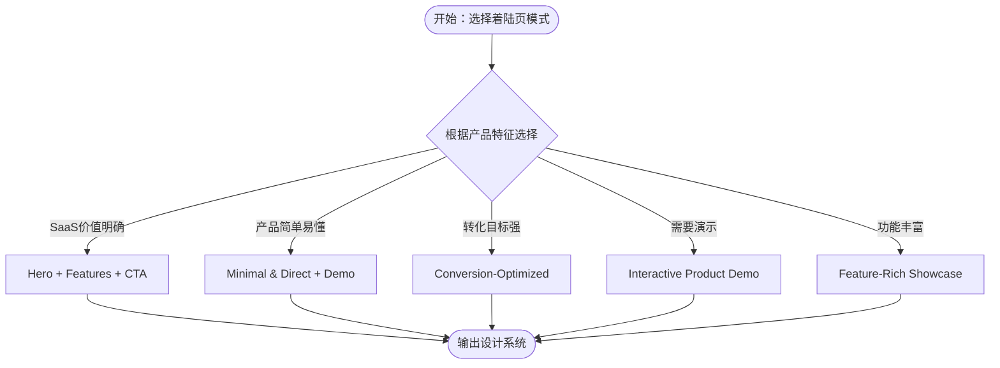

**图表来源**
- [landing.csv:1-36](file://src/ui-ux-pro-max/data/landing.csv#L1-L36)

**章节来源**
- [landing.csv:1-36](file://src/ui-ux-pro-max/data/landing.csv#L1-L36)

### 仪表板风格与数据密度
- Data-Dense + Real-Time Monitoring：适用于需要实时数据更新与密集信息展示的场景
- Executive Dashboard：高层概览，趋势指示器，一目了然
- Real-Time Monitoring：活动监控、状态指示器、告警通知
- Drill-Down Analytics：层级数据探索，摘要到详情的流转
- AI/ML Analytics Dashboard：AI分析与洞察，适合AI/Chatbot平台

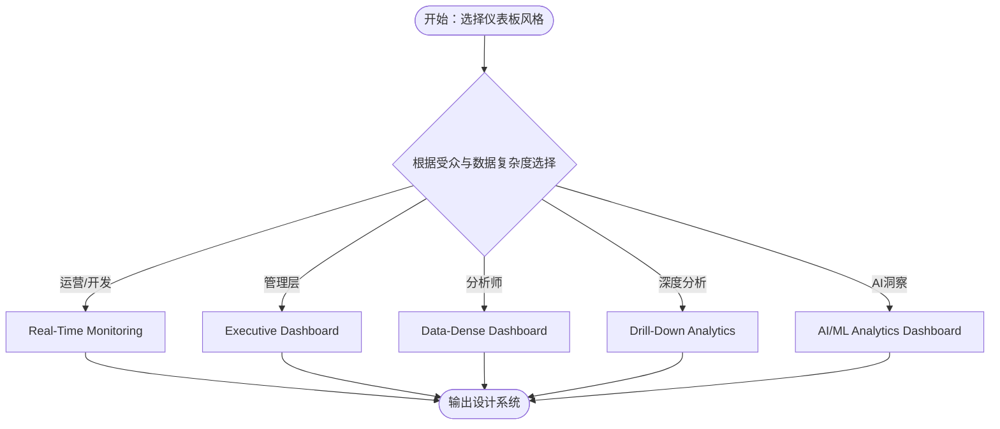

**图表来源**
- [styles.csv:28-37](file://src/ui-ux-pro-max/data/styles.csv#L28-L37)
- [products.csv:19-19](file://src/ui-ux-pro-max/data/products.csv#L19-L19)

**章节来源**
- [styles.csv:28-37](file://src/ui-ux-pro-max/data/styles.csv#L28-L37)
- [products.csv:19-19](file://src/ui-ux-pro-max/data/products.csv#L19-L19)

### 色彩搭配策略与品牌一致性
- 信任与权威：Trust blue + neutral grey（金融/企业）
- 科技与安全：Dark tech colors + trust + vibrant accents（加密/金融）
- 活力与创意：Vibrant primary + white space（初创/创意）
- AI与对话：Neutral + AI Purple（AI/Chatbot）
- 深色与霓虹：Dark + Neon + Gold（NFT/Web3）

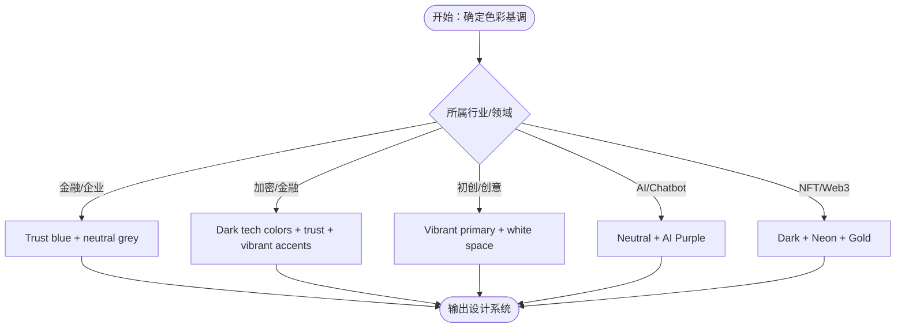

**图表来源**
- [products.csv:2-20](file://src/ui-ux-pro-max/data/products.csv#L2-L20)

**章节来源**
- [products.csv:2-20](file://src/ui-ux-pro-max/data/products.csv#L2-L20)

### 设计系统生成最佳实践
- 使用CLI命令生成设计系统：通过search.py进行多域匹配与推理
- 分层检索：先查全局MASTER.md，再叠加页面级覆盖文件
- 预交付检查清单：确保可访问性、响应式、动画偏好设置等
- 反式模式：避免使用特定行业的不当设计（如AI紫色/粉色梯度用于银行）

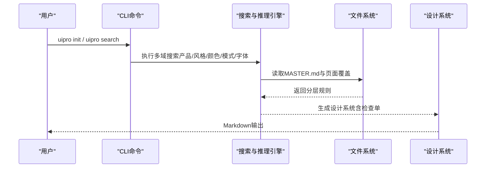

**图表来源**
- [README.md:432-491](file://README.md#L432-L491)

**章节来源**
- [README.md:432-491](file://README.md#L432-L491)

## 依赖关系分析
- 组件耦合：产品类型数据库与风格/着陆页/设计哲学数据库高度解耦，通过搜索脚本统一调度
- 直接依赖：CLI命令依赖Python脚本与数据文件；不同平台模板由CLI动态生成
- 外部依赖：支持13+主流框架栈（React、Vue、iOS、Android、Flutter、React Native等）

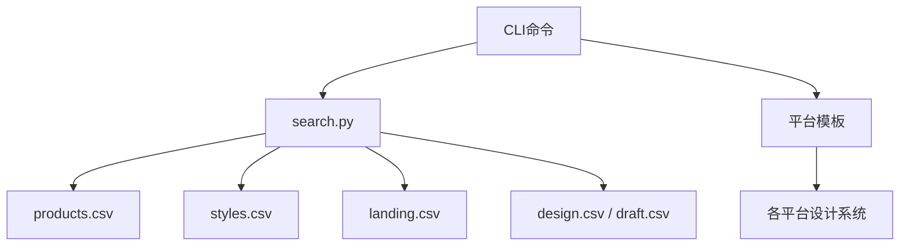

**图表来源**
- [README.md:413-431](file://README.md#L413-L431)
- [products.csv:1-194](file://src/ui-ux-pro-max/data/products.csv#L1-L194)
- [styles.csv:1-71](file://src/ui-ux-pro-max/data/styles.csv#L1-L71)
- [landing.csv:1-36](file://src/ui-ux-pro-max/data/landing.csv#L1-L36)
- [design.csv:482-501](file://src/ui-ux-pro-max/data/design.csv#L482-L501)
- [draft.csv:485-504](file://src/ui-ux-pro-max/data/draft.csv#L485-L504)

**章节来源**
- [README.md:413-431](file://README.md#L413-L431)

## 性能考量
- 动画与渲染：避免主线程上过多模糊半径效果，优先使用原生驱动或Skia
- 玻璃拟态：合理使用背景模糊与透明度，确保文本对比度达到4.5:1以上
- 实时监控：采用增量更新与去抖策略，降低刷新频率与资源消耗
- 移动端优化：优先扁平与软拟态风格，减少阴影层数与复杂渐变

**章节来源**
- [design.csv:482-483](file://src/ui-ux-pro-max/data/design.csv#L482-L483)
- [draft.csv:485-486](file://src/ui-ux-pro-max/data/draft.csv#L485-L486)

## 故障排查指南
- CLI命令报错：确认已安装最新版本的ui-ux-pro-max-cli，必要时使用npx方式运行
- Python未找到：安装Python 3.x后重试搜索脚本
- 设计系统输出截断：使用--max-length参数增大限制或移除限制
- 安装问题：若Zip文件包含符号链接导致失败，请改用CLI安装而非市场插件直接安装

**章节来源**
- [README.md:564-632](file://README.md#L564-L632)

## 结论
本规则文档基于仓库中的161条行业推理规则与67种UI风格，为技术&SaaS行业提供了系统化的设计系统生成方法论。通过产品类型匹配、风格优先级、色彩与字体策略、着陆页模式与仪表板风格的协同，能够快速产出高质量、可落地的设计系统。建议在实际项目中结合预交付检查清单与反式模式，确保设计既美观又可用。

## 附录
- 示例参考：可在awesome-design-md集合中查看真实网站的DESIGN.md文件，作为设计系统的参考模板
- 平台支持：涵盖Web（HTML+Tailwind）、React生态、Vue生态、iOS、Android、Flutter、React Native等

**章节来源**
- [README.md:204-227](file://awesome-design-md/README.md#L204-L227)
- [README.md:413-431](file://README.md#L413-L431)