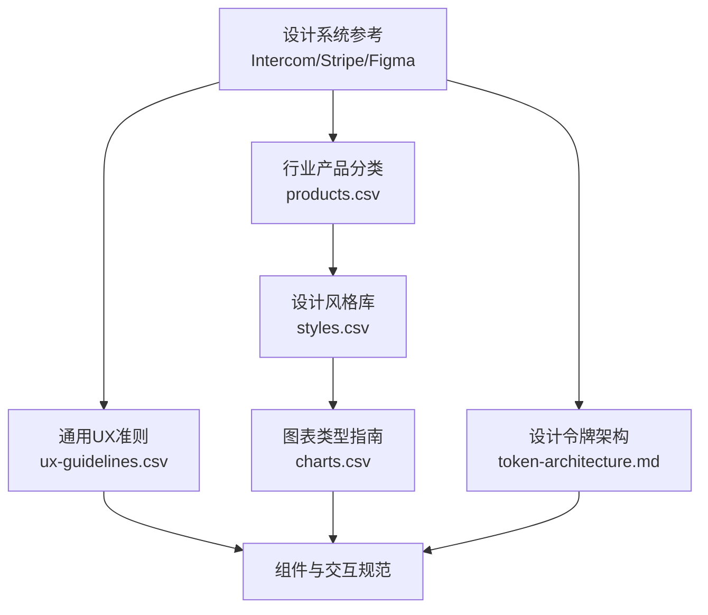
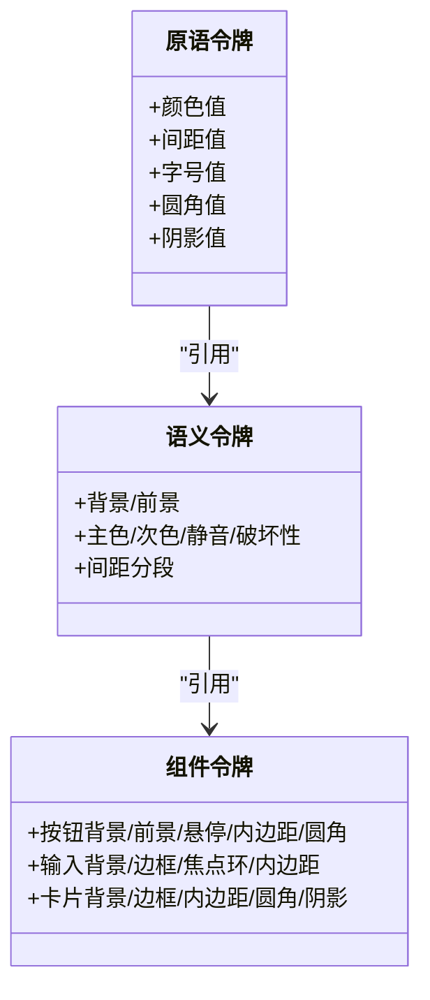
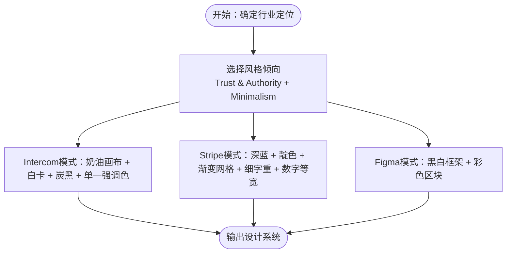
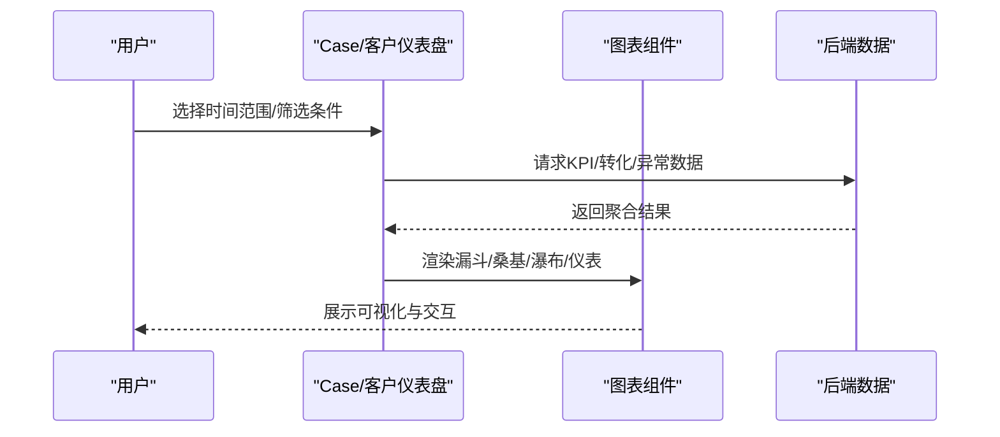
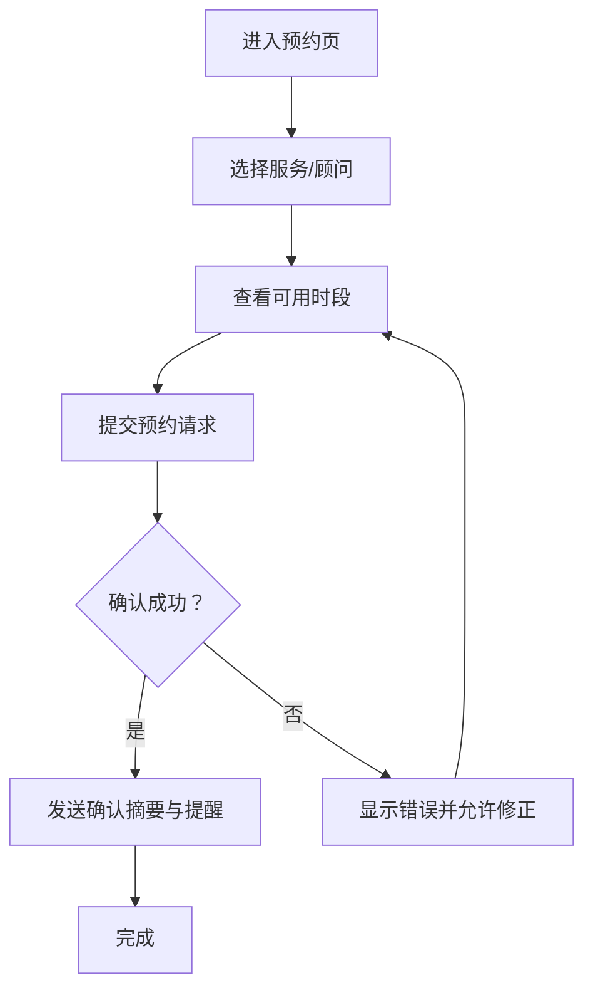
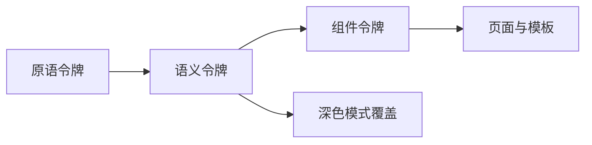

# 服务&专业服务行业规则

<cite>
**本文档引用的文件**
- [awesome-design-md/intercom/DESIGN.md](file://awesome-design-md/design-md/intercom/DESIGN.md)
- [awesome-design-md/stripe/DESIGN.md](file://awesome-design-md/design-md/stripe/DESIGN.md)
- [awesome-design-md/figma/DESIGN.md](file://awesome-design-md/design-md/figma/DESIGN.md)
- [ui-ux-pro-max-skill/src/ui-ux-pro-max/data/products.csv](file://ui-ux-pro-max-skill/src/ui-ux-pro-max/data/products.csv)
- [ui-ux-pro-max-skill/skills/ui-ux-pro-max/data/styles.csv](file://ui-ux-pro-max-skill/skills/ui-ux-pro-max/data/styles.csv)
- [ui-ux-pro-max-skill/skills/ui-ux-pro-max/data/ux-guidelines.csv](file://ui-ux-pro-max-skill/skills/ui-ux-pro-max/data/ux-guidelines.csv)
- [ui-ux-pro-max-skill/skills/ui-ux-pro-max/data/charts.csv](file://ui-ux-pro-max-skill/skills/ui-ux-pro-max/data/charts.csv)
- [ui-ux-pro-max-skill/cli/assets/skills/design-system/references/token-architecture.md](file://ui-ux-pro-max-skill/cli/assets/skills/design-system/references/token-architecture.md)
</cite>

## 目录
1. [引言](#引言)
2. [项目结构](#项目结构)
3. [核心组件](#核心组件)
4. [架构总览](#架构总览)
5. [详细组件分析](#详细组件分析)
6. [依赖分析](#依赖分析)
7. [性能考虑](#性能考虑)
8. [故障排除指南](#故障排除指南)
9. [结论](#结论)
10. [附录](#附录)

## 引言
本文件面向服务与专业服务行业（企业服务、咨询、法律、房地产、旅游等）构建一套可落地的设计系统生成规则，覆盖以下关键维度：
- 专业性呈现：Trust & Authority + Minimalism 的视觉语言与信息架构
- 客户关系管理：Client Management、Case Management Dashboard 的数据密度与交互节奏
- 服务流程设计：Booking System、Consultation Flow 的用户旅程与状态反馈
- 信任建立策略：品牌色阶、权威字体、认证徽章、案例展示、安全信号
- 预约系统设计：日历视图、时段选择、确认摘要、提醒与变更流程
- 专业形象展示：仪表盘、报告、可视化图表的可读性与无障碍
- 客户沟通界面：对话式交互、流式文本、上下文卡片、最小化界面

目标是输出161条可执行的行业推理规则，帮助团队在不同细分领域快速生成一致、可信、高效的UI设计系统。

## 项目结构
该仓库包含多套设计系统参考与规范，以及服务行业产品分类与风格指南：
- 设计系统参考：Intercom（产品导向的营销画布）、Stripe（金融基础设施的渐变网格）、Figma（黑白编辑器框架与彩色区块）
- 行业产品分类：按服务类型划分（法律、保险、银行、在线课程、房地产、旅游等），给出风格倾向、配色方案与典型页面
- 设计风格库：涵盖从极简到未来感的多种风格，适配不同服务场景
- 通用UX准则：导航、动画、布局、触摸、交互、可访问性、性能、表单、响应式、排版、反馈、内容、搜索、AI交互、空间UI、可持续性等
- 图表类型指南：针对趋势、比较、部分-整体、相关性、热力、地理、漏斗、KPI、预测、异常检测、层次、流程、累计变化、多变量、股票、网络、分布、紧凑KPI、填充、环形、根因分析、3D空间、实时流、情感、流程挖掘等场景的图表选型与可访问性建议
- 设计令牌架构：原语令牌、语义令牌、组件令牌分层，支持深色模式与命名约定

**图表来源**
- [awesome-design-md/intercom/DESIGN.md:1-547](file://awesome-design-md/design-md/intercom/DESIGN.md#L1-L547)
- [awesome-design-md/stripe/DESIGN.md:1-488](file://awesome-design-md/design-md/stripe/DESIGN.md#L1-L488)
- [awesome-design-md/figma/DESIGN.md:1-579](file://awesome-design-md/design-md/figma/DESIGN.md#L1-L579)
- [ui-ux-pro-max-skill/src/ui-ux-pro-max/data/products.csv:30-105](file://ui-ux-pro-max-skill/src/ui-ux-pro-max/data/products.csv#L30-L105)
- [ui-ux-pro-max-skill/skills/ui-ux-pro-max/data/styles.csv:1-86](file://ui-ux-pro-max-skill/skills/ui-ux-pro-max/data/styles.csv#L1-L86)
- [ui-ux-pro-max-skill/skills/ui-ux-pro-max/data/ux-guidelines.csv:1-100](file://ui-ux-pro-max-skill/skills/ui-ux-pro-max/data/ux-guidelines.csv#L1-L100)
- [ui-ux-pro-max-skill/skills/ui-ux-pro-max/data/charts.csv:1-27](file://ui-ux-pro-max-skill/skills/ui-ux-pro-max/data/charts.csv#L1-L27)
- [ui-ux-pro-max-skill/cli/assets/skills/design-system/references/token-architecture.md:28-158](file://ui-ux-pro-max-skill/cli/assets/skills/design-system/references/token-architecture.md#L28-L158)

**章节来源**
- [awesome-design-md/intercom/DESIGN.md:1-547](file://awesome-design-md/design-md/intercom/DESIGN.md#L1-L547)
- [awesome-design-md/stripe/DESIGN.md:1-488](file://awesome-design-md/design-md/stripe/DESIGN.md#L1-L488)
- [awesome-design-md/figma/DESIGN.md:1-579](file://awesome-design-md/design-md/figma/DESIGN.md#L1-L579)
- [ui-ux-pro-max-skill/src/ui-ux-pro-max/data/products.csv:30-105](file://ui-ux-pro-max-skill/src/ui-ux-pro-max/data/products.csv#L30-L105)
- [ui-ux-pro-max-skill/skills/ui-ux-pro-max/data/styles.csv:1-86](file://ui-ux-pro-max-skill/skills/ui-ux-pro-max/data/styles.csv#L1-L86)
- [ui-ux-pro-max-skill/skills/ui-ux-pro-max/data/ux-guidelines.csv:1-100](file://ui-ux-pro-max-skill/skills/ui-ux-pro-max/data/ux-guidelines.csv#L1-L100)
- [ui-ux-pro-max-skill/skills/ui-ux-pro-max/data/charts.csv:1-27](file://ui-ux-pro-max-skill/skills/ui-ux-pro-max/data/charts.csv#L1-L27)
- [ui-ux-pro-max-skill/cli/assets/skills/design-system/references/token-architecture.md:28-158](file://ui-ux-pro-max-skill/cli/assets/skills/design-system/references/token-architecture.md#L28-L158)

## 核心组件
围绕服务行业设计系统的核心组件包括：
- 品牌与色彩系统：以“专业权威 + 极简”为主导，结合行业特性（如法律的稳重、金融的信任、房地产的专业、旅游的活力）选择主色、辅色与强调色
- 字体与排版：使用高可读性字体，建立清晰的层级与负间距策略；在不同媒介上保持一致性
- 组件体系：按钮、输入框、卡片、标签、导航、页脚等基础组件的形态、半径、间距与状态
- 深色模式：在保证可读性的前提下，提供深色主题的语义令牌覆盖
- 可访问性：WCAG等级、焦点可见性、减少动态、触控目标、键盘导航、屏幕阅读器友好
- 动画与交互：微交互、加载状态、悬停/按下/禁用状态、错误与成功反馈
- 数据可视化：根据业务场景选择合适的图表类型，并确保可访问性与性能

**章节来源**
- [awesome-design-md/intercom/DESIGN.md:6-253](file://awesome-design-md/design-md/intercom/DESIGN.md#L6-L253)
- [awesome-design-md/stripe/DESIGN.md:6-244](file://awesome-design-md/design-md/stripe/DESIGN.md#L6-L244)
- [awesome-design-md/figma/DESIGN.md:6-271](file://awesome-design-md/design-md/figma/DESIGN.md#L6-L271)
- [ui-ux-pro-max-skill/cli/assets/skills/design-system/references/token-architecture.md:28-158](file://ui-ux-pro-max-skill/cli/assets/skills/design-system/references/token-architecture.md#L28-L158)

## 架构总览
设计系统采用三层令牌架构：
- 原语令牌：颜色、间距、字号、圆角、阴影等原始值
- 语义令牌：基于用途的别名（背景、前景、主色、次色、静音、破坏性等）
- 组件令牌：组件级令牌（按钮、输入、卡片等），引用语义令牌

**图表来源**
- [ui-ux-pro-max-skill/cli/assets/skills/design-system/references/token-architecture.md:28-158](file://ui-ux-pro-max-skill/cli/assets/skills/design-system/references/token-architecture.md#L28-L158)

**章节来源**
- [ui-ux-pro-max-skill/cli/assets/skills/design-system/references/token-architecture.md:28-158](file://ui-ux-pro-max-skill/cli/assets/skills/design-system/references/token-architecture.md#L28-L158)

## 详细组件分析

### 专业性呈现（Trust & Authority + Minimalism）
- Intercom的“奶油画布 + 白色浮动卡片 + 炭黑色文字 + Fin橙色强调”的系统，强调产品截图主导、负间距显示层级、无阴影浮层
- Stripe的“深海军蓝 + 电靛色 + 渐变网格 + 细字重 + 数字等宽”的系统，强调渐变网格、细字重负间距、数字等宽、深色仪表板
- Figma的“黑白编辑器框架 + 彩色区块段落”的系统，强调monochrome核心与彩色区块叙事节奏

**图表来源**
- [awesome-design-md/intercom/DESIGN.md:255-273](file://awesome-design-md/design-md/intercom/DESIGN.md#L255-L273)
- [awesome-design-md/stripe/DESIGN.md:246-262](file://awesome-design-md/design-md/stripe/DESIGN.md#L246-L262)
- [awesome-design-md/figma/DESIGN.md:273-289](file://awesome-design-md/design-md/figma/DESIGN.md#L273-L289)

**章节来源**
- [awesome-design-md/intercom/DESIGN.md:255-273](file://awesome-design-md/design-md/intercom/DESIGN.md#L255-L273)
- [awesome-design-md/stripe/DESIGN.md:246-262](file://awesome-design-md/design-md/stripe/DESIGN.md#L246-L262)
- [awesome-design-md/figma/DESIGN.md:273-289](file://awesome-design-md/design-md/figma/DESIGN.md#L273-L289)

### 客户关系管理（Client Management、Case Management Dashboard）
- 产品分类中明确“Case Management Dashboard”“Client Management”“Sales Intelligence Dashboard”等，对应的数据密度与KPI展示需求
- 图表类型指南提供漏斗、桑基、瀑布、仪表、子弹图、热力图、地理图等，满足客户转化、流程分析、预算/销售洞察、异常监控等场景

**图表来源**
- [ui-ux-pro-max-skill/src/ui-ux-pro-max/data/products.csv:35-44](file://ui-ux-pro-max-skill/src/ui-ux-pro-max/data/products.csv#L35-L44)
- [ui-ux-pro-max-skill/skills/ui-ux-pro-max/data/charts.csv:1-27](file://ui-ux-pro-max-skill/skills/ui-ux-pro-max/data/charts.csv#L1-L27)

**章节来源**
- [ui-ux-pro-max-skill/src/ui-ux-pro-max/data/products.csv:35-44](file://ui-ux-pro-max-skill/src/ui-ux-pro-max/data/products.csv#L35-L44)
- [ui-ux-pro-max-skill/skills/ui-ux-pro-max/data/charts.csv:1-27](file://ui-ux-pro-max-skill/skills/ui-ux-pro-max/data/charts.csv#L1-L27)

### 服务流程设计（Booking System、Consultation Flow）
- 产品分类中的“Booking & Appointment App”明确了日历/月视图、可用时段网格、服务/人员选择、确认摘要、提醒推送、改签/取消流程
- UX准则涵盖触摸目标、手势冲突、滚动行为、加载状态、错误反馈、成功反馈、键盘导航、可访问性等

**图表来源**
- [ui-ux-pro-max-skill/src/ui-ux-pro-max/data/products.csv:105-105](file://ui-ux-pro-max-skill/src/ui-ux-pro-max/data/products.csv#L105-L105)
- [ui-ux-pro-max-skill/skills/ui-ux-pro-max/data/ux-guidelines.csv:1-100](file://ui-ux-pro-max-skill/skills/ui-ux-pro-max/data/ux-guidelines.csv#L1-L100)

**章节来源**
- [ui-ux-pro-max-skill/src/ui-ux-pro-max/data/products.csv:105-105](file://ui-ux-pro-max-skill/src/ui-ux-pro-max/data/products.csv#L105-L105)
- [ui-ux-pro-max-skill/skills/ui-ux-pro-max/data/ux-guidelines.csv:1-100](file://ui-ux-pro-max-skill/skills/ui-ux-pro-max/data/ux-guidelines.csv#L1-L100)

### 信任建立策略
- 法律服务：Trust & Authority + Minimalism，强调专业性与可信度（徽章、证书、案例、联系表单）
- 保险平台：Trust & Authority + Flat Design，强调转化与信任（报价计算器、政策对比、流程、信任信号、清晰定价、安全徽章）
- 银行/传统金融：Minimalism + Accessible & Ethical，强调安全与可访问性（账户概览、交易历史、移动银行、信任至上的设计）

**章节来源**
- [ui-ux-pro-max-skill/src/ui-ux-pro-max/data/products.csv:41-43](file://ui-ux-pro-max-skill/src/ui-ux-pro-max/data/products.csv#L41-L43)

## 依赖分析
设计系统各层之间的依赖关系如下：

**图表来源**
- [ui-ux-pro-max-skill/cli/assets/skills/design-system/references/token-architecture.md:28-158](file://ui-ux-pro-max-skill/cli/assets/skills/design-system/references/token-architecture.md#L28-L158)

**章节来源**
- [ui-ux-pro-max-skill/cli/assets/skills/design-system/references/token-architecture.md:28-158](file://ui-ux-pro-max-skill/cli/assets/skills/design-system/references/token-architecture.md#L28-L158)

## 性能考虑
- 图像优化与懒加载：避免未优化的大图，使用适当的尺寸与格式（WebP），对下方内容进行占位
- 代码分割与缓存：按路由/功能拆分代码，设置合适的缓存头
- 字体加载：使用font-display swap或可选，避免字体加载阻塞渲染
- 第三方脚本：非关键脚本异步/延迟加载
- Bundle大小：监控并控制bundle体积增长
- 渲染阻塞：内联关键CSS，延迟非关键CSS

**章节来源**
- [ui-ux-pro-max-skill/skills/ui-ux-pro-max/data/ux-guidelines.csv:46-54](file://ui-ux-pro-max-skill/skills/ui-ux-pro-max/data/ux-guidelines.csv#L46-L54)

## 故障排除指南
- 错误反馈：在问题附近显示清晰的错误消息，避免仅视觉提示
- 成功反馈：确认操作结果，提供简短的成功消息或视觉变化
- 确认对话框：删除/不可逆操作前进行二次确认
- 颜色对比：文本与背景至少4.5:1（正常文本），7:1+（高对比）
- 颜色唯一性：不要仅靠颜色传达信息，需配合图标/文本
- 替代文本：有意义的图片必须有描述性替代文本
- 跳过链接：在导航繁重的页面提供跳过链接
- 输入标签：每个输入都应有可见标签
- 移动键盘：为输入类型使用合适的输入法属性

**章节来源**
- [ui-ux-pro-max-skill/skills/ui-ux-pro-max/data/ux-guidelines.csv:36-64](file://ui-ux-pro-max-skill/skills/ui-ux-pro-max/data/ux-guidelines.csv#L36-L64)

## 结论
通过整合Intercom、Stripe、Figma的设计系统参考，结合服务行业的产品分类、设计风格库、通用UX准则与图表类型指南，可以形成一套覆盖“专业性呈现、客户关系管理、服务流程设计、信任建立策略”的完整设计系统生成规则。建议在实际项目中：
- 先确定行业定位与风格倾向（Trust & Authority + Minimalism）
- 基于令牌架构搭建原语/语义/组件层
- 依据业务场景选择合适的图表类型并确保可访问性
- 在预约与咨询流程中强化信任信号与反馈机制
- 将UX准则贯穿开发全流程，保障性能与可访问性

## 附录
- 设计风格库与适用场景：涵盖极简、软UI、玻璃拟态、未来感、复古未来、平面设计、立体拟真、液体玻璃、运动驱动、微交互、包容设计、零界面、软UI演进、英雄中心、转化优化、功能丰富展示、极简直接、社交证明聚焦、互动产品演示、信任权威、故事驱动、数据密集仪表盘、热图样式、高管仪表盘、实时监控、钻取分析、对比分析、预测分析、用户行为分析、财务仪表盘、销售智能仪表盘等
- 图表类型指南：针对趋势、比较、部分-整体、相关性、热力、地理、漏斗、KPI、预测、异常检测、层次、流程、累计变化、多变量、股票、网络、分布、紧凑KPI、填充、环形、根因分析、3D空间、实时流、情感、流程挖掘等场景的图表选型与可访问性建议

**章节来源**
- [ui-ux-pro-max-skill/skills/ui-ux-pro-max/data/styles.csv:1-86](file://ui-ux-pro-max-skill/skills/ui-ux-pro-max/data/styles.csv#L1-L86)
- [ui-ux-pro-max-skill/skills/ui-ux-pro-max/data/charts.csv:1-27](file://ui-ux-pro-max-skill/skills/ui-ux-pro-max/data/charts.csv#L1-L27)