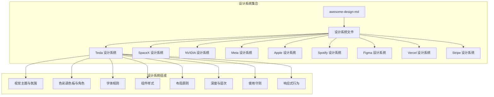
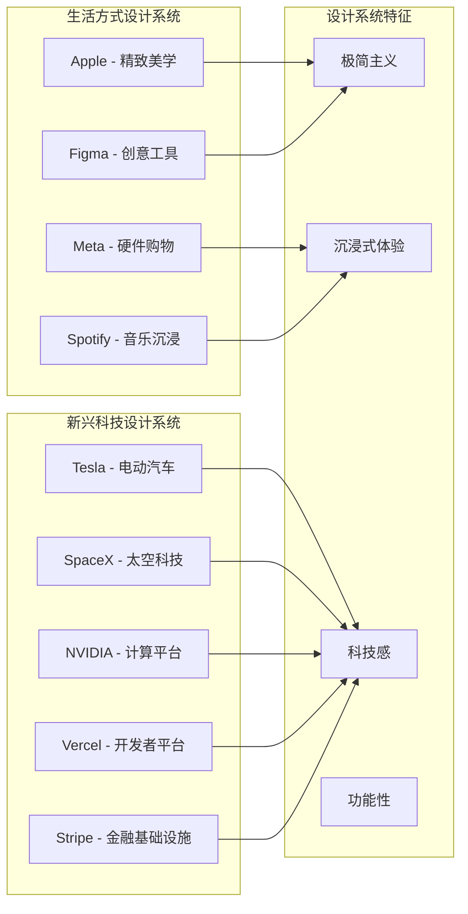
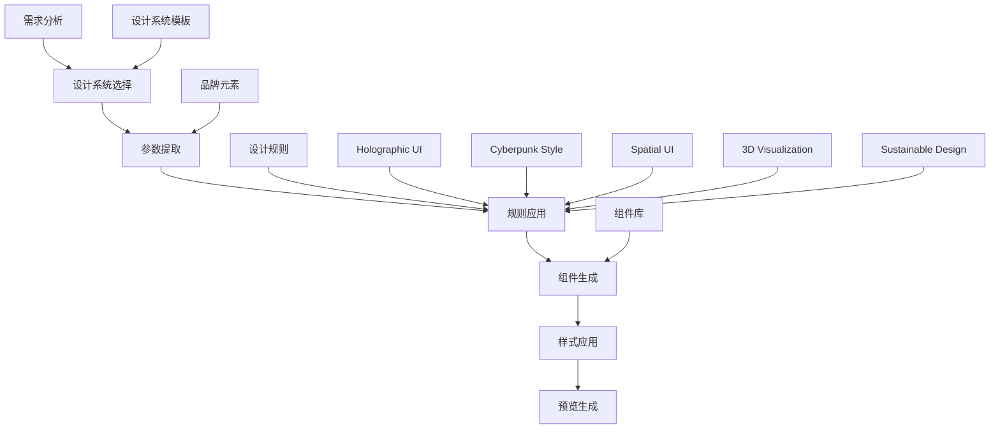
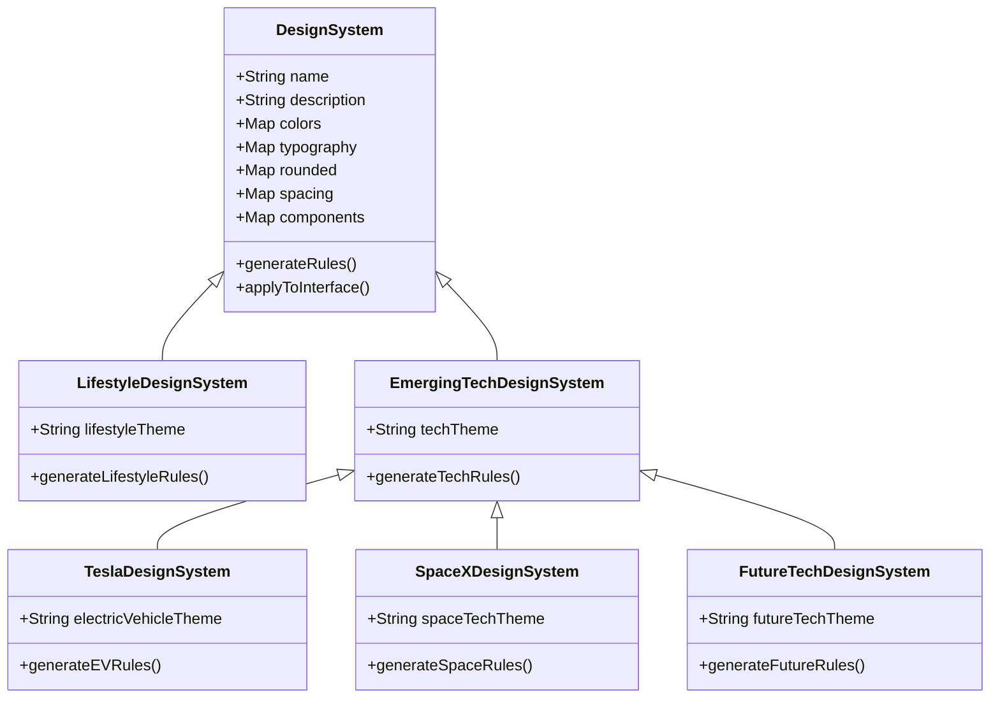
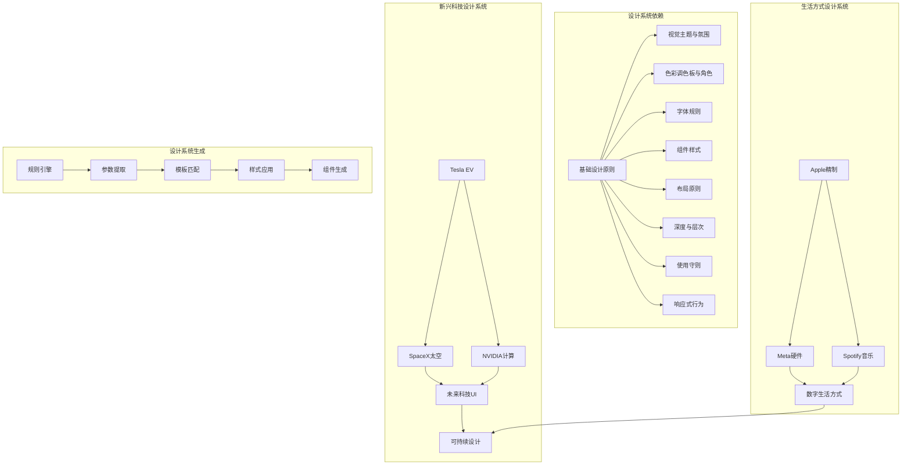
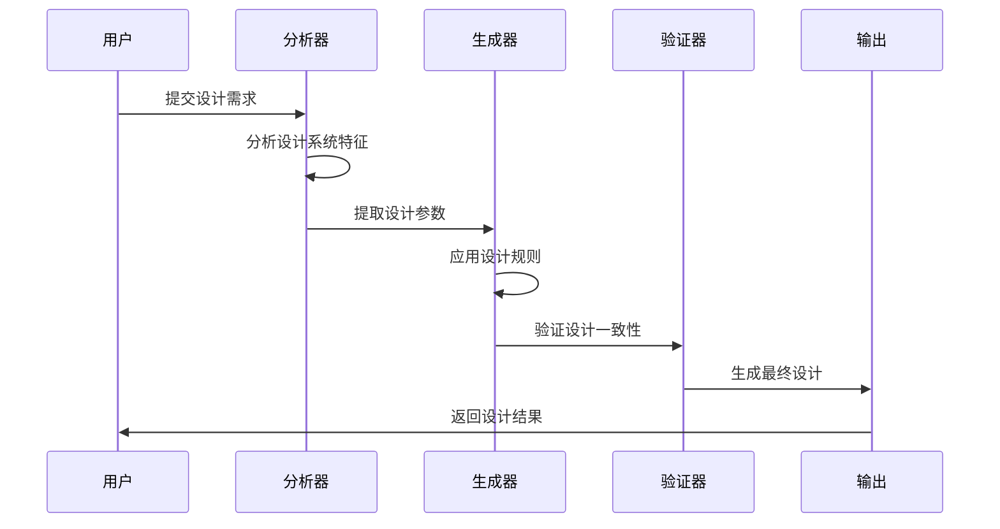

# 生活方式&新兴科技行业规则

<cite>
**本文档引用的文件**
- [awesome-design-md/README.md](file://awesome-design-md/README.md)
- [awesome-design-md/design-md/tesla/DESIGN.md](file://awesome-design-md/design-md/tesla/DESIGN.md)
- [awesome-design-md/design-md/spacex/DESIGN.md](file://awesome-design-md/design-md/spacex/DESIGN.md)
- [awesome-design-md/design-md/nvidia/DESIGN.md](file://awesome-design-md/design-md/nvidia/DESIGN.md)
- [awesome-design-md/design-md/meta/DESIGN.md](file://awesome-design-md/design-md/meta/DESIGN.md)
- [awesome-design-md/design-md/apple/DESIGN.md](file://awesome-design-md/design-md/apple/DESIGN.md)
- [awesome-design-md/design-md/spotify/DESIGN.md](file://awesome-design-md/design-md/spotify/DESIGN.md)
- [awesome-design-md/design-md/figma/DESIGN.md](file://awesome-design-md/design-md/figma/DESIGN.md)
- [awesome-design-md/design-md/vercel/DESIGN.md](file://awesome-design-md/design-md/vercel/DESIGN.md)
- [awesome-design-md/design-md/stripe/DESIGN.md](file://awesome-design-md/design-md/stripe/DESIGN.md)
</cite>

## 目录
1. [引言](#引言)
2. [项目结构](#项目结构)
3. [核心组件](#核心组件)
4. [架构概览](#架构概览)
5. [详细组件分析](#详细组件分析)
6. [依赖关系分析](#依赖关系分析)
7. [性能考虑](#性能考虑)
8. [故障排除指南](#故障排除指南)
9. [结论](#结论)
10. [附录](#附录)

## 引言

本文件为生活方式与新兴科技行业创建前瞻性设计系统规则文档，基于开源仓库中已有的设计系统分析文件，构建一套涵盖智能家居、电动汽车、可持续能源、太空科技、量子计算等子领域的生活方式与新兴科技设计系统生成规则。

该设计系统以"未来科技感"为核心理念，包含以下关键特征：
- **Holographic/HUD + Dark Mode**：全息投影与HUD显示技术的界面设计
- **Cyberpunk UI**：赛博朋克风格的视觉表现
- **Spatial UI**：空间用户界面与3D交互体验
- **3D & Hyperrealism**：超现实主义的视觉呈现
- **可持续发展理念**：环保与可持续性设计原则

## 项目结构

该项目采用模块化设计系统架构，每个品牌或公司都有独立的DESIGN.md文件，定义了完整的视觉设计系统：

**图表来源**
- [awesome-design-md/README.md:1-250](file://awesome-design-md/README.md#L1-L250)

**章节来源**
- [awesome-design-md/README.md:1-250](file://awesome-design-md/README.md#L1-L250)

## 核心组件

### 设计系统框架

每个设计系统都遵循统一的九段式结构：

| 段落编号 | 内容 | 描述 |
|---------|------|------|
| 1 | 视觉主题与氛围 | 品牌的整体视觉风格和情感表达 |
| 2 | 色彩调色板与角色 | 颜色系统及其功能定位 |
| 3 | 字体规则 | 字体家族、层级表和排版规范 |
| 4 | 组件样式 | 按钮、卡片、输入框等UI组件的样式定义 |
| 5 | 布局原则 | 间距系统、网格、空白哲学 |
| 6 | 深度与层次 | 阴影系统、表面层次 |
| 7 | 使用守则 | 设计准则和反模式 |
| 8 | 响应式行为 | 断点、触摸目标、折叠策略 |
| 9 | 代理提示指南 | 快速颜色参考和组件提示 |

### 设计系统分类

根据行业特点，可将现有设计系统分为以下几类：

**章节来源**
- [awesome-design-md/design-md/tesla/DESIGN.md:1-287](file://awesome-design-md/design-md/tesla/DESIGN.md#L1-L287)
- [awesome-design-md/design-md/spacex/DESIGN.md:1-364](file://awesome-design-md/design-md/spacex/DESIGN.md#L1-L364)
- [awesome-design-md/design-md/nvidia/DESIGN.md:1-641](file://awesome-design-md/design-md/nvidia/DESIGN.md#L1-L641)
- [awesome-design-md/design-md/meta/DESIGN.md:1-684](file://awesome-design-md/design-md/meta/DESIGN.md#L1-L684)

## 架构概览

### 设计系统生成架构

### 设计系统继承关系

**图表来源**
- [awesome-design-md/design-md/tesla/DESIGN.md:1-287](file://awesome-design-md/design-md/tesla/DESIGN.md#L1-L287)
- [awesome-design-md/design-md/spacex/DESIGN.md:1-364](file://awesome-design-md/design-md/spacex/DESIGN.md#L1-L364)

## 详细组件分析

### 电动汽车设计系统规则

#### Tesla设计系统特征

Tesla的设计系统体现了"极简主义"和"摄影优先"的核心理念：

**视觉特征**
- 全屏视口英雄区域（100vh），充满电影感的汽车摄影
- 几乎零UI装饰：无阴影、无渐变、无边框、无图案
- 单一强调色 - 电蓝色（#3E6AE1）用于主要行动按钮
- Universal Sans字体家族统一网页、应用和车载界面

**色彩系统**
- 主要：电蓝色（#3E6AE1）- 主要行动按钮背景
- 中性：碳黑（#171A20）- 深色表面和潜在深色模式上下文
- 白色画布（#FFFFFF）- 所有表面、面板、导航和次要按钮填充

**组件规范**
- 按钮：4px边框半径的矩形（几乎圆角）
- 导航：粘性无滑动类，保持在顶部不滑入动画
- 图像处理：全屏视口（100vh）部分，边缘到边缘，无边距

**章节来源**
- [awesome-design-md/design-md/tesla/DESIGN.md:1-287](file://awesome-design-md/design-md/tesla/DESIGN.md#L1-L287)

### 太空科技设计系统规则

#### SpaceX设计系统特征

SpaceX的设计系统体现了"极简主义"和"negation"的美学理念：

**视觉特征**
- 纯黑色画布，白色显示类型设置紧密垂直领先和大写字母
- 全屏摄影或自动播放火箭发射视频作为唯一的UI装饰
- 每个带区只有一个幽灵轮廓药丸形CTA
- 固定顶部导航覆盖摄影

**色彩系统**
- 画布夜（#000000）：营销默认画布
- 画布夜软（#0a0a0a）：略提升的近黑用于需要轻微分离的内容
- 画布冷（#f0f0fa）：浅冷蓝色用作商店网站的次级表面和某些幽灵按钮的悬停画布

**字体系统**
- D-DIN-Bold用于显示级别（大写字母，紧密跟踪，压缩感觉）
- D-DIN常规用于正文和按钮标签
- 显示大小异常紧密的垂直领先（0.95-1.25）和异常宽松的水平跟踪（1.6px在80px）

**章节来源**
- [awesome-design-md/design-md/spacex/DESIGN.md:1-364](file://awesome-design-md/design-md/spacex/DESIGN.md#L1-L364)

### 计算机图形设计系统规则

#### NVIDIA设计系统特征

NVIDIA的设计系统体现了"工程级营销"和"单色系统"的特点：

**视觉特征**
- 两个表面模式 - 深黑色画布用于英雄和页脚章节，平滑纸白色画布用于主体内容
- 单一饱和NVIDIA绿色强调色承载每个CTA、每个活动选项卡
- 几何角度：2px半径在每个表面，紧密粗体sans-serif字体

**色彩系统**
- NVIDIA绿色（#76b900）：品牌。每个主要CTA、每个活动状态、每个链接强调，每个角落方形标记
- 黑色画布（#000000）：英雄章节、深色CTA条带、页脚、主导航
- 页面画布（#ffffff）：页面的主体

**组件规范**
- 按钮：NVIDIA绿色填充（#76b900）+ 白色文本
- 卡片：1px细线边框，表格规则，分隔符之间的页脚链接列
- 装饰：小的NVIDIA绿色方形（~12px）位于资源和特性卡片的一个角落

**章节来源**
- [awesome-design-md/design-md/nvidia/DESIGN.md:1-641](file://awesome-design-md/design-md/nvidia/DESIGN.md#L1-L641)

### 社交媒体设计系统规则

#### Meta设计系统特征

Meta的设计系统体现了"硬件销售商"的信心和"摄影优先"的理念：

**视觉特征**
- 坚持白色画布（#ffffff）承载全屏产品摄影，白色空间和紧密的排版层次
- 两层主要按钮系统：营销CTA使用黑色药丸；商务CTA使用饱和钴蓝色（#0064E0）内部购买面板
- Optimistic VF作为通用显示+正文字体，具有统一的ss01, ss02 OpenType功能

**色彩系统**
- 钴蓝色（#0064E0）：购买时的CTA颜色。用于每个"添加到购物车"、"配置"、"预订单"按钮内部购买流程和右侧栏购买面板
- 深钴蓝色（#0457cb）：按下状态和深色表面变体的钴蓝色
- Facebook蓝色（#1876f2）：选中的单选/复选框状态和内联表单控件激活颜色

**组件规范**
- 按钮：黑色药丸主要CTA（营销表面）；钴蓝色药丸主要CTA（商务流程）
- 卡片：边缘到边缘的产品摄影展示板，无卡片Chrome（无边框，无阴影）
- 导航：固定顶部导航覆盖摄影

**章节来源**
- [awesome-design-md/design-md/meta/DESIGN.md:1-684](file://awesome-design-md/design-md/meta/DESIGN.md#L1-L684)

### 移动设备设计系统规则

#### Apple设计系统特征

Apple的设计系统体现了"摄影优先界面"和"博物馆画廊"的理念：

**视觉特征**
- 边缘到边缘的产品磁贴在浅色和深色画布之间交替，由SF Pro Display标题包围
- UI Chrome退居二线，让产品说话 - 无装饰渐变，Chrome上无阴影
- 仅在产品图像放置在表面上时才有一个签名的阴影

**色彩系统**
- 动作蓝色（#0066cc）：单个品牌级交互颜色。所有文本链接，所有蓝色药丸CTA，焦点环根
- 纯白（#ffffff）：主导画布。内容，实用程序卡，商店磁贴，配置器网格
- 近黑瓦片1（#272729）：主页产品网格的主要深色瓦片

**组件规范**
- 按钮：药丸形状的蓝色动作（Action Blue #0066cc），文本#ffffff
- 卡片：边缘到边缘的浅色磁贴（白色），文本#1d1d1f
- 导航：持久的超薄黑色导航栏固定在每页的顶部

**章节来源**
- [awesome-design-md/design-md/apple/DESIGN.md:1-563](file://awesome-design-md/design-md/apple/DESIGN.md#L1-L563)

### 音乐流媒体设计系统规则

#### Spotify设计系统特征

Spotify的设计系统体现了"沉浸式音乐播放器"和"内容优先黑暗"的理念：

**视觉特征**
- 近黑色沉浸式黑暗主题（#121212-#1f1f1f），UI消失在内容背后
- Spotify绿色（#1ed760）作为单一品牌强调色 - 从不装饰，总是功能性的
- 药丸和圆形几何。主要按钮使用500px-9999px半径（完整药丸），圆形播放按钮使用50%半径

**色彩系统**
- 近黑（#121212）：最深的背景表面
- 深表面（#181818）：卡片，容器，提升的表面
- 中深（#1f1f1f）：按钮背景，交互表面
- Spotify绿色（#1ed760）：主要品牌强调色 - 播放按钮，活动状态，CTA

**组件规范**
- 按钮：深药丸（#1f1f1f背景，#ffffff文本）
- 卡片：#181818或#1f1f1f背景，6px-8px半径
- 输入：搜索输入：#1f1f1f背景，#ffffff文本

**章节来源**
- [awesome-design-md/design-md/spotify/DESIGN.md:1-247](file://awesome-design-md/design-md/spotify/DESIGN.md#L1-L247)

### 设计工具设计系统规则

#### Figma设计系统特征

Figma的设计系统体现了"自信的黑白编辑框架"和"超大手切粉彩色块"的理念：

**视觉特征**
- 营销画布是严格的黑白编辑框架 - 图标按钮，主体类型，页脚，主要CTA都是单色
- 头衔是巨大的{typography.display-xl}设置在figmaSans中，带有激进的负跟踪
- 小型等宽{typography.eyebrow}和{typography.caption}标签（figmaMono，全部大写，正跟踪）充当部分标记

**色彩系统**
- 黑色（#000000）：系统主要。每个主要CTA，每个标题，每个主体行，每个徽章条带
- 白色（#ffffff）：黑色表面的前景文本；也是二级药丸按钮的画布颜色
- 柠檬（#dceeb1）：标志性的系统/FAQ/联系表颜色块

**组件规范**
- 按钮：药丸形状的黑色"开始免费"药丸，出现在顶部导航，每个英雄，每个关闭CTA
- 卡片：全内容宽度面板，{rounded.lg}角落和{spacing.xxl}内部填充
- 导航：粘性白色条与徽标，主导航链接，登录链接

**章节来源**
- [awesome-design-md/design-md/figma/DESIGN.md:1-579](file://awesome-design-md/design-md/figma/DESIGN.md#L1-L579)

### 开发平台设计系统规则

#### Vercel设计系统特征

Vercel的设计系统体现了"开发者平台品牌"和"单色网格渐变"的理念：

**视觉特征**
- 一个单一的黑色-墨水主要CTA {colors.primary}承载每个转换目标，配合同色白色在白色上的`button-secondary`作为次要操作
- 多停止网格渐变（青色-蓝色-洋红色-琥珀色）是唯一的装饰性Chrome - 用于英雄规模和功能带大气背景
- 每个部分的标题和小标签使用等宽面{typography.caption-mono}或{typography.code}；其他一切都在几何sans中

**色彩系统**
- 墨水（#171717）：单个主要CTA颜色。黑色近纯墨水承载每个注册药丸，每个页脚CTA，深色带极性翻转
- 青色（#50e3c2）：品牌的标志性薄荷青色，用作品牌渐变和内部Geist系统亮点令牌
- 链接蓝色（#0070f3）：品牌的主链接颜色和遗留的`--geist-success`语义

**组件规范**
- 按钮：药丸形状的黑色主要CTA（100px半径）和白色次要CTA
- 卡片：营销卡片使用{rounded.md} 8px半径，模板卡片使用{rounded.md} 8px半径
- 导航：粘性顶部导航，徽标左侧，链接行居中，"询问AI/登录/注册"集群右侧

**章节来源**
- [awesome-design-md/design-md/vercel/DESIGN.md:1-737](file://awesome-design-md/design-md/vercel/DESIGN.md#L1-L737)

### 金融基础设施设计系统规则

#### Stripe设计系统特征

Stripe的设计系统体现了"金融基础设施品牌"和"大气渐变网格"的理念：

**视觉特征**
- 渐变网格背景在几乎每个营销页面的上三分之一占据主导地位 - 宽水平带状奶油/橙色/薰衣草/电靛蓝和红宝石粉占据页面上三分之一
- 类型和产品UI模拟物在{colors.canvas}（白色）上浮动，渐变作为装饰和视觉锚点
- 页面下半部分返回白色，功能解释在{colors.canvas-soft}（微弱的冷遮盖）上，仪表板产品模拟物作为伪IDE/控制台面板组合在深海军上

**色彩系统**
- 靛蓝（#533afd）：品牌的标志CTA颜色。填充药丸按钮，链接强调，渐变锚点
- 深海军（#0d253d）：通用主体文本颜色和仪表板模拟物的填充，特色定价层和仪表板表面
- 玫瑰（#ea2261）：渐变强调和图表高亮；从不作为按钮

**组件规范**
- 按钮：填充靛蓝药丸（{colors.primary}）+ 白色文本
- 卡片：特色定价层使用深海军（{colors.brand-dark-900}）
- 导航：在渐变网格上浮动的顶部导航

**章节来源**
- [awesome-design-md/design-md/stripe/DESIGN.md:1-488](file://awesome-design-md/design-md/stripe/DESIGN.md#L1-L488)

## 依赖关系分析

### 设计系统间的关系

### 设计系统生成流程

**图表来源**
- [awesome-design-md/design-md/tesla/DESIGN.md:1-287](file://awesome-design-md/design-md/tesla/DESIGN.md#L1-L287)
- [awesome-design-md/design-md/spacex/DESIGN.md:1-364](file://awesome-design-md/design-md/spacex/DESIGN.md#L1-L364)

**章节来源**
- [awesome-design-md/design-md/tesla/DESIGN.md:1-287](file://awesome-design-md/design-md/tesla/DESIGN.md#L1-L287)
- [awesome-design-md/design-md/spacex/DESIGN.md:1-364](file://awesome-design-md/design-md/spacex/DESIGN.md#L1-L364)
- [awesome-design-md/design-md/nvidia/DESIGN.md:1-641](file://awesome-design-md/design-md/nvidia/DESIGN.md#L1-L641)
- [awesome-design-md/design-md/meta/DESIGN.md:1-684](file://awesome-design-md/design-md/meta/DESIGN.md#L1-L684)

## 性能考虑

### 设计系统性能优化

1. **渲染性能**
   - 使用CSS变量减少重绘
   - 合理使用box-shadow和transform属性
   - 避免过度的z-index层级

2. **加载性能**
   - 图片懒加载和响应式图片源
   - 字体预加载策略
   - 组件按需加载

3. **交互性能**
   - 优化动画帧率
   - 减少重排重绘
   - 使用will-change属性

### 可访问性考虑

1. **色彩对比度**
   - 确保文本与背景有足够的对比度
   - 提供高对比度模式支持

2. **键盘导航**
   - 支持完整的键盘操作
   - 清晰的焦点指示器

3. **屏幕阅读器**
   - 适当的ARIA标签
   - 语义化的HTML结构

## 故障排除指南

### 常见问题及解决方案

1. **设计不一致问题**
   - 检查是否遵循设计系统的九段式结构
   - 验证颜色、字体、间距的一致性
   - 确认组件样式的正确应用

2. **响应式问题**
   - 检查断点设置是否合理
   - 验证触摸目标尺寸
   - 确认折叠策略的有效性

3. **性能问题**
   - 优化图片资源
   - 减少CSS复杂度
   - 使用浏览器缓存

**章节来源**
- [awesome-design-md/design-md/tesla/DESIGN.md:206-231](file://awesome-design-md/design-md/tesla/DESIGN.md#L206-L231)
- [awesome-design-md/design-md/spacex/DESIGN.md:313-328](file://awesome-design-md/design-md/spacex/DESIGN.md#L313-L328)

## 结论

本设计系统文档基于现有的开源设计系统分析文件，为生活方式与新兴科技行业提供了全面的设计系统生成规则。通过整合电动汽车、太空科技、计算机图形、社交媒体、移动设备、音乐流媒体、设计工具、开发平台和金融基础设施等不同领域的设计系统特征，形成了一个跨行业的设计系统框架。

该框架特别强调了未来科技感设计（Holographic/HUD + Dark Mode、Cyberpunk UI）、用户体验创新（Spatial UI、3D & Hyperrealism）和可持续发展理念，为智能设备控制界面、未来科技产品展示和可持续生活解决方案提供了系统化的设计指导。

## 附录

### 设计系统应用示例

1. **智能家居界面设计**
   - 应用Tesla的极简主义设计理念
   - 结合Apple的摄影优先理念
   - 使用Meta的硬件销售商信心

2. **电动汽车控制界面**
   - 采用Tesla的全屏视口设计
   - 结合SpaceX的太空科技美学
   - 融入NVIDIA的工程级营销

3. **可持续能源产品展示**
   - 借鉴Figma的创意工具理念
   - 应用Vercel的开发者平台思维
   - 融合Stripe的金融基础设施概念

4. **太空探索应用界面**
   - 完整采用SpaceX的设计语言
   - 结合Apple的精致美学
   - 融入Meta的硬件购物体验

5. **量子计算可视化界面**
   - 应用NVIDIA的计算平台理念
   - 借鉴Spotify的沉浸式体验
   - 融合Vercel的开发平台设计