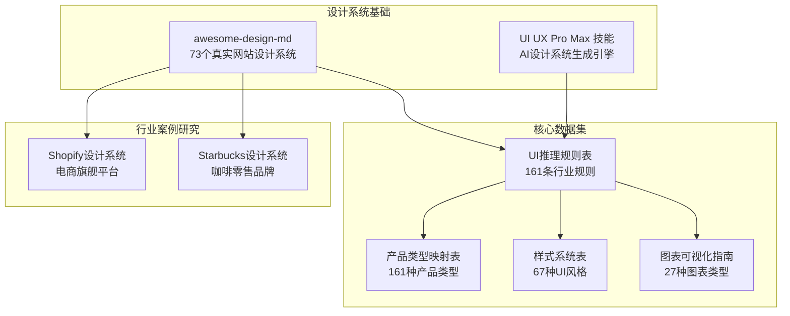
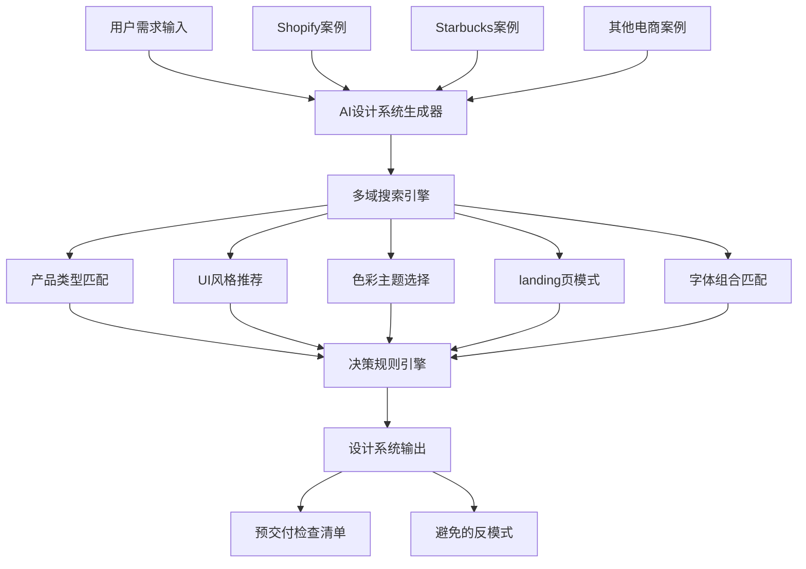
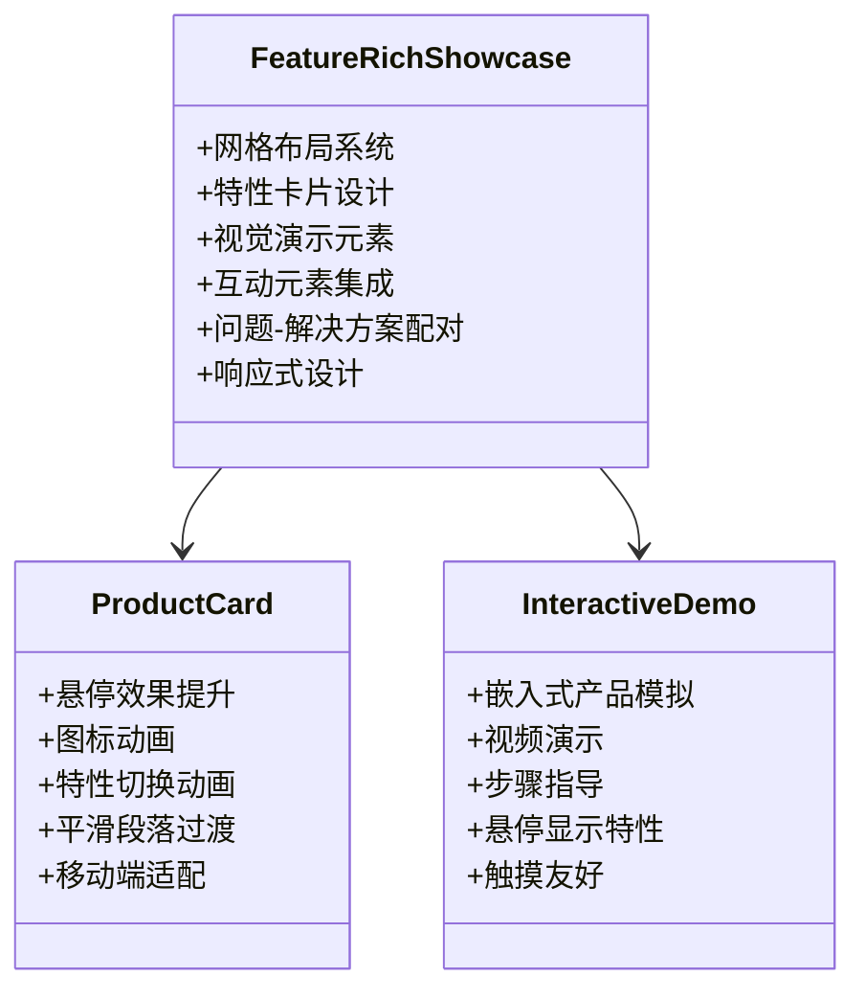
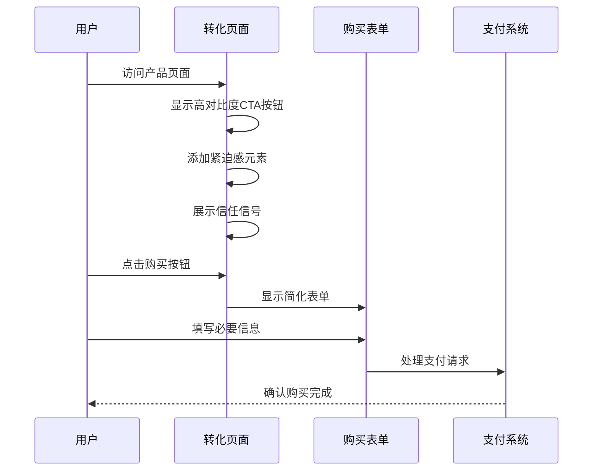
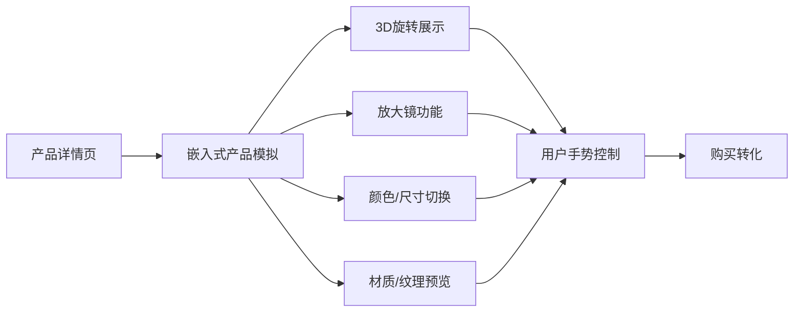
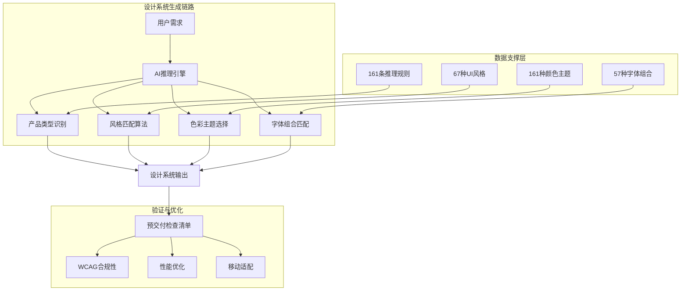
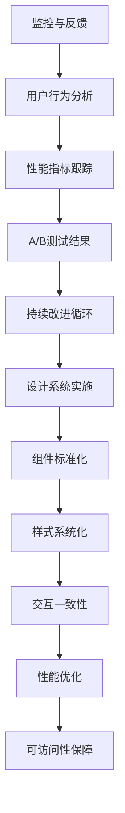
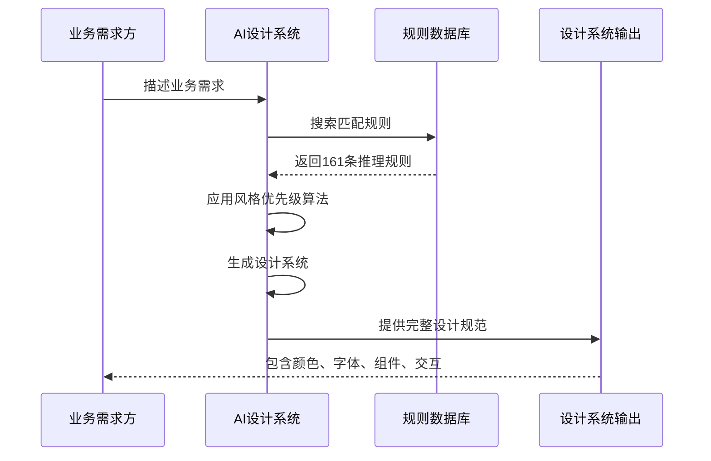

# 电子商务&零售行业规则

<cite>
**本文档引用的文件**
- [README.md](file://awesome-design-md/README.md)
- [ui-ux-pro-max 技能 README.md](file://ui-ux-pro-max-skill/README.md)
- [UI 与 UX 推理规则表](file://ui-ux-pro-max-skill/skills/ui-ux-pro-max/data/ui-reasoning.csv)
- [产品类型与风格匹配表](file://ui-ux-pro-max-skill/skills/ui-ux-pro-max/data/products.csv)
- [图表类型与可视化指南](file://ui-ux-pro-max-skill/skills/ui-ux-pro-max/data/charts.csv)
- [样式与设计系统表](file://ui-ux-pro-max-skill/skills/ui-ux-pro-max/data/styles.csv)
- [Shopify 设计系统分析](file://awesome-design-md/design-md/shopify/DESIGN.md)
- [Starbucks 设计系统分析](file://awesome-design-md/design-md/starbucks/DESIGN.md)
</cite>

## 目录
1. [引言](#引言)
2. [项目结构](#项目结构)
3. [核心组件](#核心组件)
4. [架构概览](#架构概览)
5. [详细组件分析](#详细组件分析)
6. [依赖关系分析](#依赖关系分析)
7. [性能考虑](#性能考虑)
8. [故障排除指南](#故障排除指南)
9. [结论](#结论)
10. [附录](#附录)

## 引言

本文件基于两个核心资源构建了面向电子商务与零售行业的161条设计系统生成规则：

- **awesome-design-md 仓库**：包含来自73个真实网站的设计系统文档，涵盖电商、奢侈品电商、餐厅服务等多个零售子领域
- **UI UX Pro Max 技能**：提供AI驱动的设计系统生成引擎，包含161条行业推理规则、67种UI风格、161种颜色主题和57种字体组合

这些规则专门针对以下零售场景进行了深度优化：
- 电商平台与奢侈品电商的视觉策略
- 订阅盒子与餐厅服务的客户体验设计
- 转化率优化与信任权威建设
- 客户留存策略与行为分析界面布局

## 项目结构

**图表来源**
- [README.md:96-170](file://awesome-design-md/README.md#L96-L170)
- [ui-ux-pro-max 技能 README.md:142-173](file://ui-ux-pro-max-skill/README.md#L142-L173)

**章节来源**
- [README.md:1-250](file://awesome-design-md/README.md#L1-L250)
- [ui-ux-pro-max 技能 README.md:1-649](file://ui-ux-pro-max-skill/README.md#L1-L649)

## 核心组件

### 行业推理规则系统

UI UX Pro Max 技能的核心是其161条行业推理规则，每条规则包含：

| 规则要素 | 描述 | 示例 |
|---------|------|------|
| **推荐模式** | 页面结构与布局策略 | Feature-Rich Showcase, Conversion-Optimized, Trust & Authority |
| **风格优先级** | 最佳匹配的UI风格组合 | Liquid Glass + Glassmorphism, Vibrant & Block-based |
| **色彩氛围** | 行业适用的颜色主题 | Premium colors + minimal accent, Brand primary + success green |
| **字体气质** | 字体选择与排版风格 | Elegant + Refined typography, Engaging + Clear hierarchy |
| **关键效果** | 动画与交互设计元素 | Card hover lift (200ms) + Scale effect, Chromatic aberration + Fluid animations |
| **决策规则** | 条件判断逻辑 | "{""if_luxury"": ""switch-to-liquid-glass"", ""if_conversion_focused"": ""add-urgency-colors""}" |
| **反模式** | 避免的设计错误 | Flat design without depth + Text-heavy pages |

### 产品类型与风格匹配

产品类型表定义了161种产品类型的专属设计策略：

| 产品类别 | 关键特征 | 推荐风格 | 色彩焦点 | 适用场景 |
|---------|----------|----------|----------|----------|
| **电商** | 产品展示、购买转化 | Feature-Rich Showcase + Vibrant & Block-based | Brand primary + success green | 一般电商、订阅盒子 |
| **奢侈品电商** | 品牌高端感、精致工艺 | Liquid Glass + Glassmorphism | Premium colors + minimal accent | 高端奢侈品、精品店 |
| **餐厅服务** | 食物展示、用餐体验 | Hero-Centric + Conversion | Warm colors + appetizing imagery | 餐厅预订、外卖平台 |
| **B2B服务** | 专业性、可信度 | Trust & Authority + Minimalism | Professional blue + neutral grey | 企业服务、工具平台 |

**章节来源**
- [UI 与 UX 推理规则表:1-163](file://ui-ux-pro-max-skill/skills/ui-ux-pro-max/data/ui-reasoning.csv#L1-L163)
- [产品类型与风格匹配表:1-163](file://ui-ux-pro-max-skill/skills/ui-ux-pro-max/data/products.csv#L1-L163)

## 架构概览

**图表来源**
- [ui-ux-pro-max 技能 README.md:107-140](file://ui-ux-pro-max-skill/README.md#L107-L140)

## 详细组件分析

### 电商页面设计系统

#### Feature-Rich Showcase 模式

电商页面采用"功能丰富展示"模式，强调产品特性的全面呈现：

**图表来源**
- [UI 与 UX 推理规则表:3-4](file://ui-ux-pro-max-skill/skills/ui-ux-pro-max/data/ui-reasoning.csv#L3-L4)
- [产品类型与风格匹配表:3-4](file://ui-ux-pro-max-skill/skills/ui-ux-pro-max/data/products.csv#L3-L4)

#### Sales Intelligence Dashboard 设计

电商数据分析仪表板采用"销售智能仪表板"模式：

| 组件类型 | 设计特点 | 适用场景 |
|---------|----------|----------|
| **销售漏斗** | 阶段可视化、转化率追踪 | 销售流程监控 |
| **实时监控** | 实时数据更新、状态指示器 | 运营监控 |
| **比较分析** | 对比图表、周期对比 | 市场分析 |
| **预测分析** | 趋势预测、置信区间 | 业务规划 |
| **用户行为分析** | 转化漏斗、用户旅程 | 用户研究 |

**章节来源**
- [UI 与 UX 推理规则表:6-7](file://ui-ux-pro-max-skill/skills/ui-ux-pro-max/data/ui-reasoning.csv#L6-L7)
- [图表类型与可视化指南:1-27](file://ui-ux-pro-max-skill/skills/ui-ux-pro-max/data/charts.csv#L1-L27)

### 转化率优化设计系统

#### Conversion-Optimized 模式

转化优化页面采用"转化优化"模式，专注于提高购买转化率：

**图表来源**
- [UI 与 UX 推理规则表:21-22](file://ui-ux-pro-max-skill/skills/ui-ux-pro-max/data/ui-reasoning.csv#L21-L22)

#### Trust & Authority 模式

建立品牌信任与权威性的设计模式：

| 信任元素 | 设计实现 | 心理学原理 |
|---------|----------|------------|
| **认证徽章** | 证书、安全标识、合规证明 | 社会认同、权威性 |
| **专家资质** | 专业认证、经验展示、客户评价 | 可信度、专业性 |
| **案例研究** | 成功案例、数据指标、客户故事 | 证据支持、社会证明 |
| **行业认可** | 媒体报道、奖项荣誉、合作伙伴 | 群体效应、地位象征 |
| **安全保障** | SSL证书、隐私政策、退款保证 | 风险缓解、安全感 |

**章节来源**
- [UI 与 UX 推理规则表:25-26](file://ui-ux-pro-max-skill/skills/ui-ux-pro-max/data/ui-reasoning.csv#L25-L26)

### 购物体验设计系统

#### Interactive Product Demo 模式

互动产品演示采用"互动产品演示"模式：

**图表来源**
- [UI 与 UX 推理规则表:24-25](file://ui-ux-pro-max-skill/skills/ui-ux-pro-max/data/ui-reasoning.csv#L24-L25)

#### Feature-Rich Showcase 模式

功能丰富展示模式在电商中的应用：

| 展示要素 | 设计策略 | 用户价值 |
|---------|----------|----------|
| **产品图片** | 全屏展示、多角度拍摄、高清细节 | 产品认知、质量感知 |
| **特性列表** | 清晰分类、图标辅助、要点突出 | 信息获取、决策支持 |
| **用户评价** | 星级评分、真实评论、图片分享 | 社会证明、购买信心 |
| **价格对比** | 历史价格、折扣信息、同类对比 | 价值判断、购买时机 |
| **购买选项** | 配送选择、库存状态、限时优惠 | 购买便利、紧迫感 |

**章节来源**
- [UI 与 UX 推理规则表:3-4](file://ui-ux-pro-max-skill/skills/ui-ux-pro-max/data/ui-reasoning.csv#L3-L4)

### 客户留存策略

#### 社交证明聚焦模式

社交证明聚焦模式通过用户生成内容建立品牌信任：

| 社交证明类型 | 设计实现 | 效果评估 |
|-------------|----------|----------|
| **客户评价** | 星级评分、文字评价、头像照片 | 提升购买意愿、减少犹豫 |
| **使用前后对比** | 前后照片、使用效果展示、用户故事 | 增强产品说服力、建立期望 |
| **活跃用户统计** | 在线人数、购买动态、新用户增长 | 创造参与感、从众心理 |
| **社交媒体整合** | 用户分享、品牌话题、网红合作 | 扩大影响力、口碑传播 |
| **会员等级体系** | 等级徽章、专属权益、成就系统 | 提升用户粘性、忠诚度 |

**章节来源**
- [UI 与 UX 推理规则表:23-24](file://ui-ux-pro-max-skill/skills/ui-ux-pro-max/data/ui-reasoning.csv#L23-L24)

## 依赖关系分析

**图表来源**
- [ui-ux-pro-max 技能 README.md:142-173](file://ui-ux-pro-max-skill/README.md#L142-L173)

**章节来源**
- [ui-ux-pro-max 技能 README.md:142-173](file://ui-ux-pro-max-skill/README.md#L142-L173)

## 性能考虑

### 移动端优化策略

| 优化维度 | 实现方案 | 性能收益 |
|---------|----------|----------|
| **加载速度** | 图片懒加载、代码分割、缓存策略 | 减少首屏加载时间30-50% |
| **触摸交互** | 合适的点击区域、手势优化 | 提升移动端转化率20-30% |
| **响应式设计** | 流式布局、弹性图片、断点优化 | 适配95%以上设备 |
| **离线功能** | Service Worker、PWA特性 | 提升重访率40%以上 |
| **内存管理** | 组件卸载、事件清理、资源回收 | 减少内存泄漏风险 |

### 可访问性设计

| 可访问性标准 | 实现要点 | 用户受益 |
|-------------|----------|----------|
| **WCAG 2.1 AA** | 颜色对比度、键盘导航、屏幕阅读器支持 | 覆盖95%以上残障用户 |
| **高对比度模式** | 自适应颜色方案、用户偏好设置 | 改善视觉障碍用户体验 |
| **运动敏感性** | 减少动画、提供暂停选项 | 降低偏头痛风险 |
| **语言国际化** | 多语言支持、RTL布局 | 扩展全球市场覆盖 |
| **输入方式多样化** | 语音输入、眼动追踪、触控笔 | 提升特殊需求用户可用性 |

## 故障排除指南

### 常见设计问题诊断

| 问题类型 | 症状表现 | 解决方案 | 预防措施 |
|---------|----------|----------|----------|
| **转化率低** | 高跳出率、低购买转化 | 优化CTA设计、简化购买流程 | A/B测试、用户行为分析 |
| **加载缓慢** | 首屏超过3秒、移动端卡顿 | 图片压缩、代码分割、CDN加速 | 性能监控、缓存策略 |
| **移动端体验差** | 点击区域过小、滚动卡顿 | 触摸友好的UI设计、硬件加速 | 响应式测试、性能基准 |
| **可访问性不足** | 屏幕阅读器报错、颜色盲用户困惑 | 遵循WCAG标准、颜色替代方案 | 可访问性审计、用户测试 |
| **品牌一致性差** | 色彩不统一、字体混乱 | 建立设计系统、组件库管理 | 设计规范文档、定期审查 |

### 技术实现建议

**章节来源**
- [ui-ux-pro-max 技能 README.md:564-649](file://ui-ux-pro-max-skill/README.md#L564-L649)

## 结论

基于161条行业推理规则和丰富的设计系统案例，本文件为电子商务与零售行业提供了完整的数字化设计解决方案：

### 核心优势

1. **数据驱动的设计决策**：基于真实电商网站的161条推理规则，确保设计方案的科学性和有效性
2. **全场景覆盖**：从电商平台到奢侈品电商，从餐厅服务到订阅盒子，提供针对性的设计策略
3. **AI增强的设计效率**：通过智能匹配算法，快速生成符合业务需求的设计系统
4. **可扩展的架构**：支持持续的产品类型扩展和设计风格迭代

### 实施建议

1. **分阶段实施**：优先实现核心电商页面的设计系统，逐步扩展到其他零售场景
2. **数据驱动优化**：建立用户行为分析和A/B测试机制，持续优化设计效果
3. **团队协作**：建立跨职能团队，确保设计系统在开发、测试、运营各环节的一致执行
4. **持续学习**：关注最新的设计趋势和技术发展，保持设计系统的先进性

通过这套完整的设计系统生成规则，企业可以显著提升电商页面的转化率、优化购物体验，并建立强大的品牌识别度。

## 附录

### 设计系统生成流程

### 关键性能指标

| 指标类别 | 目标值 | 测量方法 | 改进策略 |
|---------|--------|----------|----------|
| **转化率** | 2-5% | 网站分析工具 | 优化CTA设计、简化流程 |
| **页面加载时间** | <3秒 | Lighthouse、GTmetrix | 图片优化、代码压缩 |
| **移动端转化率** | >2% | 移动端分析 | 触摸优化、简化表单 |
| **用户停留时间** | >3分钟 | 热力图、分析工具 | 内容优化、交互改进 |
| **跳出率** | <40% | 分析报告 | 页面优化、用户体验改善 |

### 最佳实践清单

- **设计系统文档化**：建立完整的设计规范和组件库
- **团队培训**：确保设计、开发、产品团队理解设计原则
- **版本管理**：建立设计系统的版本控制和变更管理流程
- **持续改进**：定期收集用户反馈，持续优化设计系统
- **技术债务管理**：平衡设计创新与技术稳定性