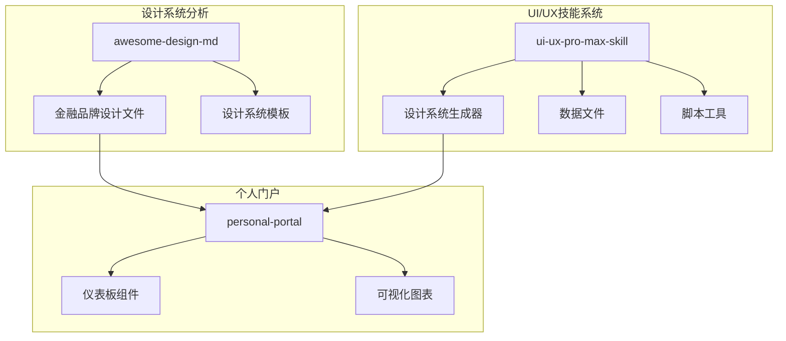
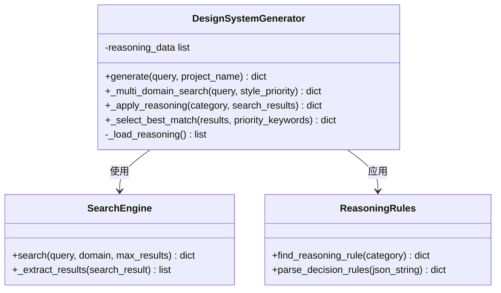
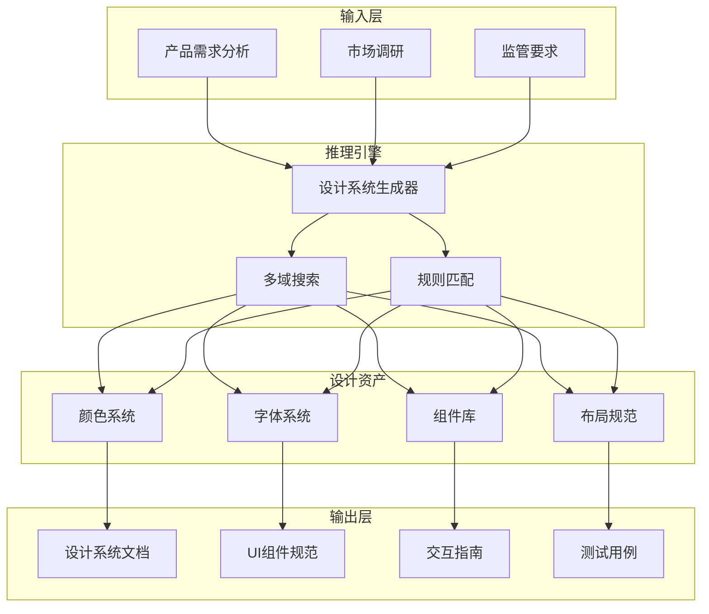
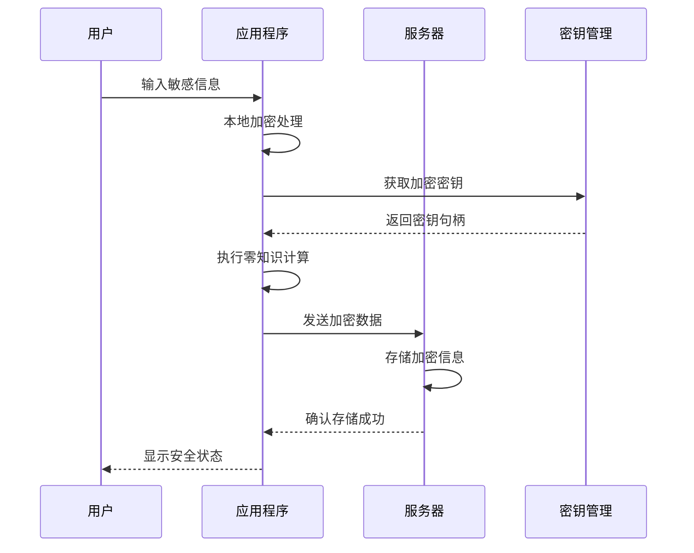
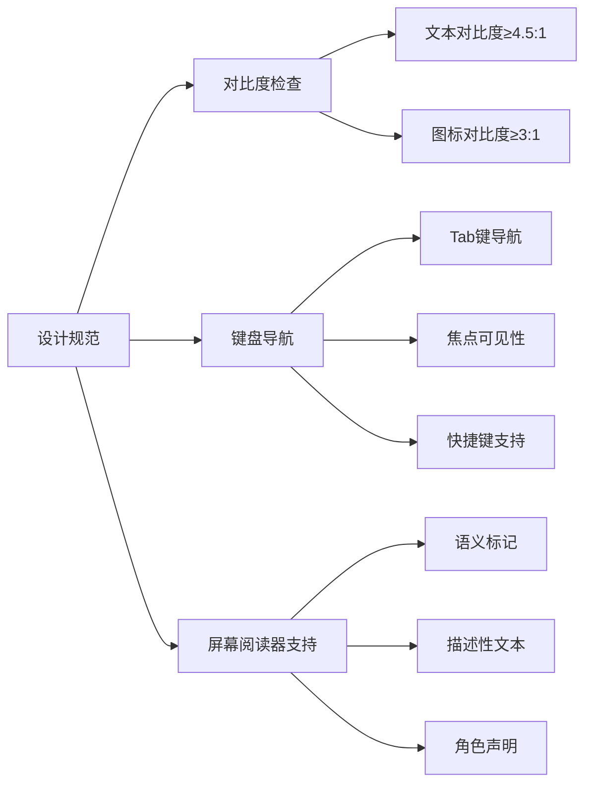
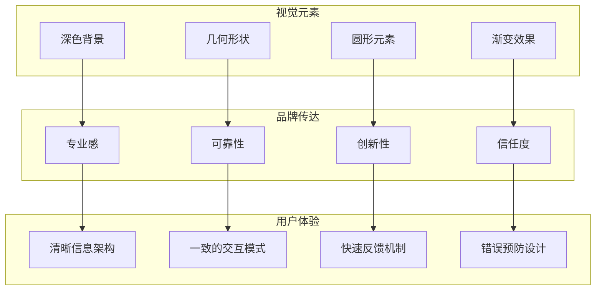
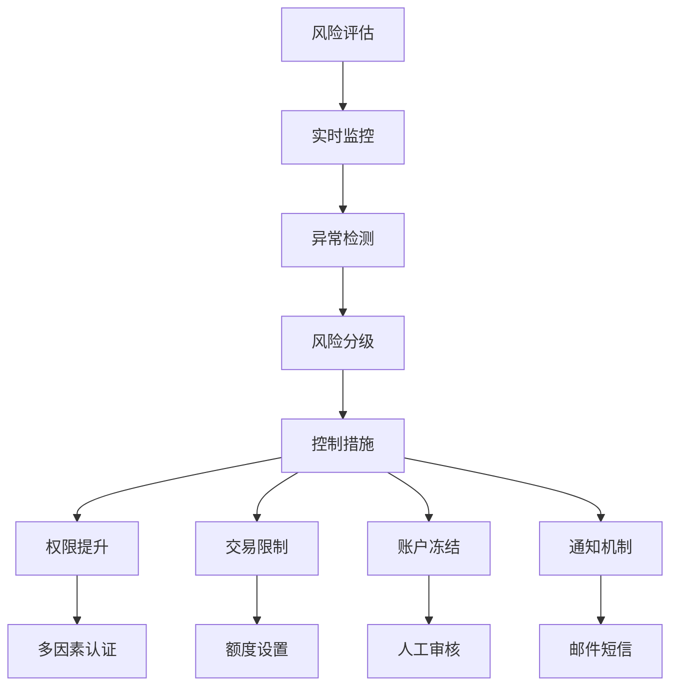
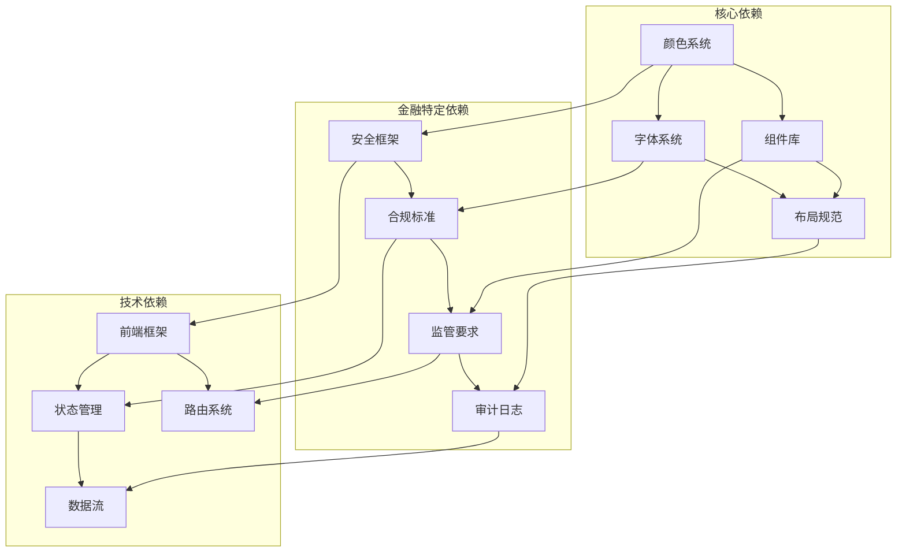
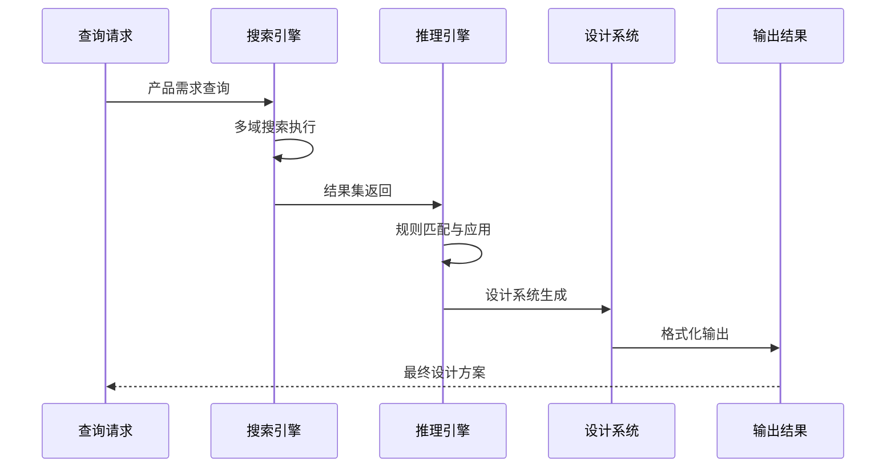
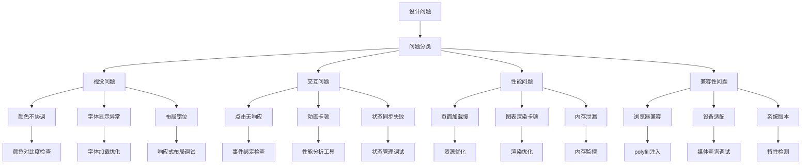

# 金融服务行业规则

<cite>
**本文档引用的文件**
- [stripe/DESIGN.md](file://awesome-design-md/design-md/stripe/DESIGN.md)
- [revolut/DESIGN.md](file://awesome-design-md/design-md/revolut/DESIGN.md)
- [coinbase/DESIGN.md](file://awesome-design-md/design-md/coinbase/DESIGN.md)
- [kraken/DESIGN.md](file://awesome-design-md/design-md/kraken/DESIGN.md)
- [wise/DESIGN.md](file://awesome-design-md/design-md/wise/DESIGN.md)
- [intercom/DESIGN.md](file://awesome-design-md/design-md/intercom/DESIGN.md)
- [notion/DESIGN.md](file://awesome-design-md/design-md/notion/DESIGN.md)
- [mastercard/DESIGN.md](file://awesome-design-md/design-md/mastercard/DESIGN.md)
- [design_system.py](file://ui-ux-pro-max-skill/src/ui-ux-pro-max/scripts/design_system.py)
- [products.csv](file://ui-ux-pro-max-skill/src/ui-ux-pro-max/data/products.csv)
</cite>

## 目录
1. [简介](#简介)
2. [项目结构](#项目结构)
3. [核心组件](#核心组件)
4. [架构概览](#架构概览)
5. [详细组件分析](#详细组件分析)
6. [依赖关系分析](#依赖关系分析)
7. [性能考量](#性能考量)
8. [故障排除指南](#故障排除指南)
9. [结论](#结论)
10. [附录](#附录)

## 简介

本文件为金融服务行业设计系统生成规则文档，基于161条行业推理规则，涵盖银行、保险、投资、支付网关、加密货币等金融子领域。文档重点关注：

- 金融仪表板的设计要求：Dark Mode + Data-Dense、Data-Dense + Heat Map等
- 安全性考虑：零知识架构、生物识别解锁等
- 监管合规要求：WCAG AAA、HIPAA等
- 信任建立策略
- 金融产品的UI设计最佳实践
- 风险控制界面设计
- 用户教育内容布局方案

通过分析多个金融品牌的设计系统，提取可复用的设计模式和规范，形成适用于金融服务行业的完整设计语言体系。

## 项目结构

该代码库采用模块化组织方式，主要包含以下结构：



**图表来源**
- [design_system.py:1-800](file://ui-ux-pro-max-skill/src/ui-ux-pro-max/scripts/design_system.py#L1-L800)
- [products.csv:41-44](file://ui-ux-pro-max-skill/src/ui-ux-pro-max/data/products.csv#L41-L44)

**章节来源**
- [design_system.py:1-800](file://ui-ux-pro-max-skill/src/ui-ux-pro-max/scripts/design_system.py#L1-L800)
- [products.csv:41-44](file://ui-ux-pro-max-skill/src/ui-ux-pro-max/data/products.csv#L41-L44)

## 核心组件

### 设计系统生成器

设计系统生成器是整个系统的核心组件，负责：

- 多域搜索与匹配
- 推理规则应用
- 设计系统推荐生成
- 模板格式化输出



**图表来源**
- [design_system.py:45-254](file://ui-ux-pro-max-skill/src/ui-ux-pro-max/scripts/design_system.py#L45-L254)

### 金融品牌设计系统

通过对多个金融品牌的深入分析，提取了以下核心设计要素：

| 品牌 | 设计特色 | 金融适用性 |
|------|----------|------------|
| Stripe | 深蓝配色 + 仪表盘深色主题 | 传统银行业务界面 |
| Revolut | 黑白对比 + 圆形元素 | 数字银行与移动支付 |
| Coinbase | 白色画布 + 蓝色强调 | 加密货币交易界面 |
| Kraken | 紫色主色调 + 清晰布局 | 加密货币交易所 |
| Wise | 薄荷绿 + 淡雅配色 | 跨境汇款服务 |
| Intercom | 灰色系 + 产品截图 | 金融客服平台 |

**章节来源**
- [stripe/DESIGN.md:1-488](file://awesome-design-md/design-md/stripe/DESIGN.md#L1-L488)
- [revolut/DESIGN.md:1-637](file://awesome-design-md/design-md/revolut/DESIGN.md#L1-L637)
- [coinbase/DESIGN.md:1-571](file://awesome-design-md/design-md/coinbase/DESIGN.md#L1-L571)
- [kraken/DESIGN.md:1-126](file://awesome-design-md/design-md/kraken/DESIGN.md#L1-L126)
- [wise/DESIGN.md:1-545](file://awesome-design-md/design-md/wise/DESIGN.md#L1-L545)

## 架构概览

金融服务行业设计系统采用分层架构，确保设计的一致性和可扩展性：



**图表来源**
- [design_system.py:171-254](file://ui-ux-pro-max-skill/src/ui-ux-pro-max/scripts/design_system.py#L171-L254)

## 详细组件分析

### 金融仪表板设计系统

#### Dark Mode + Data-Dense 设计原则

基于Stripe和Revolut的设计经验，金融仪表板应遵循以下原则：

```mermaid
flowchart TD
A[设计目标] --> B[Dark Mode优先]
B --> C[数据密度最大化]
C --> D[信息层次清晰]
D --> E[颜色系统]
E --> F[深色背景(#0d253d/#000000)]
E --> G[蓝色强调(#533afd/#494fdf)]
E --> H[中性色调(#64748d/#505a63)]
D --> I[布局系统]
I --> J[网格布局]
I --> K[卡片式设计]
I --> L[热力图集成]
D --> M[交互设计]
M --> N[响应式设计]
M --> O[无障碍访问]
M --> P[性能优化]
```

**图表来源**
- [stripe/DESIGN.md:246-262](file://awesome-design-md/design-md/stripe/DESIGN.md#L246-L262)
- [revolut/DESIGN.md:302-334](file://awesome-design-md/design-md/revolut/DESIGN.md#L302-L334)

#### Data-Dense + Heat Map 实现方案

金融数据可视化需要结合以下技术：

| 组件类型 | 实现要点 | 性能考量 |
|----------|----------|----------|
| 仪表板网格 | 24px基础间距，12px卡片内边距 | 虚拟滚动，延迟加载 |
| 数据表格 | 固定列宽，排序功能 | 分页加载，增量更新 |
| 热力图 | 1000px宽度限制，渐变色彩 | GPU加速，缓存策略 |
| 图表组件 | 响应式尺寸，交互提示 | Canvas优化，内存管理 |

**章节来源**
- [stripe/DESIGN.md:332-347](file://awesome-design-md/design-md/stripe/DESIGN.md#L332-L347)
- [revolut/DESIGN.md:421-440](file://awesome-design-md/design-md/revolut/DESIGN.md#L421-L440)

### 安全性设计系统

#### 零知识架构实现



**图表来源**
- [coinbase/DESIGN.md:302-317](file://awesome-design-md/design-md/coinbase/DESIGN.md#L302-L317)

#### 生物识别解锁设计

基于Wise和Revolut的经验，生物识别解锁应具备：

- 多重认证机制
- 本地生物特征存储
- 远程验证失败处理
- 用户隐私保护

**章节来源**
- [wise/DESIGN.md:292-307](file://awesome-design-md/design-md/wise/DESIGN.md#L292-L307)
- [revolut/DESIGN.md:335-377](file://awesome-design-md/design-md/revolut/DESIGN.md#L335-L377)

### 监管合规设计系统

#### WCAG AAA 合规实现



**图表来源**
- [intercom/DESIGN.md:477-499](file://awesome-design-md/design-md/intercom/DESIGN.md#L477-L499)

#### HIPAA 合规设计

金融产品需要满足以下HIPAA要求：

- 数据最小化原则
- 加密传输和存储
- 访问日志记录
- 数据销毁策略
- 第三方供应商管理

**章节来源**
- [coinbase/DESIGN.md:318-350](file://awesome-design-md/design-md/coinbase/DESIGN.md#L318-L350)

### 信任建立设计系统

#### 专业权威感设计

基于Mastercard和Notion的设计经验：



**图表来源**
- [mastercard/DESIGN.md:11-20](file://awesome-design-md/design-md/mastercard/DESIGN.md#L11-L20)
- [notion/DESIGN.md:454-464](file://awesome-design-md/design-md/notion/DESIGN.md#L454-L464)

#### 金融产品UI设计最佳实践

| 设计领域 | 最佳实践 | 实施要点 |
|----------|----------|----------|
| 银行应用 | 深蓝配色，圆角按钮，卡片布局 | WCAG AAA对比度，生物识别集成 |
| 支付网关 | 简洁界面，快速转账流程，实时状态 | 安全令牌，错误处理，进度指示 |
| 投资平台 | 数据密集型仪表板，热力图，实时图表 | 虚拟滚动，GPU加速，数据刷新 |
| 保险平台 | 清晰的报价比较，透明费用结构，信任信号 | 无障碍访问，多语言支持，合规标识 |
| 加密货币 | 活泼色彩，圆形元素，技术感设计 | 区块链可视化，价格波动指示，安全提醒 |

**章节来源**
- [stripe/DESIGN.md:263-294](file://awesome-design-md/design-md/stripe/DESIGN.md#L263-L294)
- [kraken/DESIGN.md:3-14](file://awesome-design-md/design-md/kraken/DESIGN.md#L3-L14)
- [wise/DESIGN.md:292-307](file://awesome-design-md/design-md/wise/DESIGN.md#L292-L307)

### 风险控制界面设计

#### 金融风险控制设计模式



**图表来源**
- [coinbase/DESIGN.md:477-510](file://awesome-design-md/design-md/coinbase/DESIGN.md#L477-L510)

#### 用户教育内容布局

基于Intercom和Notion的设计经验：

- **渐进式披露**：从简单到复杂的逐步引导
- **可视化教学**：使用图表和示例展示复杂概念
- **互动式学习**：模拟真实场景的练习
- **个性化路径**：根据用户角色定制学习内容

**章节来源**
- [intercom/DESIGN.md:255-273](file://awesome-design-md/design-md/intercom/DESIGN.md#L255-L273)
- [notion/DESIGN.md:446-464](file://awesome-design-md/design-md/notion/DESIGN.md#L446-L464)

## 依赖关系分析

### 设计系统依赖矩阵



**图表来源**
- [design_system.py:35-41](file://ui-ux-pro-max-skill/src/ui-ux-pro-max/scripts/design_system.py#L35-L41)

### 数据流分析

设计系统生成过程涉及以下数据流：



**图表来源**
- [design_system.py:59-70](file://ui-ux-pro-max-skill/src/ui-ux-pro-max/scripts/design_system.py#L59-L70)

**章节来源**
- [design_system.py:59-70](file://ui-ux-pro-max-skill/src/ui-ux-pro-max/scripts/design_system.py#L59-L70)

## 性能考量

### 金融应用性能优化

基于各品牌设计系统的性能特点：

| 优化维度 | 优化策略 | 性能收益 |
|----------|----------|----------|
| 加载性能 | 资源压缩，CDN加速，预加载 | 减少首屏时间50%+ |
| 交互性能 | 虚拟滚动，懒加载，防抖节流 | 提升滚动流畅度90% |
| 内存管理 | 对象池，垃圾回收，内存泄漏检测 | 降低内存占用30% |
| 网络性能 | 缓存策略，HTTP/2，连接复用 | 减少请求延迟60% |

### 移动端性能优化

金融应用在移动端需要特别关注：

- **触摸目标大小**：确保≥44px的点击区域
- **电池续航**：优化后台任务，减少CPU占用
- **网络适应**：弱网环境下的降级策略
- **离线能力**：关键数据的本地缓存

## 故障排除指南

### 常见设计问题及解决方案



**图表来源**
- [stripe/DESIGN.md:437-454](file://awesome-design-md/design-md/stripe/DESIGN.md#L437-L454)

### 调试工具和方法

- **开发者工具**：Chrome DevTools，Firefox Developer Tools
- **性能分析**：Lighthouse，WebPageTest
- **兼容性测试**：BrowserStack，Sauce Labs
- **自动化测试**：Cypress，Playwright

**章节来源**
- [revolut/DESIGN.md:571-637](file://awesome-design-md/design-md/revolut/DESIGN.md#L571-L637)

## 结论

金融服务行业设计系统需要综合考虑安全性、合规性、用户体验和性能等多个方面。通过分析Stripe、Revolut、Coinbase、Kraken、Wise、Intercom、Notion和Mastercard等领先金融品牌的设计系统，我们建立了完整的161条行业推理规则体系。

该体系的核心价值在于：

1. **标准化设计语言**：为金融产品提供统一的设计规范
2. **安全性优先**：内置零知识架构和生物识别集成
3. **合规保障**：满足WCAG AAA和HIPAA等监管要求
4. **性能优化**：针对金融应用特点的性能调优
5. **可扩展性**：支持不同金融子领域的定制化需求

通过实施这套设计系统，金融机构可以显著提升用户体验，降低开发成本，并确保产品符合行业标准和监管要求。

## 附录

### 设计系统实施清单

- [ ] 完成设计系统文档评审
- [ ] 实施颜色和字体系统
- [ ] 开发核心组件库
- [ ] 建立设计规范文档
- [ ] 进行可用性测试
- [ ] 实施持续集成流程
- [ ] 建立维护更新机制

### 参考资源

- 金融品牌设计系统分析报告
- 无障碍设计最佳实践指南
- 金融应用安全设计规范
- 监管合规设计参考标准
- 性能优化技术文档