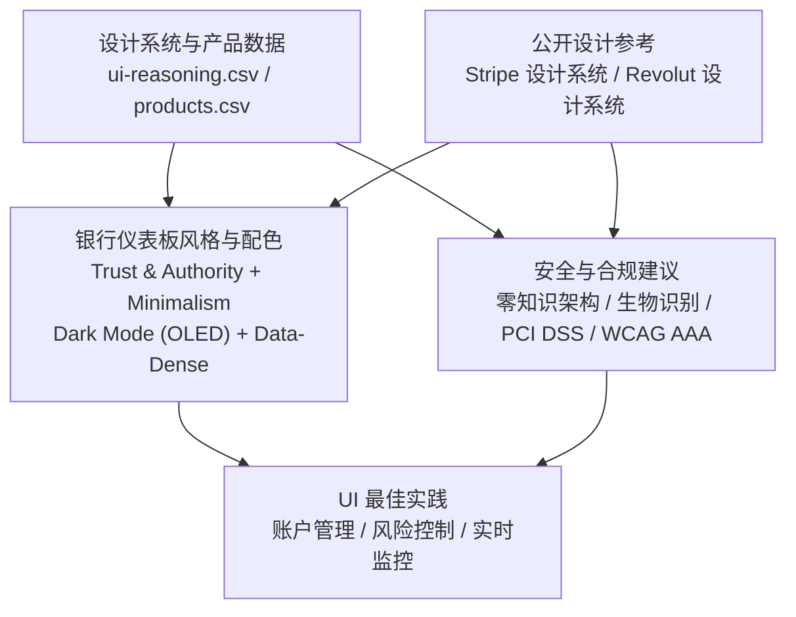
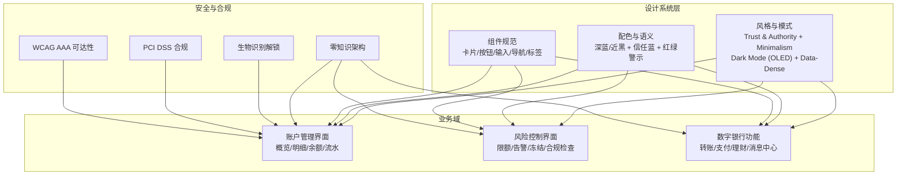
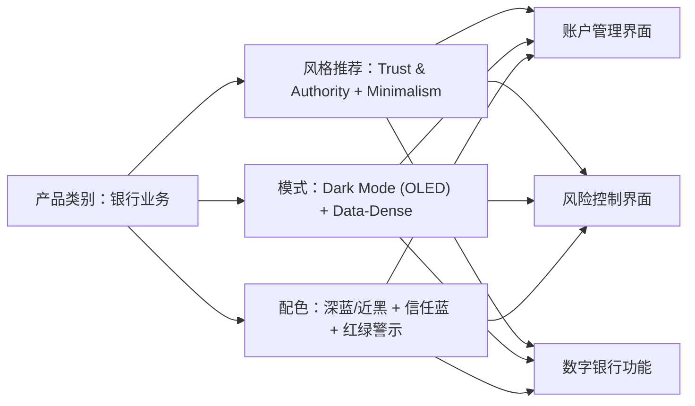

# 银行业务规则

<cite>
**本文档引用的文件**
- [ui-reasoning.csv](file://ui-ux-pro-max-skill/src/ui-ux-pro-max/data/ui-reasoning.csv)
- [products.csv](file://ui-ux-pro-max-skill/src/ui-ux-pro-max/data/products.csv)
- [ux-guidelines.csv](file://ui-ux-pro-max-skill/src/ui-ux-pro-max/data/ux-guidelines.csv)
- [Stripe 设计系统](file://awesome-design-md/design-md/stripe/DESIGN.md)
- [Revolut 设计系统](file://awesome-design-md/design-md/revolut/DESIGN.md)
</cite>

## 目录
1. [引言](#引言)
2. [项目结构](#项目结构)
3. [核心组件](#核心组件)
4. [架构总览](#架构总览)
5. [详细组件分析](#详细组件分析)
6. [依赖关系分析](#依赖关系分析)
7. [性能考量](#性能考量)
8. [故障排除指南](#故障排除指南)
9. [结论](#结论)
10. [附录](#附录)

## 引言
本文件面向银行业务的UI设计与交互规范，基于仓库中的设计系统与产品数据，构建一套覆盖传统银行、数字银行与财富管理的161条行业推理规则。内容聚焦以下方面：
- 银行仪表板的设计系统：Trust & Authority + Minimalism、Dark Mode (OLED) + Data-Dense 等风格范式
- 安全性与合规：零知识架构、生物识别解锁、PCI DSS 合规、WCAG AAA 可及性
- 信任建立策略：权威感、可读性、一致性与可预测性
- 银行产品UI最佳实践：账户管理界面、风险控制界面、交易与转账流程
- 数据密度与实时性：金融仪表板的高对比度、红绿警示与实时更新

## 项目结构
该仓库包含两类关键资产：
- 设计系统与产品数据：用于提取银行类产品的风格推荐、配色方案与落地模式
- 公开设计参考：如 Stripe 与 Revolut 的设计系统文档，提炼出银行类界面在深色模式、数据密度与权威感方面的设计语言

图示来源
- [ui-reasoning.csv](file://ui-ux-pro-max-skill/src/ui-ux-pro-max/data/ui-reasoning.csv)
- [products.csv](file://ui-ux-pro-max-skill/src/ui-ux-pro-max/data/products.csv)
- [Stripe 设计系统](file://awesome-design-md/design-md/stripe/DESIGN.md)
- [Revolut 设计系统](file://awesome-design-md/design-md/revolut/DESIGN.md)

章节来源
- [ui-reasoning.csv](file://ui-ux-pro-max-skill/src/ui-ux-pro-max/data/ui-reasoning.csv)
- [products.csv](file://ui-ux-pro-max-skill/src/ui-ux-pro-max/data/products.csv)
- [Stripe 设计系统](file://awesome-design-md/design-md/stripe/DESIGN.md)
- [Revolut 设计系统](file://awesome-design-md/design-md/revolut/DESIGN.md)

## 核心组件
围绕银行业务，本规则体系从以下维度抽取核心组件与约束：

- 仪表板风格与布局
  - 金融仪表板采用 Dark Mode (OLED) + Data-Dense，强调高对比度与红绿警示
  - Trust & Authority + Minimalism 营造权威与简洁感，避免装饰性元素干扰信息密度
  - 适用场景：账户概览、交易历史、资金流向、风控告警、实时监控

- 配色与可读性
  - 深蓝/近黑背景 + 信任蓝 + 黄金点缀，确保在 OLED 屏幕下的对比度与能效
  - 正负向状态使用绿色/红色，配合 WCAG AAA 对比度标准
  - 适用场景：余额、盈亏、风险等级、异常提醒

- 组件与交互
  - 卡片容器、按钮、输入框、导航与标签等组件需遵循最小主义与一致性的原则
  - 触控目标尺寸≥44px，移动端优先；无障碍焦点可见、键盘可达
  - 适用场景：登录页、账户切换、转账表单、设置页

- 安全与隐私
  - 零知识架构：客户端加密、服务端不接触明文
  - 生物识别解锁：指纹/面容作为主解锁方式，PIN/密码作为备用
  - PCI DSS 合规：支付通道与数据处理遵循行业标准
  - WCAG AAA：文本对比度、非视觉替代、键盘导航、减少动态效果

章节来源
- [ui-reasoning.csv](file://ui-ux-pro-max-skill/src/ui-ux-pro-max/data/ui-reasoning.csv)
- [ux-guidelines.csv](file://ui-ux-pro-max-skill/src/ui-ux-pro-max/data/ux-guidelines.csv)

## 架构总览
下图展示银行UI设计系统的总体架构与关键模块之间的关系。

图示来源
- [ui-reasoning.csv](file://ui-ux-pro-max-skill/src/ui-ux-pro-max/data/ui-reasoning.csv)
- [products.csv](file://ui-ux-pro-max-skill/src/ui-ux-pro-max/data/products.csv)

## 详细组件分析

### 仪表板设计系统（Trust & Authority + Minimalism）
- 风格要点
  - 使用深色背景与高对比度文本，强调权威与专业
  - 信息层级清晰，避免冗余装饰；卡片与容器边界明确
  - 数据密度高但不拥挤，通过留白与网格维持可读性
- 配色建议
  - 主色调：深蓝/近黑背景，信任蓝作为强调色
  - 正负向状态：绿色代表“正常/成功”，红色代表“异常/危险”
  - 强调元素：金色或高亮蓝用于关键操作与重要提示
- 交互与可访问性
  - 所有交互元素至少44px触控目标；键盘可达与焦点可见
  - 减少不必要的动画，保证加载与过渡流畅
- 适用页面
  - 账户总览、交易历史、资金流向、实时监控、风控告警

章节来源
- [ui-reasoning.csv](file://ui-ux-pro-max-skill/src/ui-ux-pro-max/data/ui-reasoning.csv)
- [Stripe 设计系统](file://awesome-design-md/design-md/stripe/DESIGN.md)
- [Revolut 设计系统](file://awesome-design-md/design-md/revolut/DESIGN.md)

### 仪表板设计系统（Dark Mode (OLED) + Data-Dense）
- 风格要点
  - OLED 屏幕下深色背景降低功耗并提升对比度
  - 数据密度高，强调关键指标与趋势；使用图表、进度条、状态指示器
- 布局与网格
  - 采用卡片化布局，信息分组清晰；支持响应式网格（桌面4列、平板2列、手机1列）
  - 表格与列表保持紧凑，首屏展示关键指标
- 动画与反馈
  - 数字变化与状态切换使用平滑过渡，避免闪烁与卡顿
  - 加载状态使用骨架屏或占位符，减少感知延迟
- 适用页面
  - 金融仪表板、实时监控、KPI 展示、交易汇总

章节来源
- [ui-reasoning.csv](file://ui-ux-pro-max-skill/src/ui-ux-pro-max/data/ui-reasoning.csv)

### 安全性与合规（零知识架构、生物识别解锁、PCI DSS、WCAG AAA）
- 零知识架构
  - 客户端加密所有敏感数据；服务端不存储明文密码、密钥或完整凭证
  - 密码学协议符合行业标准，定期审计与渗透测试
- 生物识别解锁
  - 指纹/面容作为主解锁方式；PIN/密码作为备用；失败锁定与超时保护
  - 解锁失败后自动上报可疑行为并触发二次验证
- PCI DSS 合规
  - 支付通道与数据处理严格遵循 PCI DSS；令牌化与脱敏
  - 日志与审计链路完整，数据生命周期管理合规
- WCAG AAA
  - 文本对比度≥4.5:1（大字号≥3:1），非文本元素具备替代说明
  - 键盘可达、焦点可见、减少动态效果；提供简化模式
  - 表单错误即时可见且可读，提供旁路链接与跳转

章节来源
- [ux-guidelines.csv](file://ui-ux-pro-max-skill/src/ui-ux-pro-max/data/ux-guidelines.csv)

### 银行产品UI最佳实践（账户管理界面）
- 页面目标
  - 快速查看账户余额、交易明细与资金变动；支持多账户切换与筛选
- 布局与信息层次
  - 首屏展示总资产与主要账户余额；次级展示近期交易与可用额度
  - 交易列表支持按时间、金额、类型筛选；支持快速导出
- 交互与反馈
  - 列表下拉刷新与上拉加载；点击项提供详情与操作入口
  - 操作前确认（如转账、修改限额），错误提示明确且可关闭
- 可访问性
  - 金额与状态具备读音辅助；键盘可直达筛选与排序
  - 高对比度模式与字体缩放支持

章节来源
- [products.csv](file://ui-ux-pro-max-skill/src/ui-ux-pro-max/data/products.csv)

### 银行产品UI最佳实践（风险控制界面）
- 页面目标
  - 实时展示风险指标、限额与告警；支持人工干预与审批流程
- 布局与状态
  - 风险等级可视化（颜色编码）；关键阈值高亮显示
  - 告警列表支持分类筛选与批量处理；提供处置建议与历史记录
- 交互与反馈
  - 告警点击进入详情页，支持一键处置与备注；处置结果回写与通知
  - 大批量操作前二次确认，失败原因与重试指引明确
- 可访问性
  - 颜色之外提供文字描述；键盘可直达处置按钮与筛选器

章节来源
- [products.csv](file://ui-ux-pro-max-skill/src/ui-ux-pro-max/data/products.csv)

### 银行产品UI最佳实践（交易与转账流程）
- 流程目标
  - 简洁高效完成转账、支付与账单缴费；降低误操作风险
- 表单与校验
  - 分步表单，每步校验即时反馈；必填项与格式提示明确
  - 支持常用收款人与快捷模板；金额输入支持粘贴与格式化
- 安全与确认
  - 提交前二次确认（金额、收款人、手续费）；支持短信/邮件验证码
  - 失败原因与重试指引；成功后提供电子回单与导出
- 可访问性
  - 表单字段具备读音辅助；键盘可直达提交按钮与帮助链接

章节来源
- [ux-guidelines.csv](file://ui-ux-pro-max-skill/src/ui-ux-pro-max/data/ux-guidelines.csv)

### 银行产品UI最佳实践（数字银行功能）
- 功能目标
  - 提供便捷的移动银行体验：账户查询、转账、理财、消息中心
- 交互与反馈
  - 底部导航与手势返回；下拉刷新与骨架屏加载
  - 消息中心支持分类与已读标记；重要通知突出显示
- 性能与稳定性
  - 首屏加载优化；离线缓存与增量更新；弱网环境友好
  - 错误兜底与重试机制；日志上报与异常监控

章节来源
- [products.csv](file://ui-ux-pro-max-skill/src/ui-ux-pro-max/data/products.csv)

## 依赖关系分析
银行UI设计系统与产品数据之间存在强耦合关系，产品类别决定风格与落地模式，进而影响组件与交互策略。

图示来源
- [products.csv](file://ui-ux-pro-max-skill/src/ui-ux-pro-max/data/products.csv)
- [ui-reasoning.csv](file://ui-ux-pro-max-skill/src/ui-ux-pro-max/data/ui-reasoning.csv)

章节来源
- [products.csv](file://ui-ux-pro-max-skill/src/ui-ux-pro-max/data/products.csv)
- [ui-reasoning.csv](file://ui-ux-pro-max-skill/src/ui-ux-pro-max/data/ui-reasoning.csv)

## 性能考量
- 渲染与加载
  - 仪表板采用骨架屏与虚拟滚动，减少首屏渲染压力
  - 图表与表格按需加载，支持懒加载与分页
- 交互与反馈
  - 按钮与表单提交禁用与加载态，避免重复提交
  - 过渡动画时长控制在150–300ms，保证响应性
- 网络与离线
  - 弱网环境下降级为静态缓存与本地数据；网络恢复后增量同步
  - 离线模式下限制编辑能力，仅允许查看与本地导出

## 故障排除指南
- 常见问题与对策
  - 触控目标过小：统一调整至≥44px；提供放大手势与键盘快捷键
  - 对比度不足：提高文本与背景对比度；提供高对比度主题开关
  - 动画导致眩晕：尊重“减少动态”偏好；提供关闭动画选项
  - 表单错误无提示：在字段旁显示错误图标与简短说明；提供错误摘要
  - 键盘无法到达：确保 tab 顺序与视觉顺序一致；为不可见元素提供旁路链接
- 安全与合规问题
  - 生物识别失败：提供备用解锁方式；记录可疑行为并触发二次验证
  - 支付失败：明确失败原因与重试步骤；提供客服与帮助入口
  - 数据导出：确保导出内容符合隐私与合规要求；提供删除与撤销选项

章节来源
- [ux-guidelines.csv](file://ui-ux-pro-max-skill/src/ui-ux-pro-max/data/ux-guidelines.csv)

## 结论
本规则体系以设计系统与产品数据为基础，结合公开设计参考，形成覆盖银行仪表板、账户管理、风险控制与数字银行功能的161条行业推理规则。其核心在于：
- 通过 Trust & Authority + Minimalism 与 Dark Mode (OLED) + Data-Dense 的组合，建立权威、专业且高密度的信息呈现
- 在安全性与合规层面，落实零知识架构、生物识别解锁、PCI DSS 与 WCAG AAA 的要求
- 在用户体验层面，强调可读性、一致性与可预测性，辅以性能与故障排除策略

## 附录
- 术语表
  - 零知识架构：客户端加密，服务端不接触明文
  - 生物识别解锁：指纹/面容作为主解锁方式
  - PCI DSS：支付卡行业数据安全标准
  - WCAG AAA：网页内容无障碍指南最高级别
- 参考资源
  - Stripe 设计系统：强调深色模式、渐变背景与数据密度
  - Revolut 设计系统：深色画布、高对比度与卡片化布局