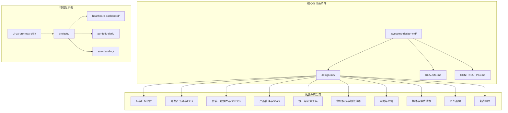
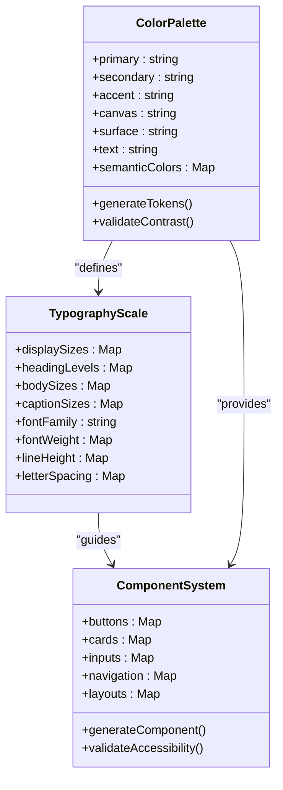
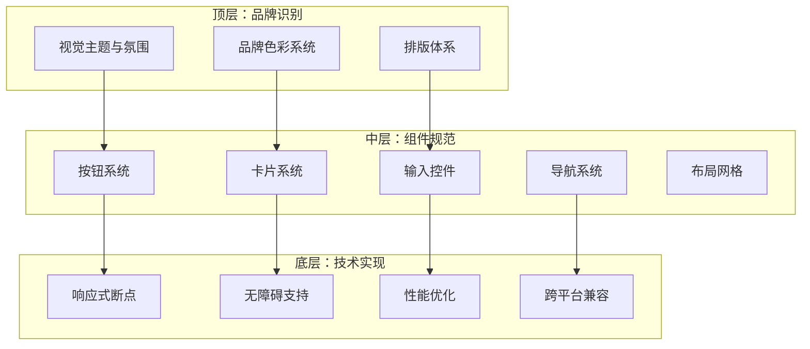
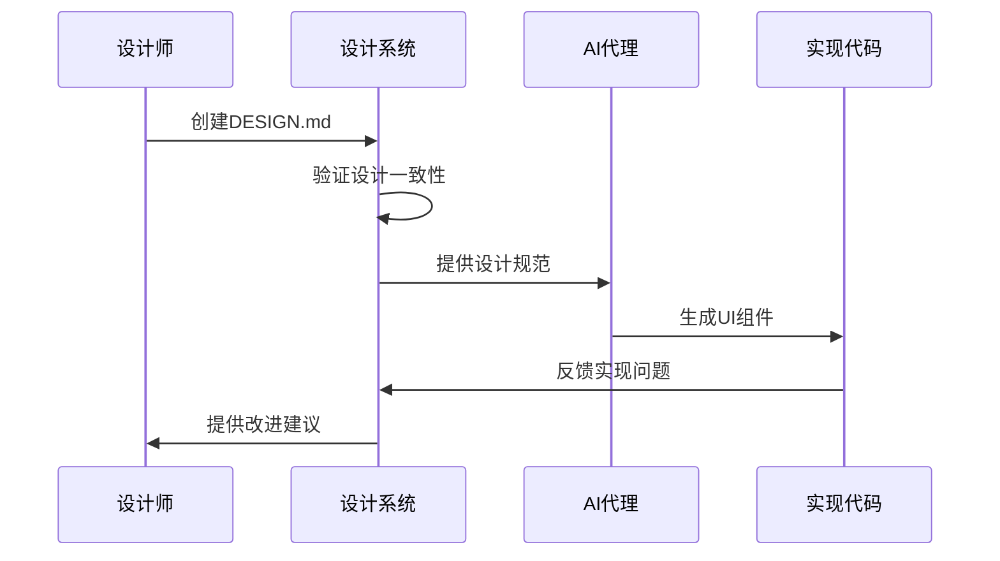
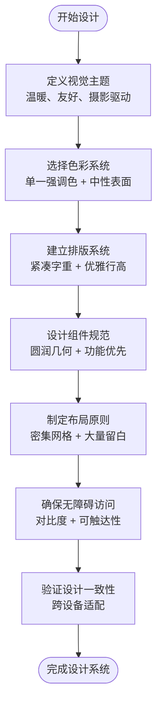
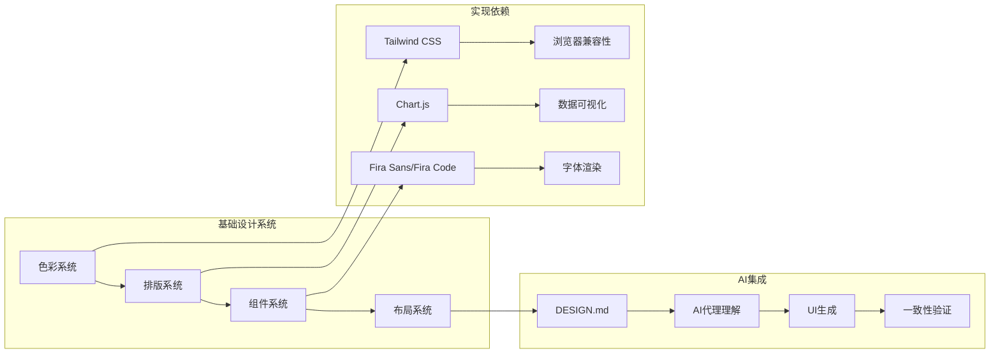
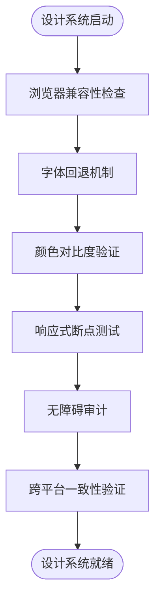
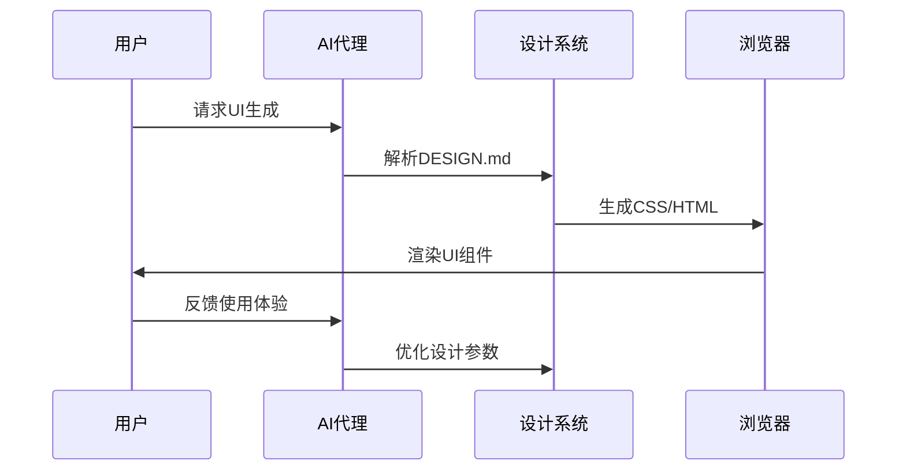
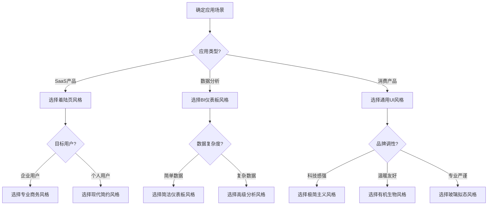

# 67种UI风格库

<cite>
**本文档引用的文件**
- [awesome-design-md/README.md](file://awesome-design-md/README.md)
- [awesome-design-md/CONTRIBUTING.md](file://awesome-design-md/CONTRIBUTING.md)
- [awesome-design-md/design-md/airbnb/DESIGN.md](file://awesome-design-md/design-md/airbnb/DESIGN.md)
- [awesome-design-md/design-md/apple/DESIGN.md](file://awesome-design-md/design-md/apple/DESIGN.md)
- [awesome-design-md/design-md/spotify/DESIGN.md](file://awesome-design-md/design-md/spotify/DESIGN.md)
- [awesome-design-md/design-md/linear.app/DESIGN.md](file://awesome-design-md/design-md/linear.app/DESIGN.md)
- [awesome-design-md/design-md/meta/DESIGN.md](file://awesome-design-md/design-md/meta/DESIGN.md)
- [ui-ux-pro-max-skill/projects/healthcare-dashboard/index.html](file://ui-ux-pro-max-skill/projects/healthcare-dashboard/index.html)
- [ui-ux-pro-max-skill/projects/portfolio-dark/index.html](file://ui-ux-pro-max-skill/projects/portfolio-dark/index.html)
- [ui-ux-pro-max-skill/projects/saas-landing/index.html](file://ui-ux-pro-max-skill/projects/saas-landing/index.html)
</cite>

## 目录
1. [简介](#简介)
2. [项目结构](#项目结构)
3. [核心组件](#核心组件)
4. [架构概览](#架构概览)
5. [详细组件分析](#详细组件分析)
6. [依赖分析](#依赖分析)
7. [性能考虑](#性能考虑)
8. [故障排除指南](#故障排除指南)
9. [结论](#结论)
10. [附录](#附录)

## 简介

本项目是一个精心策划的67种UI风格库集合，基于Google Stitch的DESIGN.md设计系统格式构建。该仓库包含了来自真实网站的完整设计系统文档，涵盖AI平台、开发者工具、后端数据库、产品管理、设计创意工具、金融科技、电商零售、媒体消费技术、汽车品牌以及复古网页等多个领域的设计语言。

每个设计系统都遵循统一的结构化格式，包含视觉主题与氛围、色彩调色板与角色、排版规则、组件样式、布局原则、深度与层次、使用守则、响应式行为等九个核心部分。这种标准化的方法确保了设计系统的一致性和可读性，为AI代理提供了清晰的视觉指导。

## 项目结构

项目采用模块化的组织方式，主要分为三个核心部分：

**图表来源**
- [awesome-design-md/README.md:96-202](file://awesome-design-md/README.md#L96-L202)

**章节来源**
- [awesome-design-md/README.md:1-250](file://awesome-design-md/README.md#L1-L250)
- [awesome-design-md/CONTRIBUTING.md:1-26](file://awesome-design-md/CONTRIBUTING.md#L1-L26)

## 核心组件

### 设计系统标准格式

每个DESIGN.md文件都遵循统一的九段落结构：

1. **视觉主题与氛围** - 描述整体设计哲学和情感基调
2. **色彩调色板与角色** - 定义品牌色彩及其功能用途
3. **排版规则** - 字体家族、层级表和排版原则
4. **组件样式** - 按钮、卡片、输入框等UI元素的规范
5. **布局原则** - 间距系统、网格和空白哲学
6. **深度与层次** - 阴影系统、表面层次
7. **使用守则** - 设计准则和反模式
8. **响应式行为** - 断点、触摸目标和折叠策略
9. **AI提示指南** - 快速颜色参考和示例组件提示

### 色彩系统架构

**图表来源**
- [awesome-design-md/design-md/airbnb/DESIGN.md:6-327](file://awesome-design-md/design-md/airbnb/DESIGN.md#L6-L327)
- [awesome-design-md/design-md/apple/DESIGN.md:6-274](file://awesome-design-md/design-md/apple/DESIGN.md#L6-L274)

**章节来源**
- [awesome-design-md/design-md/airbnb/DESIGN.md:1-546](file://awesome-design-md/design-md/airbnb/DESIGN.md#L1-L546)
- [awesome-design-md/design-md/apple/DESIGN.md:1-563](file://awesome-design-md/design-md/apple/DESIGN.md#L1-L563)

## 架构概览

### 设计系统分层架构

### 设计系统工作流程

**图表来源**
- [awesome-design-md/README.md:228-238](file://awesome-design-md/README.md#L228-L238)

**章节来源**
- [awesome-design-md/README.md:204-247](file://awesome-design-md/README.md#L204-L247)

## 详细组件分析

### 极简主义风格分析

#### Airbnb风格设计系统

Airbnb代表了极简主义设计的典型应用，其设计特点包括：

**核心设计理念：**
- 单一强调色系统：#ff385c Rausch作为唯一的品牌强调色
- 温暖的消费者市场定位：白色画布(#ffffff)配深色文字(#222222)
- 圆润几何形状：无硬角设计，所有交互元素均为圆角
- 摄影驱动的展示：大量使用高质量图片而非装饰元素

**色彩系统特征：**
- 品牌强调色：#ff385c用于所有主要CTA和品牌元素
- 表面层次：从#ffffff到#f2f2f2的渐进表面系统
- 文本层次：从#222222到#929292的文本色彩梯度
- 错误状态：#c13515的红色用于表单验证错误

**排版系统：**
- 字体：Airbnb Cereal VF作为主字体
- 层级：从80px(display-xl)到8px(uppercase-tag)的完整层级
- 字重：500-700的精简字重系统
- 行高：1.1-1.5的紧凑行高设置

**组件规范：**
- 按钮：8px半径的圆角按钮，14×24px内边距
- 卡片：14px圆角的属性卡片
- 搜索栏：32px半径的胶囊形搜索条
- 导航：80px高度的顶部导航条

**图表来源**
- [awesome-design-md/design-md/airbnb/DESIGN.md:329-420](file://awesome-design-md/design-md/airbnb/DESIGN.md#L329-L420)

**章节来源**
- [awesome-design-md/design-md/airbnb/DESIGN.md:329-546](file://awesome-design-md/design-md/airbnb/DESIGN.md#L329-L546)

### 玻璃拟态风格分析

#### Apple风格设计系统

Apple的玻璃拟态设计展现了现代科技产品的精致美学：

**核心设计理念：**
- 产品导向的摄影展示：边缘到边缘的产品瓷砖交替浅色和深色画布
- 单一蓝色强调色：#0066cc Action Blue作为唯一交互色彩
- 无装饰渐变：大气深度通过摄影质感而非CSS渐变实现
- 极简UI：UI退居二线，让产品成为焦点

**色彩系统：**
- 画布系统：#ffffff纯白到#000000纯黑的完整色彩谱
- 表面层次：从#ffffff到#252527的四步表面梯度
- 文本系统：从#1d1d1f深黑到#ffffff纯白的文本色彩
- 强调色：#0066cc Action Blue在不同表面的变体

**排版系统：**
- 显示字体：SF Pro Display，优化于≥19px的标题
- 正文字体：SF Pro Text，专为正文优化
- 字体特性：OpenType功能如数字分数显示
- 字重系统：300/400/600/700的精简字重选择

**组件规范：**
- 按钮系统：全胶囊形(#9999px半径)的主按钮
- 卡片系统：18px圆角的商店实用卡片
- 导航系统：44px高度的全局导航条
- 浮动粘性条：带有背景模糊效果的粘性操作条

**章节来源**
- [awesome-design-md/design-md/apple/DESIGN.md:276-563](file://awesome-design-md/design-md/apple/DESIGN.md#L276-L563)

### 有机生物风格分析

#### Spotify风格设计系统

Spotify展现了音乐应用特有的沉浸式设计语言：

**核心设计理念：**
- 深色沉浸式界面：#121212至#1f1f1f的近黑色背景
- 品牌绿色强调：#1ed760 Spotify Green作为功能性强调色
- 几何圆形设计：胶囊形和圆形控制的统一几何语言
- 内容优先的黑暗：UI退隐，音乐和专辑艺术成为焦点

**色彩系统：**
- 深色背景：#121212最深背景，#1f1f1f按钮背景
- 文本系统：#ffffff纯白到#cbcbcb近纯白的文本层次
- 强调色：#1ed760 Spotify Green的功能性使用
- 语义色彩：#f3727f负面红，#ffa42b警告橙，#539df5公告蓝

**排版系统：**
- 字体：SpotifyMixUI和SpotifyMixUITitle的定制字体
- 字重系统：700粗体和600半粗体的二元系统
- 字母间距：按钮标签1.4px-2px的正字母间距
- 字号范围：10px-24px的紧凑字号范围

**组件规范：**
- 按钮系统：500px-9999px半径的胶囊形按钮
- 圆形播放按钮：50%半径的圆形控制
- 卡片系统：6px-8px圆角的深色卡片
- 输入系统：500px半径的搜索输入框

**章节来源**
- [awesome-design-md/design-md/spotify/DESIGN.md:1-247](file://awesome-design-md/design-md/spotify/DESIGN.md#L1-L247)

### BI/分析仪表板风格分析

#### 医疗健康仪表板设计

基于真实项目的BI仪表板设计实现：

**核心设计理念：**
- 数据驱动的医疗界面：专注于患者数据和医院指标
- 蓝色专业色调：#3B82F6作为主要品牌色
- 清晰的数据可视化：折线图和环形图的合理运用
- 专业的医疗环境：绿色成功状态和橙色警告状态

**色彩系统：**
- 主要品牌色：#3B82F6蓝色用于主要CTA和重要信息
- 成功状态：#10B981绿色表示恢复率和床位可用性
- 警告状态：#F59E0B橙色表示等待时间和异常情况
- 危险状态：#EF4444红色表示紧急情况和高风险

**组件规范：**
- KPI卡片：四个关键指标卡片，包含趋势箭头和百分比变化
- 图表组件：折线图展示患者入院趋势，环形图展示科室分布
- 表格系统：最近患者列表，包含状态徽章和时间戳
- 导航系统：固定侧边栏，包含患者、预约、分析等导航项

**章节来源**
- [ui-ux-pro-max-skill/projects/healthcare-dashboard/index.html:1-459](file://ui-ux-pro-max-skill/projects/healthcare-dashboard/index.html#L1-L459)

### 着陆页风格分析

#### SaaS着陆页设计

基于真实项目的SaaS产品着陆页实现：

**核心设计理念：**
- 现代商务外观：#F8FAFC背景色和#1E293B深色文本
- 渐变品牌标识：从#3B82F6到#60A5FA的蓝色渐变
- 清晰的价值主张：简洁的标题和副标题传达产品价值
- 社会证明展示：客户统计数据和评分展示

**色彩系统：**
- 背景色：#F8FAFC浅蓝白色背景
- 文本色：#1E293B深灰文本，#94A3B8中性灰色
- 强调色：#3B82F6蓝色用于CTA和重要链接
- 辅助色：#F97316橙色用于行动号召按钮

**组件规范：**
- 浮动导航栏：模糊背景的现代化导航条
- 英雄区域：大标题和副标题，双按钮CTA
- 统计展示：四象限统计卡片，展示客户成就
- 特性展示：三列特性卡片，图标+描述的布局
- 客户评价：三列客户评价卡片，星级评分系统
- 定价表格：三列定价方案，突出最受欢迎的方案
- 页脚系统：四列信息导航，社交媒体链接

**章节来源**
- [ui-ux-pro-max-skill/projects/saas-landing/index.html:1-346](file://ui-ux-pro-max-skill/projects/saas-landing/index.html#L1-L346)

## 依赖分析

### 设计系统依赖关系

### 跨平台兼容性

**图表来源**
- [awesome-design-md/README.md:228-238](file://awesome-design-md/README.md#L228-L238)

**章节来源**
- [awesome-design-md/README.md:204-247](file://awesome-design-md/README.md#L204-L247)

## 性能考虑

### 设计系统性能优化

1. **加载性能**
   - 使用CDN加速字体和资源加载
   - 实现图片懒加载和响应式图片源
   - 优化CSS和JavaScript打包体积

2. **渲染性能**
   - 合理使用CSS阴影和模糊效果
   - 避免过度的DOM层级嵌套
   - 使用硬件加速的动画效果

3. **交互性能**
   - 实现触摸友好的点击目标尺寸
   - 优化滚动性能和粘性元素
   - 减少重绘和重排操作

### AI集成性能

## 故障排除指南

### 常见问题解决

1. **DESIGN.md解析错误**
   - 检查YAML语法正确性
   - 验证颜色值格式(#RRGGBB)
   - 确认组件引用的有效性

2. **设计不一致问题**
   - 使用设计系统内置的验证工具
   - 检查颜色对比度是否符合WCAG标准
   - 验证响应式断点的一致性

3. **实现偏差问题**
   - 对比设计稿和实际实现
   - 检查字体回退机制
   - 验证组件状态的完整性

**章节来源**
- [awesome-design-md/CONTRIBUTING.md:9-21](file://awesome-design-md/CONTRIBUTING.md#L9-L21)

## 结论

本67种UI风格库项目为现代UI设计提供了一个全面而标准化的解决方案。通过统一的DESIGN.md格式，每个设计系统都提供了完整的设计规范、实现指导和最佳实践。这种结构化的方法不仅确保了设计的一致性和可维护性，还为AI代理提供了清晰的创作指导。

项目涵盖了从极简主义到有机生物风格的多种设计语言，以及专门针对BI仪表板和着陆页的专业化设计系统。每个设计系统都经过精心分析和验证，确保在实际项目中的可用性和有效性。

通过提供可视化示例和实现代码，该项目为设计师、开发者和AI代理提供了一个完整的生态系统，支持从概念设计到最终实现的全流程设计工作流。

## 附录

### 风格选择决策树

### 风格组合建议

1. **主风格+辅助风格**
   - 主风格：决定整体视觉基调
   - 辅助风格：增强特定功能区域
   - 保持色彩和谐统一

2. **功能分区风格**
   - 顶部导航：简洁现代风格
   - 主内容区：专业商务风格
   - 侧边栏：有机生物风格
   - 底部：极简主义风格

3. **品牌一致性**
   - 统一的色彩系统
   - 一致的排版规范
   - 相符的几何语言
   - 连贯的交互模式

### 跨平台一致性保证

1. **设计系统验证**
   - 自动化设计规范检查
   - 跨浏览器兼容性测试
   - 无障碍访问审计
   - 移动端适配验证

2. **实现质量控制**
   - 代码审查流程
   - 性能基准测试
   - 用户体验评估
   - 反馈循环机制

3. **持续改进机制**
   - 定期设计系统更新
   - 用户反馈收集
   - 最佳实践总结
   - 技术栈演进跟踪