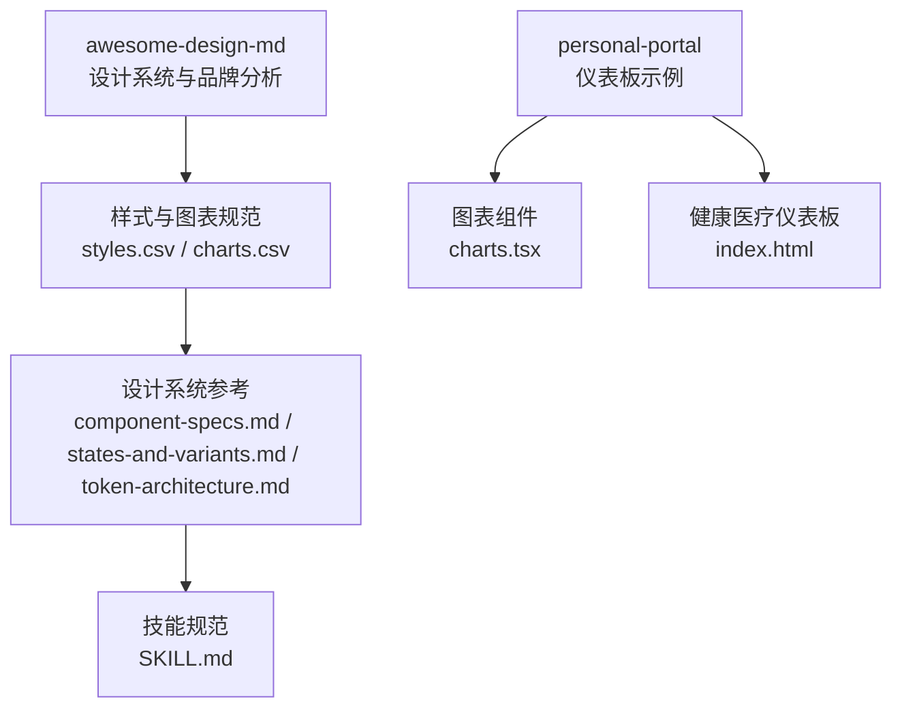
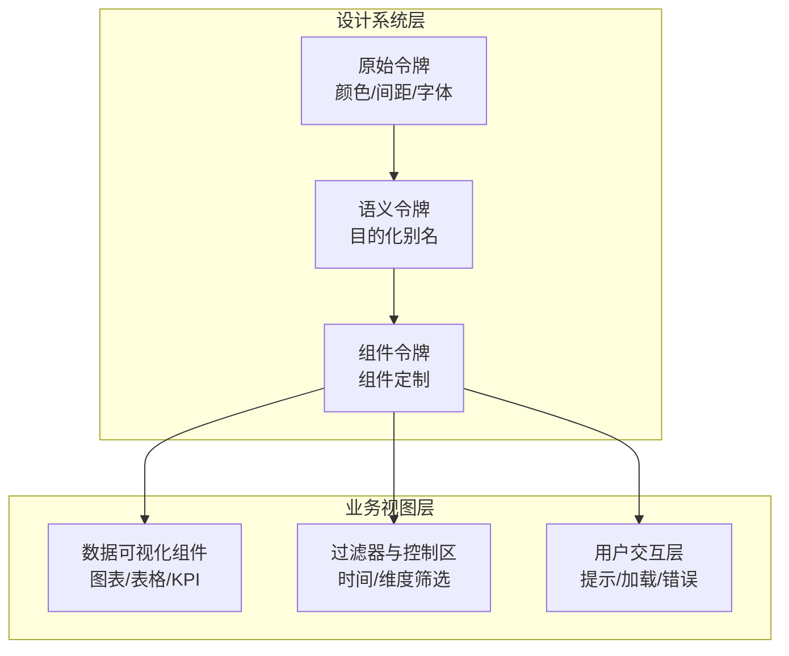
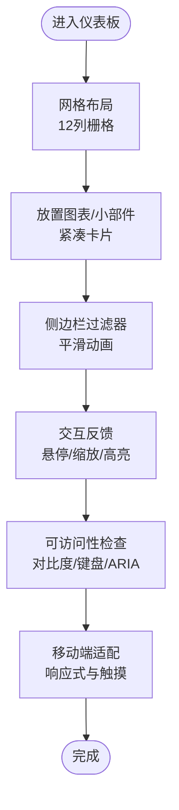
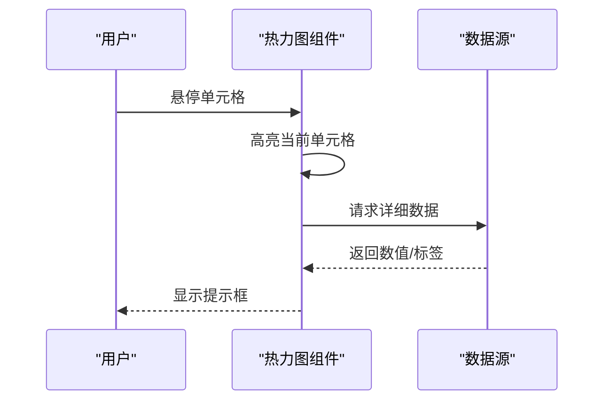
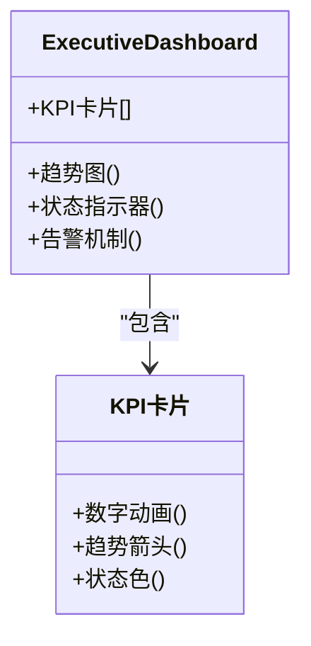
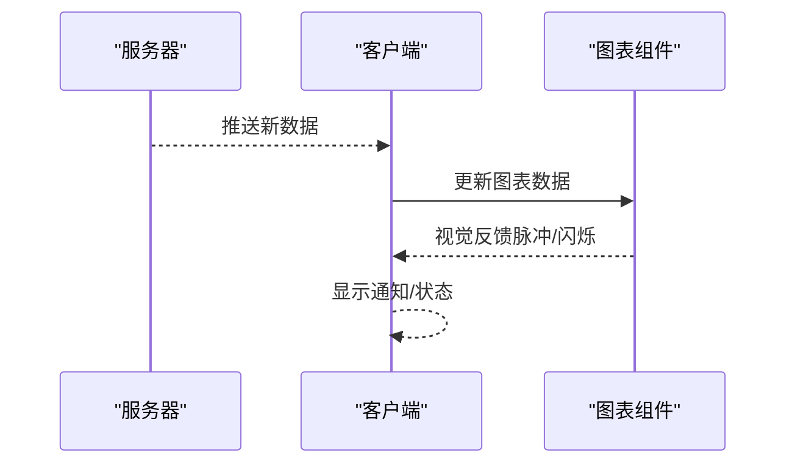
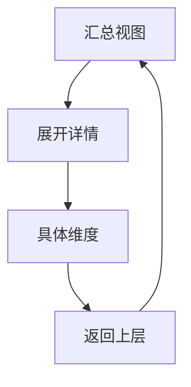
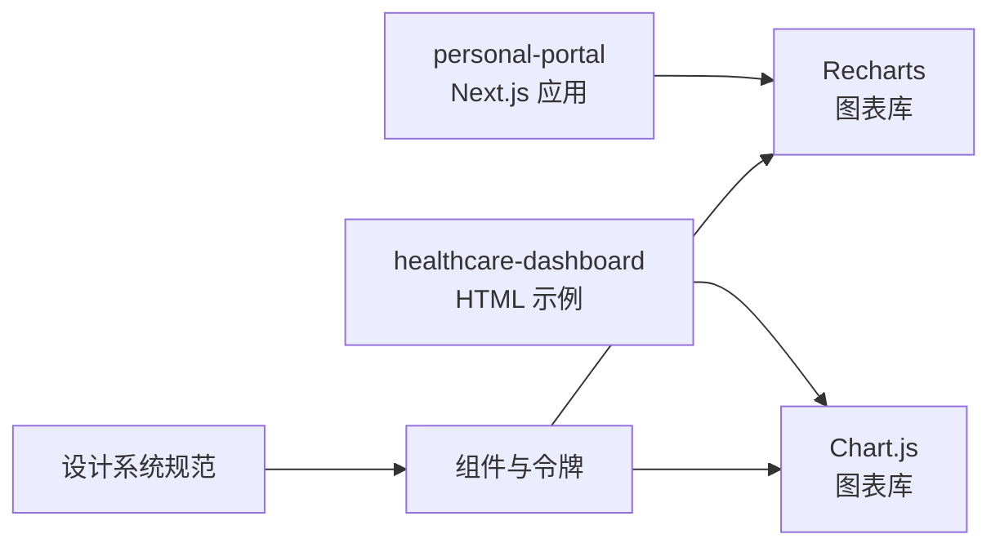

# 仪表板风格

<cite>
**本文档引用的文件**
- [styles.csv](file://ui-ux-pro-max-skill/skills/ui-ux-pro-max/data/styles.csv)
- [charts.csv](file://ui-ux-pro-max-skill/skills/ui-ux-pro-max/data/charts.csv)
- [charts.tsx](file://personal-portal/src/components/dashboard/charts.tsx)
- [index.html](file://ui-ux-pro-max-skill/projects/healthcare-dashboard/index.html)
- [component-specs.md](file://ui-ux-pro-max-skill/.claude/skills/design-system/references/component-specs.md)
- [states-and-variants.md](file://ui-ux-pro-max-skill/.claude/skills/design-system/references/states-and-variants.md)
- [token-architecture.md](file://ui-ux-pro-max-skill/.claude/skills/design-system/references/token-architecture.md)
- [SKILL.md](file://ui-ux-pro-max-skill/.claude/skills/ui-ux-pro-max/SKILL.md)
- [package-lock.json](file://personal-portal/package-lock.json)
</cite>

## 目录
1. [引言](#引言)
2. [项目结构](#项目结构)
3. [核心组件](#核心组件)
4. [架构总览](#架构总览)
5. [详细组件分析](#详细组件分析)
6. [依赖关系分析](#依赖关系分析)
7. [性能考虑](#性能考虑)
8. [故障排除指南](#故障排除指南)
9. [结论](#结论)
10. [附录](#附录)

## 引言
本指南面向需要创建专业 BI/分析仪表板的团队与个人，围绕十种主流仪表板风格（数据密集型、热力图、高管仪表板、实时监控、钻取分析、对比分析、预测分析、用户行为分析、财务仪表板、销售智能仪表板）提供系统化的设计规范与实现建议。内容覆盖数据可视化特征、交互设计原则、性能优化策略与可访问性要求，并给出图表组件设计、数据过滤器实现与移动端适配方案。

## 项目结构
该仓库包含三个主要子项目：
- awesome-design-md：设计系统与品牌风格分析资源
- personal-portal：个人仪表板示例（Next.js + Recharts）
- ui-ux-pro-max-skill：设计系统与仪表板风格规范（CSV/Markdown）

**图表来源**
- [styles.csv:28-86](file://ui-ux-pro-max-skill/skills/ui-ux-pro-max/data/styles.csv#L28-L86)
- [charts.tsx:1-113](file://personal-portal/src/components/dashboard/charts.tsx#L1-L113)
- [index.html:1-82](file://ui-ux-pro-max-skill/projects/healthcare-dashboard/index.html#L1-L82)

**章节来源**
- [styles.csv:28-86](file://ui-ux-pro-max-skill/skills/ui-ux-pro-max/data/styles.csv#L28-L86)
- [charts.tsx:1-113](file://personal-portal/src/components/dashboard/charts.tsx#L1-L113)
- [index.html:1-82](file://ui-ux-pro-max-skill/projects/healthcare-dashboard/index.html#L1-L82)

## 核心组件
- 设计系统三层令牌体系（原始值→语义值→组件级），确保主题一致性与可维护性
- 组件状态与变体规范（按钮、输入、卡片、徽章、对话框、表格），统一交互反馈
- 图表类型与适用场景矩阵，指导选择合适的可视化方式

**章节来源**
- [token-architecture.md:1-158](file://ui-ux-pro-max-skill/.claude/skills/design-system/references/token-architecture.md#L1-L158)
- [component-specs.md:1-237](file://ui-ux-pro-max-skill/.claude/skills/design-system/references/component-specs.md#L1-L237)
- [states-and-variants.md:1-242](file://ui-ux-pro-max-skill/.claude/skills/design-system/references/states-and-variants.md#L1-L242)
- [charts.csv:1-27](file://ui-ux-pro-max-skill/skills/ui-ux-pro-max/data/charts.csv#L1-L27)

## 架构总览
仪表板风格的实现由“设计系统层”和“业务视图层”构成：
- 设计系统层：通过三层令牌与组件规范，提供一致的视觉与交互基线
- 业务视图层：按风格需求组合图表、KPI、表格与过滤器，形成完整的数据故事

**图表来源**
- [token-architecture.md:1-158](file://ui-ux-pro-max-skill/.claude/skills/design-system/references/token-architecture.md#L1-L158)
- [component-specs.md:1-237](file://ui-ux-pro-max-skill/.claude/skills/design-system/references/component-specs.md#L1-L237)

## 详细组件分析

### 数据密集型仪表板（Data-Dense Dashboard）
- 可视化特征：多图表/小部件、数据表格、KPI 卡片、极简内边距、网格布局、高密度信息呈现
- 交互设计：悬停提示、点击缩放、行高亮、平滑过滤动画、数据加载指示器
- 性能策略：紧凑卡片、粘性表头、表格滚动优化、最小化重绘
- 可访问性：WCAG AA 级对比度、键盘导航、屏幕阅读器摘要
- 移动端适配：响应式网格、紧凑字体、触摸目标≥44px

**图表来源**
- [styles.csv:28-28](file://ui-ux-pro-max-skill/skills/ui-ux-pro-max/data/styles.csv#L28-L28)

**章节来源**
- [styles.csv:28-28](file://ui-ux-pro-max-skill/skills/ui-ux-pro-max/data/styles.csv#L28-L28)

### 热力图风格（Heat Map & Heatmap Style）
- 可视化特征：色阶映射、网格/矩阵、地理热力图、相关性矩阵、单元格表示、渐变色彩
- 交互设计：颜色过渡动画、单元格悬停高亮、点击显示提示、平滑颜色动画
- 性能策略：SVG 地理图、Canvas 大数据集、颜色图谱与图例
- 可访问性：色盲友好、数值叠加、替代模式
- 移动端适配：缩放/平移、性能优化

**图表来源**
- [styles.csv:29-29](file://ui-ux-pro-max-skill/skills/ui-ux-pro-max/data/styles.csv#L29-L29)

**章节来源**
- [styles.csv:29-29](file://ui-ux-pro-max-skill/skills/ui-ux-pro-max/data/styles.csv#L29-L29)

### 高管仪表板（Executive Dashboard）
- 可视化特征：高层 KPI、大号指标、概要视图、趋势指示器、一目了然洞察
- 交互设计：KPI 数字动画、趋势箭头、指标卡片悬浮、告警脉冲效果
- 性能策略：单页视图、响应式断点、打印友好布局
- 可访问性：WCAG AA、清晰状态色

**图表来源**
- [styles.csv:30-30](file://ui-ux-pro-max-skill/skills/ui-ux-pro-max/data/styles.csv#L30-L30)

**章节来源**
- [styles.csv:30-30](file://ui-ux-pro-max-skill/skills/ui-ux-pro-max/data/styles.csv#L30-L30)

### 实时监控（Real-Time Monitoring）
- 可视化特征：实时数据更新、状态指示器、告警通知、流式数据可视化
- 交互设计：脉冲动画、告警闪烁、状态点闪烁、平滑数据流更新
- 性能策略：WebSocket 流、自动刷新间隔、离线回退
- 可访问性：可选声音、连接状态、自动刷新指示

**图表来源**
- [styles.csv:31-31](file://ui-ux-pro-max-skill/skills/ui-ux-pro-max/data/styles.csv#L31-L31)

**章节来源**
- [styles.csv:31-31](file://ui-ux-pro-max-skill/skills/ui-ux-pro-max/data/styles.csv#L31-L31)

### 钻取分析（Drill-Down Analytics）
- 可视化特征：层次数据探索、可展开区域、交互式钻取路径、从汇总到详情
- 交互设计：面包屑导航、展开动画、上下文保留、层级切换
- 性能策略：平滑过渡、深链支持、移动端钻取

**图表来源**
- [styles.csv:32-32](file://ui-ux-pro-max-skill/skills/ui-ux-pro-max/data/styles.csv#L32-L32)

**章节来源**
- [styles.csv:32-32](file://ui-ux-pro-max-skill/skills/ui-ux-pro-max/data/styles.csv#L32-L32)

### 对比分析（Comparative Analysis Dashboard）
- 可视化特征：并排对比、同比环比指标、A/B 测试结果、基准线
- 交互设计：比较条动画、差值指示器、高亮对比
- 性能策略：侧向布局、移动端堆叠、导出对比

**章节来源**
- [styles.csv:33-33](file://ui-ux-pro-max-skill/skills/ui-ux-pro-max/data/styles.csv#L33-L33)

### 预测分析（Predictive Analytics）
- 可视化特征：预测线、置信区间、异常检测、情景建模
- 交互设计：预测线绘制动画、置信带淡入、异常脉冲告警
- 性能策略：计算开销控制、概率指示器

**章节来源**
- [styles.csv:34-34](file://ui-ux-pro-max-skill/skills/ui-ux-pro-max/data/styles.csv#L34-L34)

### 用户行为分析（User Behavior Analytics）
- 可视化特征：漏斗图、用户流程图、转化追踪、参与度指标、用户旅程
- 交互设计：漏斗填充动画、流程连接绘制、转化脉冲、参与度热力图

**章节来源**
- [styles.csv:35-35](file://ui-ux-pro-max-skill/skills/ui-ux-pro-max/data/styles.csv#L35-L35)

### 财务仪表板（Financial Dashboard）
- 可视化特征：收入/利润、预算跟踪、财务比率、投资组合表现、现金流
- 交互设计：数字动画、趋势方向指示、百分比变化动画、审计追踪

**章节来源**
- [styles.csv:36-36](file://ui-ux-pro-max-skill/skills/ui-ux-pro-max/data/styles.csv#L36-L36)

### 销售智能仪表板（Sales Intelligence Dashboard）
- 可视化特征：交易管道、销售指标、区域表现、销售代表排行榜、配额跟踪
- 交互设计：管道移动动画、指标更新、排行榜排名变化、仪表盘指针

**章节来源**
- [styles.csv:37-37](file://ui-ux-pro-max-skill/skills/ui-ux-pro-max/data/styles.csv#L37-L37)

## 依赖关系分析
- 图表库依赖：personal-portal 使用 Recharts；健康医疗仪表板示例使用 Chart.js
- 设计系统依赖：通过 CSS 变量与组件规范统一风格
- 性能与可访问性：遵循 WCAG 要求，尊重减少动画偏好设置

**图表来源**
- [package-lock.json:7429-7454](file://personal-portal/package-lock.json#L7429-L7454)
- [charts.tsx:1-13](file://personal-portal/src/components/dashboard/charts.tsx#L1-L13)
- [index.html:7-8](file://ui-ux-pro-max-skill/projects/healthcare-dashboard/index.html#L7-L8)

**章节来源**
- [package-lock.json:7429-7454](file://personal-portal/package-lock.json#L7429-L7454)
- [charts.tsx:1-13](file://personal-portal/src/components/dashboard/charts.tsx#L1-L13)
- [index.html:7-8](file://ui-ux-pro-max-skill/projects/healthcare-dashboard/index.html#L7-L8)

## 性能考虑
- 数据量控制：千级以上数据点采用聚合或采样，提供钻取细节
- 渲染优化：Canvas/WebGL 处理大数据，SVG 适合中小规模
- 动画与交互：尊重减少动画偏好，避免阻塞主线程
- 加载体验：骨架屏/闪烁占位，空数据状态明确提示

**章节来源**
- [SKILL.md:279-301](file://ui-ux-pro-max-skill/.claude/skills/ui-ux-pro-max/SKILL.md#L279-L301)

## 故障排除指南
- 空数据状态：提供“暂无数据”提示与操作引导，而非空白图表
- 加载失败：展示错误消息与重试动作，避免破碎/空白图表
- 可访问性问题：确保焦点可见、键盘可达、提示可键盘获取
- 触摸目标：交互元素≥44pt，触屏可扩展
- 时间刻度：时间序列必须清晰标注粒度并允许切换

**章节来源**
- [SKILL.md:279-301](file://ui-ux-pro-max-skill/.claude/skills/ui-ux-pro-max/SKILL.md#L279-L301)

## 结论
通过三层设计系统令牌、标准化组件状态与变体、以及针对十种仪表板风格的可视化与交互规范，可以在保证可访问性与性能的前提下，快速构建专业且一致的 BI/分析仪表板。建议在项目中优先采用 Recharts/Chart.js 等成熟库，并结合设计系统规范进行主题化与本地化定制。

## 附录
- 图表类型与最佳实践对照表（节选）
  - 折线图：连续时间序列趋势，1000+ 点采用 Canvas 下采样
  - 条形图：类别比较，≤15 类别，支持排序与导出
  - 饼图/圆环图：强调比例，≤5 类别，无障碍优先提供替代
  - 散点图/气泡图：双变量关系，注意色盲区分与数据表替代
  - 热力图：二维强度分布，提供数值叠加与色盲替代
  - 地理图：区域/位置维度，提供文本标签与键盘导航
  - 瀑布图：累计变化，正负分层，箭头图标辅助
  - 雷达图：多维比较，轴数限制，提供替代图表
  - 网络图：连接关系，节点数量控制，提供列表替代
  - 箱线图：统计分布，提供统计摘要表

**章节来源**
- [charts.csv:1-27](file://ui-ux-pro-max-skill/skills/ui-ux-pro-max/data/charts.csv#L1-L27)