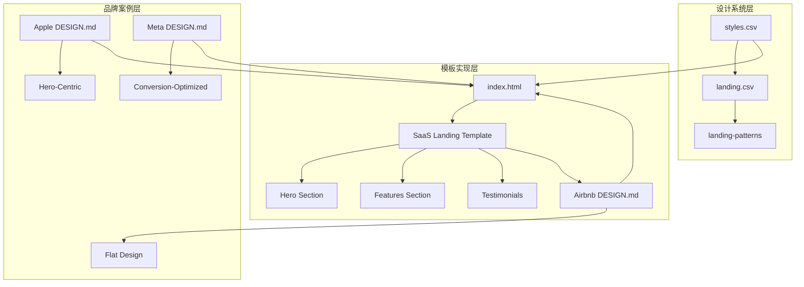
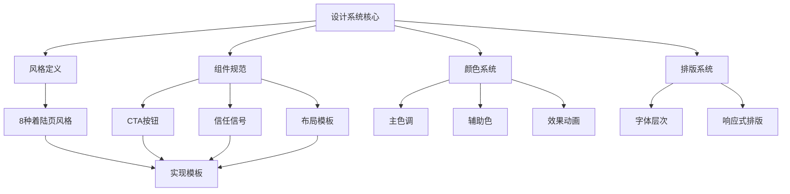
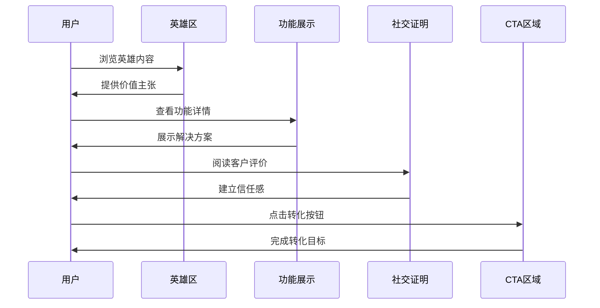
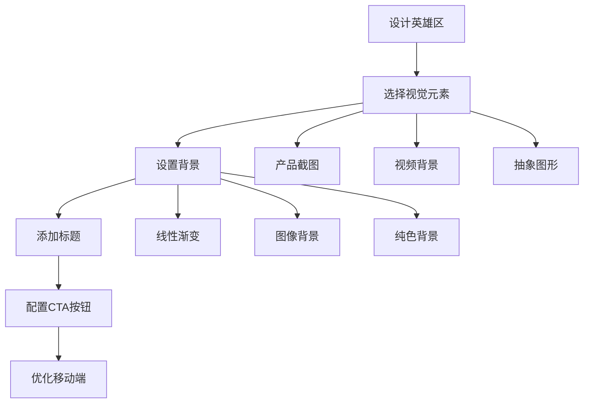
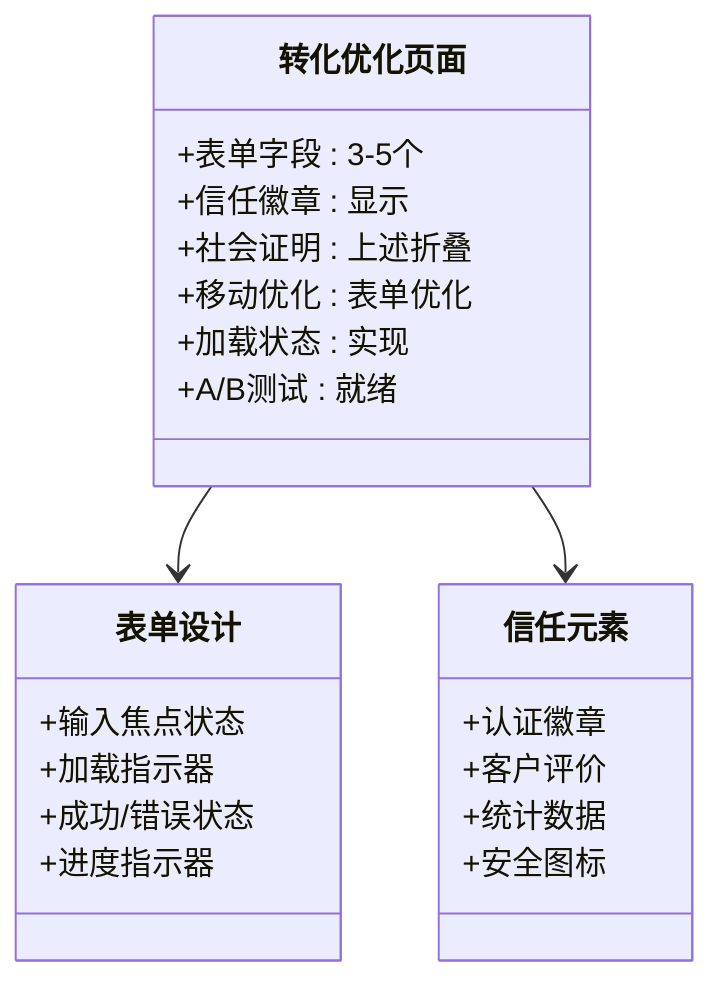
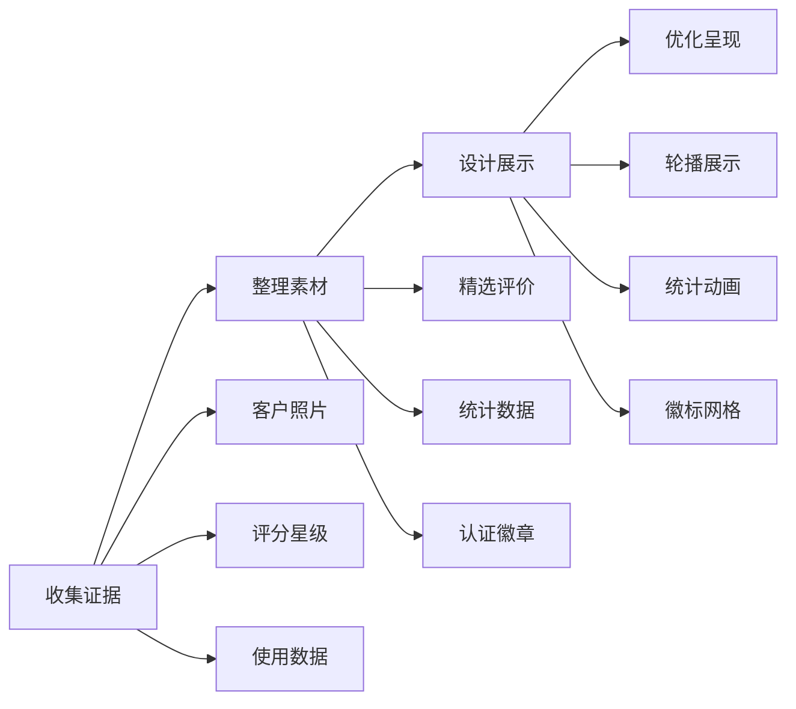
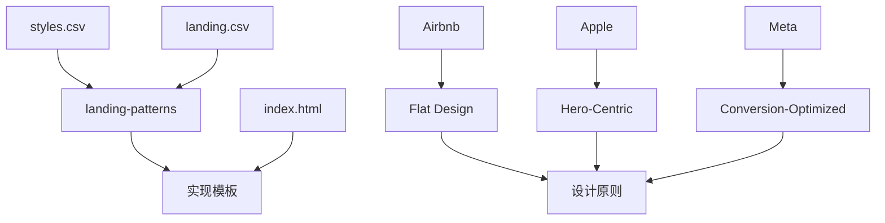
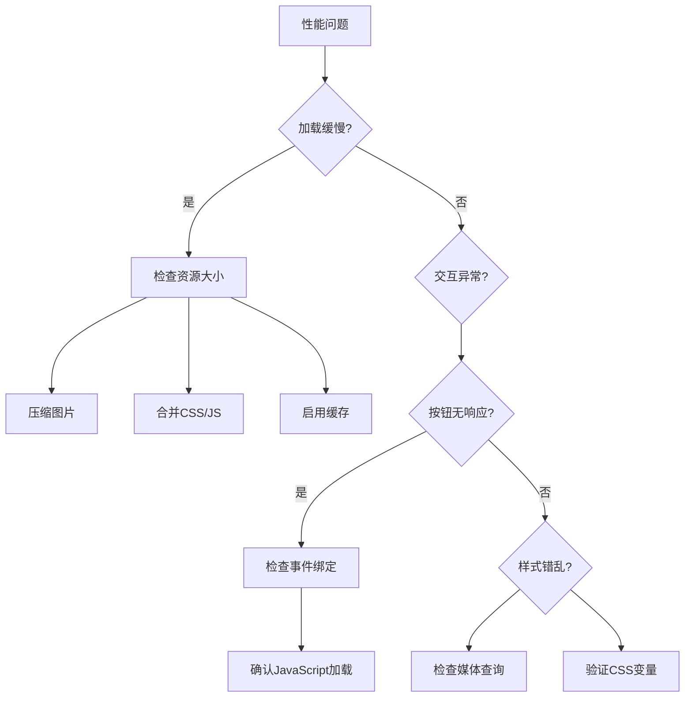

# 着陆页风格

<cite>
**本文档引用的文件**
- [styles.csv](file://ui-ux-pro-max-skill/.claude/skills/ui-ux-pro-max/data/styles.csv)
- [landing.csv](file://ui-ux-pro-max-skill/.claude/skills/ui-ux-pro-max/data/landing.csv)
- [index.html](file://ui-ux-pro-max-skill/projects/saas-landing/index.html)
- [DESIGN.md (Airbnb)](file://awesome-design-md/design-md/airbnb/DESIGN.md)
- [DESIGN.md (Apple)](file://awesome-design-md/design-md/apple/DESIGN.md)
- [DESIGN.md (Meta)](file://awesome-design-md/design-md/meta/DESIGN.md)
</cite>

## 目录
1. [引言](#引言)
2. [项目结构](#项目结构)
3. [核心组件](#核心组件)
4. [架构概览](#架构概览)
5. [详细组件分析](#详细组件分析)
6. [依赖关系分析](#依赖关系分析)
7. [性能考虑](#性能考虑)
8. [故障排除指南](#故障排除指南)
9. [结论](#结论)
10. [附录](#附录)

## 引言

本指南基于8种经过验证的着陆页风格，结合真实的设计系统案例，为企业级产品提供专业设计指导。每种风格都包含了核心设计原则、目标用户群体、转化率优化策略和实现技巧。

## 项目结构

该代码库采用模块化组织方式，包含设计系统、着陆页模板和品牌案例分析：

**图表来源**
- [styles.csv:1-86](file://ui-ux-pro-max-skill/.claude/skills/ui-ux-pro-max/data/styles.csv#L1-L86)
- [landing.csv:1-36](file://ui-ux-pro-max-skill/.claude/skills/ui-ux-pro-max/data/landing.csv#L1-L36)
- [index.html:1-346](file://ui-ux-pro-max-skill/projects/saas-landing/index.html#L1-L346)

**章节来源**
- [styles.csv:1-86](file://ui-ux-pro-max-skill/.claude/skills/ui-ux-pro-max/data/styles.csv#L1-L86)
- [landing.csv:1-36](file://ui-ux-pro-max-skill/.claude/skills/ui-ux-pro-max/data/landing.csv#L1-L36)

## 核心组件

### 着陆页风格分类体系

基于设计系统的分析，我们将着陆页风格分为以下8个主要类别：

| 风格编号 | 风格名称 | 核心特征 | 适用场景 |
|---------|----------|----------|----------|
| 1 | 英雄中心设计 | 大型英雄区段、引人注目的标题、高对比度CTA、产品展示 | SaaS产品发布、服务着陆页、B2B平台 |
| 2 | 转化优化设计 | 表单专注、极简设计、单一CTA焦点、紧迫感元素 | 电商产品页面、免费试用注册、线索生成 |
| 3 | 功能丰富展示 | 多功能区段、网格布局、利益卡片、可视化功能演示 | 企业SaaS、软件工具、复杂产品解释 |
| 4 | 极简直接 | 最小文本、大量留白、单列布局、直接信息传递 | 简单服务、独立产品、咨询业务 |
| 5 | 社交证明聚焦 | 客户评价突出、客户徽标展示、案例研究 | B2B SaaS、专业服务、高端产品 |
| 6 | 互动产品演示 | 嵌入式产品模拟/视频、交互元素、产品导航 | SaaS平台、工具软件、生产力应用 |
| 7 | 权威信任 | 证书/徽章显示、专家资质、案例研究指标 | 医疗保健、金融服务、企业软件 |
| 8 | 故事驱动 | 叙述流程、视觉故事进展、章节过渡 | 品牌故事、使命驱动产品、生活方式品牌 |

**章节来源**
- [styles.csv:20-81](file://ui-ux-pro-max-skill/.claude/skills/ui-ux-pro-max/data/styles.csv#L20-L81)
- [landing.csv:1-36](file://ui-ux-pro-max-skill/.claude/skills/ui-ux-pro-max/data/landing.csv#L1-L36)

## 架构概览

### 设计系统架构

**图表来源**
- [styles.csv:1-86](file://ui-ux-pro-max-skill/.claude/skills/ui-ux-pro-max/data/styles.csv#L1-L86)
- [landing.csv:1-36](file://ui-ux-pro-max-skill/.claude/skills/ui-ux-pro-max/data/landing.csv#L1-L36)

### 转化率优化架构

**图表来源**
- [styles.csv:20-81](file://ui-ux-pro-max-skill/.claude/skills/ui-ux-pro-max/data/styles.csv#L20-L81)

## 详细组件分析

### 英雄中心设计风格

#### 核心设计原则
- **视觉冲击力**：全宽英雄区段，引人注目的标题（60-80字符）
- **清晰层次**：产品截图或视频，明确的视觉层次
- **高对比度**：品牌主色背景，白色/浅色文字确保可读性

#### 实现技巧

**图表来源**
- [styles.csv:20-21](file://ui-ux-pro-max-skill/.claude/skills/ui-ux-pro-max/data/styles.csv#L20-L21)

#### 模板实现
基于SaaS Landing Template的实际实现展示了英雄中心设计的最佳实践：

**章节来源**
- [index.html:55-94](file://ui-ux-pro-max-skill/projects/saas-landing/index.html#L55-L94)
- [styles.csv:20-21](file://ui-ux-pro-max-skill/.claude/skills/ui-ux-pro-max/data/styles.csv#L20-L21)

### 转化优化设计风格

#### 核心设计原则
- **单一焦点**：单一定位的CTA，减少用户选择困惑
- **最小干扰**：简洁设计，突出关键信息
- **紧迫感营造**：限时优惠、稀缺性提示

#### 信任信号元素
- **认证徽章**：安全认证、行业认可
- **社会证明**：客户评价、统计数据
- **保证承诺**：退款保证、免费试用

#### 实现策略

**图表来源**
- [styles.csv:21-21](file://ui-ux-pro-max-skill/.claude/skills/ui-ux-pro-max/data/styles.csv#L21-L21)

**章节来源**
- [styles.csv:21-21](file://ui-ux-pro-max-skill/.claude/skills/ui-ux-pro-max/data/styles.csv#L21-L21)

### 功能丰富展示风格

#### 设计要点
- **网格布局**：3-4列功能卡片，响应式设计
- **利益导向**：每个功能卡片明确一个核心利益
- **交替分区**：功能展示与问题解决方案配对

#### 性能优化
- **懒加载**：图片和视频按需加载
- **代码分割**：交互功能独立加载
- **缓存策略**：静态资源长期缓存

**章节来源**
- [styles.csv:22-22](file://ui-ux-pro-max-skill/.claude/skills/ui-ux-pro-max/data/styles.csv#L22-L22)

### 极简直接风格

#### 设计哲学
- **少即是多**：最大化留白，强调核心信息
- **直接沟通**：简洁文案，明确行动指令
- **快速加载**：轻量级设计，优化性能

#### 实现标准
- **内容宽度**：最大680px居中布局
- **字体大小**：18-20px正文，1.6行高
- **动画限制**：极少量微妙动画
- **页面重量**：< 500KB，加载时间 < 2秒

**章节来源**
- [styles.csv:23-23](file://ui-ux-pro-max-skill/.claude/skills/ui-ux-pro-max/data/styles.csv#L23-L23)

### 社交证明聚焦风格

#### 信任建立策略
- **真实评价**：带照片的客户评价
- **数据支撑**：关键指标和统计数据
- **权威背书**：行业认可和专业资质

#### 展示技巧

**图表来源**
- [styles.csv:24-24](file://ui-ux-pro-max-skill/.claude/skills/ui-ux-pro-max/data/styles.csv#L24-L24)

**章节来源**
- [styles.csv:24-24](file://ui-ux-pro-max-skill/.claude/skills/ui-ux-pro-max/data/styles.csv#L24-L24)

### 互动产品演示风格

#### 体验设计
- **沉浸式展示**：嵌入式产品模拟或视频
- **逐步引导**：分步教程和功能介绍
- **触手可及**：实时演示和交互操作

#### 技术实现
- **视频优化**：自适应播放，移动端优化
- **交互反馈**：悬停效果，点击响应
- **降级方案**：无JavaScript环境支持

**章节来源**
- [styles.csv:25-25](file://ui-ux-pro-max-skill/.claude/skills/ui-ux-pro-max/data/styles.csv#L25-L25)

### 权威信任风格

#### 专业形象塑造
- **正式色彩**：蓝色/灰色专业色调
- **权威元素**：认证徽章、专业资质
- **透明度**：合规标志、价格透明

#### 信任建立机制
- **安全保障**：安全锁图标、加密标识
- **专业认证**：行业奖项、专业资格
- **客户见证**：成功案例、数据指标

**章节来源**
- [styles.csv:26-26](file://ui-ux-pro-max-skill/.claude/skills/ui-ux-pro-max/data/styles.csv#L26-L26)

### 故事驱动风格

#### 叙事设计
- **情感连接**：品牌故事和个人经历
- **视觉叙事**：章节式结构，渐进式展开
- **角色参与**：目标用户成为故事主角

#### 实现方法
- **章节过渡**：自然的页面切换
- **视觉引导**：渐进式揭示
- **情感共鸣**：价值观和愿景传达

**章节来源**
- [styles.csv:27-27](file://ui-ux-pro-max-skill/.claude/skills/ui-ux-pro-max/data/styles.csv#L27-L27)

## 依赖关系分析

### 设计系统依赖

**图表来源**
- [styles.csv:1-86](file://ui-ux-pro-max-skill/.claude/skills/ui-ux-pro-max/data/styles.csv#L1-L86)
- [landing.csv:1-36](file://ui-ux-pro-max-skill/.claude/skills/ui-ux-pro-max/data/landing.csv#L1-L36)

### 品牌案例对比

| 特征 | Airbnb | Apple | Meta |
|------|--------|-------|------|
| 主色调 | Rausch (#ff385c) | Action Blue (#0066cc) | Cobalt (#0064E0) |
| 设计哲学 | 温暖消费者 | 极简主义 | 硬件商务 |
| 交互方式 | 圆角胶囊 | 全胶囊按钮 | 圆角卡片 |
| 排版风格 | 中等字重 | 紧凑排版 | 变体字体 |

**章节来源**
- [DESIGN.md (Airbnb):1-546](file://awesome-design-md/design-md/airbnb/DESIGN.md#L1-L546)
- [DESIGN.md (Apple):1-563](file://awesome-design-md/design-md/apple/DESIGN.md#L1-L563)
- [DESIGN.md (Meta):1-684](file://awesome-design-md/design-md/meta/DESIGN.md#L1-L684)

## 性能考虑

### 加载性能优化

1. **资源优化**
   - 图片WebP格式转换
   - CSS/JavaScript压缩
   - 字体子集化加载

2. **渲染优化**
   - 关键渲染路径优化
   - 懒加载策略
   - 首屏内容优先

3. **网络优化**
   - CDN加速
   - 缓存策略
   - 连接复用

### 移动端优化

- **响应式设计**：断点适配
- **触摸友好**：目标尺寸优化
- **离线支持**：Service Worker

## 故障排除指南

### 常见问题诊断

### 转化率优化建议

1. **A/B测试策略**
   - 单变量测试
   - 统计显著性检验
   - 长期跟踪分析

2. **用户体验改进**
   - 减少认知负荷
   - 优化表单长度
   - 增强信任信号

**章节来源**
- [styles.csv:20-81](file://ui-ux-pro-max-skill/.claude/skills/ui-ux-pro-max/data/styles.csv#L20-L81)

## 结论

通过分析8种着陆页风格和3个顶级品牌的设计系统，我们可以得出以下关键洞察：

1. **风格选择**应基于产品特性和目标用户需求
2. **设计原则**需要在美观性和功能性之间找到平衡
3. **技术实现**要兼顾用户体验和性能表现
4. **持续优化**通过数据分析和用户反馈不断改进

这些指导原则为企业创建高效、美观且具有良好转化率的着陆页提供了坚实的理论基础和实践框架。

## 附录

### 设计系统参数对照表

| 参数类型 | 英雄中心 | 转化优化 | 功能展示 | 极简直接 |
|----------|----------|----------|----------|----------|
| 背景对比度 | 7:1+ | 7:1+ | 4.5:1+ | 7:1+ |
| CTA数量 | 2-3个 | 1个 | 1-2个 | 1个 |
| 动画复杂度 | 中等 | 低 | 中等 | 极简 |
| 移动端适配 | ✅ | ✅ | ✅ | ✅ |
| 可访问性 | ✅ | ✅ | ✅ | ✅ |

### 实施检查清单

- [ ] 颜色对比度符合WCAG标准
- [ ] 响应式设计覆盖所有断点
- [ ] 性能指标达到行业标准
- [ ] A/B测试计划已制定
- [ ] 用户反馈收集机制建立