# 通用UI风格

<cite>
**本文档引用的文件**
- [README.md](file://README.md)
- [awesome-design-md/README.md](file://awesome-design-md/README.md)
- [awesome-design-md/design-md/airbnb/DESIGN.md](file://awesome-design-md/design-md/airbnb/DESIGN.md)
- [awesome-design-md/design-md/airbnb/README.md](file://awesome-design-md/design-md/airbnb/README.md)
- [awesome-design-md/design-md/apple/DESIGN.md](file://awesome-design-md/design-md/apple/DESIGN.md)
- [awesome-design-md/design-md/apple/README.md](file://awesome-design-md/design-md/apple/README.md)
- [awesome-design-md/design-md/meta/DESIGN.md](file://awesome-design-md/design-md/meta/DESIGN.md)
- [awesome-design-md/design-md/meta/README.md](file://awesome-design-md/design-md/meta/README.md)
- [awesome-design-md/design-md/spacex/DESIGN.md](file://awesome-design-md/design-md/spacex/DESIGN.md)
- [awesome-design-md/design-md/spacex/README.md](file://awesome-design-md/design-md/spacex/README.md)
- [awesome-design-md/design-md/binance/DESIGN.md](file://awesome-design-md/design-md/binance/DESIGN.md)
- [awesome-design-md/design-md/bmw/DESIGN.md](file://awesome-design-md/design-md/bmw/DESIGN.md)
- [awesome-design-md/design-md/bugatti/DESIGN.md](file://awesome-design-md/design-md/bugatti/DESIGN.md)
- [awesome-design-md/design-md/cal/DESIGN.md](file://awesome-design-md/design-md/cal/DESIGN.md)
- [awesome-design-md/design-md/claude/DESIGN.md](file://awesome-design-md/design-md/claude/DESIGN.md)
</cite>

## 目录
1. [引言](#引言)
2. [项目结构](#项目结构)
3. [核心组件](#核心组件)
4. [架构总览](#架构总览)
5. [详细组件分析](#详细组件分析)
6. [依赖关系分析](#依赖关系分析)
7. [性能考量](#性能考量)
8. [故障排查指南](#故障排查指南)
9. [结论](#结论)
10. [附录](#附录)

## 引言
本指南面向希望掌握“通用UI风格”的设计师与开发者，基于仓库中已有的真实网站设计系统（DESIGN.md）进行系统化归纳与提炼。目标是帮助你在不同风格之间建立清晰的认知框架：从视觉特征、排版体系、色彩语义、组件形态到响应式策略与实现要点，形成可迁移的设计语言与工程落地方法。

本仓库提供了大量真实站点的DESIGN.md分析文档，覆盖消费级平台、企业服务、金融与科技品牌等多个领域，为构建一致、可解释、可生成的UI设计系统提供了坚实基础。

## 项目结构
仓库采用“按品牌/站点分类”的组织方式，每个站点包含：
- DESIGN.md：设计系统规范（颜色、字体、组件、间距、形状、布局、响应式等）
- README.md：指向在线预览与下载的说明
- 预览页面（部分站点提供）

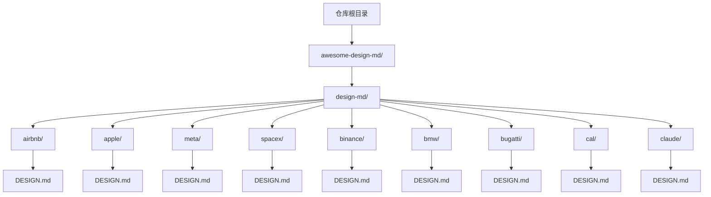

图表来源
- [awesome-design-md/README.md](file://awesome-design-md/README.md)
- [awesome-design-md/design-md/airbnb/DESIGN.md](file://awesome-design-md/design-md/airbnb/DESIGN.md)
- [awesome-design-md/design-md/apple/DESIGN.md](file://awesome-design-md/design-md/apple/DESIGN.md)
- [awesome-design-md/design-md/meta/DESIGN.md](file://awesome-design-md/design-md/meta/DESIGN.md)
- [awesome-design-md/design-md/spacex/DESIGN.md](file://awesome-design-md/design-md/spacex/DESIGN.md)
- [awesome-design-md/design-md/binance/DESIGN.md](file://awesome-design-md/design-md/binance/DESIGN.md)
- [awesome-design-md/design-md/bmw/DESIGN.md](file://awesome-design-md/design-md/bmw/DESIGN.md)
- [awesome-design-md/design-md/bugatti/DESIGN.md](file://awesome-design-md/design-md/bugatti/DESIGN.md)
- [awesome-design-md/design-md/cal/DESIGN.md](file://awesome-design-md/design-md/cal/DESIGN.md)
- [awesome-design-md/design-md/claude/DESIGN.md](file://awesome-design-md/design-md/claude/DESIGN.md)

章节来源
- [awesome-design-md/README.md](file://awesome-design-md/README.md)
- [awesome-design-md/design-md/airbnb/README.md](file://awesome-design-md/design-md/airbnb/README.md)
- [awesome-design-md/design-md/apple/README.md](file://awesome-design-md/design-md/apple/README.md)
- [awesome-design-md/design-md/meta/README.md](file://awesome-design-md/design-md/meta/README.md)
- [awesome-design-md/design-md/spacex/README.md](file://awesome-design-md/design-md/spacex/README.md)

## 核心组件
本节从“颜色、字体、组件、间距、形状、布局、响应式”七个维度，总结各站点的共性与差异，形成可复用的设计系统要素。

- 颜色体系
  - 单一主色 + 功能语义色（成功/警告/错误/信息）
  - 表面层级（画布、卡片、强调、禁用）
  - 文本层级（标题、正文、辅助、占位）
  - 边框与分割线（hairline、hairline-soft）
- 字体体系
  - 显示头号（Display/H1/H2/H3）与正文（Body/Title/Caption）分离
  - 字重与行高、字距的严格约束
  - 可替换字体链（fallback）
- 组件形态
  - 按钮（主/次/文本）、输入、标签/徽章、卡片、导航、页脚
  - 状态变体（默认/激活/禁用/聚焦）
- 间距与网格
  - 基础步进（4/8/12/16/24/32/48/64/80）
  - 容器最大宽度与列栅格
- 形状与深度
  - 圆角半径分级（xs/sm/md/lg/xl/pill/full）
  - 投影与透明度（阴影、毛玻璃、渐变）
- 响应式
  - 断点与折叠策略（移动端汉堡菜单、单列堆叠、滚动行为）
  - 触摸目标尺寸与可达性

章节来源
- [awesome-design-md/design-md/airbnb/DESIGN.md](file://awesome-design-md/design-md/airbnb/DESIGN.md)
- [awesome-design-md/design-md/apple/DESIGN.md](file://awesome-design-md/design-md/apple/DESIGN.md)
- [awesome-design-md/design-md/meta/DESIGN.md](file://awesome-design-md/design-md/meta/DESIGN.md)
- [awesome-design-md/design-md/spacex/DESIGN.md](file://awesome-design-md/design-md/spacex/DESIGN.md)
- [awesome-design-md/design-md/binance/DESIGN.md](file://awesome-design-md/design-md/binance/DESIGN.md)
- [awesome-design-md/design-md/bmw/DESIGN.md](file://awesome-design-md/design-md/bmw/DESIGN.md)
- [awesome-design-md/design-md/bugatti/DESIGN.md](file://awesome-design-md/design-md/bugatti/DESIGN.md)
- [awesome-design-md/design-md/cal/DESIGN.md](file://awesome-design-md/design-md/cal/DESIGN.md)
- [awesome-design-md/design-md/claude/DESIGN.md](file://awesome-design-md/design-md/claude/DESIGN.md)

## 架构总览
下图展示了“设计系统文档（DESIGN.md）→ 组件与令牌（tokens）→ 实现（UI/UX）”的映射关系，以及跨站点的共同抽象与差异化边界。

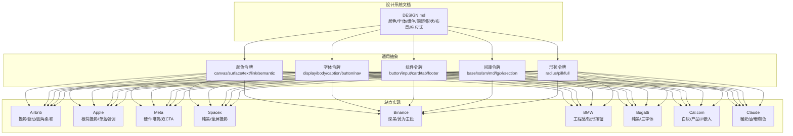

图表来源
- [awesome-design-md/design-md/airbnb/DESIGN.md](file://awesome-design-md/design-md/airbnb/DESIGN.md)
- [awesome-design-md/design-md/apple/DESIGN.md](file://awesome-design-md/design-md/apple/DESIGN.md)
- [awesome-design-md/design-md/meta/DESIGN.md](file://awesome-design-md/design-md/meta/DESIGN.md)
- [awesome-design-md/design-md/spacex/DESIGN.md](file://awesome-design-md/design-md/spacex/DESIGN.md)
- [awesome-design-md/design-md/binance/DESIGN.md](file://awesome-design-md/design-md/binance/DESIGN.md)
- [awesome-design-md/design-md/bmw/DESIGN.md](file://awesome-design-md/design-md/bmw/DESIGN.md)
- [awesome-design-md/design-md/bugatti/DESIGN.md](file://awesome-design-md/design-md/bugatti/DESIGN.md)
- [awesome-design-md/design-md/cal/DESIGN.md](file://awesome-design-md/design-md/cal/DESIGN.md)
- [awesome-design-md/design-md/claude/DESIGN.md](file://awesome-design-md/design-md/claude/DESIGN.md)

## 详细组件分析

### Airbnb 风格：摄影驱动与柔和圆角
- 设计特点
  - 白色画布 + Rausch（#ff385c）主色用于关键行动
  - 圆润半径（pill形搜索栏、property卡圆角）
  - 摄影主导的卡片与评分展示
- 适用场景
  - 消费级市场平台、旅行/住宿类应用
- 最佳实践
  - 使用圆角弱化硬边，增强亲和力
  - 控制主色使用频次，保持视觉平衡
- 实现要点
  - 搜索条：pill形背景 + 搜索球
  - 主要CTA：Rausch填充 + 白字
  - 卡片：圆角md，图片优先，浮动徽章

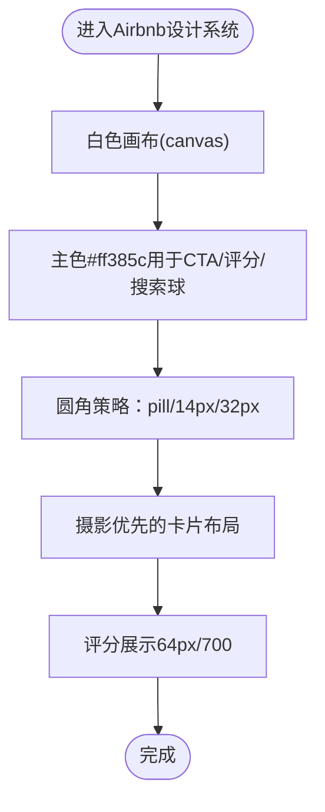

图表来源
- [awesome-design-md/design-md/airbnb/DESIGN.md](file://awesome-design-md/design-md/airbnb/DESIGN.md)

章节来源
- [awesome-design-md/design-md/airbnb/DESIGN.md](file://awesome-design-md/design-md/airbnb/DESIGN.md)

### Apple 风格：摄影博物馆式体验
- 设计特点
  - 全屏摄影/视频作为装饰；UI退居其次
  - 单一蓝色（Action Blue #0066cc）强调交互
  - 负字距显示头号，营造“紧密”节奏
- 适用场景
  - 科技产品发布页、高端硬件营销
- 最佳实践
  - 仅在需要时添加阴影；产品图像自带深度
  - 使用胶囊形按钮传达“行动”
- 实现要点
  - 交替浅/深色瓷砖；顶部导航+子导航
  - 按钮：胶囊形；卡片：18px圆角
  - 图像：全屏裁切，CDN优化

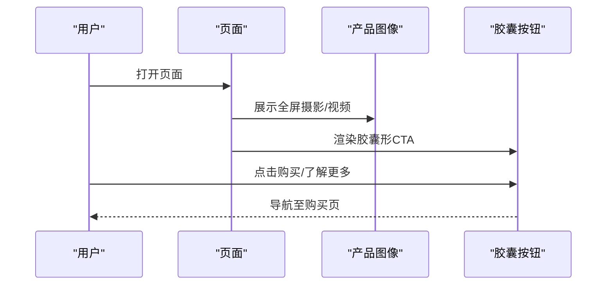

图表来源
- [awesome-design-md/design-md/apple/DESIGN.md](file://awesome-design-md/design-md/apple/DESIGN.md)

章节来源
- [awesome-design-md/design-md/apple/DESIGN.md](file://awesome-design-md/design-md/apple/DESIGN.md)

### Meta 风格：硬件电商与双CTA
- 设计特点
  - 白色画布 + 黑色主按钮（营销）；蓝色主按钮（购买）
  - 大型圆角卡片（32px）承载产品摄影
  - Optimistic VF 字体贯穿显示与正文
- 适用场景
  - 硬件零售（耳机、显卡、控制器等）
- 最佳实践
  - 购买流程内使用蓝色主按钮，避免与营销按钮混淆
  - 卡片圆角≥32px，突出产品摄影
- 实现要点
  - 顶部导航：分类胶囊标签
  - 产品画廊：缩略图+大图+右侧购买栏
  - 价格表：两列键值对表格

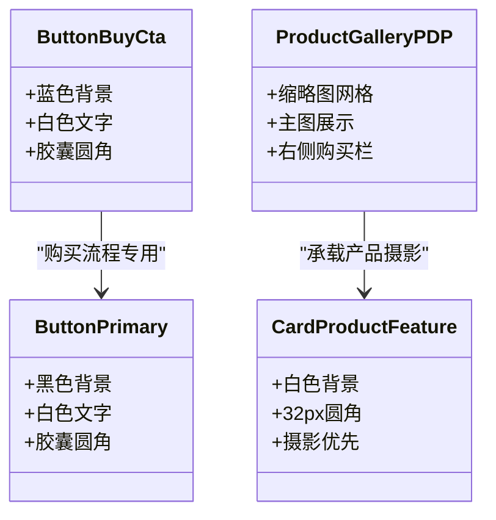

图表来源
- [awesome-design-md/design-md/meta/DESIGN.md](file://awesome-design-md/design-md/meta/DESIGN.md)

章节来源
- [awesome-design-md/design-md/meta/DESIGN.md](file://awesome-design-md/design-md/meta/DESIGN.md)

### Spacex 风格：纯黑与全屏摄影
- 设计特点
  - 纯黑画布；全屏摄影/自动播放视频
  - D-DIN 字体（加宽字距、紧缩行高）
  - 单一“透明+描边”胶囊按钮
- 适用场景
  - 航天/科技品牌发布页、极简主义
- 最佳实践
  - 不引入任何装饰元素或渐变
  - 显示头号必须为大写且加宽字距
- 实现要点
  - 固定顶部导航叠加在摄影上
  - 每个带段落均为全屏摄影+一行标题+一个胶囊按钮
  - 图像：srcset断点裁剪，移动端重新构图

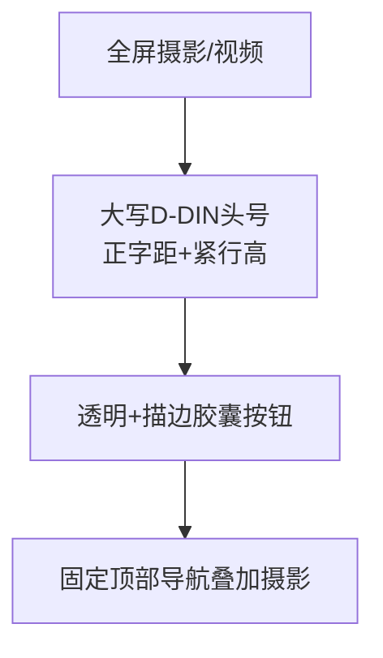

图表来源
- [awesome-design-md/design-md/spacex/DESIGN.md](file://awesome-design-md/design-md/spacex/DESIGN.md)

章节来源
- [awesome-design-md/design-md/spacex/DESIGN.md](file://awesome-design-md/design-md/spacex/DESIGN.md)

### Binance 风格：深黑与黄色主色
- 设计特点
  - 深近黑画布；Binance黄（#FCD535）用于主行动
  - 数字专用BinancePlex；交易绿/红用于涨跌
  - 营销页深色，交易页浅色（共享黄与灰蓝发丝线）
- 适用场景
  - 加密货币/金融平台、交易仪表盘
- 最佳实践
  - 黄色仅用于主行动与品牌声明，不用于次要元素
  - 数字一律使用BinancePlex
- 实现要点
  - 顶部导航：深色（营销）/浅色（交易）
  - 市场表：5列（配对/最新价/24h变化/成交量/操作）
  - 交易区：右栏摘要卡片

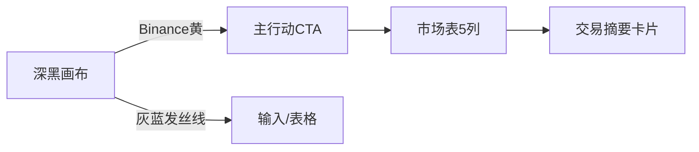

图表来源
- [awesome-design-md/design-md/binance/DESIGN.md](file://awesome-design-md/design-md/binance/DESIGN.md)

章节来源
- [awesome-design-md/design-md/binance/DESIGN.md](file://awesome-design-md/design-md/binance/DESIGN.md)

### BMW 风格：工程感与矩形按钮
- 设计特点
  - 浅奶油画布；深海军蓝作为主色
  - 两种字重：显示700，正文Light 300
  - 按钮全矩形（0半径），卡片无阴影
- 适用场景
  - 汽车品牌官网、经销商系统
- 最佳实践
  - 显示头号必须为700；正文必须为Light 300
  - 卡片照片容器无边框或仅轻边框
- 实现要点
  - 模型卡网格：4-up/5-up（桌面）
  - 配置器：筛选芯片+选项瓦片
  - 顶部导航：汉堡菜单（小屏）

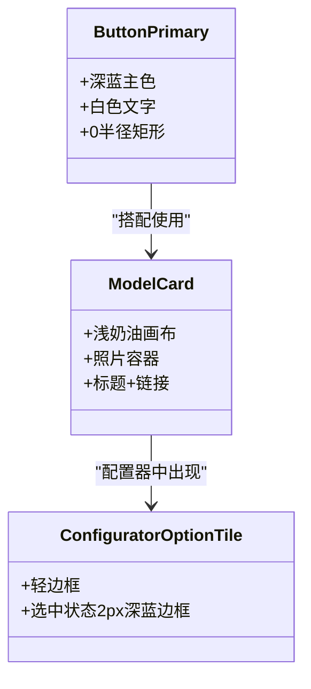

图表来源
- [awesome-design-md/design-md/bmw/DESIGN.md](file://awesome-design-md/design-md/bmw/DESIGN.md)

章节来源
- [awesome-design-md/design-md/bmw/DESIGN.md](file://awesome-design-md/design-md/bmw/DESIGN.md)

### Bugatti 风格：纯黑与三字体
- 设计特点
  - 纯黑画布；白色大写字母间距显示头号
  - 三字体：Display（大写+宽字距）、Text Regular（正文）、Monospace（按钮/导航）
  - 透明+描边胶囊按钮；卡片无圆角
- 适用场景
  - 超级跑车品牌、奢侈品营销
- 最佳实践
  - 严禁使用任何装饰元素或第二品牌色
  - 显示头号必须为大写且加宽字距
- 实现要点
  - 顶部导航：透明叠加摄影；居中品牌词
  - 英雄摄影带：大标题+一行按钮
  - 工作机会列表：行间距80px

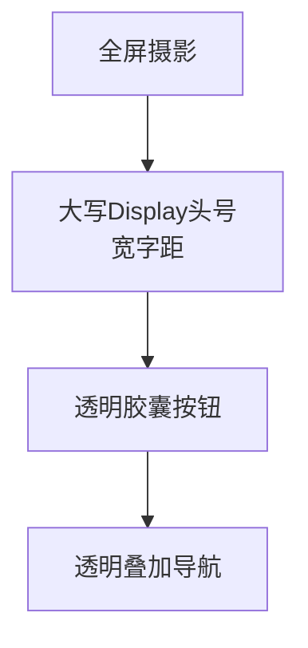

图表来源
- [awesome-design-md/design-md/bugatti/DESIGN.md](file://awesome-design-md/design-md/bugatti/DESIGN.md)

章节来源
- [awesome-design-md/design-md/bugatti/DESIGN.md](file://awesome-design-md/design-md/bugatti/DESIGN.md)

### Cal.com 风格：白灰与产品UI嵌入
- 设计特点
  - 白画布+浅灰卡片；黑主色按钮
  - Cal Sans显示头号（负字距）+ Inter正文
  - 将真实产品UI片段直接嵌入卡片
- 适用场景
  - SaaS日历/预约工具、产品营销
- 最佳实践
  - 产品UI片段展示真实交互，减少插画
  - 深色页脚仅用于收尾
- 实现要点
  - 英雄带：左侧头号+右侧产品Mockup卡片
  - 特性卡：浅灰背景；产品卡：白底chrome
  - 导航胶囊组：子导航切换

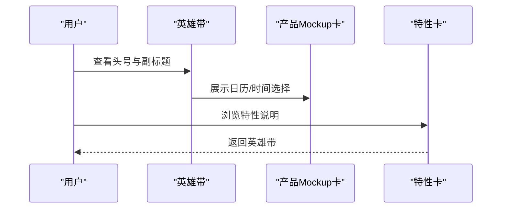

图表来源
- [awesome-design-md/design-md/cal/DESIGN.md](file://awesome-design-md/design-md/cal/DESIGN.md)

章节来源
- [awesome-design-md/design-md/cal/DESIGN.md](file://awesome-design-md/design-md/cal/DESIGN.md)

### Claude 风格：暖奶油与珊瑚色
- 设计特点
  - 暖奶油画布；珊瑚色主色；深海军蓝产品表面
  - Slab-serif显示头号（Copernicus/Tiempos）+ 人类主义sans
  - 以真实代码/模型对比卡片展示产品
- 适用场景
  - AI产品营销、技术出版风格
- 最佳实践
  - 仅在必要处使用珊瑚色；不与冷色调竞争
  - 显示头号必须为斜体serif，正文为sans
- 实现要点
  - 英雄带：左侧头号+右侧插画/代码窗口
  - 代码窗口：深色背景+语法高亮
  - 页脚：深色收尾

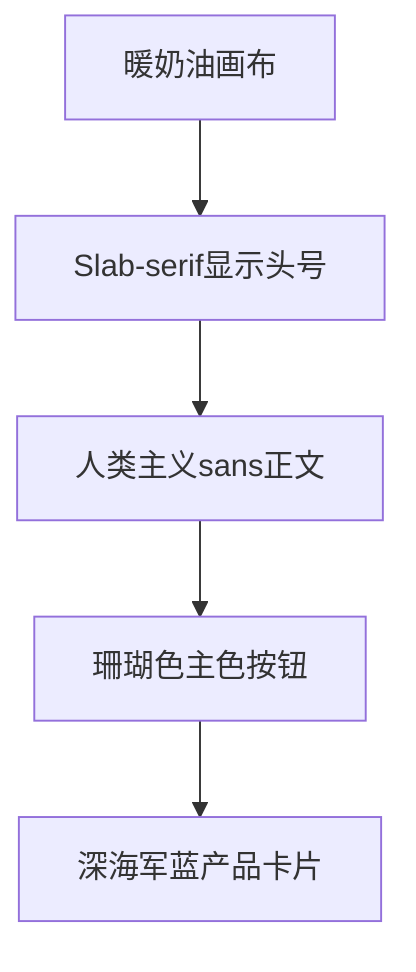

图表来源
- [awesome-design-md/design-md/claude/DESIGN.md](file://awesome-design-md/design-md/claude/DESIGN.md)

章节来源
- [awesome-design-md/design-md/claude/DESIGN.md](file://awesome-design-md/design-md/claude/DESIGN.md)

## 依赖关系分析
- 设计系统内部依赖
  - 颜色令牌依赖于品牌主色与语义色
  - 字体令牌依赖于显示/正文/代码的职责分离
  - 组件依赖于颜色、字体、间距、形状的组合
- 跨站点依赖
  - 多数站点共享“按钮/输入/卡片/导航/页脚”的通用组件族谱
  - 在“主题模式”（深/浅）切换时，颜色令牌与表面令牌互换
- 循环依赖风险
  - DESIGN.md通过引用令牌避免循环定义
  - 组件变体（-active/-disabled）独立成条目，避免相互引用

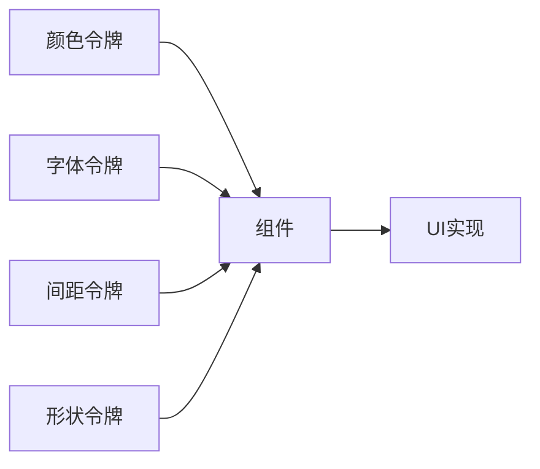

图表来源
- [awesome-design-md/design-md/airbnb/DESIGN.md](file://awesome-design-md/design-md/airbnb/DESIGN.md)
- [awesome-design-md/design-md/apple/DESIGN.md](file://awesome-design-md/design-md/apple/DESIGN.md)
- [awesome-design-md/design-md/meta/DESIGN.md](file://awesome-design-md/design-md/meta/DESIGN.md)
- [awesome-design-md/design-md/spacex/DESIGN.md](file://awesome-design-md/design-md/spacex/DESIGN.md)
- [awesome-design-md/design-md/binance/DESIGN.md](file://awesome-design-md/design-md/binance/DESIGN.md)
- [awesome-design-md/design-md/bmw/DESIGN.md](file://awesome-design-md/design-md/bmw/DESIGN.md)
- [awesome-design-md/design-md/bugatti/DESIGN.md](file://awesome-design-md/design-md/bugatti/DESIGN.md)
- [awesome-design-md/design-md/cal/DESIGN.md](file://awesome-design-md/design-md/cal/DESIGN.md)
- [awesome-design-md/design-md/claude/DESIGN.md](file://awesome-design-md/design-md/claude/DESIGN.md)

章节来源
- [awesome-design-md/design-md/airbnb/DESIGN.md](file://awesome-design-md/design-md/airbnb/DESIGN.md)
- [awesome-design-md/design-md/apple/DESIGN.md](file://awesome-design-md/design-md/apple/DESIGN.md)
- [awesome-design-md/design-md/meta/DESIGN.md](file://awesome-design-md/design-md/meta/DESIGN.md)
- [awesome-design-md/design-md/spacex/DESIGN.md](file://awesome-design-md/design-md/spacex/DESIGN.md)
- [awesome-design-md/design-md/binance/DESIGN.md](file://awesome-design-md/design-md/binance/DESIGN.md)
- [awesome-design-md/design-md/bmw/DESIGN.md](file://awesome-design-md/design-md/bmw/DESIGN.md)
- [awesome-design-md/design-md/bugatti/DESIGN.md](file://awesome-design-md/design-md/bugatti/DESIGN.md)
- [awesome-design-md/design-md/cal/DESIGN.md](file://awesome-design-md/design-md/cal/DESIGN.md)
- [awesome-design-md/design-md/claude/DESIGN.md](file://awesome-design-md/design-md/claude/DESIGN.md)

## 性能考量
- 图像优化
  - 使用srcset与CDN优化；移动端裁剪与艺术方向调整
  - 懒加载策略：首屏优先，滚动时加载
- 字体加载
  - 自定义字体（如BinanceNova、Cal Sans、Copernicus）需考虑回退与字距
  - 通过变量字体与权重映射提升渲染一致性
- 交互与动画
  - 按钮/卡片的按压反馈（scale 0.95）与阴影过渡需控制时长（150–250ms）
  - 高密度列表（如市场表、工作机会）需避免过度动画

## 故障排查指南
- 常见问题
  - 字体未加载：检查回退栈与字距设置
  - 对比度不足：核对文本与背景的AA/AAA阈值
  - 触达目标过小：确保按钮/图标≥44×44px
  - 阴影滥用：仅在必要处使用，避免视觉噪音
- 排查步骤
  - 使用 linter 校验令牌引用与对比度
  - 在移动断点下验证折叠策略与触摸目标
  - 检查主题切换（深/浅）下的颜色令牌映射

章节来源
- [awesome-design-md/design-md/binance/DESIGN.md](file://awesome-design-md/design-md/binance/DESIGN.md)
- [awesome-design-md/design-md/cal/DESIGN.md](file://awesome-design-md/design-md/cal/DESIGN.md)
- [awesome-design-md/design-md/claude/DESIGN.md](file://awesome-design-md/design-md/claude/DESIGN.md)

## 结论
通过对多个真实站点的DESIGN.md进行系统化拆解，我们提炼出一套可迁移的设计系统范式：以“颜色/字体/组件/间距/形状/布局/响应式”为核心骨架，并结合站点特有的视觉语言与交互策略。在此基础上，你可以快速适配不同风格，同时保证一致性与可维护性。

## 附录
- 快速索引
  - Airbnb：摄影驱动 + 圆角柔和
  - Apple：摄影博物馆 + 单蓝强调
  - Meta：硬件电商 + 双CTA
  - Spacex：纯黑 + 全屏摄影
  - Binance：深黑 + 黄为主色
  - BMW：工程感 + 矩形按钮
  - Bugatti：纯黑 + 三字体
  - Cal.com：白灰 + 产品UI嵌入
  - Claude：暖奶油 + 珊瑚色