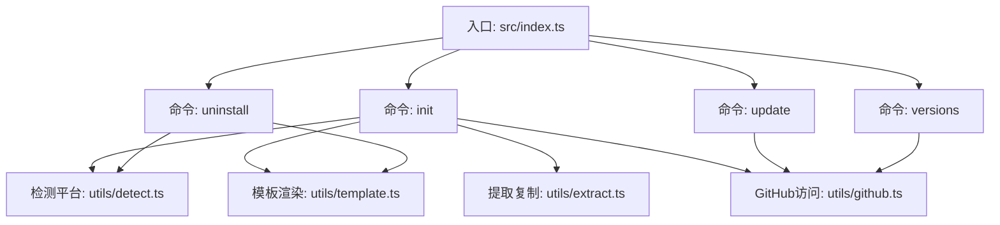
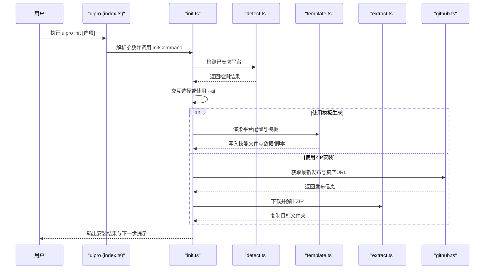
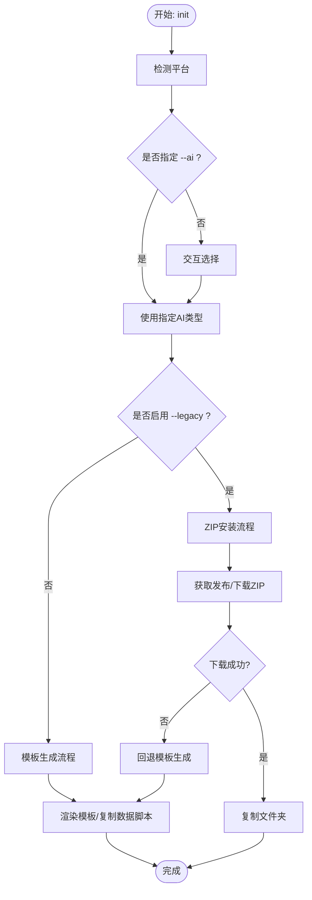
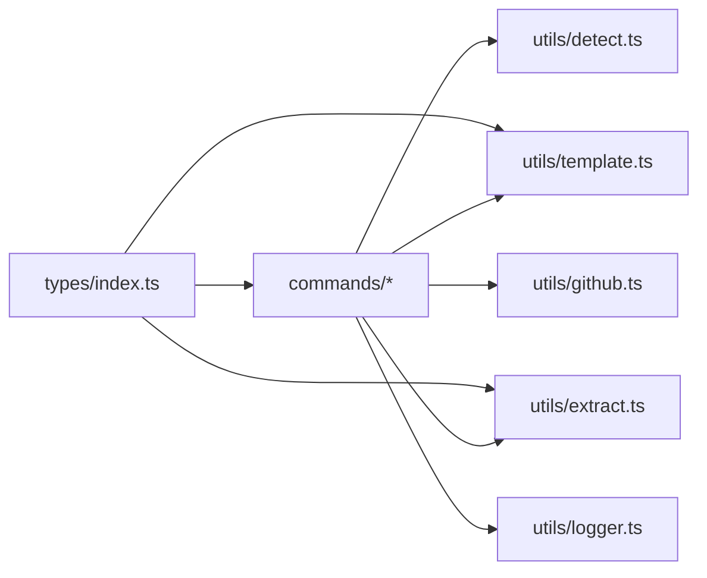

# CLI命令行工具

<cite>
**本文引用的文件**
- [package.json](file://ui-ux-pro-max-skill/cli/package.json)
- [README.md](file://ui-ux-pro-max-skill/cli/README.md)
- [src/index.ts](file://ui-ux-pro-max-skill/cli/src/index.ts)
- [src/commands/init.ts](file://ui-ux-pro-max-skill/cli/src/commands/init.ts)
- [src/commands/update.ts](file://ui-ux-pro-max-skill/cli/src/commands/update.ts)
- [src/commands/versions.ts](file://ui-ux-pro-max-skill/cli/src/commands/versions.ts)
- [src/commands/uninstall.ts](file://ui-ux-pro-max-skill/cli/src/commands/uninstall.ts)
- [src/types/index.ts](file://ui-ux-pro-max-skill/cli/src/types/index.ts)
- [src/utils/template.ts](file://ui-ux-pro-max-skill/cli/src/utils/template.ts)
- [src/utils/detect.ts](file://ui-ux-pro-max-skill/cli/src/utils/detect.ts)
- [src/utils/extract.ts](file://ui-ux-pro-max-skill/cli/src/utils/extract.ts)
- [src/utils/github.ts](file://ui-ux-pro-max-skill/cli/src/utils/github.ts)
- [src/utils/logger.ts](file://ui-ux-pro-max-skill/cli/src/utils/logger.ts)
- [assets/templates/platforms/claude.json](file://ui-ux-pro-max-skill/cli/assets/templates/platforms/claude.json)
</cite>

## 目录
1. [简介](#简介)
2. [项目结构](#项目结构)
3. [核心组件](#核心组件)
4. [架构总览](#架构总览)
5. [详细组件分析](#详细组件分析)
6. [依赖关系分析](#依赖关系分析)
7. [性能与可靠性](#性能与可靠性)
8. [故障排除指南](#故障排除指南)
9. [结论](#结论)
10. [附录：使用与集成示例](#附录使用与集成示例)

## 简介
本CLI工具用于为多款AI编程助手（如Claude、Cursor、Windsurf、Copilot等）安装“UI/UX Pro Max”技能包，支持从GitHub发布包下载安装或基于本地模板生成两种模式。它提供全局安装能力，并内置平台适配、模板渲染、资产同步与版本管理等功能，帮助开发者在不同AI助手间快速部署一致的设计系统与工作流。

## 项目结构
CLI采用模块化分层组织：
- 命令入口与路由：src/index.ts
- 子命令实现：src/commands/*
- 类型定义：src/types/index.ts
- 工具模块：src/utils/*
- 资产与模板：assets/*（构建后打包到dist/assets）

图表来源
- [src/index.ts:18-88](file://ui-ux-pro-max-skill/cli/src/index.ts#L18-L88)
- [src/commands/init.ts:121-221](file://ui-ux-pro-max-skill/cli/src/commands/init.ts#L121-L221)
- [src/commands/update.ts:30-95](file://ui-ux-pro-max-skill/cli/src/commands/update.ts#L30-L95)
- [src/commands/versions.ts:10-47](file://ui-ux-pro-max-skill/cli/src/commands/versions.ts#L10-L47)
- [src/commands/uninstall.ts:60-157](file://ui-ux-pro-max-skill/cli/src/commands/uninstall.ts#L60-L157)
- [src/utils/detect.ts:10-77](file://ui-ux-pro-max-skill/cli/src/utils/detect.ts#L10-L77)
- [src/utils/template.ts:233-301](file://ui-ux-pro-max-skill/cli/src/utils/template.ts#L233-L301)
- [src/utils/extract.ts:35-88](file://ui-ux-pro-max-skill/cli/src/utils/extract.ts#L35-L88)
- [src/utils/github.ts:54-127](file://ui-ux-pro-max-skill/cli/src/utils/github.ts#L54-L127)

章节来源
- [package.json:1-52](file://ui-ux-pro-max-skill/cli/package.json#L1-L52)
- [README.md:1-100](file://ui-ux-pro-max-skill/cli/README.md#L1-L100)
- [src/index.ts:18-88](file://ui-ux-pro-max-skill/cli/src/index.ts#L18-L88)

## 核心组件
- 全局安装与发布配置：通过package.json声明二进制入口与构建脚本，支持全局可执行命令uipro。
- 命令注册与参数解析：使用commander进行命令与选项解析，统一版本号来源。
- 平台类型与映射：AI类型枚举与平台文件夹映射，兼容历史ZIP安装布局。
- 模板生成与渲染：从assets模板渲染技能文件，支持全局路径重写与子技能批量复制。
- 下载与版本管理：通过GitHub Releases获取最新版本，支持带令牌的高限速请求。
- 自动检测与交互：自动检测当前项目已安装的AI助手，提供交互式选择。
- 安全与容错：网络错误、速率限制时回退到模板生成；失败时清理临时目录。

章节来源
- [package.json:6-8](file://ui-ux-pro-max-skill/cli/package.json#L6-L8)
- [src/index.ts:20-88](file://ui-ux-pro-max-skill/cli/src/index.ts#L20-L88)
- [src/types/index.ts:1-70](file://ui-ux-pro-max-skill/cli/src/types/index.ts#L1-L70)
- [src/utils/template.ts:233-301](file://ui-ux-pro-max-skill/cli/src/utils/template.ts#L233-L301)
- [src/utils/github.ts:54-127](file://ui-ux-pro-max-skill/cli/src/utils/github.ts#L54-L127)
- [src/utils/detect.ts:10-77](file://ui-ux-pro-max-skill/cli/src/utils/detect.ts#L10-L77)
- [src/utils/extract.ts:35-88](file://ui-ux-pro-max-skill/cli/src/utils/extract.ts#L35-L88)

## 架构总览
CLI整体流程分为四类场景：
- 初始化安装：优先尝试GitHub下载，失败则回退模板生成；支持全局安装与强制覆盖。
- 版本查询：列出可用发布版本，便于手动更新或审计。
- 更新升级：检查最新版本，必要时调用npm安装新版本CLI，再刷新技能文件。
- 卸载清理：根据检测结果定位并删除对应平台的技能目录，含历史布局兼容。

图表来源
- [src/index.ts:33-46](file://ui-ux-pro-max-skill/cli/src/index.ts#L33-L46)
- [src/commands/init.ts:121-221](file://ui-ux-pro-max-skill/cli/src/commands/init.ts#L121-L221)
- [src/utils/detect.ts:10-77](file://ui-ux-pro-max-skill/cli/src/utils/detect.ts#L10-L77)
- [src/utils/template.ts:233-301](file://ui-ux-pro-max-skill/cli/src/utils/template.ts#L233-L301)
- [src/utils/extract.ts:125-149](file://ui-ux-pro-max-skill/cli/src/utils/extract.ts#L125-L149)
- [src/utils/github.ts:74-92](file://ui-ux-pro-max-skill/cli/src/utils/github.ts#L74-L92)

## 详细组件分析

### 命令入口与参数解析
- 命令注册：init、versions、update、uninstall四个子命令，统一设置名称、描述与版本。
- 参数校验：对--ai进行合法性检查，非法值直接报错退出。
- 令牌传递：支持--token参数与环境变量（UI_PRO_MAX_GITHUB_TOKEN优先，其次GITHUB_TOKEN）。

章节来源
- [src/index.ts:20-88](file://ui-ux-pro-max-skill/cli/src/index.ts#L20-L88)

### 初始化安装（init）
- 自动检测：扫描当前目录是否存在各AI助手的根目录，推断建议项。
- 交互选择：若未指定--ai，弹出菜单供用户选择。
- 两种安装路径：
  - 模板生成：读取assets中的模板与平台配置，渲染技能文件并复制数据/脚本，支持全局绝对路径重写。
  - ZIP安装：拉取GitHub最新发布，下载ZIP并解压，复制对应文件夹集合。
- 回退策略：网络错误、下载失败、速率限制时自动回退到模板生成。
- 强制覆盖：--force允许覆盖已存在文件。
- 全局安装：--global将安装到用户主目录，调整脚本路径前缀。

图表来源
- [src/commands/init.ts:121-221](file://ui-ux-pro-max-skill/cli/src/commands/init.ts#L121-L221)
- [src/utils/github.ts:74-127](file://ui-ux-pro-max-skill/cli/src/utils/github.ts#L74-L127)
- [src/utils/extract.ts:125-149](file://ui-ux-pro-max-skill/cli/src/utils/extract.ts#L125-L149)
- [src/utils/template.ts:233-301](file://ui-ux-pro-max-skill/cli/src/utils/template.ts#L233-L301)

章节来源
- [src/commands/init.ts:121-221](file://ui-ux-pro-max-skill/cli/src/commands/init.ts#L121-L221)

### 版本列表（versions）
- 通过GitHub Releases接口获取版本列表，按发布时间倒序展示。
- 无发布时提示“未找到发布”。

章节来源
- [src/commands/versions.ts:10-47](file://ui-ux-pro-max-skill/cli/src/commands/versions.ts#L10-L47)
- [src/utils/github.ts:54-72](file://ui-ux-pro-max-skill/cli/src/utils/github.ts#L54-L72)

### 更新升级（update）
- 检查当前CLI版本与最新发布版本，若不一致则调用npm安装新版本（Windows下使用npm.cmd）。
- 成功后提示再次运行init --ai <platform> --force以刷新技能文件。
- 对非语义化版本名给出警告并引导手动更新。

章节来源
- [src/commands/update.ts:30-95](file://ui-ux-pro-max-skill/cli/src/commands/update.ts#L30-L95)

### 卸载清理（uninstall）
- 自动检测已安装的AI助手，支持交互选择或卸载全部。
- 根据平台配置与历史布局（含.shared）计算父级目录，删除技能目录及其子技能。
- 支持全局卸载至用户主目录。

章节来源
- [src/commands/uninstall.ts:60-157](file://ui-ux-pro-max-skill/cli/src/commands/uninstall.ts#L60-L157)

### 类型与平台映射
- AI类型枚举与“all”聚合类型，用于批量安装。
- 平台到文件夹映射，兼容历史ZIP布局（部分平台包含.shared）。
- 平台配置包含根目录、技能路径、文件名、脚本路径、frontmatter、章节开关等字段。

章节来源
- [src/types/index.ts:1-70](file://ui-ux-pro-max-skill/cli/src/types/index.ts#L1-L70)

### 模板生成机制
- 加载平台配置JSON，渲染基础模板与可选“快速参考”片段。
- 替换占位符（标题、描述、脚本路径、技能类型），支持全局模式下的脚本路径重写。
- 复制数据与脚本目录，确保技能自包含。
- 批量复制捆绑的子技能，形成“一揽子”安装体验。

章节来源
- [src/utils/template.ts:63-157](file://ui-ux-pro-max-skill/cli/src/utils/template.ts#L63-L157)
- [src/utils/template.ts:179-283](file://ui-ux-pro-max-skill/cli/src/utils/template.ts#L179-L283)
- [assets/templates/platforms/claude.json:1-22](file://ui-ux-pro-max-skill/cli/assets/templates/platforms/claude.json#L1-L22)

### 平台适配策略
- 基于目录探测识别已安装平台，避免误判。
- 不同平台的根目录与技能路径差异由配置驱动，保证安装位置一致性。
- 兼容历史布局（如某些平台的skills/与非skills/路径），提升卸载与迁移兼容性。

章节来源
- [src/utils/detect.ts:10-77](file://ui-ux-pro-max-skill/cli/src/utils/detect.ts#L10-L77)
- [src/utils/template.ts:30-49](file://ui-ux-pro-max-skill/cli/src/utils/template.ts#L30-L49)

### 离线安装与回退
- --offline为兼容标记，当前默认走模板生成；legacy模式下可结合离线场景使用捆绑资产。
- 网络异常、下载失败、速率限制时自动回退模板生成，保障可用性。

章节来源
- [src/index.ts:30](file://ui-ux-pro-max-skill/cli/src/index.ts#L30)
- [src/commands/init.ts:168-187](file://ui-ux-pro-max-skill/cli/src/commands/init.ts#L168-L187)
- [src/utils/github.ts:33-47](file://ui-ux-pro-max-skill/cli/src/utils/github.ts#L33-L47)

## 依赖关系分析
- 运行时依赖：commander（命令行）、chalk（彩色输出）、ora（加载动画）、prompts（交互）。
- 开发依赖：bun/typescript等，构建产物dist与assets打包发布。
- 命令到工具：init依赖detect、template、extract、github；uninstall依赖detect与template；update依赖github与init；versions依赖github。

图表来源
- [src/commands/init.ts:8-11](file://ui-ux-pro-max-skill/cli/src/commands/init.ts#L8-L11)
- [src/commands/uninstall.ts:8-11](file://ui-ux-pro-max-skill/cli/src/commands/uninstall.ts#L8-L11)
- [src/commands/update.ts:7-9](file://ui-ux-pro-max-skill/cli/src/commands/update.ts#L7-L9)
- [src/commands/versions.ts:3](file://ui-ux-pro-max-skill/cli/src/commands/versions.ts#L3-L3)
- [src/types/index.ts:1-70](file://ui-ux-pro-max-skill/cli/src/types/index.ts#L1-L70)

章节来源
- [package.json:39-50](file://ui-ux-pro-max-skill/cli/package.json#L39-L50)
- [src/index.ts:7-12](file://ui-ux-pro-max-skill/cli/src/index.ts#L7-L12)

## 性能与可靠性
- 模板生成避免网络依赖，适合内网与离线环境。
- ZIP安装在有网络且令牌充足时更快，但需处理解压与跨平台差异。
- 速率限制与网络错误具备明确回退路径，减少失败率。
- 临时目录清理与幂等操作（如重复安装）降低副作用。

[本节为通用指导，无需特定文件引用]

## 故障排除指南
- GitHub速率限制
  - 现象：出现403/429或剩余配额为0。
  - 处理：设置UI_PRO_MAX_GITHUB_TOKEN或GITHUB_TOKEN；或使用--token传入一次性令牌。
- 下载失败或网络异常
  - 现象：TypeError中包含fetch或下载失败。
  - 处理：自动回退模板生成；检查代理与防火墙；确认ZIP资产存在。
- 权限不足导致更新失败
  - 现象：Windows下npm.cmd权限问题。
  - 处理：以管理员身份运行或手动执行更新命令。
- 未检测到已安装平台
  - 现象：uninstall无法自动识别。
  - 处理：确认项目根目录存在对应平台的隐藏目录；或手动指定--ai。

章节来源
- [src/utils/github.ts:33-47](file://ui-ux-pro-max-skill/cli/src/utils/github.ts#L33-L47)
- [src/commands/init.ts:78-96](file://ui-ux-pro-max-skill/cli/src/commands/init.ts#L78-L96)
- [src/commands/update.ts:56-70](file://ui-ux-pro-max-skill/cli/src/commands/update.ts#L56-L70)
- [src/commands/uninstall.ts:67-77](file://ui-ux-pro-max-skill/cli/src/commands/uninstall.ts#L67-L77)

## 结论
该CLI以清晰的命令分层、稳健的回退策略与丰富的平台适配，实现了在多AI助手间的统一技能交付。模板生成与捆绑资产相结合，既满足离线需求，又能在网络环境下快速获取最新内容。通过版本查询与自动更新，保持工具链的持续演进。

[本节为总结性内容，无需特定文件引用]

## 附录：使用与集成示例

### 全局安装与基本使用
- 全局安装：npm install -g ui-ux-pro-max-cli
- 基本命令：uipro init --ai <平台>；uipro versions；uipro update；uipro uninstall

章节来源
- [README.md:5-37](file://ui-ux-pro-max-skill/cli/README.md#L5-L37)

### 常用参数与标志位
- init
  - --ai：指定平台类型（支持所有已知平台与all）
  - --force：覆盖现有文件
  - --offline：兼容标记（当前默认模板生成）
  - --global：全局安装至用户主目录
  - --token：GitHub个人访问令牌
- update
  - --ai：可选，更新后刷新对应平台文件
  - --token：提高API速率限制
- uninstall
  - --ai：指定要卸载的平台
  - --global：从全局目录卸载
- versions
  - --token：提高API速率限制

章节来源
- [src/index.ts:25-86](file://ui-ux-pro-max-skill/cli/src/index.ts#L25-L86)

### 离线安装与版本管理
- 离线安装：在无网络或受限网络环境中，模板生成仍可工作。
- 版本管理：uipro versions列出可用版本；uipro update自动升级CLI并刷新技能文件。

章节来源
- [README.md:39-74](file://ui-ux-pro-max-skill/cli/README.md#L39-L74)
- [src/commands/versions.ts:10-47](file://ui-ux-pro-max-skill/cli/src/commands/versions.ts#L10-L47)
- [src/commands/update.ts:30-95](file://ui-ux-pro-max-skill/cli/src/commands/update.ts#L30-L95)

### 实际使用案例
- 为单个平台安装：uipro init --ai claude
- 为多个平台安装：uipro init --ai all
- 全局安装：uipro init --ai cursor --global
- 强制刷新：uipro init --ai codex --force

章节来源
- [README.md:13-37](file://ui-ux-pro-max-skill/cli/README.md#L13-L37)

### 批处理脚本与自动化集成
- 在CI/CD中使用：导出UI_PRO_MAX_GITHUB_TOKEN后执行uipro init；或在脚本中先uipro update再uipro init --force。
- Windows批处理：使用npm.cmd安装CLI后，调用uipro命令。
- Shell脚本：在.bashrc/.zshrc中别名化常用组合，配合--ai与--force实现一键刷新。

章节来源
- [README.md:39-74](file://ui-ux-pro-max-skill/cli/README.md#L39-L74)
- [src/commands/update.ts:56-70](file://ui-ux-pro-max-skill/cli/src/commands/update.ts#L56-L70)