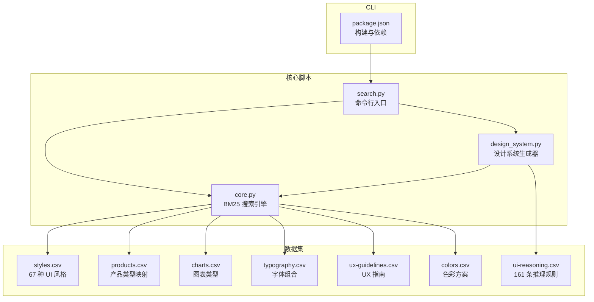
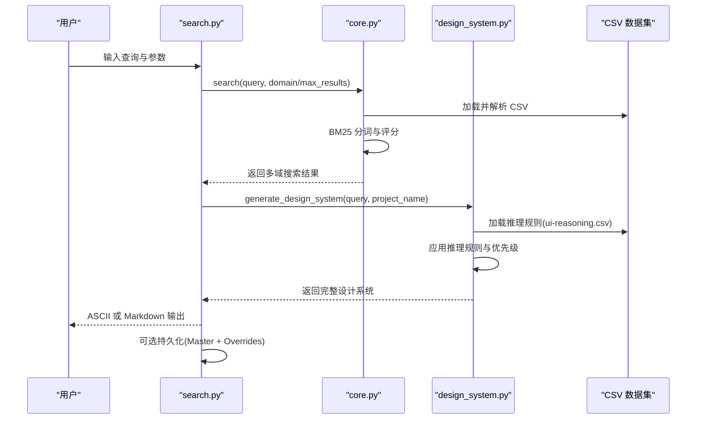
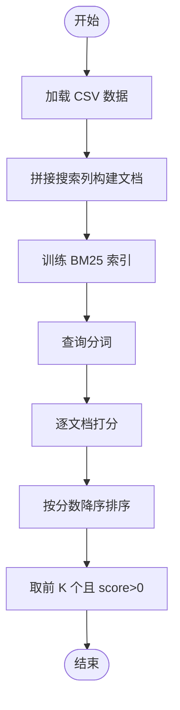
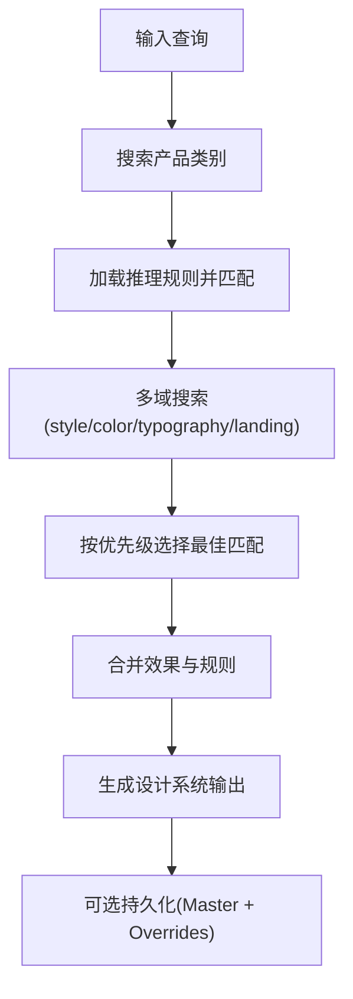
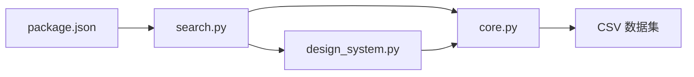

# UI UX Pro Max 智能设计系统生成器

<cite>
**本文档引用的文件**
- [README.md](file://README.md)
- [skill.json](file://skill.json)
- [core.py](file://src/ui-ux-pro-max/scripts/core.py)
- [design_system.py](file://src/ui-ux-pro-max/scripts/design_system.py)
- [search.py](file://src/ui-ux-pro-max/scripts/search.py)
- [ui-reasoning.csv](file://src/ui-ux-pro-max/data/ui-reasoning.csv)
- [styles.csv](file://src/ui-ux-pro-max/data/styles.csv)
- [package.json](file://cli/package.json)
</cite>

## 目录
1. [项目简介](#项目简介)
2. [项目结构](#项目结构)
3. [核心组件](#核心组件)
4. [架构总览](#架构总览)
5. [详细组件分析](#详细组件分析)
6. [依赖关系分析](#依赖关系分析)
7. [性能考虑](#性能考虑)
8. [故障排除指南](#故障排除指南)
9. [结论](#结论)
10. [附录](#附录)

## 项目简介
UI UX Pro Max 是一个基于 Python 的智能设计系统生成器，通过 161 条行业推理规则与 67 种 UI 风格库，结合 BM25 搜索引擎，为多平台前端框架（React、Vue、Flutter、SwiftUI 等）提供端到端的设计系统生成能力。其核心特性包括：
- 多域搜索：产品类型匹配、UI 风格推荐、色彩方案、落地页模式、字体组合、图表类型、UX 指南等
- 推理引擎：基于 CSV 规则的决策树与优先级排序，过滤反模式并输出可执行的设计系统
- 输出格式：ASCII 方框图与 Markdown 格式，支持预交付检查清单与设计令牌模板
- CLI 工具：一键安装与更新，支持持久化设计系统（Master + Overrides 层次化检索）

该系统在 v2.0 中引入了“设计系统生成器”，可在数秒内根据用户需求生成完整的 Pattern + Style + Colors + Typography + Effects + Anti-patterns + Checklists。

## 项目结构
仓库采用模块化分层组织：
- src/ui-ux-pro-max/scripts：核心搜索与设计系统生成逻辑（Python）
- src/ui-ux-pro-max/data：CSV 数据集（样式、颜色、字体、产品、推理规则等）
- cli：CLI 安装器（TypeScript），负责模板同步与平台适配
- 技能元数据：skill.json 描述平台兼容性与安装方式
- 顶层 README.md 提供使用说明、示例与架构概览

**图表来源**
- [core.py:1-269](file://src/ui-ux-pro-max/scripts/core.py#L1-L269)
- [design_system.py:1-800](file://src/ui-ux-pro-max/scripts/design_system.py#L1-L800)
- [search.py:1-115](file://src/ui-ux-pro-max/scripts/search.py#L1-L115)
- [ui-reasoning.csv:1-163](file://src/ui-ux-pro-max/data/ui-reasoning.csv#L1-L163)
- [styles.csv:1-86](file://src/ui-ux-pro-max/data/styles.csv#L1-L86)
- [package.json:1-52](file://cli/package.json#L1-L52)

**章节来源**
- [README.md:1-649](file://README.md#L1-L649)
- [skill.json:1-43](file://skill.json#L1-L43)

## 核心组件
- BM25 搜索引擎：对多列文本进行分词、去噪与评分，支持跨域检索与结果排序
- 设计系统生成器：聚合多域搜索结果，应用推理规则，生成 Pattern/Style/Colors/Typography/Effects/Anti-patterns/Checklist
- 命令行接口：支持 domain、stack、json、design-system、persist、page 等参数
- 数据集：包含风格、产品、颜色、字体、图表、UX、通用界面指南等 CSV 文件

**章节来源**
- [core.py:110-269](file://src/ui-ux-pro-max/scripts/core.py#L110-L269)
- [design_system.py:45-254](file://src/ui-ux-pro-max/scripts/design_system.py#L45-L254)
- [search.py:56-115](file://src/ui-ux-pro-max/scripts/search.py#L56-L115)

## 架构总览
设计系统生成的端到端流程如下：

**图表来源**
- [search.py:56-115](file://src/ui-ux-pro-max/scripts/search.py#L56-L115)
- [core.py:179-269](file://src/ui-ux-pro-max/scripts/core.py#L179-L269)
- [design_system.py:171-254](file://src/ui-ux-pro-max/scripts/design_system.py#L171-L254)

## 详细组件分析

### 组件一：BM25 搜索引擎（core.py）
- 功能要点
  - 文本预处理：小写化、标点清理、过滤短词
  - 索引构建：统计词频、计算 IDF、求平均文档长度
  - 查询评分：TF-IDF 结合 BM25 公式，按分数降序返回
  - 自动域检测：根据关键词自动选择 domain（style/color/chart/landing/product/ux/typography/google-fonts/icons/react/web）
  - 多栈搜索：针对不同技术栈加载对应 CSV 并返回最佳实践
- 性能特征
  - 时间复杂度：索引 O(N·M)，查询 O(K·M)，N 为文档数，M 为词汇数，K 为查询词数
  - 空间复杂度：存储词频与 IDF，适合中小规模 CSV 数据
- 错误处理
  - 文件不存在时返回错误信息；未知栈或域时提示可用列表

**图表来源**
- [core.py:110-170](file://src/ui-ux-pro-max/scripts/core.py#L110-L170)

**章节来源**
- [core.py:110-269](file://src/ui-ux-pro-max/scripts/core.py#L110-L269)

### 组件二：设计系统生成器（design_system.py）
- 功能要点
  - 多域搜索：product/style/color/typography/landing 各自限制结果数量
  - 推理规则应用：从 ui-reasoning.csv 加载规则，匹配产品类别，提取推荐 Pattern、Style 优先级、Color Mood、Typography Mood、Key Effects、Anti-patterns、决策规则
  - 最佳匹配选择：优先使用推理规则中的 Style 优先级，其次按关键字匹配度选择
  - 输出格式：ASCII 方框图与 Markdown，包含预交付检查清单
  - 持久化：Master + Overrides 层次化结构，支持页面级覆盖
- 决策流程

**图表来源**
- [design_system.py:59-254](file://src/ui-ux-pro-max/scripts/design_system.py#L59-L254)

**章节来源**
- [design_system.py:45-254](file://src/ui-ux-pro-max/scripts/design_system.py#L45-L254)
- [ui-reasoning.csv:1-163](file://src/ui-ux-pro-max/data/ui-reasoning.csv#L1-L163)

### 组件三：命令行接口（search.py）
- 支持参数
  - --domain/-d：指定搜索域（style/color/chart/landing/product/ux/typography/google-fonts/icons/react/web）
  - --stack/-s：指定技术栈（react/nextjs/vue/svelte/astro/swiftui/react-native/flutter/nuxtjs/nuxt-ui/html-tailwind/shadcn/jetpack-compose/threejs/angular/laravel/javafx/wpf/winui/avalonia/uno/uwp）
  - --max-results/-n：最大结果数
  - --json：以 JSON 输出
  - --design-system/-ds：生成完整设计系统
  - --project-name/-p：项目名（用于输出头与持久化目录）
  - --format/-f：输出格式（ascii/markdown）
  - --persist：保存到 design-system/MASTER.md
  - --page：创建页面级覆盖文件
  - --output-dir/-o：输出目录
- 输出行为
  - 设计系统生成：打印 ASCII 或 Markdown 格式结果，可选持久化确认信息
  - 堆栈搜索：返回堆栈特定最佳实践
  - 域搜索：返回多域搜索结果摘要

**章节来源**
- [search.py:56-115](file://src/ui-ux-pro-max/scripts/search.py#L56-L115)

### 组件四：数据模型（CSV）
- 样式库（styles.csv）
  - 字段：Style Category、Type、Keywords、Primary/Secondary Colors、Effects & Animation、Best For、Light/Dark Mode、Performance、Accessibility、Framework Compatibility、Complexity、AI Prompt Keywords、CSS/Technical Keywords、Implementation Checklist、Design System Variables
  - 用途：提供 67 种 UI 风格的实现细节与适用场景
- 推理规则（ui-reasoning.csv）
  - 字段：UI_Category、Recommended_Pattern、Style_Priority、Color_Mood、Typography_Mood、Key_Effects、Decision_Rules、Anti_Patterns、Severity
  - 用途：为 161 个产品类别提供 Pattern/Style/Color/Typography/Effects/反模式与严重级别
- 其他数据集
  - colors.csv：色彩方案（含语义色值与注释）
  - typography.csv：字体组合与导入建议
  - charts.csv：图表类型与可访问性建议
  - products.csv：产品类型与推荐风格
  - ux-guidelines.csv：UX 指南与代码示例
  - google-fonts.csv：字体元数据与导入链接
  - react-performance.csv、app-interface.csv：技术栈特定指南

**章节来源**
- [styles.csv:1-86](file://src/ui-ux-pro-max/data/styles.csv#L1-L86)
- [ui-reasoning.csv:1-163](file://src/ui-ux-pro-max/data/ui-reasoning.csv#L1-L163)

### 组件五：CLI 工具（cli/package.json）
- 包管理：bun 构建、commander 路由、chalk 输出美化、ora 进度指示、prompts 交互
- 关键脚本
  - build：编译 TypeScript 到 dist
  - sync:assets：同步资产到 CLI
  - check:assets：校验资产一致性
  - typecheck：类型检查
- 二进制入口：uipro 指向 dist/index.js

**章节来源**
- [package.json:1-52](file://cli/package.json#L1-L52)

## 依赖关系分析
- 组件耦合
  - search.py 依赖 core.py 与 design_system.py
  - design_system.py 依赖 core.py 与 ui-reasoning.csv
  - core.py 依赖 CSV 数据集（styles.csv、products.csv、charts.csv、typography.csv、ux-guidelines.csv、colors.csv、google-fonts.csv、各技术栈 CSV）
- 外部依赖
  - Python：标准库（csv、re、pathlib、math、collections.defaultdict）
  - CLI：commander、chalk、ora、prompts（TypeScript）

**图表来源**
- [search.py:17-21](file://src/ui-ux-pro-max/scripts/search.py#L17-L21)
- [core.py:7-14](file://src/ui-ux-pro-max/scripts/core.py#L7-L14)
- [design_system.py:16-23](file://src/ui-ux-pro-max/scripts/design_system.py#L16-L23)
- [package.json:39-50](file://cli/package.json#L39-L50)

**章节来源**
- [search.py:17-21](file://src/ui-ux-pro-max/scripts/search.py#L17-L21)
- [core.py:7-14](file://src/ui-ux-pro-max/scripts/core.py#L7-L14)
- [design_system.py:16-23](file://src/ui-ux-pro-max/scripts/design_system.py#L16-L23)
- [package.json:39-50](file://cli/package.json#L39-L50)

## 性能考虑
- 搜索性能
  - 小规模 CSV 数据（每表数百行）适合 BM25 离线索引；建议控制 max_results 与查询复杂度
  - 对于大字段（如 Implementation Checklist、CSS/Technical Keywords），建议在输出时截断或分段显示
- 渲染与输出
  - ASCII 方框图在 Windows 默认编码下可能显示异常，脚本已强制 UTF-8 输出
  - Markdown 输出更利于后续编辑与版本控制
- 持久化策略
  - Master + Overrides 模式减少重复内容，提升检索效率
  - 页面级覆盖仅保留差异项，降低维护成本

[本节为通用指导，无需具体文件分析]

## 故障排除指南
- CLI 未知命令或过期
  - 升级 npm 包后重试；若仍失败，使用 --global 卸载全局安装再重新安装
- 未检测到已安装技能目录
  - 在原项目根目录运行卸载命令，或手动删除对应平台目录
- Zip 符号链接问题（Claude Marketplace）
  - 使用 CLI 安装替代市场安装
- Python 未找到
  - 安装 Python 3.x 并确保 PATH 生效
- 输出被截断
  - 使用 --max-length 0 关闭截断限制

**章节来源**
- [README.md:564-633](file://README.md#L564-L633)

## 结论
UI UX Pro Max 通过“多域搜索 + 推理规则 + 设计系统生成”的闭环，实现了从需求到可执行设计系统的自动化与规模化。其 161 条推理规则与 67 种 UI 风格库覆盖广泛行业与场景，配合 CLI 与层次化持久化机制，能够快速融入现有工作流程并持续演进。

[本节为总结性内容，无需具体文件分析]

## 附录

### A. CLI 使用指南
- 安装与初始化
  - 全局安装：npm install -g ui-ux-pro-max-cli
  - 初始化：uipro init --ai <platform>
  - 全局安装（所有项目）：uipro init --ai <platform> --global
- 常用命令
  - 查看版本：uipro versions
  - 更新：uipro update
  - 卸载：uipro uninstall 或 uipro uninstall --global
- 设计系统生成
  - ASCII 输出：python3 .claude/skills/ui-ux-pro-max/scripts/search.py "beauty spa wellness" --design-system -p "Serenity Spa"
  - Markdown 输出：python3 .claude/skills/ui-ux-pro-max/scripts/search.py "fintech banking" --design-system -f markdown
  - 域搜索：--domain style/typography/chart
  - 技术栈搜索：--stack react/nextjs/vue 等
  - 持久化：--persist 生成 MASTER.md；--page 生成页面覆盖文件

**章节来源**
- [README.md:287-492](file://README.md#L287-L492)
- [search.py:56-115](file://src/ui-ux-pro-max/scripts/search.py#L56-L115)

### B. 自定义设计规则与扩展机制
- 自定义推理规则
  - 在 ui-reasoning.csv 中新增一行，填写 UI_Category、Recommended_Pattern、Style_Priority、Color_Mood、Typography_Mood、Key_Effects、Decision_Rules、Anti_Patterns、Severity
  - 注意：Style_Priority 使用“+”连接多个风格名称，Decision_Rules 为 JSON 字符串
- 扩展数据集
  - 新增 CSV 文件并在 core.py 的 CSV_CONFIG 中注册，或在 design_system.py 的 SEARCH_CONFIG 中增加搜索权重
  - 技术栈指南：在 data/stacks 下新增 CSV，并在 STACK_CONFIG 中注册
- 输出格式扩展
  - 在 design_system.py 的输出格式函数中添加新格式分支

**章节来源**
- [design_system.py:33-41](file://src/ui-ux-pro-max/scripts/design_system.py#L33-L41)
- [core.py:17-98](file://src/ui-ux-pro-max/scripts/core.py#L17-L98)
- [ui-reasoning.csv:1-163](file://src/ui-ux-pro-max/data/ui-reasoning.csv#L1-L163)

### C. 实际案例
- 案例 1：SaaS 仪表盘
  - 查询：SaaS dashboard
  - 输出：Pattern（数据密集型）、Style（玻璃拟态/暗色模式）、Color（专业蓝/警示红/成功绿）、Typography（清晰层级）、Effects（实时数字动画/高对比）
  - 反模式：避免浅色默认主题、渲染缓慢
- 案例 2：美容 SPA 着陆页
  - 查询：beauty spa wellness
  - 输出：Pattern（英雄中心 + 社会认同）、Style（软 UI 进化）、Color（柔和粉/鼠尾草绿/金色点缀）、Typography（优雅舒缓）、Effects（轻柔悬停状态）
  - 反模式：避免霓虹色、生硬动画、深色模式

**章节来源**
- [README.md:50-140](file://README.md#L50-L140)
- [design_system.py:171-254](file://src/ui-ux-pro-max/scripts/design_system.py#L171-L254)