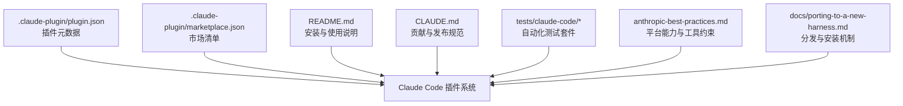
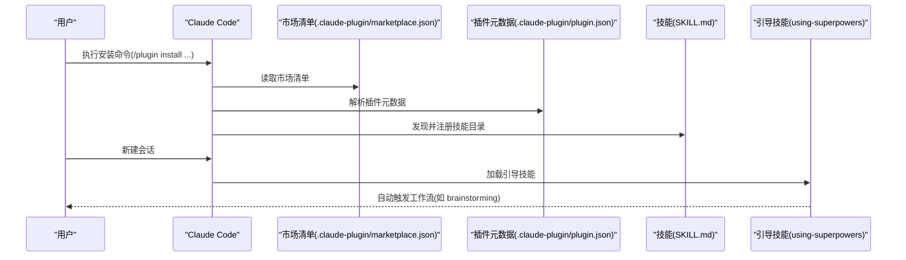
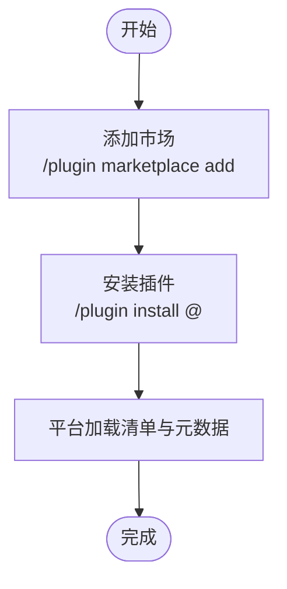
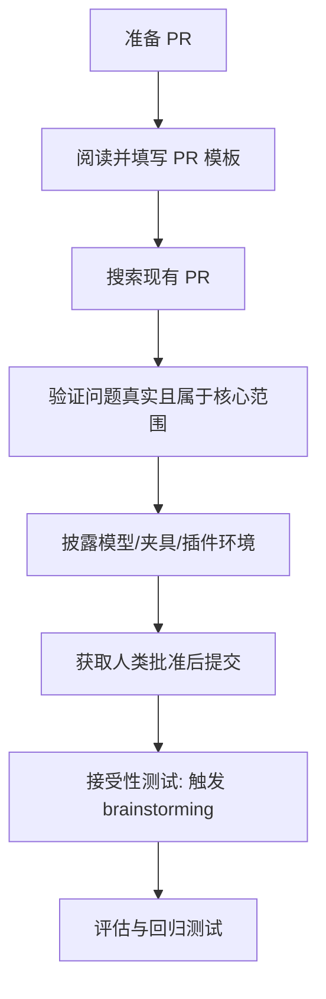
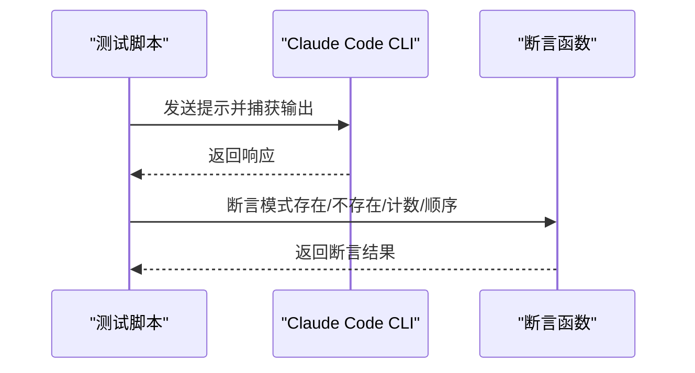
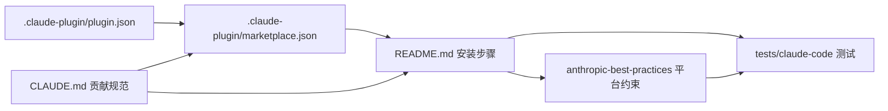

# Claude 平台集成

<cite>
**本文引用的文件**
- [superpowers/.claude-plugin/plugin.json](file://superpowers/.claude-plugin/plugin.json)
- [superpowers/.claude-plugin/marketplace.json](file://superpowers/.claude-plugin/marketplace.json)
- [superpowers/CLAUDE.md](file://superpowers/CLAUDE.md)
- [superpowers/README.md](file://superpowers/README.md)
- [superpowers/tests/claude-code/README.md](file://superpowers/tests/claude-code/README.md)
- [superpowers/skills/writing-skills/anthropic-best-practices.md](file://superpowers/skills/writing-skills/anthropic-best-practices.md)
- [superpowers/docs/porting-to-a-new-harness.md](file://superpowers/docs/porting-to-a-new-harness.md)
- [awesome-design-md/design-md/claude/DESIGN.md](file://awesome-design-md/design-md/claude/DESIGN.md)
</cite>

## 目录
1. [简介](#简介)
2. [项目结构](#项目结构)
3. [核心组件](#核心组件)
4. [架构总览](#架构总览)
5. [详细组件分析](#详细组件分析)
6. [依赖关系分析](#依赖关系分析)
7. [性能考量](#性能考量)
8. [故障排除指南](#故障排除指南)
9. [结论](#结论)
10. [附录](#附录)

## 简介
本指南面向在 Claude Code 平台上集成 Superpowers 插件的用户与维护者，系统讲解插件配置、marketplace.json 清单文件的作用、安装流程、CLAUDE.md 文档格式、插件权限与 API 访问控制、平台特性限制、性能优化与故障排除方法，并提供完整安装步骤、配置示例与最佳实践。

## 项目结构
Superpowers 在 Claude Code 上以“插件”形式分发，核心文件位于 .claude-plugin 目录中，包括插件元数据与市场清单；README 提供安装指引；CLAUDE.md 规范贡献与发布流程；tests/claude-code 提供自动化测试；anthropic-best-practices.md 涵盖平台能力边界与工具使用约束；porting-to-a-new-harness.md 给出跨平台分发与安装机制的参考。

**图表来源**
- [superpowers/.claude-plugin/plugin.json:1-21](file://superpowers/.claude-plugin/plugin.json#L1-L21)
- [superpowers/.claude-plugin/marketplace.json:1-21](file://superpowers/.claude-plugin/marketplace.json#L1-L21)
- [superpowers/README.md:48-75](file://superpowers/README.md#L48-L75)
- [superpowers/CLAUDE.md:1-116](file://superpowers/CLAUDE.md#L1-L116)
- [superpowers/tests/claude-code/README.md:1-166](file://superpowers/tests/claude-code/README.md#L1-L166)
- [superpowers/skills/writing-skills/anthropic-best-practices.md:1004-1017](file://superpowers/skills/writing-skills/anthropic-best-practices.md#L1004-L1017)
- [superpowers/docs/porting-to-a-new-harness.md:670-737](file://superpowers/docs/porting-to-a-new-harness.md#L670-L737)

**章节来源**
- [superpowers/.claude-plugin/plugin.json:1-21](file://superpowers/.claude-plugin/plugin.json#L1-L21)
- [superpowers/.claude-plugin/marketplace.json:1-21](file://superpowers/.claude-plugin/marketplace.json#L1-L21)
- [superpowers/README.md:48-75](file://superpowers/README.md#L48-L75)
- [superpowers/CLAUDE.md:1-116](file://superpowers/CLAUDE.md#L1-L116)
- [superpowers/tests/claude-code/README.md:1-166](file://superpowers/tests/claude-code/README.md#L1-L166)
- [superpowers/skills/writing-skills/anthropic-best-practices.md:1004-1017](file://superpowers/skills/writing-skills/anthropic-best-practices.md#L1004-L1017)
- [superpowers/docs/porting-to-a-new-harness.md:670-737](file://superpowers/docs/porting-to-a-new-harness.md#L670-L737)

## 核心组件
- 插件清单与元数据：.claude-plugin/plugin.json 定义插件名称、描述、版本、作者、仓库与关键词等元信息，用于在 Claude Code 市场展示与识别。
- 市场清单：.claude-plugin/marketplace.json 将本地插件注册到开发市场，声明插件名称、描述、版本、源路径与作者，便于从自定义市场安装。
- 安装与使用：README.md 提供官方与自建市场的安装命令与步骤，覆盖 /plugin install 与 /plugin marketplace add 等指令。
- 贡献与发布：CLAUDE.md 明确贡献流程、PR 要求、拒绝情形、评估验收标准与“接受性测试”（如“Let’s make a react todo list”会触发 brainstorming）。
- 测试：tests/claude-code/README.md 提供基于 Claude Code CLI 的自动化测试运行方式、断言与超时设置，验证技能加载与工作流顺序。
- 平台能力：anthropic-best-practices.md 指明 claude.ai 与 Anthropic API 的包安装与网络访问差异，影响工具与脚本的可用性。
- 分发机制：porting-to-a-new-harness.md 总结了通过 marketplace、外部 fork 同步、git-url 安装、包清单字段与本地安装器等渠道分发插件的策略。

**章节来源**
- [superpowers/.claude-plugin/plugin.json:1-21](file://superpowers/.claude-plugin/plugin.json#L1-L21)
- [superpowers/.claude-plugin/marketplace.json:1-21](file://superpowers/.claude-plugin/marketplace.json#L1-L21)
- [superpowers/README.md:48-75](file://superpowers/README.md#L48-L75)
- [superpowers/CLAUDE.md:76-91](file://superpowers/CLAUDE.md#L76-L91)
- [superpowers/tests/claude-code/README.md:14-39](file://superpowers/tests/claude-code/README.md#L14-L39)
- [superpowers/skills/writing-skills/anthropic-best-practices.md:1004-1017](file://superpowers/skills/writing-skills/anthropic-best-practices.md#L1004-L1017)
- [superpowers/docs/porting-to-a-new-harness.md:670-737](file://superpowers/docs/porting-to-a-new-harness.md#L670-L737)

## 架构总览
下图展示了 Superpowers 在 Claude Code 中的安装与加载路径：用户通过 marketplace 或自定义市场安装插件，插件清单与元数据被平台读取，随后在会话启动时加载引导技能，从而自动触发相关工作流。

**图表来源**
- [superpowers/.claude-plugin/marketplace.json:1-21](file://superpowers/.claude-plugin/marketplace.json#L1-L21)
- [superpowers/.claude-plugin/plugin.json:1-21](file://superpowers/.claude-plugin/plugin.json#L1-L21)
- [superpowers/README.md:48-75](file://superpowers/README.md#L48-L75)
- [superpowers/CLAUDE.md:76-91](file://superpowers/CLAUDE.md#L76-L91)

## 详细组件分析

### 组件A：marketplace.json 清单文件
- 作用：将本地插件注册到开发市场，声明插件名称、描述、版本、源路径与作者，使用户可通过 /plugin marketplace add 与 /plugin install 安装。
- 关键字段：name、description、owner、plugins[].name、plugins[].version、plugins[].source、plugins[].author。
- 安装流程：先添加市场，再按 market@name 安装；或直接从官方市场安装。

**图表来源**
- [superpowers/.claude-plugin/marketplace.json:1-21](file://superpowers/.claude-plugin/marketplace.json#L1-L21)
- [superpowers/README.md:60-74](file://superpowers/README.md#L60-L74)

**章节来源**
- [superpowers/.claude-plugin/marketplace.json:1-21](file://superpowers/.claude-plugin/marketplace.json#L1-L21)
- [superpowers/README.md:60-74](file://superpowers/README.md#L60-L74)

### 组件B：plugin.json 元数据
- 作用：提供插件基本信息，用于市场展示与识别；keywords 有助于搜索发现。
- 关键字段：name、description、version、author、homepage、repository、license、keywords。

**章节来源**
- [superpowers/.claude-plugin/plugin.json:1-21](file://superpowers/.claude-plugin/plugin.json#L1-L21)

### 组件C：CLAUDE.md 文档格式与贡献规范
- 文档格式：采用 Markdown 结构化内容，强调“何时使用”的触发条件而非“做了什么”的过程摘要，避免描述性摘要导致模型跳过全文。
- 贡献流程：PR 必须完整填写模板、搜索现有 PR、验证问题真实性、确认变更属于核心范围、披露环境与插件、提交前获得明确批准。
- 接受性测试：以“Let’s make a react todo list”为验收场景，要求在会话开始即自动触发 brainstorming 技能。
- 评估与测试：提供 eval harness 与 tests/ 目录下的自动化测试，确保技能行为可验证。

**图表来源**
- [superpowers/CLAUDE.md:11-30](file://superpowers/CLAUDE.md#L11-L30)
- [superpowers/CLAUDE.md:76-91](file://superpowers/CLAUDE.md#L76-L91)
- [superpowers/CLAUDE.md:102-109](file://superpowers/CLAUDE.md#L102-L109)

**章节来源**
- [superpowers/CLAUDE.md:11-30](file://superpowers/CLAUDE.md#L11-L30)
- [superpowers/CLAUDE.md:76-91](file://superpowers/CLAUDE.md#L76-L91)
- [superpowers/CLAUDE.md:102-109](file://superpowers/CLAUDE.md#L102-L109)

### 组件D：Claude Code 技能测试套件
- 运行方式：支持快速测试与集成测试，可指定测试文件、超时时间与详细输出。
- 断言：提供 assert_contains、assert_not_contains、assert_count、assert_order 等断言函数。
- 集成测试：验证工作流端到端执行，包括计划读取、子代理审查、提交与测试通过等。

**图表来源**
- [superpowers/tests/claude-code/README.md:14-39](file://superpowers/tests/claude-code/README.md#L14-L39)
- [superpowers/tests/claude-code/README.md:43-59](file://superpowers/tests/claude-code/README.md#L43-L59)

**章节来源**
- [superpowers/tests/claude-code/README.md:14-39](file://superpowers/tests/claude-code/README.md#L14-L39)
- [superpowers/tests/claude-code/README.md:43-59](file://superpowers/tests/claude-code/README.md#L43-L59)
- [superpowers/tests/claude-code/README.md:95-117](file://superpowers/tests/claude-code/README.md#L95-L117)

### 组件E：平台能力与 API 访问控制
- 包安装与网络访问：claude.ai 可从 npm、PyPI 与 GitHub 拉取资源；Anthropic API 无网络访问与运行时包安装能力。
- 工具使用：需在代码执行工具文档中确认可用性，避免在受限环境中调用不可用工具。
- 影响：编写技能与工具映射时应考虑平台差异，优先使用受支持的工具链。

**章节来源**
- [superpowers/skills/writing-skills/anthropic-best-practices.md:1004-1017](file://superpowers/skills/writing-skills/anthropic-best-practices.md#L1004-L1017)

### 组件F：分发与安装机制（跨平台）
- 市场分发：通过 .claude-plugin/marketplace.json 注册市场，用户使用 /plugin install 安装。
- 外部 fork 同步：部分平台采用脚本同步到独立 fork 并发起 PR 的方式。
- Git-URL 安装：支持从 git URL 安装扩展。
- 包清单字段：通过根目录 package.json 字段声明，由对应 harness 安装。
- 本地安装器：通过安装脚本运行 harness 的安装命令，确保只复制清单声明的组件。

**章节来源**
- [superpowers/docs/porting-to-a-new-harness.md:670-737](file://superpowers/docs/porting-to-a-new-harness.md#L670-L737)

## 依赖关系分析
- marketplace.json 依赖于本地插件目录结构与 .claude-plugin/plugin.json 的正确配置。
- README.md 的安装步骤依赖于市场清单与插件元数据的一致性。
- CLAUDE.md 的贡献与验收流程影响插件能否进入官方或自建市场。
- tests/claude-code/README.md 的测试依赖于 Claude Code CLI 的可用性与本地插件安装状态。
- anthropic-best-practices.md 的平台能力约束影响工具映射与技能实现。

**图表来源**
- [superpowers/.claude-plugin/plugin.json:1-21](file://superpowers/.claude-plugin/plugin.json#L1-L21)
- [superpowers/.claude-plugin/marketplace.json:1-21](file://superpowers/.claude-plugin/marketplace.json#L1-L21)
- [superpowers/README.md:48-75](file://superpowers/README.md#L48-L75)
- [superpowers/tests/claude-code/README.md:1-166](file://superpowers/tests/claude-code/README.md#L1-L166)
- [superpowers/skills/writing-skills/anthropic-best-practices.md:1004-1017](file://superpowers/skills/writing-skills/anthropic-best-practices.md#L1004-L1017)
- [superpowers/CLAUDE.md:1-116](file://superpowers/CLAUDE.md#L1-L116)

**章节来源**
- [superpowers/.claude-plugin/plugin.json:1-21](file://superpowers/.claude-plugin/plugin.json#L1-L21)
- [superpowers/.claude-plugin/marketplace.json:1-21](file://superpowers/.claude-plugin/marketplace.json#L1-L21)
- [superpowers/README.md:48-75](file://superpowers/README.md#L48-L75)
- [superpowers/tests/claude-code/README.md:1-166](file://superpowers/tests/claude-code/README.md#L1-L166)
- [superpowers/skills/writing-skills/anthropic-best-practices.md:1004-1017](file://superpowers/skills/writing-skills/anthropic-best-practices.md#L1004-L1017)
- [superpowers/CLAUDE.md:1-116](file://superpowers/CLAUDE.md#L1-L116)

## 性能考量
- 令牌开销：频繁加载的技能应保持简洁，遵循“getting-started 工作流 <150 字，常用技能 <200 字”的目标，减少上下文占用。
- 工作流验证：通过 tests/claude-code 的快速测试与集成测试平衡速度与稳定性，避免长耗时的全量端到端测试。
- 平台差异：根据 anthropic-best-practices.md 的能力边界选择工具，避免在受限环境中进行昂贵操作。
- 安装一致性：通过 porting-to-a-new-harness.md 的分发策略确保安装产物最小化与可预测性，降低加载与运行时开销。

[本节为通用指导，无需具体文件分析]

## 故障排除指南
- 安装失败
  - 确认市场已添加且插件名与版本匹配。
  - 检查 marketplace.json 与 plugin.json 的字段是否一致。
  - 参考 README.md 的安装步骤逐项核对。
- 技能未触发
  - 确认会话开始时引导技能已加载。
  - 使用 CLAUDE.md 的“接受性测试”场景验证是否自动触发 brainstorming。
- 平台能力限制
  - 若工具不可用，依据 anthropic-best-practices.md 的平台能力调整技能实现或工具映射。
- 测试失败
  - 使用 tests/claude-code/README.md 的断言与超时参数定位问题。
  - 查看详细输出以识别违反规则的行为或遗漏的步骤。

**章节来源**
- [superpowers/README.md:48-75](file://superpowers/README.md#L48-L75)
- [superpowers/.claude-plugin/marketplace.json:1-21](file://superpowers/.claude-plugin/marketplace.json#L1-L21)
- [superpowers/.claude-plugin/plugin.json:1-21](file://superpowers/.claude-plugin/plugin.json#L1-L21)
- [superpowers/CLAUDE.md:76-91](file://superpowers/CLAUDE.md#L76-L91)
- [superpowers/tests/claude-code/README.md:140-148](file://superpowers/tests/claude-code/README.md#L140-L148)
- [superpowers/skills/writing-skills/anthropic-best-practices.md:1004-1017](file://superpowers/skills/writing-skills/anthropic-best-practices.md#L1004-L1017)

## 结论
通过规范化的 marketplace.json 与 plugin.json、清晰的 CLAUDE.md 文档格式、严格的贡献与测试流程以及对平台能力边界的尊重，Superpowers 能在 Claude Code 上稳定地提供可发现、可加载、可验证的工作流体验。遵循本文提供的安装步骤、配置要点与最佳实践，可显著提升集成效率与可靠性。

[本节为总结，无需具体文件分析]

## 附录

### A. 完整安装步骤（Claude Code）
- 从官方市场安装
  - 使用 /plugin install 安装官方插件。
- 从自建市场安装
  - 添加市场：/plugin marketplace add <仓库地址>
  - 安装插件：/plugin install <插件名>@<市场名>
- 验证安装
  - 通过 CLAUDE.md 的“接受性测试”场景确认自动触发。

**章节来源**
- [superpowers/README.md:48-75](file://superpowers/README.md#L48-L75)
- [superpowers/CLAUDE.md:76-91](file://superpowers/CLAUDE.md#L76-L91)

### B. CLAUDE.md 文档格式要点
- 触发条件优先：description 仅描述触发条件，不总结流程。
- 结构化内容：使用 Frontmatter、概述、何时使用、核心模式、快速参考、实现、常见误区等模块。
- 令牌效率：控制字数，必要时将细节移至工具帮助或交叉引用。

**章节来源**
- [superpowers/CLAUDE.md:93-137](file://superpowers/CLAUDE.md#L93-L137)
- [superpowers/CLAUDE.md:140-198](file://superpowers/CLAUDE.md#L140-L198)

### C. 平台特性与限制
- claude.ai：可安装 npm/PyPI 包与拉取 GitHub 资源。
- Anthropic API：无网络访问与运行时包安装能力。
- 工具可用性：以代码执行工具文档为准，避免在受限环境调用不可用工具。

**章节来源**
- [superpowers/skills/writing-skills/anthropic-best-practices.md:1004-1017](file://superpowers/skills/writing-skills/anthropic-best-practices.md#L1004-L1017)

### D. 设计风格参考（Claude 品牌）
- 色彩与排版：Cream canvas、Coral 主色、Slab-serif 显示字体、Humanist Sans 正文字体。
- 组件体系：按钮、卡片、输入、标签等组件的视觉与交互规范。
- 响应式与可访问性：断点、触摸目标、折叠策略与图像行为。

**章节来源**
- [awesome-design-md/design-md/claude/DESIGN.md:324-522](file://awesome-design-md/design-md/claude/DESIGN.md#L324-L522)