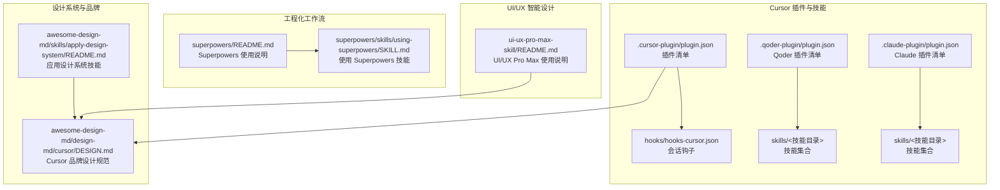
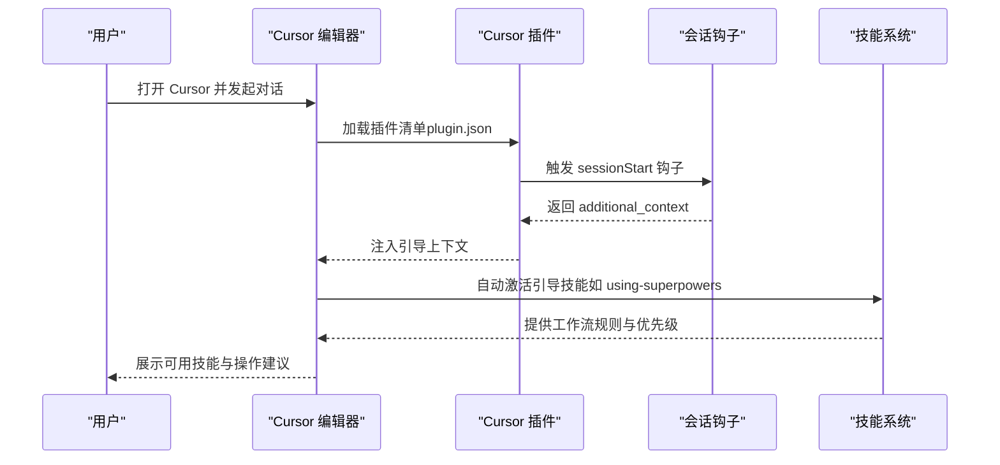
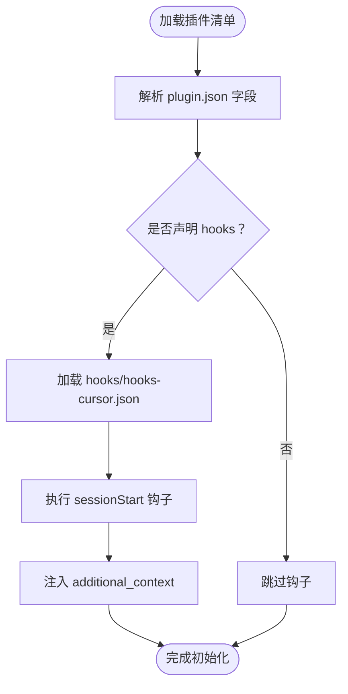
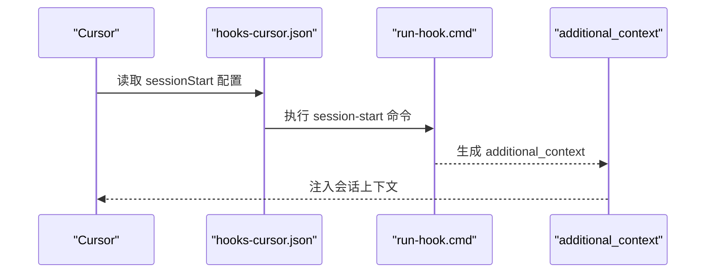
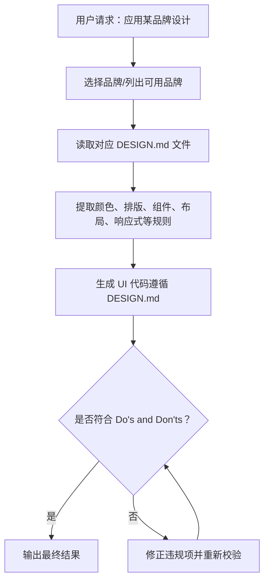
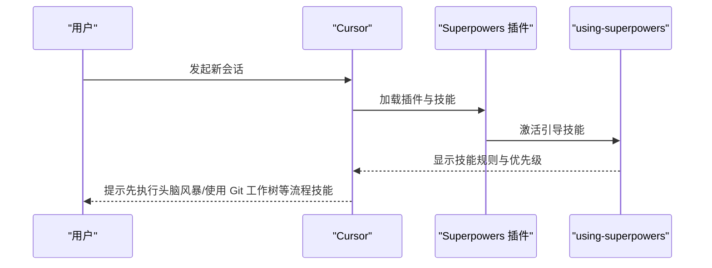
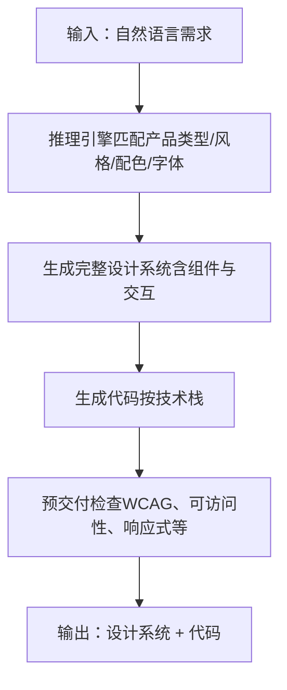
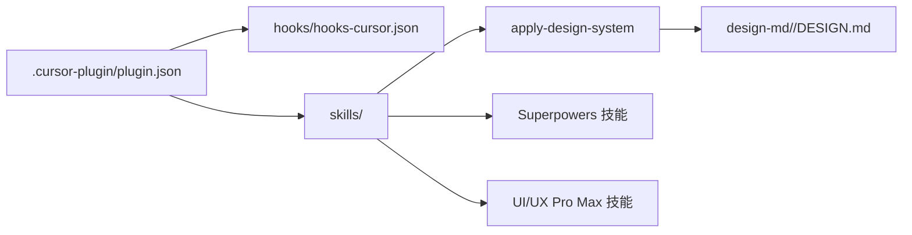

# Cursor 编辑器集成

<cite>
**本文档引用的文件**
- [awesome-design-md/.qoder-plugin/plugin.json](file://awesome-design-md/.qoder-plugin/plugin.json)
- [superpowers/.cursor-plugin/plugin.json](file://superpowers/.cursor-plugin/plugin.json)
- [ui-ux-pro-max-skill/.claude-plugin/plugin.json](file://ui-ux-pro-max-skill/.claude-plugin/plugin.json)
- [superpowers/hooks/hooks-cursor.json](file://superpowers/hooks/hooks-cursor.json)
- [awesome-design-md/design-md/cursor/DESIGN.md](file://awesome-design-md/design-md/cursor/DESIGN.md)
- [awesome-design-md/skills/apply-design-system/README.md](file://awesome-design-md/skills/apply-design-system/README.md)
- [superpowers/skills/using-superpowers/SKILL.md](file://superpowers/skills/using-superpowers/SKILL.md)
- [superpowers/README.md](file://superpowers/README.md)
- [ui-ux-pro-max-skill/README.md](file://ui-ux-pro-max-skill/README.md)
- [superpowers/RELEASE-NOTES.md](file://superpowers/RELEASE-NOTES.md)
- [superpowers/docs/porting-to-a-new-harness.md](file://superpowers/docs/porting-to-a-new-harness.md)
- [ui-ux-pro-max-skill/cli/src/utils/detect.ts](file://ui-ux-pro-max-skill/cli/src/utils/detect.ts)
</cite>

## 目录
1. [简介](#简介)
2. [项目结构](#项目结构)
3. [核心组件](#核心组件)
4. [架构总览](#架构总览)
5. [详细组件分析](#详细组件分析)
6. [依赖关系分析](#依赖关系分析)
7. [性能考虑](#性能考虑)
8. [故障诊断指南](#故障诊断指南)
9. [结论](#结论)
10. [附录](#附录)

## 简介
本指南面向希望在 Cursor 编辑器中集成与使用 Cursor 插件生态的用户，涵盖以下内容：
- Cursor 插件系统的安装流程与插件清单（plugin.json）格式说明
- 基于 Cursor 的编辑器集成机制与会话钩子（hooks）
- Cursor 特有的代码补全、智能感知与设计系统应用能力
- 编辑器配置选项、快捷键设置与工作流优化建议
- 故障诊断方法与性能调优技巧

## 项目结构
本仓库包含多个与 Cursor 集成相关的插件与技能包，主要涉及三类能力：
- 设计系统应用：通过 DESIGN.md 文档驱动 UI 生成与一致性保障
- 超能力（Superpowers）：以“技能”为核心的工程化开发方法论
- UI/UX 智能设计：自动推荐风格、配色、字体与交互模式

**图表来源**
- [superpowers/.cursor-plugin/plugin.json:1-24](file://superpowers/.cursor-plugin/plugin.json#L1-L24)
- [superpowers/hooks/hooks-cursor.json:1-11](file://superpowers/hooks/hooks-cursor.json#L1-L11)
- [awesome-design-md/.qoder-plugin/plugin.json:1-18](file://awesome-design-md/.qoder-plugin/plugin.json#L1-L18)
- [awesome-design-md/design-md/cursor/DESIGN.md:1-538](file://awesome-design-md/design-md/cursor/DESIGN.md#L1-L538)
- [awesome-design-md/skills/apply-design-system/README.md:1-139](file://awesome-design-md/skills/apply-design-system/README.md#L1-L139)
- [superpowers/README.md:1-286](file://superpowers/README.md#L1-L286)
- [superpowers/skills/using-superpowers/SKILL.md:1-63](file://superpowers/skills/using-superpowers/SKILL.md#L1-L63)
- [ui-ux-pro-max-skill/README.md:1-649](file://ui-ux-pro-max-skill/README.md#L1-L649)

**章节来源**
- [superpowers/.cursor-plugin/plugin.json:1-24](file://superpowers/.cursor-plugin/plugin.json#L1-L24)
- [superpowers/hooks/hooks-cursor.json:1-11](file://superpowers/hooks/hooks-cursor.json#L1-L11)
- [awesome-design-md/.qoder-plugin/plugin.json:1-18](file://awesome-design-md/.qoder-plugin/plugin.json#L1-L18)
- [awesome-design-md/design-md/cursor/DESIGN.md:1-538](file://awesome-design-md/design-md/cursor/DESIGN.md#L1-L538)
- [awesome-design-md/skills/apply-design-system/README.md:1-139](file://awesome-design-md/skills/apply-design-system/README.md#L1-L139)
- [superpowers/README.md:1-286](file://superpowers/README.md#L1-L286)
- [superpowers/skills/using-superpowers/SKILL.md:1-63](file://superpowers/skills/using-superpowers/SKILL.md#L1-L63)
- [ui-ux-pro-max-skill/README.md:1-649](file://ui-ux-pro-max-skill/README.md#L1-L649)

## 核心组件
- Cursor 插件清单（plugin.json）
  - 定义插件名称、显示名、版本、描述、作者、主页、仓库、关键字、分类、标签、技能路径等元数据
  - 示例字段：name、displayName、version、description、author、homepage、repository、keywords、category、tags、skills、hooks
- 会话钩子（hooks）
  - 在会话启动时执行脚本，用于初始化上下文或注入引导信息
  - Cursor 钩子采用驼峰命名（如 sessionStart），并支持 additional_context 输出
- 设计系统应用（DESIGN.md）
  - 将品牌网站的视觉语言提炼为可被 AI 读取的设计规范，指导 UI 生成与一致性
  - Cursor 品牌设计规范包含色彩、排版、组件、布局、响应式等完整体系
- 工程化工作流（Superpowers）
  - 以“技能”为核心的工作流框架，覆盖从头脑风暴、计划、测试驱动开发到代码评审与分支收尾的全流程
  - 在 Cursor 中可通过插件市场直接安装，并在会话开始时自动激活引导技能
- UI/UX 智能设计（UI/UX Pro Max）
  - 自动匹配产品类型、行业规则与设计风格，生成完整的“设计系统”，包括配色、字体、组件样式与交互细节
  - 支持多技术栈（React、Vue、Flutter、SwiftUI 等）的实现建议与最佳实践

**章节来源**
- [superpowers/.cursor-plugin/plugin.json:1-24](file://superpowers/.cursor-plugin/plugin.json#L1-L24)
- [superpowers/hooks/hooks-cursor.json:1-11](file://superpowers/hooks/hooks-cursor.json#L1-L11)
- [awesome-design-md/design-md/cursor/DESIGN.md:1-538](file://awesome-design-md/design-md/cursor/DESIGN.md#L1-L538)
- [superpowers/skills/using-superpowers/SKILL.md:1-63](file://superpowers/skills/using-superpowers/SKILL.md#L1-L63)
- [ui-ux-pro-max-skill/README.md:1-649](file://ui-ux-pro-max-skill/README.md#L1-L649)

## 架构总览
下图展示了 Cursor 插件在会话生命周期中的集成方式与交互流程：

**图表来源**
- [superpowers/.cursor-plugin/plugin.json:1-24](file://superpowers/.cursor-plugin/plugin.json#L1-L24)
- [superpowers/hooks/hooks-cursor.json:1-11](file://superpowers/hooks/hooks-cursor.json#L1-L11)
- [superpowers/skills/using-superpowers/SKILL.md:1-63](file://superpowers/skills/using-superpowers/SKILL.md#L1-L63)

## 详细组件分析

### 组件一：Cursor 插件清单（plugin.json）解析
- 字段说明
  - name/displayName：插件标识与展示名
  - version：版本号
  - description/author/homepage/repository：元信息
  - keywords/category/tags：便于检索与分类
  - skills：技能目录路径（相对插件根目录）
  - hooks：会话钩子配置路径（相对插件根目录）
- Cursor 兼容性
  - 插件清单需位于 .cursor-plugin/plugin.json
  - 钩子文件位于 hooks/hooks-cursor.json，采用驼峰命名与 additional_context 输出

**图表来源**
- [superpowers/.cursor-plugin/plugin.json:1-24](file://superpowers/.cursor-plugin/plugin.json#L1-L24)
- [superpowers/hooks/hooks-cursor.json:1-11](file://superpowers/hooks/hooks-cursor.json#L1-L11)

**章节来源**
- [superpowers/.cursor-plugin/plugin.json:1-24](file://superpowers/.cursor-plugin/plugin.json#L1-L24)
- [superpowers/hooks/hooks-cursor.json:1-11](file://superpowers/hooks/hooks-cursor.json#L1-L11)

### 组件二：会话钩子（hooks）与 Cursor 集成
- 钩子格式
  - version：钩子协议版本
  - hooks.sessionStart：数组，包含命令定义
  - 命令格式：./hooks/run-hook.cmd session-start
- Cursor 兼容性
  - 钩子采用驼峰命名（sessionStart）
  - 输出 additional_context 字段，供 Cursor 接收并注入会话上下文
- 平台检测
  - Cursor 可能设置 CURSOR_PLUGIN_ROOT 或 CLAUDE_PLUGIN_ROOT，需优先检查前者

**图表来源**
- [superpowers/hooks/hooks-cursor.json:1-11](file://superpowers/hooks/hooks-cursor.json#L1-L11)
- [superpowers/RELEASE-NOTES.md:299-523](file://superpowers/RELEASE-NOTES.md#L299-L523)

**章节来源**
- [superpowers/hooks/hooks-cursor.json:1-11](file://superpowers/hooks/hooks-cursor.json#L1-L11)
- [superpowers/RELEASE-NOTES.md:299-523](file://superpowers/RELEASE-NOTES.md#L299-L523)

### 组件三：设计系统应用（Apply Design System）
- 目标
  - 将品牌网站的视觉语言转化为可被 AI 读取的 DESIGN.md，并据此生成一致的 UI
- 流程
  - 识别目标品牌 → 读取 DESIGN.md → 应用设计系统 → 校验设计守则 → 生成生产级 UI 代码
- Cursor 集成
  - 在 Cursor 中通过技能触发“应用设计系统”，选择品牌后自动生成符合该品牌风格的界面

**图表来源**
- [awesome-design-md/skills/apply-design-system/README.md:1-139](file://awesome-design-md/skills/apply-design-system/README.md#L1-L139)
- [awesome-design-md/design-md/cursor/DESIGN.md:1-538](file://awesome-design-md/design-md/cursor/DESIGN.md#L1-L538)

**章节来源**
- [awesome-design-md/skills/apply-design-system/README.md:1-139](file://awesome-design-md/skills/apply-design-system/README.md#L1-L139)
- [awesome-design-md/design-md/cursor/DESIGN.md:1-538](file://awesome-design-md/design-md/cursor/DESIGN.md#L1-L538)

### 组件四：工程化工作流（Superpowers）
- 核心理念
  - 在编写代码前先进行头脑风暴与设计验证，强调测试驱动与可执行计划
- 技能优先级
  - 多个技能适用时，先处理流程类技能（如头脑风暴、使用 Git 工作树），再执行实现类技能
- Cursor 安装
  - 在 Cursor Agent 聊天中通过插件市场安装 Superpowers 插件
- 引导技能（using-superpowers）
  - 在会话开始时激活，明确技能调用规则与注意事项，确保每次对话都按流程执行

**图表来源**
- [superpowers/README.md:1-286](file://superpowers/README.md#L1-L286)
- [superpowers/skills/using-superpowers/SKILL.md:1-63](file://superpowers/skills/using-superpowers/SKILL.md#L1-L63)

**章节来源**
- [superpowers/README.md:1-286](file://superpowers/README.md#L1-L286)
- [superpowers/skills/using-superpowers/SKILL.md:1-63](file://superpowers/skills/using-superpowers/SKILL.md#L1-L63)

### 组件五：UI/UX 智能设计（UI/UX Pro Max）
- 自动化能力
  - 基于产品类型、行业规则与设计风格，生成完整设计系统（配色、字体、组件、交互）
  - 支持多技术栈（React、Vue、Flutter、SwiftUI 等）的实现建议
- 安装方式
  - 通过 CLI 全局安装至 ~/.cursor/skills/，或在项目内安装
- 使用场景
  - 自然语言描述需求 → 自动生成设计系统 → 生成代码与预交付检查

**图表来源**
- [ui-ux-pro-max-skill/README.md:1-649](file://ui-ux-pro-max-skill/README.md#L1-L649)

**章节来源**
- [ui-ux-pro-max-skill/README.md:1-649](file://ui-ux-pro-max-skill/README.md#L1-L649)

## 依赖关系分析
- 插件清单与钩子
  - .cursor-plugin/plugin.json 决定插件元数据与技能路径
  - hooks/hooks-cursor.json 决定会话启动行为与上下文注入
- 设计系统与技能
  - apply-design-system 技能依赖各品牌 DESIGN.md 文件
  - Cursor 品牌 DESIGN.md 作为参考，指导 UI 生成的一致性
- 工程化与 UI/UX
  - Superpowers 与 UI/UX Pro Max 可并行使用，前者负责流程，后者负责设计

**图表来源**
- [superpowers/.cursor-plugin/plugin.json:1-24](file://superpowers/.cursor-plugin/plugin.json#L1-L24)
- [superpowers/hooks/hooks-cursor.json:1-11](file://superpowers/hooks/hooks-cursor.json#L1-L11)
- [awesome-design-md/skills/apply-design-system/README.md:1-139](file://awesome-design-md/skills/apply-design-system/README.md#L1-L139)
- [awesome-design-md/design-md/cursor/DESIGN.md:1-538](file://awesome-design-md/design-md/cursor/DESIGN.md#L1-L538)

**章节来源**
- [superpowers/.cursor-plugin/plugin.json:1-24](file://superpowers/.cursor-plugin/plugin.json#L1-L24)
- [superpowers/hooks/hooks-cursor.json:1-11](file://superpowers/hooks/hooks-cursor.json#L1-L11)
- [awesome-design-md/skills/apply-design-system/README.md:1-139](file://awesome-design-md/skills/apply-design-system/README.md#L1-L139)
- [awesome-design-md/design-md/cursor/DESIGN.md:1-538](file://awesome-design-md/design-md/cursor/DESIGN.md#L1-L538)

## 性能考虑
- 插件加载与钩子执行
  - 钩子脚本应尽量轻量，避免阻塞会话启动
  - additional_context 输出应精简且结构化，减少不必要的 IO
- 设计系统生成
  - DESIGN.md 解析与规则应用应在本地缓存常用品牌规范，减少重复读取
  - UI/UX Pro Max 的搜索与匹配逻辑建议在本地缓存结果，避免频繁调用外部资源
- 工程化流程
  - Superpowers 的头脑风暴与计划阶段应限制输出长度，提高可读性与响应速度
  - 测试驱动开发阶段建议启用增量测试，缩短反馈周期

## 故障诊断指南
- Cursor 插件安装失败
  - 确认使用 Cursor 自身的安装命令而非手动复制文件
  - 若安装失败，查看 Cursor 日志并重试安装
- 钩子未生效
  - 检查 hooks/hooks-cursor.json 是否正确声明 sessionStart
  - 确认 run-hook.cmd 可执行权限与路径正确
  - 确认 CURSOR_PLUGIN_ROOT 环境变量设置（若存在）
- 技能未激活
  - 确认插件清单中 skills 路径正确
  - 确认技能文件位于插件根目录下的 skills 子目录
- UI/UX Pro Max 无法生成设计系统
  - 确认已安装 Python 3.x
  - 确认 CLI 已全局安装并更新至最新版本
  - 如遇权限问题，使用管理员权限或通过 npx 运行

**章节来源**
- [superpowers/README.md:1-286](file://superpowers/README.md#L1-L286)
- [ui-ux-pro-max-skill/README.md:564-649](file://ui-ux-pro-max-skill/README.md#L564-L649)

## 结论
通过本指南，您可以在 Cursor 编辑器中高效集成并使用多种插件与技能：
- 利用 plugin.json 与 hooks 实现稳定的插件加载与会话初始化
- 借助 DESIGN.md 与 apply-design-system 技能，快速生成符合品牌风格的 UI
- 通过 Superpowers 的技能体系，规范化开发流程，提升协作效率
- 使用 UI/UX Pro Max 自动化生成设计系统，加速前端实现与交付

## 附录
- 快速安装清单
  - Superpowers：在 Cursor Agent 聊天中执行插件安装命令
  - UI/UX Pro Max：通过 CLI 全局安装至 ~/.cursor/skills/
- 常用命令
  - Cursor：/add-plugin superpowers
  - CLI：uipro init --ai cursor --global
- 平台检测
  - CLI 工具可识别 Cursor 插件目录结构，确保文件放置正确

**章节来源**
- [superpowers/README.md:113-122](file://superpowers/README.md#L113-L122)
- [ui-ux-pro-max-skill/README.md:331-347](file://ui-ux-pro-max-skill/README.md#L331-L347)
- [ui-ux-pro-max-skill/cli/src/utils/detect.ts:83-83](file://ui-ux-pro-max-skill/cli/src/utils/detect.ts#L83-L83)