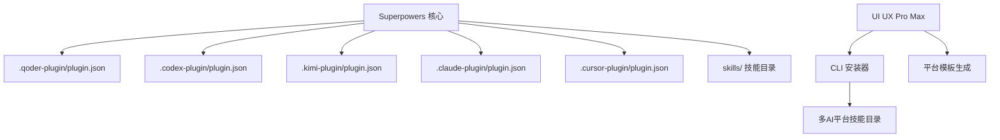
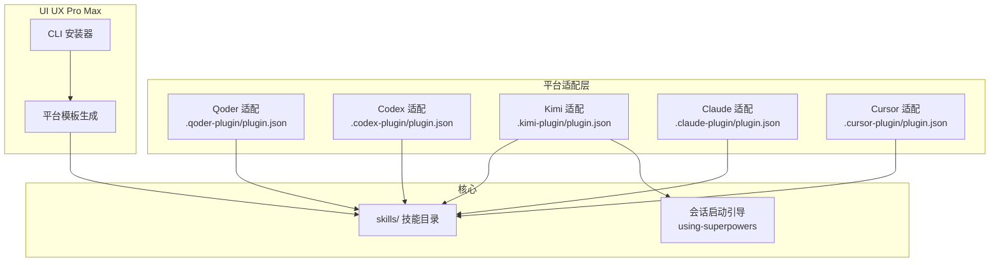
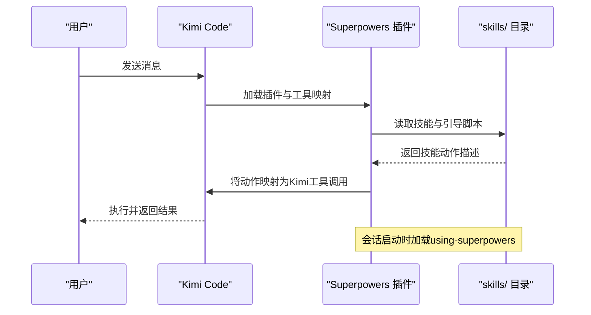
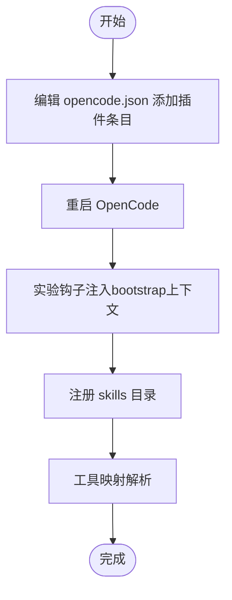
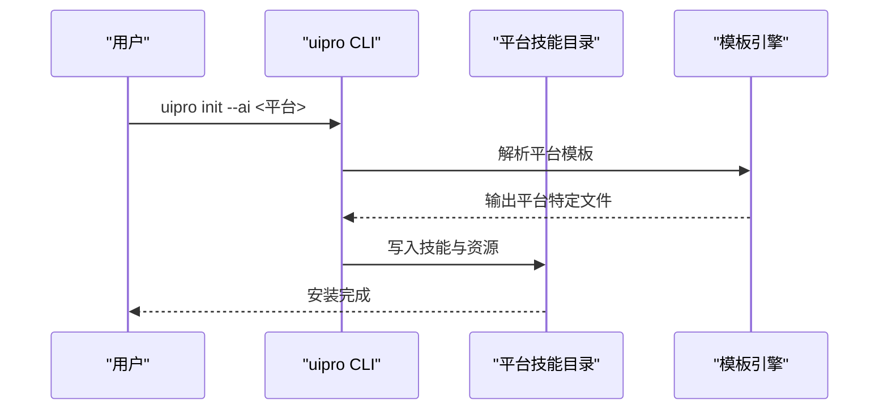
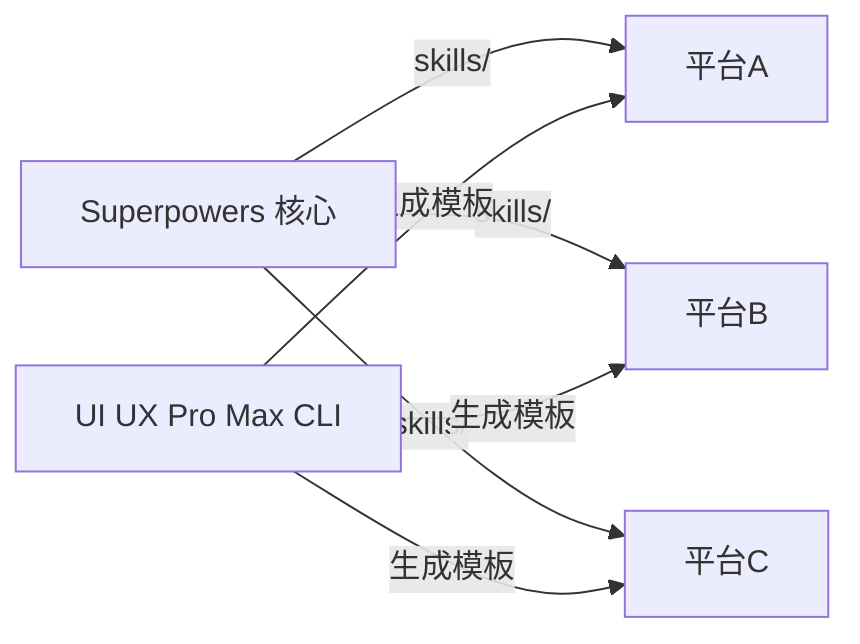

# 其他AI平台集成

<cite>
**本文引用的文件**
- [superpowers/README.md](file://superpowers/README.md)
- [superpowers/GEMINI.md](file://superpowers/GEMINI.md)
- [superpowers/CLAUDE.md](file://superpowers/CLAUDE.md)
- [superpowers/.qoder-plugin/plugin.json](file://superpowers/.qoder-plugin/plugin.json)
- [superpowers/.codex-plugin/plugin.json](file://superpowers/.codex-plugin/plugin.json)
- [superpowers/.kimi-plugin/plugin.json](file://superpowers/.kimi-plugin/plugin.json)
- [superpowers/.claude-plugin/plugin.json](file://superpowers/.claude-plugin/plugin.json)
- [superpowers/.cursor-plugin/plugin.json](file://superpowers/.cursor-plugin/plugin.json)
- [superpowers/docs/README.kimi.md](file://superpowers/docs/README.kimi.md)
- [superpowers/docs/README.opencode.md](file://superpowers/docs/README.opencode.md)
- [ui-ux-pro-max-skill/README.md](file://ui-ux-pro-max-skill/README.md)
</cite>

## 目录
1. [简介](#简介)
2. [项目结构](#项目结构)
3. [核心组件](#核心组件)
4. [架构总览](#架构总览)
5. [详细组件分析](#详细组件分析)
6. [依赖关系分析](#依赖关系分析)
7. [性能考量](#性能考量)
8. [故障排查指南](#故障排查指南)
9. [结论](#结论)
10. [附录](#附录)

## 简介
本指南面向需要在多个AI平台（Qoder、Codex、Kimi、Gemini、Continue、CodeBuddy等）中集成Superpowers与UI UX Pro Max等技能体系的用户与开发者。内容覆盖各平台的插件配置格式、安装命令、平台特定功能映射、功能差异与API限制、兼容性考虑，并提供跨平台使用建议、迁移指南与统一配置策略。

## 项目结构
- Superpowers仓库提供多平台插件清单与文档，核心为技能目录与平台适配层（如Kim Code的工具映射、OpenCode的注入钩子等）。
- UI UX Pro Max仓库提供跨平台技能安装器与平台模板生成机制，支持通过CLI在多AI助手间统一安装与更新。

图表来源
- [superpowers/.qoder-plugin/plugin.json:1-31](file://superpowers/.qoder-plugin/plugin.json#L1-L31)
- [superpowers/.codex-plugin/plugin.json:1-48](file://superpowers/.codex-plugin/plugin.json#L1-L48)
- [superpowers/.kimi-plugin/plugin.json:1-39](file://superpowers/.kimi-plugin/plugin.json#L1-L39)
- [superpowers/.claude-plugin/plugin.json:1-21](file://superpowers/.claude-plugin/plugin.json#L1-L21)
- [superpowers/.cursor-plugin/plugin.json:1-24](file://superpowers/.cursor-plugin/plugin.json#L1-L24)
- [ui-ux-pro-max-skill/README.md:287-347](file://ui-ux-pro-max-skill/README.md#L287-L347)

章节来源
- [superpowers/README.md:44-200](file://superpowers/README.md#L44-L200)
- [ui-ux-pro-max-skill/README.md:287-347](file://ui-ux-pro-max-skill/README.md#L287-L347)

## 核心组件
- Superpowers技能框架：提供TDD、系统化调试、头脑风暴、规划、子代理驱动开发等14项可自动触发的技能；通过会话启动引导加载，确保在合适时机自动激活。
- 平台插件清单：各平台以独立的plugin.json定义技能路径、接口信息、能力声明与会话启动行为。
- UI UX Pro Max技能：提供设计系统生成、风格匹配、排版与色彩推荐、跨栈实现指导与预交付检查；支持CLI一键安装到多平台。

章节来源
- [superpowers/README.md:200-243](file://superpowers/README.md#L200-L243)
- [superpowers/.qoder-plugin/plugin.json:1-31](file://superpowers/.qoder-plugin/plugin.json#L1-L31)
- [superpowers/.codex-plugin/plugin.json:1-48](file://superpowers/.codex-plugin/plugin.json#L1-L48)
- [superpowers/.kimi-plugin/plugin.json:1-39](file://superpowers/.kimi-plugin/plugin.json#L1-L39)
- [superpowers/.claude-plugin/plugin.json:1-21](file://superpowers/.claude-plugin/plugin.json#L1-L21)
- [superpowers/.cursor-plugin/plugin.json:1-24](file://superpowers/.cursor-plugin/plugin.json#L1-L24)
- [ui-ux-pro-max-skill/README.md:1-60](file://ui-ux-pro-max-skill/README.md#L1-L60)

## 架构总览
Superpowers在各平台的集成遵循“平台适配层 + 核心技能库”的模式：
- 平台适配层负责加载技能目录、注入会话引导、进行工具映射与能力声明。
- 核心技能库在所有平台共享，确保一致的行为体验与自动触发逻辑。
- UI UX Pro Max通过CLI在各平台生成对应模板，保证安装与更新的一致性。

图表来源
- [superpowers/.qoder-plugin/plugin.json:27-29](file://superpowers/.qoder-plugin/plugin.json#L27-L29)
- [superpowers/.codex-plugin/plugin.json:23-28](file://superpowers/.codex-plugin/plugin.json#L23-L28)
- [superpowers/.kimi-plugin/plugin.json:22-25](file://superpowers/.kimi-plugin/plugin.json#L22-L25)
- [superpowers/.cursor-plugin/plugin.json:21-23](file://superpowers/.cursor-plugin/plugin.json#L21-L23)
- [ui-ux-pro-max-skill/README.md:497-506](file://ui-ux-pro-max-skill/README.md#L497-L506)

## 详细组件分析

### Superpowers 在 Kimi Code 集成
- 插件清单要点
  - 指向skills目录，加载using-superpowers作为会话启动引导。
  - 提供技能指令映射，将Superpowers动作转换为Kimi Code工具调用。
- 工具映射
  - Ask the user → AskUserQuestion
  - Todo写入 → TodoList
  - 子代理分派 → Agent（按subagent_type区分）
  - 文件读写/搜索/网络请求 → Read/Write/Edit/Bash/Grep/Glob/FetchURL/WebSearch
- 更新与验证
  - 使用插件管理器更新；新会话生效；可通过“Let’s make a react todo list”验证自动触发。

图表来源
- [superpowers/.kimi-plugin/plugin.json:22-37](file://superpowers/.kimi-plugin/plugin.json#L22-L37)
- [superpowers/docs/README.kimi.md:31-42](file://superpowers/docs/README.kimi.md#L31-L42)

章节来源
- [superpowers/docs/README.kimi.md:1-89](file://superpowers/docs/README.kimi.md#L1-L89)
- [superpowers/.kimi-plugin/plugin.json:1-39](file://superpowers/.kimi-plugin/plugin.json#L1-L39)

### Superpowers 在 OpenCode 集成
- 安装方式
  - 在opencode.json中添加插件条目，重启后注册技能。
  - 支持分支/标签固定版本；Windows下可用系统npm先行安装再指向本地包。
- 运行机制
  - 通过实验性钩子注入bootstrap上下文，注册skills目录，无需符号链接或手动配置。
  - 工具映射：todowrite、task（通用/探索）、skill、read/apply_patch、bash、grep/glob、webfetch。
- 迁移与更新
  - 旧symlink安装需清理；缓存/锁文件可能影响更新，必要时清除缓存或重新安装。

图表来源
- [superpowers/docs/README.opencode.md:7-22](file://superpowers/docs/README.opencode.md#L7-L22)
- [superpowers/docs/README.opencode.md:100-118](file://superpowers/docs/README.opencode.md#L100-L118)

章节来源
- [superpowers/docs/README.opencode.md:1-164](file://superpowers/docs/README.opencode.md#L1-L164)

### Superpowers 在其他平台（Claude Code、Codex App/Cli、Cursor、Qoder、Pi）
- 安装与市场
  - Claude Code：官方市场/第三方市场两种安装方式。
  - Codex App/Cli：官方市场搜索并安装。
  - Cursor：从市场搜索或使用/add-plugin命令。
  - Qoder：作为原生插件打包，技能目录与钩子由插件清单声明。
  - Pi：通过包管理器安装或本地临时加载。
- 通用特性
  - 技能目录与关键词声明；部分平台支持hooks；会话启动引导加载方式因平台而异。

章节来源
- [superpowers/README.md:48-198](file://superpowers/README.md#L48-L198)
- [superpowers/.qoder-plugin/plugin.json:1-31](file://superpowers/.qoder-plugin/plugin.json#L1-L31)
- [superpowers/.codex-plugin/plugin.json:1-48](file://superpowers/.codex-plugin/plugin.json#L1-L48)
- [superpowers/.cursor-plugin/plugin.json:1-24](file://superpowers/.cursor-plugin/plugin.json#L1-L24)
- [superpowers/.claude-plugin/plugin.json:1-21](file://superpowers/.claude-plugin/plugin.json#L1-L21)

### UI UX Pro Max 跨平台集成
- 安装器
  - 通过CLI全局安装，支持指定AI助手或全部助手；提供卸载、更新、离线安装等命令。
- 自动化模板
  - CLI动态生成各平台特定文件结构，避免手工维护。
- 支持的平台
  - Claude Code、Cursor、Windsurf、Antigravity、Codex CLI、Continue、Gemini CLI、OpenCode、Qoder、CodeBuddy、Droid（Factory）、KiloCode、Warp、Augment等。

图表来源
- [ui-ux-pro-max-skill/README.md:287-347](file://ui-ux-pro-max-skill/README.md#L287-L347)
- [ui-ux-pro-max-skill/README.md:497-506](file://ui-ux-pro-max-skill/README.md#L497-L506)

章节来源
- [ui-ux-pro-max-skill/README.md:287-347](file://ui-ux-pro-max-skill/README.md#L287-L347)
- [ui-ux-pro-max-skill/README.md:497-506](file://ui-ux-pro-max-skill/README.md#L497-L506)

## 依赖关系分析
- Superpowers对平台的耦合点主要在插件清单与工具映射，核心技能库保持不变，便于跨平台一致性。
- OpenCode通过实验钩子实现无侵入式注入；Kimi通过manifest直接映射工具名称。
- UI UX Pro Max通过CLI集中管理，减少平台间差异化带来的维护成本。

图表来源
- [superpowers/.codex-plugin/plugin.json:23-28](file://superpowers/.codex-plugin/plugin.json#L23-L28)
- [superpowers/.kimi-plugin/plugin.json:21-25](file://superpowers/.kimi-plugin/plugin.json#L21-L25)
- [ui-ux-pro-max-skill/README.md:497-506](file://ui-ux-pro-max-skill/README.md#L497-L506)

章节来源
- [superpowers/.codex-plugin/plugin.json:1-48](file://superpowers/.codex-plugin/plugin.json#L1-L48)
- [superpowers/.kimi-plugin/plugin.json:1-39](file://superpowers/.kimi-plugin/plugin.json#L1-L39)
- [ui-ux-pro-max-skill/README.md:497-506](file://ui-ux-pro-max-skill/README.md#L497-L506)

## 性能考量
- 工具映射与会话启动
  - 平台适配层应尽量减少额外开销，优先使用平台原生工具，避免重复封装。
  - 会话启动引导仅在首次消息加载，后续技能触发按需执行。
- 资源访问
  - OpenCode通过钩子一次性注册技能目录，避免频繁IO扫描。
  - CLI安装器集中生成模板，降低平台间差异导致的同步成本。
- 外部依赖
  - UI UX Pro Max的搜索脚本依赖Python，确保环境可用以避免运行时错误。

## 故障排查指南
- Kimi Code
  - 插件未加载：检查启用状态与新会话；使用接受测试提示验证自动触发。
  - 直接从仓库URL安装可能使用旧发布版：显式安装分支以测试未发布变更。
- OpenCode
  - 插件未加载：查看日志、确认opencode.json条目、确保版本支持相关钩子。
  - Windows安装问题：使用系统npm先安装至配置目录，再在opencode.json中引用本地包路径。
  - 技能未找到：使用内置skill工具列出技能，检查frontmatter与文件存在性。
  - 启动引导缺失：确认版本支持实验钩子并重启应用。
- 通用
  - 更新不生效：清理缓存或重新安装；固定版本以避免上游锁定。
  - 跨平台一致性：统一通过CLI安装UI UX Pro Max，减少手工配置差异。

章节来源
- [superpowers/docs/README.kimi.md:68-89](file://superpowers/docs/README.kimi.md#L68-L89)
- [superpowers/docs/README.opencode.md:120-164](file://superpowers/docs/README.opencode.md#L120-L164)
- [ui-ux-pro-max-skill/README.md:564-633](file://ui-ux-pro-max-skill/README.md#L564-L633)

## 结论
通过平台适配层与统一技能库的结合，Superpowers与UI UX Pro Max能够在多AI平台上提供一致的开发工作流与设计智能。建议优先采用CLI与平台原生市场安装，配合工具映射与会话引导，确保自动触发与最佳实践落地。遇到问题时，依据平台文档逐项核验安装、更新与引导流程。

## 附录
- 平台安装速查
  - Qoder：参考插件清单中的skills与hooks字段。
  - Codex App/Cli：官方市场搜索并安装。
  - Cursor：/add-plugin或市场搜索。
  - OpenCode：opencode.json添加插件条目并重启。
  - Kimi Code：市场安装或仓库URL安装（建议明确分支）。
  - Gemini：参考Gemini工具映射与API密钥设置。
- 统一配置策略
  - 使用UI UX Pro Max CLI在各平台生成模板，避免手工维护。
  - 固定版本与缓存清理策略，确保更新可控。
  - 建立跨平台测试清单，验证自动触发与工具映射。