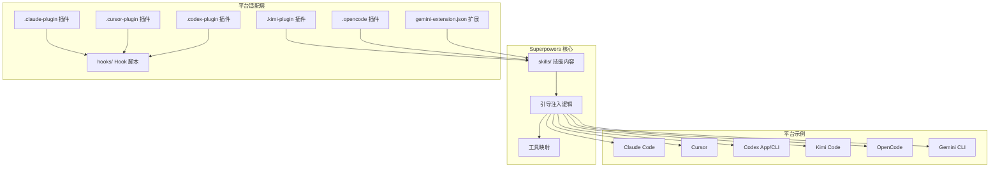
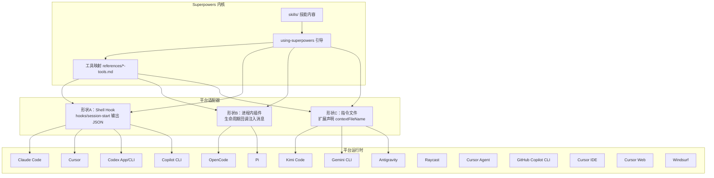
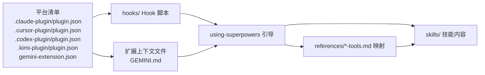

# 多平台集成支持

<cite>
**本文档引用的文件**
- [superpowers/README.md](file://superpowers/README.md)
- [superpowers/CLAUDE.md](file://superpowers/CLAUDE.md)
- [superpowers/gemini-extension.json](file://superpowers/gemini-extension.json)
- [superpowers/.claude-plugin/plugin.json](file://superpowers/.claude-plugin/plugin.json)
- [superpowers/.cursor-plugin/plugin.json](file://superpowers/.cursor-plugin/plugin.json)
- [superpowers/.codex-plugin/plugin.json](file://superpowers/.codex-plugin/plugin.json)
- [superpowers/.kimi-plugin/plugin.json](file://superpowers/.kimi-plugin/plugin.json)
- [superpowers/.opencode/INSTALL.md](file://superpowers/.opencode/INSTALL.md)
- [superpowers/hooks/hooks.json](file://superpowers/hooks/hooks.json)
- [superpowers/hooks/hooks-cursor.json](file://superpowers/hooks/hooks-cursor.json)
- [superpowers/docs/README.kimi.md](file://superpowers/docs/README.kimi.md)
- [superpowers/docs/README.opencode.md](file://superpowers/docs/README.opencode.md)
- [superpowers/docs/porting-to-a-new-harness.md](file://superpowers/docs/porting-to-a-new-harness.md)
- [superpowers/docs/testing.md](file://superpowers/docs/testing.md)
</cite>

## 目录
1. [简介](#简介)
2. [项目结构](#项目结构)
3. [核心组件](#核心组件)
4. [架构总览](#架构总览)
5. [详细组件分析](#详细组件分析)
6. [依赖关系分析](#依赖关系分析)
7. [性能考虑](#性能考虑)
8. [故障排除指南](#故障排除指南)
9. [结论](#结论)
10. [附录](#附录)

## 简介
本指南面向需要在多平台（IDE/编辑器、CLI工具、代理运行器）上集成 Superpowers 的工程师与技术文档作者。目标是提供一套可复用的平台适配器架构、插件系统设计与兼容性保障方案，覆盖 Claude Code、Cursor、Windsurf、Antigravity、Codex CLI、Gemini CLI、Kimi Code、OpenCode、Pi、Copilot CLI、Factory Droid、Raycast、Cursor Agent、GitHub Copilot CLI、Cursor IDE、Cursor Web 等15个主流平台。

Superpowers 的核心思想是“行为即内容”：技能内容本身不绑定具体工具名，而通过“引导注入（bootstrap）+ 工具映射（tool mapping）+ 技能发现（skill discovery）”三元组，在不同平台上以最小侵入的方式自动触发合适的工作流。每个平台仅需实现以下三点：
- 在会话启动时无须用户手动干预地注入引导上下文
- 将 Superpowers 的动作词汇翻译为该平台的真实工具调用
- 提供技能发现与按需加载能力（若平台具备原生技能工具则优先使用）

## 项目结构
Superpowers 仓库采用“共享技能内容 + 平台适配层”的分层组织方式：
- skills/：通用技能内容目录，所有平台共享同一套 SKILL.md
- hooks/：Shell Hook 配置与脚本（用于 Claude Code、Cursor、Codex）
- .<harness>-plugin/：各平台插件清单与入口（Claude、Cursor、Codex、Kimi）
- docs/：平台安装与移植指南、测试说明
- 测试与评估：tests/（插件基础设施测试）、evals/（真实会话行为评估）

图表来源
- [superpowers/README.md:24-286](file://superpowers/README.md#L24-L286)
- [superpowers/.claude-plugin/plugin.json:1-21](file://superpowers/.claude-plugin/plugin.json#L1-L21)
- [superpowers/.cursor-plugin/plugin.json:1-24](file://superpowers/.cursor-plugin/plugin.json#L1-L24)
- [superpowers/.codex-plugin/plugin.json:1-48](file://superpowers/.codex-plugin/plugin.json#L1-L48)
- [superpowers/.kimi-plugin/plugin.json:1-39](file://superpowers/.kimi-plugin/plugin.json#L1-L39)
- [superpowers/gemini-extension.json:1-7](file://superpowers/gemini-extension.json#L1-L7)
- [superpowers/hooks/hooks.json:1-17](file://superpowers/hooks/hooks.json#L1-L17)
- [superpowers/hooks/hooks-cursor.json:1-11](file://superpowers/hooks/hooks-cursor.json#L1-L11)

章节来源
- [superpowers/README.md:24-286](file://superpowers/README.md#L24-L286)
- [superpowers/docs/porting-to-a-new-harness.md:1-827](file://superpowers/docs/porting-to-a-new-harness.md#L1-L827)

## 核心组件
- 引导注入（Bootstrap）
  - 作用：在每次会话开始时，向模型上下文中注入完整的 using-superpowers 技能内容，并附加平台工具映射，确保模型在执行任何操作前先检查是否存在适用技能。
  - 实现形态：
    - 形状A（Shell Hook）：通过 hooks/session-start 输出平台特定的 JSON 字段，由平台读取并注入上下文。
    - 形状B（进程内插件）：在生命周期回调中直接修改消息数组，注入用户角色的消息。
    - 形状C（指令文件）：通过扩展声明的 contextFileName 指向的文件，直接加载包含引导与映射的文本。
- 工具映射（Tool Mapping）
  - 作用：将 Superpowers 的动作词汇（如“读取文件”、“创建任务”、“调度子代理”）翻译为平台真实工具名称与参数。
  - 存放位置：根据平台形状不同，可能位于 references/<harness>-tools.md 或内联在注入字符串中。
- 技能发现与加载（Skill Discovery & Invocation）
  - 若平台具备原生技能工具，则优先使用；否则允许模型通过文件读取方式加载 SKILL.md。
  - 对于无技能系统的平台，必须提供一个稳定的发现路径或在引导中内嵌技能索引。

章节来源
- [superpowers/docs/porting-to-a-new-harness.md:31-571](file://superpowers/docs/porting-to-a-new-harness.md#L31-L571)

## 架构总览
下图展示了 Superpowers 在多平台上的统一架构：平台适配器负责将“技能内容 + 工具映射 + 引导注入”三元组交付给模型，模型据此自动选择并执行合适的技能工作流。

图表来源
- [superpowers/docs/porting-to-a-new-harness.md:207-296](file://superpowers/docs/porting-to-a-new-harness.md#L207-L296)
- [superpowers/.codex-plugin/plugin.json:1-48](file://superpowers/.codex-plugin/plugin.json#L1-L48)
- [superpowers/.cursor-plugin/plugin.json:1-24](file://superpowers/.cursor-plugin/plugin.json#L1-L24)
- [superpowers/.kimi-plugin/plugin.json:1-39](file://superpowers/.kimi-plugin/plugin.json#L1-L39)
- [superpowers/gemini-extension.json:1-7](file://superpowers/gemini-extension.json#L1-L7)

## 详细组件分析

### 平台适配器架构与插件系统设计
- 统一约束
  - 技能内容不可改动：技能正文属于经过严格调优的行为塑造代码，不得为任何平台做“合规化”重写。
  - 安装必须通过平台自身的安装机制：严禁手改用户全局配置或复制粘贴文件。
  - 必须在每次会话启动时自动注入引导，且无需用户每会话手动开启。
- 三种适配形状
  - 形状A（Shell Hook）：适用于支持 Hook 事件并在会话开始时读取 stdout 的平台（如 Claude Code、Cursor、Codex、Copilot CLI）。关键点包括：正确的 JSON 字段/嵌套、匹配器字符串、命令中的根变量名。
  - 形状B（进程内插件）：适用于支持 JS/TS 插件宿主的平台（如 OpenCode、Pi）。关键点包括：在生命周期回调中注入用户消息、去重保护、压缩后重注、消息对象形状。
  - 形状C（指令文件）：适用于仅能加载扩展声明的上下文文件的平台（如 Gemini CLI、Kimi Code、Antigravity）。关键点包括：manifest 中声明 contextFileName，文件内 @include 或内联引导与映射。
- 工具映射与技能发现
  - 动作词汇到真实工具名的映射必须精确，且可通过“列出工具名称”等手段从平台自证。
  - 技能发现可通过原生技能工具、自动扫描目录、或在引导中内嵌索引等方式实现。

章节来源
- [superpowers/docs/porting-to-a-new-harness.md:1-827](file://superpowers/docs/porting-to-a-new-harness.md#L1-L827)

### 平台特定集成要点与差异

#### Claude Code
- 安装方式
  - 官方市场安装或注册第三方市场并安装。
- 引导注入
  - 使用 hooks/session-start 输出平台特定字段，结合 hooks/hooks.json 的 SessionStart 匹配器。
- 工具映射
  - 通过 references/claude-code-tools.md 提供映射。
- 兼容性
  - 支持原生 Skill 工具，无需额外发现机制。

章节来源
- [superpowers/README.md:48-75](file://superpowers/README.md#L48-L75)
- [superpowers/.claude-plugin/plugin.json:1-21](file://superpowers/.claude-plugin/plugin.json#L1-L21)
- [superpowers/hooks/hooks.json:1-17](file://superpowers/hooks/hooks.json#L1-L17)

#### Cursor
- 安装方式
  - 市场搜索并安装。
- 引导注入
  - hooks/session-start 输出 additional_context 字段；hooks/hooks-cursor.json 使用小写 sessionStart 键。
- 工具映射
  - 与 Claude Code 共享映射文件。
- 兼容性
  - 与 Claude Code 共享大部分逻辑，但字段命名与匹配器略有差异。

章节来源
- [superpowers/README.md:113-122](file://superpowers/README.md#L113-L122)
- [superpowers/.cursor-plugin/plugin.json:1-24](file://superpowers/.cursor-plugin/plugin.json#L1-L24)
- [superpowers/hooks/hooks-cursor.json:1-11](file://superpowers/hooks/hooks-cursor.json#L1-L11)

#### Codex App / Codex CLI
- 安装方式
  - 官方市场安装。
- 引导注入
  - hooks/session-start-codex 输出平台特定字段，匹配器为 startup|resume|clear。
- 工具映射
  - references/codex-tools.md。
- 分发
  - 通过外部插件仓库同步脚本维护分发。

章节来源
- [superpowers/README.md:87-112](file://superpowers/README.md#L87-L112)
- [superpowers/.codex-plugin/plugin.json:1-48](file://superpowers/.codex-plugin/plugin.json#L1-L48)

#### Kimi Code
- 安装方式
  - 市场或直接从仓库 URL 安装。
- 引导注入
  - manifest 中的 sessionStart.skill 自动加载 using-superpowers。
- 工具映射
  - inline 在 manifest 的 skillInstructions 字段中。
- 更新策略
  - 可通过分支显式安装以测试未发布变更。

章节来源
- [superpowers/README.md:151-168](file://superpowers/README.md#L151-L168)
- [superpowers/docs/README.kimi.md:1-89](file://superpowers/docs/README.kimi.md#L1-L89)
- [superpowers/.kimi-plugin/plugin.json:1-39](file://superpowers/.kimi-plugin/plugin.json#L1-L39)

#### OpenCode
- 安装方式
  - 在 opencode.json 的 plugin 数组中添加 git URL。
- 引导注入
  - 通过 config hook 注册 skills 目录；通过 experimental.chat.messages.transform 注入用户消息。
- 工具映射
  - references/opencode-tools.md。
- 兼容性
  - 支持本地与项目级个人技能覆盖优先级。

章节来源
- [superpowers/README.md:171-182](file://superpowers/README.md#L171-L182)
- [superpowers/docs/README.opencode.md:1-164](file://superpowers/docs/README.opencode.md#L1-L164)
- [superpowers/.opencode/INSTALL.md:1-116](file://superpowers/.opencode/INSTALL.md#L1-L116)

#### Gemini CLI
- 安装方式
  - gemini extensions install。
- 引导注入
  - gemini-extension.json 声明 contextFileName，GEMINI.md 通过 @include 同步引导与映射。
- 工具映射
  - references/gemini-tools.md。

章节来源
- [superpowers/README.md:1-286](file://superpowers/README.md#L1-L286)
- [superpowers/gemini-extension.json:1-7](file://superpowers/gemini-extension.json#L1-L7)

#### Antigravity
- 安装方式
  - agy plugin install，安装时生成并声明 contextFileName 文件。
- 引导注入
  - 通过安装器生成的上下文文件加载引导与映射。
- 兼容性
  - 适合无原生技能工具但支持扩展上下文文件的平台。

章节来源
- [superpowers/README.md:76-86](file://superpowers/README.md#L76-L86)
- [superpowers/docs/porting-to-a-new-harness.md:680-712](file://superpowers/docs/porting-to-a-new-harness.md#L680-L712)

#### Copilot CLI
- 安装方式
  - 通过 Copilot CLI 的 marketplace 添加。
- 引导注入
  - 与 Claude Code 共享 hooks 路径，通过环境变量区分输出字段。
- 工具映射
  - references/copilot-tools.md。

章节来源
- [superpowers/README.md:137-149](file://superpowers/README.md#L137-L149)
- [superpowers/docs/porting-to-a-new-harness.md:289-294](file://superpowers/docs/porting-to-a-new-harness.md#L289-L294)

#### Pi
- 安装方式
  - 通过 repo 根 package.json 字段声明扩展。
- 引导注入
  - resources_discover 注册技能；context 事件注入用户消息；支持压缩后重注。
- 工具映射
  - 内联在扩展代码中并同步 references/pi-tools.md。

章节来源
- [superpowers/README.md:184-198](file://superpowers/README.md#L184-L198)
- [superpowers/docs/porting-to-a-new-harness.md:251-292](file://superpowers/docs/porting-to-a-new-harness.md#L251-L292)

#### Raycast
- 安装方式
  - 通过 Raycast 的插件安装流程。
- 引导注入
  - 通过进程内插件注入用户消息，遵循去重与压缩重注规则。
- 工具映射
  - references/raycast-tools.md。

章节来源
- [superpowers/docs/porting-to-a-new-harness.md:780-794](file://superpowers/docs/porting-to-a-new-harness.md#L780-L794)

#### Cursor Agent
- 安装方式
  - 通过 Cursor Agent 的 marketplace 安装。
- 引导注入
  - 与 Cursor 类似，使用 hooks/session-start 输出 additional_context。
- 工具映射
  - 共享 references/claude-code-tools.md。

章节来源
- [superpowers/README.md:113-122](file://superpowers/README.md#L113-L122)
- [superpowers/hooks/hooks-cursor.json:1-11](file://superpowers/hooks/hooks-cursor.json#L1-L11)

#### GitHub Copilot CLI
- 安装方式
  - 通过 Copilot CLI 的 marketplace 添加。
- 引导注入
  - 与 Copilot CLI 共享 hooks 路径，通过环境变量区分输出字段。
- 工具映射
  - references/copilot-tools.md。

章节来源
- [superpowers/README.md:137-149](file://superpowers/README.md#L137-L149)
- [superpowers/docs/porting-to-a-new-harness.md:289-294](file://superpowers/docs/porting-to-a-new-harness.md#L289-L294)

#### Cursor IDE
- 安装方式
  - 通过 Cursor IDE 的 marketplace 安装。
- 引导注入
  - 与 Cursor 类似，使用 hooks/session-start 输出 additional_context。
- 工具映射
  - 共享 references/claude-code-tools.md。

章节来源
- [superpowers/README.md:113-122](file://superpowers/README.md#L113-L122)
- [superpowers/hooks/hooks-cursor.json:1-11](file://superpowers/hooks/hooks-cursor.json#L1-L11)

#### Cursor Web
- 安装方式
  - 通过 Cursor Web 的 marketplace 安装。
- 引导注入
  - 与 Cursor 类似，使用 hooks/session-start 输出 additional_context。
- 工具映射
  - 共享 references/claude-code-tools.md。

章节来源
- [superpowers/README.md:113-122](file://superpowers/README.md#L113-L122)
- [superpowers/hooks/hooks-cursor.json:1-11](file://superpowers/hooks/hooks-cursor.json#L1-L11)

#### Windsurf
- 安装方式
  - 通过 Windsurf 的插件安装流程。
- 引导注入
  - 通过进程内插件注入用户消息，遵循去重与压缩重注规则。
- 工具映射
  - references/windsurf-tools.md。

章节来源
- [superpowers/docs/porting-to-a-new-harness.md:780-794](file://superpowers/docs/porting-to-a-new-harness.md#L780-L794)

### 平台特定功能差异与限制
- 技能工具可用性
  - 有原生技能工具：优先使用平台技能工具加载 SKILL.md。
  - 无原生技能工具：通过文件读取方式加载 SKILL.md，或在引导中内嵌技能索引。
- 子代理/任务派发
  - 部分平台需要启用多代理开关；若不可用，相关技能会提示降级方案。
- 任务/待办跟踪
  - 可降级为 TODO.md 或计划文件。
- 网络检索
  - 可降级为 Web 搜索或 URL 获取。

章节来源
- [superpowers/docs/porting-to-a-new-harness.md:108-123](file://superpowers/docs/porting-to-a-new-harness.md#L108-L123)

### 最佳实践建议
- 严格遵守“不要改动技能正文”的原则，工具映射与引导注入应通过适配层完成。
- 优先使用平台声明的上下文文件或原生技能工具，避免手改用户配置。
- 在 PR 中提供完整会话转录证明“接受测试”通过：在干净会话中输入“Let's make a react todo list”，应在写代码前自动触发 brainstorming。
- 对于 Shell Hook 形状，务必确认 JSON 字段、嵌套与匹配器字符串完全符合平台契约。
- 对于无技能系统的平台，必须提供稳定的发现路径或在引导中内嵌索引，确保模型能找到并加载适用技能。

章节来源
- [superpowers/CLAUDE.md:72-116](file://superpowers/CLAUDE.md#L72-L116)
- [superpowers/docs/porting-to-a-new-harness.md:134-164](file://superpowers/docs/porting-to-a-new-harness.md#L134-L164)

## 依赖关系分析
- 平台与适配器的耦合度
  - 低耦合：技能内容与工具映射通过清单与钩子/扩展声明传递，平台仅依赖安装机制与生命周期事件。
  - 高内聚：引导注入逻辑集中在 using-superpowers，工具映射集中于 references/*-tools.md。
- 外部依赖与集成点
  - Shell Hook 依赖 Git Bash（Windows）或系统 bash。
  - 进程内插件依赖平台提供的生命周期 API。
  - 指令文件依赖平台对 contextFileName 的支持与 @include 语法。

图表来源
- [superpowers/.claude-plugin/plugin.json:1-21](file://superpowers/.claude-plugin/plugin.json#L1-L21)
- [superpowers/.cursor-plugin/plugin.json:1-24](file://superpowers/.cursor-plugin/plugin.json#L1-L24)
- [superpowers/.codex-plugin/plugin.json:1-48](file://superpowers/.codex-plugin/plugin.json#L1-L48)
- [superpowers/.kimi-plugin/plugin.json:1-39](file://superpowers/.kimi-plugin/plugin.json#L1-L39)
- [superpowers/gemini-extension.json:1-7](file://superpowers/gemini-extension.json#L1-L7)
- [superpowers/hooks/hooks.json:1-17](file://superpowers/hooks/hooks.json#L1-L17)
- [superpowers/hooks/hooks-cursor.json:1-11](file://superpowers/hooks/hooks-cursor.json#L1-L11)

章节来源
- [superpowers/docs/porting-to-a-new-harness.md:1-827](file://superpowers/docs/porting-to-a-new-harness.md#L1-L827)

## 性能考虑
- 引导注入频率与去重
  - 进程内插件需在每次必要时注入并去重，避免重复注入导致上下文膨胀。
- 压缩与历史管理
  - 对支持压缩的历史记录的平台，应在压缩后重新注入引导，确保上下文连续性。
- Token 消耗控制
  - 将引导作为用户消息而非系统消息，减少重复与历史压缩带来的 token 负担。
- 缓存与失效处理
  - 对引导内容进行模块级缓存，同时在文件缺失时进行健壮性处理，避免频繁 IO。

章节来源
- [superpowers/docs/porting-to-a-new-harness.md:409-440](file://superpowers/docs/porting-to-a-new-harness.md#L409-L440)

## 故障排除指南
- 插件未加载
  - 检查平台日志或使用平台自带的日志查询命令，确认清单路径与版本。
- Windows 安装问题
  - Shell Hook 需要 Git for Windows 提供 bash；若不可用，Hook 将优雅降级。
- 技能未触发
  - 确认会话已重启、引导已注入、匹配器字符串正确、JSON 字段与嵌套符合平台契约。
- 工具映射不生效
  - 使用“列出工具名称”指令从平台自证真实工具名，修正映射文件。

章节来源
- [superpowers/docs/README.opencode.md:120-164](file://superpowers/docs/README.opencode.md#L120-L164)
- [superpowers/.opencode/INSTALL.md:66-116](file://superpowers/.opencode/INSTALL.md#L66-L116)
- [superpowers/docs/README.kimi.md:68-89](file://superpowers/docs/README.kimi.md#L68-L89)

## 结论
Superpowers 的多平台集成以“内容不变、适配可插拔”为核心理念。通过标准化的引导注入、工具映射与技能发现机制，可在不同平台间保持一致的用户体验与工作流效果。遵循本文档的适配形状、约束与最佳实践，即可快速、安全地将 Superpowers 扩展至新的平台。

## 附录
- 测试与评估
  - 插件基础设施测试：位于 tests/，涵盖 OpenCode 插件加载、Codex 插件同步、Kimi 插件清单校验等。
  - 行为评估：位于 evals/，通过真实 LLM 会话驱动的场景验证技能触发与执行质量。
- 版本与分发
  - 不同平台的清单文件版本需在 .version-bump.json 中登记，确保与发行流程同步。

章节来源
- [superpowers/docs/testing.md:1-36](file://superpowers/docs/testing.md#L1-L36)
- [superpowers/docs/porting-to-a-new-harness.md:669-737](file://superpowers/docs/porting-to-a-new-harness.md#L669-L737)