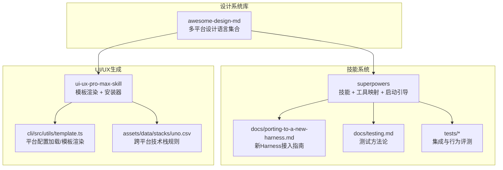
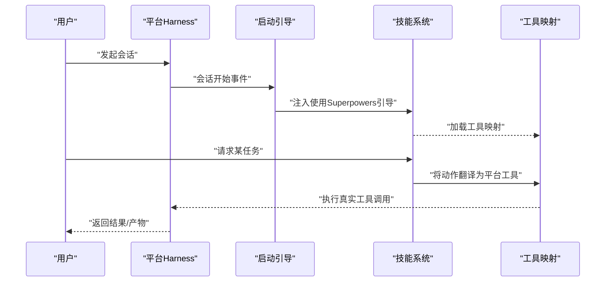
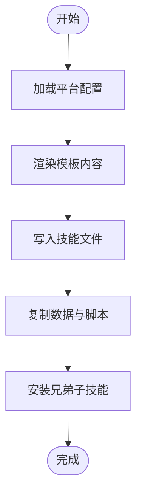
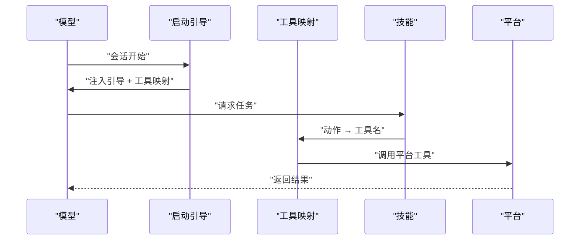
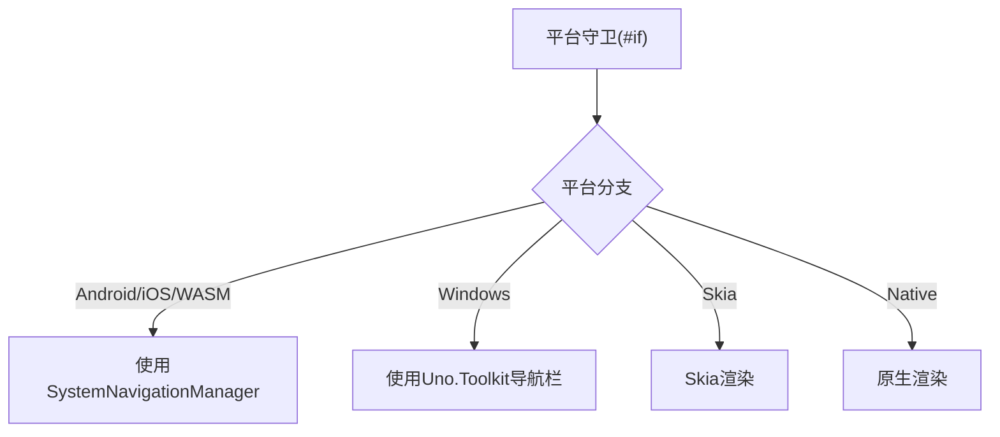
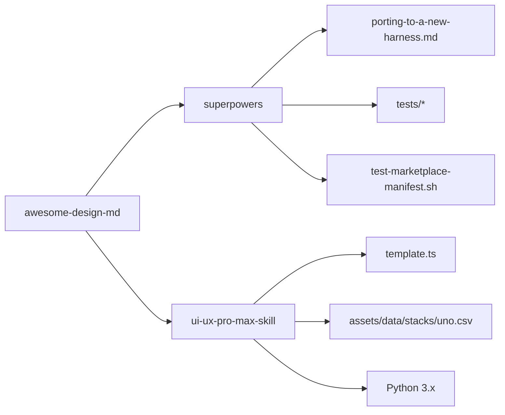

# 平台兼容性与适配

<cite>
**本文引用的文件**
- [awesome-design-md/README.md](file://awesome-design-md/README.md)
- [awesome-design-md/CONTRIBUTING.md](file://awesome-design-md/CONTRIBUTING.md)
- [superpowers/README.md](file://superpowers/README.md)
- [superpowers/docs/porting-to-a-new-harness.md](file://superpowers/docs/porting-to-a-new-harness.md)
- [superpowers/docs/testing.md](file://superpowers/docs/testing.md)
- [superpowers/tests/codex/test-marketplace-manifest.sh](file://superpowers/tests/codex/test-marketplace-manifest.sh)
- [superpowers/tests/kimi/run-tests.sh](file://superpowers/tests/kimi/run-tests.sh)
- [ui-ux-pro-max-skill/README.md](file://ui-ux-pro-max-skill/README.md)
- [ui-ux-pro-max-skill/cli/src/utils/template.ts](file://ui-ux-pro-max-skill/cli/src/utils/template.ts)
- [ui-ux-pro-max-skill/cli/assets/data/stacks/uno.csv](file://ui-ux-pro-max-skill/cli/assets/data/stacks/uno.csv)
- [ui-ux-pro-max-skill/src/ui-ux-pro-max/data/stacks/uno.csv](file://ui-ux-pro-max-skill/src/ui-ux-pro-max/data/stacks/uno.csv)
</cite>

## 目录
1. [引言](#引言)
2. [项目结构](#项目结构)
3. [核心组件](#核心组件)
4. [架构总览](#架构总览)
5. [详细组件分析](#详细组件分析)
6. [依赖关系分析](#依赖关系分析)
7. [性能考虑](#性能考虑)
8. [故障排查指南](#故障排查指南)
9. [结论](#结论)
10. [附录](#附录)

## 引言
本技术指南聚焦于平台兼容性与适配，围绕以下目标展开：  
- 平台适配器架构设计与插件系统通用接口  
- 平台抽象层实现与跨平台差异处理  
- 不同平台的API差异、功能限制与兼容性挑战  
- 新平台接入流程、适配器开发规范与测试验证方法  
- 平台间功能对比表、性能基准测试与迁移成本评估  

通过 Superpowers 的“技能系统 + 工具映射 + 启动引导”三元架构，以及 UI/UX Pro Max 的“模板化生成 + 跨平台安装器 + 数据脚本引擎”的实现方式，本指南给出可复用的工程实践与最佳实践。

## 项目结构
该仓库包含三大能力域：
- 设计系统与品牌风格库（awesome-design-md）：提供多平台站点的设计语言文档，作为 AI 生成 UI 的统一参考。
- 技能系统与平台适配（superpowers）：以“技能”为动作单元，通过工具映射与启动引导在不同编码助手/IDE中自动触发。
- UI/UX 智能生成与跨平台安装（ui-ux-pro-max-skill）：通过 CLI 将模板渲染为各平台本地技能目录，内置数据与脚本，支持全局安装与强制覆盖。

图示来源
- [awesome-design-md/README.md:1-250](file://awesome-design-md/README.md#L1-L250)
- [superpowers/README.md:1-286](file://superpowers/README.md#L1-L286)
- [superpowers/docs/porting-to-a-new-harness.md:1-827](file://superpowers/docs/porting-to-a-new-harness.md#L1-L827)
- [superpowers/docs/testing.md:1-36](file://superpowers/docs/testing.md#L1-L36)
- [ui-ux-pro-max-skill/README.md:1-649](file://ui-ux-pro-max-skill/README.md#L1-L649)
- [ui-ux-pro-max-skill/cli/src/utils/template.ts:1-309](file://ui-ux-pro-max-skill/cli/src/utils/template.ts#L1-L309)
- [ui-ux-pro-max-skill/cli/assets/data/stacks/uno.csv:1-60](file://ui-ux-pro-max-skill/cli/assets/data/stacks/uno.csv#L1-L60)

章节来源
- [awesome-design-md/README.md:1-250](file://awesome-design-md/README.md#L1-L250)
- [superpowers/README.md:1-286](file://superpowers/README.md#L1-L286)
- [ui-ux-pro-max-skill/README.md:1-649](file://ui-ux-pro-max-skill/README.md#L1-L649)

## 核心组件
- 平台抽象层（Platform Abstraction Layer）
  - 通过“平台配置 + 模板渲染 + 文件系统写入”的组合，将技能内容与平台特定路径、脚本路径、前置信息等解耦，实现跨平台一致的安装体验。
  - 关键点：AI 类型到平台名映射、平台配置加载、模板占位符替换、全局安装时的路径改写、数据与脚本自包含复制。

- 插件系统通用接口（Plugin System Interface）
  - Superpowers 的“技能”是动作语义的抽象，不直接绑定具体工具；通过“工具映射”将动作翻译为各平台的真实工具名称，并由“启动引导”在会话开始时注入上下文。
  - 关键点：动作词汇标准化、工具映射集中管理、启动引导的去重与压缩感知、无原生技能工具时的“读取 SKILL.md”回退机制。

- 平台适配器架构（Adapter Architecture）
  - 三种“注入形状”（Shape A/B/C）分别对应：会话开始 Hook 输出 JSON、进程内插件/扩展注入消息、指令文件声明式注入。每种形状有严格的字段/嵌套/事件匹配要求，避免双注或静默失败。
  - 关键点：注入时机保证（每次会话）、注入内容完整性（技能 + 工具映射）、与平台契约对齐（环境变量、JSON 字段、事件匹配字符串）。

章节来源
- [ui-ux-pro-max-skill/cli/src/utils/template.ts:10-309](file://ui-ux-pro-max-skill/cli/src/utils/template.ts#L10-L309)
- [superpowers/docs/porting-to-a-new-harness.md:300-507](file://superpowers/docs/porting-to-a-new-harness.md#L300-L507)

## 架构总览
下图展示了 Superpowers 在不同平台上的运行机理：技能内容通过启动引导注入模型上下文，工具映射将“动作”转换为平台工具调用，测试与评测确保行为一致性。

图示来源
- [superpowers/docs/porting-to-a-new-harness.md:31-78](file://superpowers/docs/porting-to-a-new-harness.md#L31-L78)
- [superpowers/docs/porting-to-a-new-harness.md:348-454](file://superpowers/docs/porting-to-a-new-harness.md#L348-L454)

## 详细组件分析

### 组件A：平台抽象层（UI/UX Pro Max 安装器）
- 功能职责
  - 加载平台配置（AI 类型 → 平台名 → 配置文件），渲染模板（含快速参考），写入目标目录，复制数据与脚本，按需安装兄弟子技能。
  - 支持全局安装（将相对脚本路径改写为 ~/{root}/ 前缀），并具备清理旧文件、强制覆盖等安全策略。
- 关键流程
  - 平台配置加载 → 模板渲染 → 写入技能文件 → 复制数据/脚本 → 安装子技能 → 返回创建的根目录集合。
- 性能与可靠性
  - 使用异步文件操作减少阻塞；对已存在文件默认跳过，避免重复写入；全局安装时进行路径改写，确保跨平台一致性。

图示来源
- [ui-ux-pro-max-skill/cli/src/utils/template.ts:233-283](file://ui-ux-pro-max-skill/cli/src/utils/template.ts#L233-L283)

章节来源
- [ui-ux-pro-max-skill/cli/src/utils/template.ts:10-309](file://ui-ux-pro-max-skill/cli/src/utils/template.ts#L10-L309)
- [ui-ux-pro-max-skill/README.md:493-544](file://ui-ux-pro-max-skill/README.md#L493-L544)

### 组件B：插件系统通用接口（Superpowers 技能系统）
- 动作抽象与工具映射
  - 技能描述动作而非工具；工具映射将动作翻译为平台工具名，支持 Shape A/B/C 的不同落地方案。
- 启动引导与触发
  - 会话开始时注入“使用Superpowers”引导，包含技能说明与工具映射；若平台无原生技能工具，允许通过“读取 SKILL.md”实现触发。
- 测试与验收
  - 提供自动化测试（插件非LLM代码测试、技能行为评测）与端到端验收（如“Let’s make a react todo list”先触发 brainstorming）。

图示来源
- [superpowers/docs/porting-to-a-new-harness.md:31-78](file://superpowers/docs/porting-to-a-new-harness.md#L31-L78)
- [superpowers/docs/porting-to-a-new-harness.md:508-571](file://superpowers/docs/porting-to-a-new-harness.md#L508-L571)

章节来源
- [superpowers/README.md:200-286](file://superpowers/README.md#L200-L286)
- [superpowers/docs/porting-to-a-new-harness.md:134-164](file://superpowers/docs/porting-to-a-new-harness.md#L134-L164)

### 组件C：跨平台技术栈规则（Uno Platform）
- 规则要点
  - 条件化 XAML 与预处理器符号（如 __IOS__、__ANDROID__、__WASM__、__DESKTOP__）用于平台分支。
  - 导航、深链、渲染后端（Skia vs 原生）等存在平台差异，需在共享代码中加平台守卫。
- 兼容性挑战
  - Windows 桌面缺少某些系统 API（如 BackRequested），需条件编译或使用跨平台替代方案。
  - 渲染后端差异导致控件外观与行为不一致，需在共享逻辑中规避假设。

图示来源
- [ui-ux-pro-max-skill/cli/assets/data/stacks/uno.csv:6-60](file://ui-ux-pro-max-skill/cli/assets/data/stacks/uno.csv#L6-L60)
- [ui-ux-pro-max-skill/src/ui-ux-pro-max/data/stacks/uno.csv:6-60](file://ui-ux-pro-max-skill/src/ui-ux-pro-max/data/stacks/uno.csv#L6-L60)

章节来源
- [ui-ux-pro-max-skill/cli/assets/data/stacks/uno.csv:6-60](file://ui-ux-pro-max-skill/cli/assets/data/stacks/uno.csv#L6-L60)
- [ui-ux-pro-max-skill/src/ui-ux-pro-max/data/stacks/uno.csv:6-60](file://ui-ux-pro-max-skill/src/ui-ux-pro-max/data/stacks/uno.csv#L6-L60)

## 依赖关系分析
- Superpowers 依赖项
  - 文档与测试：porting-to-a-new-harness.md 与 testing.md 提供端到端规范；tests/* 提供集成与行为评测。
  - 市场清单校验：test-marketplace-manifest.sh 校验 Codex 市场清单与插件清单一致性。
- UI/UX Pro Max 依赖项
  - 模板与数据：template.ts 依赖 assets/templates 与 assets/data/scripts；uno.csv 提供跨平台规则。
  - 运行时依赖：Python 3.x 用于搜索脚本与设计系统生成。

图示来源
- [superpowers/docs/porting-to-a-new-harness.md:1-827](file://superpowers/docs/porting-to-a-new-harness.md#L1-L827)
- [superpowers/docs/testing.md:1-36](file://superpowers/docs/testing.md#L1-L36)
- [superpowers/tests/codex/test-marketplace-manifest.sh:1-61](file://superpowers/tests/codex/test-marketplace-manifest.sh#L1-L61)
- [ui-ux-pro-max-skill/cli/src/utils/template.ts:1-309](file://ui-ux-pro-max-skill/cli/src/utils/template.ts#L1-L309)
- [ui-ux-pro-max-skill/cli/assets/data/stacks/uno.csv:1-60](file://ui-ux-pro-max-skill/cli/assets/data/stacks/uno.csv#L1-L60)

章节来源
- [superpowers/docs/testing.md:1-36](file://superpowers/docs/testing.md#L1-L36)
- [superpowers/tests/codex/test-marketplace-manifest.sh:1-61](file://superpowers/tests/codex/test-marketplace-manifest.sh#L1-L61)
- [ui-ux-pro-max-skill/README.md:349-366](file://ui-ux-pro-max-skill/README.md#L349-L366)

## 性能考虑
- 模板渲染与文件写入
  - 异步 I/O 减少阻塞；仅在必要时复制数据与脚本；全局安装时进行一次路径改写，避免重复计算。
- 启动引导注入
  - Shape A/B/C 的注入应尽量轻量，避免在每次回合都重建注入内容；缓存引导文本并在压缩/紧凑后重注入。
- 跨平台规则
  - 条件编译与平台守卫减少运行时判断开销；避免在共享代码中做平台假设，降低分支复杂度。

## 故障排查指南
- 启动引导未生效
  - Shape A：检查 JSON 字段/嵌套是否与平台契约一致，确认事件匹配字符串正确。
  - Shape B：确认注入为用户消息且带去重标记；在压缩/紧凑后重新注入。
  - Shape C：确认上下文文件被安装器声明并保留，或改为内联内容。
- 工具映射缺失或错误
  - 通过模型列出其工具名，获取真实工具名；核对工具映射是否与技能动作一一对应。
- 市场清单问题（Codex）
  - 使用 test-marketplace-manifest.sh 校验市场清单与插件清单一致性。
- 跨平台构建失败
  - Uno 平台规则：确保平台守卫完整，Windows 桌面不调用不支持的 API；Skia 与原生渲染差异需在共享逻辑中规避。

章节来源
- [superpowers/docs/porting-to-a-new-harness.md:374-407](file://superpowers/docs/porting-to-a-new-harness.md#L374-L407)
- [superpowers/docs/porting-to-a-new-harness.md:420-438](file://superpowers/docs/porting-to-a-new-harness.md#L420-L438)
- [superpowers/tests/codex/test-marketplace-manifest.sh:1-61](file://superpowers/tests/codex/test-marketplace-manifest.sh#L1-L61)
- [ui-ux-pro-max-skill/cli/assets/data/stacks/uno.csv:6-60](file://ui-ux-pro-max-skill/cli/assets/data/stacks/uno.csv#L6-L60)

## 结论
通过“平台抽象层 + 插件系统通用接口 + 适配器架构”的协同，本仓库实现了：
- 可移植的技能系统：动作抽象 + 工具映射 + 启动引导，确保在不同平台自动触发。
- 可扩展的安装器：模板渲染 + 自包含数据/脚本 + 全局路径改写，简化跨平台部署。
- 可靠的跨平台规则：条件编译 + 平台守卫 + 替代方案，降低平台差异带来的风险。

建议在新平台接入时严格遵循“定义完成标准”与“验收测试”，并结合自动化测试与端到端验证，确保兼容性与稳定性。

## 附录

### 平台接入流程（Superpowers）
- 选择注入形状（A/B/C），复制参考实现
- 创建清单/入口，注册技能目录与钩子
- 实现启动引导注入（字段/嵌套/事件匹配必须与平台契约一致）
- 编写工具映射，覆盖所有动作
- 添加测试（Shape A：输出结构校验；Shape B：生命周期与去重；Shape C：内联内容）
- 本地安装并进行验收测试（“Let’s make a react todo list”先触发 brainstorming）

章节来源
- [superpowers/docs/porting-to-a-new-harness.md:167-296](file://superpowers/docs/porting-to-a-new-harness.md#L167-L296)
- [superpowers/docs/porting-to-a-new-harness.md:300-507](file://superpowers/docs/porting-to-a-new-harness.md#L300-L507)
- [superpowers/docs/porting-to-a-new-harness.md:572-663](file://superpowers/docs/porting-to-a-new-harness.md#L572-L663)

### 平台间功能对比（示例）
- 启动引导注入
  - Shape A：会话开始 Hook 输出 JSON（需严格字段/嵌套/事件匹配）
  - Shape B：进程内插件注入消息（需消息对象形状与去重/压缩感知）
  - Shape C：指令文件声明式注入（需安装器保留上下文文件）
- 工具映射
  - 读取文件、编辑文件、运行命令、搜索、网络抓取、子代理/任务派发、待办/任务跟踪、Web 搜索等
- 技能发现
  - 原生技能工具优先；无技能工具时通过“读取 SKILL.md”回退

章节来源
- [superpowers/docs/porting-to-a-new-harness.md:108-123](file://superpowers/docs/porting-to-a-new-harness.md#L108-L123)
- [superpowers/docs/porting-to-a-new-harness.md:455-507](file://superpowers/docs/porting-to-a-new-harness.md#L455-L507)

### 测试验证方法
- 插件测试（非 LLM 代码）
  - Node/Python/Bash 集成测试：脑暴服务器、OpenCode 插件加载、Codex 插件同步、Kimi 插件清单校验等
- 技能行为评测（LLM 会话）
  - 使用 drill 驱动 tmux 会话，验证技能触发与行为合规性
- 市场清单校验
  - Codex 市场清单与插件清单一致性检查

章节来源
- [superpowers/docs/testing.md:1-36](file://superpowers/docs/testing.md#L1-36)
- [superpowers/tests/codex/test-marketplace-manifest.sh:1-61](file://superpowers/tests/codex/test-marketplace-manifest.sh#L1-L61)
- [superpowers/tests/kimi/run-tests.sh:1-6](file://superpowers/tests/kimi/run-tests.sh#L1-L6)

### 迁移成本评估
- 低风险场景
  - 现有插件/扩展生态已有会话开始 Hook 或进程内插件能力：按参考实现快速对接，主要成本为工具映射梳理与测试。
- 中等风险场景
  - 仅支持指令文件注入：需声明上下文文件并确保安装器保留；若平台不支持 include 语法，需内联内容。
- 高风险场景
  - 无原生技能工具：需在引导中明确“读取 SKILL.md”为受支持路径，并提供技能索引或运行时枚举；否则无法触发其他技能。
- 跨平台差异
  - Uno 平台：条件编译与平台守卫成本较低，但需规避渲染后端差异与缺失 API 的风险。

章节来源
- [superpowers/docs/porting-to-a-new-harness.md:508-571](file://superpowers/docs/porting-to-a-new-harness.md#L508-L571)
- [ui-ux-pro-max-skill/cli/assets/data/stacks/uno.csv:6-60](file://ui-ux-pro-max-skill/cli/assets/data/stacks/uno.csv#L6-L60)