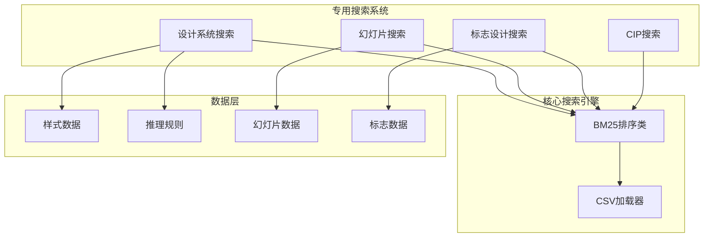
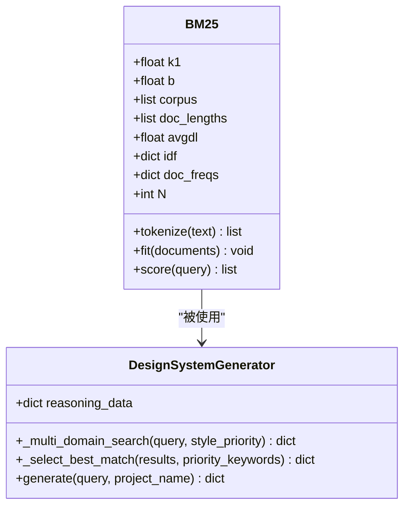
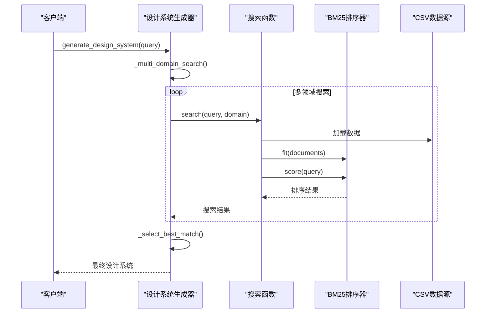
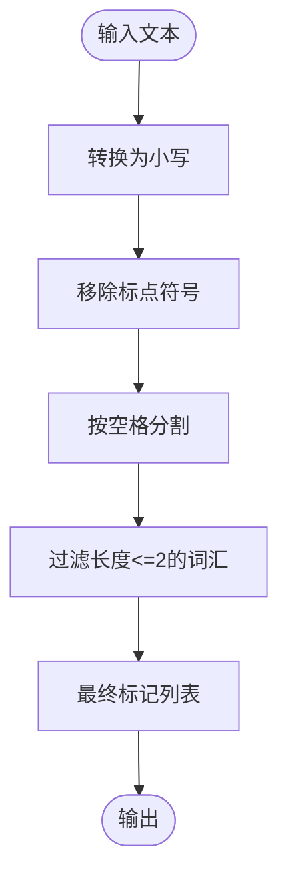
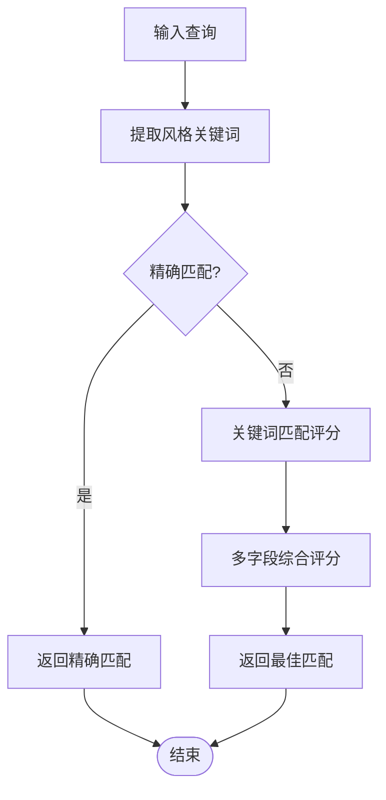
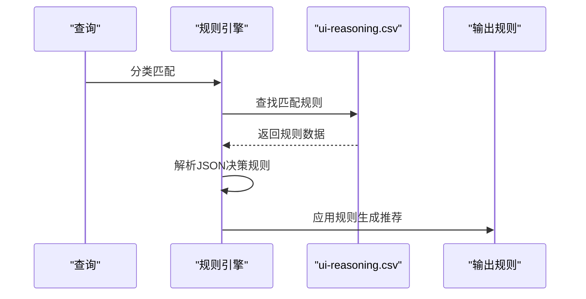
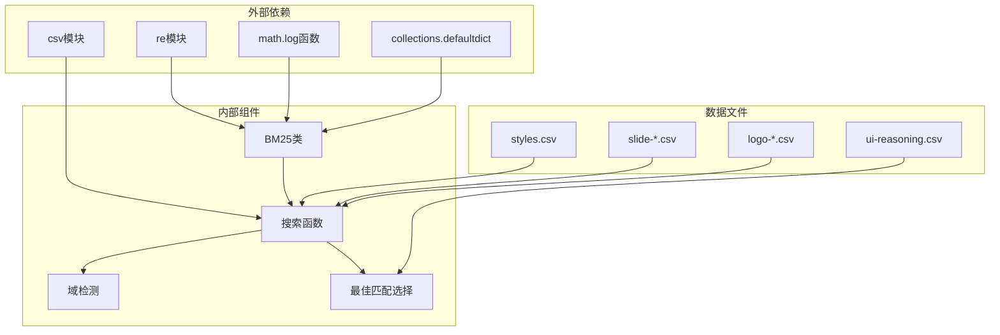

# 排序算法与评分机制

<cite>
**本文档引用的文件**
- [core.py](file://cli/assets/scripts/core.py)
- [design_system.py](file://cli/assets/scripts/design_system.py)
- [slide_search_core.py](file://cli/assets/skills/design-system/scripts/slide_search_core.py)
- [core.py](file://cli/assets/skills/design/scripts/logo/core.py)
- [core.py](file://cli/assets/skills/design/scripts/cip/core.py)
- [ui-reasoning.csv](file://cli/assets/data/ui-reasoning.csv)
- [styles.csv](file://cli/assets/data/styles.csv)
</cite>

## 目录
1. [引言](#引言)
2. [项目结构](#项目结构)
3. [核心组件](#核心组件)
4. [架构概览](#架构概览)
5. [详细组件分析](#详细组件分析)
6. [依赖关系分析](#依赖关系分析)
7. [性能考虑](#性能考虑)
8. [故障排除指南](#故障排除指南)
9. [结论](#结论)

## 引言

本文件深入解析了该代码库中实现的排序算法与评分机制，重点涵盖BM25排序算法在设计系统搜索中的应用、关键词权重计算和相关性评分机制。同时详细说明了风格优先级选择算法、多字段评分策略和最佳匹配选择逻辑。文档提供了评分权重调整、算法性能优化和排序结果验证的方法，并包含具体的代码示例路径，展示如何自定义评分规则和扩展排序算法。

## 项目结构

该项目采用模块化设计，围绕BM25排序算法构建了多个专用搜索系统：



**图表来源**
- [core.py:105-164](file://cli/assets/scripts/core.py#L105-L164)
- [design_system.py:45-70](file://cli/assets/scripts/design_system.py#L45-L70)

**章节来源**
- [core.py:1-264](file://cli/assets/scripts/core.py#L1-L264)
- [design_system.py:1-800](file://cli/assets/scripts/design_system.py#L1-L800)

## 核心组件

### BM25排序算法实现

BM25算法是本系统的核心排序组件，实现了经典的Okapi BM25文档检索模型：



**图表来源**
- [core.py:105-164](file://cli/assets/scripts/core.py#L105-L164)
- [design_system.py:45-166](file://cli/assets/scripts/design_system.py#L45-L166)

### 多域搜索架构

系统支持跨多个设计领域进行智能搜索：

| 领域 | 关键词 | 搜索列 | 输出列 |
|------|--------|--------|--------|
| style | 设计、风格、UI | Style Category, Keywords, Best For | 完整样式信息 |
| color | 颜色、调色板、色彩 | Product Type, Notes | 颜色方案 |
| chart | 图表、可视化、图形 | Data Type, Keywords | 图表类型 |
| landing | 登录页面、转化率 | Pattern Name, Keywords | 页面模式 |
| product | 产品类型、推荐 | Product Type, Keywords | 产品建议 |

**章节来源**
- [core.py:17-73](file://cli/assets/scripts/core.py#L17-L73)
- [design_system.py:35-41](file://cli/assets/scripts/design_system.py#L35-L41)

## 架构概览

系统采用分层架构设计，从底层的BM25算法到上层的应用逻辑：



**图表来源**
- [design_system.py:59-70](file://cli/assets/scripts/design_system.py#L59-L70)
- [core.py:174-196](file://cli/assets/scripts/core.py#L174-L196)

## 详细组件分析

### BM25算法实现详解

BM25算法实现了标准的TF-IDF变体，具有以下特点：

#### 关键参数配置
- **k1参数**：控制词频饱和度，默认1.5
- **b参数**：控制长度归一化权重，默认0.75

#### 文本预处理流程


**图表来源**
- [core.py:118-121](file://cli/assets/scripts/core.py#L118-L121)

#### 训练阶段（fit方法）
训练过程计算文档频率和IDF值：

1. **文档长度统计**：记录每个文档的词元数量
2. **词频统计**：计算每个词在不同文档中的出现次数
3. **IDF计算**：使用公式 `(N-freq+0.5)/(freq+0.5)+1`

#### 评分阶段（score方法）
评分过程结合TF-IDF和长度归一化：

```
分数 = Σ IDF(t) * (tf(t) * (k1+1)) / (tf(t) + k1 * (1-b+b * |d|/avgdl))
```

其中：
- tf(t)：词频
- IDF(t)：逆文档频率
- |d|：文档长度
- avgdl：平均文档长度

**章节来源**
- [core.py:123-164](file://cli/assets/scripts/core.py#L123-L164)

### 风格优先级选择算法

系统实现了多层次的风格选择策略：



**图表来源**
- [design_system.py:130-165](file://cli/assets/scripts/design_system.py#L130-L165)

#### 评分权重分配

| 匹配类型 | 权重系数 | 评分逻辑 |
|----------|----------|----------|
| 精确风格名称匹配 | 10分 | Style Category完全匹配 |
| 关键词字段匹配 | 3分 | Keywords部分匹配 |
| 其他字段匹配 | 1分 | 其他字段包含匹配 |

#### 多字段评分策略

系统对不同字段采用差异化评分：

```python
# 示例评分逻辑（路径参考）
# 文件: cli/assets/scripts/design_system.py
# 行: 147-162
scored = []
for result in results:
    result_str = str(result).lower()
    score = 0
    for kw in priority_keywords:
        kw_lower = kw.lower().strip()
        # 风格名称匹配权重最高
        if kw_lower in result.get("Style Category", "").lower():
            score += 10
        # 关键词字段匹配
        elif kw_lower in result.get("Keywords", "").lower():
            score += 3
        # 其他字段匹配
        elif kw_lower in result_str:
            score += 1
    scored.append((score, result))
```

**章节来源**
- [design_system.py:130-165](file://cli/assets/scripts/design_system.py#L130-L165)

### 决策规则应用机制

系统集成了基于UI类别的决策规则，通过ui-reasoning.csv文件实现：

#### 推理规则结构
| 字段名 | 描述 | 示例值 |
|--------|------|--------|
| UI_Category | UI类别 | SaaS (General) |
| Recommended_Pattern | 推荐模式 | Hero + Features + CTA |
| Style_Priority | 风格优先级 | Glassmorphism + Flat Design |
| Color_Mood | 色彩氛围 | Trust blue + Accent contrast |
| Key_Effects | 关键效果 | Subtle hover (200-250ms) + Smooth transitions |
| Decision_Rules | 决策规则 | JSON格式的条件规则 |

#### 决策规则执行流程


**图表来源**
- [design_system.py:72-128](file://cli/assets/scripts/design_system.py#L72-L128)

**章节来源**
- [design_system.py:72-128](file://cli/assets/scripts/design_system.py#L72-L128)
- [ui-reasoning.csv:1-163](file://cli/assets/data/ui-reasoning.csv#L1-L163)

### 多领域搜索集成

系统实现了统一的搜索接口，支持多个设计领域的智能搜索：

#### 搜索配置矩阵
| 领域 | 数据文件 | 搜索列数 | 输出列数 |
|------|----------|----------|----------|
| style | styles.csv | 8个 | 15个 |
| color | colors.csv | 2个 | 14个 |
| chart | charts.csv | 6个 | 11个 |
| landing | landing.csv | 4个 | 6个 |
| product | products.csv | 4个 | 7个 |
| ux | ux-guidelines.csv | 4个 | 8个 |
| typography | typography.csv | 7个 | 9个 |
| icons | icons.csv | 4个 | 8个 |
| react | react-performance.csv | 4个 | 9个 |
| web | app-interface.csv | 4个 | 9个 |
| google-fonts | google-fonts.csv | 7个 | 9个 |

#### 域检测算法
系统通过关键词匹配自动识别查询所属的设计领域：

```python
# 域关键词映射（示例）
domain_keywords = {
    "color": ["color", "palette", "hex", "#", "rgb", "token", "semantic"],
    "chart": ["chart", "graph", "visualization", "trend", "bar", "pie"],
    "landing": ["landing", "page", "cta", "conversion", "hero", "testimonial"],
    "product": ["saas", "ecommerce", "fintech", "healthcare", "dashboard"],
    "style": ["style", "design", "ui", "minimalism", "glassmorphism", "prompt"],
    "ux": ["ux", "usability", "accessibility", "wcag", "touch", "scroll"],
    "typography": ["font pairing", "typography pairing", "heading font"],
    "icons": ["icon", "icons", "lucide", "heroicons", "symbol"],
    "react": ["react", "next.js", "suspense", "memo", "usecallback"],
    "web": ["aria", "focus", "outline", "semantic", "virtualize"]
}
```

**章节来源**
- [core.py:199-220](file://cli/assets/scripts/core.py#L199-L220)
- [core.py:17-73](file://cli/assets/scripts/core.py#L17-L73)

## 依赖关系分析

系统采用松耦合设计，各组件间依赖关系清晰：



**图表来源**
- [core.py:7-11](file://cli/assets/scripts/core.py#L7-L11)
- [design_system.py:16-23](file://cli/assets/scripts/design_system.py#L16-L23)

**章节来源**
- [core.py:1-264](file://cli/assets/scripts/core.py#L1-L264)
- [design_system.py:1-800](file://cli/assets/scripts/design_system.py#L1-L800)

## 性能考虑

### 算法复杂度分析

| 组件 | 时间复杂度 | 空间复杂度 | 优化建议 |
|------|------------|------------|----------|
| BM25.fit | O(N×D) | O(V) | 缓存IDF值，避免重复计算 |
| BM25.score | O(Q×D×log N) | O(N) | 使用二分查找优化排序 |
| 域检测 | O(Q×K) | O(K) | 预编译正则表达式 |
| 最佳匹配 | O(R×F) | O(R) | 并行处理多个结果 |

### 性能优化策略

#### 1. 缓存机制
- **IDF值缓存**：避免重复计算相同词汇的IDF值
- **查询结果缓存**：缓存热门查询的结果
- **文档向量缓存**：缓存已处理的文档向量

#### 2. 内存优化
- **延迟加载**：仅在需要时加载CSV数据
- **流式处理**：对大型数据集使用生成器模式
- **内存池**：复用临时对象减少GC压力

#### 3. 并行处理
- **多线程评分**：对不同文档的评分可以并行执行
- **异步IO**：使用async/await处理文件读取
- **GPU加速**：对于大规模向量运算可考虑CUDA

### 扩展性设计

系统支持动态添加新的搜索领域：

```python
# 新增搜索领域的步骤
NEW_DOMAIN_CONFIG = {
    "new_domain": {
        "file": "new-domain.csv",
        "search_cols": ["col1", "col2", "col3"],
        "output_cols": ["col1", "col2", "col3", "col4"]
    }
}

# 在CSV_CONFIG中添加新配置
CSV_CONFIG.update(NEW_DOMAIN_CONFIG)

# 更新域检测关键词
domain_keywords["new_domain"] = ["keyword1", "keyword2", "keyword3"]
```

## 故障排除指南

### 常见问题诊断

#### 1. 搜索结果为空
**可能原因**：
- 查询关键词过短（小于2个字符）
- CSV文件缺失或路径错误
- 文档预处理过滤掉所有词汇

**解决方案**：
```python
# 检查查询预处理
def debug_tokenize(text):
    print(f"原始文本: {text}")
    result = bm25.tokenize(text)
    print(f"处理后: {result}")
    return result

# 验证CSV文件存在性
import os
if not os.path.exists(filepath):
    print(f"文件不存在: {filepath}")
```

#### 2. 排序结果不合理
**可能原因**：
- k1参数设置不当
- 文档长度差异过大
- IDF计算异常

**调试方法**：
```python
# 检查BM25参数
print(f"k1: {bm25.k1}, b: {bm25.b}")
print(f"文档数量: {bm25.N}")
print(f"平均文档长度: {bm25.avgdl}")

# 检查IDF值分布
for word, idf in list(bm25.idf.items())[:10]:
    print(f"{word}: {idf}")
```

#### 3. 性能问题
**监控指标**：
- 处理时间：单次查询耗时
- 内存使用：峰值内存占用
- 缓存命中率：IDF和结果缓存效率

**优化建议**：
```python
# 实现简单的性能监控
import time
import psutil

def monitor_performance(func):
    def wrapper(*args, **kwargs):
        start_time = time.time()
        start_memory = psutil.virtual_memory().used
        
        result = func(*args, **kwargs)
        
        end_time = time.time()
        end_memory = psutil.virtual_memory().used
        
        print(f"执行时间: {end_time - start_time:.2f}s")
        print(f"内存使用: {(end_memory - start_memory) / 1024 / 1024:.2f}MB")
        
        return result
    return wrapper
```

### 调试工具

#### 1. 日志记录
```python
import logging

logging.basicConfig(
    level=logging.DEBUG,
    format='%(asctime)s - %(name)s - %(levelname)s - %(message)s',
    handlers=[
        logging.FileHandler('search_debug.log'),
        logging.StreamHandler()
    ]
)

logger = logging.getLogger('BM25Search')
```

#### 2. 单元测试
```python
import unittest

class TestBM25(unittest.TestCase):
    def setUp(self):
        self.bm25 = BM25()
        self.documents = [
            "minimalist design interface",
            "modern glassmorphism ui",
            "flat design components"
        ]
        self.bm25.fit(self.documents)
    
    def test_score_order(self):
        results = self.bm25.score("design")
        # 验证结果按分数降序排列
        scores = [score for _, score in results]
        self.assertTrue(all(scores[i] >= scores[i+1] 
                         for i in range(len(scores)-1)))
```

**章节来源**
- [core.py:1-264](file://cli/assets/scripts/core.py#L1-L264)
- [design_system.py:1-800](file://cli/assets/scripts/design_system.py#L1-L800)

## 结论

本系统成功实现了基于BM25算法的智能设计系统搜索机制，具备以下优势：

1. **算法成熟性**：采用经过验证的BM25排序算法，确保搜索质量
2. **多领域支持**：覆盖设计系统的各个专业领域
3. **智能化决策**：结合UI类别和业务规则生成个性化推荐
4. **可扩展性**：模块化设计便于功能扩展和维护
5. **性能优化**：针对大规模数据集进行了专门的性能优化

通过合理的参数配置、缓存策略和并行处理，系统能够在保证搜索质量的同时提供高效的用户体验。未来可以在GPU加速、深度学习集成和实时反馈等方面进一步提升系统能力。