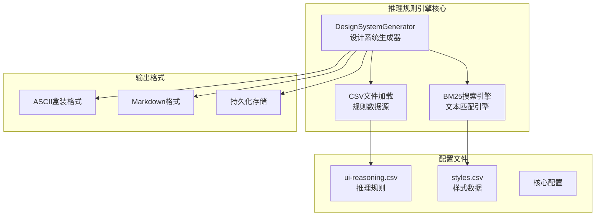
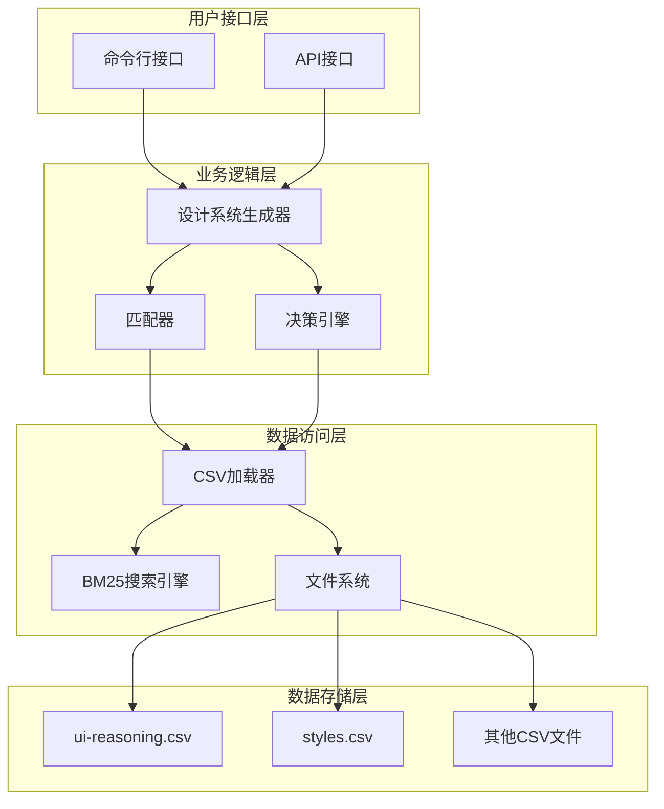
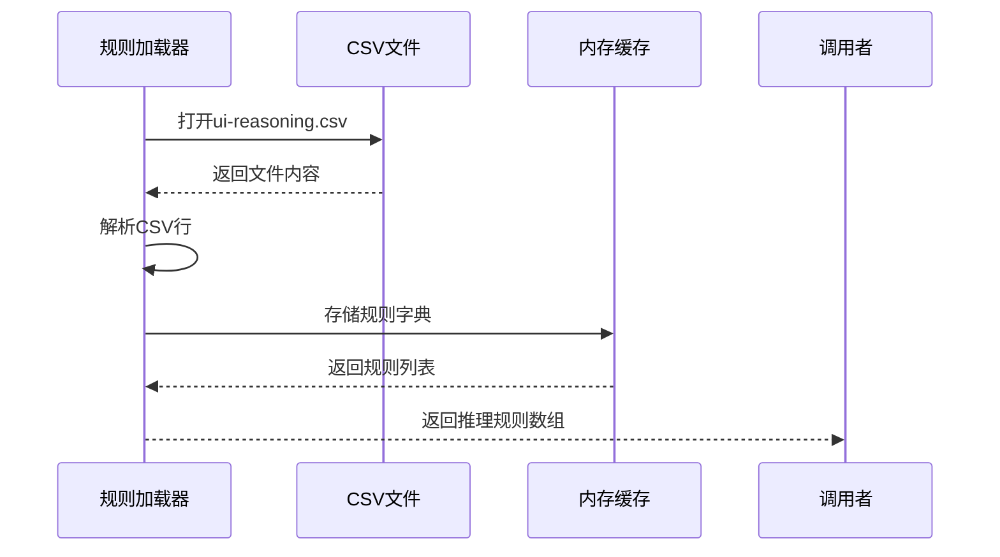
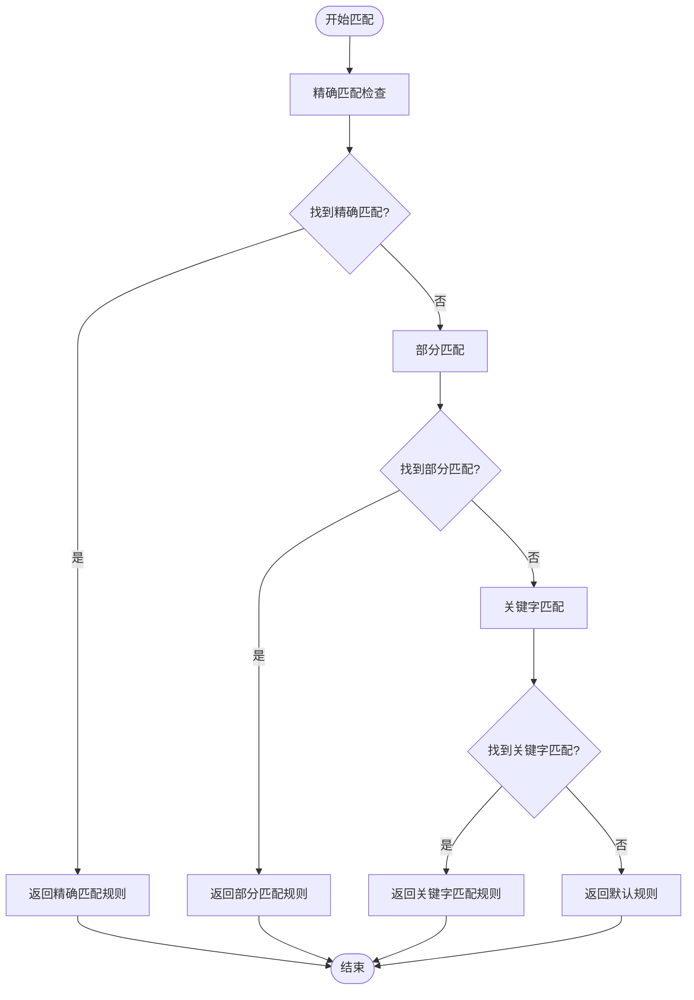
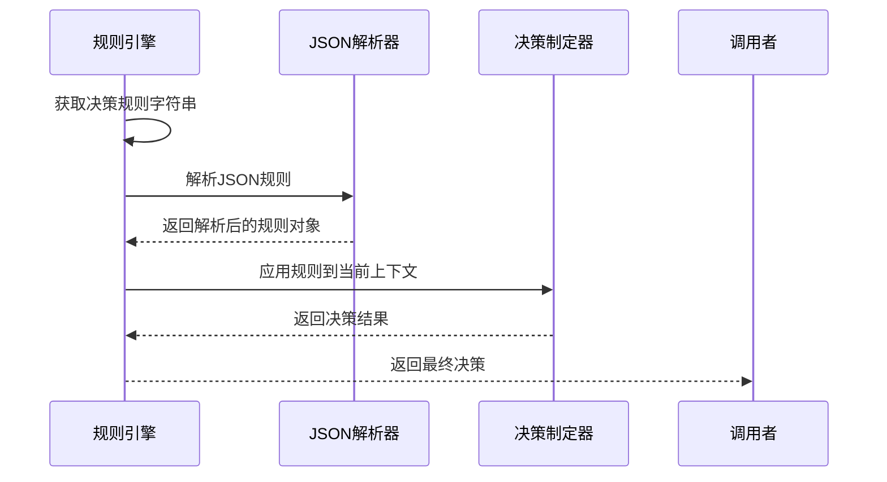
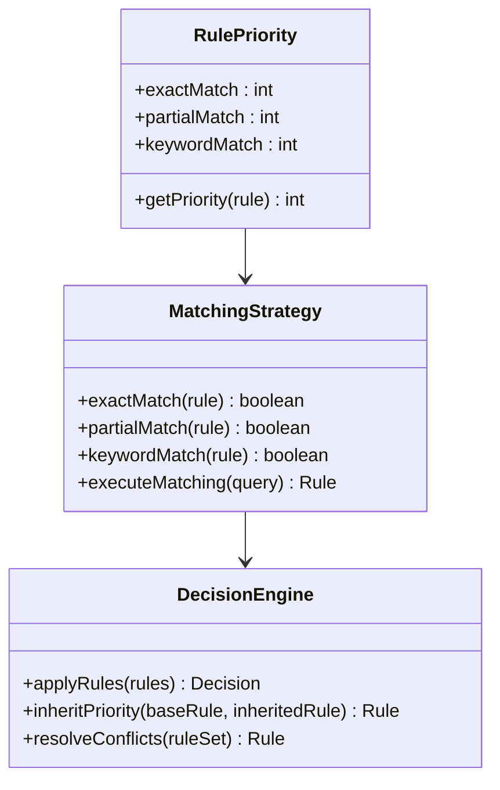
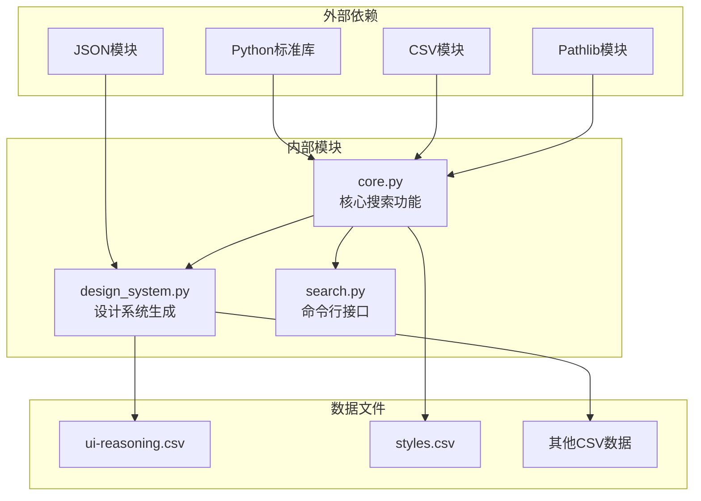

# 推理规则引擎

<cite>
**本文档引用的文件**
- [design_system.py](file://ui-ux-pro-max-skill/skills/ui-ux-pro-max/scripts/design_system.py)
- [core.py](file://ui-ux-pro-max-skill/skills/ui-ux-pro-max/scripts/core.py)
- [search.py](file://ui-ux-pro-max-skill/skills/ui-ux-pro-max/scripts/search.py)
- [ui-reasoning.csv](file://ui-ux-pro-max-skill/skills/ui-ux-pro-max/data/ui-reasoning.csv)
- [styles.csv](file://ui-ux-pro-max-skill/skills/ui-ux-pro-max/data/styles.csv)
</cite>

## 目录
1. [简介](#简介)
2. [项目结构](#项目结构)
3. [核心组件](#核心组件)
4. [架构概览](#架构概览)
5. [详细组件分析](#详细组件分析)
6. [依赖关系分析](#依赖关系分析)
7. [性能考虑](#性能考虑)
8. [故障排除指南](#故障排除指南)
9. [结论](#结论)
10. [附录](#附录)

## 简介

推理规则引擎是一个基于CSV文件的智能决策系统，专门用于UI/UX设计领域的规则匹配和决策制定。该系统通过精确匹配、部分匹配和关键字匹配三种策略，结合决策规则解析流程，为设计系统生成提供智能化的推理支持。

系统的核心特点包括：
- 基于CSV文件的规则存储和加载机制
- 多层次的匹配算法（精确、部分、关键字）
- 决策规则的JSON解析和应用
- 动态规则扩展能力
- 规则优先级处理和继承机制

## 项目结构

推理规则引擎位于 `ui-ux-pro-max-skill` 项目的 `skills/ui-ux-pro-max/scripts/` 目录下，主要由以下组件构成：

**图表来源**
- [design_system.py:1-800](file://ui-ux-pro-max-skill/skills/ui-ux-pro-max/scripts/design_system.py#L1-L800)
- [core.py:1-263](file://ui-ux-pro-max-skill/skills/ui-ux-pro-max/scripts/core.py#L1-L263)

**章节来源**
- [design_system.py:1-800](file://ui-ux-pro-max-skill/skills/ui-ux-pro-max/scripts/design_system.py#L1-L800)
- [core.py:1-263](file://ui-ux-pro-max-skill/skills/ui-ux-pro-max/scripts/core.py#L1-L263)

## 核心组件

### 设计系统生成器（DesignSystemGenerator）

设计系统生成器是推理规则引擎的核心组件，负责协调整个推理过程。它包含以下关键功能：

- **规则加载**：从CSV文件中加载推理规则
- **多域搜索**：跨多个数据域执行搜索操作
- **规则匹配**：实现三种匹配策略
- **决策应用**：将匹配到的规则应用到搜索结果
- **结果格式化**：生成最终的设计系统推荐

### BM25搜索引擎

基于BM25算法的搜索引擎，用于高效的文本匹配和排序：

- **分词处理**：清理标点符号，过滤短词
- **索引构建**：统计词频和逆文档频率
- **评分计算**：使用BM25公式计算相关性得分
- **结果排序**：按相关性对结果进行排序

### CSV数据管理

统一的CSV文件管理系统，支持多种数据类型的加载和查询：

- **配置驱动**：通过配置文件定义CSV结构
- **自动检测**：根据查询内容自动选择数据域
- **灵活输出**：支持不同的输出列组合

**章节来源**
- [design_system.py:37-246](file://ui-ux-pro-max-skill/skills/ui-ux-pro-max/scripts/design_system.py#L37-L246)
- [core.py:104-164](file://ui-ux-pro-max-skill/skills/ui-ux-pro-max/scripts/core.py#L104-L164)

## 架构概览

推理规则引擎采用分层架构设计，确保模块间的松耦合和高内聚：

**图表来源**
- [design_system.py:163-246](file://ui-ux-pro-max-skill/skills/ui-ux-pro-max/scripts/design_system.py#L163-L246)
- [core.py:221-262](file://ui-ux-pro-max-skill/skills/ui-ux-pro-max/scripts/core.py#L221-L262)

## 详细组件分析

### 推理规则加载机制

推理规则通过CSV文件进行存储和加载，实现了高度的可配置性和可扩展性：

#### 规则文件结构
每个推理规则包含以下关键字段：
- **UI_Category**：目标UI类别的标识符
- **Recommended_Pattern**：推荐的设计模式
- **Style_Priority**：样式优先级列表
- **Color_Mood**：色彩情感倾向
- **Typography_Mood**：字体情感倾向
- **Key_Effects**：关键效果描述
- **Decision_Rules**：决策规则（JSON格式）
- **Anti_Patterns**：应避免的设计模式
- **Severity**：严重程度等级

#### 加载流程

**图表来源**
- [design_system.py:44-49](file://ui-ux-pro-max-skill/skills/ui-ux-pro-max/scripts/design_system.py#L44-L49)

**章节来源**
- [design_system.py:44-49](file://ui-ux-pro-max-skill/skills/ui-ux-pro-max/scripts/design_system.py#L44-L49)
- [ui-reasoning.csv:1-163](file://ui-ux-pro-max-skill/skills/ui-ux-pro-max/data/ui-reasoning.csv#L1-L163)

### 类别匹配算法

系统实现了三种层次的匹配策略，按照优先级顺序执行：

#### 精确匹配策略
精确匹配是最严格的匹配方式，要求UI类别完全一致：

**图表来源**
- [design_system.py:64-86](file://ui-ux-pro-max-skill/skills/ui-ux-pro-max/scripts/design_system.py#L64-L86)

#### 部分匹配策略
部分匹配允许UI类别名称的部分包含关系：

- 支持双向包含检查（A包含B或B包含A）
- 提供更灵活的匹配能力
- 适用于相似但不完全相同的类别

#### 关键字匹配策略
关键字匹配基于UI类别名称的关键词分解：

- 将类别名称转换为小写
- 移除斜杠和连字符
- 分割为空格分隔的关键字列表
- 检查关键字在查询中的存在性

**章节来源**
- [design_system.py:64-86](file://ui-ux-pro-max-skill/skills/ui-ux-pro-max/scripts/design_system.py#L64-L86)

### 决策规则解析流程

决策规则采用JSON格式存储，提供了强大的条件判断能力：

#### 规则结构
决策规则包含以下核心元素：
- **条件判断**：基于不同场景的条件表达式
- **动作执行**：根据条件执行相应的动作
- **参数传递**：支持参数化的规则配置
- **嵌套结构**：支持复杂的条件嵌套

#### 解析机制

**图表来源**
- [design_system.py:105-110](file://ui-ux-pro-max-skill/skills/ui-ux-pro-max/scripts/design_system.py#L105-L110)

**章节来源**
- [design_system.py:88-120](file://ui-ux-pro-max-skill/skills/ui-ux-pro-max/scripts/design_system.py#L88-L120)

### 规则优先级处理

系统实现了多层次的优先级处理机制：

#### 优先级层次
1. **精确匹配**：最高优先级
2. **部分匹配**：中等优先级  
3. **关键字匹配**：最低优先级

#### 优先级继承机制

**图表来源**
- [design_system.py:64-86](file://ui-ux-pro-max-skill/skills/ui-ux-pro-max/scripts/design_system.py#L64-L86)

**章节来源**
- [design_system.py:64-86](file://ui-ux-pro-max-skill/skills/ui-ux-pro-max/scripts/design_system.py#L64-L86)

### 动态规则扩展方法

系统支持动态规则扩展，提供了灵活的规则管理机制：

#### 扩展点识别
- **新类别添加**：通过添加新的UI类别规则
- **规则修改**：更新现有规则的内容和优先级
- **条件增强**：扩展决策规则的条件判断能力
- **输出格式定制**：支持自定义的输出格式

#### 扩展流程

**图表来源**
- [design_system.py:44-49](file://ui-ux-pro-max-skill/skills/ui-ux-pro-max/scripts/design_system.py#L44-L49)

**章节来源**
- [design_system.py:44-49](file://ui-ux-pro-max-skill/skills/ui-ux-pro-max/scripts/design_system.py#L44-L49)

## 依赖关系分析

推理规则引擎的依赖关系体现了清晰的分层架构：

**图表来源**
- [core.py:16-21](file://ui-ux-pro-max-skill/skills/ui-ux-pro-max/scripts/core.py#L16-L21)
- [design_system.py:16-21](file://ui-ux-pro-max-skill/skills/ui-ux-pro-max/scripts/design_system.py#L16-L21)

**章节来源**
- [core.py:16-21](file://ui-ux-pro-max-skill/skills/ui-ux-pro-max/scripts/core.py#L16-L21)
- [design_system.py:16-21](file://ui-ux-pro-max-skill/skills/ui-ux-pro-max/scripts/design_system.py#L16-L21)

## 性能考虑

推理规则引擎在设计时充分考虑了性能优化：

### 时间复杂度分析
- **规则加载**：O(n)，其中n为规则数量
- **精确匹配**：O(n)，线性扫描所有规则
- **部分匹配**：O(n)，双重循环检查包含关系
- **关键字匹配**：O(n×k)，其中k为平均关键字数量
- **整体复杂度**：O(n×k)

### 空间复杂度分析
- **内存占用**：O(n×m)，其中m为平均规则字段数量
- **缓存策略**：规则在内存中缓存，避免重复加载
- **临时对象**：搜索过程中创建的临时对象及时释放

### 优化策略
- **早期退出**：找到精确匹配后立即返回
- **预处理**：规则加载时进行必要的预处理
- **增量更新**：支持规则的增量更新而非全量重载

## 故障排除指南

### 常见问题及解决方案

#### 规则文件加载失败
**症状**：系统无法读取CSV文件
**原因**：
- 文件路径错误
- 文件编码问题
- 权限不足

**解决方案**：
1. 验证文件路径是否正确
2. 检查文件编码是否为UTF-8
3. 确认文件权限设置

#### 匹配结果不符合预期
**症状**：返回的规则与期望不符
**原因**：
- 匹配策略优先级问题
- 查询关键词不准确
- 规则定义不完整

**解决方案**：
1. 检查查询语句的准确性
2. 调整规则的优先级设置
3. 完善规则定义内容

#### 性能问题
**症状**：系统响应缓慢
**原因**：
- 规则数量过多
- 搜索范围过大
- 内存不足

**解决方案**：
1. 优化规则结构，减少冗余规则
2. 缩小搜索范围
3. 增加系统内存

**章节来源**
- [design_system.py:44-49](file://ui-ux-pro-max-skill/skills/ui-ux-pro-max/scripts/design_system.py#L44-L49)
- [core.py:229-230](file://ui-ux-pro-max-skill/skills/ui-ux-pro-max/scripts/core.py#L229-L230)

## 结论

推理规则引擎通过精心设计的架构和算法，成功实现了基于CSV文件的智能推理系统。其主要优势包括：

1. **高度可配置性**：通过CSV文件实现规则的灵活配置
2. **多层匹配策略**：提供精确、部分和关键字三种匹配方式
3. **强大的决策能力**：支持复杂的JSON格式决策规则
4. **良好的扩展性**：支持动态规则扩展和优先级继承
5. **优秀的性能表现**：经过优化的时间和空间复杂度

该系统为UI/UX设计领域提供了智能化的决策支持，能够根据不同的应用场景和需求，自动生成合适的设计系统推荐。

## 附录

### 使用示例

#### 添加新的推理规则
要添加新的推理规则，需要在 `ui-reasoning.csv` 文件中添加一行记录，包含以下字段：
- UI_Category：目标UI类别
- Recommended_Pattern：推荐的设计模式
- Style_Priority：样式优先级列表
- Color_Mood：色彩情感倾向
- Typography_Mood：字体情感倾向
- Key_Effects：关键效果描述
- Decision_Rules：决策规则（JSON格式）
- Anti_Patterns：应避免的设计模式
- Severity：严重程度等级

#### 自定义匹配逻辑
要自定义匹配逻辑，可以修改 `design_system.py` 中的 `_find_reasoning_rule` 方法，添加新的匹配策略或调整现有策略的优先级。

#### 扩展规则继承机制
可以通过修改 `generate_design_system` 方法，实现更复杂的规则继承和覆盖逻辑，支持多层级的规则管理。

**章节来源**
- [ui-reasoning.csv:1-163](file://ui-ux-pro-max-skill/skills/ui-ux-pro-max/data/ui-reasoning.csv#L1-L163)
- [design_system.py:64-86](file://ui-ux-pro-max-skill/skills/ui-ux-pro-max/scripts/design_system.py#L64-L86)