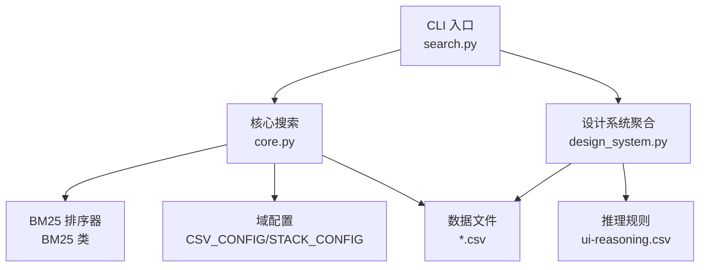
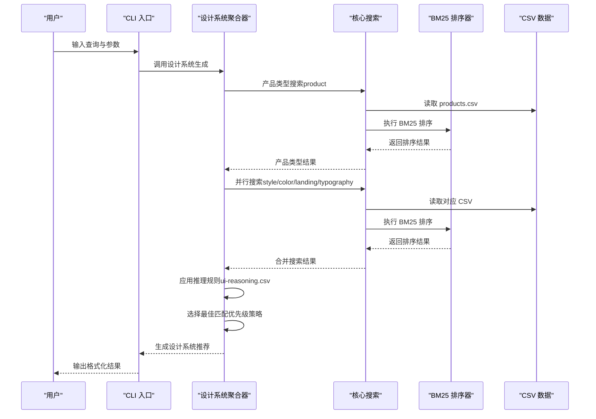
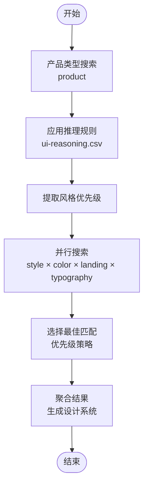
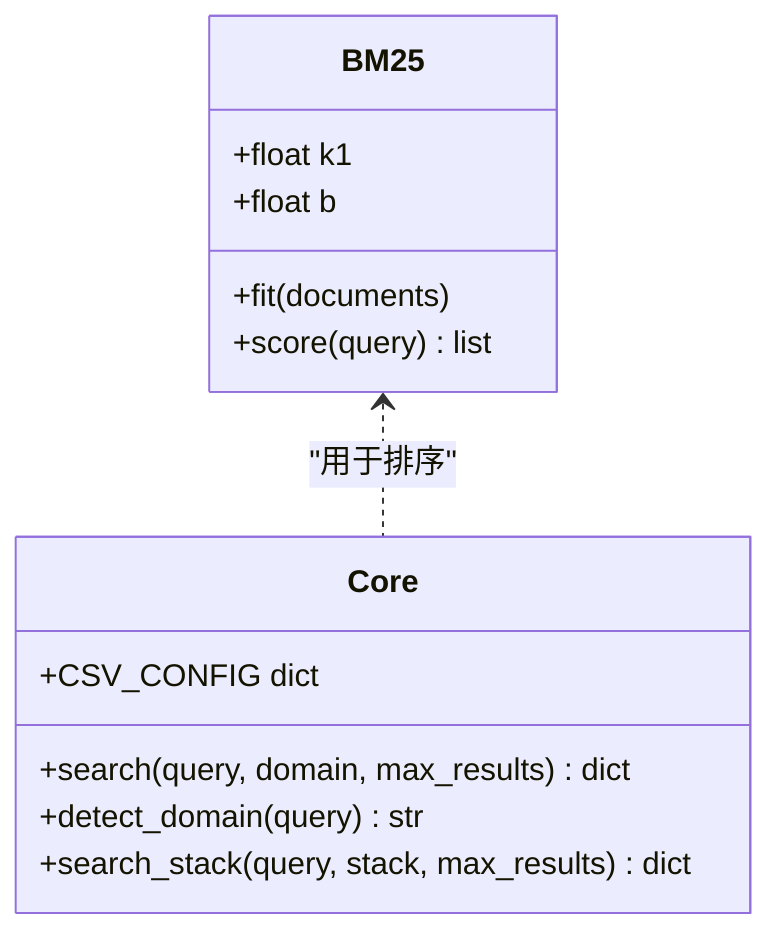
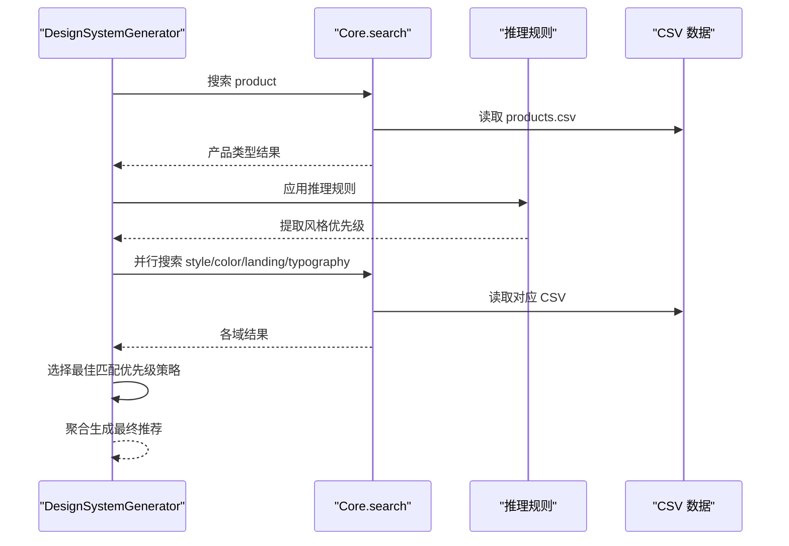
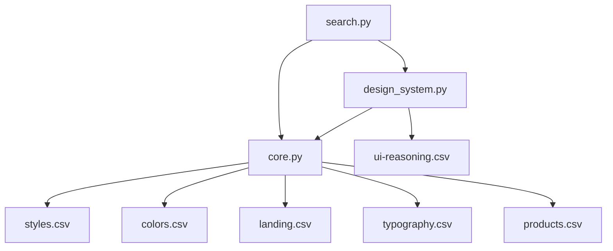

# 搜索引擎架构

<cite>
**本文档引用的文件**
- [search.py](file://ui-ux-pro-max-skill/skills/ui-ux-pro-max/scripts/search.py)
- [core.py](file://ui-ux-pro-max-skill/skills/ui-ux-pro-max/scripts/core.py)
- [design_system.py](file://ui-ux-pro-max-skill/skills/ui-ux-pro-max/scripts/design_system.py)
- [ui-reasoning.csv](file://ui-ux-pro-max-skill/skills/ui-ux-pro-max/data/ui-reasoning.csv)
- [styles.csv](file://ui-ux-pro-max-skill/skills/ui-ux-pro-max/data/styles.csv)
- [colors.csv](file://ui-ux-pro-max-skill/skills/ui-ux-pro-max/data/colors.csv)
- [landing.csv](file://ui-ux-pro-max-skill/skills/ui-ux-pro-max/data/landing.csv)
- [typography.csv](file://ui-ux-pro-max-skill/skills/ui-ux-pro-max/data/typography.csv)
- [products.csv](file://ui-ux-pro-max-skill/skills/ui-ux-pro-max/data/products.csv)
</cite>

## 目录
1. [简介](#简介)
2. [项目结构](#项目结构)
3. [核心组件](#核心组件)
4. [架构总览](#架构总览)
5. [详细组件分析](#详细组件分析)
6. [依赖关系分析](#依赖关系分析)
7. [性能考虑](#性能考虑)
8. [故障排除指南](#故障排除指南)
9. [结论](#结论)
10. [附录](#附录)

## 简介
本项目是一个基于 BM25 的 UI/UX 设计搜索与推荐系统，支持多域并行搜索与智能聚合。其核心目标是通过“产品类型搜索 + 风格推荐搜索 + 颜色调色板搜索 + 着陆页模式搜索 + 字体搭配搜索”的五路并行搜索机制，结合推理规则与优先级策略，生成可落地的设计系统建议。系统采用 CSV 数据驱动的配置化架构，具备良好的扩展性与可维护性。

## 项目结构
项目主要由三层组成：
- CLI 层：提供命令行入口，支持按域搜索、按栈搜索、设计系统生成与持久化。
- 核心层：实现 BM25 搜索算法、域配置、自动域检测与搜索执行。
- 数据层：以 CSV 文件形式存储各搜索域的规则与示例数据，支持推理规则与样式/色彩/着陆页/字体等数据。

图表来源
- [search.py:1-115](file://ui-ux-pro-max-skill/skills/ui-ux-pro-max/scripts/search.py#L1-L115)
- [core.py:1-263](file://ui-ux-pro-max-skill/skills/ui-ux-pro-max/scripts/core.py#L1-L263)
- [design_system.py:1-263](file://ui-ux-pro-max-skill/skills/ui-ux-pro-max/scripts/design_system.py#L1-L263)

章节来源
- [search.py:1-115](file://ui-ux-pro-max-skill/skills/ui-ux-pro-max/scripts/search.py#L1-L115)
- [core.py:1-263](file://ui-ux-pro-max-skill/skills/ui-ux-pro-max/scripts/core.py#L1-L263)
- [design_system.py:1-263](file://ui-ux-pro-max-skill/skills/ui-ux-pro-max/scripts/design_system.py#L1-L263)

## 核心组件
- 命令行接口（CLI）：解析参数，路由到域搜索、栈搜索或设计系统生成，并格式化输出。
- 核心搜索模块（Core）：封装 BM25 排序器、域配置、自动域检测、CSV 加载与搜索执行。
- 设计系统聚合器（DesignSystemGenerator）：执行五路并行搜索，应用推理规则，选择最佳匹配并生成最终推荐。

章节来源
- [search.py:56-115](file://ui-ux-pro-max-skill/skills/ui-ux-pro-max/scripts/search.py#L56-L115)
- [core.py:104-263](file://ui-ux-pro-max-skill/skills/ui-ux-pro-max/scripts/core.py#L104-L263)
- [design_system.py:37-246](file://ui-ux-pro-max-skill/skills/ui-ux-pro-max/scripts/design_system.py#L37-L246)

## 架构总览
系统采用“命令行入口 → 核心搜索 → 数据文件”的分层架构。设计系统聚合器在核心搜索之上，负责多域并行搜索、推理规则应用与结果聚合。

图表来源
- [design_system.py:163-246](file://ui-ux-pro-max-skill/skills/ui-ux-pro-max/scripts/design_system.py#L163-L246)
- [core.py:221-263](file://ui-ux-pro-max-skill/skills/ui-ux-pro-max/scripts/core.py#L221-L263)
- [ui-reasoning.csv:1-163](file://ui-ux-pro-max-skill/skills/ui-ux-pro-max/data/ui-reasoning.csv#L1-L163)

## 详细组件分析

### 组件 A：五路并行搜索机制
- 产品类型搜索（product）：用于确定产品类别，作为后续风格与设计系统推荐的基础。
- 风格推荐搜索（style）：根据产品类别与推理规则，结合风格优先级进行搜索。
- 颜色调色板搜索（color）：返回与产品类别匹配的颜色方案。
- 着陆页模式搜索（landing）：返回适合该类别的着陆页布局与交互模式。
- 字体搭配搜索（typography）：返回与产品类别匹配的字体组合与排版建议。

图表来源
- [design_system.py:51-62](file://ui-ux-pro-max-skill/skills/ui-ux-pro-max/scripts/design_system.py#L51-L62)
- [design_system.py:163-196](file://ui-ux-pro-max-skill/skills/ui-ux-pro-max/scripts/design_system.py#L163-L196)
- [ui-reasoning.csv:1-163](file://ui-ux-pro-max-skill/skills/ui-ux-pro-max/data/ui-reasoning.csv#L1-L163)

章节来源
- [design_system.py:27-62](file://ui-ux-pro-max-skill/skills/ui-ux-pro-max/scripts/design_system.py#L27-L62)
- [design_system.py:163-246](file://ui-ux-pro-max-skill/skills/ui-ux-pro-max/scripts/design_system.py#L163-L246)

### 组件 B：BM25 排序器与搜索流程
- BM25 排序器：对文档集合进行词项分词、IDF 计算与评分排序。
- 核心搜索函数：加载 CSV、构建检索文档、执行 BM25 排序并返回前 N 条结果。
- 自动域检测：基于关键词统计，自动识别最相关的搜索域。

图表来源
- [core.py:104-170](file://ui-ux-pro-max-skill/skills/ui-ux-pro-max/scripts/core.py#L104-L170)
- [core.py:173-246](file://ui-ux-pro-max-skill/skills/ui-ux-pro-max/scripts/core.py#L173-L246)

章节来源
- [core.py:104-246](file://ui-ux-pro-max-skill/skills/ui-ux-pro-max/scripts/core.py#L104-L246)

### 组件 C：设计系统聚合器
- 多域搜索配置：定义每个域的最大结果数与搜索列。
- 推理规则应用：从 ui-reasoning.csv 中读取规则，生成风格优先级、色彩情绪、字体情绪等。
- 结果选择策略：基于风格优先级与关键字匹配度，选择最佳风格、颜色、字体与着陆页模式。
- 最终推荐生成：整合所有域的最佳结果，形成可落地的设计系统建议。

图表来源
- [design_system.py:27-62](file://ui-ux-pro-max-skill/skills/ui-ux-pro-max/scripts/design_system.py#L27-L62)
- [design_system.py:88-121](file://ui-ux-pro-max-skill/skills/ui-ux-pro-max/scripts/design_system.py#L88-L121)
- [design_system.py:122-158](file://ui-ux-pro-max-skill/skills/ui-ux-pro-max/scripts/design_system.py#L122-L158)
- [design_system.py:163-246](file://ui-ux-pro-max-skill/skills/ui-ux-pro-max/scripts/design_system.py#L163-L246)

章节来源
- [design_system.py:27-121](file://ui-ux-pro-max-skill/skills/ui-ux-pro-max/scripts/design_system.py#L27-L121)
- [design_system.py:122-246](file://ui-ux-pro-max-skill/skills/ui-ux-pro-max/scripts/design_system.py#L122-L246)

### 组件 D：搜索配置参数与查询优化策略
- 域配置（CSV_CONFIG）：定义每个域的 CSV 文件名、搜索列与输出列，确保检索时仅拼接相关字段。
- 自动域检测：通过关键词统计计算得分，选择最相关的域；若无匹配则回退到默认域。
- 查询优化：BM25 参数（k1、b）控制词频饱和与长度归一化；分词过滤短词，减少噪声。
- 结果限制：每域最大结果数可配置，避免结果过多影响性能与可读性。

章节来源
- [core.py:17-73](file://ui-ux-pro-max-skill/skills/ui-ux-pro-max/scripts/core.py#L17-L73)
- [core.py:198-225](file://ui-ux-pro-max-skill/skills/ui-ux-pro-max/scripts/core.py#L198-L225)
- [core.py:221-246](file://ui-ux-pro-max-skill/skills/ui-ux-pro-max/scripts/core.py#L221-L246)

### 组件 E：结果聚合算法
- 产品类型决定风格优先级：从产品类型中提取类别，映射到推理规则，得到风格优先级列表。
- 多域并行搜索：对 style、color、landing、typography 四个域并行执行搜索，提升整体响应速度。
- 优先级选择策略：对于风格，优先精确匹配风格名称，其次按关键字匹配度打分；其他域取第一条结果。
- 最终推荐：将风格效果与推理规则的关键效果合并，形成最终设计系统建议。

章节来源
- [design_system.py:163-196](file://ui-ux-pro-max-skill/skills/ui-ux-pro-max/scripts/design_system.py#L163-L196)
- [design_system.py:122-158](file://ui-ux-pro-max-skill/skills/ui-ux-pro-max/scripts/design_system.py#L122-L158)

### 组件 F：扩展新搜索域与自定义搜索逻辑
- 新增域步骤：
  1) 在 CSV_CONFIG 中添加新域的文件名、搜索列与输出列。
  2) 准备对应的 CSV 数据文件（如 data/new-domain.csv）。
  3) 在 SEARCH_CONFIG 中设置该域的最大结果数。
  4) 在设计系统聚合器中调用并行搜索时包含该域。
- 自定义搜索逻辑：
  - 可在 _multi_domain_search 中为特定域增加查询增强（如风格域加入优先关键词）。
  - 可在 _select_best_match 中调整优先级策略或打分规则。

章节来源
- [core.py:17-73](file://ui-ux-pro-max-skill/skills/ui-ux-pro-max/scripts/core.py#L17-L73)
- [design_system.py:51-62](file://ui-ux-pro-max-skill/skills/ui-ux-pro-max/scripts/design_system.py#L51-L62)
- [design_system.py:51-59](file://ui-ux-pro-max-skill/skills/ui-ux-pro-max/scripts/design_system.py#L51-L59)

## 依赖关系分析
- CLI 依赖 Core 与 DesignSystem 模块，负责参数解析与输出格式化。
- Core 依赖 CSV_CONFIG/STACK_CONFIG 与 CSV 文件，负责搜索执行与域检测。
- DesignSystem 依赖 Core 与推理规则 CSV，负责多域并行搜索与结果聚合。

图表来源
- [search.py:17-21](file://ui-ux-pro-max-skill/skills/ui-ux-pro-max/scripts/search.py#L17-L21)
- [core.py:17-73](file://ui-ux-pro-max-skill/skills/ui-ux-pro-max/scripts/core.py#L17-L73)
- [design_system.py:25-33](file://ui-ux-pro-max-skill/skills/ui-ux-pro-max/scripts/design_system.py#L25-L33)

章节来源
- [search.py:17-21](file://ui-ux-pro-max-skill/skills/ui-ux-pro-max/scripts/search.py#L17-L21)
- [core.py:17-73](file://ui-ux-pro-max-skill/skills/ui-ux-pro-max/scripts/core.py#L17-L73)
- [design_system.py:25-33](file://ui-ux-pro-max-skill/skills/ui-ux-pro-max/scripts/design_system.py#L25-L33)

## 性能考虑
- 并发搜索：通过并行执行多个域的搜索请求，显著降低总体延迟。
- BM25 参数调优：合理设置 k1、b，平衡词频饱和与文档长度归一化，提升排序质量。
- 分词与过滤：统一的分词策略与短词过滤，减少无效匹配，提高检索效率。
- 结果限制：每域最大结果数限制，避免超大结果集带来的内存与传输压力。
- 缓存机制：可在外部引入 Redis 或本地磁盘缓存，缓存热门查询与结果，减少重复计算。

## 故障排除指南
- 文件不存在错误：当 CSV 文件缺失时，搜索函数会返回错误信息，需检查文件路径与命名。
- 域配置错误：若新增域未正确配置 CSV_CONFIG，会导致搜索失败，需核对文件名与列名。
- 推理规则缺失：若产品类别未命中推理规则，系统将使用默认规则，可能影响风格优先级，需完善 ui-reasoning.csv。
- 输出格式问题：CLI 支持 Markdown 与 ASCII 两种输出格式，可根据终端环境选择合适格式。

章节来源
- [core.py:229-231](file://ui-ux-pro-max-skill/skills/ui-ux-pro-max/scripts/core.py#L229-L231)
- [core.py:245-251](file://ui-ux-pro-max-skill/skills/ui-ux-pro-max/scripts/core.py#L245-L251)
- [design_system.py:88-121](file://ui-ux-pro-max-skill/skills/ui-ux-pro-max/scripts/design_system.py#L88-L121)

## 结论
本搜索引擎架构通过五路并行搜索与推理规则融合，实现了从产品类型到风格、色彩、着陆页与字体的全链路设计系统推荐。其模块化设计便于扩展新域与定制搜索逻辑，同时具备良好的性能与可维护性。建议在生产环境中引入缓存与监控，持续优化 BM25 参数与域配置，以进一步提升用户体验与系统稳定性。

## 附录
- 示例数据文件位置：
  - [ui-reasoning.csv](file://ui-ux-pro-max-skill/skills/ui-ux-pro-max/data/ui-reasoning.csv)
  - [styles.csv](file://ui-ux-pro-max-skill/skills/ui-ux-pro-max/data/styles.csv)
  - [colors.csv](file://ui-ux-pro-max-skill/skills/ui-ux-pro-max/data/colors.csv)
  - [landing.csv](file://ui-ux-pro-max-skill/skills/ui-ux-pro-max/data/landing.csv)
  - [typography.csv](file://ui-ux-pro-max-skill/skills/ui-ux-pro-max/data/typography.csv)
  - [products.csv](file://ui-ux-pro-max-skill/skills/ui-ux-pro-max/data/products.csv)