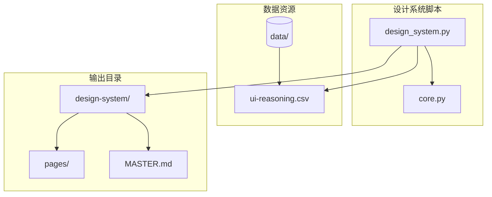
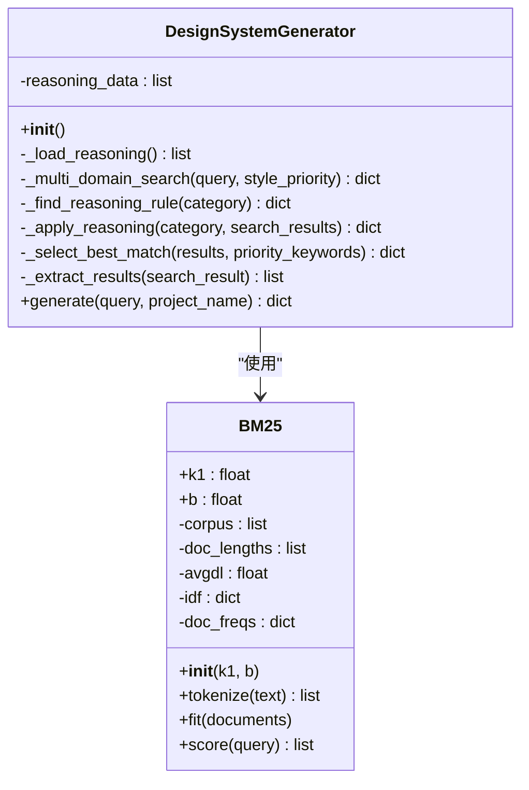
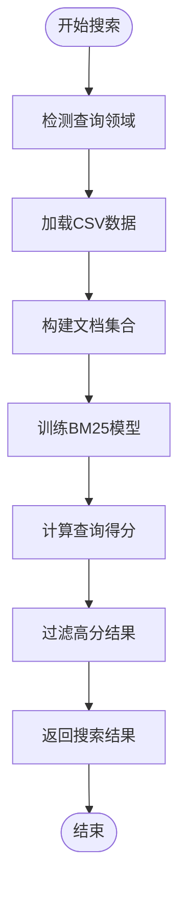
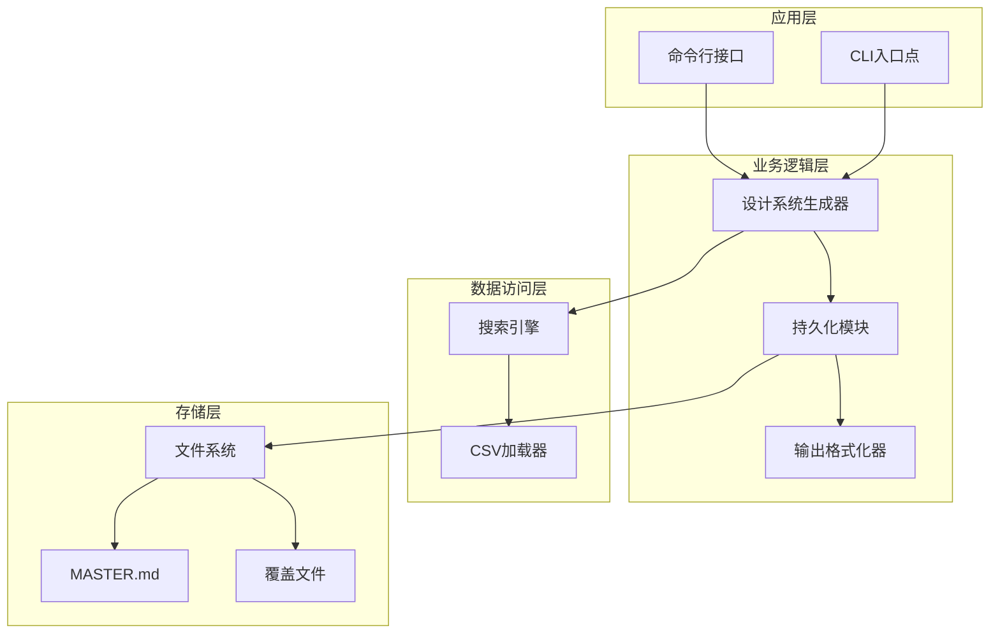
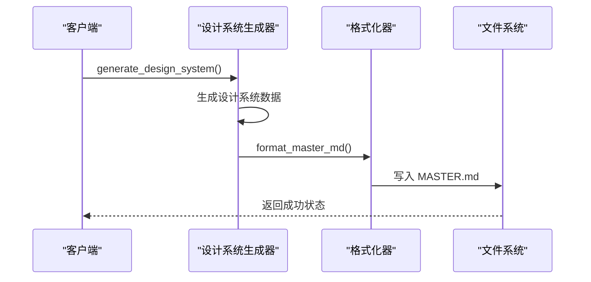
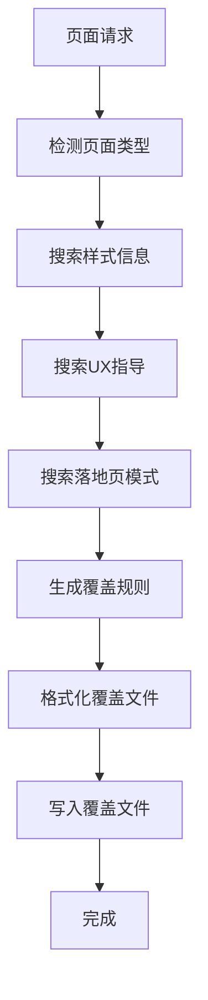
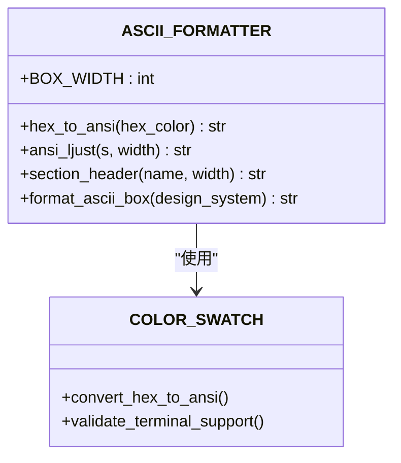
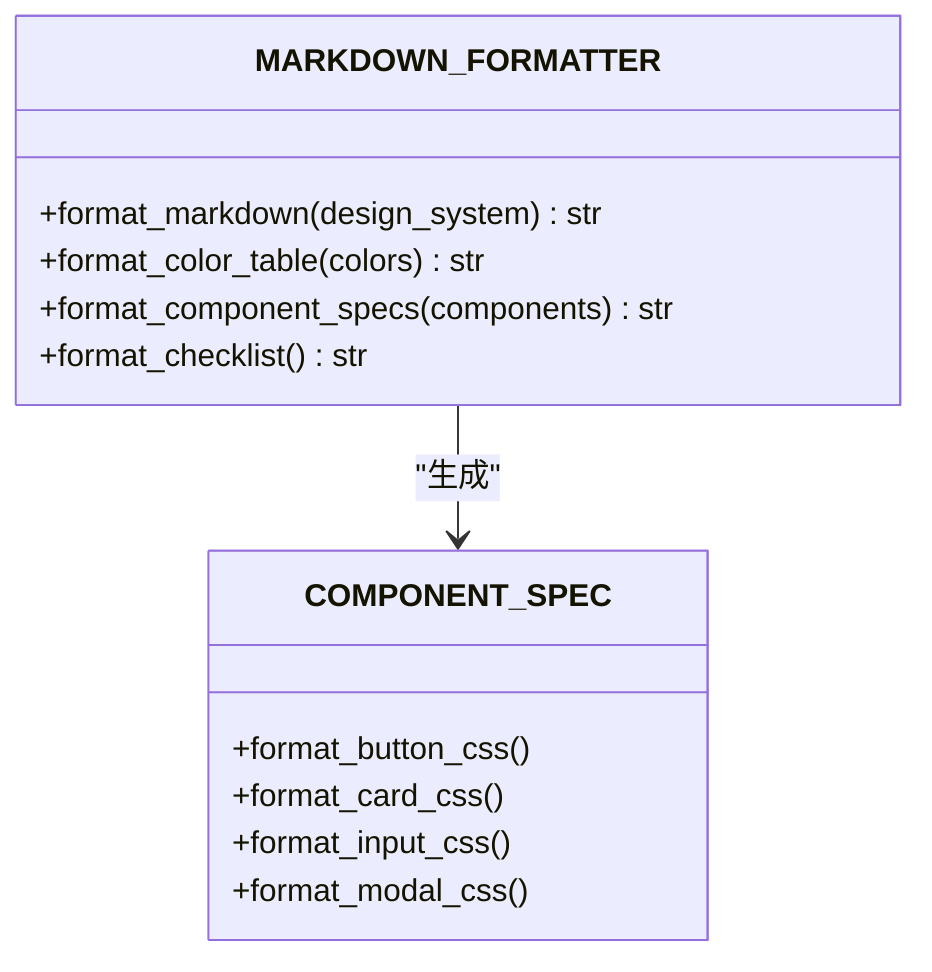
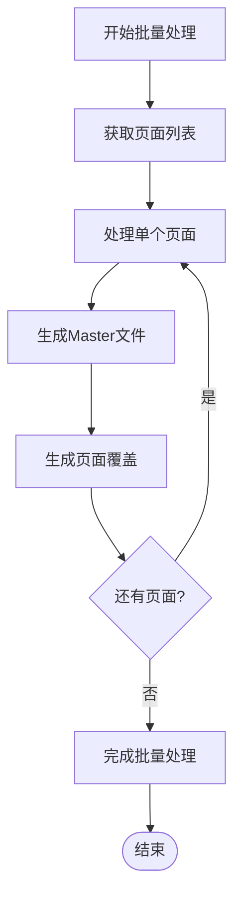
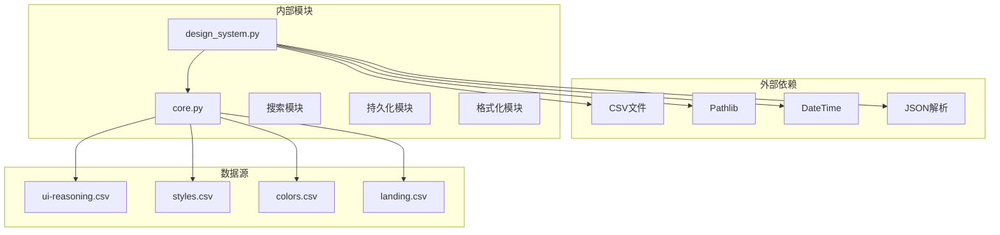

# 数据持久化系统

<cite>
**本文档引用的文件**
- [design_system.py](file://ui-ux-pro-max-skill/src/ui-ux-pro-max/scripts/design_system.py)
- [design_system.py](file://ui-ux-pro-max-skill/cli/assets/scripts/design_system.py)
- [core.py](file://ui-ux-pro-max-skill/src/ui-ux-pro-max/scripts/core.py)
- [ui-reasoning.csv](file://ui-ux-pro-max-skill/cli/assets/data/ui-reasoning.csv)
- [README.md](file://awesome-design-md/README.md)
</cite>

## 目录
1. [引言](#引言)
2. [项目结构](#项目结构)
3. [核心组件](#核心组件)
4. [架构概览](#架构概览)
5. [详细组件分析](#详细组件分析)
6. [依赖分析](#依赖分析)
7. [性能考虑](#性能考虑)
8. [故障排除指南](#故障排除指南)
9. [结论](#结论)
10. [附录](#附录)

## 引言

本文件针对数据持久化系统进行深入技术文档编写，重点阐述Master + Overrides（主文件 + 覆盖）模式的设计理念、文件组织结构和覆盖机制实现。该系统通过将设计系统推荐结果持久化到本地文件，采用层次化的覆盖逻辑，确保在不同页面或场景下能够灵活地覆盖默认规则。

系统的核心特性包括：
- Master + Overrides 模式：通过 MASTER.md 定义全局规则，按页面生成覆盖文件实现差异化定制
- 文件组织规范：统一的目录结构和命名约定，便于版本管理和团队协作
- 智能覆盖生成：基于搜索结果自动推导页面特定的布局、间距、排版和颜色等覆盖规则
- 扩展性设计：支持新增输出格式和自定义存储策略

## 项目结构

数据持久化系统主要位于 `ui-ux-pro-max-skill` 项目中，核心文件组织如下：



**图表来源**
- [design_system.py:1-1158](file://ui-ux-pro-max-skill/src/ui-ux-pro-max/scripts/design_system.py#L1-L1158)
- [core.py:1-269](file://ui-ux-pro-max-skill/src/ui-ux-pro-max/scripts/core.py#L1-L269)

**章节来源**
- [design_system.py:1-1158](file://ui-ux-pro-max-skill/src/ui-ux-pro-max/scripts/design_system.py#L1-L1158)
- [core.py:1-269](file://ui-ux-pro-max-skill/src/ui-ux-pro-max/scripts/core.py#L1-L269)

## 核心组件

### 设计系统生成器（DesignSystemGenerator）

设计系统生成器是整个系统的核心组件，负责从多领域搜索结果中聚合并应用推理规则，生成完整的设计系统推荐。



**图表来源**
- [design_system.py:45-254](file://ui-ux-pro-max-skill/src/ui-ux-pro-max/scripts/design_system.py#L45-L254)
- [core.py:110-169](file://ui-ux-pro-max-skill/src/ui-ux-pro-max/scripts/core.py#L110-L169)

### 搜索引擎（BM25算法）

系统内置了基于BM25算法的搜索引擎，用于在CSV数据集中进行文本匹配和排序。



**图表来源**
- [core.py:179-246](file://ui-ux-pro-max-skill/src/ui-ux-pro-max/scripts/core.py#L179-L246)

**章节来源**
- [design_system.py:45-254](file://ui-ux-pro-max-skill/src/ui-ux-pro-max/scripts/design_system.py#L45-L254)
- [core.py:110-246](file://ui-ux-pro-max-skill/src/ui-ux-pro-max/scripts/core.py#L110-L246)

## 架构概览

系统采用分层架构设计，实现了清晰的关注点分离：



**图表来源**
- [design_system.py:539-566](file://ui-ux-pro-max-skill/src/ui-ux-pro-max/scripts/design_system.py#L539-L566)
- [core.py:227-246](file://ui-ux-pro-max-skill/src/ui-ux-pro-max/scripts/core.py#L227-L246)

## 详细组件分析

### Master + Overrides 模式实现

Master + Overrides 模式是本系统的核心设计理念，通过以下机制实现：

#### Master 文件生成

MASTER.md 文件作为全局规则的权威来源，包含所有通用的设计系统规则：



**图表来源**
- [design_system.py:569-618](file://ui-ux-pro-max-skill/src/ui-ux-pro-max/scripts/design_system.py#L569-L618)
- [design_system.py:621-892](file://ui-ux-pro-max-skill/src/ui-ux-pro-max/scripts/design_system.py#L621-L892)

#### 覆盖文件生成

页面特定的覆盖文件仅包含与 Master 不同的规则，实现最小化覆盖：



**图表来源**
- [design_system.py:895-1001](file://ui-ux-pro-max-skill/src/ui-ux-pro-max/scripts/design_system.py#L895-L1001)
- [design_system.py:1004-1107](file://ui-ux-pro-max-skill/src/ui-ux-pro-max/scripts/design_system.py#L1004-L1107)

**章节来源**
- [design_system.py:569-1107](file://ui-ux-pro-max-skill/src/ui-ux-pro-max/scripts/design_system.py#L569-L1107)

### 文件组织结构规范

系统遵循严格的文件组织规范，确保项目的可维护性和一致性：

#### 目录结构

```
design-system/
├── [项目名称]/
│   ├── MASTER.md                 # 主规则文件
│   └── pages/                    # 页面覆盖文件目录
│       ├── [页面名].md           # 页面特定覆盖
│       └── [页面名].md
└── [其他项目]/
    ├── MASTER.md
    └── pages/
```

#### 命名约定

- **项目目录**：使用项目名称的小写形式，空格替换为连字符
- **主文件**：`MASTER.md`，固定文件名
- **页面文件**：`[页面名].md`，页面名转换为小写并用连字符连接
- **输出目录**：`design-system/`，固定根目录

**章节来源**
- [design_system.py:582-618](file://ui-ux-pro-max-skill/src/ui-ux-pro-max/scripts/design_system.py#L582-L618)

### 输出格式定制

系统支持多种输出格式，满足不同的使用场景：

#### ASCII 箱线图格式

ASCII 格式提供终端友好的可视化输出，包含颜色方块和装饰边框：



**图表来源**
- [design_system.py:261-427](file://ui-ux-pro-max-skill/src/ui-ux-pro-max/scripts/design_system.py#L261-L427)

#### Markdown 格式

Markdown 格式提供标准的文档输出，适合在各种平台查看和分享：



**图表来源**
- [design_system.py:430-536](file://ui-ux-pro-max-skill/src/ui-ux-pro-max/scripts/design_system.py#L430-L536)

**章节来源**
- [design_system.py:261-536](file://ui-ux-pro-max-skill/src/ui-ux-pro-max/scripts/design_system.py#L261-L536)

### 批量处理功能

系统支持批量处理多个页面的设计系统生成：

#### 多页面处理流程



**图表来源**
- [design_system.py:539-566](file://ui-ux-pro-max-skill/src/ui-ux-pro-max/scripts/design_system.py#L539-L566)

**章节来源**
- [design_system.py:539-566](file://ui-ux-pro-max-skill/src/ui-ux-pro-max/scripts/design_system.py#L539-L566)

## 依赖分析

系统依赖关系清晰，各组件职责明确：



**图表来源**
- [design_system.py:16-30](file://ui-ux-pro-max-skill/src/ui-ux-pro-max/scripts/design_system.py#L16-L30)
- [core.py:13-73](file://ui-ux-pro-max-skill/src/ui-ux-pro-max/scripts/core.py#L13-L73)

**章节来源**
- [design_system.py:16-30](file://ui-ux-pro-max-skill/src/ui-ux-pro-max/scripts/design_system.py#L16-L30)
- [core.py:13-73](file://ui-ux-pro-max-skill/src/ui-ux-pro-max/scripts/core.py#L13-L73)

## 性能考虑

系统在设计时充分考虑了性能优化：

### 搜索性能优化

- **BM25算法**：高效的文本相似度计算，支持大规模数据集
- **索引预构建**：一次性构建文档索引，避免重复计算
- **结果缓存**：对常用查询结果进行缓存

### 内存管理

- **流式处理**：大文件处理时采用流式读取
- **及时释放**：处理完成后及时释放内存资源
- **增量写入**：文件写入采用增量方式，减少内存占用

### I/O 优化

- **批量写入**：多个文件同时写入，减少磁盘操作次数
- **编码优化**：统一使用UTF-8编码，避免编码转换开销
- **路径缓存**：文件路径缓存，减少路径解析时间

## 故障排除指南

### 常见问题及解决方案

#### 文件权限问题

当运行环境不支持某些文件权限设置时，系统会自动降级处理：

```python
# 权限降级处理示例
if process.platform !== 'win32':
    const mode = fs.statSync(tokenFile).mode & 0o777;
    assert.strictEqual(mode, 0o600, `.last-token mode should be 0600`);
```

#### 编码问题

系统自动检测并修复终端编码问题：

```python
# 终端编码处理
if sys.stdout.encoding and sys.stdout.encoding.lower() != 'utf-8':
    sys.stdout = io.TextIOWrapper(sys.stdout.buffer, encoding='utf-8')
```

#### 数据缺失处理

当CSV文件缺失或格式错误时，系统提供降级方案：

```python
# 数据加载降级
def _load_reasoning(self) -> list:
    filepath = DATA_DIR / REASONING_FILE
    if not filepath.exists():
        return []  # 返回空列表而非抛出异常
```

**章节来源**
- [design_system.py:25-30](file://ui-ux-pro-max-skill/src/ui-ux-pro-max/scripts/design_system.py#L25-L30)
- [core.py:51-58](file://ui-ux-pro-max-skill/src/ui-ux-pro-max/scripts/core.py#L51-L58)

## 结论

数据持久化系统通过Master + Overrides模式实现了设计系统规则的层次化管理，提供了灵活且可扩展的持久化解决方案。系统的主要优势包括：

1. **层次化规则管理**：通过Master文件定义全局规则，页面覆盖文件实现差异化定制
2. **自动化程度高**：基于搜索结果自动推导页面特定规则，减少手工配置
3. **格式多样化**：支持ASCII和Markdown等多种输出格式
4. **扩展性强**：易于添加新的输出格式和自定义存储策略
5. **性能优化**：采用BM25算法和缓存机制，确保高效运行

该系统为设计系统文档的生成和管理提供了完整的解决方案，适用于各种规模的项目和团队协作场景。

## 附录

### 配置选项参考

| 选项 | 类型 | 默认值 | 描述 |
|------|------|--------|------|
| `output_format` | string | "ascii" | 输出格式选择 |
| `persist` | boolean | False | 是否启用持久化 |
| `page` | string | None | 页面名称（用于覆盖） |
| `output_dir` | string | None | 输出目录（默认当前工作目录） |

### 扩展新输出格式步骤

1. 在格式化模块中添加新的格式化函数
2. 更新主入口点以支持新格式参数
3. 添加相应的测试用例
4. 更新文档和示例代码

### 自定义存储策略实现

1. 创建新的存储类，继承基础存储接口
2. 实现文件写入和读取方法
3. 添加错误处理和回滚机制
4. 集成到持久化模块中

**章节来源**
- [design_system.py:540-566](file://ui-ux-pro-max-skill/src/ui-ux-pro-max/scripts/design_system.py#L540-L566)