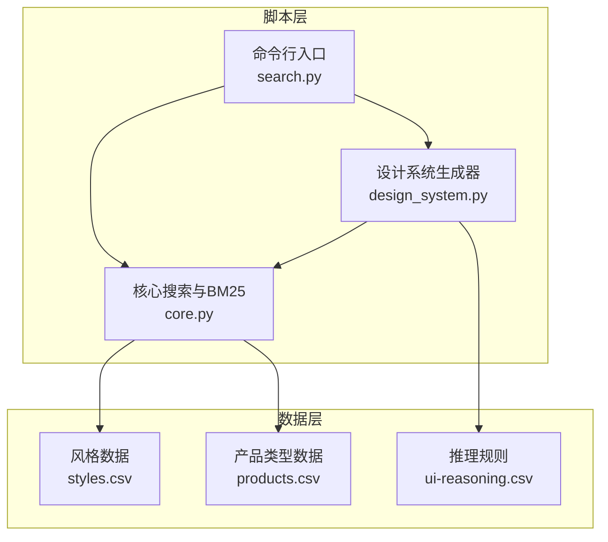
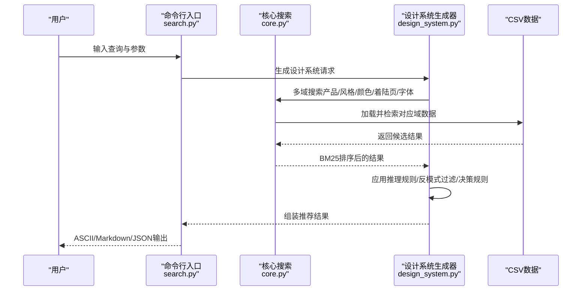
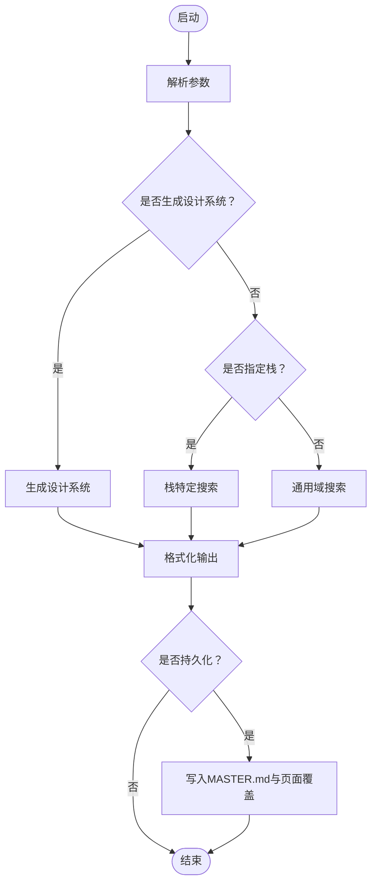
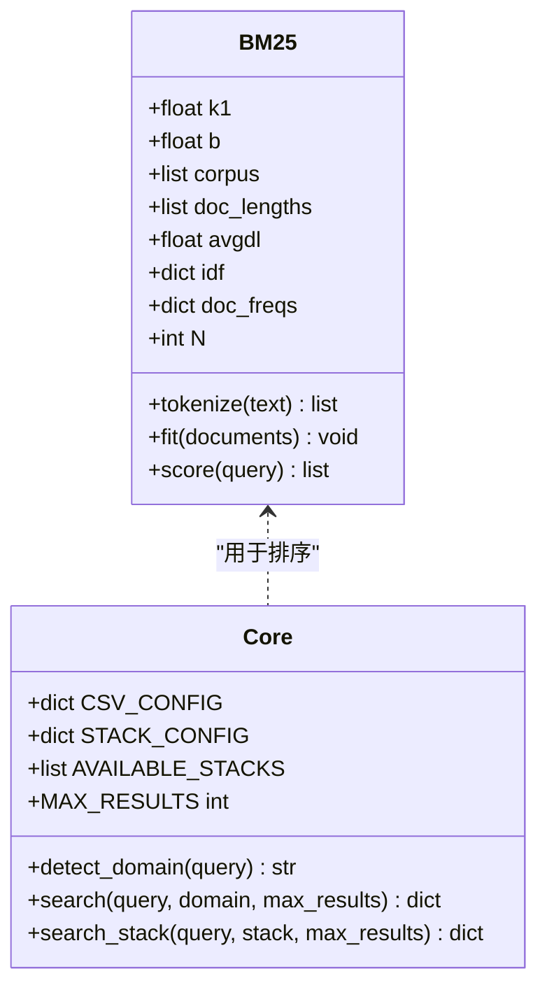
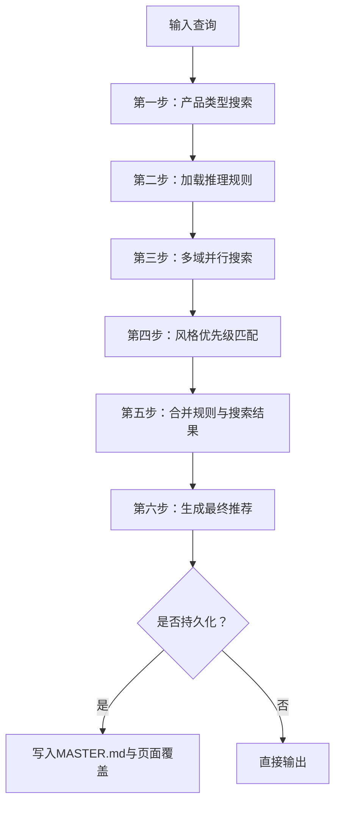
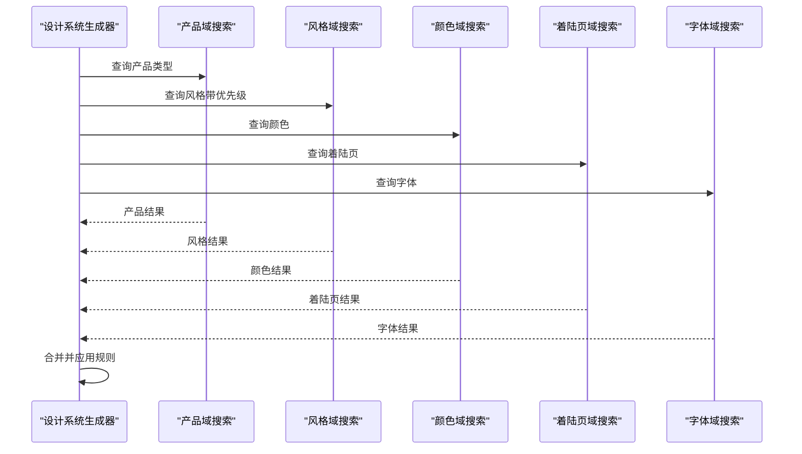
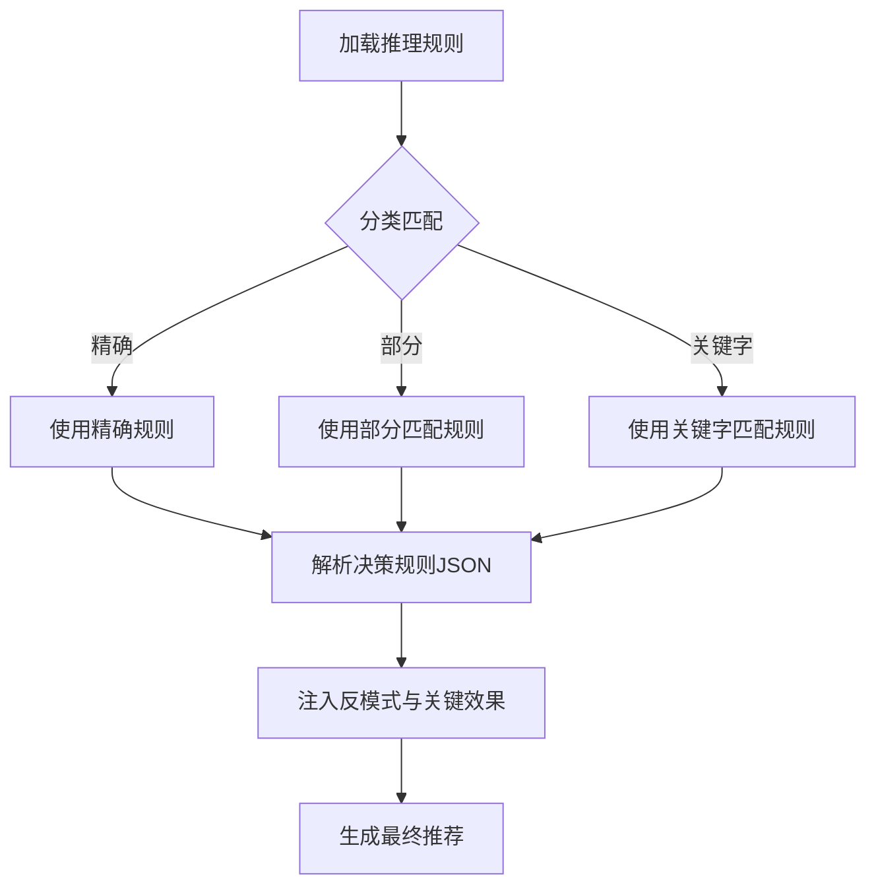
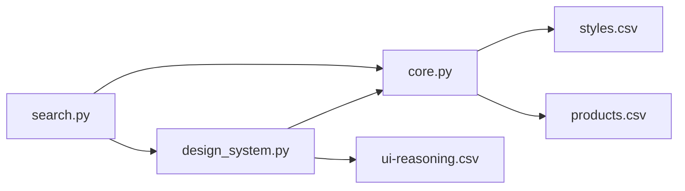

# 智能设计系统生成原理

<cite>
**本文档引用的文件**
- [search.py](file://ui-ux-pro-max-skill/skills/ui-ux-pro-max/scripts/search.py)
- [core.py](file://ui-ux-pro-max-skill/skills/ui-ux-pro-max/scripts/core.py)
- [design_system.py](file://ui-ux-pro-max-skill/skills/ui-ux-pro-max/scripts/design_system.py)
- [ui-reasoning.csv](file://ui-ux-pro-max-skill/skills/ui-ux-pro-max/data/ui-reasoning.csv)
- [styles.csv](file://ui-ux-pro-max-skill/skills/ui-ux-pro-max/data/styles.csv)
- [products.csv](file://ui-ux-pro-max-skill/skills/ui-ux-pro-max/data/products.csv)
</cite>

## 目录
1. [简介](#简介)
2. [项目结构](#项目结构)
3. [核心组件](#核心组件)
4. [架构总览](#架构总览)
5. [详细组件分析](#详细组件分析)
6. [依赖关系分析](#依赖关系分析)
7. [性能考虑](#性能考虑)
8. [故障排除指南](#故障排除指南)
9. [结论](#结论)
10. [附录](#附录)

## 简介
本文件面向智能设计系统生成原理的技术文档，聚焦于基于 Python 的推荐算法架构与实现细节。系统通过多域并行搜索（产品类型匹配、风格推荐、颜色调色板、着陆页模式、字体搭配）结合 BM25 排序算法，形成可扩展的设计系统推荐流水线，并通过行业推理规则驱动决策与反模式过滤，最终输出结构化的设计系统方案。

## 项目结构
该技能模块采用“脚本 + 数据”的清晰分层：
- 脚本层：负责命令行入口、搜索调度、设计系统生成与持久化
- 数据层：以 CSV 文件承载各领域的知识库（风格、产品、颜色、着陆页、字体等）
- 规则层：通过推理规则 CSV 驱动决策与反模式过滤



**图表来源**
- [search.py:1-115](file://ui-ux-pro-max-skill/skills/ui-ux-pro-max/scripts/search.py#L1-L115)
- [core.py:1-263](file://ui-ux-pro-max-skill/skills/ui-ux-pro-max/scripts/core.py#L1-L263)
- [design_system.py:1-800](file://ui-ux-pro-max-skill/skills/ui-ux-pro-max/scripts/design_system.py#L1-L800)
- [styles.csv:1-86](file://ui-ux-pro-max-skill/skills/ui-ux-pro-max/data/styles.csv#L1-L86)
- [products.csv:1-163](file://ui-ux-pro-max-skill/skills/ui-ux-pro-max/data/products.csv#L1-L163)
- [ui-reasoning.csv:1-163](file://ui-ux-pro-max-skill/skills/ui-ux-pro-max/data/ui-reasoning.csv#L1-L163)

**章节来源**
- [search.py:1-115](file://ui-ux-pro-max-skill/skills/ui-ux-pro-max/scripts/search.py#L1-L115)
- [core.py:1-263](file://ui-ux-pro-max-skill/skills/ui-ux-pro-max/scripts/core.py#L1-L263)
- [design_system.py:1-800](file://ui-ux-pro-max-skill/skills/ui-ux-pro-max/scripts/design_system.py#L1-L800)

## 核心组件
- 命令行入口与路由：解析参数、选择搜索域或生成设计系统、支持 JSON 输出与持久化
- 核心搜索引擎：封装 BM25 排序、自动域检测、跨域检索与结果聚合
- 设计系统生成器：多域并行搜索、推理规则应用、优先级选择、反模式过滤与决策规则处理
- 数据与规则：CSV 结构化知识库与推理规则，支撑风格、产品、颜色、着陆页、字体等多域

**章节来源**
- [search.py:56-115](file://ui-ux-pro-max-skill/skills/ui-ux-pro-max/scripts/search.py#L56-L115)
- [core.py:104-263](file://ui-ux-pro-max-skill/skills/ui-ux-pro-max/scripts/core.py#L104-L263)
- [design_system.py:37-246](file://ui-ux-pro-max-skill/skills/ui-ux-pro-max/scripts/design_system.py#L37-L246)

## 架构总览
系统采用“命令行入口 → 核心搜索 → 设计系统生成 → 输出/持久化”的流水线式架构。BM25 在每个域内对文本字段进行打分，随后由设计系统生成器综合多域结果与推理规则，输出最终推荐。



**图表来源**
- [search.py:56-115](file://ui-ux-pro-max-skill/skills/ui-ux-pro-max/scripts/search.py#L56-L115)
- [core.py:173-241](file://ui-ux-pro-max-skill/skills/ui-ux-pro-max/scripts/core.py#L173-L241)
- [design_system.py:163-246](file://ui-ux-pro-max-skill/skills/ui-ux-pro-max/scripts/design_system.py#L163-L246)

## 详细组件分析

### 命令行入口与路由
- 支持三种模式：设计系统生成、栈特定搜索、通用域搜索
- 自动编码处理与 UTF-8 输出兼容
- 支持 JSON 输出与 ASCII/Markdown 格式化
- 支持持久化（Master + Overrides 模式）



**图表来源**
- [search.py:56-115](file://ui-ux-pro-max-skill/skills/ui-ux-pro-max/scripts/search.py#L56-L115)

**章节来源**
- [search.py:1-115](file://ui-ux-pro-max-skill/skills/ui-ux-pro-max/scripts/search.py#L1-L115)

### 核心搜索与 BM25 排序
- BM25 类实现：分词、IDF 计算、文档长度归一、查询评分
- 文档构建：从配置的搜索列拼接文本作为文档
- 自动域检测：基于关键词权重选择最可能的搜索域
- 结果聚合：按最大结果数返回非零分数条目



**图表来源**
- [core.py:104-164](file://ui-ux-pro-max-skill/skills/ui-ux-pro-max/scripts/core.py#L104-L164)
- [core.py:173-263](file://ui-ux-pro-max-skill/skills/ui-ux-pro-max/scripts/core.py#L173-L263)

**章节来源**
- [core.py:104-164](file://ui-ux-pro-max-skill/skills/ui-ux-pro-max/scripts/core.py#L104-L164)
- [core.py:173-241](file://ui-ux-pro-max-skill/skills/ui-ux-pro-max/scripts/core.py#L173-L241)

### 设计系统生成器与推理规则
- 多域并行搜索：产品类型、风格、颜色、着陆页、字体，分别设置不同最大结果数
- 推理规则应用：从 ui-reasoning.csv 加载规则，按 UI 分类匹配，解析决策规则 JSON
- 优先级选择：根据风格优先级关键字在风格结果中挑选最佳匹配
- 反模式过滤与决策规则：将规则中的反模式与决策规则注入最终推荐
- 持久化：Master + Overrides 模式，支持项目级与页面级覆盖



**图表来源**
- [design_system.py:51-190](file://ui-ux-pro-max-skill/skills/ui-ux-pro-max/scripts/design_system.py#L51-L190)
- [design_system.py:163-246](file://ui-ux-pro-max-skill/skills/ui-ux-pro-max/scripts/design_system.py#L163-L246)

**章节来源**
- [design_system.py:37-246](file://ui-ux-pro-max-skill/skills/ui-ux-pro-max/scripts/design_system.py#L37-L246)
- [ui-reasoning.csv:1-163](file://ui-ux-pro-max-skill/skills/ui-ux-pro-max/data/ui-reasoning.csv#L1-L163)

### 数据模型与搜索域
- 风格域：包含风格类别、关键词、效果动画、适用场景等字段
- 产品域：给出产品类型、主推风格、着陆页模式、仪表盘风格与配色焦点
- 推理规则域：按 UI 分类给出推荐模式、风格优先级、色彩情绪、字体情绪、关键效果、反模式与严重性

```mermaid
erDiagram
STYLE {
string Style_Category
string Type
string Keywords
string Effects_Animation
string Best_For
string Light_Mode
string Dark_Mode
string Performance
string Accessibility
}
PRODUCT {
string Product_Type
string Keywords
string Primary_Style_Recommendation
string Landing_Page_Pattern
string Dashboard_Style
string Color_Palette_Focus
}
REASONING {
string UI_Category
string Recommended_Pattern
string Style_Priority
string Color_Mood
string Typography_Mood
string Key_Effects
string Decision_Rules
string Anti_Patterns
string Severity
}
```

**图表来源**
- [styles.csv:1-86](file://ui-ux-pro-max-skill/skills/ui-ux-pro-max/data/styles.csv#L1-L86)
- [products.csv:1-163](file://ui-ux-pro-max-skill/skills/ui-ux-pro-max/data/products.csv#L1-L163)
- [ui-reasoning.csv:1-163](file://ui-ux-pro-max-skill/skills/ui-ux-pro-max/data/ui-reasoning.csv#L1-L163)

**章节来源**
- [styles.csv:1-86](file://ui-ux-pro-max-skill/skills/ui-ux-pro-max/data/styles.csv#L1-L86)
- [products.csv:1-163](file://ui-ux-pro-max-skill/skills/ui-ux-pro-max/data/products.csv#L1-L163)
- [ui-reasoning.csv:1-163](file://ui-ux-pro-max-skill/skills/ui-ux-pro-max/data/ui-reasoning.csv#L1-L163)

### 并发与并行搜索机制
系统通过“多域并行搜索”实现 5 路并行：
- 产品类型匹配：确定目标领域与风格倾向
- 风格推荐：基于风格优先级与关键词匹配
- 颜色调色板：选择主色与辅助色组合
- 着陆页模式：确定页面布局与转化要点
- 字体搭配：选择标题与正文字体及情绪



**图表来源**
- [design_system.py:51-62](file://ui-ux-pro-max-skill/skills/ui-ux-pro-max/scripts/design_system.py#L51-L62)
- [design_system.py:176-190](file://ui-ux-pro-max-skill/skills/ui-ux-pro-max/scripts/design_system.py#L176-L190)

**章节来源**
- [design_system.py:51-62](file://ui-ux-pro-max-skill/skills/ui-ux-pro-max/scripts/design_system.py#L51-L62)
- [design_system.py:176-190](file://ui-ux-pro-max-skill/skills/ui-ux-pro-max/scripts/design_system.py#L176-L190)

### 决策规则与反模式过滤
- 推理规则加载：从 ui-reasoning.csv 读取，支持精确匹配、部分匹配与关键字匹配
- 决策规则解析：JSON 字符串解析为字典，作为后续决策依据
- 反模式过滤：将规则中的反模式加入最终推荐的“避免”清单
- 严重性等级：用于指导实现优先级与风险控制



**图表来源**
- [design_system.py:64-121](file://ui-ux-pro-max-skill/skills/ui-ux-pro-max/scripts/design_system.py#L64-L121)

**章节来源**
- [design_system.py:64-121](file://ui-ux-pro-max-skill/skills/ui-ux-pro-max/scripts/design_system.py#L64-L121)
- [ui-reasoning.csv:1-163](file://ui-ux-pro-max-skill/skills/ui-ux-pro-max/data/ui-reasoning.csv#L1-L163)

### 扩展新推理规则与自定义搜索域
- 新增推理规则：在 ui-reasoning.csv 中添加一行，填写 UI 分类、推荐模式、风格优先级、色彩情绪、字体情绪、关键效果、决策规则 JSON、反模式与严重性
- 新增搜索域：在 core.py 的 CSV_CONFIG 中新增键值对，指定文件名、搜索列与输出列；在 design_system.py 的 SEARCH_CONFIG 中设置最大结果数
- 新增栈域：在 core.py 的 STACK_CONFIG 中新增键值对，指定文件路径；使用 search_stack 进行栈特定搜索

**章节来源**
- [core.py:17-92](file://ui-ux-pro-max-skill/skills/ui-ux-pro-max/scripts/core.py#L17-L92)
- [design_system.py:27-33](file://ui-ux-pro-max-skill/skills/ui-ux-pro-max/scripts/design_system.py#L27-L33)
- [ui-reasoning.csv:1-163](file://ui-ux-pro-max-skill/skills/ui-ux-pro-max/data/ui-reasoning.csv#L1-L163)

## 依赖关系分析
- 模块耦合：search.py 仅依赖 core.py 与 design_system.py；design_system.py 依赖 core.py 与 ui-reasoning.csv；core.py 依赖 CSV 数据文件
- 外部依赖：标准库（csv、re、pathlib、math、collections、argparse、json、io 等），无第三方库
- 循环依赖：未发现循环导入



**图表来源**
- [search.py:17-21](file://ui-ux-pro-max-skill/skills/ui-ux-pro-max/scripts/search.py#L17-L21)
- [core.py:7-14](file://ui-ux-pro-max-skill/skills/ui-ux-pro-max/scripts/core.py#L7-L14)
- [design_system.py:16-21](file://ui-ux-pro-max-skill/skills/ui-ux-pro-max/scripts/design_system.py#L16-L21)

**章节来源**
- [search.py:17-21](file://ui-ux-pro-max-skill/skills/ui-ux-pro-max/scripts/search.py#L17-L21)
- [core.py:7-14](file://ui-ux-pro-max-skill/skills/ui-ux-pro-max/scripts/core.py#L7-L14)
- [design_system.py:16-21](file://ui-ux-pro-max-skill/skills/ui-ux-pro-max/scripts/design_system.py#L16-L21)

## 性能考虑
- BM25 计算复杂度：对每个查询构建词频向量并计算 TF-IDF 分数，时间复杂度 O(N·M)，其中 N 为文档数，M 为查询词数
- 并发策略：多域并行搜索可利用 CPU 多核提升吞吐；建议在高并发场景下限制同时打开的 CSV 文件数量
- 内存管理：CSV 一次性读入内存，建议控制单次查询的数据规模；对超大数据集可考虑分页或外部索引
- I/O 优化：统一从 DATA_DIR 读取 CSV，减少路径拼接开销；输出前进行截断与格式化，降低大字段传输成本
- 编码与兼容：强制 UTF-8 输出，避免 Windows 控制台默认编码问题

**章节来源**
- [core.py:104-164](file://ui-ux-pro-max-skill/skills/ui-ux-pro-max/scripts/core.py#L104-L164)
- [search.py:23-27](file://ui-ux-pro-max-skill/skills/ui-ux-pro-max/scripts/search.py#L23-L27)

## 故障排除指南
- 文件不存在：当 CSV 文件缺失时，返回错误信息，检查 DATA_DIR 路径与文件名
- 未知栈：search_stack 返回可用栈列表，确认栈名称正确
- 输出乱码：确保控制台编码为 UTF-8，脚本已自动处理
- 结果为空：检查查询关键词是否与搜索列匹配；调整最大结果数或放宽条件
- 决策规则解析失败：检查 ui-reasoning.csv 中决策规则 JSON 格式

**章节来源**
- [core.py:229-251](file://ui-ux-pro-max-skill/skills/ui-ux-pro-max/scripts/core.py#L229-L251)
- [search.py:23-27](file://ui-ux-pro-max-skill/skills/ui-ux-pro-max/scripts/search.py#L23-L27)
- [design_system.py:105-109](file://ui-ux-pro-max-skill/skills/ui-ux-pro-max/scripts/design_system.py#L105-L109)

## 结论
该智能设计系统通过“多域并行搜索 + BM25 排序 + 推理规则 + 反模式过滤”的组合，实现了可扩展、可维护的设计系统推荐能力。其模块化设计便于新增搜索域与推理规则，同时具备良好的性能与可诊断性，适合在多种产品形态与平台中复用与演进。

## 附录
- 命令行参数参考
  - 域搜索：--domain/-d，--max-results/-n，--json
  - 栈搜索：--stack/-s，--max-results/-n，--json
  - 设计系统：--design-system/-ds，--project-name/-p，--format/-f，--persist/--page/--output-dir
- 搜索域与栈参考
  - 域：style、color、chart、landing、product、ux、typography、icons、react、web、google-fonts
  - 栈：react、nextjs、vue、svelte、astro、swiftui、react-native、flutter、nuxtjs、nuxt-ui、html-tailwind、shadcn、jetpack-compose、threejs、angular、laravel

**章节来源**
- [search.py:5-15](file://ui-ux-pro-max-skill/skills/ui-ux-pro-max/scripts/search.py#L5-L15)
- [core.py:17-92](file://ui-ux-pro-max-skill/skills/ui-ux-pro-max/scripts/core.py#L17-L92)