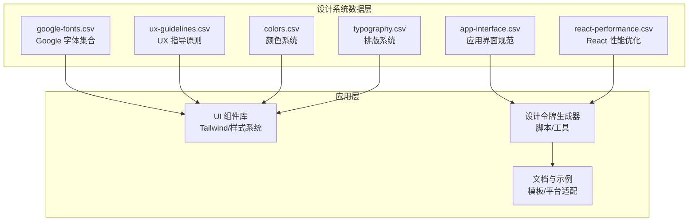
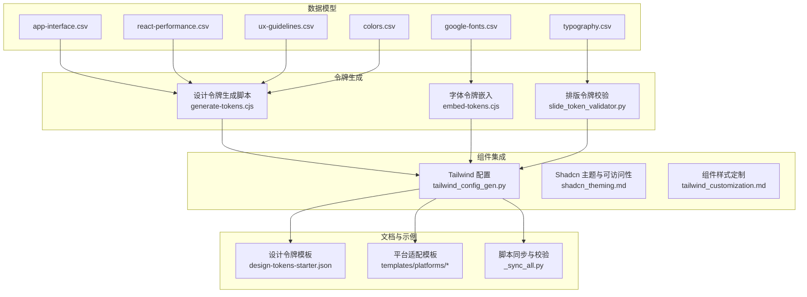
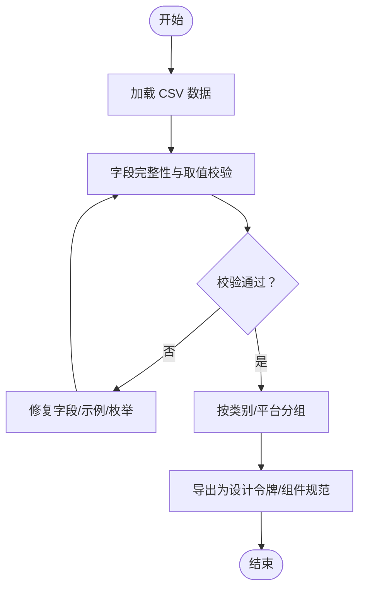
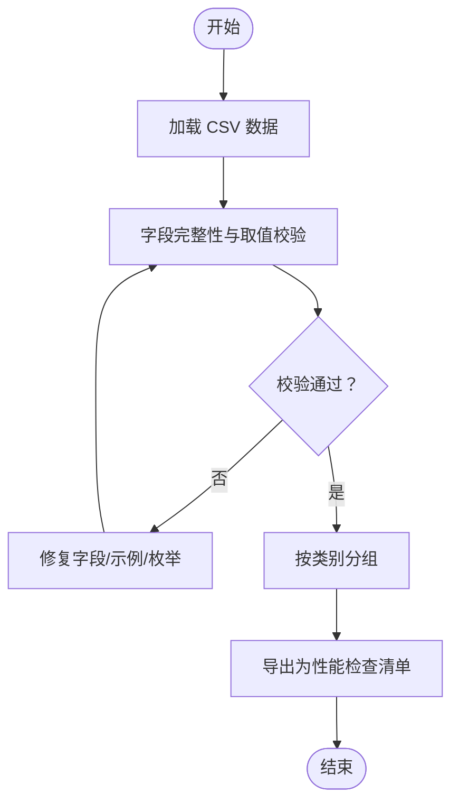
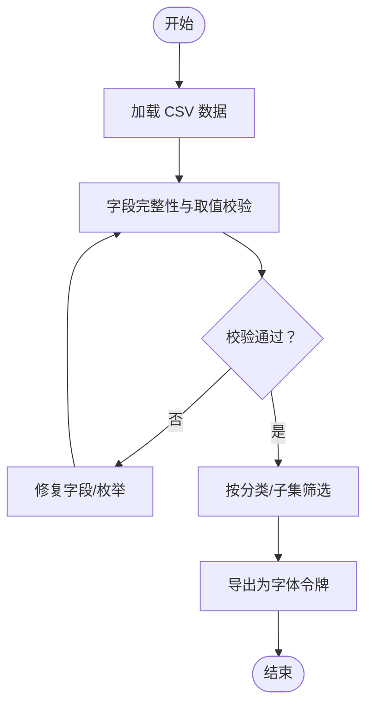
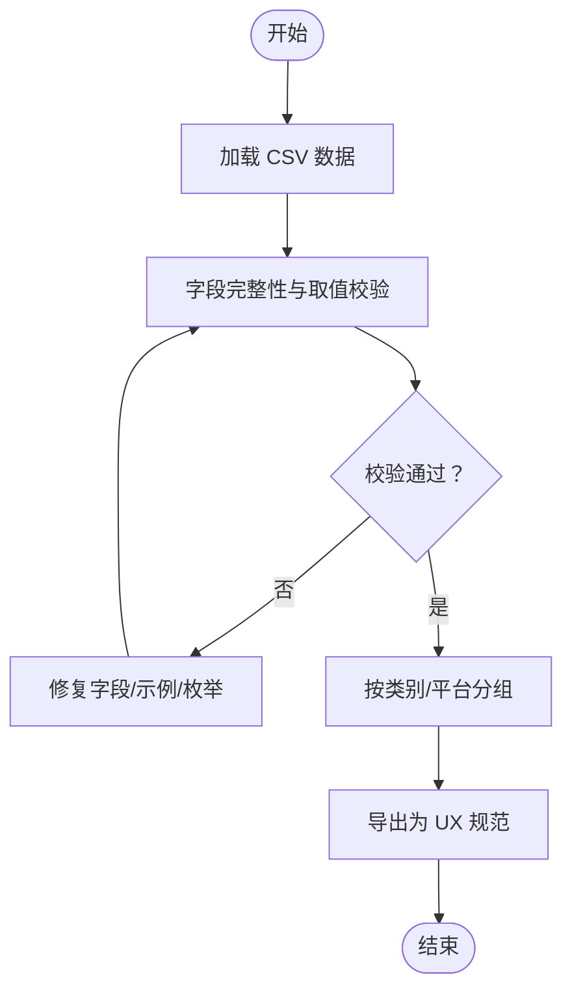
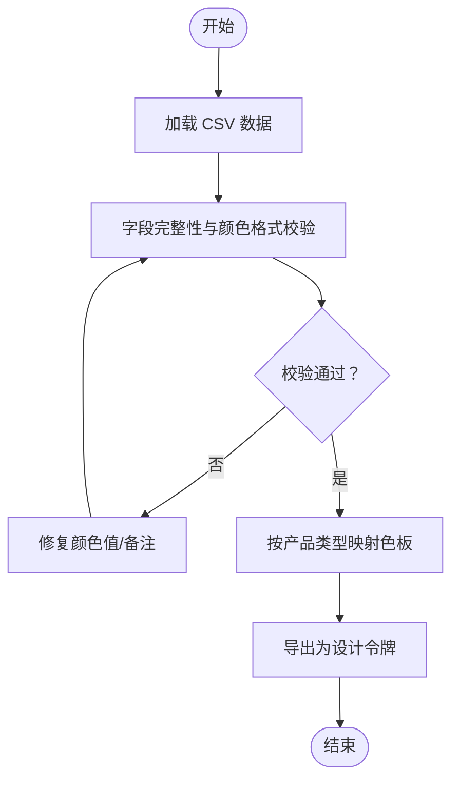
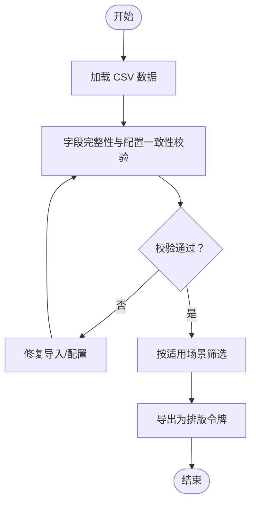
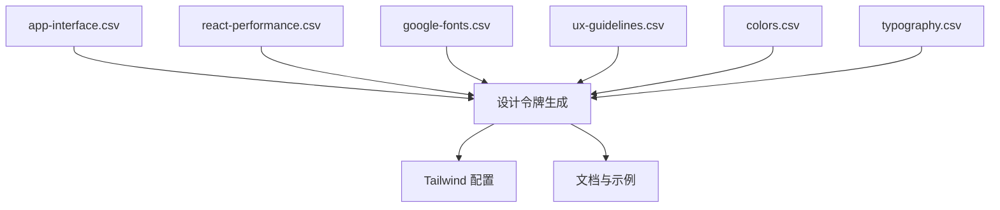

# 设计系统数据结构

<cite>
**本文档引用的文件**
- [app-interface.csv](file://ui-ux-pro-max-skill/skills/ui-ux-pro-max/data/app-interface.csv)
- [react-performance.csv](file://ui-ux-pro-max-skill/skills/ui-ux-pro-max/data/react-performance.csv)
- [google-fonts.csv](file://ui-ux-pro-max-skill/skills/ui-ux-pro-max/data/google-fonts.csv)
- [ux-guidelines.csv](file://ui-ux-pro-max-skill/skills/ui-ux-pro-max/data/ux-guidelines.csv)
- [colors.csv](file://ui-ux-pro-max-skill/skills/ui-ux-pro-max/data/colors.csv)
- [typography.csv](file://ui-ux-pro-max-skill/skills/ui-ux-pro-max/data/typography.csv)
</cite>

## 目录
1. [简介](#简介)
2. [项目结构](#项目结构)
3. [核心组件](#核心组件)
4. [架构总览](#架构总览)
5. [详细组件分析](#详细组件分析)
6. [依赖分析](#依赖分析)
7. [性能考虑](#性能考虑)
8. [故障排除指南](#故障排除指南)
9. [结论](#结论)
10. [附录](#附录)

## 简介
本文件为“设计系统数据结构”的技术文档，聚焦于设计系统中各类数据表的组织与关系，包括：
- CSV 数据文件的字段定义与数据类型
- 应用程序界面数据（可访问性、触摸交互、导航、状态管理等）
- UX 指导原则（动画、布局、交互、可访问性、性能等）
- React 性能优化策略（异步瀑布、打包体积、服务端/客户端缓存、重渲染控制、渲染性能等）
- Google 字体集合（字体族、分类、字重、子集、变量轴、设计师信息等）
- 颜色系统（产品类型到语义色板映射）
- 排版系统（字体配对、适用场景、CSS 引入与 Tailwind 配置）

文档旨在帮助开发者与设计师理解数据模型、建立数据验证规则、制定数据更新与版本管理策略，并提供导入导出、同步与质量保证的技术实现建议。

## 项目结构
设计系统数据主要位于技能包中的 data 目录，采用 CSV 文件形式组织，每个 CSV 对应一个主题域：
- 应用界面规范：app-interface.csv
- React 性能优化：react-performance.csv
- Google 字体集合：google-fonts.csv
- UX 指南：ux-guidelines.csv
- 颜色系统：colors.csv
- 排版系统：typography.csv

图表来源
- [app-interface.csv:1-31](file://ui-ux-pro-max-skill/skills/ui-ux-pro-max/data/app-interface.csv#L1-L31)
- [react-performance.csv:1-46](file://ui-ux-pro-max-skill/skills/ui-ux-pro-max/data/react-performance.csv#L1-L46)
- [google-fonts.csv:1-258](file://ui-ux-pro-max-skill/skills/ui-ux-pro-max/data/google-fonts.csv#L1-L258)
- [ux-guidelines.csv:1-100](file://ui-ux-pro-max-skill/skills/ui-ux-pro-max/data/ux-guidelines.csv#L1-L100)
- [colors.csv:1-162](file://ui-ux-pro-max-skill/skills/ui-ux-pro-max/data/colors.csv#L1-L162)
- [typography.csv:1-75](file://ui-ux-pro-max-skill/skills/ui-ux-pro-max/data/typography.csv#L1-L75)

章节来源
- [app-interface.csv:1-31](file://ui-ux-pro-max-skill/skills/ui-ux-pro-max/data/app-interface.csv#L1-L31)
- [react-performance.csv:1-46](file://ui-ux-pro-max-skill/skills/ui-ux-pro-max/data/react-performance.csv#L1-L46)
- [google-fonts.csv:1-258](file://ui-ux-pro-max-skill/skills/ui-ux-pro-max/data/google-fonts.csv#L1-L258)
- [ux-guidelines.csv:1-100](file://ui-ux-pro-max-skill/skills/ui-ux-pro-max/data/ux-guidelines.csv#L1-L100)
- [colors.csv:1-162](file://ui-ux-pro-max-skill/skills/ui-ux-pro-max/data/colors.csv#L1-L162)
- [typography.csv:1-75](file://ui-ux-pro-max-skill/skills/ui-ux-pro-max/data/typography.csv#L1-L75)

## 核心组件
本节概述各 CSV 的用途与关键字段，便于快速定位与使用。

- 应用界面规范（app-interface.csv）
  - 用途：定义跨平台（iOS/Android/React Native）界面最佳实践与反模式，覆盖可访问性、触摸目标、手势冲突、导航行为、状态保持、反馈机制、表单输入、动画与动效、排版支持、安全区域、主题对比度、避免仅手势操作等。
  - 关键字段：序号、类别、问题、关键词、平台、描述、正确做法、错误做法、代码示例（好/坏）、严重程度。
  - 示例路径：[app-interface.csv:1-31](file://ui-ux-pro-max-skill/skills/ui-ux-pro-max/data/app-interface.csv#L1-L31)

- React 性能优化（react-performance.csv）
  - 用途：提供 React/Next.js 场景下的性能优化策略，包括异步瀑布、并行化、服务端缓存、序列化边界、重渲染控制、渲染性能、JS 性能、高级钩子与稳定回调等。
  - 关键字段：序号、类别、问题、关键词、平台、描述、正确做法、错误做法、代码示例（好/坏）、严重程度。
  - 示例路径：[react-performance.csv:1-46](file://ui-ux-pro-max-skill/skills/ui-ux-pro-max/data/react-performance.csv#L1-L46)

- Google 字体集合（google-fonts.csv）
  - 用途：记录 Google Fonts 中可用字体的元数据，用于设计令牌生成与前端排版配置。
  - 关键字段：字体族、分类、笔画特征、分类、关键词、样式、变量轴、子集、设计师、流行度排名、趋势排名、是否 Noto、添加日期、最后修改、链接。
  - 示例路径：[google-fonts.csv:1-258](file://ui-ux-pro-max-skill/skills/ui-ux-pro-max/data/google-fonts.csv#L1-L258)

- UX 指南（ux-guidelines.csv）
  - 用途：Web/移动端 UX 最佳实践，涵盖导航、动画、布局、触摸、交互、可访问性、性能、表单、响应式、排版、反馈、内容与搜索等。
  - 关键字段：序号、类别、问题、平台、描述、正确做法、错误做法、代码示例（好/坏）、严重程度。
  - 示例路径：[ux-guidelines.csv:1-100](file://ui-ux-pro-max-skill/skills/ui-ux-pro-max/data/ux-guidelines.csv#L1-L100)

- 颜色系统（colors.csv）
  - 用途：按产品类型映射主色、次色、强调色、背景、前景、卡片、遮罩、边框、破坏性动作等语义色板，确保在不同主题下满足对比度与一致性。
  - 关键字段：序号、产品类型、主色、主色前景、次色、次色前景、强调色、强调色前景、背景、前景、卡片、卡片前景、遮罩、遮罩前景、边框、破坏性、破坏性前景、环形指示器、备注。
  - 示例路径：[colors.csv:1-162](file://ui-ux-pro-max-skill/skills/ui-ux-pro-max/data/colors.csv#L1-L162)

- 排版系统（typography.csv）
  - 用途：提供字体配对方案（标题/正文/显示/手写等），标注适用场景、Google Fonts 引用、CSS 导入与 Tailwind 配置建议。
  - 关键字段：序号、配对名称、类别、标题字体、正文字体、情感/风格关键词、适用场景、Google Fonts 链接、CSS 导入、Tailwind 配置、备注。
  - 示例路径：[typography.csv:1-75](file://ui-ux-pro-max-skill/skills/ui-ux-pro-max/data/typography.csv#L1-L75)

章节来源
- [app-interface.csv:1-31](file://ui-ux-pro-max-skill/skills/ui-ux-pro-max/data/app-interface.csv#L1-L31)
- [react-performance.csv:1-46](file://ui-ux-pro-max-skill/skills/ui-ux-pro-max/data/react-performance.csv#L1-L46)
- [google-fonts.csv:1-258](file://ui-ux-pro-max-skill/skills/ui-ux-pro-max/data/google-fonts.csv#L1-L258)
- [ux-guidelines.csv:1-100](file://ui-ux-pro-max-skill/skills/ui-ux-pro-max/data/ux-guidelines.csv#L1-L100)
- [colors.csv:1-162](file://ui-ux-pro-max-skill/skills/ui-ux-pro-max/data/colors.csv#L1-L162)
- [typography.csv:1-75](file://ui-ux-pro-max-skill/skills/ui-ux-pro-max/data/typography.csv#L1-L75)

## 架构总览
设计系统数据通过“数据模型 → 令牌生成 → 组件集成 → 文档与示例”的链路工作，形成从数据到界面的一致性保障。

图表来源
- [app-interface.csv:1-31](file://ui-ux-pro-max-skill/skills/ui-ux-pro-max/data/app-interface.csv#L1-L31)
- [react-performance.csv:1-46](file://ui-ux-pro-max-skill/skills/ui-ux-pro-max/data/react-performance.csv#L1-L46)
- [google-fonts.csv:1-258](file://ui-ux-pro-max-skill/skills/ui-ux-pro-max/data/google-fonts.csv#L1-L258)
- [ux-guidelines.csv:1-100](file://ui-ux-pro-max-skill/skills/ui-ux-pro-max/data/ux-guidelines.csv#L1-L100)
- [colors.csv:1-162](file://ui-ux-pro-max-skill/skills/ui-ux-pro-max/data/colors.csv#L1-L162)
- [typography.csv:1-75](file://ui-ux-pro-max-skill/skills/ui-ux-pro-max/data/typography.csv#L1-L75)

## 详细组件分析

### 应用界面规范（app-interface.csv）
- 数据模型
  - 字段类型与约束
    - 序号：整数，唯一标识
    - 类别：字符串（如 Accessibility、Touch、Navigation、State、Feedback、Forms、Performance、Animation、Typography、Safe Areas、Theming、Anti-Pattern）
    - 问题：字符串，简要描述
    - 平台：字符串（枚举值：iOS/Android/React Native 或 Web）
    - 描述：字符串，指导性说明
    - 正确做法/错误做法：字符串，建议与反例
    - 代码示例（好/坏）：字符串，示意代码片段路径或注释
    - 严重程度：字符串（Critical、High、Medium、Low）
  - 复杂度与查询
    - 常见查询：按类别筛选（如 Accessibility）、按平台过滤（如 iOS/Android）、按严重程度排序
    - 时间复杂度：线性扫描 O(N)，适合小规模 CSV；若需高频查询，建议构建索引（如按类别/平台的倒排索引）
- 数据验证规则
  - 必填字段：序号、类别、问题、平台、描述、正确做法、错误做法、严重程度
  - 取值范围：类别枚举、平台枚举、严重程度枚举
  - 内容一致性：代码示例字段应与平台匹配；“正确做法”与“错误做法”应成对出现
- 更新流程
  - 新增：在末尾追加，序号自增；校验枚举值与示例格式
  - 修改：仅允许修改描述、示例与严重程度；保持类别与平台不变
  - 删除：谨慎处理，必要时迁移至历史表
- 版本管理
  - 使用 Git 追踪变更；每次重大修订打标签（如 v1.2.3）
  - 变更日志：记录新增/修改/删除项摘要

图表来源
- [app-interface.csv:1-31](file://ui-ux-pro-max-skill/skills/ui-ux-pro-max/data/app-interface.csv#L1-L31)

章节来源
- [app-interface.csv:1-31](file://ui-ux-pro-max-skill/skills/ui-ux-pro-max/data/app-interface.csv#L1-L31)

### React 性能优化（react-performance.csv）
- 数据模型
  - 字段类型与约束
    - 序号：整数，唯一标识
    - 类别：字符串（Async Waterfall、Bundle Size、Server、Client、Rerender、Rendering、JS Perf、Advanced）
    - 问题：字符串，简要描述
    - 平台：字符串（React/Next.js）
    - 描述：字符串，指导性说明
    - 正确做法/错误做法：字符串，建议与反例
    - 代码示例（好/坏）：字符串，示意代码片段路径或注释
    - 严重程度：字符串（Critical、High、Medium、Low、Medium-High）
  - 复杂度与查询
    - 常见查询：按类别筛选（如 Async Waterfall）、按严重程度排序
    - 时间复杂度：线性扫描 O(N)
- 数据验证规则
  - 必填字段：序号、类别、问题、平台、描述、正确做法、错误做法、严重程度
  - 取值范围：类别枚举、平台枚举、严重程度枚举
  - 内容一致性：示例与类别/平台匹配
- 更新流程
  - 新增：在末尾追加，序号自增；校验枚举值与示例格式
  - 修改：仅允许修改描述、示例与严重程度
  - 删除：谨慎处理，必要时迁移至历史表
- 版本管理
  - 使用 Git 追踪变更；每次重大修订打标签

图表来源
- [react-performance.csv:1-46](file://ui-ux-pro-max-skill/skills/ui-ux-pro-max/data/react-performance.csv#L1-L46)

章节来源
- [react-performance.csv:1-46](file://ui-ux-pro-max-skill/skills/ui-ux-pro-max/data/react-performance.csv#L1-L46)

### Google 字体集合（google-fonts.csv）
- 数据模型
  - 字段类型与约束
    - Family：字符串，字体族名
    - Category：字符串，分类（如 Sans Serif、Serif、Display、Monospace、Handwriting）
    - Stroke：字符串，笔画特征
    - Styles：字符串，可用字重/样式
    - Subsets：字符串，字符子集
    - Designers：字符串，设计师
    - Popularity Rank/Trending Rank：整数
    - Is Noto：布尔字符串（Yes/No）
    - Date Added/Last Modified：日期
    - Google Fonts URL：字符串，链接
  - 复杂度与查询
    - 常见查询：按分类筛选、按子集过滤、按流行度排序、按是否 Noto 过滤
    - 时间复杂度：线性扫描 O(N)
- 数据验证规则
  - 必填字段：Family、Category、Styles、Subsets、Popularity Rank、Trending Rank、Google Fonts URL
  - 取值范围：Category 枚举、Is Noto 二值、Subsets 合法集合
- 更新流程
  - 新增：在末尾追加，校验字段完整性
  - 修改：仅允许修改描述性字段（如设计师、URL、排名）
  - 删除：谨慎处理
- 版本管理
  - 使用 Git 追踪变更；定期同步最新字体元数据

图表来源
- [google-fonts.csv:1-258](file://ui-ux-pro-max-skill/skills/ui-ux-pro-max/data/google-fonts.csv#L1-L258)

章节来源
- [google-fonts.csv:1-258](file://ui-ux-pro-max-skill/skills/ui-ux-pro-max/data/google-fonts.csv#L1-L258)

### UX 指南（ux-guidelines.csv）
- 数据模型
  - 字段类型与约束
    - 序号：整数，唯一标识
    - 类别：字符串（Navigation、Animation、Layout、Touch、Interaction、Accessibility、Performance、Forms、Responsive、Typography、Feedback、Content、Onboarding、Search、AI Interaction、Spatial UI、Sustainability）
    - 问题：字符串，简要描述
    - 平台：字符串（Web、All、Mobile）
    - 描述：字符串，指导性说明
    - 正确做法/错误做法：字符串，建议与反例
    - 代码示例（好/坏）：字符串，示意代码片段路径或注释
    - 严重程度：字符串（High、Medium、Low）
  - 复杂度与查询
    - 常见查询：按类别筛选、按平台过滤、按严重程度排序
    - 时间复杂度：线性扫描 O(N)
- 数据验证规则
  - 必填字段：序号、类别、问题、平台、描述、正确做法、错误做法、严重程度
  - 取值范围：类别枚举、平台枚举、严重程度枚举
- 更新流程
  - 新增：在末尾追加，序号自增；校验枚举值与示例格式
  - 修改：仅允许修改描述、示例与严重程度
  - 删除：谨慎处理
- 版本管理
  - 使用 Git 追踪变更；每次重大修订打标签

图表来源
- [ux-guidelines.csv:1-100](file://ui-ux-pro-max-skill/skills/ui-ux-pro-max/data/ux-guidelines.csv#L1-L100)

章节来源
- [ux-guidelines.csv:1-100](file://ui-ux-pro-max-skill/skills/ui-ux-pro-max/data/ux-guidelines.csv#L1-L100)

### 颜色系统（colors.csv）
- 数据模型
  - 字段类型与约束
    - 产品类型：字符串，如 SaaS、微 SaaS、电商、金融仪表盘等
    - 主色/次色/强调色/背景/前景/卡片/遮罩/边框/破坏性：十六进制颜色值
    - 主色前景/次色前景/遮罩前景/破坏性前景：十六进制颜色值
    - 环形指示器：十六进制颜色值
    - 备注：字符串，说明对比度与可访问性调整
  - 复杂度与查询
    - 常见查询：按产品类型检索对应色板
    - 时间复杂度：线性扫描 O(N)
- 数据验证规则
  - 必填字段：产品类型、主色、背景、前景、卡片、遮罩、边框、破坏性、环形指示器
  - 颜色值格式：十六进制（含 #）
  - 可访问性：备注中应包含对比度说明
- 更新流程
  - 新增：在末尾追加，校验颜色值格式与对比度说明
  - 修改：仅允许修改颜色值与备注
  - 删除：谨慎处理
- 版本管理
  - 使用 Git 追踪变更；每次重大修订打标签

图表来源
- [colors.csv:1-162](file://ui-ux-pro-max-skill/skills/ui-ux-pro-max/data/colors.csv#L1-L162)

章节来源
- [colors.csv:1-162](file://ui-ux-pro-max-skill/skills/ui-ux-pro-max/data/colors.csv#L1-L162)

### 排版系统（typography.csv）
- 数据模型
  - 字段类型与约束
    - 配对名称：字符串，如 Classic Elegant、Modern Professional、Tech Startup 等
    - 标题字体/正文字体：字符串，字体族名
    - 适用场景：字符串，描述适用品牌/产品类型
    - Google Fonts 链接：字符串，分享链接
    - CSS 导入：字符串，@import URL
    - Tailwind 配置：字符串，fontFamily 映射
    - 备注：字符串，说明搭配要点
  - 复杂度与查询
    - 常见查询：按适用场景筛选、按字体族检索
    - 时间复杂度：线性扫描 O(N)
- 数据验证规则
  - 必填字段：配对名称、标题字体、正文字体、适用场景、Google Fonts 链接、CSS 导入、Tailwind 配置
  - 内容一致性：CSS 导入与 Tailwind 配置应指向同一字体族
- 更新流程
  - 新增：在末尾追加，校验导入与配置一致性
  - 修改：仅允许修改描述性字段与配置
  - 删除：谨慎处理
- 版本管理
  - 使用 Git 追踪变更；每次重大修订打标签

图表来源
- [typography.csv:1-75](file://ui-ux-pro-max-skill/skills/ui-ux-pro-max/data/typography.csv#L1-L75)

章节来源
- [typography.csv:1-75](file://ui-ux-pro-max-skill/skills/ui-ux-pro-max/data/typography.csv#L1-L75)

## 依赖分析
- 组件耦合
  - app-interface.csv 与 react-performance.csv 共同构成“界面与性能”双维度规范
  - google-fonts.csv 与 typography.csv 协作，确保字体选择与配置一致
  - colors.csv 与 typography.csv 协作，确保色板与排版的视觉平衡
  - ux-guidelines.csv 作为通用 UX 指南，与上述数据共同影响组件设计
- 外部依赖
  - Google Fonts 提供字体资源与元数据
  - Tailwind CSS 与字体/颜色令牌集成
  - 脚本工具（generate-tokens.cjs、embed-tokens.cjs、tailwind_config_gen.py）负责数据到令牌的转换

图表来源
- [app-interface.csv:1-31](file://ui-ux-pro-max-skill/skills/ui-ux-pro-max/data/app-interface.csv#L1-L31)
- [react-performance.csv:1-46](file://ui-ux-pro-max-skill/skills/ui-ux-pro-max/data/react-performance.csv#L1-L46)
- [google-fonts.csv:1-258](file://ui-ux-pro-max-skill/skills/ui-ux-pro-max/data/google-fonts.csv#L1-L258)
- [ux-guidelines.csv:1-100](file://ui-ux-pro-max-skill/skills/ui-ux-pro-max/data/ux-guidelines.csv#L1-L100)
- [colors.csv:1-162](file://ui-ux-pro-max-skill/skills/ui-ux-pro-max/data/colors.csv#L1-L162)
- [typography.csv:1-75](file://ui-ux-pro-max-skill/skills/ui-ux-pro-max/data/typography.csv#L1-L75)

章节来源
- [app-interface.csv:1-31](file://ui-ux-pro-max-skill/skills/ui-ux-pro-max/data/app-interface.csv#L1-L31)
- [react-performance.csv:1-46](file://ui-ux-pro-max-skill/skills/ui-ux-pro-max/data/react-performance.csv#L1-L46)
- [google-fonts.csv:1-258](file://ui-ux-pro-max-skill/skills/ui-ux-pro-max/data/google-fonts.csv#L1-L258)
- [ux-guidelines.csv:1-100](file://ui-ux-pro-max-skill/skills/ui-ux-pro-max/data/ux-guidelines.csv#L1-L100)
- [colors.csv:1-162](file://ui-ux-pro-max-skill/skills/ui-ux-pro-max/data/colors.csv#L1-L162)
- [typography.csv:1-75](file://ui-ux-pro-max-skill/skills/ui-ux-pro-max/data/typography.csv#L1-L75)

## 性能考虑
- 数据读取与解析
  - 使用流式解析（streaming parser）以降低内存占用
  - 对大文件（如 google-fonts.csv）进行分页读取与增量处理
- 查询优化
  - 为常用查询（按类别、平台、严重程度）建立内存索引（哈希表/倒排索引）
  - 对频繁访问的字段（如 Family、Category、Subsets）预构建查找表
- 缓存策略
  - 将解析后的令牌缓存至内存或本地存储，减少重复计算
  - 对外部资源（Google Fonts）设置 TTL 缓存与失效策略
- 导入导出
  - 导出时按需裁剪字段，避免传输冗余数据
  - 支持增量导出（仅导出变更项）

## 故障排除指南
- 常见问题与处理
  - 字段缺失：自动补全默认值或抛出明确错误提示
  - 枚举不匹配：统一到标准枚举集合，保留原始值以便审计
  - 示例格式错误：校验代码片段路径与注释，修正后重新导入
  - 颜色值无效：校验十六进制格式，自动标准化
  - 配置不一致：校验 CSS 导入与 Tailwind 配置，强制对齐
- 质量保证
  - 单元测试：针对每类 CSV 的解析与校验逻辑编写测试用例
  - 集成测试：模拟令牌生成与 Tailwind 配置输出，验证一致性
  - 审计日志：记录每次导入/导出的时间、用户、变更详情

章节来源
- [app-interface.csv:1-31](file://ui-ux-pro-max-skill/skills/ui-ux-pro-max/data/app-interface.csv#L1-L31)
- [react-performance.csv:1-46](file://ui-ux-pro-max-skill/skills/ui-ux-pro-max/data/react-performance.csv#L1-L46)
- [google-fonts.csv:1-258](file://ui-ux-pro-max-skill/skills/ui-ux-pro-max/data/google-fonts.csv#L1-L258)
- [ux-guidelines.csv:1-100](file://ui-ux-pro-max-skill/skills/ui-ux-pro-max/data/ux-guidelines.csv#L1-L100)
- [colors.csv:1-162](file://ui-ux-pro-max-skill/skills/ui-ux-pro-max/data/colors.csv#L1-L162)
- [typography.csv:1-75](file://ui-ux-pro-max-skill/skills/ui-ux-pro-max/data/typography.csv#L1-L75)

## 结论
本设计系统数据结构文档明确了各类 CSV 的字段定义、数据类型与关系，提供了数据验证规则、更新流程与版本管理策略，并给出了导入导出、同步与质量保证的技术实现建议。通过将数据模型与令牌生成、组件集成、文档示例相结合，可有效提升设计与开发的一致性与效率。

## 附录
- 数据导入导出
  - 导入：读取 CSV → 校验字段与取值 → 构建索引 → 生成令牌 → 写入目标系统
  - 导出：读取令牌 → 生成 CSV → 校验一致性 → 输出文件
- 数据同步
  - 增量同步：基于时间戳或版本号识别变更
  - 批量同步：定期全量导出与导入
- 版本管理
  - Git 分支策略：主分支稳定，功能分支开发，发布标签标记
  - 变更追踪：记录字段变更、示例更新、枚举扩展