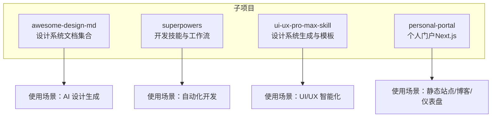
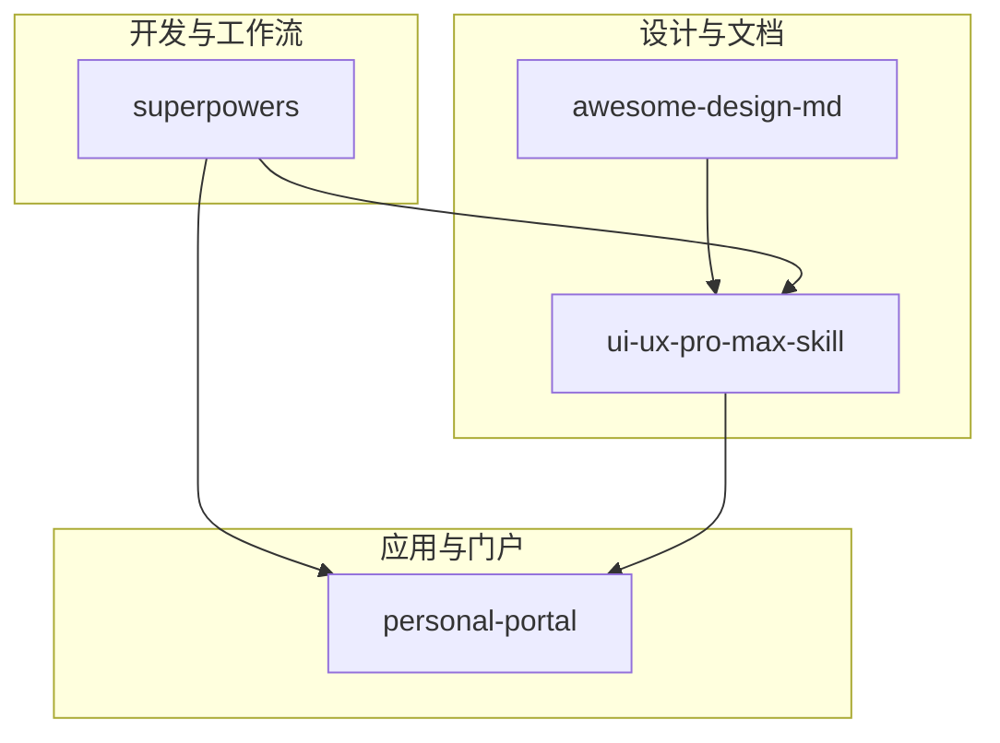
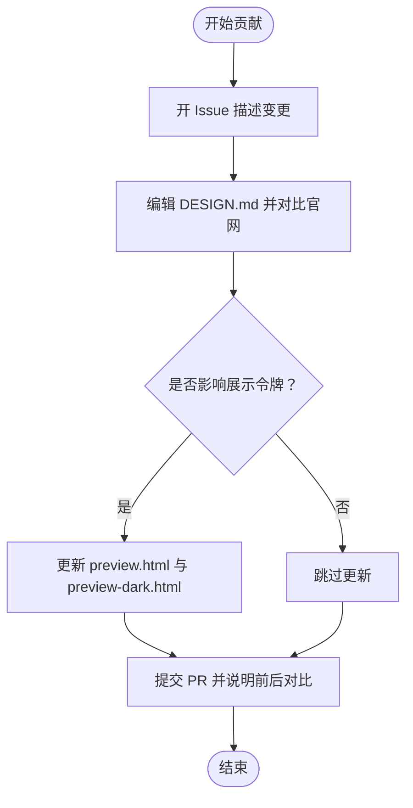
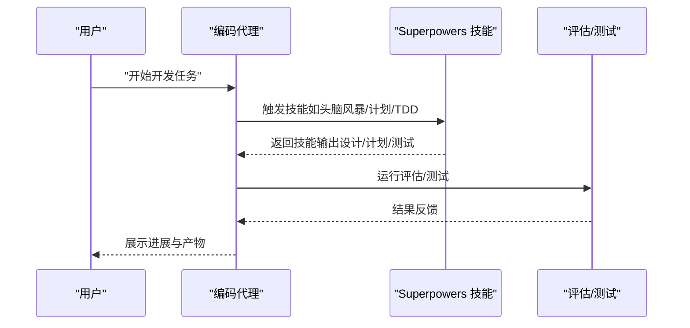
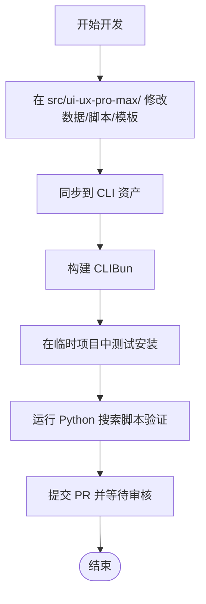
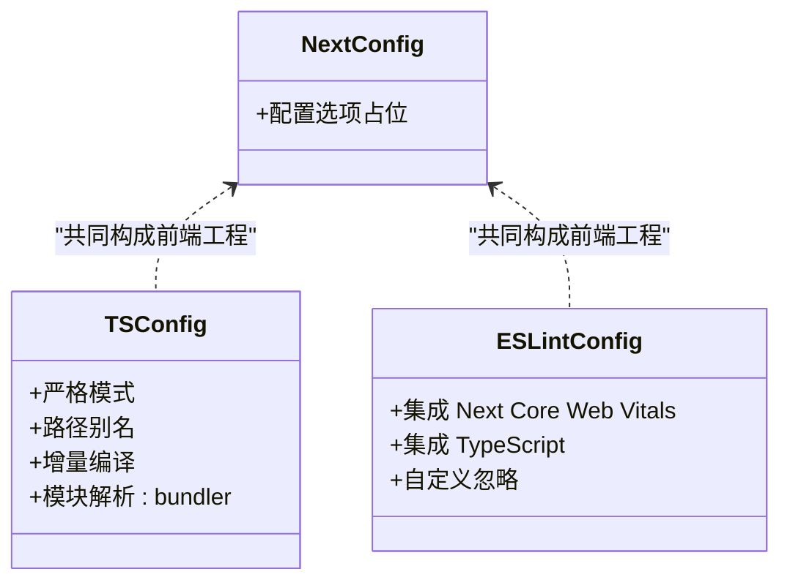
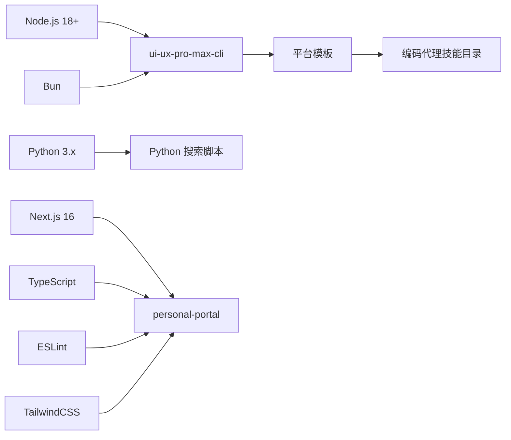
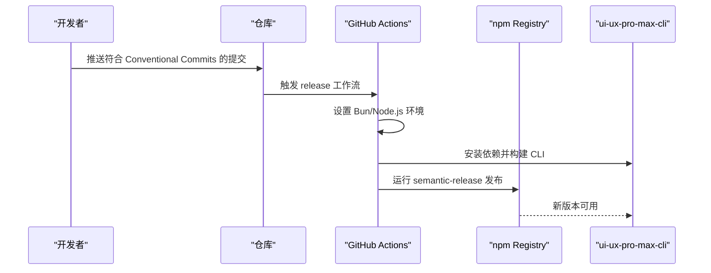

# 开发者指南

<cite>
**本文引用的文件**
- [README.md](file://README.md)
- [awesome-design-md/README.md](file://awesome-design-md/README.md)
- [awesome-design-md/CONTRIBUTING.md](file://awesome-design-md/CONTRIBUTING.md)
- [superpowers/README.md](file://superpowers/README.md)
- [superpowers/package.json](file://superpowers/package.json)
- [ui-ux-pro-max-skill/README.md](file://ui-ux-pro-max-skill/README.md)
- [ui-ux-pro-max-skill/CONTRIBUTING.md](file://ui-ux-pro-max-skill/CONTRIBUTING.md)
- [ui-ux-pro-max-skill/.github/workflows/release.yml](file://ui-ux-pro-max-skill/.github/workflows/release.yml)
- [personal-portal/package.json](file://personal-portal/package.json)
- [personal-portal/tsconfig.json](file://personal-portal/tsconfig.json)
- [personal-portal/eslint.config.mjs](file://personal-portal/eslint.config.mjs)
- [personal-portal/next.config.ts](file://personal-portal/next.config.ts)
</cite>

## 目录
1. [简介](#简介)
2. [项目结构](#项目结构)
3. [核心组件](#核心组件)
4. [架构总览](#架构总览)
5. [详细组件分析](#详细组件分析)
6. [依赖分析](#依赖分析)
7. [性能考虑](#性能考虑)
8. [故障排除指南](#故障排除指南)
9. [结论](#结论)
10. [附录](#附录)

## 简介
本指南面向希望参与本仓库多个子项目的开发者，覆盖环境搭建、项目结构、开发规范与部署流程。内容包括：
- Node.js 与 Python 环境配置、包管理与开发工具安装
- 四个子项目的代码结构、开发工作流与贡献指南
- 代码风格规范（TypeScript、ESLint）、Git 工作流
- 本地开发服务器启动、测试执行与生产部署
- CI/CD 流水线配置与性能监控建议

## 项目结构
仓库由四个主要子项目组成，每个子项目职责明确、边界清晰：
- awesome-design-md：收集并提供可直接用于 AI 设计生成的 DESIGN.md 文档集合
- superpowers：为多编码代理提供可组合技能与自动化开发方法论
- ui-ux-pro-max-skill：基于搜索与推理引擎的 UI/UX 设计系统生成与模板体系
- personal-portal：个人知识门户（Next.js 应用），包含博客、仪表盘与项目展示

**图表来源**
- [awesome-design-md/README.md:1-250](file://awesome-design-md/README.md#L1-L250)
- [superpowers/README.md:1-286](file://superpowers/README.md#L1-L286)
- [ui-ux-pro-max-skill/README.md:1-649](file://ui-ux-pro-max-skill/README.md#L1-L649)
- [personal-portal/package.json:1-32](file://personal-portal/package.json#L1-L32)

**章节来源**
- [awesome-design-md/README.md:1-250](file://awesome-design-md/README.md#L1-L250)
- [superpowers/README.md:1-286](file://superpowers/README.md#L1-L286)
- [ui-ux-pro-max-skill/README.md:1-649](file://ui-ux-pro-max-skill/README.md#L1-L649)
- [personal-portal/package.json:1-32](file://personal-portal/package.json#L1-L32)

## 核心组件
- awesome-design-md
  - 职责：提供可被 AI 读取的设计系统文档（DESIGN.md），覆盖 70+ 品牌与平台
  - 使用方式：复制 DESIGN.md 到项目根目录，或通过插件应用设计系统
- superpowers
  - 职责：提供 14 个可自动触发的开发技能（TDD、调试、计划、并行子代理等）
  - 集成：通过各编码代理的插件市场安装，支持会话钩子与跨平台兼容
- ui-ux-pro-max-skill
  - 职责：基于行业规则、风格、配色与字体的智能设计系统生成
  - 技术栈：Python 搜索脚本 + CLI 安装器，支持多框架栈（React、Vue、iOS、Android 等）
- personal-portal
  - 职责：个人博客、仪表盘与项目展示的 Next.js 应用
  - 技术栈：Next.js 16、TypeScript、ESLint、TailwindCSS

**章节来源**
- [awesome-design-md/README.md:27-250](file://awesome-design-md/README.md#L27-L250)
- [superpowers/README.md:1-286](file://superpowers/README.md#L1-L286)
- [ui-ux-pro-max-skill/README.md:1-649](file://ui-ux-pro-max-skill/README.md#L1-L649)
- [personal-portal/package.json:1-32](file://personal-portal/package.json#L1-L32)

## 架构总览
下图展示了四子项目的角色与交互关系，以及开发与发布路径。

**图表来源**
- [awesome-design-md/README.md:1-250](file://awesome-design-md/README.md#L1-L250)
- [superpowers/README.md:1-286](file://superpowers/README.md#L1-L286)
- [ui-ux-pro-max-skill/README.md:1-649](file://ui-ux-pro-max-skill/README.md#L1-L649)
- [personal-portal/package.json:1-32](file://personal-portal/package.json#L1-L32)

## 详细组件分析

### 组件一：awesome-design-md
- 项目定位：为 AI 设计与构建提供即插即用的设计系统文档
- 关键特性
  - 收录 70+ 品牌的 DESIGN.md，覆盖 AI 平台、开发者工具、后端/DevOps、SaaS、设计工具、金融科技、汽车与复古 Web 等领域
  - 提供预览页面（明暗主题）以直观展示颜色、字体、组件与布局
- 贡献指南
  - 改进现有 DESIGN.md：先开 Issue 讨论，修正错误值、缺失令牌或描述弱项，必要时更新预览页
  - 不接受直接提交 DESIGN.md 的 PR，以保证集合质量

**图表来源**
- [awesome-design-md/CONTRIBUTING.md:7-26](file://awesome-design-md/CONTRIBUTING.md#L7-L26)

**章节来源**
- [awesome-design-md/README.md:27-250](file://awesome-design-md/README.md#L27-L250)
- [awesome-design-md/CONTRIBUTING.md:1-26](file://awesome-design-md/CONTRIBUTING.md#L1-L26)

### 组件二：superpowers
- 项目定位：为编码代理提供可组合技能与自动化开发方法论
- 核心能力
  - 自动触发的 14 个技能：TDD、调试、头脑风暴、计划、并行子代理、审查、完成分支等
  - 与多编码代理集成（Claude Code、Antigravity、Codex、Cursor、Pi 等）
  - 会话钩子在 Windows 上需 Git Bash；技能可独立启用
- 贡献流程
  - 在 dev 分支开发，遵循 writing-skills 技能进行新技能编写与测试
  - 使用 evals/ 下的钻取评估工具与 tests/ 下的插件基础设施测试

**图表来源**
- [superpowers/README.md:200-286](file://superpowers/README.md#L200-L286)

**章节来源**
- [superpowers/README.md:1-286](file://superpowers/README.md#L1-L286)
- [superpowers/package.json:1-24](file://superpowers/package.json#L1-L24)

### 组件三：ui-ux-pro-max-skill
- 项目定位：AI 驱动的设计系统生成与模板体系
- 技术要点
  - Python 3.x 为搜索脚本与设计系统生成提供运行时
  - CLI（ui-ux-pro-max-cli）负责将模板与资产安装到各编码代理的技能目录
  - 支持 67 种 UI 风格、161 行业规则、161 色彩方案、57 字体组合、25 图表类型与 22 技术栈
- 开发与贡献
  - 所有数据与脚本修改集中在 src/ui-ux-pro-max/，再同步至 CLI 资产
  - 使用 Bun 构建 CLI，本地测试通过临时项目验证
  - 遵循 Conventional Commits 提交格式

**图表来源**
- [ui-ux-pro-max-skill/CONTRIBUTING.md:94-118](file://ui-ux-pro-max-skill/CONTRIBUTING.md#L94-L118)

**章节来源**
- [ui-ux-pro-max-skill/README.md:1-649](file://ui-ux-pro-max-skill/README.md#L1-L649)
- [ui-ux-pro-max-skill/CONTRIBUTING.md:1-182](file://ui-ux-pro-max-skill/CONTRIBUTING.md#L1-L182)

### 组件四：personal-portal（Next.js）
- 项目定位：个人博客、仪表盘与项目展示的全栈前端应用
- 技术栈
  - Next.js 16、TypeScript、ESLint、TailwindCSS
  - 包含 RSS、robots、sitemap 等 SEO 相关路由
- 开发与规范
  - TypeScript 配置严格模式、路径别名、增量编译与 bundler 解析
  - ESLint 集成 Next.js Core Web Vitals 与 TypeScript 规则，并自定义忽略范围
  - Next 配置留空扩展点，便于按需添加

**图表来源**
- [personal-portal/next.config.ts:1-8](file://personal-portal/next.config.ts#L1-L8)
- [personal-portal/tsconfig.json:1-35](file://personal-portal/tsconfig.json#L1-L35)
- [personal-portal/eslint.config.mjs:1-19](file://personal-portal/eslint.config.mjs#L1-L19)

**章节来源**
- [personal-portal/package.json:1-32](file://personal-portal/package.json#L1-L32)
- [personal-portal/tsconfig.json:1-35](file://personal-portal/tsconfig.json#L1-L35)
- [personal-portal/eslint.config.mjs:1-19](file://personal-portal/eslint.config.mjs#L1-L19)
- [personal-portal/next.config.ts:1-8](file://personal-portal/next.config.ts#L1-L8)

## 依赖分析
- awesome-design-md
  - 作为文档集合，无复杂运行时依赖；主要依赖于社区与 AI 代理的使用
- superpowers
  - 通过插件清单声明技能与扩展入口，依赖各编码代理的插件系统
- ui-ux-pro-max-skill
  - 运行时依赖 Python 3.x；CLI 依赖 Node.js 与 Bun；模板与资产通过 CLI 同步
- personal-portal
  - 依赖 Next.js 16、React 19、TypeScript、ESLint、TailwindCSS 及相关工具链

**图表来源**
- [ui-ux-pro-max-skill/README.md:349-366](file://ui-ux-pro-max-skill/README.md#L349-L366)
- [ui-ux-pro-max-skill/CONTRIBUTING.md:23-28](file://ui-ux-pro-max-skill/CONTRIBUTING.md#L23-L28)
- [personal-portal/package.json:1-32](file://personal-portal/package.json#L1-L32)

**章节来源**
- [ui-ux-pro-max-skill/README.md:349-366](file://ui-ux-pro-max-skill/README.md#L349-L366)
- [ui-ux-pro-max-skill/CONTRIBUTING.md:23-28](file://ui-ux-pro-max-skill/CONTRIBUTING.md#L23-L28)
- [personal-portal/package.json:1-32](file://personal-portal/package.json#L1-L32)

## 性能考虑
- awesome-design-md
  - 以纯文本 DESIGN.md 为核心，无需复杂工具链，性能开销极低
- superpowers
  - 技能触发为轻量对话与文件操作，避免重型计算；Windows 使用 Git Bash 会话钩子需注意进程开销
- ui-ux-pro-max-skill
  - Python 搜索脚本采用 BM25 排序，建议在本地缓存结果或限制查询范围以提升响应速度
  - CLI 构建使用 Bun，具备更快的打包与热更新体验
- personal-portal
  - Next.js 16 默认优化良好；建议开启增量构建与按需加载；TailwindCSS 按需引入减少体积

[本节为通用指导，不直接分析具体文件]

## 故障排除指南
- ui-ux-pro-max-skill
  - uipro 命令未知或 update/uninstall 失败：升级全局安装的 ui-ux-pro-max-cli 后重试
  - 未检测到已安装的 AI 技能目录：确认在原安装目录运行命令，或使用 --global 卸载全局安装
  - Claude 市场安装失败（符号链接问题）：改用 CLI 安装器
  - npm 全局安装权限错误：使用 Node 版本管理器或 npx 临时执行
  - Python 未找到：根据操作系统安装 Python 3.x
  - 设计系统输出截断：使用 --max-length 增大或关闭截断限制
- superpowers
  - Windows 会话钩子：需要 Git Bash；技能可独立启用
- personal-portal
  - ESLint 无法识别 Next 类型：确保安装 eslint-config-next 并正确配置
  - TypeScript 路径别名无效：检查 tsconfig.json 中的路径映射与 include 排除

**章节来源**
- [ui-ux-pro-max-skill/README.md:564-633](file://ui-ux-pro-max-skill/README.md#L564-L633)
- [superpowers/README.md:12-13](file://superpowers/README.md#L12-L13)
- [personal-portal/eslint.config.mjs:1-19](file://personal-portal/eslint.config.mjs#L1-L19)
- [personal-portal/tsconfig.json:1-35](file://personal-portal/tsconfig.json#L1-L35)

## 结论
本指南提供了从环境准备到开发、测试与发布的完整路径，帮助你在四个子项目中高效协作。建议优先掌握各项目的“安装与使用”与“贡献流程”，再深入理解其技术实现与 CI/CD 配置，以确保高质量交付与可持续维护。

[本节为总结性内容，不直接分析具体文件]

## 附录

### 环境搭建与工具安装
- Node.js 与包管理
  - 推荐使用 Node.js 18+ 与 npm；部分项目（如 ui-ux-pro-max-skill）使用 Bun 构建 CLI
- Python 3.x
  - ui-ux-pro-max-skill 的搜索脚本与设计系统生成依赖 Python 3.x
- 开发工具
  - VS Code 或任意支持 TypeScript/ESLint 的编辑器
  - Git（版本控制与分支策略）

**章节来源**
- [ui-ux-pro-max-skill/README.md:349-366](file://ui-ux-pro-max-skill/README.md#L349-L366)
- [ui-ux-pro-max-skill/CONTRIBUTING.md:23-28](file://ui-ux-pro-max-skill/CONTRIBUTING.md#L23-L28)

### 代码风格规范与 TypeScript/ESLint
- TypeScript
  - 严格模式、路径别名、增量编译、bundler 模块解析
- ESLint
  - 集成 Next.js Core Web Vitals 与 TypeScript 规则，自定义忽略范围
- Git 工作流
  - 使用 Conventional Commits 提交信息（feat/fix/docs/refactor/chore/test）
  - 功能开发在特性分支，PR 描述清晰并关联 Issue

**章节来源**
- [personal-portal/tsconfig.json:1-35](file://personal-portal/tsconfig.json#L1-L35)
- [personal-portal/eslint.config.mjs:1-19](file://personal-portal/eslint.config.mjs#L1-L19)
- [ui-ux-pro-max-skill/CONTRIBUTING.md:122-144](file://ui-ux-pro-max-skill/CONTRIBUTING.md#L122-L144)

### 本地开发与测试
- awesome-design-md
  - 直接使用 DESIGN.md 文件；可更新预览页面以验证令牌一致性
- superpowers
  - 在各编码代理中安装插件；Windows 使用 Git Bash；通过 evals/ 与 tests/ 进行评估与插件测试
- ui-ux-pro-max-skill
  - 在 src/ui-ux-pro-max/ 修改数据/脚本/模板，同步到 CLI 资产后构建并本地测试
  - 运行 Python 搜索脚本验证设计系统生成
- personal-portal
  - 使用 npm 脚本启动开发服务器、构建与启动生产服务；ESLint 检查与类型检查

**章节来源**
- [awesome-design-md/README.md:228-250](file://awesome-design-md/README.md#L228-L250)
- [superpowers/README.md:253-266](file://superpowers/README.md#L253-L266)
- [ui-ux-pro-max-skill/CONTRIBUTING.md:94-118](file://ui-ux-pro-max-skill/CONTRIBUTING.md#L94-L118)
- [personal-portal/package.json:5-10](file://personal-portal/package.json#L5-L10)

### 生产部署与 CI/CD
- ui-ux-pro-max-skill
  - 使用 semantic-release 与 Conventional Commits 自动生成版本与发布说明
  - GitHub Actions 在 main/dev 分支上执行语义化发布，步骤包括：检出仓库、设置 Bun/Node、安装 CLI 依赖、构建 CLI、运行 semantic-release
- personal-portal
  - 使用 Next.js 内置构建与启动脚本；可结合平台（Vercel/Netlify/Node 服务器）进行部署

**图表来源**
- [ui-ux-pro-max-skill/.github/workflows/release.yml:1-65](file://ui-ux-pro-max-skill/.github/workflows/release.yml#L1-L65)

**章节来源**
- [ui-ux-pro-max-skill/.github/workflows/release.yml:1-65](file://ui-ux-pro-max-skill/.github/workflows/release.yml#L1-L65)
- [personal-portal/package.json:5-10](file://personal-portal/package.json#L5-L10)

### 性能监控建议
- awesome-design-md：无需运行时监控
- superpowers：关注会话钩子与技能调用频率，避免重复计算
- ui-ux-pro-max-skill：对 Python 搜索脚本增加缓存层；CLI 构建后进行基准测试
- personal-portal：启用 Next.js 性能指标与浏览器性能面板；TailwindCSS 按需裁剪；使用 React Profiler 定位渲染热点

[本节为通用指导，不直接分析具体文件]