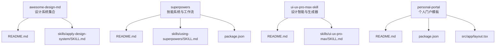
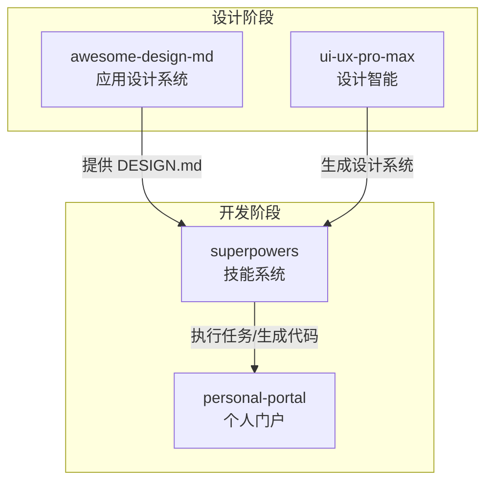
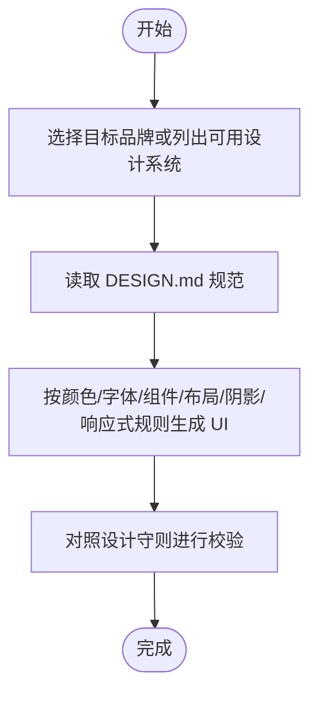
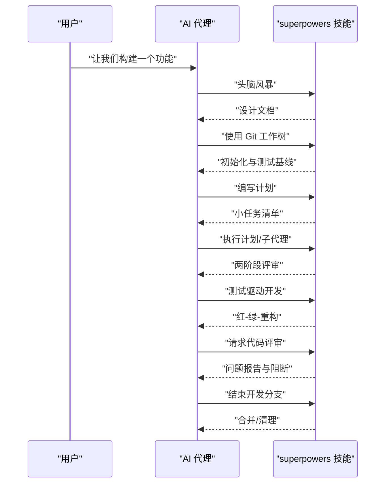
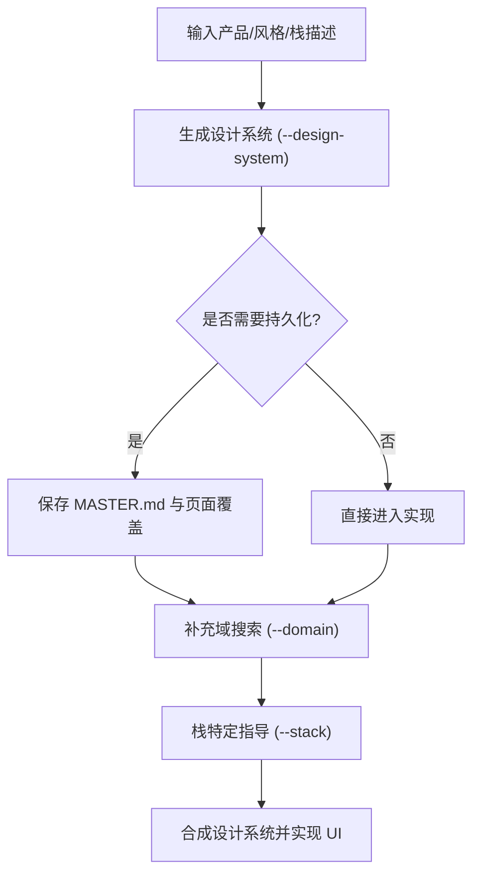
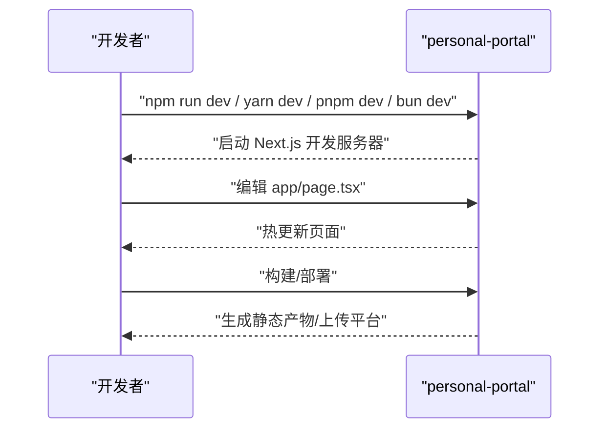
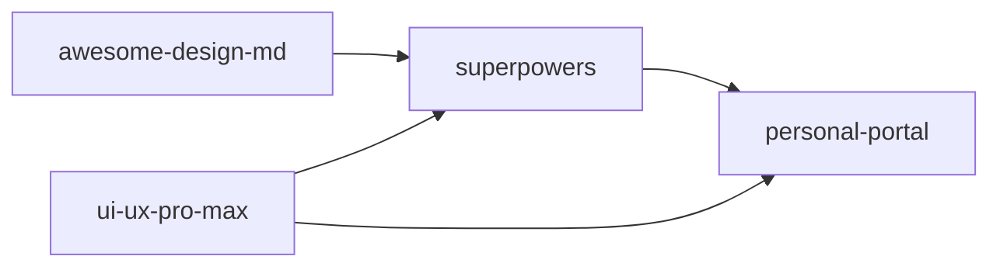

# 快速开始

<cite>
**本文引用的文件**
- [awesome-design-md/README.md](file://awesome-design-md/README.md)
- [awesome-design-md/skills/apply-design-system/SKILL.md](file://awesome-design-md/skills/apply-design-system/SKILL.md)
- [superpowers/README.md](file://superpowers/README.md)
- [superpowers/skills/using-superpowers/SKILL.md](file://superpowers/skills/using-superpowers/SKILL.md)
- [superpowers/package.json](file://superpowers/package.json)
- [ui-ux-pro-max-skill/README.md](file://ui-ux-pro-max-skill/README.md)
- [ui-ux-pro-max-skill/skills/ui-ux-pro-max/SKILL.md](file://ui-ux-pro-max-skill/skills/ui-ux-pro-max/SKILL.md)
- [personal-portal/README.md](file://personal-portal/README.md)
- [personal-portal/package.json](file://personal-portal/package.json)
- [personal-portal/src/app/layout.tsx](file://personal-portal/src/app/layout.tsx)
</cite>

## 目录
1. [简介](#简介)
2. [项目结构](#项目结构)
3. [核心组件](#核心组件)
4. [架构总览](#架构总览)
5. [详细组件分析](#详细组件分析)
6. [依赖关系分析](#依赖关系分析)
7. [性能考虑](#性能考虑)
8. [故障排查指南](#故障排查指南)
9. [结论](#结论)
10. [附录](#附录)

## 简介
本指南面向希望在最短时间内上手使用多项目工具集的用户。工具集包含四个子项目：
- awesome-design-md：基于真实网站提取的 DESIGN.md 设计系统集合，可直接用于 AI 代理生成一致的 UI。
- superpowers：面向 AI 编码代理的“超能力”方法论与技能系统，覆盖从头脑风暴到测试驱动开发的完整流程。
- ui-ux-pro-max：AI 驱动的 UI/UX 设计智能，支持跨平台（Web、移动端、桌面端）的设计系统生成与实现建议。
- personal-portal：基于 Next.js 的个人门户模板，包含博客、项目与数据看板等模块。

本指南提供环境配置要求、安装步骤与基本使用示例，并为每个子项目提供独立入门教程与常见问题解决方案。

## 项目结构
仓库采用按子项目划分的目录结构，每个子项目自包含文档、技能定义与示例资源。下图展示了四个子项目的顶层关系与入口说明。

图表来源
- [awesome-design-md/README.md:1-250](file://awesome-design-md/README.md#L1-L250)
- [superpowers/README.md:1-286](file://superpowers/README.md#L1-L286)
- [superpowers/package.json:1-24](file://superpowers/package.json#L1-L24)
- [ui-ux-pro-max-skill/README.md:1-649](file://ui-ux-pro-max-skill/README.md#L1-L649)
- [personal-portal/README.md:1-37](file://personal-portal/README.md#L1-L37)
- [personal-portal/package.json:1-32](file://personal-portal/package.json#L1-L32)
- [personal-portal/src/app/layout.tsx:1-57](file://personal-portal/src/app/layout.tsx#L1-L57)

章节来源
- [awesome-design-md/README.md:1-250](file://awesome-design-md/README.md#L1-L250)
- [superpowers/README.md:1-286](file://superpowers/README.md#L1-L286)
- [ui-ux-pro-max-skill/README.md:1-649](file://ui-ux-pro-max-skill/README.md#L1-L649)
- [personal-portal/README.md:1-37](file://personal-portal/README.md#L1-L37)

## 核心组件
- 设计系统应用（awesome-design-md）
  - 提供 75+ 品牌/平台的 DESIGN.md 设计语言文档，支持复制到项目根目录后由 AI 代理读取并生成一致 UI。
  - 可通过内置技能“应用设计系统”按品牌名或分类列表进行选择与应用。
- 超能力技能系统（superpowers）
  - 自动发现的 14 个技能（如头脑风暴、测试驱动开发、系统化调试等），覆盖从规划到完成的全流程。
  - 使用“使用超能力”技能建立对话框架，确保在任何响应前先检查并调用适用技能。
- 设计智能（ui-ux-pro-max）
  - 支持跨平台（React、Vue、Svelte、SwiftUI、Flutter、React Native、HTML+Tailwind 等）的设计系统生成与实现建议。
  - 内置搜索脚本与规则库，提供风格、配色、字体、布局、动画、表单与导航等维度的建议。
- 个人门户（personal-portal）
  - Next.js 模板，包含博客、仪表盘与项目展示页面，使用 TypeScript、TailwindCSS 与 Recharts 等生态。

章节来源
- [awesome-design-md/skills/apply-design-system/SKILL.md:1-139](file://awesome-design-md/skills/apply-design-system/SKILL.md#L1-L139)
- [superpowers/skills/using-superpowers/SKILL.md:1-63](file://superpowers/skills/using-superpowers/SKILL.md#L1-L63)
- [ui-ux-pro-max-skill/skills/ui-ux-pro-max/SKILL.md:1-680](file://ui-ux-pro-max-skill/skills/ui-ux-pro-max/SKILL.md#L1-L680)
- [personal-portal/package.json:1-32](file://personal-portal/package.json#L1-L32)

## 架构总览
下图展示了四个子项目在实际使用中的交互关系与典型工作流。

图表来源
- [awesome-design-md/skills/apply-design-system/SKILL.md:68-139](file://awesome-design-md/skills/apply-design-system/SKILL.md#L68-L139)
- [ui-ux-pro-max-skill/skills/ui-ux-pro-max/SKILL.md:302-451](file://ui-ux-pro-max-skill/skills/ui-ux-pro-max/SKILL.md#L302-L451)
- [superpowers/skills/using-superpowers/SKILL.md:18-48](file://superpowers/skills/using-superpowers/SKILL.md#L18-L48)

## 详细组件分析

### 子项目一：awesome-design-md（设计系统收集）
- 入门目标
  - 将任意品牌/平台的 DESIGN.md 复制到你的项目根目录，然后在与 AI 代理的对话中告知其使用该设计语言，即可生成一致的 UI。
- 安装与使用
  - 在你的项目根目录放置一个 DESIGN.md 文件（例如来自 awesome-design-md/design-md/<品牌>/DESIGN.md）。
  - 在与 AI 的对话中明确指出使用该设计语言，或使用“应用设计系统”技能并指定品牌名称。
- 技能要点
  - “应用设计系统”技能会读取对应品牌的完整设计规范（颜色、字体、组件样式、布局原则、阴影体系、响应式行为、代理提示指南等），并在生成 UI 时严格遵循。
  - 若用户请求列出可用设计系统，技能会输出分类清单并引导选择。
- 常见问题
  - 未读取完整 DESIGN.md 导致 UI 不一致：请确保在生成代码前完整阅读 DESIGN.md 并严格遵循各节规则。
  - 字体回退：若 DESIGN.md 中引用专有字体，请使用其提供的 Web 回退方案。
  - 颜色值差异：不同渲染上下文可能需要微调颜色值以保证对比度与一致性。

图表来源
- [awesome-design-md/skills/apply-design-system/SKILL.md:68-139](file://awesome-design-md/skills/apply-design-system/SKILL.md#L68-L139)

章节来源
- [awesome-design-md/README.md:228-250](file://awesome-design-md/README.md#L228-L250)
- [awesome-design-md/skills/apply-design-system/SKILL.md:1-139](file://awesome-design-md/skills/apply-design-system/SKILL.md#L1-L139)

### 子项目二：superpowers（AI 技能系统）
- 入门目标
  - 让 AI 代理自动遵循“超能力”工作流：先头脑风暴，再写计划，随后以子代理/并行代理的方式执行任务，期间穿插测试驱动开发与代码评审。
- 安装与使用
  - 根据你使用的编码代理（Claude Code、Antigravity、Codex、Cursor、Factory Droid、GitHub Copilot、Kimi Code、OpenCode、Pi 等）从官方市场或命令安装“superpowers”插件/包。
  - 在首次对话中调用“使用超能力”技能，建立对话框架：在任何响应或行动（包括澄清问题、探索代码库、查看文件）之前，必须先检查并调用适用技能。
- 工作流概览
  - 头脑风暴：提炼需求、探索替代方案、分段呈现设计并保存设计文档。
  - 使用 Git 工作树：创建隔离工作区分支，运行项目初始化与干净测试基线验证。
  - 写计划：将工作拆分为 2–5 分钟的小任务，每项包含精确文件路径、完整代码与验证步骤。
  - 执行计划：以子代理两阶段评审（符合规范 → 代码质量）或批量执行并设置人工检查点。
  - 测试驱动开发：红-绿-重构循环，删除测试前编写的代码。
  - 代码评审：在任务间进行，按严重性报告问题，关键问题阻断进度。
  - 结束开发分支：验证测试、合并/提 PR/保留/丢弃选项、清理工作树。
- 常见问题
  - Windows 上会话启动钩子需使用 Git Bash；可在安装说明中找到对应平台的注册与安装命令。
  - 插件更新通常自动发生，但某些代理需要手动更新或重新安装。

图表来源
- [superpowers/README.md:200-217](file://superpowers/README.md#L200-L217)
- [superpowers/skills/using-superpowers/SKILL.md:18-48](file://superpowers/skills/using-superpowers/SKILL.md#L18-L48)

章节来源
- [superpowers/README.md:24-286](file://superpowers/README.md#L24-L286)
- [superpowers/skills/using-superpowers/SKILL.md:1-63](file://superpowers/skills/using-superpowers/SKILL.md#L1-L63)
- [superpowers/package.json:1-24](file://superpowers/package.json#L1-L24)

### 子项目三：ui-ux-pro-max（设计生成器）
- 入门目标
  - 向 AI 描述你的产品类型、受众与风格关键词，获得即时生成的完整设计系统（含风格、配色、字体、布局、动画、图表与最佳实践），并据此生成高质量 UI。
- 安装与使用
  - 推荐使用 CLI 全局安装并为你的 AI 助手初始化技能（支持 Claude、Cursor、Windsurf、Antigravity、Codex CLI、Continue、Gemini CLI、OpenCode、Qoder、CodeBuddy、Droid、KiloCode、Warp、Augment 等）。
  - 或在支持的代理市场直接安装插件。
- 工作流
  - 分析需求：提取产品类型、目标受众、风格关键词与技术栈。
  - 生成设计系统：使用搜索脚本并传入 --design-system 获取综合推荐。
  - 持久化设计系统：使用 --persist 生成 MASTER.md 与页面级覆盖文件，支持层级检索。
  - 补充搜索：按需使用 --domain 查询风格、颜色、字体、图表、UX 最佳实践等。
  - 栈特定指导：使用 --stack 获取对应框架的最佳实践。
- 常见问题
  - Python 3.x 是搜索脚本的前置条件；Windows 用户需注意使用 python 命令而非 python3。
  - CLI 版本过旧可能导致卸载/更新命令未知，需先全局升级后再重试。
  - 若安装市场出现符号链接错误，优先使用 CLI 安装方式。

图表来源
- [ui-ux-pro-max-skill/README.md:367-456](file://ui-ux-pro-max-skill/README.md#L367-L456)
- [ui-ux-pro-max-skill/skills/ui-ux-pro-max/SKILL.md:337-451](file://ui-ux-pro-max-skill/skills/ui-ux-pro-max/SKILL.md#L337-L451)

章节来源
- [ui-ux-pro-max-skill/README.md:287-404](file://ui-ux-pro-max-skill/README.md#L287-L404)
- [ui-ux-pro-max-skill/skills/ui-ux-pro-max/SKILL.md:1-680](file://ui-ux-pro-max-skill/skills/ui-ux-pro-max/SKILL.md#L1-L680)

### 子项目四：personal-portal（个人门户）
- 入门目标
  - 快速启动个人门户，包含博客、仪表盘与项目展示页面，支持 RSS、站点地图与 SEO 元数据配置。
- 环境与依赖
  - Node.js 与包管理器（npm/yarn/pnpm/bun）。
  - Next.js 16、TypeScript、TailwindCSS 4、Recharts、Lucide React 等。
- 启动与开发
  - 运行开发服务器，访问本地 3000 端口查看结果。
  - 修改 app/page.tsx 即可快速迭代首页内容。
- 常见问题
  - 开发服务器无法启动：确认 Node.js 版本与依赖安装无误，尝试清除缓存后重装依赖。
  - 部署：可直接使用 Vercel 平台一键部署，或参考 Next.js 文档进行自托管。

图表来源
- [personal-portal/README.md:5-17](file://personal-portal/README.md#L5-L17)
- [personal-portal/package.json:1-32](file://personal-portal/package.json#L1-L32)
- [personal-portal/src/app/layout.tsx:1-57](file://personal-portal/src/app/layout.tsx#L1-L57)

章节来源
- [personal-portal/README.md:1-37](file://personal-portal/README.md#L1-L37)
- [personal-portal/package.json:1-32](file://personal-portal/package.json#L1-L32)
- [personal-portal/src/app/layout.tsx:1-57](file://personal-portal/src/app/layout.tsx#L1-L57)

## 依赖关系分析
- awesome-design-md 作为设计语言来源，被 superpowers 与 ui-ux-pro-max 在生成 UI 时引用。
- superpowers 为整体工作流引擎，贯穿从头脑风暴到测试与评审的全过程。
- ui-ux-pro-max 为设计智能，提供设计系统生成与实现建议，可独立使用或与 superpowers 协同。
- personal-portal 作为最终产物承载层，消费上述设计与工作流成果。

图表来源
- [awesome-design-md/skills/apply-design-system/SKILL.md:68-139](file://awesome-design-md/skills/apply-design-system/SKILL.md#L68-L139)
- [superpowers/skills/using-superpowers/SKILL.md:18-48](file://superpowers/skills/using-superpowers/SKILL.md#L18-L48)
- [ui-ux-pro-max-skill/skills/ui-ux-pro-max/SKILL.md:337-451](file://ui-ux-pro-max-skill/skills/ui-ux-pro-max/SKILL.md#L337-L451)

章节来源
- [awesome-design-md/skills/apply-design-system/SKILL.md:1-139](file://awesome-design-md/skills/apply-design-system/SKILL.md#L1-L139)
- [superpowers/skills/using-superpowers/SKILL.md:1-63](file://superpowers/skills/using-superpowers/SKILL.md#L1-L63)
- [ui-ux-pro-max-skill/skills/ui-ux-pro-max/SKILL.md:1-680](file://ui-ux-pro-max-skill/skills/ui-ux-pro-max/SKILL.md#L1-L680)

## 性能考虑
- 设计生成阶段
  - 使用 ui-ux-pro-max 的搜索脚本时，可通过 --max-length 控制输出截断，避免字段被截断影响理解。
- 开发体验
  - personal-portal 使用 Next.js App Router 与现代字体加载策略，建议在生产构建时启用代码分割与懒加载以优化首屏性能。
- 工作流效率
  - superpowers 的子代理并行执行与两阶段评审可显著缩短交付周期，但需合理拆分任务与设置检查点，避免过度并行导致上下文切换成本上升。

## 故障排查指南
- awesome-design-md
  - 问题：UI 不一致或颜色/字体不匹配
    - 解决：确保完整阅读 DESIGN.md 并严格遵循颜色、字体、组件、布局与响应式规则。
- superpowers
  - 问题：Windows 会话启动钩子报错
    - 解决：使用 Git Bash 运行会话启动钩子，或重新安装插件。
  - 问题：插件更新失败
    - 解决：根据所用代理的官方市场指引重新安装或更新。
- ui-ux-pro-max
  - 问题：uipro 命令未知或卸载失败
    - 解决：先升级全局安装版本，再重试卸载/更新。
  - 问题：Python 未找到
    - 解决：安装 Python 3.x，并在 Windows 使用 python 命令运行脚本。
  - 问题：市场安装报符号链接错误
    - 解决：改用 CLI 安装方式。
- personal-portal
  - 问题：开发服务器启动失败
    - 解决：检查 Node.js 版本与依赖安装，尝试清理缓存后重装依赖。
  - 问题：部署异常
    - 解决：参考 Next.js 部署文档或使用 Vercel 一键部署。

章节来源
- [ui-ux-pro-max-skill/README.md:564-633](file://ui-ux-pro-max-skill/README.md#L564-L633)
- [personal-portal/README.md:32-37](file://personal-portal/README.md#L32-L37)

## 结论
通过本快速开始指南，你可以：
- 在最短时间内完成环境准备与安装；
- 使用 awesome-design-md 为你的项目引入一致的设计语言；
- 使用 superpowers 的技能系统规范开发流程；
- 使用 ui-ux-pro-max 生成并落地专业级设计系统；
- 基于 personal-portal 快速搭建个人门户并上线。

建议在实际项目中结合四个子项目的能力，形成“设计语言 + 技能工作流 + 设计智能 + 门户承载”的完整闭环。

## 附录
- 快速命令索引
  - awesome-design-md：将 DESIGN.md 放入项目根目录，或使用“应用设计系统”技能按品牌名应用。
  - superpowers：在首次对话中调用“使用超能力”，随后按工作流逐步执行。
  - ui-ux-pro-max：使用 uipro 初始化技能，再通过搜索脚本生成设计系统并实现 UI。
  - personal-portal：运行开发服务器，修改页面后热更新，最后构建/部署。