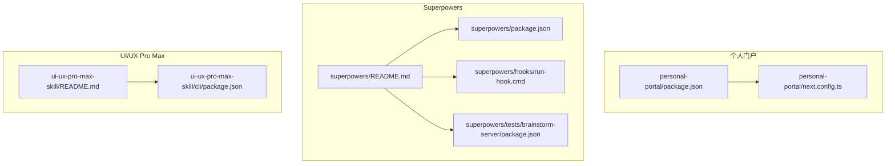
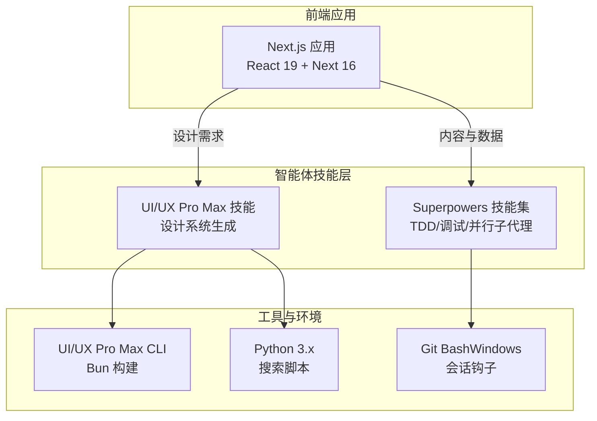
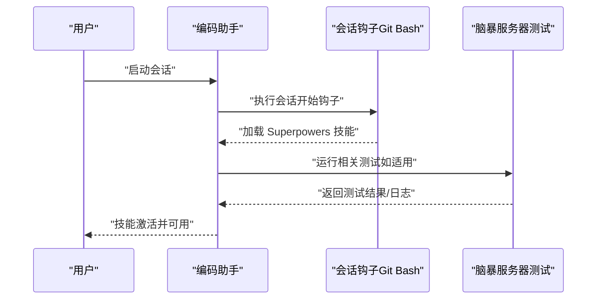
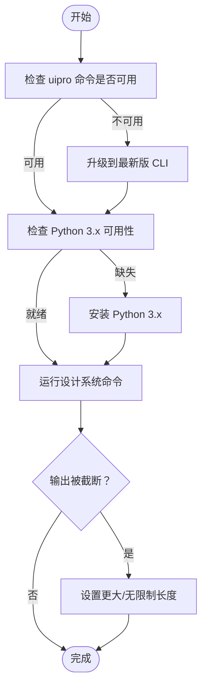
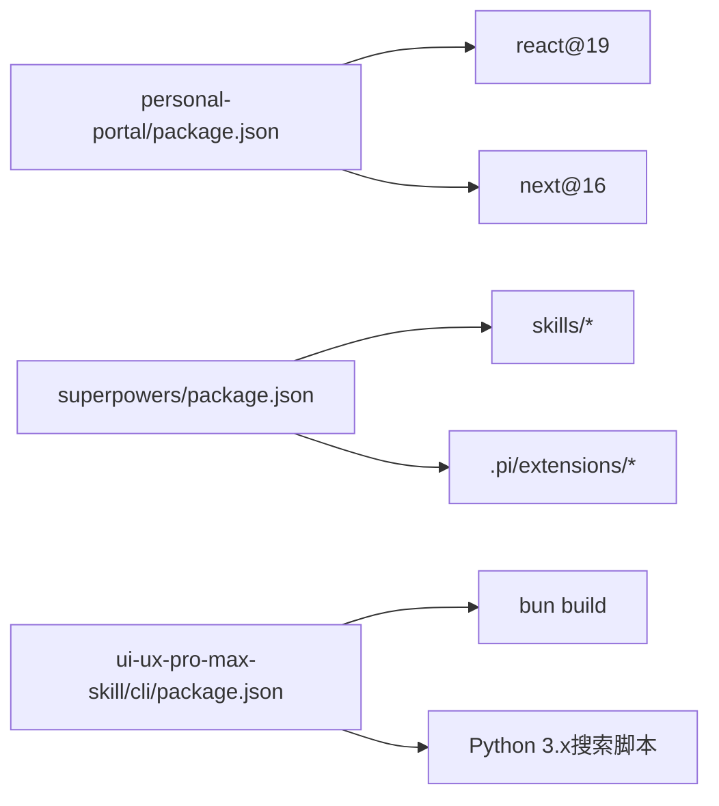

# 故障排除和常见问题

<cite>
**本文引用的文件**
- [README.md](file://README.md)
- [个人门户 package.json](file://personal-portal/package.json)
- [个人门户 next.config.ts](file://personal-portal/next.config.ts)
- [Superpowers 仓库 README](file://superpowers/README.md)
- [Superpowers 包配置](file://superpowers/package.json)
- [UI/UX Pro Max 仓库 README](file://ui-ux-pro-max-skill/README.md)
- [UI/UX Pro Max CLI 包配置](file://ui-ux-pro-max-skill/cli/package.json)
- [Superpowers 测试：脑暴服务器包](file://superpowers/tests/brainstorm-server/package.json)
- [Superpowers 钩子脚本（Windows）](file://superpowers/hooks/run-hook.cmd)
</cite>

## 目录
1. [简介](#简介)
2. [项目结构](#项目结构)
3. [核心组件](#核心组件)
4. [架构总览](#架构总览)
5. [详细组件分析](#详细组件分析)
6. [依赖关系分析](#依赖关系分析)
7. [性能考虑](#性能考虑)
8. [故障排除指南](#故障排除指南)
9. [结论](#结论)
10. [附录](#附录)

## 简介
本指南面向在多智能体开发与设计系统工作流中使用多个子项目的用户与维护者，覆盖安装失败、配置错误、运行时异常、性能优化、内存使用与并发处理最佳实践、跨平台兼容性、依赖冲突与版本不匹配、以及调试工具与日志分析方法。内容基于仓库中的实际配置与文档，帮助快速定位与解决问题。

## 项目结构
该仓库由三个主要子项目组成：
- 个人门户（Next.js 应用）
- Superpowers（多智能体技能与运行时）
- UI/UX Pro Max（设计系统生成与技能）

图表来源
- [个人门户 package.json:1-32](file://personal-portal/package.json#L1-L32)
- [个人门户 next.config.ts:1-8](file://personal-portal/next.config.ts#L1-L8)
- [Superpowers 仓库 README:1-286](file://superpowers/README.md#L1-L286)
- [Superpowers 包配置:1-24](file://superpowers/package.json#L1-L24)
- [Superpowers 钩子脚本（Windows）](file://superpowers/hooks/run-hook.cmd)
- [Superpowers 测试：脑暴服务器包:1-11](file://superpowers/tests/brainstorm-server/package.json#L1-L11)
- [UI/UX Pro Max 仓库 README:1-649](file://ui-ux-pro-max-skill/README.md#L1-L649)
- [UI/UX Pro Max CLI 包配置:1-52](file://ui-ux-pro-max-skill/cli/package.json#L1-L52)

章节来源
- [个人门户 package.json:1-32](file://personal-portal/package.json#L1-L32)
- [个人门户 next.config.ts:1-8](file://personal-portal/next.config.ts#L1-L8)
- [Superpowers 仓库 README:1-286](file://superpowers/README.md#L1-L286)
- [Superpowers 包配置:1-24](file://superpowers/package.json#L1-L24)
- [UI/UX Pro Max 仓库 README:1-649](file://ui-ux-pro-max-skill/README.md#L1-L649)
- [UI/UX Pro Max CLI 包配置:1-52](file://ui-ux-pro-max-skill/cli/package.json#L1-L52)
- [Superpowers 测试：脑暴服务器包:1-11](file://superpowers/tests/brainstorm-server/package.json#L1-L11)
- [Superpowers 钩子脚本（Windows）](file://superpowers/hooks/run-hook.cmd)

## 核心组件
- 个人门户（Next.js）：提供博客、仪表盘、项目展示等内容页面，使用 React 19 与 Next 16。
- Superpowers：为多智能体提供可组合技能（如 TDD、系统化调试、并行子代理等），支持多种编码助手平台；Windows 环境需要 Git Bash 执行会话钩子。
- UI/UX Pro Max：通过设计系统搜索与推理引擎生成定制化 UI/UX 设计方案，CLI 使用 Bun 构建，Python 3.x 用于搜索脚本。

章节来源
- [个人门户 package.json:11-30](file://personal-portal/package.json#L11-L30)
- [个人门户 next.config.ts:1-8](file://personal-portal/next.config.ts#L1-L8)
- [Superpowers 仓库 README:24-286](file://superpowers/README.md#L24-L286)
- [Superpowers 包配置:1-24](file://superpowers/package.json#L1-L24)
- [UI/UX Pro Max 仓库 README:1-649](file://ui-ux-pro-max-skill/README.md#L1-L649)
- [UI/UX Pro Max CLI 包配置:1-52](file://ui-ux-pro-max-skill/cli/package.json#L1-L52)

## 架构总览
下图展示了三类组件之间的交互关系与职责边界：

图表来源
- [个人门户 package.json:11-30](file://personal-portal/package.json#L11-L30)
- [Superpowers 仓库 README:12-13](file://superpowers/README.md#L12-L13)
- [UI/UX Pro Max 仓库 README:9-10](file://ui-ux-pro-max-skill/README.md#L9-L10)
- [UI/UX Pro Max CLI 包配置:14-16](file://ui-ux-pro-max-skill/cli/package.json#L14-L16)

## 详细组件分析

### 个人门户（Next.js）故障排除
- 常见问题
  - 开发/构建失败：检查 Node 版本与依赖一致性，确认 Next 配置未被意外修改。
  - 路由或静态资源异常：核对页面路由命名与路径策略。
- 排查步骤
  - 清理缓存与重新安装依赖后重试。
  - 检查 next.config.ts 是否存在自定义配置导致的构建差异。
  - 使用 Next 的内置脚本进行本地验证。
- 性能与并发
  - 合理拆分页面与组件，避免一次性加载过多数据。
  - 利用 React Suspense 与渐进式渲染提升首屏体验。
  - 控制第三方包体积，按需引入。

章节来源
- [个人门户 package.json:5-10](file://personal-portal/package.json#L5-L10)
- [个人门户 next.config.ts:1-8](file://personal-portal/next.config.ts#L1-L8)

### Superpowers 故障排除
- 安装与兼容性
  - 平台差异：不同编码助手的插件市场安装方式不同，遵循对应平台的安装流程。
  - Windows 兼容性：会话启动钩子使用 Bash 脚本，需在 Windows 上安装并使用 Git Bash。
- 运行时异常
  - 脑暴服务器相关测试脚本：若出现生命周期或协议问题，参考脑暴服务器测试脚本与启动/停止脚本。
- 调试与日志
  - 使用平台提供的日志与调试能力，结合测试脚本定位问题。
  - 关注会话钩子执行状态与权限问题。

图表来源
- [Superpowers 仓库 README:12-13](file://superpowers/README.md#L12-L13)
- [Superpowers 钩子脚本（Windows）](file://superpowers/hooks/run-hook.cmd)
- [Superpowers 测试：脑暴服务器包:4-6](file://superpowers/tests/brainstorm-server/package.json#L4-L6)

章节来源
- [Superpowers 仓库 README:44-198](file://superpowers/README.md#L44-L198)
- [Superpowers 包配置:1-24](file://superpowers/package.json#L1-L24)
- [Superpowers 测试：脑暴服务器包:1-11](file://superpowers/tests/brainstorm-server/package.json#L1-L11)
- [Superpowers 钩子脚本（Windows）](file://superpowers/hooks/run-hook.cmd)

### UI/UX Pro Max 故障排除
- 安装与更新
  - CLI 版本过旧导致命令不可用：升级到最新版本后再尝试卸载/更新。
  - 商店安装失败（符号链接问题）：改用 CLI 安装。
  - 权限问题：使用节点版本管理器或以管理员权限安装。
- Python 依赖
  - 搜索脚本需要 Python 3.x，确保已正确安装并加入 PATH。
- 输出截断
  - 使用最大长度参数调整输出截断限制。
- 性能与并发
  - CLI 使用 Bun 构建，注意磁盘与网络 I/O；批量同步资产前先校验。
  - Python 脚本并行搜索时注意系统资源占用，避免同时运行过多实例。

图表来源
- [UI/UX Pro Max 仓库 README:564-633](file://ui-ux-pro-max-skill/README.md#L564-L633)
- [UI/UX Pro Max CLI 包配置:13-20](file://ui-ux-pro-max-skill/cli/package.json#L13-L20)

章节来源
- [UI/UX Pro Max 仓库 README:564-633](file://ui-ux-pro-max-skill/README.md#L564-L633)
- [UI/UX Pro Max CLI 包配置:13-20](file://ui-ux-pro-max-skill/cli/package.json#L13-L20)

## 依赖关系分析
- 个人门户
  - 依赖 Next 16 与 React 19，需关注版本兼容性与类型声明。
- Superpowers
  - 插件与技能结构由包配置定义，Windows 环境依赖 Git Bash。
- UI/UX Pro Max
  - CLI 使用 Bun 构建，Python 3.x 用于搜索脚本；资产同步与类型检查在开发阶段执行。

图表来源
- [个人门户 package.json:11-30](file://personal-portal/package.json#L11-L30)
- [Superpowers 包配置:15-22](file://superpowers/package.json#L15-L22)
- [UI/UX Pro Max CLI 包配置:14-16](file://ui-ux-pro-max-skill/cli/package.json#L14-L16)

章节来源
- [个人门户 package.json:11-30](file://personal-portal/package.json#L11-L30)
- [Superpowers 包配置:1-24](file://superpowers/package.json#L1-L24)
- [UI/UX Pro Max CLI 包配置:1-52](file://ui-ux-pro-max-skill/cli/package.json#L1-L52)

## 性能考虑
- 内存使用优化
  - 限制一次性加载的数据量，采用分页或懒加载策略。
  - 对于 Python 脚本，避免在单次调用中处理超大数据集，必要时拆分为多次调用。
- 并发处理最佳实践
  - CLI 批量同步资产时，先执行校验再构建，减少重复 I/O。
  - 在多智能体场景下，合理划分任务粒度，避免过度并行导致资源争用。
- 缓存与增量更新
  - 利用平台提供的缓存机制与增量更新能力，减少重复计算与下载。

## 故障排除指南
- 安装失败
  - 个人门户：清理缓存后重装依赖，确认 Node 版本满足要求。
  - Superpowers：根据平台选择正确的安装方式；Windows 使用 Git Bash。
  - UI/UX Pro Max：优先使用 CLI 安装；升级 CLI 至最新版本；确保 Python 3.x 可用。
- 配置错误
  - 个人门户：next.config.ts 保持默认或仅添加必要配置，避免破坏构建链路。
  - Superpowers：确认会话钩子路径与权限，避免因权限不足导致技能未加载。
  - UI/UX Pro Max：CLI 安装目录与当前工作目录一致，或使用全局安装选项。
- 运行时异常
  - 个人门户：启用最小复现，逐步移除第三方依赖定位问题。
  - Superpowers：查看脑暴服务器测试脚本输出，核对 WebSocket 协议与生命周期。
  - UI/UX Pro Max：增大输出长度参数，检查 Python 环境变量与路径。
- 跨平台兼容性
  - Windows：使用 Git Bash 执行 Bash 钩子；注意路径分隔符与大小写敏感性。
  - macOS/Linux：确保可执行权限与环境变量正确。
- 依赖冲突与版本不匹配
  - 统一管理 Node 与 Python 版本，避免全局与局部版本混用。
  - 使用包管理器锁定版本，定期同步上游变更。
- 调试工具与日志分析
  - 个人门户：利用 Next 内置日志与浏览器开发者工具。
  - Superpowers：结合平台日志与测试脚本输出定位问题。
  - UI/UX Pro Max：使用 CLI 的校验与同步脚本，配合 Python 日志排查。

章节来源
- [个人门户 package.json:5-10](file://personal-portal/package.json#L5-L10)
- [个人门户 next.config.ts:1-8](file://personal-portal/next.config.ts#L1-L8)
- [Superpowers 仓库 README:12-13](file://superpowers/README.md#L12-L13)
- [UI/UX Pro Max 仓库 README:564-633](file://ui-ux-pro-max-skill/README.md#L564-L633)
- [UI/UX Pro Max CLI 包配置:13-20](file://ui-ux-pro-max-skill/cli/package.json#L13-L20)
- [Superpowers 测试：脑暴服务器包:4-6](file://superpowers/tests/brainstorm-server/package.json#L4-L6)

## 结论
通过统一的安装流程、严格的版本管理与平台适配、完善的调试与日志分析手段，可以有效降低多智能体与设计系统工作流中的故障率。建议在团队内建立标准化的安装与更新流程，并定期回顾与优化性能与稳定性。

## 附录
- 快速检查清单
  - 个人门户：Node/Next/React 版本一致；next.config.ts 无破坏性改动。
  - Superpowers：平台安装方式正确；Windows 使用 Git Bash；钩子可执行。
  - UI/UX Pro Max：CLI 最新版；Python 3.x 就绪；输出长度参数合理。
- 常用命令索引
  - 个人门户：dev/build/start/lint
  - Superpowers：会话钩子脚本与测试脚本
  - UI/UX Pro Max：uipro init/update/uninstall/versions