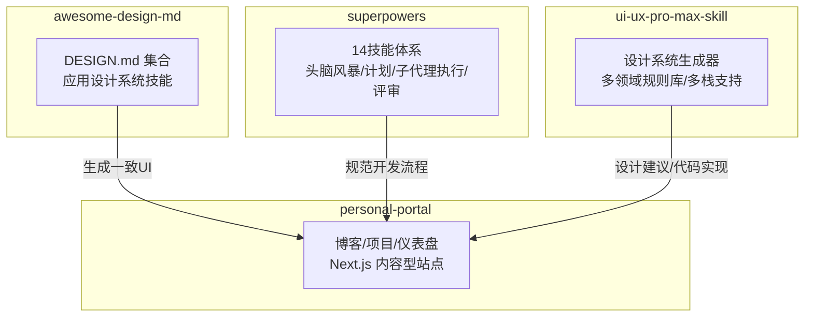
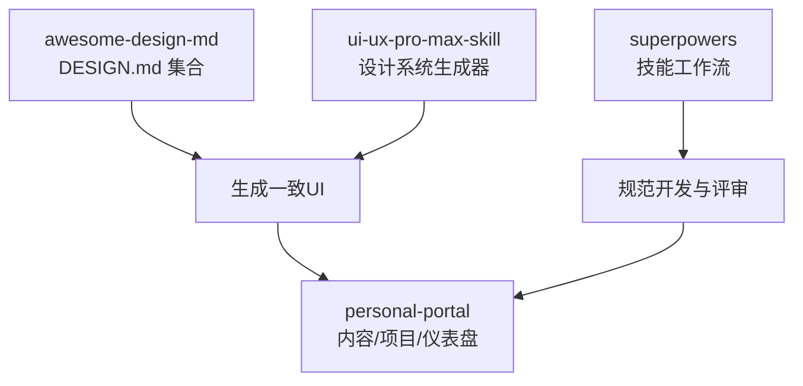
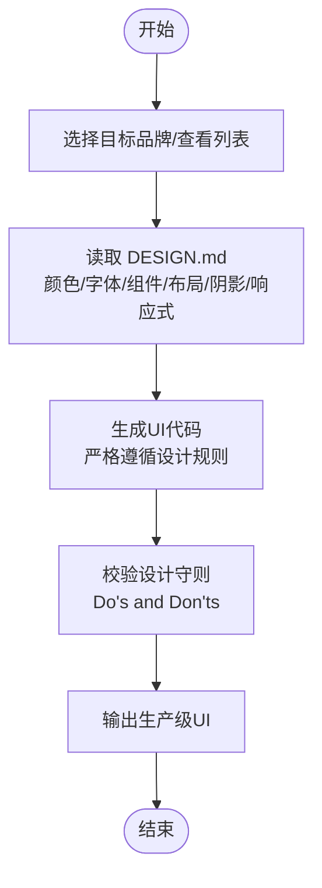
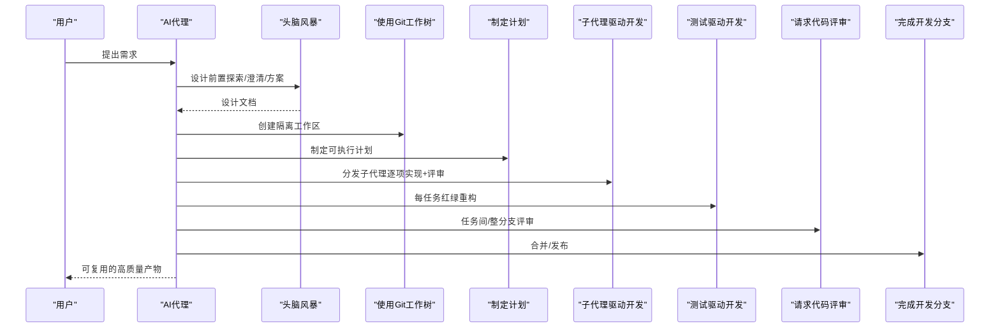
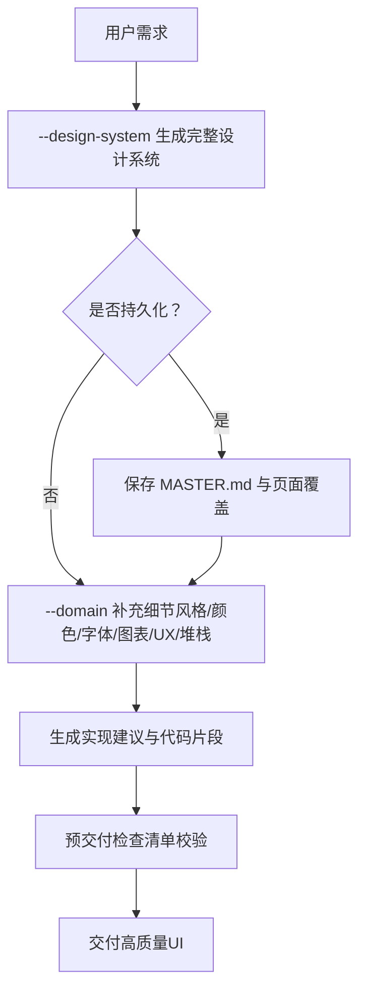
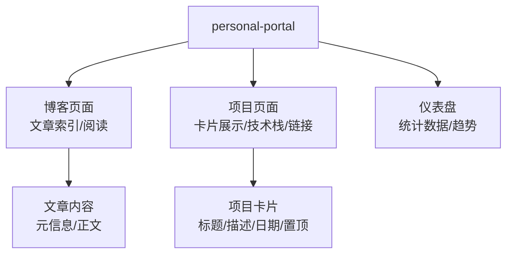
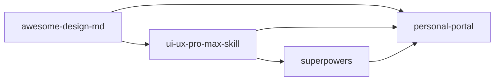

# 应用场景

<cite>
**本文引用的文件**
- [awesome-design-md/README.md](file://awesome-design-md/README.md)
- [awesome-design-md/skills/apply-design-system/SKILL.md](file://awesome-design-md/skills/apply-design-system/SKILL.md)
- [awesome-design-md/design-md/airbnb/DESIGN.md](file://awesome-design-md/design-md/airbnb/DESIGN.md)
- [awesome-design-md/design-md/stripe/DESIGN.md](file://awesome-design-md/design-md/stripe/DESIGN.md)
- [superpowers/README.md](file://superpowers/README.md)
- [superpowers/skills/using-superpowers/SKILL.md](file://superpowers/skills/using-superpowers/SKILL.md)
- [superpowers/skills/subagent-driven-development/SKILL.md](file://superpowers/skills/subagent-driven-development/SKILL.md)
- [superpowers/skills/brainstorming/SKILL.md](file://superpowers/skills/brainstorming/SKILL.md)
- [ui-ux-pro-max-skill/README.md](file://ui-ux-pro-max-skill/README.md)
- [ui-ux-pro-max-skill/skills/ui-ux-pro-max/SKILL.md](file://ui-ux-pro-max-skill/skills/ui-ux-pro-max/SKILL.md)
- [personal-portal/README.md](file://personal-portal/README.md)
- [personal-portal/content/projects/dataviz.md](file://personal-portal/content/projects/dataviz.md)
- [personal-portal/content/projects/task-flow.md](file://personal-portal/content/projects/task-flow.md)
</cite>

## 目录
1. [引言](#引言)
2. [项目结构](#项目结构)
3. [核心组件](#核心组件)
4. [架构总览](#架构总览)
5. [详细组件分析](#详细组件分析)
6. [依赖关系分析](#依赖关系分析)
7. [性能考量](#性能考量)
8. [故障排查指南](#故障排查指南)
9. [结论](#结论)
10. [附录](#附录)

## 引言
本文件聚焦于四个项目的实际应用场景与使用案例，阐述其在真实工作流中的价值与落地方式：
- awesome-design-md：通过标准化的设计系统（DESIGN.md）驱动AI生成一致、可复用的界面，加速设计系统落地与规模化产出。
- superpowers：以“技能”为单位的工程方法论，结合子代理执行与评审闭环，显著提升软件开发的稳定性与效率。
- ui-ux-pro-max-skill：面向智能设计生成的AI技能，提供从设计系统到代码实现的一站式推理与建议，覆盖多平台与多框架。
- personal-portal：个人知识管理门户，整合博客、项目展示与仪表盘，形成可扩展的知识与作品集中心。

## 项目结构
四个项目分别围绕“设计系统标准化”“AI辅助开发”“智能设计生成”“个人知识管理”四个维度组织，具备清晰的入口与可扩展能力：
- awesome-design-md：提供75+品牌/平台的DESIGN.md集合与“应用设计系统”技能，便于直接套用或二次加工。
- superpowers：包含14个可自动触发的技能，覆盖从头脑风暴、计划制定到子代理执行与评审的完整开发闭环。
- ui-ux-pro-max-skill：内置设计系统生成器与多领域规则库，支持CLI与技能模式双入口，覆盖Web/移动端与主流技术栈。
- personal-portal：基于Next.js的个人站点，内容型页面与项目卡片构成知识与作品集展示的基础。

**图表来源**
- [awesome-design-md/README.md:1-250](file://awesome-design-md/README.md#L1-L250)
- [superpowers/README.md:1-286](file://superpowers/README.md#L1-L286)
- [ui-ux-pro-max-skill/README.md:1-649](file://ui-ux-pro-max-skill/README.md#L1-L649)
- [personal-portal/README.md:1-37](file://personal-portal/README.md#L1-L37)

**章节来源**
- [awesome-design-md/README.md:1-250](file://awesome-design-md/README.md#L1-L250)
- [superpowers/README.md:1-286](file://superpowers/README.md#L1-L286)
- [ui-ux-pro-max-skill/README.md:1-649](file://ui-ux-pro-max-skill/README.md#L1-L649)
- [personal-portal/README.md:1-37](file://personal-portal/README.md#L1-L37)

## 核心组件
- awesome-design-md
  - DESIGN.md集合：覆盖AI/LLM平台、开发者工具、后端/DevOps、生产力/SaaS、设计/创意工具、金融科技/加密、电商/零售、媒体/消费科技、汽车、复古Web等类别，每个文件包含视觉主题、色彩、字体、组件样式、布局原则、深度与高程、响应式行为与提示指南。
  - 应用设计系统技能：支持按品牌名或“list”列出可用设计系统，读取对应DESIGN.md并严格遵循颜色、字体、组件、布局、阴影与响应式规则生成生产级UI代码。
- superpowers
  - 基础工作流：头脑风暴 → 使用Git工作树 → 制定计划 → 子代理驱动开发/批量执行 → 测试驱动开发 → 请求代码评审 → 完成开发分支。
  - 关键技能：using-superpowers（规则与优先级）、brainstorming（设计前置）、subagent-driven-development（任务级评审闭环）。
- ui-ux-pro-max-skill
  - 设计系统生成器：基于产品类型、风格、配色、落地页模式、字体搭配等进行多维搜索与推理，输出完整的风格、配色、字体、效果与反模式清单，并提供预交付检查清单。
  - 多栈支持：React、Next.js、Vue、Svelte、SwiftUI、React Native、Flutter、HTML+Tailwind等。
- personal-portal
  - 内容与项目：博客文章、项目介绍（含技术栈、链接、特色日期等），仪表盘统计等。
  - 技术基础：Next.js App Router、Geist字体优化、Tailwind CSS等。

**章节来源**
- [awesome-design-md/skills/apply-design-system/SKILL.md:1-139](file://awesome-design-md/skills/apply-design-system/SKILL.md#L1-L139)
- [awesome-design-md/design-md/airbnb/DESIGN.md:1-546](file://awesome-design-md/design-md/airbnb/DESIGN.md#L1-L546)
- [awesome-design-md/design-md/stripe/DESIGN.md:1-200](file://awesome-design-md/design-md/stripe/DESIGN.md#L1-L200)
- [superpowers/README.md:200-286](file://superpowers/README.md#L200-L286)
- [superpowers/skills/using-superpowers/SKILL.md:1-63](file://superpowers/skills/using-superpowers/SKILL.md#L1-L63)
- [superpowers/skills/brainstorming/SKILL.md:1-160](file://superpowers/skills/brainstorming/SKILL.md#L1-L160)
- [superpowers/skills/subagent-driven-development/SKILL.md:1-419](file://superpowers/skills/subagent-driven-development/SKILL.md#L1-L419)
- [ui-ux-pro-max-skill/skills/ui-ux-pro-max/SKILL.md:1-680](file://ui-ux-pro-max-skill/skills/ui-ux-pro-max/SKILL.md#L1-L680)
- [personal-portal/content/projects/dataviz.md:1-25](file://personal-portal/content/projects/dataviz.md#L1-L25)
- [personal-portal/content/projects/task-flow.md:1-25](file://personal-portal/content/projects/task-flow.md#L1-L25)

## 架构总览
下图展示了四类工具在典型工作流中的协同关系：awesome-design-md提供统一的设计语言输入；superpowers确保开发过程的规范化与质量门禁；ui-ux-pro-max-skill在设计阶段提供智能建议与生成；personal-portal承载最终成果与知识沉淀。

**图表来源**
- [awesome-design-md/README.md:228-250](file://awesome-design-md/README.md#L228-L250)
- [superpowers/README.md:200-217](file://superpowers/README.md#L200-L217)
- [ui-ux-pro-max-skill/README.md:405-412](file://ui-ux-pro-max-skill/README.md#L405-L412)
- [personal-portal/README.md:1-37](file://personal-portal/README.md#L1-L37)

## 详细组件分析

### awesome-design-md：设计系统标准化
- 场景定位
  - 将品牌/平台的视觉语言固化为DESIGN.md，供AI代理在生成UI时遵循，避免风格漂移与一致性问题。
  - 适用于需要快速复制某品牌风格（如Stripe、Linear、Vercel、Apple等）的界面需求。
- 典型工作流
  - 选择目标品牌 → 读取对应DESIGN.md → 生成UI代码 → 校验“Do’s and Don’ts” → 输出生产级产物。
- 最佳实践
  - 优先使用仓库内置的75+设计系统，必要时基于现有DESIGN.md进行微调。
  - 严格遵循颜色、字体、组件、布局、阴影与响应式规则，避免表面化实现。
- 成功案例
  - Airbnb设计系统：纯白画布、深近黑文字、单一强调色Rausch、软圆角、密集卡片网格、单层阴影等特征被完整映射到组件与布局中。
  - Stripe设计系统：深海军蓝主色、电光靛青强调色、负间距标题、等宽数字体、胶囊按钮、浅色/深色两套卡片等特征清晰体现。
- 效果对比
  - 未使用设计系统：风格不一致、品牌感弱、可维护性差。
  - 使用设计系统：风格统一、品牌识别度高、组件复用性强、开发效率提升。

**图表来源**
- [awesome-design-md/skills/apply-design-system/SKILL.md:68-139](file://awesome-design-md/skills/apply-design-system/SKILL.md#L68-L139)
- [awesome-design-md/design-md/airbnb/DESIGN.md:329-546](file://awesome-design-md/design-md/airbnb/DESIGN.md#L329-L546)
- [awesome-design-md/design-md/stripe/DESIGN.md:1-200](file://awesome-design-md/design-md/stripe/DESIGN.md#L1-L200)

**章节来源**
- [awesome-design-md/README.md:228-250](file://awesome-design-md/README.md#L228-L250)
- [awesome-design-md/skills/apply-design-system/SKILL.md:17-139](file://awesome-design-md/skills/apply-design-system/SKILL.md#L17-L139)
- [awesome-design-md/design-md/airbnb/DESIGN.md:1-546](file://awesome-design-md/design-md/airbnb/DESIGN.md#L1-L546)
- [awesome-design-md/design-md/stripe/DESIGN.md:1-200](file://awesome-design-md/design-md/stripe/DESIGN.md#L1-L200)

### superpowers：AI辅助开发的工程方法论
- 场景定位
  - 在AI编码代理中引入可组合的“技能”，自动触发设计、计划、评审与合并等环节，降低试错成本，提升交付质量。
- 典型工作流
  - 头脑风暴（设计前置） → 使用Git工作树隔离开发 → 制定计划（小步快跑） → 子代理驱动开发（每任务独立上下文+评审） → 测试驱动开发（红绿重构） → 请求代码评审 → 完成开发分支。
- 最佳实践
  - 任何任务都必须先触发相关技能，不可跳过设计与评审环节。
  - 子代理按任务分发，实现“无上下文污染”的并行安全执行。
  - 明确模型选择策略：机械实现用便宜模型，集成判断用标准模型，架构设计用最强模型。
- 成功案例
  - 子代理驱动开发：针对独立任务派发实现子代理，完成后生成差异包并由任务评审子代理进行“规范符合+代码质量”双重评审，最终整分支评审，确保高质量与快速迭代。
  - 规则优先：using-superpowers强调“若存在技能适用，必须先触发技能”，并通过红灯清单避免常见误区。
- 效果对比
  - 未使用技能：流程随意、评审缺失、质量不稳定。
  - 使用技能：流程稳定、评审闭环、交付可控。

**图表来源**
- [superpowers/README.md:200-217](file://superpowers/README.md#L200-L217)
- [superpowers/skills/brainstorming/SKILL.md:34-59](file://superpowers/skills/brainstorming/SKILL.md#L34-L59)
- [superpowers/skills/subagent-driven-development/SKILL.md:47-83](file://superpowers/skills/subagent-driven-development/SKILL.md#L47-L83)
- [superpowers/skills/using-superpowers/SKILL.md:18-28](file://superpowers/skills/using-superpowers/SKILL.md#L18-L28)

**章节来源**
- [superpowers/README.md:200-286](file://superpowers/README.md#L200-L286)
- [superpowers/skills/using-superpowers/SKILL.md:1-63](file://superpowers/skills/using-superpowers/SKILL.md#L1-L63)
- [superpowers/skills/brainstorming/SKILL.md:1-160](file://superpowers/skills/brainstorming/SKILL.md#L1-L160)
- [superpowers/skills/subagent-driven-development/SKILL.md:1-419](file://superpowers/skills/subagent-driven-development/SKILL.md#L1-L419)

### ui-ux-pro-max-skill：智能设计生成
- 场景定位
  - 面向UI/UX的智能设计助手，自动匹配产品类型、风格、配色、字体与落地页模式，输出完整设计系统与实现建议，覆盖Web/移动端与主流技术栈。
- 典型工作流
  - 用户提出需求 → 自动生成设计系统（模式+风格+配色+字体+效果+反模式） → 可选持久化（Master+页面覆盖） → 补充域搜索（风格/颜色/字体/图表/UX/堆栈） → 生成实现建议与代码片段。
- 最佳实践
  - 先用--design-system获得完整推荐，再用--domain深入细节。
  - 结合预交付检查清单（无障碍、触控交互、性能、布局、排版、动画、表单反馈、导航模式、图表数据）进行最终校验。
  - 多栈适配：根据项目框架选择对应堆栈指南（React/Next.js/Vue/Svelte/SwiftUI/Flutter等）。
- 成功案例
  - “美容SPA”案例：生成“软UI演化”风格、柔和粉/ sage绿/金主色、优雅衬线+现代无衬线字体、轻柔阴影与平滑过渡、避免霓虹/暗色/AI紫粉渐变等反模式。
  - “AI搜索主页”案例：现代/极简/内容优先/深色模式风格，结合Next.js实现建议与加载动画、无障碍与触控目标等UX要点。
- 效果对比
  - 未使用智能生成：风格不统一、配色与字体不协调、UX细节缺失。
  - 使用智能生成：风格明确、配色与字体匹配产品属性、UX与可访问性兼顾、跨平台一致性增强。

**图表来源**
- [ui-ux-pro-max-skill/README.md:50-140](file://ui-ux-pro-max-skill/README.md#L50-L140)
- [ui-ux-pro-max-skill/skills/ui-ux-pro-max/SKILL.md:353-451](file://ui-ux-pro-max-skill/skills/ui-ux-pro-max/SKILL.md#L353-L451)

**章节来源**
- [ui-ux-pro-max-skill/README.md:1-649](file://ui-ux-pro-max-skill/README.md#L1-L649)
- [ui-ux-pro-max-skill/skills/ui-ux-pro-max/SKILL.md:1-680](file://ui-ux-pro-max-skill/skills/ui-ux-pro-max/SKILL.md#L1-L680)

### personal-portal：个人知识管理
- 场景定位
  - 以Next.js为基础的个人门户，承载博客、项目展示与仪表盘，形成知识沉淀与作品集中心。
- 典型工作流
  - 新增/编辑内容 → 本地开发预览 → 部署上线 → 通过仪表盘统计与外部链接归档。
- 最佳实践
  - 内容采用Markdown元信息（标题、描述、技术栈、链接、置顶日期等），便于统一展示与检索。
  - 项目卡片与博客页面分离，利于扩展与维护。
- 成功案例
  - DataViz：交互式数据可视化平台，支持多种图表与自定义仪表板，技术栈为React+D3.js+TypeScript+Vite。
  - TaskFlow：受Linear启发的任务管理应用，支持看板视图、快捷键与实时协作，前端采用Tailwind CSS实现暗色主题。
- 效果对比
  - 未集中管理：内容分散、查找困难、作品展示不足。
  - 集中门户：知识有序、作品可查、对外展示统一。

**图表来源**
- [personal-portal/README.md:1-37](file://personal-portal/README.md#L1-L37)
- [personal-portal/content/projects/dataviz.md:1-25](file://personal-portal/content/projects/dataviz.md#L1-L25)
- [personal-portal/content/projects/task-flow.md:1-25](file://personal-portal/content/projects/task-flow.md#L1-L25)

**章节来源**
- [personal-portal/README.md:1-37](file://personal-portal/README.md#L1-L37)
- [personal-portal/content/projects/dataviz.md:1-25](file://personal-portal/content/projects/dataviz.md#L1-L25)
- [personal-portal/content/projects/task-flow.md:1-25](file://personal-portal/content/projects/task-flow.md#L1-L25)

## 依赖关系分析
- awesome-design-md与ui-ux-pro-max-skill
  - 两者均以“设计系统”为核心，前者提供品牌级设计语言，后者提供智能生成与多栈适配，可互补使用：前者用于品牌复刻，后者用于快速生成与优化。
- superpowers与ui-ux-pro-max-skill
  - superpowers提供工程流程保障，ui-ux-pro-max-skill提供设计决策与实现建议，二者结合可在保证质量的同时加速交付。
- personal-portal与awesome-design-md
  - awesome-design-md可直接为personal-portal的UI生成提供设计语言输入，确保门户风格统一、品牌一致。

**图表来源**
- [awesome-design-md/README.md:228-250](file://awesome-design-md/README.md#L228-L250)
- [ui-ux-pro-max-skill/README.md:405-412](file://ui-ux-pro-max-skill/README.md#L405-L412)
- [superpowers/README.md:200-217](file://superpowers/README.md#L200-L217)

**章节来源**
- [awesome-design-md/README.md:228-250](file://awesome-design-md/README.md#L228-L250)
- [superpowers/README.md:200-217](file://superpowers/README.md#L200-L217)
- [ui-ux-pro-max-skill/README.md:405-412](file://ui-ux-pro-max-skill/README.md#L405-L412)

## 性能考量
- awesome-design-md
  - 使用DESIGN.md作为设计输入，避免复杂解析与配置开销，直接指导生成，减少LLM理解偏差与重复工作。
- superpowers
  - 子代理按任务分发，避免上下文污染与冲突；模型选择策略降低整体成本；评审闭环减少后期返工。
- ui-ux-pro-max-skill
  - 多维搜索与推理需Python环境支持；建议合理设置--max-length与--domain参数，控制输出长度与范围，提升交互效率。
- personal-portal
  - Next.js App Router与Geist字体优化有助于首屏性能；项目卡片与博客页面分离有利于缓存与增量更新。

[本节为通用指导，无需特定文件引用]

## 故障排查指南
- awesome-design-md
  - 若生成结果与目标品牌风格不符，检查DESIGN.md是否完整、颜色/字体/组件/布局/阴影/响应式规则是否严格遵循。
  - 如需调整，参考贡献指南进行修正并提交PR。
- superpowers
  - 若子代理无法推进，检查BLOCKED原因：上下文不足、模型能力不足、任务过大或计划错误；按指引重分发或拆分任务。
  - 评审发现的问题必须修复并重新评审，不得跳过。
- ui-ux-pro-max-skill
  - Python未安装：根据操作系统安装Python 3.x；Windows使用python而非python3运行脚本。
  - CLI命令报错：更新至最新版本或使用npx临时执行；注意权限问题时使用sudo或Node版本管理器。
  - 设计系统输出截断：使用--max-length 0取消截断限制。
- personal-portal
  - 开发服务器启动失败：确认Node与包管理器版本，按README指引运行dev命令。
  - 部署问题：参考Next.js部署文档，确保环境变量与构建配置正确。

**章节来源**
- [awesome-design-md/CONTRIBUTING.md:1-26](file://awesome-design-md/CONTRIBUTING.md#L1-L26)
- [superpowers/skills/subagent-driven-development/Red Flags](file://superpowers/skills/subagent-driven-development/Red Flags)
- [ui-ux-pro-max-skill/README.md:564-633](file://ui-ux-pro-max-skill/README.md#L564-L633)
- [personal-portal/README.md:3-17](file://personal-portal/README.md#L3-L17)

## 结论
- awesome-design-md通过标准化设计系统，使AI生成的界面具备品牌一致性与可维护性。
- superpowers以技能为单位的工程方法论，将设计、计划、评审与合并纳入自动化闭环，显著提升交付质量与效率。
- ui-ux-pro-max-skill在设计阶段提供智能推理与实现建议，覆盖多平台与多框架，降低设计与实现成本。
- personal-portal作为知识与作品集的载体，借助上述工具实现内容与UI的统一与高效管理。
- 四者协同可覆盖从“设计语言—开发流程—智能生成—成果沉淀”的全链路，适合不同行业与角色在实际工作中持续迭代与规模化应用。

[本节为总结性内容，无需特定文件引用]

## 附录
- 行业与角色应用建议
  - 设计师：使用awesome-design-md快速复刻品牌风格，配合ui-ux-pro-max-skill进行风格与配色优化，最终在personal-portal沉淀案例。
  - 工程师：借助superpowers规范开发流程，子代理驱动开发与评审闭环，缩短交付周期并提升质量。
  - 产品经理：通过头脑风暴与设计系统生成，明确产品风格与用户体验路径，降低沟通成本。
  - 创业团队：以最小可行设计系统起步，快速验证市场，再逐步完善与扩展。

[本节为概念性内容，无需特定文件引用]